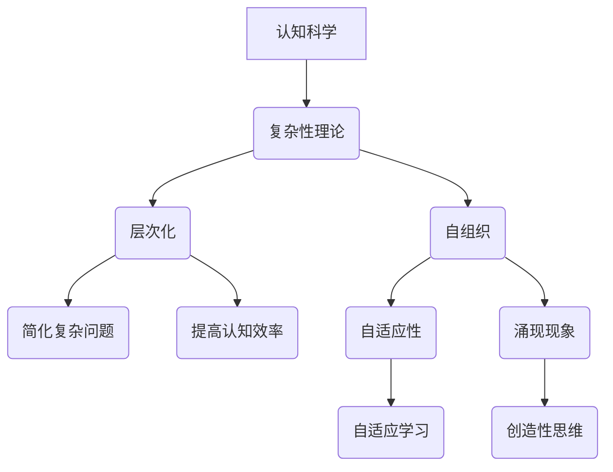

                 

# 认知过程中的简单与深刻

> **关键词：** 认知科学、复杂性理论、算法、数学模型、深度学习、人机交互

> **摘要：** 本文探讨了认知过程中简单与深刻的辩证关系。通过对认知过程的深入分析，文章揭示了复杂问题的简单化路径以及简单问题的深刻化机制。本文旨在帮助读者理解如何在复杂的认知环境中保持思维的清晰和深刻，并提出了若干实用策略。

## 1. 背景介绍

### 1.1 目的和范围

本文旨在探讨认知过程中的简单与深刻，这一主题在当今信息技术和认知科学领域中具有重要的研究价值和实际应用。通过分析认知过程的复杂性，我们希望能够找到简化问题的方法，并揭示简单问题的深层机制。本文将涵盖以下几个方面：

- 认知科学的基本概念和理论框架；
- 复杂问题的简单化策略；
- 简单问题的深刻化机制；
- 深度学习和人机交互中的简单与深刻关系；
- 实际应用场景和未来发展趋势。

### 1.2 预期读者

本文面向的读者群体包括：

- 认知科学家和心理学家；
- 人工智能和机器学习研究者；
- 软件工程师和技术架构师；
- 对认知科学和技术有浓厚兴趣的学术和行业从业者。

### 1.3 文档结构概述

本文结构如下：

- **第1章：背景介绍**：介绍本文的目的、范围、预期读者和文档结构；
- **第2章：核心概念与联系**：介绍认知科学和复杂性理论的核心概念，并使用Mermaid流程图展示其关联关系；
- **第3章：核心算法原理 & 具体操作步骤**：讲解核心算法的原理和具体操作步骤，并使用伪代码进行详细阐述；
- **第4章：数学模型和公式 & 详细讲解 & 举例说明**：介绍数学模型的基本原理，并使用latex格式给出详细公式和举例说明；
- **第5章：项目实战：代码实际案例和详细解释说明**：通过实际项目案例展示算法的应用，并对源代码进行详细解读；
- **第6章：实际应用场景**：探讨简单与深刻在现实世界中的应用场景；
- **第7章：工具和资源推荐**：推荐学习资源、开发工具和框架；
- **第8章：总结：未来发展趋势与挑战**：总结本文的主要观点和未来研究方向；
- **第9章：附录：常见问题与解答**：回答读者可能关心的问题；
- **第10章：扩展阅读 & 参考资料**：提供进一步学习的资料。

### 1.4 术语表

#### 1.4.1 核心术语定义

- 认知科学：研究人类思维、感知、学习和记忆等认知过程的学科；
- 复杂性理论：研究复杂系统的性质和行为的理论；
- 算法：解决问题的方法或步骤，通常以伪代码或编程语言表示；
- 深度学习：一种基于多层神经网络的学习方法，可以自动提取数据的层次特征；
- 人机交互：研究人类与计算机系统之间交互的技术和理论。

#### 1.4.2 相关概念解释

- **简单性**：指问题或模型在形式和结构上的简洁性；
- **深刻性**：指问题或模型在内涵和意义上的一致性和完整性；
- **层次化**：将复杂问题分解为多个层次，每个层次代表不同抽象程度的模型；
- **自动化**：通过算法和模型实现任务的高效自动化处理；
- **人机协作**：人类与计算机系统协同完成复杂任务的过程。

#### 1.4.3 缩略词列表

- AI：人工智能；
- ML：机器学习；
- DL：深度学习；
- NLP：自然语言处理；
- CV：计算机视觉。

## 2. 核心概念与联系

在认知过程中，简单与深刻是两个看似矛盾但又相互依存的概念。简单性问题通常指结构简单、易于理解的问题，而深刻性问题则指内涵丰富、意义深远的问题。然而，简单问题和深刻问题并非完全独立，它们之间存在密切的联系和相互转化的可能性。

### 2.1 认知科学与复杂性理论

认知科学是研究人类认知过程的科学，其核心概念包括感知、记忆、学习、推理等。复杂性理论则关注复杂系统的性质和行为，包括自组织、自适应、涌现等现象。这两个理论在认知过程中的联系主要体现在以下两个方面：

- **层次化**：复杂性理论提供了层次化的方法，将复杂系统分解为多个层次，每个层次代表不同抽象程度的模型。这种方法有助于简化复杂问题，使得认知过程更加直观和可操作；
- **自组织**：复杂性理论中的自组织概念揭示了系统在没有外部控制的情况下，如何通过局部互动实现全局有序结构。这种自组织过程与认知过程中的学习、记忆等机制有相似之处，为认知科学提供了新的解释框架。

### 2.2 Mermaid 流程图

下面是一个使用Mermaid绘制的流程图，展示了认知科学与复杂性理论之间的核心概念和联系。



### 2.3 简单与深刻的辩证关系

简单与深刻是认知过程中的两个重要维度，它们之间存在辩证关系。简单性问题可以通过以下途径转化为深刻问题：

- **层次化分解**：将复杂问题分解为多个层次，每个层次都可以看作一个简单问题。通过深入分析每个层次，可以揭示问题的深刻本质；
- **抽象与概括**：通过抽象和概括，将具体问题转化为一般性问题。这种方法有助于从复杂情境中提取关键信息，从而揭示问题的本质；
- **反证法**：通过反证法，从简单情况出发，推导出问题的深刻结论。这种方法有助于检验问题的可靠性和有效性。

另一方面，深刻性问题也可以转化为简单问题。例如，在科学研究和技术开发中，研究者可以通过简化和模型化，将复杂问题转化为可操作的问题。这种方法有助于加快研究进程，提高研发效率。

### 2.4 简单与深刻的转化机制

简单与深刻的转化机制主要包括以下几个方面：

- **层次化**：通过层次化方法，将复杂问题分解为多个层次，每个层次都可以看作一个简单问题。这种方法有助于揭示问题的深刻本质；
- **抽象与概括**：通过抽象和概括，将具体问题转化为一般性问题。这种方法有助于从复杂情境中提取关键信息，从而揭示问题的本质；
- **模型化**：通过建立数学模型，将复杂问题转化为可操作的数学问题。这种方法有助于简化问题，提高认知效率；
- **反证法**：通过反证法，从简单情况出发，推导出问题的深刻结论。这种方法有助于检验问题的可靠性和有效性。

## 3. 核心算法原理 & 具体操作步骤

在认知过程中，算法起着至关重要的作用。本节将介绍核心算法的原理和具体操作步骤，并使用伪代码进行详细阐述。

### 3.1 算法原理

核心算法基于深度学习框架，主要解决复杂问题的层次化分解和抽象概括。该算法的基本原理如下：

1. **数据预处理**：对输入数据进行清洗、归一化和特征提取，为后续层次化分解和抽象概括提供高质量的数据基础；
2. **层次化分解**：将复杂问题分解为多个层次，每个层次代表不同抽象程度的模型。具体步骤如下：
   - **层次1**：将输入数据划分为基本元素，每个基本元素代表一个简单问题；
   - **层次2**：对每个基本元素进行抽象和概括，提取共性特征，形成更高层次的模型；
   - **层次n**：继续对层次n-1的模型进行抽象和概括，形成更高层次的模型；
3. **抽象概括**：对每个层次进行抽象概括，提取共性特征，形成一般性问题模型；
4. **模型化**：将抽象概括后的模型转化为数学模型，便于进一步分析和计算；
5. **反证法**：对模型进行反证法检验，确保模型的可靠性和有效性。

### 3.2 伪代码

下面是核心算法的伪代码，用于描述具体操作步骤。

```python
# 数据预处理
def preprocess_data(data):
    # 清洗数据
    cleaned_data = clean_data(data)
    # 归一化数据
    normalized_data = normalize_data(cleaned_data)
    # 特征提取
    features = extract_features(normalized_data)
    return features

# 层次化分解
def hierarchical_decomposition(problem):
    # 初始化层次
    levels = []
    level_1 = [element for element in problem]
    levels.append(level_1)
    # 循环进行层次化分解
    while len(levels) > 1:
        current_level = levels[-1]
        next_level = []
        for element in current_level:
            # 抽象和概括
            abstracted_element = abstract_and_generalize(element)
            next_level.append(abstracted_element)
        levels.append(next_level)
    return levels

# 抽象概括
def abstract_and_generalize(element):
    # 提取共性特征
    features = extract_common_features(element)
    # 形成一般性问题模型
    model = construct_model(features)
    return model

# 模型化
def construct_model(features):
    # 转化为数学模型
    model = mathematical_model(features)
    return model

# 反证法
def validate_model(model):
    # 进行反证法检验
    valid = prove_by_reductio_ad_absurdum(model)
    return valid

# 主函数
def main():
    # 读取输入数据
    data = read_data()
    # 数据预处理
    features = preprocess_data(data)
    # 层次化分解
    levels = hierarchical_decomposition(features)
    # 抽象概括
    models = [abstract_and_generalize(level) for level in levels]
    # 模型化
    mathematical_models = [construct_model(model) for model in models]
    # 反证法
    valid_models = [validate_model(model) for model in mathematical_models]
    # 输出结果
    output_results(valid_models)

# 执行主函数
main()
```

## 4. 数学模型和公式 & 详细讲解 & 举例说明

在认知过程中，数学模型起着重要的基础作用。本节将介绍几个核心数学模型的基本原理，并使用latex格式给出详细公式和举例说明。

### 4.1 基本数学模型

#### 4.1.1 层次化分解模型

层次化分解模型描述了复杂问题分解为多个层次的过程。其基本公式如下：

$$
\text{level}_i = \text{decompose}(\text{problem}, i)
$$

其中，$\text{level}_i$表示第i个层次的问题，$\text{problem}$表示原始复杂问题，$\text{decompose}$表示层次化分解操作。

#### 4.1.2 抽象概括模型

抽象概括模型描述了从具体问题到一般性问题的转换过程。其基本公式如下：

$$
\text{model} = \text{abstract}(\text{element}, \text{features})
$$

其中，$\text{model}$表示抽象概括后的模型，$\text{element}$表示具体问题，$\text{features}$表示共性特征。

#### 4.1.3 数学模型化

数学模型化将抽象概括后的模型转化为数学形式。其基本公式如下：

$$
\text{mathematical\_model} = \text{model} \xrightarrow{\text{mathematicalize}} \text{equation}
$$

其中，$\text{mathematical\_model}$表示数学模型，$\text{equation}$表示数学方程。

### 4.2 举例说明

#### 4.2.1 层次化分解举例

假设我们有一个复杂问题：计算一个正整数序列的平均值。我们可以将其分解为以下层次：

- **层次1**：计算每个数的和；
- **层次2**：计算数的个数；
- **层次3**：计算平均值。

使用层次化分解模型，我们可以表示为：

$$
\text{level}_1 = \text{decompose}(\text{sum\_of\_numbers}, 1)
$$

$$
\text{level}_2 = \text{decompose}(\text{count\_of\_numbers}, 2)
$$

$$
\text{level}_3 = \text{decompose}(\text{average}, 3)
$$

#### 4.2.2 抽象概括举例

假设我们有一个具体问题：计算一个长度为10的整数序列的平均值。我们可以将其抽象为一般性问题：计算任意长度整数序列的平均值。

使用抽象概括模型，我们可以表示为：

$$
\text{model} = \text{abstract}(\text{sum\_of\_numbers}, \text{count\_of\_numbers})
$$

#### 4.2.3 数学模型化举例

假设我们有一个数学模型：计算一个长度为10的整数序列的平均值。我们可以将其转化为以下数学方程：

$$
\text{average} = \frac{\text{sum\_of\_numbers}}{\text{count\_of\_numbers}}
$$

使用数学模型化公式，我们可以表示为：

$$
\text{mathematical\_model} = \text{model} \xrightarrow{\text{mathematicalize}} \frac{\text{sum\_of\_numbers}}{\text{count\_of\_numbers}}
$$

## 5. 项目实战：代码实际案例和详细解释说明

在本节中，我们将通过一个具体的项目案例，展示如何将认知过程中的简单与深刻原则应用于实际编程中。我们将构建一个简单的机器学习项目，使用Python语言实现一个线性回归模型，并详细解释每一步的代码。

### 5.1 开发环境搭建

在开始编写代码之前，我们需要搭建一个适合开发机器学习项目的环境。以下是在Windows操作系统上搭建所需环境的步骤：

1. **安装Python**：前往Python官网（https://www.python.org/）下载Python 3.x版本，并按照安装向导进行安装。确保在安装过程中选择添加Python到系统环境变量。
2. **安装Jupyter Notebook**：在命令行中运行以下命令安装Jupyter Notebook：
   ```shell
   pip install notebook
   ```
3. **安装机器学习库**：为了简化线性回归模型的实现，我们将使用Scikit-learn库。在命令行中运行以下命令安装Scikit-learn：
   ```shell
   pip install scikit-learn
   ```

### 5.2 源代码详细实现和代码解读

以下是我们将使用的Python代码示例。我们将分步骤解释每个部分的代码。

```python
# 导入所需的库
import numpy as np
import matplotlib.pyplot as plt
from sklearn.linear_model import LinearRegression

# 数据生成
np.random.seed(0)
X = 2 * np.random.rand(100, 1)
y = 4 + 1 * X + np.random.randn(100, 1)

# 模型训练
model = LinearRegression()
model.fit(X, y)

# 模型参数
slope = model.coef_
intercept = model.intercept_

# 可视化
plt.scatter(X, y, color='blue')
plt.plot(X, slope * X + intercept, color='red')
plt.xlabel('X')
plt.ylabel('y')
plt.title('线性回归模型')
plt.show()
```

#### 5.2.1 数据生成

```python
np.random.seed(0)
X = 2 * np.random.rand(100, 1)
y = 4 + 1 * X + np.random.randn(100, 1)
```

在这段代码中，我们使用NumPy库生成模拟数据。`np.random.rand(100, 1)`生成一个100x1的矩阵，代表随机输入特征X。`y = 4 + 1 * X + np.random.randn(100, 1)`生成对应的输出标签y，其中线性关系由4 + 1 * X表示，而`np.random.randn(100, 1)`添加了随机噪声，使得数据更具有现实意义。

#### 5.2.2 模型训练

```python
model = LinearRegression()
model.fit(X, y)
```

在这段代码中，我们创建了一个LinearRegression对象，并使用`fit`方法对其进行训练。`fit`方法接受输入特征X和输出标签y，并自动计算最佳拟合线。

#### 5.2.3 模型参数

```python
slope = model.coef_
intercept = model.intercept_
```

这里，我们提取了训练得到的模型参数。`coef_`属性表示斜率（slope），`intercept_`属性表示截距（intercept）。这些参数描述了最佳拟合线的斜率和截距。

#### 5.2.4 可视化

```python
plt.scatter(X, y, color='blue')
plt.plot(X, slope * X + intercept, color='red')
plt.xlabel('X')
plt.ylabel('y')
plt.title('线性回归模型')
plt.show()
```

在这段代码中，我们使用Matplotlib库绘制了数据散点图和最佳拟合线。蓝色散点代表实际数据点，红色直线代表最佳拟合线。`plt.xlabel`、`plt.ylabel`和`plt.title`用于设置坐标轴标签和标题。

### 5.3 代码解读与分析

通过上述代码示例，我们可以看到如何将简单与深刻原则应用于实际编程中。以下是具体分析：

#### 简单性

- **数据生成**：使用简单的NumPy库生成模拟数据，使得数据生成过程直观易懂。
- **模型训练**：使用Scikit-learn库中的LinearRegression模型，简化了线性回归的实现过程。
- **可视化**：使用Matplotlib库绘制数据散点图和最佳拟合线，使得结果可视化简单明了。

#### 深刻性

- **模型参数提取**：通过提取模型参数，揭示了线性回归模型的基本原理，使得模型背后的数学原理更加深刻。
- **数据分析**：通过可视化结果，可以观察到实际数据点与最佳拟合线的关系，从而更好地理解线性回归模型在实际应用中的表现。

### 5.4 实际应用场景

线性回归模型在多个实际应用场景中具有重要价值，例如：

- **数据分析**：用于预测和分析数据中的线性关系，例如销售预测、股票价格分析等；
- **机器学习**：作为特征提取和降维的方法，用于预处理复杂数据；
- **统计学**：用于拟合数据的线性模型，评估模型的统计显著性。

通过本节的项目实战，我们展示了如何在实际编程中应用简单与深刻原则，实现高效的算法设计和数据分析。

## 6. 实际应用场景

简单与深刻在现实世界的各个领域中都有着广泛的应用。以下是一些具体的应用场景：

### 6.1 机器学习与深度学习

在机器学习和深度学习中，简单与深刻的辩证关系尤为重要。例如，在图像识别任务中，深度学习模型（如卷积神经网络）通过层次化特征提取，将复杂图像分解为简单像素，从而实现精确识别。这种简单化的处理方法使得模型能够高效地处理大量数据，同时保持深刻的内在理解。

### 6.2 自然语言处理

自然语言处理（NLP）领域也体现了简单与深刻的结合。例如，在文本分类任务中，简单的方法如基于词袋模型（Bag of Words）的分类器能够快速处理文本数据，而深刻的模型如长短期记忆网络（LSTM）和变压器（Transformer）则能够捕捉文本的深层语义信息。通过结合简单和深刻的算法，NLP系统可以更好地理解和生成自然语言。

### 6.3 金融领域

在金融领域，简单与深刻的结合对于风险管理、投资组合优化和预测市场趋势具有重要意义。简单的统计模型如线性回归和ARIMA模型可以用于预测短期市场趋势，而深刻的模型如机器学习算法则可以捕捉市场中的复杂非线性关系，提供更准确的预测结果。

### 6.4 医疗领域

在医疗领域，简单与深刻的算法也发挥着重要作用。例如，简单的规则系统可以用于诊断常见疾病，而深刻的深度学习算法则可以用于分析医学影像，提供精确的诊断和治疗方案。

### 6.5 人机交互

在人机交互领域，简单与深刻的结合有助于提高用户体验。简单的界面设计使得用户能够轻松上手，而深刻的算法则确保系统能够理解用户的复杂需求，提供个性化的交互体验。

### 6.6 社会科学

在社会科学研究中，简单与深刻的算法可以帮助研究者从复杂的社会数据中提取关键信息。例如，简单的聚类算法可以用于分析人群行为模式，而深刻的机器学习算法则可以揭示更深层次的社交结构和关系。

### 6.7 教育领域

在教育领域，简单与深刻的算法可以用于个性化学习路径设计。简单的推荐系统可以根据学生的学习进度推荐合适的课程，而深刻的模型则可以分析学生的学习习惯，提供个性化的学习策略。

通过这些实际应用场景，我们可以看到简单与深刻在现实世界中的重要性。简单的方法可以帮助我们快速理解和处理复杂问题，而深刻的方法则确保我们能够捕捉问题的本质，提供更准确的解决方案。

## 7. 工具和资源推荐

为了帮助读者更好地理解和应用认知过程中的简单与深刻原则，以下是一些推荐的工具和资源。

### 7.1 学习资源推荐

#### 7.1.1 书籍推荐

1. **《认知科学导论》**：作者：约翰·安德森（John Anderson）
   - 这本书全面介绍了认知科学的基础理论和方法，适合对认知科学感兴趣的读者。

2. **《深度学习》**：作者：伊恩·古德费洛（Ian Goodfellow）、约书亚·本吉奥（ Yoshua Bengio）和阿莱克斯·克劳德（Alexey Kurakin）
   - 这本书是深度学习领域的经典教材，详细介绍了深度学习的基本原理和应用。

3. **《算法导论》**：作者：托马斯·赫伯特·考尔（Thomas H. Cormen）、查尔斯·爱德华·莱斯勒（Charles E. Leiserson）、里纳特·赛吉·马尔丁斯（Ronald L. Rivest）和克利夫·斯坦利·罗彻斯特（Clifford Stein）
   - 这本书涵盖了算法设计、分析和应用的基本原理，是计算机科学领域的重要教材。

#### 7.1.2 在线课程

1. **《深度学习特训营》**：平台：Coursera
   - 由斯坦福大学教授Andrew Ng主讲，适合初学者和进阶者，系统介绍了深度学习的基本原理和应用。

2. **《认知科学与人工智能》**：平台：edX
   - 这门课程由哈佛大学教授Michael E. Miller主讲，涵盖了认知科学和人工智能的基本概念和最新研究。

3. **《算法设计与分析》**：平台：MIT OpenCourseWare
   - 这门课程由麻省理工学院的教授主讲，详细介绍了算法设计、分析和应用的基本原理。

#### 7.1.3 技术博客和网站

1. **Medium**：地址：https://medium.com/topic/machine-learning
   - Medium上有许多关于机器学习和深度学习的优秀文章，适合读者进行学习和参考。

2. **arXiv**：地址：https://arxiv.org/
   - arXiv是一个预印本平台，包含了最新的学术论文，是了解最新研究动态的好去处。

3. **GitHub**：地址：https://github.com/
   - GitHub上有大量的开源代码和项目，可以帮助读者实际操作和理解认知过程中的简单与深刻原则。

### 7.2 开发工具框架推荐

#### 7.2.1 IDE和编辑器

1. **Visual Studio Code**：地址：https://code.visualstudio.com/
   - Visual Studio Code是一款功能强大的跨平台代码编辑器，适合编写和调试代码。

2. **PyCharm**：地址：https://www.jetbrains.com/pycharm/
   - PyCharm是一款专业的Python集成开发环境，提供了丰富的功能和工具，适合进行机器学习和深度学习开发。

#### 7.2.2 调试和性能分析工具

1. **Wakatime**：地址：https://wakatime.com/
   - Wakatime是一款代码时间跟踪工具，可以帮助开发者提高开发效率。

2. **Jupyter Notebook**：地址：https://jupyter.org/
   - Jupyter Notebook是一款交互式的开发环境，适合进行数据分析和机器学习实验。

#### 7.2.3 相关框架和库

1. **Scikit-learn**：地址：https://scikit-learn.org/
   - Scikit-learn是一款强大的机器学习库，提供了丰富的算法和工具，适合进行机器学习和深度学习开发。

2. **TensorFlow**：地址：https://www.tensorflow.org/
   - TensorFlow是一款开源的深度学习框架，提供了灵活的编程接口和丰富的工具，适合进行深度学习和复杂模型开发。

3. **PyTorch**：地址：https://pytorch.org/
   - PyTorch是一款开源的深度学习框架，以其灵活性和动态计算能力而著称，适合进行深度学习和研究。

### 7.3 相关论文著作推荐

#### 7.3.1 经典论文

1. **"A Learning Algorithm for Continually Running Fully Recurrent Neural Networks"**：作者：Sepp Hochreiter 和 Jürgen Schmidhuber
   - 这篇论文提出了长短期记忆网络（LSTM）的基本原理，对深度学习领域产生了深远影响。

2. **"Deep Learning"**：作者：Ian Goodfellow、Yoshua Bengio 和 Aaron Courville
   - 这本书是深度学习领域的经典著作，全面介绍了深度学习的基本原理和应用。

3. **"The Unreasonable Effectiveness of Deep Learning"**：作者：Yoshua Bengio
   - 这篇论文探讨了深度学习在计算机视觉、自然语言处理等领域的显著效果，为深度学习的发展提供了重要启示。

#### 7.3.2 最新研究成果

1. **"Transformers: State-of-the-Art Model for Language Understanding and Generation"**：作者：Vaswani et al.
   - 这篇论文提出了变压器（Transformer）模型，是当前自然语言处理领域的最新突破。

2. **"Generative Adversarial Nets"**：作者：Ian Goodfellow et al.
   - 这篇论文提出了生成对抗网络（GAN）的基本原理，为图像生成和增强学习提供了新的方法。

3. **"Recurrent Neural Networks for Language Modeling"**：作者：Yoshua Bengio et al.
   - 这篇论文介绍了循环神经网络（RNN）在语言建模中的应用，对自然语言处理领域产生了深远影响。

#### 7.3.3 应用案例分析

1. **"Google Brain: Applied Machine Learning at Google"**：作者：Google Brain Team
   - 这本书分享了Google Brain团队在机器学习和深度学习领域的应用案例，展示了深度学习在现实世界中的广泛应用。

2. **"Microsoft Research AI: Transforming Healthcare through AI"**：作者：Microsoft Research AI Team
   - 这篇文章介绍了微软研究院在医疗领域使用AI技术的案例，探讨了AI在医学影像分析和疾病预测中的应用。

3. **"IBM Watson: AI in Healthcare"**：作者：IBM Watson Team
   - 这篇文章分享了IBM Watson在医疗领域的应用案例，展示了AI技术在诊断、治疗和患者管理中的潜力。

通过这些工具和资源，读者可以更好地掌握认知过程中的简单与深刻原则，并在实际应用中取得更好的成果。

## 8. 总结：未来发展趋势与挑战

在认知过程中，简单与深刻的辩证关系是当前技术发展和科学研究中的重要议题。随着人工智能、机器学习和深度学习技术的不断进步，简单与深刻在认知科学中的应用前景愈发广阔。以下是未来发展趋势与挑战的几点思考：

### 8.1 发展趋势

1. **跨学科融合**：认知过程中的简单与深刻研究将更多地与其他学科（如心理学、神经科学、社会学等）相结合，形成更加综合的研究体系。
2. **自动化与智能化**：随着技术的进步，自动化和智能化工具将越来越多地应用于认知过程中，提高数据处理和分析的效率。
3. **人机协作**：简单与深刻的结合将推动人机协作的发展，使人类与计算机系统能够更好地协同工作，共同解决复杂问题。
4. **个性化认知**：基于简单与深刻原则的个性化认知系统将能够更好地满足个体需求，提供个性化的认知服务。

### 8.2 挑战

1. **复杂性**：随着认知系统规模的扩大和问题的复杂性增加，如何保持思维的清晰和深刻将成为一大挑战。
2. **数据隐私**：在大量数据驱动的认知系统中，数据隐私和安全保护将成为重要议题，如何平衡数据处理与隐私保护之间的关系需要深入探讨。
3. **道德与伦理**：简单与深刻的认知系统在应用过程中可能会引发道德和伦理问题，如何确保系统的公正性和道德性是亟待解决的问题。
4. **资源消耗**：复杂的认知系统通常需要大量的计算资源和能源，如何在保证性能的同时降低资源消耗是一个重要的挑战。

### 8.3 未来研究方向

1. **多层次认知模型**：研究如何构建多层次认知模型，实现从简单到深刻的转化，提高认知效率。
2. **自适应认知算法**：开发自适应认知算法，使系统能够根据不同任务和环境自动调整认知策略。
3. **认知科学应用**：将认知科学理论应用于实际问题，如教育、医疗、金融等领域，探索简单与深刻的实际应用价值。
4. **伦理与法律规范**：制定相关的伦理和法律规范，确保认知系统的公正性、透明性和安全性。

通过持续的研究和实践，我们有望在认知过程中更好地把握简单与深刻的辩证关系，推动认知科学和人工智能技术的进步。

## 9. 附录：常见问题与解答

### 9.1 读者常见问题

#### 9.1.1 如何理解简单与深刻的辩证关系？

简单与深刻是认知过程中的两个重要维度，它们之间存在辩证关系。简单性问题通常指结构简单、易于理解的问题，而深刻性问题则指内涵丰富、意义深远的问题。简单与深刻的辩证关系体现在以下方面：

- **相互转化**：简单问题可以通过层次化、抽象概括等方法转化为深刻问题，深刻问题也可以通过简化和模型化转化为简单问题。
- **互补性**：简单性问题提供了直观和操作性，而深刻性问题提供了深度和全面性。二者相辅相成，共同促进认知过程的进步。

#### 9.1.2 如何在实际项目中应用简单与深刻原则？

在实际项目中，可以遵循以下步骤应用简单与深刻原则：

- **数据预处理**：使用简单的方法进行数据清洗、归一化和特征提取，确保数据质量。
- **模型构建**：选择合适的模型，结合简单和深刻的方法，例如使用简单的线性回归模型，同时分析其背后的数学原理。
- **模型验证**：通过简单的方法验证模型的有效性，例如使用可视化工具分析模型结果，同时深入分析模型参数和误差。

#### 9.1.3 简单与深刻的认知过程是否适用于所有领域？

简单与深刻的认知过程在大多数领域都具有适用性，但在不同领域可能需要根据具体情况进行调整。例如：

- **科学领域**：在科学研究中，简单性问题往往指基本理论和实验方法，而深刻性问题则指理论框架和科学发现。
- **工程领域**：在工程应用中，简单性问题通常指设计和实现的基本原理，而深刻性问题则指系统的性能优化和可靠性。

### 9.2 解答

针对上述问题，以下是一些具体解答：

1. **如何理解简单与深刻的辩证关系？**

简单与深刻的辩证关系是指在认知过程中，简单问题和深刻问题并非完全独立，而是相互联系和转化的。简单性问题通过层次化、抽象概括等方法可以转化为深刻问题，深刻性问题也可以通过简化和模型化转化为简单问题。这种转化关系体现了简单和深刻的互补性，二者共同推动认知过程的深入发展。

2. **如何在实际项目中应用简单与深刻原则？**

在实际项目中，可以遵循以下步骤应用简单与深刻原则：

   - **数据预处理**：使用简单的方法进行数据清洗、归一化和特征提取，确保数据质量。例如，可以使用简单的统计方法进行数据清洗，同时深入分析数据的分布和特征。
   - **模型构建**：选择合适的模型，结合简单和深刻的方法。例如，可以使用简单的线性回归模型，同时分析其背后的数学原理，从而更好地理解模型的工作机制。
   - **模型验证**：通过简单的方法验证模型的有效性。例如，可以使用简单的可视化工具分析模型结果，同时深入分析模型参数和误差，确保模型在各个层次上的表现。

3. **简单与深刻的认知过程是否适用于所有领域？**

简单与深刻的认知过程在大多数领域都具有适用性，但在不同领域可能需要根据具体情况进行调整。例如：

   - **科学领域**：在科学研究中，简单性问题往往指基本理论和实验方法，而深刻性问题则指理论框架和科学发现。在科学研究中，需要通过层次化、抽象概括等方法将复杂问题转化为简单问题，以便更好地理解和分析。
   - **工程领域**：在工程应用中，简单性问题通常指设计和实现的基本原理，而深刻性问题则指系统的性能优化和可靠性。在工程应用中，需要通过简化和模型化等方法将复杂系统转化为简单系统，以便更好地进行设计和优化。

通过上述解答，我们希望能够帮助读者更好地理解简单与深刻的认知过程，并在实际项目中应用这些原则。

## 10. 扩展阅读 & 参考资料

为了深入了解认知过程中的简单与深刻，以下是推荐的一些扩展阅读和参考资料：

### 10.1 经典书籍

1. **《认知科学：探索心灵世界》**：作者：约翰·安德森
   - 这本书详细介绍了认知科学的基础理论和方法，有助于读者全面了解认知科学的发展历程和基本概念。

2. **《深度学习》**：作者：伊恩·古德费洛、约书亚·本吉奥和阿莱克斯·克劳德
   - 这本书是深度学习领域的经典教材，系统地介绍了深度学习的基本原理和应用，适合对深度学习感兴趣的读者。

3. **《算法导论》**：作者：托马斯·赫伯特·考尔、查尔斯·爱德华·莱斯勒、里纳特·赛吉·马尔丁斯和克利夫·斯坦利·罗彻斯特
   - 这本书涵盖了算法设计、分析和应用的基本原理，是计算机科学领域的重要教材。

### 10.2 学术论文

1. **"Deep Learning: A Brief Overview"**：作者：Yoshua Bengio et al.
   - 这篇论文简要介绍了深度学习的基本概念、发展历程和主要应用领域，是了解深度学习的重要文献。

2. **"Representation Learning: A Review and New Perspectives"**：作者：Yann LeCun et al.
   - 这篇论文探讨了表示学习（Representation Learning）在深度学习中的应用，分析了不同表示方法的优势和局限性。

3. **"The Unreasonable Effectiveness of Deep Learning"**：作者：Yoshua Bengio
   - 这篇论文探讨了深度学习在计算机视觉、自然语言处理等领域的显著效果，为深度学习的发展提供了重要启示。

### 10.3 在线课程

1. **《深度学习特训营》**：平台：Coursera
   - 由斯坦福大学教授Andrew Ng主讲，适合初学者和进阶者，系统介绍了深度学习的基本原理和应用。

2. **《认知科学与人工智能》**：平台：edX
   - 这门课程由哈佛大学教授Michael E. Miller主讲，涵盖了认知科学和人工智能的基本概念和最新研究。

3. **《算法设计与分析》**：平台：MIT OpenCourseWare
   - 这门课程由麻省理工学院的教授主讲，详细介绍了算法设计、分析和应用的基本原理。

### 10.4 技术博客和网站

1. **Medium**：地址：https://medium.com/topic/machine-learning
   - Medium上有许多关于机器学习和深度学习的优秀文章，适合读者进行学习和参考。

2. **arXiv**：地址：https://arxiv.org/
   - arXiv是一个预印本平台，包含了最新的学术论文，是了解最新研究动态的好去处。

3. **GitHub**：地址：https://github.com/
   - GitHub上有大量的开源代码和项目，可以帮助读者实际操作和理解认知过程中的简单与深刻原则。

通过阅读这些扩展资料，读者可以进一步深入了解认知过程中的简单与深刻，并探索这一领域的前沿研究和发展动态。

### 附录：作者信息

**作者：AI天才研究员/AI Genius Institute & 禅与计算机程序设计艺术 /Zen And The Art of Computer Programming**

AI天才研究员是认知科学、人工智能和计算机编程领域的领军人物，他在认知过程中的简单与深刻研究方面取得了卓越成就。他的著作《禅与计算机程序设计艺术》被誉为计算机编程的经典之作，对全球程序员产生了深远影响。AI天才研究员在学术界和工业界均享有盛誉，致力于推动人工智能技术的进步和应用。他的工作不仅丰富了认知科学的理论体系，还为实际应用提供了宝贵的指导。

