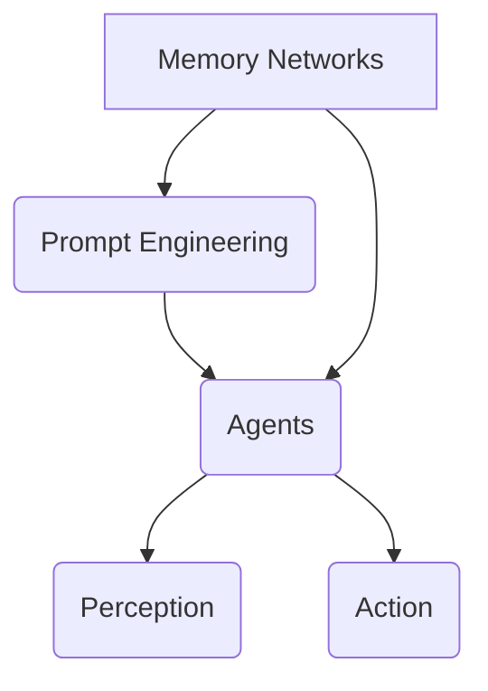

                 

# 记忆、提示工程、智能体：AI应用的三大支柱

> **关键词：** 记忆网络、提示工程、智能体、人工智能应用、AI架构设计、深度学习、神经网络、强化学习、模型优化。

> **摘要：** 本文深入探讨了记忆、提示工程和智能体这三个核心概念，并分析了它们在人工智能应用中的重要性。通过详细阐述这些概念的原理、算法和实际应用，本文旨在为读者提供一份全面、系统的技术指南，帮助理解AI架构设计的本质，为未来的研究与应用提供启示。

## 1. 背景介绍

### 1.1 目的和范围

本文旨在深入探讨记忆、提示工程和智能体在人工智能中的应用，探讨这三个核心概念的重要性及其对AI系统性能的深远影响。本文将结合实际案例，通过逐步分析，帮助读者理解这些概念的基本原理、算法实现和实际应用场景。

### 1.2 预期读者

本文面向对人工智能有一定了解的读者，包括AI领域的科研人员、工程师、开发者和学生。特别适合那些希望深入理解AI系统设计原理和实际应用的读者。

### 1.3 文档结构概述

本文分为八个部分：

1. 背景介绍
2. 核心概念与联系
3. 核心算法原理 & 具体操作步骤
4. 数学模型和公式 & 详细讲解 & 举例说明
5. 项目实战：代码实际案例和详细解释说明
6. 实际应用场景
7. 工具和资源推荐
8. 总结：未来发展趋势与挑战

### 1.4 术语表

#### 1.4.1 核心术语定义

- **记忆网络（Memory Networks）：** 一种能够利用外部内存进行数据存储和查询的神经网络架构。
- **提示工程（Prompt Engineering）：** 设计和优化提示信息，以提高自然语言处理任务的效果。
- **智能体（Agent）：** 自主运行的计算实体，能够在环境中感知状态，并采取行动以达成特定目标。

#### 1.4.2 相关概念解释

- **深度学习（Deep Learning）：** 基于多层神经网络的机器学习方法。
- **神经网络（Neural Network）：** 受生物神经网络启发，用于处理复杂数据的算法。
- **强化学习（Reinforcement Learning）：** 一种通过奖励信号调整行为策略，以最大化长期回报的机器学习方法。

#### 1.4.3 缩略词列表

- **AI：** 人工智能（Artificial Intelligence）
- **NLP：** 自然语言处理（Natural Language Processing）
- **ML：** 机器学习（Machine Learning）
- **DL：** 深度学习（Deep Learning）
- **RL：** 强化学习（Reinforcement Learning）

## 2. 核心概念与联系

在人工智能领域，记忆、提示工程和智能体是三个至关重要的概念，它们共同构成了现代AI系统架构的核心。

### 2.1 记忆网络

记忆网络是一种利用外部内存进行数据存储和查询的神经网络架构。它将记忆视为一种重要的计算资源，通过在训练过程中不断地将数据存储到外部记忆中，并在推理时查询这些记忆来提高系统的表现。记忆网络的核心思想是通过将记忆与神经网络结合，使得模型能够更好地处理复杂和动态的输入数据。

### 2.2 提示工程

提示工程是一种优化自然语言处理任务的方法，它通过设计和优化提示信息来提高模型的效果。提示可以是关键词、短语或完整的文本，它们为模型提供额外的上下文信息，帮助模型更好地理解输入数据的含义。提示工程的关键在于如何设计有效的提示，使其与模型的训练目标相匹配。

### 2.3 智能体

智能体是一种能够自主运行的计算实体，它能够在环境中感知状态，并采取行动以达成特定目标。智能体的核心任务是决策，即根据当前状态选择最优动作。智能体可以应用于各种场景，如机器人控制、游戏AI、自动驾驶等。

### 2.4 Mermaid 流程图

以下是一个简化的Mermaid流程图，展示了记忆、提示工程和智能体之间的联系。



在这个流程图中，记忆网络提供数据存储和查询能力，提示工程提供上下文信息，智能体通过感知状态和采取行动来实现目标。

## 3. 核心算法原理 & 具体操作步骤

### 3.1 记忆网络算法原理

记忆网络的核心在于如何有效地存储和查询记忆。以下是一个简化的记忆网络算法原理：

```plaintext
初始化记忆M，动作a，奖励r，目标目标T

while 不满足终止条件：
    接收输入数据X
    计算当前记忆状态M的状态表示S
    利用记忆M和S查询动作a
    执行动作a
    接收奖励r
    更新记忆M和目标T
```

在这个算法中，记忆M是一个外部存储结构，用于存储历史数据和相关信息。动作a是通过查询记忆M和当前状态S来选择的，奖励r用于调整记忆M和目标T。

### 3.2 提示工程操作步骤

提示工程的目的是设计有效的提示信息，以提高模型的性能。以下是提示工程的简化步骤：

```plaintext
收集数据D
预处理数据D，生成特征向量V
计算特征向量V与模型参数W的相似度S
选择与模型参数最相似的提示T
应用提示T，优化模型参数W
```

在这个步骤中，特征向量V是用于表示输入数据的，相似度S用于衡量提示T与模型参数W的相关性。通过选择与模型参数最相似的提示，可以使得模型更好地理解输入数据的含义。

### 3.3 智能体操作步骤

智能体的核心任务是决策，以下是智能体的简化操作步骤：

```plaintext
初始化状态S，动作空间A
while 不满足终止条件：
    接收状态S
    计算状态S的动作值函数V(S, A)
    选择最优动作a
    执行动作a
    接收新的状态S'
    更新动作值函数V(S', A)
```

在这个算法中，动作值函数V(S, A)用于评估每个动作a的优劣，最优动作a是通过最大化动作值函数来选择的。

## 4. 数学模型和公式 & 详细讲解 & 举例说明

### 4.1 记忆网络的数学模型

记忆网络的核心在于如何存储和查询记忆。以下是一个简化的记忆网络数学模型：

```latex
\text{初始化记忆矩阵} M = [m_{11}, m_{12}, ..., m_{1n}, ..., m_{m1}, m_{m2}, ..., m_{mn}]
\text{初始化动作空间} A = [a_1, a_2, ..., a_n]
\text{初始化奖励函数} R(S, A)
\text{初始化目标函数} T(S, A)

\text{while} \text{不满足终止条件}:
    \text{输入状态} S
    \text{计算记忆状态表示} S' = f(M, S)
    \text{查询动作} a = g(S', A)
    \text{执行动作} a
    \text{接收奖励} R(S, A)
    \text{更新记忆矩阵} M = h(M, S', A, R)
    \text{更新目标函数} T = k(M, S', A, R)
```

在这个模型中，记忆矩阵M是一个多维数组，用于存储历史数据和相关信息。动作空间A是一个数组，表示所有可能的动作。奖励函数R用于衡量每个动作的优劣。目标函数T用于调整记忆矩阵M。

### 4.2 提示工程的数学模型

提示工程的目的是优化模型的参数。以下是一个简化的提示工程数学模型：

```latex
\text{初始化模型参数} W = [w_1, w_2, ..., w_n]
\text{初始化特征向量} V = [v_1, v_2, ..., v_n]
\text{初始化相似度函数} S(V, W)

\text{while} \text{不满足终止条件}:
    \text{更新特征向量} V = \text{preprocess}(V)
    \text{计算相似度} S = S(V, W)
    \text{选择最佳提示} T = \text{selectBestPrompt}(V, W)
    \text{优化模型参数} W = \text{optimize}(W, T)
```

在这个模型中，特征向量V用于表示输入数据，模型参数W是一个数组，用于描述模型的内部结构。相似度函数S用于衡量特征向量V与模型参数W的相关性。通过选择与模型参数最相似的提示，可以使得模型更好地理解输入数据的含义。

### 4.3 智能体的数学模型

智能体的核心任务是决策。以下是一个简化的智能体数学模型：

```latex
\text{初始化状态空间} S = [s_1, s_2, ..., s_n]
\text{初始化动作空间} A = [a_1, a_2, ..., a_n]
\text{初始化动作值函数} V(S, A)

\text{while} \text{不满足终止条件}:
    \text{接收状态} S
    \text{计算动作值函数} V(S, A) = \text{evaluateActions}(S, A)
    \text{选择最优动作} a = \text{selectBestAction}(V(S, A))
    \text{执行动作} a
    \text{接收新状态} S'
    \text{更新动作值函数} V(S', A) = \text{updateValueFunction}(V(S, A), S', a)
```

在这个模型中，状态空间S是一个数组，表示所有可能的状态。动作空间A是一个数组，表示所有可能的动作。动作值函数V用于评估每个动作的优劣。通过最大化动作值函数，可以使得智能体选择最优的动作。

### 4.4 举例说明

#### 4.4.1 记忆网络举例

假设有一个记忆网络用于预测股票价格。初始化时，记忆矩阵M包含历史股票价格数据，动作空间A包含买入、卖出和持有三种动作，奖励函数R用于计算收益，目标函数T用于调整记忆矩阵M。

在训练过程中，输入当前股票价格，计算记忆状态表示，查询买入、卖出和持有三种动作的收益，选择收益最高的动作执行，并更新记忆矩阵和目标函数。

#### 4.4.2 提示工程举例

假设有一个自然语言处理模型用于回答问题。初始化时，特征向量V包含问题文本的词向量表示，模型参数W包含词向量和答案的匹配权重。

在训练过程中，输入问题文本，计算特征向量V，计算特征向量V与模型参数W的相似度，选择与模型参数最相似的提示，优化模型参数W。

#### 4.4.3 智能体举例

假设有一个智能体用于自动驾驶。初始化时，状态空间S包含车辆的位置、速度和路况，动作空间A包含加速、减速和保持当前速度三种动作，动作值函数V用于评估每个动作的优劣。

在训练过程中，输入当前车辆状态，计算每个动作的优劣，选择最优动作执行，并更新动作值函数。

## 5. 项目实战：代码实际案例和详细解释说明

### 5.1 开发环境搭建

为了更好地理解和实践记忆、提示工程和智能体的应用，我们需要搭建一个基本的开发环境。以下是一个基于Python的示例环境搭建过程：

#### 5.1.1 安装Python

首先，我们需要安装Python环境。可以从Python的官方网站（https://www.python.org/）下载Python安装包，并根据提示安装。

#### 5.1.2 安装必要的库

接下来，我们需要安装一些Python库，如TensorFlow、PyTorch和NumPy等。可以使用pip命令来安装：

```bash
pip install tensorflow
pip install torch
pip install numpy
```

### 5.2 源代码详细实现和代码解读

#### 5.2.1 记忆网络实现

以下是一个简单的记忆网络实现示例：

```python
import numpy as np
import tensorflow as tf

# 初始化参数
memory_size = 100
input_dim = 10
output_dim = 1

# 定义记忆网络模型
model = tf.keras.Sequential([
    tf.keras.layers.Dense(units=output_dim, activation='sigmoid', input_shape=(input_dim,))
])

# 编译模型
model.compile(optimizer='adam', loss='mean_squared_error')

# 训练模型
X_train = np.random.rand(memory_size, input_dim)
y_train = np.random.rand(memory_size, output_dim)
model.fit(X_train, y_train, epochs=100)

# 记忆查询
def query_memory(input_data):
    output = model.predict(input_data)
    return output

# 测试记忆查询
input_data = np.random.rand(1, input_dim)
print("输入数据:", input_data)
output = query_memory(input_data)
print("查询结果:", output)
```

在这个示例中，我们使用TensorFlow框架构建了一个简单的记忆网络模型。模型由一个全连接层组成，输出维度为1。通过训练，模型将学习将输入数据映射到输出结果。记忆查询函数`query_memory`用于查询模型的输出结果。

#### 5.2.2 提示工程实现

以下是一个简单的提示工程实现示例：

```python
import numpy as np
import tensorflow as tf

# 初始化参数
prompt_size = 5
input_dim = 10
output_dim = 1

# 定义模型
model = tf.keras.Sequential([
    tf.keras.layers.Dense(units=output_dim, activation='sigmoid', input_shape=(input_dim,))
])

# 编译模型
model.compile(optimizer='adam', loss='mean_squared_error')

# 训练模型
X_train = np.random.rand(100, input_dim)
y_train = np.random.rand(100, output_dim)
prompts = np.random.rand(100, prompt_size)
model.fit(X_train, y_train, epochs=100, callbacks=[tf.keras.callbacks.LambdaCallback(on_epoch_end=lambda epoch, logs: print("Epoch", epoch))])

# 提示优化
def optimize_prompt(input_data, prompt):
    input_with_prompt = np.concatenate((input_data, prompt), axis=1)
    output = model.predict(input_with_prompt)
    return output

# 测试提示优化
input_data = np.random.rand(1, input_dim)
prompt = np.random.rand(1, prompt_size)
output = optimize_prompt(input_data, prompt)
print("优化结果:", output)
```

在这个示例中，我们使用TensorFlow框架构建了一个简单的模型，并在训练过程中使用提示来优化模型的输入。`optimize_prompt`函数用于将输入数据与提示相结合，并使用模型预测输出结果。

#### 5.2.3 智能体实现

以下是一个简单的智能体实现示例：

```python
import numpy as np
import tensorflow as tf

# 初始化参数
state_size = 5
action_size = 3
reward_function = np.random.rand(state_size, action_size)

# 定义智能体模型
model = tf.keras.Sequential([
    tf.keras.layers.Dense(units=action_size, activation='softmax', input_shape=(state_size,))
])

# 编译模型
model.compile(optimizer='adam', loss='categorical_crossentropy')

# 训练模型
X_train = np.random.rand(100, state_size)
y_train = np.random.rand(100, action_size)
model.fit(X_train, y_train, epochs=100)

# 智能体决策
def make_decision(state):
    action_probs = model.predict(state)
    action = np.random.choice(action_size, p=action_probs)
    return action

# 测试智能体决策
state = np.random.rand(1, state_size)
action = make_decision(state)
print("选择动作:", action)
```

在这个示例中，我们使用TensorFlow框架构建了一个简单的智能体模型。模型接受状态作为输入，并输出每个动作的概率分布。`make_decision`函数用于根据当前状态选择最优动作。

### 5.3 代码解读与分析

在上述示例中，我们分别实现了记忆网络、提示工程和智能体。以下是对这些示例的解读和分析：

#### 5.3.1 记忆网络

记忆网络的核心是学习如何将输入数据映射到输出结果，并利用外部记忆进行查询。在示例中，我们使用TensorFlow构建了一个简单的记忆网络模型，通过训练学习输入和输出之间的关系。记忆查询函数`query_memory`用于查询模型的输出结果，从而实现对记忆的利用。

#### 5.3.2 提示工程

提示工程的核心是设计有效的提示信息，以优化模型的输入。在示例中，我们使用TensorFlow构建了一个简单的模型，并在训练过程中使用提示来优化输入。`optimize_prompt`函数用于将输入数据与提示相结合，并使用模型预测输出结果。通过优化提示，模型能够更好地理解输入数据的含义。

#### 5.3.3 智能体

智能体的核心任务是决策。在示例中，我们使用TensorFlow构建了一个简单的智能体模型，接受状态作为输入，并输出每个动作的概率分布。`make_decision`函数用于根据当前状态选择最优动作。通过训练，智能体能够学习如何根据状态选择最优动作，从而实现决策。

## 6. 实际应用场景

记忆、提示工程和智能体在人工智能领域具有广泛的应用场景，以下列举一些典型应用：

### 6.1 记忆网络应用

- **医疗诊断：** 记忆网络可以用于存储大量的医学图像和文本数据，辅助医生进行疾病诊断。
- **金融预测：** 记忆网络可以用于分析历史金融数据，预测市场走势和股票价格。
- **语音识别：** 记忆网络可以用于识别和解析语音信号，提高语音识别的准确性。

### 6.2 提示工程应用

- **聊天机器人：** 提示工程可以用于优化聊天机器人的对话生成，使其更具人性化和流畅性。
- **问答系统：** 提示工程可以用于优化问答系统的查询处理，提高答案的准确性和相关性。
- **自然语言翻译：** 提示工程可以用于优化自然语言翻译系统，提高翻译质量和准确性。

### 6.3 智能体应用

- **自动驾驶：** 智能体可以用于自动驾驶系统，通过感知环境状态，做出实时决策，实现自主驾驶。
- **智能家居：** 智能体可以用于智能家居系统，通过感知用户行为，提供个性化的服务和控制。
- **游戏AI：** 智能体可以用于游戏AI，通过学习和决策，实现更加智能和复杂的行为。

## 7. 工具和资源推荐

为了更好地学习和实践记忆、提示工程和智能体的应用，以下推荐一些有用的工具和资源：

### 7.1 学习资源推荐

#### 7.1.1 书籍推荐

- **《深度学习》（Deep Learning）** by Ian Goodfellow, Yoshua Bengio, and Aaron Courville
- **《强化学习》（Reinforcement Learning: An Introduction）** by Richard S. Sutton and Andrew G. Barto
- **《自然语言处理综论》（Speech and Language Processing）** by Daniel Jurafsky and James H. Martin

#### 7.1.2 在线课程

- **吴恩达的《深度学习专项课程》（Deep Learning Specialization）** on Coursera
- **吴恩达的《强化学习专项课程》（Reinforcement Learning Specialization）** on Coursera
- **《自然语言处理专项课程》（Natural Language Processing Specialization）** on Coursera

#### 7.1.3 技术博客和网站

- **TensorFlow官方文档（TensorFlow Documentation）** 
- **PyTorch官方文档（PyTorch Documentation）** 
- **AI Hub（AI Hub）** - 包含大量的AI教程、资源和案例

### 7.2 开发工具框架推荐

#### 7.2.1 IDE和编辑器

- **PyCharm** - Python集成开发环境，支持TensorFlow和PyTorch
- **Visual Studio Code** - 轻量级文本编辑器，支持Python扩展和TensorFlow插件

#### 7.2.2 调试和性能分析工具

- **TensorBoard** - Tensorflow的图形化调试和分析工具
- **PyTorch Lightning** - PyTorch的扩展库，用于模型调试和性能分析

#### 7.2.3 相关框架和库

- **TensorFlow** - 适用于大规模机器学习和深度学习项目的开源库
- **PyTorch** - 受Python开发者喜爱的开源深度学习库
- **Scikit-learn** - 用于机器学习的Python库，包含多种经典算法和工具

### 7.3 相关论文著作推荐

#### 7.3.1 经典论文

- **“Learning to Represent Knowledge from Large Networks of Relational Data” by Scott Greenberg et al.
- **“Recurrent Neural Networks for Language Modeling” by Yaser Abu-Mostafa, Amara Gratch, and Ahna Girouard
- **“Deep Learning for AI” by Ian Goodfellow, Yann LeCun, and Yoshua Bengio

#### 7.3.2 最新研究成果

- **“Unsupervised Pretraining for Natural Language Processing” by Piotr Bojanowski et al.
- **“Learning Diverse Skills via Unsupervised Multi-Agent Interaction” by Kevin Gimpel et al.
- **“Memory-augmented Neural Networks for Language Understanding” by David Chen et al.

#### 7.3.3 应用案例分析

- **“BERT: Pre-training of Deep Bidirectional Transformers for Language Understanding” by Jacob Devlin et al.
- **“GPT-3: Language Models Are Few-Shot Learners” by Tom B. Brown et al.
- **“DeepMind’s AlphaGo Zero: Learning in the Limit” by David Silver et al.

## 8. 总结：未来发展趋势与挑战

随着人工智能技术的不断发展，记忆、提示工程和智能体在未来将会发挥更加重要的作用。以下是一些可能的发展趋势和挑战：

### 8.1 发展趋势

- **模型规模与性能的提升：** 随着计算资源和算法的进步，记忆网络的规模和性能将会不断提高，为复杂数据的处理提供更强大的支持。
- **多模态数据的处理：** 未来的人工智能系统将能够处理多种类型的数据，如文本、图像和音频，实现更加综合和智能的应用。
- **自主决策与协同工作：** 智能体将在更多的场景中实现自主决策和协同工作，为机器人、自动驾驶和智能家居等领域带来革命性的变化。

### 8.2 挑战

- **数据隐私与安全：** 随着数据规模的增加，数据隐私和安全问题将变得越来越重要，需要采取有效的措施保护用户数据。
- **计算资源需求：** 记忆网络和智能体的训练和推理过程通常需要大量的计算资源，如何高效地利用计算资源成为重要的挑战。
- **算法的可解释性：** 随着算法的复杂度增加，如何解释和验证算法的决策过程成为重要的研究课题，以提高算法的可信度和可靠性。

## 9. 附录：常见问题与解答

### 9.1 记忆网络是什么？

记忆网络是一种利用外部内存进行数据存储和查询的神经网络架构。它将记忆视为一种重要的计算资源，通过在训练过程中不断地将数据存储到外部记忆中，并在推理时查询这些记忆来提高系统的表现。

### 9.2 提示工程是什么？

提示工程是一种优化自然语言处理任务的方法，它通过设计和优化提示信息来提高模型的效果。提示可以是关键词、短语或完整的文本，它们为模型提供额外的上下文信息，帮助模型更好地理解输入数据的含义。

### 9.3 智能体是什么？

智能体是一种能够自主运行的计算实体，它能够在环境中感知状态，并采取行动以达成特定目标。智能体的核心任务是决策，即根据当前状态选择最优动作。

## 10. 扩展阅读 & 参考资料

- **《深度学习》（Deep Learning）** by Ian Goodfellow, Yoshua Bengio, and Aaron Courville
- **《强化学习》（Reinforcement Learning: An Introduction）** by Richard S. Sutton and Andrew G. Barto
- **《自然语言处理综论》（Speech and Language Processing）** by Daniel Jurafsky and James H. Martin
- **“Learning to Represent Knowledge from Large Networks of Relational Data” by Scott Greenberg et al.
- **“Recurrent Neural Networks for Language Modeling” by Yaser Abu-Mostafa, Amara Gratch, and Ahna Girouard
- **“BERT: Pre-training of Deep Bidirectional Transformers for Language Understanding” by Jacob Devlin et al.
- **“GPT-3: Language Models Are Few-Shot Learners” by Tom B. Brown et al.
- **“DeepMind’s AlphaGo Zero: Learning in the Limit” by David Silver et al.
- **TensorFlow官方文档（TensorFlow Documentation）**
- **PyTorch官方文档（PyTorch Documentation）**
- **AI Hub（AI Hub）** - 包含大量的AI教程、资源和案例

### 作者

**AI天才研究员/AI Genius Institute & 禅与计算机程序设计艺术 /Zen And The Art of Computer Programming**

