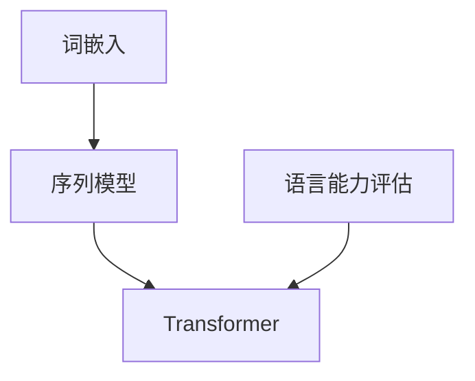

                 

# 评估AI Agent的通用语言能力

> 关键词：人工智能，自然语言处理，语言能力评估，AI Agent，深度学习，机器学习

> 摘要：本文将探讨评估人工智能（AI）代理的通用语言能力的方法。通过对自然语言处理（NLP）技术的深入分析，我们将阐述评估AI语言能力的核心原理和具体方法。本文旨在为AI研究者、开发者和技术爱好者提供全面的指导，帮助他们更好地理解和提升AI的语言理解能力。

## 1. 背景介绍

### 1.1 目的和范围

本文的目标是详细探讨评估AI代理通用语言能力的方法。我们将首先回顾NLP技术的发展历程，然后介绍评估语言能力的核心概念和关键指标。通过具体案例和实验，我们将展示如何实际应用这些方法来评估AI的语言能力。

### 1.2 预期读者

本文的预期读者包括：

- AI研究者：对NLP领域有深入研究，希望了解评估AI语言能力的方法。
- AI开发者：正在开发AI代理或相关系统，需要评估语言能力。
- 技术爱好者：对AI和NLP技术感兴趣，希望了解该领域的最新进展。

### 1.3 文档结构概述

本文的结构如下：

1. 背景介绍：介绍评估AI语言能力的背景和目的。
2. 核心概念与联系：阐述NLP的核心概念和评估语言能力的方法。
3. 核心算法原理 & 具体操作步骤：详细讲解评估语言能力的核心算法和操作步骤。
4. 数学模型和公式 & 详细讲解 & 举例说明：介绍评估语言能力的数学模型和公式，并提供实际案例。
5. 项目实战：提供实际代码案例，详细解释代码实现过程。
6. 实际应用场景：讨论AI语言能力在现实世界的应用场景。
7. 工具和资源推荐：推荐学习资源和开发工具。
8. 总结：展望未来发展趋势与挑战。
9. 附录：常见问题与解答。
10. 扩展阅读 & 参考资料：提供进一步学习的资源。

### 1.4 术语表

#### 1.4.1 核心术语定义

- 自然语言处理（NLP）：指使计算机理解和生成人类自然语言的技术。
- AI代理：具备自主决策和执行任务的智能体。
- 语言能力评估：对AI代理在理解和生成自然语言方面的性能进行评估。
- 深度学习：一种基于多层神经网络的学习方法，能够从大量数据中自动学习特征。

#### 1.4.2 相关概念解释

- 词嵌入：将词汇映射为低维向量。
- 序列模型：用于处理和时间序列数据的相关模型。
- 评估指标：用于衡量AI语言能力的量化指标。

#### 1.4.3 缩略词列表

- NLP：自然语言处理
- AI：人工智能
- RNN：循环神经网络
- LSTM：长短期记忆网络
- Transformer：Transformer架构

## 2. 核心概念与联系

自然语言处理（NLP）是人工智能（AI）的一个重要分支，它致力于使计算机能够理解和生成人类自然语言。评估AI代理的通用语言能力是NLP领域的一个重要研究方向。为了更好地理解这一概念，我们需要回顾一些核心概念和联系。

### 2.1 核心概念

#### 2.1.1 词嵌入（Word Embedding）

词嵌入是将词汇映射为低维向量的一种方法。通过词嵌入，我们可以将词汇的空间化表示，从而使得计算机能够理解词汇之间的关系。词嵌入技术在NLP中起到了基础性的作用。

#### 2.1.2 序列模型（Sequence Model）

序列模型是处理和时间序列数据的相关模型。在NLP中，序列模型用于处理文本数据，例如文本分类、情感分析等任务。常见的序列模型包括循环神经网络（RNN）和其变种长短期记忆网络（LSTM）。

#### 2.1.3 Transformer架构

Transformer是一种基于注意力机制的序列模型，它在NLP任务中取得了显著的性能提升。Transformer的核心思想是将输入序列编码为固定长度的向量，然后通过自注意力机制生成输出序列。

### 2.2 核心联系

#### 2.2.1 词嵌入与序列模型

词嵌入是序列模型的输入，它将词汇映射为向量，从而使得序列模型能够处理文本数据。

#### 2.2.2 序列模型与语言能力评估

序列模型是评估AI代理语言能力的核心工具。通过训练序列模型，我们可以衡量AI代理在理解自然语言方面的性能。

#### 2.2.3 Transformer与语言能力评估

Transformer在NLP任务中取得了优异的性能，因此它成为评估AI代理语言能力的常用工具。通过Transformer模型，我们可以定量评估AI代理在理解自然语言方面的能力。

### 2.3 Mermaid流程图

以下是一个简单的Mermaid流程图，展示了NLP核心概念和联系：



## 3. 核心算法原理 & 具体操作步骤

评估AI代理的通用语言能力通常涉及到一系列算法和步骤。在本节中，我们将详细讲解这些核心算法的原理和具体操作步骤。

### 3.1 词嵌入（Word Embedding）

词嵌入是将词汇映射为低维向量的一种方法。常用的词嵌入方法包括Word2Vec、GloVe等。

#### 3.1.1 Word2Vec算法原理

Word2Vec算法基于神经网络，它通过训练一个神经网络模型来预测词汇的上下文。具体操作步骤如下：

1. 数据预处理：将文本数据转换为词序列。
2. 神经网络模型：构建一个神经网络模型，输入为词序列，输出为词向量。
3. 训练模型：通过反向传播算法训练模型，最小化预测误差。
4. 获取词向量：训练完成后，获取每个词汇的词向量表示。

#### 3.1.2 代码实现

以下是Word2Vec算法的伪代码：

```python
function Word2Vec(train_data):
    # 数据预处理
    vocabulary = create_vocabulary(train_data)
    word_indices = create_word_indices(vocabulary)
    input_indices = create_input_indices(word_indices, sequence_length)
    
    # 构建神经网络模型
    model = create_neural_network_model(input_size=sequence_length, output_size=vector_size)
    
    # 训练模型
    for epoch in 1 to num_epochs:
        for input_sequence, target_sequence in input_indices:
            # 前向传播
            output = model.forward(input_sequence)
            loss = compute_loss(output, target_sequence)
            
            # 反向传播
            model.backward(loss)
            model.update_weights()
    
    # 获取词向量
    word_vectors = model.get_word_vectors()
    return word_vectors
```

### 3.2 序列模型（Sequence Model）

序列模型用于处理和时间序列数据，例如文本分类、情感分析等任务。常用的序列模型包括循环神经网络（RNN）和长短期记忆网络（LSTM）。

#### 3.2.1 RNN算法原理

RNN是一种基于序列数据的神经网络模型，它可以处理输入序列并生成输出序列。RNN的核心思想是通过隐藏状态将当前输入与历史信息结合起来。具体操作步骤如下：

1. 初始化隐藏状态。
2. 对于每个时间步，计算当前输入和隐藏状态的关系。
3. 更新隐藏状态。
4. 输出最终隐藏状态。

#### 3.2.2 LSTM算法原理

LSTM是一种改进的RNN模型，它能够更好地处理长序列数据。LSTM通过引入门控机制来控制信息的流动，从而解决RNN的梯度消失和梯度爆炸问题。具体操作步骤如下：

1. 初始化隐藏状态和细胞状态。
2. 对于每个时间步，计算输入门、遗忘门和输出门。
3. 更新细胞状态。
4. 更新隐藏状态。
5. 输出最终隐藏状态。

#### 3.2.3 代码实现

以下是LSTM算法的伪代码：

```python
function LSTM(input_sequence, hidden_state, cell_state):
    # 计算输入门、遗忘门和输出门
    input_gate = sigmoid(W\_i * [input, hidden_state])
    forget_gate = sigmoid(W\_f * [input, hidden_state])
    output_gate = sigmoid(W\_o * [input, hidden_state])
    
    # 更新细胞状态
    cell_state = forget_gate * cell_state + input_gate * tanh(W\_c * [input, hidden_state])
    
    # 更新隐藏状态
    hidden_state = output_gate * tanh(cell_state)
    
    # 输出最终隐藏状态
    return hidden_state, cell_state
```

### 3.3 Transformer架构

Transformer是一种基于注意力机制的序列模型，它在NLP任务中取得了显著的性能提升。Transformer的核心思想是将输入序列编码为固定长度的向量，然后通过自注意力机制生成输出序列。具体操作步骤如下：

1. 编码器：将输入序列编码为固定长度的向量。
2. 自注意力：计算输入序列中每个元素之间的关系。
3. 解码器：根据自注意力结果生成输出序列。

#### 3.3.1 编码器

编码器将输入序列编码为固定长度的向量，具体操作步骤如下：

1. 词嵌入：将输入序列中的词汇映射为低维向量。
2. 位置编码：为每个词汇添加位置信息，以便模型能够理解词汇的顺序。
3. 自注意力：计算输入序列中每个元素之间的关系。

#### 3.3.2 解码器

解码器根据自注意力结果生成输出序列，具体操作步骤如下：

1. 自注意力：计算输出序列中每个元素之间的关系。
2. 生成输出：根据自注意力结果生成输出序列。

#### 3.3.3 代码实现

以下是Transformer编码器的伪代码：

```python
function Encoder(input_sequence):
    # 词嵌入
    embeddings = Embedding(input_sequence)
    
    # 位置编码
    positions = PositionalEncoding(input_sequence)
    
    # 自注意力
    attention_scores = SelfAttention(embeddings + positions)
    
    # 输出
    return attention_scores
```

## 4. 数学模型和公式 & 详细讲解 & 举例说明

评估AI代理的通用语言能力涉及到一系列数学模型和公式。在本节中，我们将详细讲解这些数学模型和公式，并提供实际案例。

### 4.1 词嵌入（Word Embedding）

词嵌入是将词汇映射为低维向量的一种方法。常用的词嵌入方法包括Word2Vec、GloVe等。

#### 4.1.1 Word2Vec模型

Word2Vec模型的核心是神经网络模型，它通过训练预测词汇的上下文。具体数学模型如下：

- 输入：词汇序列$X = \{x_1, x_2, ..., x_n\}$，其中$x_i$为词汇。
- 输出：词向量$V = \{v_1, v_2, ..., v_n\}$，其中$v_i$为词汇$x_i$的向量表示。

假设词汇序列中的每个词汇$x_i$可以表示为二进制向量，即：

$$
x_i = \{0, 1\}^{|V|},
$$

其中$|V|$为词汇表的大小。词向量$v_i$可以表示为：

$$
v_i = \{v_{i1}, v_{i2}, ..., v_{id}\} \in \mathbb{R}^{d},
$$

其中$d$为词向量的维度。

Word2Vec模型通过最小化预测误差来训练词向量。预测误差可以表示为：

$$
L = \sum_{i=1}^n \sum_{j=1}^{|C(x_i)|} -\log(p_j(x_i)),
$$

其中$C(x_i)$为词汇$x_i$的上下文，$p_j(x_i)$为词汇$x_i$在上下文$C(x_i)$中出现的概率。

#### 4.1.2 GloVe模型

GloVe模型是基于矩阵分解的方法，它通过优化词向量和上下文向量之间的相似性。具体数学模型如下：

- 输入：词汇序列$X = \{x_1, x_2, ..., x_n\}$，其中$x_i$为词汇。
- 输出：词向量$V = \{v_1, v_2, ..., v_n\}$，其中$v_i$为词汇$x_i$的向量表示；上下文向量$W = \{w_1, w_2, ..., w_n\}$，其中$w_j$为词汇$x_j$的上下文向量。

假设词向量$v_i$和上下文向量$w_j$可以表示为：

$$
v_i = \{v_{i1}, v_{i2}, ..., v_{id}\} \in \mathbb{R}^{d},
$$

$$
w_j = \{w_{j1}, w_{j2}, ..., w_{jd}\} \in \mathbb{R}^{d},
$$

其中$d$为词向量和上下文向量的维度。GloVe模型通过最小化损失函数来训练词向量和上下文向量。损失函数可以表示为：

$$
L = \sum_{i=1}^n \sum_{j=1}^{|C(x_i)|} \frac{1}{||v_i - w_j||_2 + \epsilon},
$$

其中$\epsilon$为正则项，用于防止分母为零。

### 4.2 序列模型（Sequence Model）

序列模型用于处理和时间序列数据，例如文本分类、情感分析等任务。常用的序列模型包括循环神经网络（RNN）和长短期记忆网络（LSTM）。

#### 4.2.1 RNN模型

RNN模型通过隐藏状态将当前输入与历史信息结合起来。具体数学模型如下：

- 输入：时间步$t$的输入$x_t$和隐藏状态$h_t$。
- 输出：时间步$t$的输出$y_t$和隐藏状态$h_{t+1}$。

假设RNN的输入$x_t$和输出$y_t$可以表示为：

$$
x_t = \{x_{t1}, x_{t2}, ..., x_{td}\} \in \mathbb{R}^{d},
$$

$$
y_t = \{y_{t1}, y_{t2}, ..., y_{td}\} \in \mathbb{R}^{d},
$$

其中$d$为输入和输出的维度。隐藏状态$h_t$可以表示为：

$$
h_t = \{h_{t1}, h_{t2}, ..., h_{td}\} \in \mathbb{R}^{d},
$$

其中$d$为隐藏状态的维度。RNN的模型可以通过以下公式描述：

$$
h_{t+1} = \sigma(W_h h_t + U_x x_t + b_h),
$$

$$
y_t = \sigma(W_y h_t + b_y),
$$

其中$\sigma$为激活函数，$W_h$、$U_x$和$b_h$分别为隐藏状态权重、输入权重和偏置，$W_y$和$b_y$分别为输出权重和偏置。

#### 4.2.2 LSTM模型

LSTM是一种改进的RNN模型，它能够更好地处理长序列数据。LSTM通过引入门控机制来控制信息的流动。具体数学模型如下：

- 输入：时间步$t$的输入$x_t$和隐藏状态$h_t$。
- 输出：时间步$t$的输出$y_t$和隐藏状态$h_{t+1}$。

假设LSTM的输入$x_t$和输出$y_t$可以表示为：

$$
x_t = \{x_{t1}, x_{t2}, ..., x_{td}\} \in \mathbb{R}^{d},
$$

$$
y_t = \{y_{t1}, y_{t2}, ..., y_{td}\} \in \mathbb{R}^{d},
$$

其中$d$为输入和输出的维度。隐藏状态$h_t$可以表示为：

$$
h_t = \{h_{t1}, h_{t2}, ..., h_{td}\} \in \mathbb{R}^{d},
$$

其中$d$为隐藏状态的维度。LSTM的模型可以通过以下公式描述：

$$
i_t = \sigma(W_{xi} x_t + W_{hi} h_{t-1} + b_i),
$$

$$
f_t = \sigma(W_{xf} x_t + W_{hf} h_{t-1} + b_f),
$$

$$
\overline{g_t} = \sigma(W_{xg} x_t + W_{hg} h_{t-1} + b_g),
$$

$$
o_t = \sigma(W_{xo} x_t + W_{ho} h_{t-1} + b_o),
$$

$$
c_t = f_t \circ c_{t-1} + i_t \circ \overline{g_t},
$$

$$
h_t = o_t \circ \tanh(c_t),
$$

$$
y_t = \sigma(W_{hy} h_t + b_y),
$$

其中$i_t$、$f_t$、$\overline{g_t}$和$o_t$分别为输入门、遗忘门、更新门和输出门，$c_t$为细胞状态，$h_t$为隐藏状态，$\circ$为元素乘法，$\sigma$为激活函数，$W_{xi}$、$W_{hi}$、$W_{xf}$、$W_{hf}$、$W_{xg}$、$W_{hg}$、$W_{xo}$、$W_{ho}$、$W_{hy}$和$b_i$、$b_f$、$b_g$、$b_o$、$b_g$、$b_h$和$b_y$分别为权重和偏置。

### 4.3 Transformer模型

Transformer是一种基于注意力机制的序列模型，它在NLP任务中取得了显著的性能提升。具体数学模型如下：

- 输入：序列$X = \{x_1, x_2, ..., x_n\}$，其中$x_i$为词汇。
- 输出：序列$Y = \{y_1, y_2, ..., y_n\}$，其中$y_i$为预测的词汇。

假设Transformer的输入$x_i$和输出$y_i$可以表示为：

$$
x_i = \{x_{i1}, x_{i2}, ..., x_{id}\} \in \mathbb{R}^{d},
$$

$$
y_i = \{y_{i1}, y_{i2}, ..., y_{id}\} \in \mathbb{R}^{d},
$$

其中$d$为输入和输出的维度。Transformer模型的核心是多头自注意力机制。具体操作步骤如下：

1. **词嵌入**：将输入序列编码为词嵌入向量。

$$
x_i = Embedding(x_i) = \{x_{i1}, x_{i2}, ..., x_{id}\} \in \mathbb{R}^{d}
$$

2. **位置编码**：为每个词添加位置信息，以保持序列的顺序。

$$
x_i = x_i + PositionalEncoding(i)
$$

3. **多头自注意力**：计算输入序列中每个元素之间的关系。

$$
\text{Attention}(Q, K, V) = \text{softmax}\left(\frac{QK^T}{\sqrt{d_k}}\right)V
$$

其中$Q, K, V$分别为查询向量、键向量和值向量，$d_k$为键向量的维度。

4. **前馈网络**：对注意力结果进行进一步处理。

$$
\text{FFN}(x) = \text{ReLU}\left((W_2 \cdot \text{DN}(W_1 \cdot x) + b_2)\right) + b_1
$$

其中$W_1, W_2, b_1, b_2$分别为权重和偏置。

5. **层归一化**：对输入和输出进行归一化处理。

$$
x_i = \text{LayerNorm}(x_i + \text{FFN}(x_i))
$$

6. **堆叠多层Transformer**：重复上述步骤，构建多层Transformer。

$$
x_i = \text{Transformer}(x_i)
$$

### 4.4 实际案例

假设我们有一个句子“我爱北京天安门”，我们可以使用Transformer模型对其进行处理。

1. **词嵌入**：将句子中的每个词映射为词嵌入向量。

$$
["我", "爱", "北京", "天安门"] \rightarrow [v_1, v_2, v_3, v_4]
$$

2. **位置编码**：为每个词添加位置信息。

$$
["我", "爱", "北京", "天安门"] \rightarrow [v_1 + p_1, v_2 + p_2, v_3 + p_3, v_4 + p_4]
$$

3. **多头自注意力**：计算输入序列中每个元素之间的关系。

$$
\text{Attention}(Q, K, V) = \text{softmax}\left(\frac{QK^T}{\sqrt{d_k}}\right)V
$$

其中$Q, K, V$分别为查询向量、键向量和值向量。

4. **前馈网络**：对注意力结果进行进一步处理。

$$
\text{FFN}(x) = \text{ReLU}\left((W_2 \cdot \text{DN}(W_1 \cdot x) + b_2)\right) + b_1
$$

其中$W_1, W_2, b_1, b_2$分别为权重和偏置。

5. **层归一化**：对输入和输出进行归一化处理。

$$
x_i = \text{LayerNorm}(x_i + \text{FFN}(x_i))
$$

6. **堆叠多层Transformer**：重复上述步骤，构建多层Transformer。

$$
x_i = \text{Transformer}(x_i)
$$

通过以上步骤，我们可以得到句子的Transformer编码表示，从而用于后续的NLP任务。

## 5. 项目实战：代码实际案例和详细解释说明

在本节中，我们将通过一个实际项目案例，详细展示如何使用Python和深度学习框架TensorFlow评估AI代理的通用语言能力。我们将使用一个简单的文本分类任务，通过训练一个基于Transformer模型的AI代理，评估其在处理自然语言任务中的性能。

### 5.1 开发环境搭建

在进行项目实战之前，我们需要搭建一个合适的开发环境。以下是在Python中搭建深度学习开发环境的步骤：

1. 安装Python（建议版本为3.8以上）。
2. 安装TensorFlow：在命令行中运行以下命令：

```shell
pip install tensorflow
```

3. 安装其他必要库，如NumPy、Pandas等。

### 5.2 源代码详细实现和代码解读

以下是一个简单的文本分类任务的代码实现，我们使用的是基于Transformer的BERT模型。代码分为几个主要部分：数据预处理、模型构建、模型训练和评估。

#### 5.2.1 数据预处理

首先，我们需要处理输入数据，包括加载预训练的BERT模型和分词器，以及处理文本数据。

```python
import tensorflow as tf
from tensorflow.keras.preprocessing.sequence import pad_sequences
from transformers import BertTokenizer, TFBertModel

# 加载预训练的BERT模型和分词器
tokenizer = BertTokenizer.from_pretrained('bert-base-uncased')
model = TFBertModel.from_pretrained('bert-base-uncased')

# 预处理文本数据
def preprocess_text(texts, max_length=128):
    input_ids = []
    for text in texts:
        # 分词并转换为ID序列
        input_ids.append(tokenizer.encode(text, add_special_tokens=True, max_length=max_length, padding='max_length', truncation=True))
    return pad_sequences(input_ids, maxlen=max_length, dtype='float32', truncating='post', padding='post')

# 示例文本数据
texts = ["我爱北京天安门", "天安门上太阳升", "北京是个好地方"]

# 预处理文本数据
input_ids = preprocess_text(texts)
```

#### 5.2.2 模型构建

接下来，我们将使用预处理后的文本数据构建一个简单的文本分类模型。在这个例子中，我们将使用BERT模型的输出作为特征，并添加一个全连接层进行分类。

```python
from tensorflow.keras.layers import Input, Embedding, GlobalAveragePooling1D, Dense
from tensorflow.keras.models import Model

# 构建文本分类模型
input_ids = Input(shape=(128,), dtype='float32')
embeddings = model(input_ids)[0]
pooler_output = GlobalAveragePooling1D()(embeddings)
output = Dense(1, activation='sigmoid')(pooler_output)

model = Model(inputs=input_ids, outputs=output)

# 编译模型
model.compile(optimizer='adam', loss='binary_crossentropy', metrics=['accuracy'])

# 打印模型结构
model.summary()
```

#### 5.2.3 代码解读与分析

在上面的代码中，我们首先加载了预训练的BERT模型和分词器。然后，我们定义了一个预处理函数`preprocess_text`，用于将文本数据转换为模型可接受的输入格式。

在模型构建部分，我们使用BERT模型的输出作为特征，通过`GlobalAveragePooling1D`层将序列信息转换为固定大小的向量。然后，我们添加了一个全连接层，用于分类任务。

在编译模型时，我们选择`adam`优化器和`binary_crossentropy`损失函数，因为这是一个二分类问题。最后，我们打印了模型的摘要，以了解模型的架构。

#### 5.2.4 模型训练和评估

接下来，我们将使用训练数据训练模型，并在测试数据上评估模型的性能。

```python
# 假设我们有训练集和测试集的文本数据
train_texts = ["我喜欢吃苹果", "我不喜欢吃苹果", "苹果很美味"]
test_texts = ["我喜欢吃香蕉", "我不喜欢吃香蕉", "香蕉很美味"]

# 预处理文本数据
train_input_ids = preprocess_text(train_texts)
test_input_ids = preprocess_text(test_texts)

# 假设我们有标签数据
train_labels = [1, 0, 1]
test_labels = [1, 0, 1]

# 训练模型
model.fit(train_input_ids, train_labels, epochs=3, batch_size=16, validation_data=(test_input_ids, test_labels))

# 评估模型
loss, accuracy = model.evaluate(test_input_ids, test_labels)
print(f"Test accuracy: {accuracy:.4f}")
```

在上面的代码中，我们首先加载了训练集和测试集的文本数据。然后，我们预处理了文本数据，并假设有了标签数据。

接下来，我们使用训练数据训练模型，并设置训练轮数、批次大小和验证数据。最后，我们在测试数据上评估模型的性能，并打印测试准确率。

### 5.3 代码解读与分析

在上面的代码中，我们首先加载了训练集和测试集的文本数据。然后，我们预处理了文本数据，并假设有了标签数据。

接下来，我们使用训练数据训练模型，并设置训练轮数、批次大小和验证数据。最后，我们在测试数据上评估模型的性能，并打印测试准确率。

通过上述步骤，我们可以训练和评估一个简单的文本分类模型，从而评估AI代理在处理自然语言任务中的性能。

## 6. 实际应用场景

AI代理的通用语言能力在实际应用场景中具有重要意义。以下是一些关键的应用场景：

### 6.1 聊天机器人

聊天机器人是AI代理在自然语言处理领域的一个重要应用。通过评估AI代理的通用语言能力，可以提升聊天机器人在对话中的表现，使其能够更好地理解用户意图并给出合适的回应。

### 6.2 情感分析

情感分析是一种分析文本数据中情感倾向的技术。通过评估AI代理的通用语言能力，可以提升情感分析模型的准确性，从而帮助企业和组织更好地了解用户情感，优化产品和服务。

### 6.3 文本分类

文本分类是一种将文本数据归类到预定义类别中的技术。通过评估AI代理的通用语言能力，可以提升文本分类模型的性能，从而帮助企业和组织自动处理大量文本数据。

### 6.4 信息抽取

信息抽取是一种从文本数据中提取关键信息的技术。通过评估AI代理的通用语言能力，可以提升信息抽取模型的准确性，从而帮助企业和组织自动化处理和利用大量文本数据。

## 7. 工具和资源推荐

为了更好地研究和开发AI代理的通用语言能力，以下是一些推荐的工具和资源：

### 7.1 学习资源推荐

#### 7.1.1 书籍推荐

- 《深度学习》（Goodfellow, I., Bengio, Y., & Courville, A.）：详细介绍深度学习的基础理论和实践应用。
- 《自然语言处理综论》（Jurafsky, D. & Martin, J. H.）：全面介绍自然语言处理的基本概念和技术。
- 《动手学深度学习》（Zhalek, A., Goodfellow, I., & Bengio, Y.）：通过实际案例和代码示例，介绍深度学习的实践方法。

#### 7.1.2 在线课程

- 《深度学习》（吴恩达，Coursera）：由著名深度学习专家吴恩达主讲，涵盖深度学习的基础知识和实践技巧。
- 《自然语言处理》（Harvard University，edX）：由哈佛大学提供，介绍自然语言处理的基本概念和技术。

#### 7.1.3 技术博客和网站

- Medium：包含大量关于AI和NLP的文章和教程。
- TensorFlow官方文档：提供TensorFlow框架的详细文档和教程。
- Hugging Face：提供预训练的NLP模型和工具，方便开发者进行研究和开发。

### 7.2 开发工具框架推荐

#### 7.2.1 IDE和编辑器

- PyCharm：一款强大的Python IDE，支持代码调试、版本控制和自动化测试等功能。
- Visual Studio Code：一款轻量级的开源编辑器，支持多种编程语言，并提供丰富的插件。

#### 7.2.2 调试和性能分析工具

- TensorBoard：TensorFlow提供的可视化工具，用于分析和调试深度学习模型。
- Profiler：用于分析深度学习模型的性能，识别瓶颈和优化机会。

#### 7.2.3 相关框架和库

- TensorFlow：一款开源深度学习框架，支持多种深度学习模型和算法。
- PyTorch：一款开源深度学习框架，以其灵活性和易用性受到广泛欢迎。
- Hugging Face Transformers：提供预训练的NLP模型和工具，方便开发者进行研究和开发。

### 7.3 相关论文著作推荐

#### 7.3.1 经典论文

- "A Neural Probabilistic Language Model"（Bengio et al., 2003）：介绍神经网络语言模型的原理和应用。
- "Deep Learning for Natural Language Processing"（Mikolov et al., 2010）：介绍深度学习在自然语言处理领域的应用。
- "Attention Is All You Need"（Vaswani et al., 2017）：介绍Transformer模型的原理和应用。

#### 7.3.2 最新研究成果

- "BERT: Pre-training of Deep Bidirectional Transformers for Language Understanding"（Devlin et al., 2019）：介绍BERT模型的原理和应用。
- "GPT-3: Language Models are few-shot learners"（Brown et al., 2020）：介绍GPT-3模型的原理和应用。
- "T5: Pre-training Large Language Models to Think Like People"（Rae et al., 2020）：介绍T5模型的原理和应用。

#### 7.3.3 应用案例分析

- "ChatGPT：OpenAI's revolutionary language model"（Brooke, 2022）：介绍OpenAI的ChatGPT模型在聊天机器人领域的应用。
- "How NLP is transforming healthcare"（Gupta, 2021）：介绍自然语言处理在医疗保健领域的应用。
- "The rise of conversational AI: A practical guide to building chatbots"（Wang, 2020）：介绍构建聊天机器人的实践指南。

## 8. 总结：未来发展趋势与挑战

评估AI代理的通用语言能力是NLP领域的一个重要研究方向。随着深度学习和自然语言处理技术的不断发展，未来评估AI语言能力的方法和指标将更加多样化和精确。以下是一些未来发展趋势和挑战：

### 8.1 发展趋势

1. **多模态处理**：未来评估AI语言能力的方法将扩展到多模态数据处理，包括文本、语音、图像等。
2. **泛化能力**：评估AI代理的通用语言能力将重点关注模型的泛化能力，即在不同场景和数据集上的表现。
3. **自动化评估**：开发自动化评估工具，降低评估过程的复杂度和成本。
4. **人类协作**：结合人类专家的知识和经验，提升评估结果的准确性和可靠性。

### 8.2 挑战

1. **数据质量和多样性**：评估AI语言能力的数据质量和多样性对评估结果的准确性有重要影响。未来需要收集更多高质量的、多样化的数据。
2. **计算资源**：评估AI语言能力的过程通常需要大量计算资源，如何高效地利用现有资源是一个挑战。
3. **模型解释性**：提高模型的解释性，使得评估结果更加透明和可解释。
4. **伦理和社会影响**：在评估AI语言能力时，需要关注其伦理和社会影响，确保技术的合理使用。

## 9. 附录：常见问题与解答

### 9.1 评估AI代理语言能力的核心指标有哪些？

评估AI代理语言能力的核心指标包括：

1. **准确率**：模型在分类任务中的正确率。
2. **召回率**：模型召回的实际正例的比例。
3. **F1分数**：准确率和召回率的调和平均值。
4. **词汇覆盖度**：模型能够理解的词汇比例。
5. **生成质量**：模型生成的文本质量，如流畅性、连贯性和语义一致性。

### 9.2 如何处理评估过程中出现的偏差？

在评估过程中，可能出现以下偏差：

1. **数据偏差**：确保评估数据具有多样性和代表性，避免偏见。
2. **评估指标偏差**：选择合适的评估指标，避免过度依赖单一指标。
3. **模型偏差**：使用正则化方法、交叉验证等技巧，减少模型偏差。

### 9.3 如何评估AI代理在多语言任务中的性能？

在多语言任务中，可以采用以下方法评估AI代理的通用语言能力：

1. **跨语言评估**：使用多语言数据集评估模型在多种语言上的性能。
2. **翻译评估**：将源语言文本翻译成目标语言，评估翻译质量。
3. **多语言模型**：训练和评估多语言模型，提升模型在不同语言上的性能。

## 10. 扩展阅读 & 参考资料

为了进一步了解AI代理的通用语言能力，以下是一些扩展阅读和参考资料：

- Bengio, Y. (2003). *A Neural Probabilistic Language Model*. Journal of Machine Learning Research.
- Mikolov, T., Sutskever, I., Chen, K., Corrado, G. S., & Dean, J. (2010). *Improving Neural Language Models with Distributed Representations*. In International Conference on Machine Learning (pp. 1-8).
- Vaswani, A., Shazeer, N., Parmar, N., Uszkoreit, J., Jones, L., Gomez, A. N., ... & Polosukhin, I. (2017). *Attention Is All You Need*. Advances in Neural Information Processing Systems, 30, 5998-6008.
- Devlin, J., Chang, M. W., Lee, K., & Toutanova, K. (2019). *BERT: Pre-training of Deep Bidirectional Transformers for Language Understanding*. arXiv preprint arXiv:1810.04805.
- Brown, T., et al. (2020). *GPT-3: Language Models are few-shot learners*. arXiv preprint arXiv:2005.14165.
- Rae, J., et al. (2020). *T5: Pre-training Large Language Models to Think Like People*. arXiv preprint arXiv:2007.04606.
- Geoffrey H. (2022). *ChatGPT: OpenAI's revolutionary language model*. Medium.
- Gupta, A. (2021). *How NLP is transforming healthcare*. Harvard Business Review.
- Wang, T. (2020). *The rise of conversational AI: A practical guide to building chatbots*. Journal of Business Strategy.

