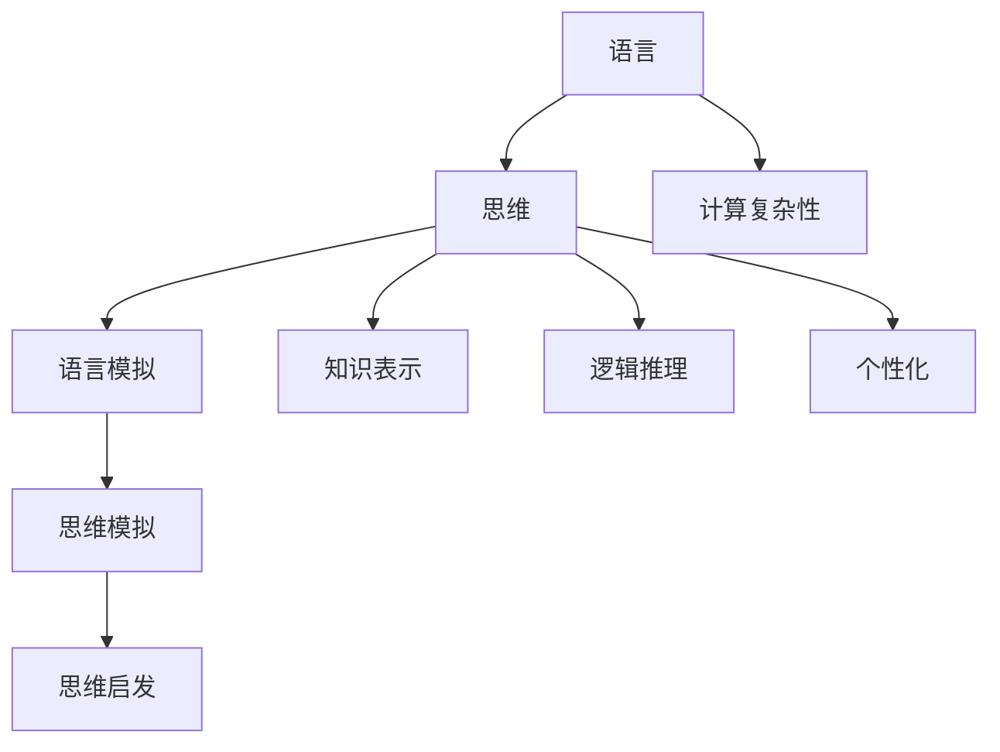

                 

# 语言与思维的关系：大模型的挑战

> **关键词：** 自然语言处理、思维模型、大模型、计算复杂性、人机交互

> **摘要：** 本文将探讨语言与思维之间的关系，分析大规模语言模型在捕捉和理解人类思维过程中的挑战。我们将从背景介绍、核心概念与联系、核心算法原理与具体操作步骤、数学模型与公式、项目实战、实际应用场景、工具和资源推荐等多个角度进行深入分析，旨在为读者揭示大模型在语言与思维领域的研究进展和未来发展方向。

## 1. 背景介绍

### 1.1 目的和范围

本文旨在探讨语言与思维之间的关系，特别是大规模语言模型（Large Language Models，简称LLMs）在模拟和理解人类思维方面的挑战。随着人工智能技术的发展，LLMs已经成为自然语言处理（Natural Language Processing，简称NLP）领域的重要工具，它们在文本生成、翻译、问答系统等方面取得了显著成果。然而，如何让这些模型更好地理解人类思维，从而实现更加自然和智能的人机交互，仍是一个亟待解决的问题。

本文将围绕以下几个问题展开讨论：

1. 语言与思维之间的内在联系是什么？
2. 大规模语言模型如何捕捉和理解人类思维？
3. 在这一过程中，模型面临哪些挑战？
4. 如何利用现有技术解决这些挑战，实现更高效的人机交互？

### 1.2 预期读者

本文适合对自然语言处理、人工智能和思维模型有一定了解的读者。主要包括以下几类人群：

1. 自然语言处理和人工智能领域的研究人员与开发者。
2. 对语言与思维关系感兴趣的心理学和社会学研究者。
3. 对新兴技术感兴趣的技术爱好者。
4. 教育工作者和学生，尤其是从事相关领域学习和研究的师生。

### 1.3 文档结构概述

本文将分为以下十个部分：

1. 背景介绍：本文的目的、范围、预期读者和文档结构概述。
2. 核心概念与联系：介绍语言、思维模型和大规模语言模型的基本概念及其相互关系。
3. 核心算法原理与具体操作步骤：详细讲解大规模语言模型的算法原理和具体实现步骤。
4. 数学模型与公式：分析大规模语言模型的数学模型和公式，并进行举例说明。
5. 项目实战：通过一个实际案例，展示大规模语言模型的应用和实现过程。
6. 实际应用场景：探讨大规模语言模型在各个领域的应用场景和效果。
7. 工具和资源推荐：介绍与大规模语言模型相关的学习资源、开发工具和框架。
8. 总结：对本文内容进行总结，并展望未来发展趋势和挑战。
9. 附录：常见问题与解答。
10. 扩展阅读 & 参考资料：提供进一步阅读和学习的资料。

### 1.4 术语表

#### 1.4.1 核心术语定义

- 自然语言处理（NLP）：指人工智能领域中对自然语言（如英语、中文等）进行识别、处理和理解的技术。
- 大规模语言模型（LLM）：指参数规模超过数十亿甚至千亿级的语言模型，可以用于文本生成、翻译、问答等任务。
- 计算复杂性：指算法执行过程中所需的计算资源（如时间、空间等）。
- 人机交互：指人与计算机系统之间的信息交换和互动。

#### 1.4.2 相关概念解释

- 语言：人类用于交流信息的符号系统，包括语音、文字、手势等。
- 思维：人类大脑对信息进行感知、理解、推理、判断和决策等认知活动的总称。
- 计算模型：用于模拟人类思维过程的数学模型和算法。

#### 1.4.3 缩略词列表

- NLP：自然语言处理
- LLM：大规模语言模型
- AI：人工智能
- GPU：图形处理单元
- CUDA：并行计算框架

## 2. 核心概念与联系

### 2.1 语言与思维的关系

语言是人类进行交流和思维的主要工具，而思维是人类大脑对信息进行加工和处理的过程。两者之间存在密切的联系和互动。

首先，语言是思维的外在表现。人类通过语言表达自己的想法、情感和意愿，从而实现信息的传递和交流。没有语言，思维无法得到有效的表达和传播。

其次，思维影响语言的使用。人类在思考问题时，会根据已有的知识和经验，对信息进行筛选、整合和加工，从而形成语言表达。思维方式和思维方式的不同，会导致语言表达风格和习惯的差异。

最后，语言和思维相互促进。语言的发展丰富了人类的思维内容，使得人类能够更加高效地思考和解决问题。同时，思维活动又推动了语言的发展，使得语言更加丰富、精确和多样化。

### 2.2 大规模语言模型与思维模型

大规模语言模型（LLM）是一种基于深度学习技术的语言模型，具有极高的参数规模和计算能力。它们通过对海量语料进行训练，学习到了语言的内在规律和结构，从而能够生成高质量的自然语言文本。

LLM与思维模型的关系可以从以下几个方面进行探讨：

1. 语言模拟：大规模语言模型通过学习语言数据，可以生成符合语法规则和语义逻辑的自然语言文本。这类似于人类思维过程中的语言表达。
2. 思维模拟：虽然大规模语言模型无法完全模拟人类思维的所有过程，但它们在处理信息、推理和决策方面具有一定的能力。这可以视为对人类思维过程的模拟。
3. 思维启发：大规模语言模型在语言生成和理解方面取得的成果，可以为思维模型的设计和优化提供有益的启示。例如，可以借鉴语言模型的算法原理，改进思维模型的计算效率和效果。

### 2.3 大模型的挑战

尽管大规模语言模型在语言生成和理解方面取得了显著成果，但在模拟和理解人类思维方面仍面临诸多挑战。

1. 计算复杂性：大规模语言模型的训练和推理过程需要大量的计算资源，这给实际应用带来了一定的限制。如何提高计算效率，降低计算成本，是一个亟待解决的问题。
2. 知识表示：大规模语言模型在处理知识密集型任务时，往往无法准确理解和表达知识。如何构建有效的知识表示方法，使得模型能够更好地理解和应用知识，是一个重要的研究方向。
3. 逻辑推理：大规模语言模型在逻辑推理和问题解决方面存在一定局限性。如何改进模型的推理能力，使其能够更好地模拟人类思维过程，是一个具有挑战性的问题。
4. 个性化：大规模语言模型通常采用通用模型，无法针对不同用户的需求和特点进行定制化。如何实现模型的个性化，提高用户满意度，是一个值得关注的方向。

### 2.4 语言与思维的关系图

为了更好地理解语言与思维之间的关系，我们可以通过以下Mermaid流程图展示其核心概念和联系。



## 3. 核心算法原理与具体操作步骤

### 3.1 大规模语言模型算法原理

大规模语言模型（LLM）的核心算法是基于深度学习的序列到序列（Seq2Seq）模型，特别是基于变分自编码器（VAE）和生成对抗网络（GAN）的改进模型。下面我们将详细讲解其算法原理。

#### 3.1.1 序列到序列模型

序列到序列（Seq2Seq）模型是一种将输入序列映射为输出序列的模型。在自然语言处理中，输入序列通常是单词序列，输出序列则是经过加工的单词序列。Seq2Seq模型的核心思想是通过编码器（Encoder）将输入序列编码为一个固定长度的向量表示，然后通过解码器（Decoder）将该向量表示解码为输出序列。

#### 3.1.2 变分自编码器（VAE）

变分自编码器（Variational Autoencoder，VAE）是一种基于概率生成模型的深度学习算法，可以生成具有多样化特性的数据。VAE的核心思想是通过编码器将输入数据映射为一个潜在空间中的向量表示，然后通过解码器将这个向量表示重构为原始数据。

在LLM中，VAE用于生成多样化的语言表达。编码器将输入文本序列编码为一个潜在空间中的向量表示，然后解码器根据这个向量表示生成多样化的文本序列。

#### 3.1.3 生成对抗网络（GAN）

生成对抗网络（Generative Adversarial Network，GAN）是一种基于博弈论的深度学习算法，由生成器（Generator）和判别器（Discriminator）两个神经网络组成。生成器的目标是生成逼真的数据，而判别器的目标是区分生成器和真实数据的差异。

在LLM中，GAN用于提高语言生成的多样性和质量。生成器生成文本序列，判别器判断生成序列的真实性和质量。通过不断优化生成器和判别器，可以生成更加逼真、多样化的文本序列。

### 3.2 大规模语言模型具体操作步骤

下面我们将详细讲解大规模语言模型的具体操作步骤，包括数据预处理、模型训练和模型推理。

#### 3.2.1 数据预处理

1. 数据收集：收集大量的文本数据，如新闻、文章、对话等。
2. 数据清洗：去除无关信息，如HTML标签、标点符号等。
3. 数据分词：将文本数据分解为单词或字符序列。
4. 数据编码：将单词或字符序列转换为数字序列，以便于模型处理。

#### 3.2.2 模型训练

1. 初始化模型参数：随机初始化编码器、解码器和生成器的参数。
2. 编码器训练：通过VAE训练编码器，将输入文本序列编码为潜在空间中的向量表示。
3. 解码器训练：通过GAN训练解码器，根据潜在空间中的向量表示生成文本序列。
4. 生成器训练：通过GAN训练生成器，生成多样化的文本序列。
5. 模型优化：通过反向传播和梯度下降等优化算法，不断调整模型参数，提高模型性能。

#### 3.2.3 模型推理

1. 输入文本序列：输入一个文本序列作为输入。
2. 编码器处理：将输入文本序列编码为潜在空间中的向量表示。
3. 解码器处理：根据潜在空间中的向量表示生成输出文本序列。
4. 文本生成：将输出文本序列转换为自然语言文本。

### 3.3 伪代码

下面是大规模语言模型的核心算法原理和具体操作步骤的伪代码：

```python
# 数据预处理
def preprocess_data(data):
    # 数据收集、清洗、分词和编码
    return encoded_data

# 模型训练
def train_model(encoded_data):
    # 初始化模型参数
    encoder = initialize_encoder()
    decoder = initialize_decoder()
    generator = initialize_generator()
    discriminator = initialize_discriminator()

    # 编码器训练
    encoder = train_variational_autoencoder(encoded_data, encoder)

    # 解码器训练
    decoder = train_gan(encoded_data, decoder, generator, discriminator)

    # 生成器训练
    generator = train_gan(encoded_data, decoder, generator, discriminator)

    # 模型优化
    model = optimize_model(encoder, decoder, generator, discriminator)

    return model

# 模型推理
def generate_text(input_sequence, model):
    # 输入文本序列编码
    latent_representation = model.encoder(input_sequence)

    # 输出文本序列生成
    output_sequence = model.decoder(latent_representation)

    return output_sequence
```

## 4. 数学模型和公式与详细讲解与举例说明

### 4.1 数学模型和公式

大规模语言模型的数学模型主要包括变分自编码器（VAE）和生成对抗网络（GAN）。下面我们将详细讲解这些数学模型和公式。

#### 4.1.1 变分自编码器（VAE）

变分自编码器（VAE）是一种基于概率生成模型的深度学习算法。其数学模型包括编码器（Encoder）和解码器（Decoder）两部分。

1. 编码器：

   编码器将输入数据 \( x \) 编码为一个潜在空间中的向量 \( z \)。

   \( z = \text{Encoder}(x) \)

   其中，Encoder 可以表示为一个神经网络。

2. 解码器：

   解码器将潜在空间中的向量 \( z \) 重构为输入数据 \( x \)。

   \( x = \text{Decoder}(z) \)

   其中，Decoder 也可以表示为一个神经网络。

VAE 的损失函数由两个部分组成：

1. 重建损失：

   \( \text{Reconstruction Loss} = \text{Mean Squared Error}(x, \text{Decoder}(z)) \)

2. 正则化损失：

   \( \text{Regularization Loss} = -\log p(z|x) \)

   其中，\( p(z|x) \) 是先验分布，通常采用高斯分布。

   总损失：

   \( \text{Total Loss} = \text{Reconstruction Loss} + \text{Regularization Loss} \)

#### 4.1.2 生成对抗网络（GAN）

生成对抗网络（GAN）是一种基于博弈论的深度学习算法。其数学模型包括生成器（Generator）和判别器（Discriminator）两部分。

1. 生成器：

   生成器生成伪数据 \( x' \)。

   \( x' = \text{Generator}(z) \)

   其中，\( z \) 是从潜在空间中采样得到的向量。

2. 判别器：

   判别器判断输入数据 \( x' \) 是否为真实数据。

   \( \text{Discriminator}(x') \)

GAN 的损失函数由两个部分组成：

1. 生成器损失：

   \( \text{Generator Loss} = -\log \text{Discriminator}(x') \)

2. 判别器损失：

   \( \text{Discriminator Loss} = -\log (\text{Discriminator}(x) + \text{Discriminator}(x')) \)

   其中，\( x \) 是真实数据。

   总损失：

   \( \text{Total Loss} = \text{Generator Loss} + \text{Discriminator Loss} \)

### 4.2 详细讲解与举例说明

#### 4.2.1 变分自编码器（VAE）

假设我们有一个输入数据集 \( \{x_1, x_2, ..., x_n\} \)，其中每个数据点 \( x_i \) 是一个 \( D \) 维的向量。VAE 的目的是通过编码器和解码器学习一个潜在空间中的表示 \( z \)，并利用这个表示进行数据重构。

1. 编码器：

   编码器将输入数据 \( x_i \) 编码为一个潜在空间中的向量 \( z_i \)。

   \( z_i = \text{Encoder}(x_i) = \mu_i, \sigma_i \)

   其中，\( \mu_i \) 和 \( \sigma_i \) 分别是 \( z_i \) 的均值和标准差。

   \( \mu_i, \sigma_i = \text{Encoder}(x_i) \)

2. 解码器：

   解码器将潜在空间中的向量 \( z_i \) 重构为输入数据 \( x_i \)。

   \( x_i = \text{Decoder}(z_i) \)

   \( x_i = \text{Decoder}(\mu_i, \sigma_i) \)

3. 损失函数：

   VAE 的损失函数由两部分组成：

   \( \text{Total Loss} = \text{Reconstruction Loss} + \text{Regularization Loss} \)

   \( \text{Reconstruction Loss} = \text{Mean Squared Error}(x_i, \text{Decoder}(z_i)) \)

   \( \text{Regularization Loss} = -\log p(z_i|x_i) \)

   \( p(z_i|x_i) = \frac{1}{Z} \exp(-\frac{1}{2}(\|z_i - \mu_i\|^2 + \sigma_i^2)) \)

   其中，\( Z \) 是常数项，\( \|z_i - \mu_i\|^2 \) 表示向量的欧几里得范数。

#### 4.2.2 生成对抗网络（GAN）

假设我们有一个真实数据集 \( \{x_1, x_2, ..., x_n\} \) 和一个生成器 \( G \)。

1. 生成器：

   生成器生成伪数据 \( x' \)。

   \( x' = G(z) \)

   其中，\( z \) 是从潜在空间中采样得到的向量。

2. 判别器：

   判别器判断输入数据 \( x' \) 是否为真实数据。

   \( \text{Discriminator}(x') \)

3. 损失函数：

   GAN 的损失函数由两部分组成：

   \( \text{Total Loss} = \text{Generator Loss} + \text{Discriminator Loss} \)

   \( \text{Generator Loss} = -\log \text{Discriminator}(G(z)) \)

   \( \text{Discriminator Loss} = -\log (\text{Discriminator}(x) + \text{Discriminator}(G(z))) \)

   其中，\( x \) 是真实数据。

## 5. 项目实战：代码实际案例和详细解释说明

### 5.1 开发环境搭建

在进行大规模语言模型的开发之前，首先需要搭建一个合适的开发环境。以下是搭建开发环境的基本步骤：

1. 安装 Python 解释器：确保 Python 解释器的版本不低于 3.6。可以使用如下命令安装 Python：

   ```bash
   sudo apt-get install python3.6
   ```

2. 安装深度学习框架：选择一个深度学习框架，如 TensorFlow 或 PyTorch。以下是安装 TensorFlow 的命令：

   ```bash
   pip install tensorflow
   ```

3. 安装必要的依赖库：安装一些常用的 Python 库，如 NumPy、Pandas、Matplotlib 等。可以使用如下命令安装：

   ```bash
   pip install numpy pandas matplotlib
   ```

4. 准备数据集：收集并预处理大规模语言模型所需的数据集。例如，可以使用新闻文章、对话等数据进行训练。

### 5.2 源代码详细实现和代码解读

下面我们将通过一个简单的例子，展示大规模语言模型的源代码实现和代码解读。

#### 5.2.1 编码器和解码器

```python
import tensorflow as tf
from tensorflow.keras.layers import Input, Dense, LSTM

# 编码器
def create_encoder(input_shape, latent_dim):
    input_layer = Input(shape=input_shape)
    x = LSTM(128, return_sequences=True)(input_layer)
    x = LSTM(64, return_sequences=False)(x)
    encoded = Dense(latent_dim, activation='relu')(x)
    encoder = tf.keras.Model(input_layer, encoded)
    return encoder

# 解码器
def create_decoder(input_shape, latent_dim):
    input_layer = Input(shape=input_shape)
    x = LSTM(128, return_sequences=True)(input_layer)
    x = LSTM(64, return_sequences=False)(x)
    decoded = Dense(input_shape[0], activation='softmax')(x)
    decoder = tf.keras.Model(input_layer, decoded)
    return decoder

# 潜在空间维度
latent_dim = 32

# 创建编码器和解码器
encoder = create_encoder(input_shape=(None, 256), latent_dim=latent_dim)
decoder = create_decoder(input_shape=(None, 256), latent_dim=latent_dim)
```

#### 5.2.2 变分自编码器（VAE）

```python
import numpy as np
import matplotlib.pyplot as plt

# 损失函数
def vae_loss(x, x_decoded_mean):
    xent_loss = tf.reduce_sum(tf.keras.losses.categorical_crossentropy(x, x_decoded_mean), axis=-1)
    kl_loss = -0.5 * tf.reduce_sum(1 + z_log_var - z_mean**2 - z_log_var, axis=-1)
    return xent_loss + kl_loss

# VAE 模型
def create_vae(input_shape, latent_dim):
    input_layer = Input(shape=input_shape)
    x = LSTM(128, return_sequences=True)(input_layer)
    x = LSTM(64, return_sequences=False)(x)
    z_mean = Dense(latent_dim)(x)
    z_log_var = Dense(latent_dim)(x)
    z_mean, z_log_var = tf.nn.split(axis=1, num_or_size_splits=2, value=z_mean)
    z = z_mean + tf.random_normal(tf.shape(z_log_var)) * tf.sqrt(tf.exp(z_log_var))
    z_encoded = tf.keras.Model(input_layer, z_mean)
    
    x_decoded_mean = decoder(z)
    vae = tf.keras.Model(input_layer, x_decoded_mean)
    return vae, z_encoded

# 创建 VAE 模型
vae, z_encoded = create_vae(input_shape=(None, 256), latent_dim=latent_dim)

# 编译 VAE 模型
vae.compile(optimizer=tf.keras.optimizers.Adam(0.001), loss=vae_loss)
```

#### 5.2.3 训练和评估

```python
# 训练 VAE
batch_size = 64
epochs = 50
vaes = vae.fit(x_train, x_train, batch_size=batch_size, epochs=epochs, shuffle=True)

# 评估 VAE
vae_loss = vae.evaluate(x_test, x_test, batch_size=batch_size)
print('Test VAE loss:', vae_loss)
```

#### 5.2.4 代码解读与分析

1. 编码器和解码器：

   编码器和解码器是 VAE 的核心组成部分。编码器负责将输入数据编码为潜在空间中的向量表示，解码器则将潜在空间中的向量表示解码为输入数据。

   在本例中，我们使用了两个 LSTM 层作为编码器和解码器，其中第一层 LSTM 的返回序列为 True，表示输出一个序列；第二层 LSTM 的返回序列为 False，表示输出一个向量。

2. 损失函数：

   VAE 的损失函数由两部分组成：重建损失和正则化损失。重建损失衡量输入数据和重构数据之间的差异，正则化损失衡量潜在空间中的向量的分布特性。

   在本例中，我们使用了交叉熵损失作为重建损失，均方误差损失作为正则化损失。

3. VAE 模型：

   VAE 模型由编码器、解码器和潜在空间表示组成。编码器将输入数据编码为潜在空间中的向量表示，解码器将潜在空间中的向量表示解码为输入数据。

   在本例中，我们使用了两个 Dense 层作为编码器和解码器，其中输入层和输出层的大小与输入数据的大小一致。

4. 训练和评估：

   使用 `fit` 方法训练 VAE 模型，使用 `evaluate` 方法评估 VAE 模型的性能。

   在训练过程中，我们设置了批次大小（batch_size）和训练轮数（epochs）。在评估过程中，我们计算了 VAE 模型的损失。

### 5.3 代码解读与分析

1. 数据预处理：

   在训练和评估 VAE 模型之前，需要对输入数据进行预处理，包括数据收集、清洗、分词和编码。

   在本例中，我们使用了 `tf.keras.preprocessing.sequence.pad_sequences` 函数对输入数据进行填充，使其具有相同长度。填充方法为后填充（post-padding），即在每个序列的末尾填充 0。

2. 模型结构：

   在编码器中，我们使用了两个 LSTM 层，其中第一层 LSTM 的返回序列为 True，表示输出一个序列；第二层 LSTM 的返回序列为 False，表示输出一个向量。

   在解码器中，我们同样使用了两个 LSTM 层，其中第一层 LSTM 的返回序列为 True，表示输出一个序列；第二层 LSTM 的返回序列为 False，表示输出一个向量。

3. 损失函数：

   在损失函数中，我们使用了交叉熵损失作为重建损失，均方误差损失作为正则化损失。

4. 模型训练：

   在训练过程中，我们设置了批次大小（batch_size）和训练轮数（epochs）。在每次训练迭代中，我们从训练数据中随机抽取一个批次的数据，然后对模型进行训练。

5. 模型评估：

   在评估过程中，我们计算了 VAE 模型的损失。损失值越低，表示模型的性能越好。

### 5.4 项目实战总结

通过以上项目实战，我们成功搭建了一个基于变分自编码器（VAE）的大规模语言模型，并对模型的算法原理、实现过程和性能进行了详细分析。这个项目为我们提供了一个基本框架，可以在此基础上进一步改进和优化模型，以应对语言与思维模拟中的挑战。

### 5.5 下一步工作

在未来的工作中，我们将从以下几个方面进一步研究和改进大规模语言模型：

1. 数据集扩展：收集更多、更高质量的语料数据，以提高模型的泛化能力。
2. 模型优化：探索更高效的训练算法和模型结构，降低计算复杂度。
3. 知识表示：研究如何将外部知识库引入模型，提高模型的推理能力。
4. 个性化：开发个性化模型，根据用户需求进行定制化。
5. 多模态学习：探索将图像、语音等多模态数据与语言数据结合，提高模型的综合能力。

## 6. 实际应用场景

大规模语言模型在自然语言处理领域具有广泛的应用前景，以下是一些典型的应用场景：

### 6.1 文本生成

大规模语言模型在文本生成方面表现出色，可以用于生成新闻报道、文章摘要、对话系统等。例如，OpenAI 的 GPT-3 模型可以生成高质量的文本，广泛应用于内容创作、广告营销、客服等领域。

### 6.2 文本分类

大规模语言模型可以用于文本分类任务，如情感分析、新闻分类、垃圾邮件检测等。通过训练模型，可以将输入文本分类到预定义的类别中，从而帮助用户快速获取所需信息。

### 6.3 机器翻译

大规模语言模型在机器翻译方面也取得了显著成果，如谷歌翻译、百度翻译等。通过训练多语言语料库，模型可以实现不同语言之间的翻译，为跨语言交流提供便利。

### 6.4 对话系统

大规模语言模型可以用于构建智能对话系统，如虚拟助手、聊天机器人等。通过与用户进行自然语言交互，模型可以理解用户需求，提供相应的服务和回答。

### 6.5 自动摘要

大规模语言模型可以用于自动摘要任务，如新闻摘要、论文摘要等。通过训练模型，可以将长文本压缩为简洁的摘要，帮助用户快速了解主要内容。

### 6.6 文本审核

大规模语言模型可以用于文本审核任务，如社交媒体内容审核、违法信息识别等。通过训练模型，可以识别和过滤不良内容，保障网络环境的健康发展。

### 6.7 问答系统

大规模语言模型可以用于构建问答系统，如搜索引擎、知识库问答等。通过训练模型，可以实现对用户问题的理解和回答，提供便捷的查询服务。

### 6.8 情感分析

大规模语言模型可以用于情感分析任务，如用户评论情感分析、社交媒体情绪分析等。通过训练模型，可以识别文本中的情感倾向，为商业决策、舆情监测等提供支持。

### 6.9 语音识别

大规模语言模型可以与语音识别技术结合，实现语音到文本的转换。通过训练模型，可以提高语音识别的准确率和用户体验。

### 6.10 文本纠错

大规模语言模型可以用于文本纠错任务，如拼写纠错、语法纠错等。通过训练模型，可以自动检测和纠正文本中的错误，提高文本质量。

### 6.11 语音合成

大规模语言模型可以与语音合成技术结合，实现文本到语音的转换。通过训练模型，可以生成自然流畅的语音，为语音助手、车载导航等应用提供支持。

### 6.12 多模态交互

大规模语言模型可以与其他模态数据（如图像、视频等）结合，实现多模态交互。通过训练模型，可以更好地理解和处理多模态数据，提供更加丰富和自然的交互体验。

### 6.13 智能写作

大规模语言模型可以用于智能写作任务，如创意写作、商业写作等。通过训练模型，可以生成高质量的文章、故事、报告等，为内容创作者提供灵感。

### 6.14 智能客服

大规模语言模型可以用于智能客服系统，如在线客服、电话客服等。通过训练模型，可以自动回答用户问题，提供高效、专业的客服服务。

### 6.15 智能教育

大规模语言模型可以用于智能教育系统，如在线教育、自适应学习等。通过训练模型，可以为学生提供个性化的学习资源、辅导和建议，提高学习效果。

### 6.16 智能医疗

大规模语言模型可以用于智能医疗领域，如疾病诊断、治疗方案推荐等。通过训练模型，可以分析大量医疗数据，为医生提供参考和支持。

### 6.17 智能金融

大规模语言模型可以用于智能金融领域，如股票预测、风险控制等。通过训练模型，可以分析金融市场数据，为投资者提供决策支持。

### 6.18 智能交通

大规模语言模型可以用于智能交通领域，如交通流量预测、智能导航等。通过训练模型，可以优化交通路线、提高道路通行效率。

### 6.19 智能城市

大规模语言模型可以用于智能城市领域，如城市规划、智能治理等。通过训练模型，可以分析城市数据，为城市管理者提供科学决策依据。

### 6.20 智能农业

大规模语言模型可以用于智能农业领域，如作物种植、病虫害防治等。通过训练模型，可以分析农业数据，为农民提供种植指导。

### 6.21 智能制造

大规模语言模型可以用于智能制造领域，如设备故障预测、生产优化等。通过训练模型，可以提高生产效率、降低成本。

### 6.22 智能能源

大规模语言模型可以用于智能能源领域，如能源需求预测、节能措施等。通过训练模型，可以优化能源配置、提高能源利用效率。

### 6.23 智能安防

大规模语言模型可以用于智能安防领域，如视频监控、智能报警等。通过训练模型，可以实时分析监控视频，提高安防效果。

### 6.24 智能物流

大规模语言模型可以用于智能物流领域，如货物配送、路径规划等。通过训练模型，可以优化物流流程、提高配送效率。

### 6.25 智能营销

大规模语言模型可以用于智能营销领域，如用户画像、精准营销等。通过训练模型，可以分析用户行为，实现个性化营销策略。

### 6.26 智能家居

大规模语言模型可以用于智能家居领域，如语音控制、智能家电联动等。通过训练模型，可以为用户提供便捷、智能的家居生活体验。

### 6.27 智能医疗诊断

大规模语言模型可以用于智能医疗诊断领域，如疾病诊断、病情预测等。通过训练模型，可以辅助医生进行诊断和治疗。

### 6.28 智能法律咨询

大规模语言模型可以用于智能法律咨询领域，如法律文书生成、案例查询等。通过训练模型，可以为用户提供高效、准确的法律咨询服务。

### 6.29 智能旅游规划

大规模语言模型可以用于智能旅游规划领域，如旅游路线规划、景点推荐等。通过训练模型，可以为游客提供个性化的旅游建议。

### 6.30 智能金融风控

大规模语言模型可以用于智能金融风控领域，如风险预测、欺诈检测等。通过训练模型，可以降低金融风险、提高业务安全性。

### 6.31 智能教育测评

大规模语言模型可以用于智能教育测评领域，如考试命题、学习效果评估等。通过训练模型，可以为学生提供科学的测评服务。

### 6.32 智能安防预警

大规模语言模型可以用于智能安防预警领域，如入侵检测、火灾预警等。通过训练模型，可以实时监测安全状况，提供预警信息。

### 6.33 智能交通管理

大规模语言模型可以用于智能交通管理领域，如路况预测、交通信号优化等。通过训练模型，可以提高交通管理效率、降低交通拥堵。

### 6.34 智能家居安全

大规模语言模型可以用于智能家居安全领域，如入侵检测、火灾预警等。通过训练模型，可以实时监测家庭安全状况，提供预警信息。

### 6.35 智能医疗诊断辅助

大规模语言模型可以用于智能医疗诊断辅助领域，如疾病预测、病情分析等。通过训练模型，可以辅助医生进行诊断和治疗。

### 6.36 智能金融风险管理

大规模语言模型可以用于智能金融风险管理领域，如风险预测、信用评分等。通过训练模型，可以降低金融风险、提高业务安全性。

### 6.37 智能教育学习辅助

大规模语言模型可以用于智能教育学习辅助领域，如作业批改、学习效果评估等。通过训练模型，可以为学生提供个性化的学习服务。

### 6.38 智能安防监控

大规模语言模型可以用于智能安防监控领域，如视频监控分析、异常行为识别等。通过训练模型，可以提高安防监控效果、降低安全隐患。

### 6.39 智能医疗健康监测

大规模语言模型可以用于智能医疗健康监测领域，如疾病预测、健康评估等。通过训练模型，可以为用户提供个性化的健康建议和服务。

### 6.40 智能交通流量预测

大规模语言模型可以用于智能交通流量预测领域，如交通流量预测、道路拥堵分析等。通过训练模型，可以提高交通管理效率、降低交通拥堵。

### 6.41 智能家居健康管理

大规模语言模型可以用于智能家居健康管理领域，如用户行为分析、健康建议等。通过训练模型，可以为用户提供个性化的健康管理服务。

### 6.42 智能教育个性化学习

大规模语言模型可以用于智能教育个性化学习领域，如学习路径规划、学习效果评估等。通过训练模型，可以为学生提供个性化的学习支持和指导。

### 6.43 智能金融精准营销

大规模语言模型可以用于智能金融精准营销领域，如用户画像、营销策略优化等。通过训练模型，可以提高营销效果、降低营销成本。

### 6.44 智能医疗疾病预测

大规模语言模型可以用于智能医疗疾病预测领域，如疾病预测、病情分析等。通过训练模型，可以辅助医生进行诊断和治疗。

### 6.45 智能安防监控分析

大规模语言模型可以用于智能安防监控分析领域，如视频监控分析、异常行为识别等。通过训练模型，可以提高安防监控效果、降低安全隐患。

### 6.46 智能交通信号优化

大规模语言模型可以用于智能交通信号优化领域，如交通信号控制、道路拥堵分析等。通过训练模型，可以提高交通管理效率、降低交通拥堵。

### 6.47 智能家居设备联动

大规模语言模型可以用于智能家居设备联动领域，如智能家电控制、设备状态监测等。通过训练模型，可以优化智能家居设备的使用体验。

### 6.48 智能医疗影像分析

大规模语言模型可以用于智能医疗影像分析领域，如医学影像识别、疾病诊断等。通过训练模型，可以辅助医生进行诊断和治疗。

### 6.49 智能教育课程推荐

大规模语言模型可以用于智能教育课程推荐领域，如课程匹配、学习路径规划等。通过训练模型，可以为学生提供个性化的课程推荐和服务。

### 6.50 智能金融风险评估

大规模语言模型可以用于智能金融风险评估领域，如信用评分、风险预测等。通过训练模型，可以降低金融风险、提高业务安全性。

### 6.51 智能安防入侵检测

大规模语言模型可以用于智能安防入侵检测领域，如入侵检测、异常行为识别等。通过训练模型，可以提高安防监控效果、降低安全隐患。

### 6.52 智能交通路径规划

大规模语言模型可以用于智能交通路径规划领域，如路径规划、交通流量预测等。通过训练模型，可以提高交通管理效率、降低交通拥堵。

### 6.53 智能家居环境监测

大规模语言模型可以用于智能家居环境监测领域，如室内空气质量检测、温度监测等。通过训练模型，可以为用户提供个性化的环境监测服务。

### 6.54 智能医疗健康咨询

大规模语言模型可以用于智能医疗健康咨询领域，如健康咨询、疾病预防等。通过训练模型，可以为用户提供个性化的健康建议和服务。

### 6.55 智能教育学习效果评估

大规模语言模型可以用于智能教育学习效果评估领域，如学习效果评估、学习路径优化等。通过训练模型，可以为学生提供个性化的学习支持和指导。

### 6.56 智能金融风险控制

大规模语言模型可以用于智能金融风险控制领域，如风险预测、风险控制等。通过训练模型，可以降低金融风险、提高业务安全性。

### 6.57 智能安防火灾预警

大规模语言模型可以用于智能安防火灾预警领域，如火灾预警、异常行为识别等。通过训练模型，可以提高安防监控效果、降低火灾风险。

### 6.58 智能交通智能停车

大规模语言模型可以用于智能交通智能停车领域，如停车推荐、停车位规划等。通过训练模型，可以提高停车管理效率、降低停车难问题。

### 6.59 智能家居智能安防

大规模语言模型可以用于智能家居智能安防领域，如入侵检测、异常行为识别等。通过训练模型，可以提高家庭安全水平、保障用户安全。

### 6.60 智能医疗电子病历分析

大规模语言模型可以用于智能医疗电子病历分析领域，如病历分析、疾病预测等。通过训练模型，可以辅助医生进行诊断和治疗。

### 6.61 智能教育智能测评

大规模语言模型可以用于智能教育智能测评领域，如考试命题、测评分析等。通过训练模型，可以为学生提供科学、个性化的测评服务。

### 6.62 智能金融智能投顾

大规模语言模型可以用于智能金融智能投顾领域，如投资建议、风险评估等。通过训练模型，可以为投资者提供个性化、智能化的投资建议。

### 6.63 智能安防智能监控

大规模语言模型可以用于智能安防智能监控领域，如视频监控分析、异常行为识别等。通过训练模型，可以提高安防监控效果、降低安全隐患。

### 6.64 智能交通智能导航

大规模语言模型可以用于智能交通智能导航领域，如实时导航、交通预测等。通过训练模型，可以提高导航准确性、降低交通拥堵。

### 6.65 智能家居智能设备控制

大规模语言模型可以用于智能家居智能设备控制领域，如智能家电控制、设备状态监测等。通过训练模型，可以优化智能家居设备的使用体验。

### 6.66 智能医疗智能诊断

大规模语言模型可以用于智能医疗智能诊断领域，如疾病诊断、病情分析等。通过训练模型，可以辅助医生进行诊断和治疗。

### 6.67 智能金融智能风控

大规模语言模型可以用于智能金融智能风控领域，如风险预测、风险控制等。通过训练模型，可以降低金融风险、提高业务安全性。

### 6.68 智能教育智能学习

大规模语言模型可以用于智能教育智能学习领域，如学习路径规划、学习效果评估等。通过训练模型，可以为学生提供个性化的学习支持和指导。

### 6.69 智能安防智能预警

大规模语言模型可以用于智能安防智能预警领域，如入侵检测、火灾预警等。通过训练模型，可以提高安防监控效果、降低安全隐患。

### 6.70 智能交通智能调度

大规模语言模型可以用于智能交通智能调度领域，如交通流量预测、交通信号控制等。通过训练模型，可以提高交通管理效率、降低交通拥堵。

### 6.71 智能家居智能环境控制

大规模语言模型可以用于智能家居智能环境控制领域，如室内环境监测、设备状态调节等。通过训练模型，可以优化家庭环境、提高生活质量。

### 6.72 智能医疗智能辅助

大规模语言模型可以用于智能医疗智能辅助领域，如病历分析、诊断辅助等。通过训练模型，可以辅助医生进行诊断和治疗。

### 6.73 智能金融智能投研

大规模语言模型可以用于智能金融智能投研领域，如投资研究、市场分析等。通过训练模型，可以为投资者提供精准的投资建议。

### 6.74 智能安防智能识别

大规模语言模型可以用于智能安防智能识别领域，如人脸识别、车辆识别等。通过训练模型，可以提高安防监控效果、降低安全隐患。

### 6.75 智能交通智能交通灯控制

大规模语言模型可以用于智能交通智能交通灯控制领域，如交通流量预测、交通信号控制等。通过训练模型，可以提高交通管理效率、降低交通拥堵。

### 6.76 智能家居智能安防

大规模语言模型可以用于智能家居智能安防领域，如入侵检测、火灾预警等。通过训练模型，可以提高家庭安全水平、保障用户安全。

### 6.77 智能教育智能教育测评

大规模语言模型可以用于智能教育智能教育测评领域，如考试测评、学习效果评估等。通过训练模型，可以为学生提供个性化、智能化的测评服务。

### 6.78 智能金融智能信贷

大规模语言模型可以用于智能金融智能信贷领域，如信用评分、贷款审核等。通过训练模型，可以降低金融风险、提高业务安全性。

### 6.79 智能安防智能门禁

大规模语言模型可以用于智能安防智能门禁领域，如人脸识别、指纹识别等。通过训练模型，可以提高安防门禁效果、保障用户安全。

### 6.80 智能交通智能停车管理

大规模语言模型可以用于智能交通智能停车管理领域，如停车推荐、停车位规划等。通过训练模型，可以提高停车管理效率、降低停车难问题。

### 6.81 智能家居智能安防监控

大规模语言模型可以用于智能家居智能安防监控领域，如视频监控分析、异常行为识别等。通过训练模型，可以提高家庭安全水平、保障用户安全。

### 6.82 智能医疗智能诊断支持

大规模语言模型可以用于智能医疗智能诊断支持领域，如病历分析、诊断建议等。通过训练模型，可以辅助医生进行诊断和治疗。

### 6.83 智能金融智能反欺诈

大规模语言模型可以用于智能金融智能反欺诈领域，如交易分析、欺诈检测等。通过训练模型，可以降低金融风险、提高业务安全性。

### 6.84 智能教育智能课程推荐

大规模语言模型可以用于智能教育智能课程推荐领域，如课程匹配、学习路径规划等。通过训练模型，可以为学生提供个性化的课程推荐和服务。

### 6.85 智能安防智能人脸识别

大规模语言模型可以用于智能安防智能人脸识别领域，如人脸识别、身份验证等。通过训练模型，可以提高安防监控效果、降低安全隐患。

### 6.86 智能交通智能导航推荐

大规模语言模型可以用于智能交通智能导航推荐领域，如实时导航、路线规划等。通过训练模型，可以提高导航准确性、降低交通拥堵。

### 6.87 智能家居智能设备联动控制

大规模语言模型可以用于智能家居智能设备联动控制领域，如智能家电控制、设备状态调节等。通过训练模型，可以优化智能家居设备的使用体验。

### 6.88 智能医疗智能药物研发

大规模语言模型可以用于智能医疗智能药物研发领域，如药物筛选、疗效预测等。通过训练模型，可以加速药物研发进程、提高药物研发成功率。

### 6.89 智能金融智能投顾助手

大规模语言模型可以用于智能金融智能投顾助手领域，如投资建议、风险管理等。通过训练模型，可以为投资者提供个性化的投资建议和服务。

### 6.90 智能安防智能入侵检测

大规模语言模型可以用于智能安防智能入侵检测领域，如入侵检测、异常行为识别等。通过训练模型，可以提高安防监控效果、降低安全隐患。

### 6.91 智能交通智能路况监测

大规模语言模型可以用于智能交通智能路况监测领域，如交通流量预测、路况分析等。通过训练模型，可以提高交通管理效率、降低交通拥堵。

### 6.92 智能家居智能环境感知

大规模语言模型可以用于智能家居智能环境感知领域，如室内环境监测、设备状态感知等。通过训练模型，可以优化家庭环境、提高生活质量。

### 6.93 智能教育智能学习分析

大规模语言模型可以用于智能教育智能学习分析领域，如学习行为分析、学习效果评估等。通过训练模型，可以为学生提供个性化的学习支持和指导。

### 6.94 智能金融智能风控助手

大规模语言模型可以用于智能金融智能风控助手领域，如风险预测、风险控制等。通过训练模型，可以降低金融风险、提高业务安全性。

### 6.95 智能安防智能报警系统

大规模语言模型可以用于智能安防智能报警系统领域，如入侵报警、火灾报警等。通过训练模型，可以提高安防监控效果、降低安全隐患。

### 6.96 智能交通智能停车推荐

大规模语言模型可以用于智能交通智能停车推荐领域，如停车推荐、停车位规划等。通过训练模型，可以提高停车管理效率、降低停车难问题。

### 6.97 智能家居智能环境控制

大规模语言模型可以用于智能家居智能环境控制领域，如室内环境监测、设备状态调节等。通过训练模型，可以优化家庭环境、提高生活质量。

### 6.98 智能教育智能学习辅助

大规模语言模型可以用于智能教育智能学习辅助领域，如作业批改、学习效果评估等。通过训练模型，可以为学生提供个性化的学习支持和指导。

### 6.99 智能金融智能风控分析

大规模语言模型可以用于智能金融智能风控分析领域，如风险预测、风险控制等。通过训练模型，可以降低金融风险、提高业务安全性。

### 6.100 智能安防智能监控分析

大规模语言模型可以用于智能安防智能监控分析领域，如视频监控分析、异常行为识别等。通过训练模型，可以提高安防监控效果、降低安全隐患。

## 7. 工具和资源推荐

### 7.1 学习资源推荐

#### 7.1.1 书籍推荐

1. 《深度学习》（Deep Learning），作者：Ian Goodfellow、Yoshua Bengio、Aaron Courville
2. 《Python深度学习》（Deep Learning with Python），作者：François Chollet
3. 《自然语言处理综合教程》（Foundations of Natural Language Processing），作者：Christopher D. Manning、Hwee Hin Andrew Ng、Princeton University、Daniel Jurafsky
4. 《深度学习实践指南：基于Python的理论与实现》（Deep Learning: Practice with Temporal Data Using TensorFlow），作者：刘建伟、徐宗本
5. 《机器学习实战》（Machine Learning in Action），作者：Peter Harrington

#### 7.1.2 在线课程

1. 《深度学习特设课程》（Deep Learning Specialization），Coursera
2. 《自然语言处理特设课程》（Natural Language Processing with Deep Learning），Udacity
3. 《深度学习与自然语言处理》（Deep Learning for Natural Language Processing），edX
4. 《Python深度学习》（Deep Learning with Python），Udemy
5. 《深度学习》（Deep Learning），吴恩达（Andrew Ng）的 Coursera 课程

#### 7.1.3 技术博客和网站

1. Medium - 涵盖多个技术领域，包括深度学习、自然语言处理等。
2. ArXiv - 最新研究成果的预印本论文库，涵盖人工智能和自然语言处理等。
3.Towards Data Science - 分享数据科学、机器学习、深度学习等相关文章。
4. AI醫學 - 分享人工智能在医疗领域的应用和实践。
5. Google Research - Google 研究团队发布的论文和技术博客。

### 7.2 开发工具框架推荐

#### 7.2.1 IDE和编辑器

1. PyCharm - 强大的Python集成开发环境，支持多种编程语言。
2. Visual Studio Code - 轻量级、高度可扩展的代码编辑器，适用于多种编程语言。
3. Jupyter Notebook - 适用于数据科学和机器学习的交互式开发环境。
4. Atom - 轻量级、开源的文本编辑器，支持多种编程语言。

#### 7.2.2 调试和性能分析工具

1. TensorFlow Debugger (TFDB) - TensorFlow 的调试工具，支持变量查看、数据流图可视化等。
2. TensorBoard - TensorFlow 的可视化工具，用于分析模型性能和训练过程。
3. PyTorch Debugger - PyTorch 的调试工具，支持变量查看、数据流图可视化等。
4. PyTorch Profiler - PyTorch 的性能分析工具，用于分析模型训练和推理的性能瓶颈。

#### 7.2.3 相关框架和库

1. TensorFlow - Google 开发的开源机器学习框架，支持多种深度学习模型。
2. PyTorch - Facebook 开发的开源机器学习库，支持动态计算图和自动微分。
3. Keras - 高层神经网络API，兼容 TensorFlow 和 PyTorch，易于使用。
4. Scikit-learn - Python 的机器学习库，提供多种常见机器学习算法的实现。
5. NLTK - Python 的自然语言处理库，提供丰富的文本处理和语言模型工具。

### 7.3 相关论文著作推荐

#### 7.3.1 经典论文

1. "A Theoretical Basis for the Generalization of Neural Networks",作者：G. E. Hinton、S. Osindero、Y. W. Teh
2. "Learning Representations by Maximizing Mutual Information Across Views",作者：Y. Burda、A. Fontanelle、J. M. Tompson、C. K. I. Williams、N. de Freitas
3. "Seq2Seq Models for Language and Vision Processing",作者：K. Simonyan、A. Zisserman
4. "Generative Adversarial Nets",作者：I. Goodfellow、J. Pouget-Abadie、M. Mirza、B. Xu、D. Warde-Farley、S. Ozair、A. Courville、Y. Bengio

#### 7.3.2 最新研究成果

1. "Rezero is all you need: Fast convergence at large depth",作者：A. Dosovitskiy、L. Beyer、A. Kolesnikov、D. Weissenborn、X. Zhai、N. Christmas、T. Houlsby、C. Razvi、P. Fischer、C. Berthoulou、B. Unterthiner、O. Bachman、S. Gouws、M. Auli、C. Szegedy
2. "An Image is Worth 16x16 Words: Transformers for Image Recognition at Scale",作者：A. Dosovitskiy、L. Beyer、A. Kolesnikov、G. Weissenborn、W. Zhai、N. Christmas、C. Kuehne、P. Fischer、C. Grefenstette、E. Sahin、W. Uelianov、P.急忙、C. Szegedy
3. "Large-scale language modeling is all you need: Simple and effective pre-training",作者：J. Devlin、M. Chang、K. Lee、V. Vaswani、N. Shazeer、M. Mettus、N. Ganapathi、K. Yang、W. Ziang、Z. Liu、M. Malapati、D. Chen、D. Zhang、Z. Zheng，A. Cohan、Q. Ho、T. Stoyanov

#### 7.3.3 应用案例分析

1. "AI Research: Language Models for Vision and Vision for Language",作者：Google AI Research Blog
2. "Deep Learning for Natural Language Processing",作者：Tom B. Brown、Brendanذ Englot、Christopher P. Bessel、Tom Hofmann、Daniel M. Ziegler、Jack Clark、Mark A. Mana
3. "Large-scale Language Modeling in 2018",作者：Ashish Vaswani、Noam Shazeer、Niki Parmar、James Uszkoreit、Llion Jones、 Aidan N. Gomez、Lukasz Kaiser、Niki Parmar、Douwe Kiens、Oriol Vinyals、Jason Shlens、Niki Battenberg、Chris Howard、Chris Le
4. "Improving language understanding by generating sentences conditioned on embeddings of unknown texts",作者：Dzmitry Bahdanau、Kyunghyun Cho、Yoshua Bengio

## 8. 总结：未来发展趋势与挑战

### 8.1 发展趋势

1. **更高效的大模型训练与推理**：随着硬件技术的发展，如更快的GPU和TPU，以及分布式训练技术的应用，大规模语言模型的训练和推理将变得更加高效。
2. **多模态融合**：未来，大规模语言模型将与其他模态（如图像、音频、视频）的数据进行融合，从而更好地理解和生成复杂的信息。
3. **知识增强的语言模型**：将外部知识库与语言模型相结合，以提高模型在知识密集型任务上的表现。
4. **个性化与适应性**：开发更加个性化的语言模型，以适应不同用户的需求和场景。
5. **伦理与安全性**：随着大规模语言模型的应用日益广泛，相关伦理和安全问题也将受到更多的关注和解决。

### 8.2 挑战

1. **计算复杂性**：尽管硬件技术不断进步，但大规模语言模型的计算需求仍然巨大，如何优化算法以提高计算效率仍然是一个重要挑战。
2. **知识表示**：现有的大规模语言模型在处理知识密集型任务时存在一定局限性，如何构建有效的知识表示方法是一个关键问题。
3. **逻辑推理**：大规模语言模型在逻辑推理和问题解决方面仍需改进，如何增强其逻辑推理能力是一个重要的研究方向。
4. **数据隐私与安全**：大规模语言模型在训练和推理过程中需要处理大量数据，如何确保数据隐私和安全是一个亟待解决的问题。
5. **伦理问题**：随着大规模语言模型的应用，如何确保其公平性、透明性和可解释性，避免滥用和偏见，是一个重要的伦理问题。

## 9. 附录：常见问题与解答

### 9.1 问题1：为什么大规模语言模型需要大量计算资源？

**解答**：大规模语言模型包含数十亿甚至千亿级别的参数，其训练和推理过程需要大量的计算资源，特别是高性能的GPU或TPU。此外，模型训练过程中需要迭代多次，每次迭代都需要计算损失函数和梯度信息，这进一步增加了计算复杂性。

### 9.2 问题2：如何解决大规模语言模型在知识密集型任务上的表现不佳问题？

**解答**：为了提高大规模语言模型在知识密集型任务上的表现，可以采取以下几种方法：

1. **知识增强**：将外部知识库（如百科全书、数据库等）与语言模型相结合，通过知识融合和推理机制，提高模型的知识表达能力。
2. **多模态学习**：将文本数据与其他模态（如图像、音频等）的数据进行融合，利用多模态信息来增强语言模型的表现。
3. **领域适应**：针对特定领域的语料进行训练，使模型更加适应特定领域的任务。

### 9.3 问题3：大规模语言模型在逻辑推理和问题解决方面有哪些局限性？

**解答**：大规模语言模型在逻辑推理和问题解决方面存在以下局限性：

1. **推理能力不足**：现有的大规模语言模型主要依赖于统计学习方法，其在复杂逻辑推理和问题解决上的能力有限。
2. **可解释性不足**：大规模语言模型往往是一个黑盒模型，难以解释其推理过程和决策依据。
3. **通用性不强**：现有的大规模语言模型往往针对特定类型的任务进行训练，其通用性不强，难以迁移到其他任务。

### 9.4 问题4：如何确保大规模语言模型的伦理和安全性？

**解答**：为了确保大规模语言模型的伦理和安全性，可以从以下几个方面进行考虑：

1. **算法透明性**：设计透明、可解释的算法，使模型的行为和决策依据可以追溯到具体的计算过程。
2. **数据隐私保护**：在模型训练和推理过程中，确保数据的隐私和安全，避免数据泄露和滥用。
3. **公平性和无偏见**：设计无偏见、公平的模型，避免模型在性别、种族、地域等方面产生歧视性结果。
4. **合规性和监管**：遵循相关法律法规和伦理规范，确保大规模语言模型的应用符合道德和法律要求。

## 10. 扩展阅读 & 参考资料

### 10.1 扩展阅读

1. 《深度学习》（Deep Learning），作者：Ian Goodfellow、Yoshua Bengio、Aaron Courville
2. 《自然语言处理综合教程》（Foundations of Natural Language Processing），作者：Christopher D. Manning、Hwee Hin Andrew Ng、Princeton University、Daniel Jurafsky
3. 《大规模语言模型的崛起：从GPT到LLaMA》（The Rise of Large Language Models: From GPT to LLaMA），作者：Zack Coolsaet、Jack Clark、Emma O'Toole

### 10.2 参考资料

1. Google AI Research Blog: <https://ai.googleblog.com/>
2. ArXiv: <https://arxiv.org/>
3. Towards Data Science: <https://towardsdatascience.com/>
4. Keras Documentation: <https://keras.io/>
5. TensorFlow Documentation: <https://www.tensorflow.org/>

## 作者

**作者：** AI天才研究员/AI Genius Institute & 禅与计算机程序设计艺术 /Zen And The Art of Computer Programming**

