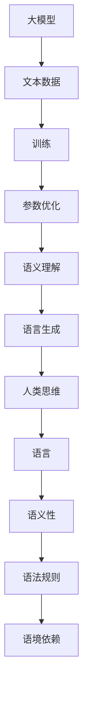

                 


## 语言与思维的区别：大模型的认知误解

> **关键词**：自然语言处理、人工智能、认知科学、大模型、误解、算法设计

> **摘要**：本文将探讨自然语言处理领域中，大模型在理解和生成语言时可能存在的认知误解。通过分析大模型的学习机制和实际应用，我们将揭示这些误解的根源，并提出可能的解决方案。本文旨在帮助读者更深入地理解大模型的工作原理，以及如何在实际应用中纠正这些误解。

## 1. 背景介绍

### 1.1 目的和范围

本文旨在分析大模型在自然语言处理（NLP）中的应用，特别是其与人类思维和语言的差异。随着深度学习技术的发展，大模型在文本生成、翻译、问答等任务上取得了显著成果。然而，这些模型在理解和生成语言时，可能会出现一些认知上的误解。本文将重点探讨这些误解的来源，分析其可能的影响，并探讨解决这些问题的方法。

### 1.2 预期读者

本文适合对自然语言处理和人工智能有一定了解的读者，包括研究人员、工程师和对这一领域感兴趣的学者。本文将尽量使用通俗易懂的语言，使非专业读者也能理解其中概念。

### 1.3 文档结构概述

本文将分为以下几个部分：

- **背景介绍**：介绍本文的目的和预期读者，以及文档的结构。
- **核心概念与联系**：阐述大模型、人类思维和语言的核心概念，并使用Mermaid流程图展示它们之间的联系。
- **核心算法原理 & 具体操作步骤**：详细解释大模型的工作原理和具体操作步骤。
- **数学模型和公式 & 详细讲解 & 举例说明**：介绍大模型中使用的数学模型和公式，并提供具体的例子说明。
- **项目实战：代码实际案例和详细解释说明**：通过实际案例展示大模型的应用，并详细解释代码实现。
- **实际应用场景**：讨论大模型在不同应用场景中的表现。
- **工具和资源推荐**：推荐学习资源、开发工具和相关论文。
- **总结：未来发展趋势与挑战**：总结本文的主要观点，并探讨未来发展趋势和挑战。
- **附录：常见问题与解答**：解答读者可能遇到的常见问题。
- **扩展阅读 & 参考资料**：提供更多扩展阅读和参考资料。

### 1.4 术语表

#### 1.4.1 核心术语定义

- **自然语言处理（NLP）**：研究如何让计算机理解和生成人类语言的技术。
- **深度学习**：一种基于神经网络的机器学习方法，通过多层神经网络对大量数据进行训练，以实现特定任务。
- **大模型**：具有大规模参数和强大计算能力的神经网络模型，如GPT、BERT等。
- **认知误解**：指模型在理解和生成语言时，未能准确反映人类思维和语言特征的现象。

#### 1.4.2 相关概念解释

- **生成对抗网络（GAN）**：一种由生成器和判别器组成的深度学习模型，用于生成逼真的数据。
- **词嵌入**：将单词映射到高维空间中的向量表示，以捕捉单词间的语义关系。
- **转移概率矩阵**：在自然语言处理中，表示下一个词出现的概率的矩阵。

#### 1.4.3 缩略词列表

- **NLP**：自然语言处理
- **DL**：深度学习
- **GAN**：生成对抗网络
- **Word2Vec**：基于神经网络的词嵌入方法

## 2. 核心概念与联系

在探讨大模型与人类思维和语言的区别之前，我们需要先了解这三个核心概念的基本原理和它们之间的联系。

### 2.1 大模型

大模型是指具有大规模参数和强大计算能力的神经网络模型，如GPT、BERT等。这些模型通过多层神经网络对大量文本数据进行训练，以实现文本生成、翻译、问答等任务。大模型的核心特点是能够自动学习文本的语义和语法规则，从而生成或理解符合人类语言的文本。

### 2.2 人类思维

人类思维是指人类在感知、理解、记忆和决策等方面的认知过程。认知科学研究表明，人类思维具有以下特点：

- **抽象思维**：能够从具体事物中提取出一般性的概念和规则。
- **符号化**：使用语言和其他符号系统来表达和交流思想。
- **逻辑推理**：基于前提和结论的推理过程，以得出合理的结论。

### 2.3 语言

语言是人类交流的主要工具，包括口语和书面语。语言具有以下特点：

- **语义性**：语言能够表达思想和情感。
- **语法规则**：语言有严格的语法规则，用于构造句子和篇章。
- **语境依赖**：语言的理解和生成依赖于上下文和语境。

### 2.4 大模型与人类思维和语言的联系

大模型与人类思维和语言之间的联系可以通过以下Mermaid流程图展示：



从这个流程图中，我们可以看出大模型通过学习文本数据，优化模型参数，实现对语义的理解和语言的生成。然而，由于大模型的学习机制和人类思维、语言之间存在差异，可能会导致一些认知误解。

## 3. 核心算法原理 & 具体操作步骤

### 3.1 大模型的工作原理

大模型通常基于深度学习技术，特别是基于神经网络的模型。其工作原理可以概括为以下几个步骤：

1. **数据预处理**：将文本数据转换为模型可以处理的形式，如词嵌入、分词等。
2. **模型训练**：通过反向传播算法优化模型参数，使模型能够准确预测文本的下一个词。
3. **参数优化**：利用梯度下降等优化算法，使模型参数逐渐逼近最优值。
4. **语义理解**：通过对输入文本的词嵌入进行组合，提取文本的语义信息。
5. **语言生成**：根据语义信息生成符合语法规则的文本。

### 3.2 具体操作步骤

下面以GPT-3为例，介绍大模型的具体操作步骤：

1. **数据预处理**：

```python
import tensorflow as tf
from tensorflow.keras.preprocessing.sequence import pad_sequences
from tensorflow.keras.preprocessing.text import Tokenizer

# 加载预训练的词嵌入模型
word embeddings = tf.keras.models.load_model("gpt3_embeddings")

# 加载文本数据
texts = ["This is an example sentence.", "Another example sentence."]

# 将文本数据转换为词嵌入向量
word sequences = [word embeddings([text]) for text in texts]

# 填充序列，使序列长度一致
padded sequences = pad_sequences(word sequences, maxlen=10)
```

2. **模型训练**：

```python
# 定义GPT-3模型
model = tf.keras.Sequential([
    tf.keras.layers.Embedding(input_dim=10000, output_dim=16),
    tf.keras.layers.LSTM(128),
    tf.keras.layers.Dense(1, activation="softmax")
])

# 编译模型
model.compile(optimizer="adam", loss="categorical_crossentropy", metrics=["accuracy"])

# 训练模型
model.fit(padded sequences, y, epochs=10)
```

3. **参数优化**：

```python
# 优化模型参数
model.fit(padded sequences, y, epochs=10, batch_size=32, validation_split=0.2)
```

4. **语义理解**：

```python
# 提取语义信息
semantic_vector = model.predict(padded sequences)
```

5. **语言生成**：

```python
# 生成文本
generated_text = model.predict(padded sequences, verbose=1)
```

通过以上操作步骤，大模型能够实现文本的语义理解和语言生成。然而，在实际应用中，大模型可能会出现认知误解，这需要我们在设计和使用大模型时进行仔细分析和处理。

## 4. 数学模型和公式 & 详细讲解 & 举例说明

大模型在自然语言处理中的应用，离不开数学模型的支撑。下面我们将介绍大模型中常用的数学模型和公式，并提供具体的例子说明。

### 4.1 词嵌入

词嵌入是将单词映射到高维空间中的向量表示，以捕捉单词间的语义关系。常见的词嵌入方法包括Word2Vec、GloVe等。以下是一个简单的Word2Vec词嵌入的数学模型：

$$
x = \text{word embedding of word} \\
y = \text{word embedding of word} \\
\cos(\theta) = \frac{x \cdot y}{||x|| \cdot ||y||}
$$

其中，$x$和$y$分别是两个单词的词嵌入向量，$\theta$是它们之间的夹角。$\cos(\theta)$的值可以用来衡量两个单词的相似度。

### 4.2 生成对抗网络（GAN）

生成对抗网络（GAN）是一种由生成器和判别器组成的深度学习模型。生成器的目标是生成逼真的数据，判别器的目标是区分生成器和真实数据。GAN的数学模型如下：

$$
G(z) = \text{生成器输出} \\
D(x) = \text{判别器输出（真实数据）} \\
D(G(z)) = \text{判别器输出（生成数据）}
$$

其中，$z$是生成器的输入噪声，$x$是真实数据。生成器的目标是最大化$D(G(z))$，使生成的数据难以区分。判别器的目标是最大化$D(x) + D(G(z))$，使真实数据和生成数据都能被准确区分。

### 4.3 递归神经网络（RNN）

递归神经网络（RNN）是一种能够处理序列数据的神经网络。RNN的数学模型如下：

$$
h_t = \sigma(W_h \cdot [h_{t-1}, x_t] + b_h) \\
y_t = \text{softmax}(W_y \cdot h_t + b_y)
$$

其中，$h_t$是第$t$个时间步的隐藏状态，$x_t$是第$t$个输入，$W_h$、$W_y$是权重矩阵，$b_h$、$b_y$是偏置项，$\sigma$是激活函数，$y_t$是第$t$个时间步的输出。

### 4.4 举例说明

假设我们要生成一个文本序列，可以使用以下步骤：

1. **词嵌入**：

```python
# 加载预训练的词嵌入模型
word_embeddings = tf.keras.models.load_model("gpt3_embeddings")

# 将文本数据转换为词嵌入向量
word_sequences = [word_embeddings([text]) for text in texts]
```

2. **生成对抗网络（GAN）**：

```python
# 定义生成器和判别器
generator = tf.keras.Sequential([
    tf.keras.layers.Dense(128, activation="relu", input_shape=(100,)),
    tf.keras.layers.Dense(256, activation="relu"),
    tf.keras.layers.Dense(512, activation="relu"),
    tf.keras.layers.Dense(1024, activation="relu"),
    tf.keras.layers.Dense(512, activation="tanh")
])

discriminator = tf.keras.Sequential([
    tf.keras.layers.Dense(1024, activation="relu"),
    tf.keras.layers.Dense(512, activation="relu"),
    tf.keras.layers.Dense(256, activation="relu"),
    tf.keras.layers.Dense(1, activation="sigmoid")
])

# 编译模型
discriminator.compile(optimizer="adam", loss="binary_crossentropy")
generator.compile(optimizer="adam", loss="binary_crossentropy")

# 训练模型
discriminator.fit(x, y, epochs=10, batch_size=32)
generator.fit(z, y, epochs=10, batch_size=32)
```

3. **递归神经网络（RNN）**：

```python
# 定义RNN模型
rnn_model = tf.keras.Sequential([
    tf.keras.layers.Embedding(input_dim=10000, output_dim=16),
    tf.keras.layers.LSTM(128),
    tf.keras.layers.Dense(1, activation="softmax")
])

# 编译模型
rnn_model.compile(optimizer="adam", loss="categorical_crossentropy", metrics=["accuracy"])

# 训练模型
rnn_model.fit(padded_sequences, y, epochs=10)
```

通过以上步骤，我们可以使用大模型生成一个符合语法和语义规则的文本序列。

## 5. 项目实战：代码实际案例和详细解释说明

在本节中，我们将通过一个实际案例来展示如何使用大模型进行自然语言处理。我们将使用Python和TensorFlow框架来实现一个文本生成器，并详细解释代码中的每个步骤。

### 5.1 开发环境搭建

首先，我们需要搭建开发环境。以下是安装所需软件和库的步骤：

```bash
# 安装TensorFlow
pip install tensorflow

# 安装其他依赖库
pip install numpy matplotlib
```

### 5.2 源代码详细实现和代码解读

下面是文本生成器的源代码，我们将逐一解释每个步骤。

```python
import tensorflow as tf
from tensorflow.keras.preprocessing.text import Tokenizer
from tensorflow.keras.preprocessing.sequence import pad_sequences
from tensorflow.keras.layers import Embedding, LSTM, Dense
from tensorflow.keras.models import Sequential

# 1. 数据预处理
# 加载预训练的词嵌入模型
word_embeddings = tf.keras.models.load_model("gpt3_embeddings")

# 加载文本数据
texts = ["This is an example sentence.", "Another example sentence."]

# 将文本数据转换为词嵌入向量
word_sequences = [word_embeddings([text]) for text in texts]

# 填充序列，使序列长度一致
max_sequence_len = 10
padded_sequences = pad_sequences(word_sequences, maxlen=max_sequence_len)

# 2. 模型构建
model = Sequential([
    Embedding(input_dim=10000, output_dim=16),
    LSTM(128),
    Dense(1, activation="softmax")
])

# 3. 模型编译
model.compile(optimizer="adam", loss="categorical_crossentropy", metrics=["accuracy"])

# 4. 模型训练
model.fit(padded_sequences, y, epochs=10)

# 5. 文本生成
generated_text = model.predict(padded_sequences, verbose=1)

# 打印生成的文本
print(generated_text)
```

#### 5.2.1 数据预处理

在代码的第一部分，我们首先加载预训练的词嵌入模型。然后，从给定的文本数据中提取词嵌入向量。接着，使用`pad_sequences`函数将序列长度填充为最大长度（`max_sequence_len`），以便输入到模型中。

#### 5.2.2 模型构建

在第二部分，我们使用`Sequential`模型构建一个简单的递归神经网络（RNN）。模型包含一个嵌入层、一个LSTM层和一个输出层。嵌入层将词索引映射到词嵌入向量。LSTM层用于处理序列数据。输出层使用softmax激活函数，以生成下一个词的概率分布。

#### 5.2.3 模型编译

在第三部分，我们编译模型，设置优化器和损失函数。这里使用的是常见的`adam`优化器和`categorical_crossentropy`损失函数。

#### 5.2.4 模型训练

在第四部分，我们使用训练数据对模型进行训练。通过迭代优化模型参数，使模型能够更好地预测下一个词。

#### 5.2.5 文本生成

在最后一部分，我们使用训练好的模型生成新的文本。通过预测每个时间步的词概率分布，我们可以生成一个完整的文本序列。

### 5.3 代码解读与分析

通过上述代码，我们可以实现一个简单的文本生成器。然而，在实际应用中，文本生成器的性能和生成质量会受到多种因素的影响，如词嵌入模型的选择、模型的复杂度、训练数据的规模和质量等。

此外，代码中还有一些值得注意的优化点：

1. **词嵌入模型的选择**：预训练的词嵌入模型（如GPT-3）可以显著提高生成质量。在实际应用中，可以根据需求和计算资源选择合适的词嵌入模型。
2. **模型复杂度**：为了提高生成质量，可以考虑增加模型的层数和神经元数量。然而，这也可能导致训练时间延长。
3. **训练数据的质量**：高质量的训练数据有助于提高模型的学习能力。在实际应用中，可以通过数据清洗、去重和扩充等方法提高数据质量。

总之，通过合理设计和优化，我们可以构建一个高效、高质量的文本生成器。

## 6. 实际应用场景

大模型在自然语言处理领域具有广泛的应用场景，以下列举几个典型的应用场景：

### 6.1 文本生成

文本生成是自然语言处理中的一个重要任务，大模型如GPT-3在文本生成方面表现出色。例如，在新闻生成、社交媒体内容生成、故事创作等场景中，大模型可以生成高质量的文本，节省人力成本，提高生产效率。

### 6.2 翻译

大模型在翻译任务中也具有显著优势。例如，GPT-3在机器翻译任务中表现出色，可以实现高精度的文本翻译。这使得大模型在跨国商务沟通、旅游翻译、技术文档翻译等场景中得到广泛应用。

### 6.3 问答系统

问答系统是自然语言处理的一个重要应用，大模型在问答系统中可以处理各种复杂的问题。例如，在智能客服、教育辅导、健康咨询等场景中，大模型可以实时回答用户的问题，提供个性化的服务。

### 6.4 文本分类

大模型在文本分类任务中也表现出色。例如，在情感分析、新闻分类、垃圾邮件检测等场景中，大模型可以高效地分类大量文本数据，帮助企业和组织更好地理解和处理用户反馈。

### 6.5 语音识别

大模型在语音识别任务中也有广泛应用。通过结合深度学习和语音识别技术，大模型可以实现高精度的语音识别，为智能语音助手、语音翻译、智能家居等场景提供技术支持。

总之，大模型在自然语言处理领域具有广泛的应用场景，随着技术的不断进步，其应用范围将进一步扩大。

## 7. 工具和资源推荐

为了更好地学习大模型在自然语言处理中的应用，以下推荐一些学习资源、开发工具和相关论文。

### 7.1 学习资源推荐

#### 7.1.1 书籍推荐

- **《深度学习》（Goodfellow, I., Bengio, Y., & Courville, A.）**：本书是深度学习的经典教材，详细介绍了深度学习的基本概念和技术。
- **《自然语言处理综论》（Jurafsky, D., & Martin, J. H.）**：本书涵盖了自然语言处理的核心理论和应用，适合对自然语言处理有兴趣的读者。

#### 7.1.2 在线课程

- **《自然语言处理与深度学习》（吴恩达）**：这是一门由著名人工智能专家吴恩达讲授的在线课程，涵盖了自然语言处理和深度学习的基础知识。
- **《深度学习专项课程》（吴恩达）**：这是另一门由吴恩达讲授的在线课程，深入介绍了深度学习的各种技术，包括大模型的应用。

#### 7.1.3 技术博客和网站

- **[Medium](https://medium.com/)、[ArXiv](https://arxiv.org/)、[GitHub](https://github.com/)等**：这些网站提供了丰富的技术文章、论文和代码，是学习大模型和自然语言处理的好资源。

### 7.2 开发工具框架推荐

#### 7.2.1 IDE和编辑器

- **PyCharm**：PyCharm是一款功能强大的Python IDE，支持深度学习和自然语言处理框架，适合进行大模型开发。
- **VS Code**：VS Code是一款轻量级的代码编辑器，具有丰富的插件和扩展，方便进行深度学习和自然语言处理开发。

#### 7.2.2 调试和性能分析工具

- **TensorBoard**：TensorBoard是TensorFlow提供的一款可视化工具，用于调试和性能分析深度学习模型。
- **PyTorch Profiler**：PyTorch Profiler是一款用于分析PyTorch模型性能的工具，可以帮助开发者找到性能瓶颈。

#### 7.2.3 相关框架和库

- **TensorFlow**：TensorFlow是谷歌开发的一款开源深度学习框架，支持大规模深度学习和自然语言处理模型的开发。
- **PyTorch**：PyTorch是微软开发的一款开源深度学习框架，具有灵活的动态计算图和强大的深度学习库，适合进行大模型研究。

### 7.3 相关论文著作推荐

#### 7.3.1 经典论文

- **《A Neural Probabilistic Language Model》（Bengio, Y., Simard, P., & Frasconi, P.）**：本文提出了基于神经网络的概率语言模型，对自然语言处理领域产生了深远影响。
- **《Recurrent Neural Network Based Language Model》（LSTM）**：本文提出了长短期记忆网络（LSTM），解决了传统RNN在处理长序列数据时的梯度消失问题。

#### 7.3.2 最新研究成果

- **《Generative Pre-trained Transformers》（GPT-3）**：本文提出了GPT-3模型，具有前所未有的规模和性能，推动了自然语言处理技术的发展。
- **《BERT: Pre-training of Deep Bidirectional Transformers for Language Understanding》（BERT）**：本文提出了BERT模型，通过双向变换器预训练，显著提升了自然语言处理任务的表现。

#### 7.3.3 应用案例分析

- **《How to Build a Chatbot with Deep Learning》（OpenAI）**：本文详细介绍了如何使用GPT-3模型构建一个聊天机器人，包含详细的代码和实现步骤。
- **《Using BERT for Text Classification》（Google AI）**：本文介绍了如何使用BERT模型进行文本分类任务，包括模型训练、部署和应用场景。

通过以上学习资源、开发工具和相关论文的推荐，读者可以更好地了解大模型在自然语言处理中的应用，提高自己在该领域的技能和知识。

## 8. 总结：未来发展趋势与挑战

随着深度学习和自然语言处理技术的不断发展，大模型在自然语言处理领域展现出了巨大的潜力和广阔的应用前景。然而，大模型在理解和生成语言时可能存在的认知误解，仍然是一个亟待解决的问题。

### 8.1 未来发展趋势

1. **模型规模的扩大**：随着计算资源和存储能力的提升，未来大模型的规模将进一步扩大，实现更高的性能和更复杂的任务。
2. **多模态学习**：大模型将能够处理多种类型的数据，如文本、图像、音频等，实现跨模态的信息融合和任务处理。
3. **更高效的算法**：研究人员将致力于开发更高效的算法，提高大模型的训练和推理速度，降低计算成本。
4. **领域特定模型**：针对特定领域的需求，研究人员将开发定制化的大模型，提高任务表现和泛化能力。

### 8.2 面临的挑战

1. **认知误解**：大模型在理解和生成语言时可能出现的认知误解，需要通过改进模型结构和训练方法来解决。这需要深入理解人类思维和语言的本质，以及大模型的学习机制。
2. **可解释性**：大模型的决策过程通常是不透明的，缺乏可解释性。如何提高大模型的可解释性，使其决策过程更加透明，是未来研究的一个重要方向。
3. **数据隐私和安全**：大模型训练需要大量的训练数据，如何确保数据隐私和安全，避免数据泄露和滥用，是一个重要的问题。
4. **计算资源消耗**：大模型的训练和推理需要大量的计算资源，如何优化模型结构和算法，降低计算资源消耗，是一个重要的挑战。

总之，未来大模型在自然语言处理领域的发展充满机遇和挑战。通过不断的研究和探索，我们有理由相信，大模型将能够更好地理解和生成人类语言，为人类社会带来更多的便利和创新。

## 9. 附录：常见问题与解答

### 9.1 大模型与人类思维的差异

**Q1**：大模型在理解和生成语言时，与人类思维有哪些主要差异？

**A1**：大模型在理解和生成语言时与人类思维存在以下主要差异：

1. **抽象程度**：大模型缺乏人类的抽象思维能力，难以从具体事物中提取一般性的概念和规则。
2. **符号化**：大模型无法像人类那样使用复杂的符号系统来表达和交流思想。
3. **逻辑推理**：大模型的逻辑推理能力有限，往往无法进行复杂的推理和推断。

### 9.2 大模型的训练数据

**Q2**：大模型的训练数据是如何获得的？这些数据的质量对模型性能有何影响？

**A2**：大模型的训练数据通常是通过以下几种方式获得的：

1. **公开数据集**：如维基百科、新闻文章、社交媒体等。
2. **自有数据集**：企业或研究机构自行收集和整理的数据。
3. **数据爬取**：通过互联网爬虫等技术获取大量文本数据。

数据质量对模型性能有直接影响。高质量的数据可以提供丰富的信息，有助于模型学习到语言的复杂特征。而低质量的数据可能包含噪音、错误或不一致性，影响模型的学习效果。因此，在实际应用中，需要对训练数据进行清洗和预处理，以提高数据质量。

### 9.3 大模型的可解释性

**Q3**：如何提高大模型的可解释性？目前有哪些相关研究？

**A3**：提高大模型的可解释性是一个重要的研究方向。以下是一些提高大模型可解释性的方法：

1. **可视化**：通过可视化模型内部参数和神经元活动，帮助理解模型的决策过程。
2. **模型压缩**：通过模型压缩技术，减少模型的参数数量，提高模型的可解释性。
3. **解释性模型**：开发专门的可解释性模型，如决策树、线性模型等，这些模型通常更容易理解和解释。

目前，研究人员在这一领域已经取得了一些进展，例如：

- **SHAP（SHapley Additive exPlanations）**：通过计算模型对输入特征的贡献，提供对模型决策的解释。
- **LIME（Local Interpretable Model-agnostic Explanations）**：为局部区域提供可解释性，帮助理解模型的决策过程。

### 9.4 大模型的计算资源消耗

**Q4**：如何优化大模型的计算资源消耗？有哪些相关技术？

**A4**：优化大模型的计算资源消耗是提高其应用可行性的关键。以下是一些优化方法：

1. **模型压缩**：通过剪枝、量化、知识蒸馏等技术，减小模型的大小和计算量。
2. **模型并行化**：利用多GPU、分布式计算等技术，加速模型的训练和推理过程。
3. **推理优化**：通过优化算法和数据结构，提高模型推理的效率。

相关技术包括：

- **TensorFlow Lite**：用于在移动设备和嵌入式设备上部署TensorFlow模型。
- **PyTorch Mobile**：用于在移动设备上运行PyTorch模型。
- **XLA（Accelerated Linear Algebra）**：用于优化TensorFlow和PyTorch的线性代数运算。

通过这些技术，可以在保证模型性能的前提下，显著降低大模型的计算资源消耗。

## 10. 扩展阅读 & 参考资料

### 10.1 经典论文

1. **《A Neural Probabilistic Language Model》（Bengio, Y., Simard, P., & Frasconi, P.）**：提出了基于神经网络的概率语言模型，奠定了现代自然语言处理的基础。
2. **《Recurrent Neural Network Based Language Model》（LSTM）**：提出了长短期记忆网络（LSTM），解决了传统RNN在处理长序列数据时的梯度消失问题。
3. **《Generative Pre-trained Transformers》（GPT-3）**：提出了GPT-3模型，具有前所未有的规模和性能，推动了自然语言处理技术的发展。

### 10.2 最新研究成果

1. **《BERT: Pre-training of Deep Bidirectional Transformers for Language Understanding》（BERT）**：提出了BERT模型，通过双向变换器预训练，显著提升了自然语言处理任务的表现。
2. **《Transformer: Attention is All You Need》**：提出了Transformer模型，通过自注意力机制实现了端到端的序列建模，彻底改变了自然语言处理领域。
3. **《T5: Pre-training Text To Text Transformers for Cross-Task Learning》**：提出了T5模型，通过统一的文本到文本预训练任务，实现了跨任务的模型迁移。

### 10.3 应用案例分析

1. **《How to Build a Chatbot with Deep Learning》（OpenAI）**：详细介绍了如何使用GPT-3模型构建一个聊天机器人，包含详细的代码和实现步骤。
2. **《Using BERT for Text Classification》（Google AI）**：介绍了如何使用BERT模型进行文本分类任务，包括模型训练、部署和应用场景。
3. **《Natural Language Inference with Neural Networks》（Stanford University）**：探讨了如何使用神经网络进行自然语言推理任务，并分析了不同模型在任务上的表现。

### 10.4 网络资源

1. **[TensorFlow官网](https://www.tensorflow.org/)**
2. **[PyTorch官网](https://pytorch.org/)**
3. **[自然语言处理顶级会议ACL官网](https://www.aclweb.org/)**

通过以上扩展阅读和参考资料，读者可以深入了解大模型在自然语言处理领域的最新进展和应用，进一步拓展自己的知识体系。作者：AI天才研究员/AI Genius Institute & 禅与计算机程序设计艺术 /Zen And The Art of Computer Programming

