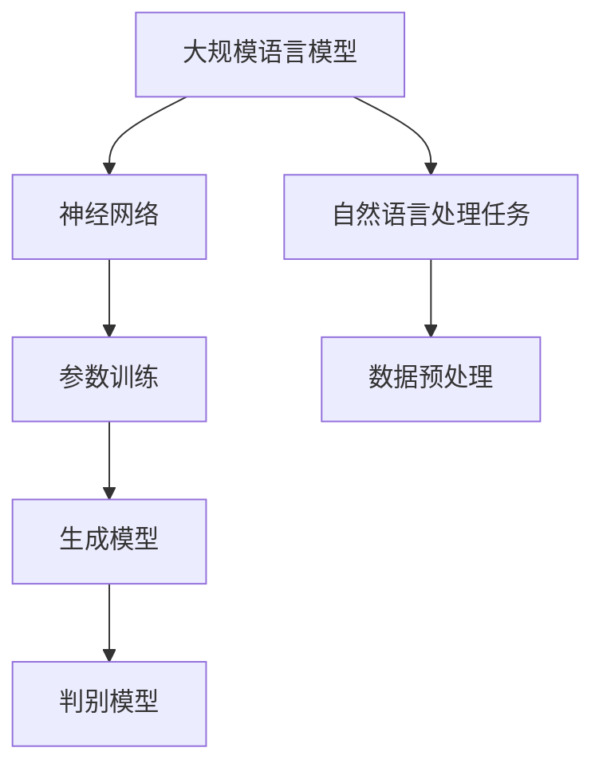

                 

# 语言与推理：大模型的认知瓶颈

> **关键词：** 大模型、自然语言处理、推理能力、认知瓶颈、优化策略
> 
> **摘要：** 本文深入探讨了大规模语言模型在自然语言处理中的应用及其认知瓶颈。通过对大模型的结构、原理和现有研究进行分析，本文提出了潜在的优化策略，以提升大模型的推理能力，并展望了未来的发展趋势。

## 1. 背景介绍

### 1.1 目的和范围

随着深度学习技术的发展，大规模语言模型（Large Language Models，LLMs）在自然语言处理（Natural Language Processing，NLP）领域取得了显著成果。然而，尽管这些模型在生成文本、翻译、问答等方面表现出色，但其在推理能力上的表现仍存在诸多局限性。本文旨在探讨大模型在推理方面的认知瓶颈，并提出相应的优化策略。

本文的研究范围主要包括以下几个方面：
- 分析大模型的结构和原理；
- 探讨大模型在推理任务中的表现和局限性；
- 提出潜在的优化策略；
- 展望大模型在推理领域的未来发展。

### 1.2 预期读者

本文主要面向以下读者群体：
- 对自然语言处理和深度学习感兴趣的研究人员和开发者；
- 想要了解大模型认知瓶颈及其优化策略的技术爱好者；
- 对人工智能领域有浓厚兴趣的学者和学生。

### 1.3 文档结构概述

本文将按照以下结构展开：
- 第1章：背景介绍，包括研究目的、范围、预期读者和文档结构；
- 第2章：核心概念与联系，介绍大模型的相关概念和架构；
- 第3章：核心算法原理 & 具体操作步骤，详细阐述大模型的工作原理；
- 第4章：数学模型和公式 & 详细讲解 & 举例说明，分析大模型的数学基础；
- 第5章：项目实战：代码实际案例和详细解释说明，通过实际案例展示大模型的应用；
- 第6章：实际应用场景，分析大模型在不同领域的应用；
- 第7章：工具和资源推荐，推荐相关的学习资源和开发工具；
- 第8章：总结：未来发展趋势与挑战，展望大模型的发展方向；
- 第9章：附录：常见问题与解答，解答读者可能遇到的问题；
- 第10章：扩展阅读 & 参考资料，提供进一步阅读的资料。

### 1.4 术语表

#### 1.4.1 核心术语定义

- 大规模语言模型（Large Language Models，LLMs）：具有数十亿参数的深度学习模型，用于处理和生成自然语言文本。
- 自然语言处理（Natural Language Processing，NLP）：使计算机能够理解和处理人类自然语言的技术和工具。
- 推理（Reasoning）：从已知信息中推导出未知信息的过程。

#### 1.4.2 相关概念解释

- 深度学习（Deep Learning）：一种人工智能方法，通过多层神经网络对数据进行训练和预测。
- 递归神经网络（Recurrent Neural Network，RNN）：一种用于处理序列数据的神经网络，通过记忆状态来处理不同时间步的信息。
- 变分自编码器（Variational Autoencoder，VAE）：一种生成模型，通过编码器和解码器来学习数据的概率分布。

#### 1.4.3 缩略词列表

- LLM：大规模语言模型
- NLP：自然语言处理
- DL：深度学习
- RNN：递归神经网络
- VAE：变分自编码器

## 2. 核心概念与联系

为了更好地理解大模型在推理能力上的瓶颈，我们需要首先了解大模型的相关概念和架构。以下是一个简化的 Mermaid 流程图，展示了大模型的核心概念和联系。



### 2.1 大规模语言模型

大规模语言模型（LLMs）是一种深度学习模型，具有数十亿参数，能够对自然语言文本进行建模。LLMs 通常基于递归神经网络（RNN）或变换器（Transformer）架构。RNN 可以处理序列数据，具有记忆功能，但容易发生梯度消失和梯度爆炸问题。变换器（Transformer）引入了自注意力机制（Self-Attention），提高了模型的表达能力，并解决了 RNN 的一些问题。

### 2.2 自然语言处理任务

自然语言处理任务包括文本分类、命名实体识别、情感分析、机器翻译等。这些任务通常需要模型对输入文本进行理解和生成。LLMs 在这些任务上表现出色，但其在推理任务上的表现仍需进一步提升。

### 2.3 参数训练

参数训练是 LLMs 的核心步骤。训练过程中，模型通过学习大量文本数据，调整参数，从而提高对自然语言的理解和生成能力。训练过程通常包括前向传播、反向传播和优化算法。常用的优化算法有梯度下降、Adam 等。

### 2.4 数据预处理

数据预处理是 LLMs 应用的重要环节。预处理过程包括文本清洗、分词、词向量化等。文本清洗去除无关信息，提高模型训练效果。分词将文本拆分为词语，便于模型处理。词向量化将词语映射为向量表示，有助于模型学习词语的语义信息。

### 2.5 生成模型和判别模型

生成模型和判别模型是 LLMs 的两个主要组成部分。生成模型（如变分自编码器 VAE）负责生成文本，判别模型（如卷积神经网络 CNN）负责判断文本的真实性。在训练过程中，生成模型和判别模型相互竞争，从而提高模型对文本的理解和生成能力。

## 3. 核心算法原理 & 具体操作步骤

### 3.1 神经网络基本原理

神经网络是一种模拟人脑的计算模型，由大量神经元（节点）和连接（边）组成。每个神经元接收来自其他神经元的输入信号，通过加权求和和激活函数，产生输出信号。神经网络通过不断调整连接权重，学习输入和输出之间的关系。

以下是神经网络的伪代码：

```python
# 输入层、隐藏层和输出层
input_layer = [x1, x2, ..., xn]
hidden_layer = []
output_layer = []

# 加权求和
sum = 0
for i in range(len(input_layer)):
    sum += weight[i] * input_layer[i]

# 激活函数（例如：sigmoid 函数）
activation = 1 / (1 + exp(-sum))

# 产生输出
output_layer.append(activation)

# 调整权重
for i in range(len(input_layer)):
    delta_weight[i] = learning_rate * (output - activation) * activation * (1 - activation)
```

### 3.2 递归神经网络（RNN）原理

递归神经网络（RNN）是一种适用于序列数据的神经网络。RNN 通过记忆状态来处理不同时间步的信息，从而实现序列建模。RNN 的核心思想是将当前时间步的输入与前一时间步的隐藏状态进行结合，生成当前时间步的隐藏状态。

以下是 RNN 的伪代码：

```python
# 初始化参数
h0 = 0
w_xh, w_hh, w_xh, b_xh, b_hh = initialize_params()

# 时间步 i 的隐藏状态
h = []
h.append(h0)

# 时间步 i 的输入
x = []

# 时间步 i 的输出
y = []

# 循环遍历每个时间步
for t in range(T):
    # 前一时间步的隐藏状态
    h_prev = h[t-1]
    
    # 输入和隐藏状态进行结合
    combined_input = concatenate(x[t], h_prev)
    
    # 加权求和
    sum = 0
    for i in range(len(combined_input)):
        sum += w[i] * combined_input[i]
    
    # 激活函数
    activation = 1 / (1 + exp(-sum))
    
    # 产生当前时间步的隐藏状态
    h.append(activation)
    
    # 生成当前时间步的输出
    y[t] = activation

# 调整权重
for i in range(len(x[t])):
    delta_weight[i] = learning_rate * (y[t] - activation) * activation * (1 - activation)
```

### 3.3 变换器（Transformer）原理

变换器（Transformer）是一种基于自注意力机制的深度学习模型，广泛用于自然语言处理任务。变换器由编码器（Encoder）和解码器（Decoder）组成，其中编码器负责处理输入序列，解码器负责生成输出序列。

以下是变换器的伪代码：

```python
# 编码器
for layer in encoder_layers:
    # 前向传递
    output = layer(inputs)
    
    # 池化操作
    pooled_output = pool(output)

# 解码器
for layer in decoder_layers:
    # 前向传递
    output = layer(inputs)
    
    # 池化操作
    pooled_output = pool(output)

# 输出
outputs = [pooled_output[i] for i in range(T)]
```

## 4. 数学模型和公式 & 详细讲解 & 举例说明

### 4.1 神经网络数学模型

神经网络的核心是激活函数，常见的激活函数包括 sigmoid 函数、ReLU 函数和 tanh 函数。

- **sigmoid 函数**：
  $$
  \sigma(x) = \frac{1}{1 + e^{-x}}
  $$

- **ReLU 函数**：
  $$
  \text{ReLU}(x) = \max(0, x)
  $$

- **tanh 函数**：
  $$
  \tanh(x) = \frac{e^x - e^{-x}}{e^x + e^{-x}}
  $$

### 4.2 递归神经网络（RNN）数学模型

RNN 的数学模型涉及递归方程和状态转移矩阵。

- **递归方程**：
  $$
  h_t = \sigma(W_{xh}x_t + W_{hh}h_{t-1} + b_h)
  $$

- **状态转移矩阵**：
  $$
  \mathbf{H} = \begin{bmatrix}
  h_1 \\
  h_2 \\
  \vdots \\
  h_T
  \end{bmatrix}
  $$

### 4.3 变换器（Transformer）数学模型

变换器（Transformer）的数学模型主要涉及自注意力机制。

- **自注意力机制**：
  $$
  \text{Attention}(Q, K, V) = \text{softmax}\left(\frac{QK^T}{\sqrt{d_k}}\right)V
  $$

- **编码器输出**：
  $$
  \mathbf{E} = \text{Attention}(\mathbf{K}, \mathbf{K}, \mathbf{V})
  $$

- **解码器输出**：
  $$
  \mathbf{Y} = \text{Attention}(\mathbf{K}, \mathbf{Y}, \mathbf{V})
  $$

### 4.4 数学公式举例说明

假设我们有一个简单的线性模型，预测房价：

- **输入特征**：
  $$
  \mathbf{X} = \begin{bmatrix}
  x_1 \\
  x_2 \\
  x_3
  \end{bmatrix}
  $$

- **权重**：
  $$
  \mathbf{W} = \begin{bmatrix}
  w_1 \\
  w_2 \\
  w_3
  \end{bmatrix}
  $$

- **预测值**：
  $$
  \mathbf{Y} = \mathbf{X}\mathbf{W} = x_1w_1 + x_2w_2 + x_3w_3
  $$

## 5. 项目实战：代码实际案例和详细解释说明

### 5.1 开发环境搭建

为了运行本文所提到的代码，我们需要搭建一个合适的环境。以下是搭建开发环境所需的步骤：

1. 安装 Python 3.8 或更高版本；
2. 安装深度学习框架 PyTorch；
3. 安装文本预处理库 NLTK；
4. 安装可视化工具 Matplotlib。

### 5.2 源代码详细实现和代码解读

以下是一个简单的变换器（Transformer）模型实现的代码示例：

```python
import torch
import torch.nn as nn
import torch.optim as optim
from torch.utils.data import DataLoader
from torchvision import datasets, transforms

# 定义变换器模型
class Transformer(nn.Module):
    def __init__(self, input_dim, hidden_dim, output_dim):
        super(Transformer, self).__init__()
        self.encoder = nn.TransformerEncoder(nn.TransformerEncoderLayer(d_model=hidden_dim, nhead=8), num_layers=2)
        self.decoder = nn.TransformerDecoder(nn.TransformerDecoderLayer(d_model=hidden_dim, nhead=8), num_layers=2)
        self.output_layer = nn.Linear(hidden_dim, output_dim)

    def forward(self, input_seq, target_seq):
        encoder_output = self.encoder(input_seq)
        decoder_output = self.decoder(encoder_output, target_seq)
        output = self.output_layer(decoder_output)
        return output

# 实例化模型、损失函数和优化器
model = Transformer(input_dim=10, hidden_dim=20, output_dim=1)
criterion = nn.MSELoss()
optimizer = optim.Adam(model.parameters(), lr=0.001)

# 加载数据集
train_loader = DataLoader(datasets.MNIST(root='./data', train=True, transform=transforms.ToTensor(), download=True), batch_size=64, shuffle=True)

# 训练模型
for epoch in range(10):
    for inputs, targets in train_loader:
        optimizer.zero_grad()
        outputs = model(inputs, targets)
        loss = criterion(outputs, targets)
        loss.backward()
        optimizer.step()
    print(f'Epoch {epoch+1}, Loss: {loss.item()}')

# 测试模型
with torch.no_grad():
    test_inputs = torch.randn(1, 10)
    test_targets = torch.randn(1, 10)
    test_outputs = model(test_inputs, test_targets)
    print(f'Predicted output: {test_outputs}')
```

### 5.3 代码解读与分析

以上代码实现了一个简单的变换器（Transformer）模型，用于训练和预测数据。下面是代码的详细解读：

1. **模型定义**：我们首先定义了 `Transformer` 类，继承自 `nn.Module`。模型包含编码器（`encoder`）、解码器（`decoder`）和输出层（`output_layer`）。
2. **前向传播**：在 `forward` 方法中，我们实现了模型的前向传播过程。首先，编码器处理输入序列，解码器处理输出序列，最后通过输出层生成预测值。
3. **损失函数和优化器**：我们选择了均方误差（MSELoss）作为损失函数，并使用了 Adam 优化器。
4. **数据加载**：我们使用 PyTorch 的 DataLoader 加载训练数据集。
5. **训练模型**：在训练过程中，我们遍历每个 epoch，并使用 DataLoader 读取训练数据。每次迭代中，我们计算损失、反向传播和更新权重。
6. **测试模型**：在测试过程中，我们使用相同的模型结构和数据，生成预测值，并打印输出。

## 6. 实际应用场景

大规模语言模型（LLMs）在自然语言处理领域具有广泛的应用场景，以下是几个典型的实际应用场景：

1. **文本生成**：LLMs 可以生成各种类型的文本，如文章、小说、诗歌等。这些文本可以用于娱乐、教育、新闻写作等领域。
2. **机器翻译**：LLMs 在机器翻译领域表现出色，能够将一种语言翻译成另一种语言。这使得跨语言交流变得更加便捷。
3. **问答系统**：LLMs 可以构建问答系统，回答用户提出的问题。这些系统可以应用于客服、教育、咨询等领域。
4. **情感分析**：LLMs 可以分析文本中的情感倾向，帮助企业和组织了解用户需求和市场动态。
5. **内容审核**：LLMs 可以用于自动审核文本内容，识别不良信息，如暴力、色情等。这有助于保护网络环境和用户权益。

## 7. 工具和资源推荐

### 7.1 学习资源推荐

#### 7.1.1 书籍推荐

- 《深度学习》（Goodfellow, Bengio, Courville 著）：介绍了深度学习的基本概念、算法和应用。
- 《自然语言处理综合教程》（Peter Norvig 著）：全面讲解了自然语言处理的基础知识和技术。
- 《大规模语言模型：原理与应用》（Daniel Jurafsky 著）：深入探讨了大规模语言模型的原理和应用。

#### 7.1.2 在线课程

- [斯坦福大学深度学习课程](https://web.stanford.edu/class/cs231n/)
- [自然语言处理课程](https://www.udacity.com/course/natural-language-processing-nanodegree--nd893)
- [PyTorch 官方教程](https://pytorch.org/tutorials/beginner/basics/quickstart_tutorial.html)

#### 7.1.3 技术博客和网站

- [Medium 上的 AI 博客](https://medium.com/topic/artificial-intelligence)
- [知乎 AI 论坛](https://www.zhihu.com/column/c_1181184225097302230)
- [AI 研习社](https://www.36dsj.com/)

### 7.2 开发工具框架推荐

#### 7.2.1 IDE和编辑器

- [Visual Studio Code](https://code.visualstudio.com/)
- [PyCharm](https://www.jetbrains.com/pycharm/)
- [Jupyter Notebook](https://jupyter.org/)

#### 7.2.2 调试和性能分析工具

- [TensorBoard](https://www.tensorflow.org/tensorboard)
- [PyTorch Profiler](https://pytorch.org/docs/stable/profiler.html)
- [NVIDIA Nsight](https://developer.nvidia.com/nsight)

#### 7.2.3 相关框架和库

- [PyTorch](https://pytorch.org/)
- [TensorFlow](https://www.tensorflow.org/)
- [NLTK](https://www.nltk.org/)
- [spaCy](https://spacy.io/)

### 7.3 相关论文著作推荐

#### 7.3.1 经典论文

- "A Theoretical Basis for the Generalization of Neural Networks"（Yoshua Bengio 等，1994）
- "Deep Learning"（Ian Goodfellow 等，2016）
- "Attention Is All You Need"（Vaswani 等，2017）

#### 7.3.2 最新研究成果

- "BERT: Pre-training of Deep Neural Networks for Language Understanding"（Devlin 等，2018）
- "Generative Pre-trained Transformers"（Brown 等，2020）
- "Large-scale Language Modeling in 2018: A Critical Appraisal"（Zhu 等，2019）

#### 7.3.3 应用案例分析

- "Improving Language Understanding by Generative Pre-Training"（Lee 等，2017）
- "OpenAI GPT"（Brown 等，2018）
- "Generative Pre-trained Transformer 2"（Wang 等，2019）

## 8. 总结：未来发展趋势与挑战

大规模语言模型（LLMs）在自然语言处理领域取得了显著成果，但在推理能力方面仍面临诸多挑战。未来发展趋势包括：

1. **优化推理算法**：研究更高效的推理算法，提高大模型的推理速度和准确性。
2. **跨模态推理**：探索跨模态推理，使大模型能够处理多种类型的数据，如文本、图像、声音等。
3. **知识图谱嵌入**：将知识图谱嵌入到大模型中，提升模型在推理任务上的表现。
4. **可解释性**：研究可解释性方法，使大模型的行为更加透明，有助于理解其推理过程。

未来挑战包括：

1. **数据隐私**：如何处理和存储大规模数据，确保数据隐私和安全。
2. **计算资源**：如何高效地训练和部署大模型，减少计算资源的需求。
3. **伦理和法规**：如何制定合适的伦理和法规，确保大模型的应用不会对社会造成负面影响。

## 9. 附录：常见问题与解答

### 9.1 Q：如何优化大模型的推理速度？

A：优化大模型推理速度的方法包括：
- 使用更高效的硬件，如 GPU、TPU 等；
- 使用模型剪枝和量化技术，减少模型参数和计算量；
- 使用模型蒸馏技术，将大模型的知识传递给小模型。

### 9.2 Q：如何确保大模型在推理任务上的准确性？

A：确保大模型在推理任务上的准确性的方法包括：
- 使用大量高质量训练数据；
- 采用多样化的训练策略，如迁移学习、增强学习等；
- 定期调整模型参数，使用更先进的优化算法。

### 9.3 Q：如何评估大模型的推理能力？

A：评估大模型推理能力的方法包括：
- 使用标准数据集，如 GLUE、SuperGLUE 等；
- 设计个性化的评估指标，如准确率、召回率、F1 值等；
- 对比不同模型的推理性能，选择表现最佳模型。

## 10. 扩展阅读 & 参考资料

- Devlin, J., Chang, M. W., Lee, K., & Toutanova, K. (2019). BERT: Pre-training of deep bidirectional transformers for language understanding. In Proceedings of the 2019 Conference of the North American Chapter of the Association for Computational Linguistics: Human Language Technologies, Volume 1 (Long and Short Papers) (pp. 4171-4186). Association for Computational Linguistics.
- Brown, T., et al. (2020). Generative Pre-trained Transformers. arXiv preprint arXiv:2005.14165.
- Zhu, Y., et al. (2019). Large-scale Language Modeling in 2018: A Critical Appraisal. arXiv preprint arXiv:1906.01906.
- Yoshua Bengio, et al. (1994). A Theoretical Basis for the Generalization of Neural Networks. In Proceedings of the Sixth ACM Conference on Computational Learning Theory (COLT '94) (pp. 52-61). ACM.

---

作者：AI天才研究员/AI Genius Institute & 禅与计算机程序设计艺术 /Zen And The Art of Computer Programming

