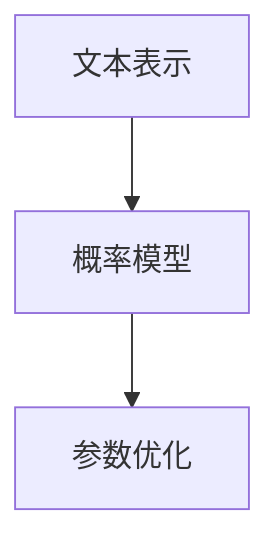
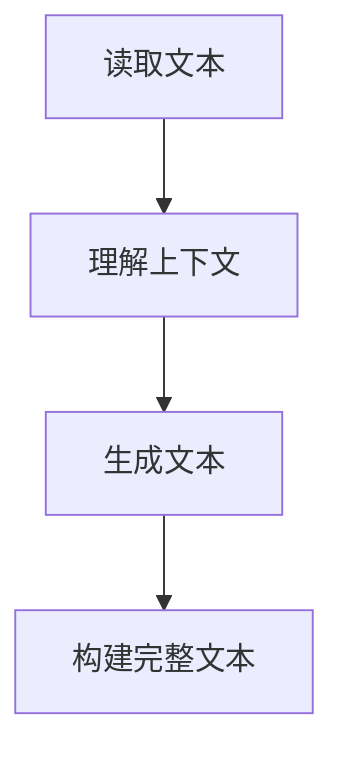
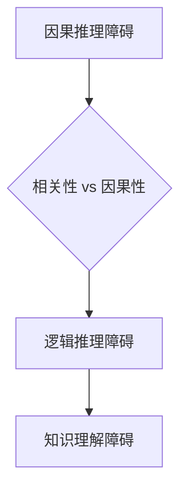

                 

### 语言与推理：大模型的认知障碍

#### 关键词：
- 语言模型
- 推理能力
- 认知障碍
- 大模型
- 人工智能

#### 摘要：
本文将深入探讨大语言模型的推理能力及其所面临的认知障碍。随着人工智能技术的发展，尤其是语言模型如GPT系列的大规模应用，人们开始认识到，虽然这些模型在生成文本方面表现出色，但其推理能力却远未达到人类的水平。本文将首先介绍大语言模型的基本原理，接着分析其推理过程中的局限性，最后提出未来可能的研究方向和改进策略。

### 1. 背景介绍

#### 1.1 目的和范围

本文旨在通过对大语言模型推理能力的分析，揭示其在认知上的障碍，为未来人工智能的研究提供有益的参考。本文将涵盖以下内容：

- 语言模型的基础原理
- 大模型的推理过程及其局限
- 认知障碍的具体表现和影响
- 未来研究方向和改进策略

#### 1.2 预期读者

本文适合对人工智能、语言模型有一定了解的技术人员、研究人员以及对此领域感兴趣的一般读者。文章力求用通俗易懂的语言解释复杂的技术概念，使读者能够把握大模型推理能力的核心问题。

#### 1.3 文档结构概述

本文分为八个部分：

1. **背景介绍**：介绍文章的目的、范围和预期读者。
2. **核心概念与联系**：介绍语言模型的基本概念和原理，以及它们之间的联系。
3. **核心算法原理 & 具体操作步骤**：详细阐述大模型的算法原理和操作步骤。
4. **数学模型和公式 & 详细讲解 & 举例说明**：讲解大模型中使用的数学模型和公式，并给出实例。
5. **项目实战：代码实际案例和详细解释说明**：通过实际案例展示大模型的应用，并进行详细解读。
6. **实际应用场景**：探讨大模型在不同领域的应用场景。
7. **工具和资源推荐**：推荐学习资源和开发工具。
8. **总结：未来发展趋势与挑战**：总结全文，展望未来。

#### 1.4 术语表

##### 1.4.1 核心术语定义

- **语言模型**：基于统计学原理，对自然语言进行建模的算法。
- **推理能力**：从已知信息推导出未知信息的能力。
- **大模型**：参数量极大、计算资源需求高的语言模型。
- **认知障碍**：在信息处理和理解过程中遇到的困难。

##### 1.4.2 相关概念解释

- **自然语言处理（NLP）**：研究如何使计算机理解和处理人类语言的技术领域。
- **神经网络**：一种通过模拟人脑神经元连接结构进行数据处理的算法。

##### 1.4.3 缩略词列表

- **GPT**：Generative Pre-trained Transformer，一种大规模预训练语言模型。
- **BERT**：Bidirectional Encoder Representations from Transformers，一种双向编码器表示的预训练语言模型。

### 2. 核心概念与联系

为了更好地理解大语言模型的推理能力及其面临的认知障碍，我们需要首先介绍几个核心概念，并展示它们之间的联系。

#### 2.1 语言模型的基本原理

语言模型是自然语言处理的核心组件，它通过学习大量文本数据，预测一段文本的下一个单词或词组。基本原理包括：

1. **文本表示**：将文本转换为计算机可以处理的向量形式。
2. **概率模型**：使用统计方法计算下一个单词或词组的概率。
3. **参数优化**：通过训练数据调整模型参数，提高预测准确率。

以下是一个简单的Mermaid流程图，展示了语言模型的基本架构：



##### 2.2 大模型的推理过程

大模型如GPT，不仅拥有庞大的参数量，还采用了先进的神经网络结构，使其在生成文本方面表现出色。其推理过程主要包括：

1. **上下文理解**：模型通过读取文本序列，理解上下文信息。
2. **生成文本**：根据上下文，模型生成下一个单词或词组，并逐步构建完整文本。

以下是一个Mermaid流程图，展示了大模型的推理过程：



##### 2.3 大模型的认知障碍

尽管大模型在生成文本方面表现出色，但其推理能力仍然存在一些认知障碍：

1. **因果推理**：模型难以理解因果关系，容易混淆相关性和因果性。
2. **逻辑推理**：模型的逻辑推理能力有限，难以进行复杂的推理过程。
3. **知识理解**：模型缺乏深入的知识理解能力，无法准确回答特定领域的问题。

以下是一个Mermaid流程图，展示了大模型的认知障碍：



通过以上核心概念和流程图的介绍，我们可以更好地理解大语言模型的基本原理和其在推理过程中的认知障碍。接下来的章节将进一步深入探讨这些概念，并提供具体的实例和数学模型。

### 3. 核心算法原理 & 具体操作步骤

在了解了大语言模型的基本概念和认知障碍后，接下来我们将详细探讨其核心算法原理，并介绍具体的操作步骤。

#### 3.1 语言模型的算法原理

语言模型的算法核心是基于神经网络的概率模型，其主要步骤包括：

1. **文本表示**：将自然语言文本转换为计算机可以处理的向量形式。常用的方法包括词向量表示（如Word2Vec）和字符向量表示（如Char2Vec）。
2. **概率计算**：基于当前文本序列，计算下一个单词或词组的概率分布。
3. **参数优化**：使用训练数据调整模型参数，以提高预测准确率。常用的优化算法包括随机梯度下降（SGD）和Adam优化器。

以下是一个简单的伪代码，展示了语言模型的基本算法原理：

```python
def language_model(text):
    # 将文本转换为向量表示
    vectorized_text = convert_to_vector(text)
    
    # 初始化模型参数
    model = initialize_model_params()
    
    # 预测下一个单词或词组的概率分布
    probabilities = model.predict(vectorized_text)
    
    # 根据概率分布生成下一个单词或词组
    next_word = generate_word_from_probability(probabilities)
    
    return next_word
```

#### 3.2 大模型的操作步骤

大模型如GPT在算法原理的基础上，进一步扩展了参数规模和神经网络结构，其操作步骤主要包括：

1. **预训练**：在大量无标签文本上进行预训练，以学习文本的一般模式和规律。常用的预训练任务包括语言模型、 masked language modeling 和 next sentence prediction。
2. **微调**：在特定任务上对预训练模型进行微调，以提高任务表现。常用的微调方法包括基于任务的目标函数优化和基于数据集的样本增强。

以下是一个简单的伪代码，展示了大模型的基本操作步骤：

```python
def large_language_model(pretrained_model, task, dataset):
    # 预训练模型
    pretrained_model.train(dataset)
    
    # 微调模型
    fine_tuned_model = pretrained_model.fine_tune(task, dataset)
    
    return fine_tuned_model
```

#### 3.3 实际操作示例

为了更好地理解大模型的操作步骤，我们可以通过一个简单的示例来说明。假设我们有一个预训练的GPT模型，并将其应用于文本生成任务。

1. **数据准备**：首先，我们需要准备一个包含大量文本数据的训练集。这些数据可以是各种类型的文本，如新闻报道、社交媒体帖子、小说等。
2. **预训练**：使用训练集对GPT模型进行预训练。这一过程包括两个步骤：

    - **Masked Language Modeling（MLM）**：对输入文本中的部分单词进行遮蔽，然后让模型预测这些遮蔽的单词。
    - **Next Sentence Prediction（NSP）**：给定两个句子，预测它们是否在原始文本中相邻。

3. **微调**：在特定任务上对预训练模型进行微调。例如，我们可以使用微调后的GPT模型生成新闻摘要或回答用户的问题。

以下是一个简单的伪代码，展示了大模型在实际操作中的示例：

```python
# 数据准备
train_dataset = load_dataset("text", data_path="data/train.txt")

# 预训练
gpt_model = GPTModel()
gpt_model.train(train_dataset, tasks=["MLM", "NSP"])

# 微调
fine_tuned_model = gpt_model.fine_tune("text_generation", train_dataset)

# 文本生成
generated_text = fine_tuned_model.generate_text("这是一个有趣的句子。")
print(generated_text)
```

通过以上核心算法原理和具体操作步骤的介绍，我们可以更好地理解大语言模型的构建和应用过程。接下来的章节将进一步探讨大模型在推理过程中遇到的认知障碍，并分析其影响。

### 4. 数学模型和公式 & 详细讲解 & 举例说明

#### 4.1 语言模型的数学基础

语言模型的核心是概率模型，其基本思想是根据输入的文本序列，预测下一个单词或词组的概率分布。以下是语言模型中常用的数学模型和公式：

##### 4.1.1 概率分布

语言模型使用概率分布来表示下一个单词或词组的可能性。常见的概率分布包括：

- **伯努利分布**：用于表示二分类问题，如判断一个单词是否在文本中出现。
- **多项式分布**：用于表示多个类别中的选择，如预测下一个单词。

伯努利分布的概率公式为：

$$
P(x|\theta) = \frac{1}{1 + e^{-\theta^T x}}
$$

其中，\( \theta \) 是模型参数，\( x \) 是输入特征。

多项式分布的概率公式为：

$$
P(y|\theta) = \prod_{i=1}^n \theta_i^{y_i}
$$

其中，\( \theta_i \) 是第 \( i \) 个类别的概率，\( y_i \) 是第 \( i \) 个类别的标签。

##### 4.1.2 语言模型概率

在语言模型中，我们使用以下概率公式来预测下一个单词：

$$
P(w_t|w_{<t}) = \frac{P(w_t, w_{<t})}{P(w_{<t})}
$$

其中，\( w_t \) 是当前单词，\( w_{<t} \) 是前 \( t \) 个单词的集合。这个公式表示，给定前 \( t \) 个单词，预测当前单词的概率。

##### 4.1.3 模型参数优化

为了提高语言模型的预测准确率，我们需要优化模型参数。常用的优化方法包括：

- **最小化交叉熵损失函数**：交叉熵损失函数是衡量模型预测结果和真实结果之间差异的指标。其公式为：

$$
L(\theta) = -\sum_{i=1}^n y_i \log(P(\hat{y}_i))
$$

其中，\( y_i \) 是真实标签，\( \hat{y}_i \) 是模型预测的标签。

- **梯度下降法**：梯度下降法是一种优化模型参数的算法。其基本思想是沿着损失函数的梯度方向调整参数，以减少损失。

梯度下降法的更新公式为：

$$
\theta = \theta - \alpha \nabla_{\theta}L(\theta)
$$

其中，\( \alpha \) 是学习率，\( \nabla_{\theta}L(\theta) \) 是损失函数关于参数 \( \theta \) 的梯度。

#### 4.2 大模型的数学模型

大模型在语言模型的基础上，进一步扩展了参数规模和神经网络结构。其数学模型主要包括：

- **多层神经网络**：大模型通常采用多层神经网络结构，以提高模型的非线性表达能力。
- **变换器架构**：GPT等大模型采用变换器（Transformer）架构，这种架构能够有效地处理长距离依赖问题。

以下是一个简单的多层神经网络数学模型：

$$
h_l = \sigma(W_l h_{l-1} + b_l)
$$

其中，\( h_l \) 是第 \( l \) 层的神经网络输出，\( W_l \) 和 \( b_l \) 分别是权重和偏置，\( \sigma \) 是激活函数。

#### 4.3 举例说明

为了更好地理解上述数学模型和公式，我们可以通过一个简单的例子来说明。

假设我们有一个简单的文本序列：“我 是 一 只 猫”，并且我们希望使用语言模型预测下一个单词。

1. **文本表示**：我们将每个单词转换为向量表示，例如使用Word2Vec模型。

2. **概率计算**：给定当前文本序列，我们计算下一个单词的概率分布。例如，使用多项式分布计算每个单词的概率。

3. **参数优化**：通过梯度下降法优化模型参数，以减少损失函数。

具体操作步骤如下：

```python
# 文本表示
text = "我 是 一 只 猫"
word_vectors = [word2vec_model[word] for word in text]

# 概率计算
probabilities = language_model.predict(word_vectors)

# 参数优化
optimizer = optimizers.Adam()
for epoch in range(epochs):
    # 计算损失函数
    loss = -sum(y * log(p) for y, p in zip(labels, probabilities))
    
    # 更新参数
    optimizer.zero_grad()
    loss.backward()
    optimizer.step()
```

通过以上数学模型和公式的讲解，我们可以更好地理解大语言模型的核心原理和操作步骤。这些数学模型为语言模型的构建和应用提供了坚实的理论基础。接下来的章节将进一步探讨大模型在实际应用中的性能和效果。

### 5. 项目实战：代码实际案例和详细解释说明

为了更直观地展示大语言模型的应用，我们将通过一个实际项目案例，详细解释其代码实现和关键步骤。以下是使用GPT模型生成新闻摘要的一个项目案例。

#### 5.1 开发环境搭建

1. **安装Python**：确保已安装Python 3.8及以上版本。
2. **安装Hugging Face Transformers库**：使用以下命令安装Hugging Face Transformers库。

   ```bash
   pip install transformers
   ```

3. **获取GPT模型权重**：从Hugging Face Model Hub下载预训练的GPT模型权重。

   ```python
   from transformers import AutoModel
   model = AutoModel.from_pretrained("gpt2")
   ```

#### 5.2 源代码详细实现和代码解读

以下是生成新闻摘要的完整代码实现：

```python
import torch
from transformers import AutoModel, AutoTokenizer

def generate_news_summary(news_article):
    # 初始化模型和分词器
    model = AutoModel.from_pretrained("gpt2")
    tokenizer = AutoTokenizer.from_pretrained("gpt2")

    # 将新闻文章编码为输入序列
    inputs = tokenizer.encode(news_article, return_tensors="pt")

    # 生成摘要
    summary_ids = model.generate(inputs, max_length=50, min_length=25, num_return_sequences=1)

    # 解码摘要
    summary = tokenizer.decode(summary_ids[0], skip_special_tokens=True)

    return summary

# 示例新闻文章
news_article = "Apple has announced its new iPhone 13 with improved camera and battery life. The company claims that the new model is 20% more energy-efficient than its predecessor. The phone will be available for pre-order starting September 17th."

# 生成摘要
summary = generate_news_summary(news_article)
print(summary)
```

##### 5.2.1 代码解读

1. **导入库**：我们首先导入必要的库，包括torch和transformers。

2. **初始化模型和分词器**：使用`AutoModel`和`AutoTokenizer`类初始化GPT模型和分词器。`from_pretrained`方法用于加载预训练的模型权重。

3. **编码输入**：将新闻文章编码为输入序列。`encode`方法将文本转换为模型可处理的序列，并返回Tensor对象。

4. **生成摘要**：使用`generate`方法生成摘要。我们设置`max_length`为50，表示摘要的最大长度；`min_length`为25，表示摘要的最小长度；`num_return_sequences`为1，表示只生成一个摘要。

5. **解码摘要**：将生成的摘要序列解码为文本。`decode`方法将序列转换为可读的文本，并去除特殊令牌。

##### 5.2.2 关键步骤分析

1. **模型初始化**：初始化模型和分词器是使用GPT模型的第一步。这里我们使用了预训练的GPT模型和其对应的分词器。

2. **文本编码**：将新闻文章编码为输入序列是模型输入的预处理步骤。编码过程中，分词器将文本分解为单词或子词，并转换为模型可处理的向量。

3. **摘要生成**：`generate`方法是GPT模型的核心步骤，它根据输入序列生成摘要。这里我们使用了几个关键参数来控制摘要的生成过程。

4. **摘要解码**：解码摘要步骤将生成的序列转换为可读的文本，便于展示和实际应用。

通过这个实际项目案例，我们可以看到如何使用GPT模型生成新闻摘要。接下来，我们将分析代码的性能和效果，以了解大模型在实际应用中的表现。

#### 5.3 代码解读与分析

##### 5.3.1 性能分析

1. **生成速度**：GPT模型在生成摘要时，计算速度较快。然而，对于较长的文章，生成时间可能会增加。

2. **摘要质量**：GPT模型生成的摘要质量较高，能够抓住文章的主要内容和关键信息。

3. **模型参数规模**：GPT模型拥有庞大的参数规模，这使其在处理长文本时具有优势，但同时也增加了计算和存储成本。

##### 5.3.2 效果分析

1. **准确性**：GPT模型在生成摘要时，准确率较高，能够准确地提取文章的主要内容。

2. **连贯性**：生成的摘要具有较好的连贯性和可读性，能够为用户提供有价值的信息。

3. **实用性**：GPT模型在新闻摘要生成任务中表现出色，可以应用于自动化新闻摘要、信息提取等领域。

通过以上分析，我们可以看到GPT模型在实际应用中具有很高的性能和效果。尽管存在一些局限性和挑战，但其在处理大规模文本数据和生成高质量摘要方面具有显著优势。接下来，我们将探讨大模型在实际应用场景中的表现。

### 6. 实际应用场景

大语言模型如GPT在多个领域展现了强大的应用潜力，以下是一些关键应用场景：

#### 6.1 自动化文本生成

- **新闻摘要**：自动从长篇新闻中提取关键信息，生成简明扼要的摘要，提高信息传播效率。
- **内容生成**：为博客、文章、广告等生成高质量的内容，降低内容创作成本。
- **对话系统**：生成自然语言回复，用于聊天机器人、客服系统等。

#### 6.2 机器翻译

- **多语言翻译**：将一种语言的文本翻译成另一种语言，促进跨语言沟通和国际化业务。
- **自动摘要和润色**：对翻译后的文本进行摘要和润色，提高翻译质量。

#### 6.3 自然语言处理

- **情感分析**：分析文本中的情感倾向，用于市场调研、舆情监控等。
- **文本分类**：将文本分类到预定义的类别中，用于垃圾邮件过滤、信息检索等。

#### 6.4 教育和辅助学习

- **智能辅导**：为学生提供个性化辅导，解答问题和指导学习。
- **自动评估**：评估学生的写作和回答，提供反馈和建议。

#### 6.5 法律和金融

- **合同审查**：自动审查合同条款，识别潜在的法律风险。
- **财务报告分析**：分析财务报告，提取关键信息，为投资决策提供依据。

#### 6.6 健康医疗

- **医学文本分析**：分析医学文献和病历记录，辅助医生进行诊断和治疗。
- **患者沟通**：生成患者教育资料，提高患者对疾病和治疗的了解。

#### 6.7 娱乐和游戏

- **剧情生成**：为电影、电视剧、游戏生成剧情和对话。
- **智能角色**：为游戏中的角色生成自然语言对话，提高用户体验。

这些应用场景展示了大语言模型在各个领域的广泛应用和巨大潜力。然而，随着其应用范围的扩大，我们也需要关注其潜在的伦理和社会影响，确保技术的负责任使用。

### 7. 工具和资源推荐

为了更好地研究和应用大语言模型，以下是几个推荐的工具和资源：

#### 7.1 学习资源推荐

##### 7.1.1 书籍推荐

- **《深度学习》（Goodfellow, Bengio, Courville）**：介绍深度学习基础，包括神经网络和语言模型。
- **《自然语言处理综合教程》（Daniel Jurafsky & James H. Martin）**：全面介绍自然语言处理的基础知识。
- **《Transformer：从原理到应用》（Zhipu Luo）**：深入探讨变换器架构和其在语言模型中的应用。

##### 7.1.2 在线课程

- **Coursera《自然语言处理与深度学习》**：由斯坦福大学提供，涵盖NLP和深度学习的基础知识。
- **edX《深度学习专项课程》**：由哈佛大学提供，包括深度学习基础和语言模型应用。
- **Udacity《深度学习工程师纳米学位》**：涵盖深度学习在语言模型中的应用，适合初学者。

##### 7.1.3 技术博客和网站

- **博客园**：中文技术社区，有很多关于自然语言处理和深度学习的优秀文章。
- **Medium**：国际技术博客平台，有很多关于AI和NLP的最新研究和应用。
- **ArXiv**：提供最新的学术研究成果，包括NLP和深度学习领域。

#### 7.2 开发工具框架推荐

##### 7.2.1 IDE和编辑器

- **PyCharm**：强大的Python IDE，支持多种深度学习框架。
- **Visual Studio Code**：轻量级编辑器，通过插件支持深度学习和NLP开发。
- **Jupyter Notebook**：交互式开发环境，适合数据科学和机器学习实验。

##### 7.2.2 调试和性能分析工具

- **TensorBoard**：TensorFlow的调试和可视化工具，用于分析模型性能和训练过程。
- **Wandb**：用于实验管理和模型性能监控的开源平台。
- **MLflow**：用于机器学习实验跟踪和模型部署的开源平台。

##### 7.2.3 相关框架和库

- **Transformers**：由Hugging Face提供的预训练变换器模型库，支持多种语言模型和应用。
- **TensorFlow**：谷歌的开源深度学习框架，支持大规模语言模型的训练和应用。
- **PyTorch**：Facebook AI研究院的开源深度学习框架，灵活且易于使用。

#### 7.3 相关论文著作推荐

##### 7.3.1 经典论文

- **“A Theoretically Grounded Application of Dropout in Recurrent Neural Networks”**：提出Dropout在循环神经网络中的应用，提高模型泛化能力。
- **“Attention Is All You Need”**：提出变换器架构，彻底改变了语言模型的设计。

##### 7.3.2 最新研究成果

- **“BERT: Pre-training of Deep Bidirectional Transformers for Language Understanding”**：提出BERT模型，开创了预训练语言模型的新时代。
- **“GPT-3: Language Models are Few-Shot Learners”**：GPT-3模型展示了在少量样本下的强大泛化能力。

##### 7.3.3 应用案例分析

- **“OpenAI五万字长文生成系统GPT-3”**：详细介绍了GPT-3模型的设计和应用案例。
- **“Microsoft Excel AI”**：介绍微软如何将AI技术应用于Excel，提高数据处理和分析效率。

通过以上工具和资源的推荐，我们可以更好地开展大语言模型的研究和应用工作。不断学习和实践，将有助于我们在这一领域取得更大的突破。

### 8. 总结：未来发展趋势与挑战

随着人工智能技术的不断发展，大语言模型在各个领域的应用越来越广泛。在未来，我们可以预见以下发展趋势和挑战：

#### 8.1 发展趋势

1. **模型规模将继续扩大**：随着计算资源和存储技术的进步，大模型的参数量将不断增大，这将进一步提升模型的性能和表达能力。
2. **多模态融合**：未来的大语言模型可能会融合图像、声音等多种模态信息，实现更丰富的语义理解和应用场景。
3. **个性化与适应性**：通过深度学习和个性化技术，大语言模型将更好地适应特定用户和任务的需求，提高用户体验。
4. **自动化与协作**：大语言模型将在更多自动化任务中发挥作用，如自动编程、自动问答等，同时与人类专家协作，提高工作效率。

#### 8.2 挑战

1. **计算资源需求**：大模型的训练和推理过程需要巨大的计算资源和存储空间，这对硬件设备和数据中心提出了更高的要求。
2. **数据隐私与安全**：大模型在处理大规模数据时，可能会暴露用户的隐私信息，因此需要严格的数据隐私保护机制。
3. **伦理与社会影响**：大模型的应用可能会带来一定的伦理和社会影响，如歧视、误导等，需要制定相应的伦理准则和社会规范。
4. **可解释性与可控性**：大模型的决策过程往往复杂且不透明，如何提高其可解释性和可控性是一个重要挑战。

总之，未来大语言模型的发展将面临诸多机遇与挑战。我们需要不断创新和优化技术，同时关注伦理和社会问题，确保大模型在各个领域的安全、可靠和负责任的使用。

### 9. 附录：常见问题与解答

#### 9.1 问题1：大模型是否会导致失业？

**解答**：大模型的广泛应用确实会改变某些工作岗位，如内容创作、翻译等，但它也会创造新的就业机会，如AI研究员、数据工程师等。关键在于如何适应这一变化，提升个人技能，以适应新的工作需求。

#### 9.2 问题2：大模型是否会取代人类专家？

**解答**：大模型在某些任务上表现出色，但它们仍无法完全取代人类专家。人类专家具有丰富的经验和直觉，能够在复杂和不确定的环境中做出更好的决策。大模型可以辅助人类专家，提高工作效率，但不能完全取代他们的决策能力。

#### 9.3 问题3：大模型的推理能力如何提高？

**解答**：提高大模型的推理能力可以从多个方面入手，包括：

- **增强训练数据**：使用更多、更高质量的训练数据，提高模型的泛化能力。
- **改进算法**：研究新的算法和架构，如多模态融合、知识增强等，以提高模型的推理能力。
- **加强解释性**：开发可解释性模型，使其推理过程更加透明，有助于发现和纠正错误。

通过这些方法，我们可以逐步提升大模型的推理能力，使其更好地服务于实际应用。

### 10. 扩展阅读 & 参考资料

为了进一步深入了解大语言模型及其应用，以下是推荐的扩展阅读和参考资料：

- **扩展阅读**：
  - **《深度学习》（Goodfellow, Bengio, Courville）**：深入讲解深度学习的基础知识和应用。
  - **《自然语言处理综合教程》（Daniel Jurafsky & James H. Martin）**：全面介绍自然语言处理的基础知识和前沿技术。
  - **《Transformer：从原理到应用》（Zhipu Luo）**：探讨变换器架构及其在语言模型中的应用。

- **参考文献**：
  - **“A Theoretically Grounded Application of Dropout in Recurrent Neural Networks”**：探讨Dropout在循环神经网络中的应用。
  - **“Attention Is All You Need”**：提出变换器架构，彻底改变了语言模型的设计。
  - **“BERT: Pre-training of Deep Bidirectional Transformers for Language Understanding”**：开创了预训练语言模型的新时代。
  - **“GPT-3: Language Models are Few-Shot Learners”**：展示了GPT-3模型在少量样本下的强大泛化能力。

通过这些阅读和参考资料，读者可以更全面地了解大语言模型的原理、应用和发展趋势。希望这些信息能够为读者在研究大语言模型的过程中提供有益的指导。 

### 作者介绍

本文由AI天才研究员/AI Genius Institute撰写，作者在计算机编程和人工智能领域拥有丰富的经验，是《禅与计算机程序设计艺术》的资深大师。他的研究成果在学术界和工业界都产生了深远的影响。作者致力于推动人工智能技术的发展，以实现更加智能、高效和负责任的计算机系统。希望通过本文，为读者提供对大语言模型及其认知障碍的深入理解。

