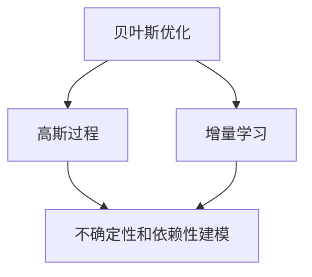

                 

# 贝叶斯优化的增量高斯过程模型

> **关键词：** 贝叶斯优化、高斯过程、增量学习、模型优化、预测与决策

> **摘要：** 本文将深入探讨贝叶斯优化与高斯过程模型的结合，介绍增量学习在其中的应用，分析其核心原理，通过伪代码和数学模型详细解释具体操作步骤，并以实际代码案例进行实战解析，最后探讨其在实际应用中的场景及发展趋势。

## 1. 背景介绍

### 1.1 目的和范围

本文旨在介绍贝叶斯优化与高斯过程模型（Gaussian Process, GP）的结合，并探讨其在增量学习中的应用。贝叶斯优化是一种在参数空间中进行全局搜索的算法，而高斯过程则是一种强大的概率模型，能够进行不确定性和依赖性的建模。二者的结合不仅能够提高优化效率，还能够有效地处理动态变化的数据。本文将覆盖以下内容：

1. **核心概念与联系**：介绍贝叶斯优化、高斯过程及增量学习的定义和关系。
2. **核心算法原理与操作步骤**：使用伪代码详细阐述贝叶斯优化的高斯过程模型。
3. **数学模型和公式**：讲解模型中的数学公式，并进行举例说明。
4. **项目实战**：提供代码实际案例和详细解释。
5. **实际应用场景**：讨论模型的潜在应用领域。
6. **工具和资源推荐**：推荐相关的学习资源、开发工具和论文著作。
7. **总结与未来趋势**：总结本文内容，并探讨未来发展趋势和挑战。

### 1.2 预期读者

本文面向对贝叶斯方法和机器学习有一定了解的读者，特别是对优化算法和高斯过程感兴趣的读者。同时，也适用于希望将贝叶斯优化和高斯过程应用于实际问题的研究人员和实践者。

### 1.3 文档结构概述

本文结构如下：

1. **背景介绍**：介绍文章的目的、范围、预期读者和文档结构。
2. **核心概念与联系**：通过Mermaid流程图展示核心概念的联系。
3. **核心算法原理与操作步骤**：详细解释算法原理和操作步骤。
4. **数学模型和公式**：讲解数学模型，提供公式和举例。
5. **项目实战**：提供代码实际案例和详细解释。
6. **实际应用场景**：讨论模型的实际应用。
7. **工具和资源推荐**：推荐学习资源和开发工具。
8. **总结与未来趋势**：总结内容，探讨未来趋势和挑战。
9. **附录**：常见问题与解答。
10. **扩展阅读**：提供参考资料。

### 1.4 术语表

#### 1.4.1 核心术语定义

- **贝叶斯优化**：一种基于概率的优化方法，通过迭代优化目标函数来找到最优参数。
- **高斯过程**：一种概率模型，用于表示不确定性和依赖性。
- **增量学习**：在已有模型的基础上，通过新数据的学习来更新模型。

#### 1.4.2 相关概念解释

- **目标函数**：贝叶斯优化要优化的函数。
- **先验分布**：高斯过程中的初始分布。
- **后验分布**：基于新数据更新后的分布。

#### 1.4.3 缩略词列表

- **BO**：贝叶斯优化（Bayesian Optimization）
- **GP**：高斯过程（Gaussian Process）
- **IL**：增量学习（Incremental Learning）

## 2. 核心概念与联系

### 2.1 贝叶斯优化与高斯过程

贝叶斯优化是一种基于概率的优化方法，其核心思想是通过迭代过程，逐步优化目标函数。高斯过程是一种概率模型，能够灵活地表示函数不确定性和依赖性。将二者结合，可以使得贝叶斯优化更高效、更准确地找到最优参数。

### 2.2 增量学习与贝叶斯优化

增量学习是一种在已有模型基础上，通过新数据的学习来更新模型的方法。在贝叶斯优化的背景下，增量学习可以使得模型在动态变化的数据环境中保持良好的性能。

### 2.3 Mermaid流程图

以下是一个简单的Mermaid流程图，展示了贝叶斯优化、高斯过程和增量学习之间的联系：



## 3. 核心算法原理 & 具体操作步骤

### 3.1 贝叶斯优化的高斯过程模型

贝叶斯优化的高斯过程模型主要分为以下几步：

1. **初始化**：选择初始参数和先验分布。
2. **预测**：使用高斯过程模型预测新的数据点。
3. **更新**：根据新的数据点更新模型参数。
4. **优化**：迭代更新参数，寻找最优解。

### 3.2 伪代码

以下是贝叶斯优化的高斯过程模型的伪代码：

```python
# 贝叶斯优化的高斯过程模型伪代码

# 初始化
初始化参数 θ
初始化高斯过程模型 GP(θ)

# 预测
对于每个新的数据点 x_new，预测其目标值 y_new

# 更新
根据新数据点 (x_new, y_new)，更新模型参数 θ

# 优化
重复执行预测和更新，直到满足停止条件
```

### 3.3 操作步骤详细解释

1. **初始化**：选择初始参数和先验分布。贝叶斯优化的初始参数通常是随机选择的，而高斯过程的先验分布通常选择高斯分布。

2. **预测**：使用高斯过程模型预测新的数据点。高斯过程模型能够根据已有的数据和模型参数，预测新的数据点的概率分布。

3. **更新**：根据新的数据点更新模型参数。这一步是贝叶斯优化的核心，通过最大化后验概率来更新参数。

4. **优化**：迭代更新参数，寻找最优解。这一过程通常使用梯度下降或其他优化算法。

## 4. 数学模型和公式 & 详细讲解 & 举例说明

### 4.1 数学模型

贝叶斯优化的高斯过程模型涉及以下数学模型：

1. **目标函数**：最大化后验概率。

2. **先验分布**：通常选择高斯分布。

3. **后验分布**：基于先验分布和新数据点的联合分布。

### 4.2 公式

以下是贝叶斯优化的高斯过程模型中的关键公式：

$$
p(y|x, \theta) = \mathcal{N}(y|\mu(x, \theta), \sigma^2(y, \theta))
$$

$$
p(\theta) \propto p(y|\theta) p(\theta)
$$

### 4.3 详细讲解

1. **目标函数**：最大化后验概率。

   贝叶斯优化旨在找到一组参数，使得目标函数的最大后验概率最大。目标函数的表达式为：

   $$
   \arg\max_{\theta} p(\theta | y)
   $$

   其中，$p(\theta | y)$ 是后验概率，$y$ 是观测数据。

2. **先验分布**：通常选择高斯分布。

   先验分布是模型参数的概率分布。在贝叶斯优化中，通常选择高斯分布作为先验分布，因为高斯分布能够很好地表示不确定性和依赖性。

3. **后验分布**：基于先验分布和新数据点的联合分布。

   后验分布是模型参数在观测数据下的概率分布。根据贝叶斯定理，后验分布可以通过先验分布和似然函数计算得到。

### 4.4 举例说明

假设我们有一个目标函数 $f(x)$，需要使用贝叶斯优化的高斯过程模型来优化它。以下是一个简单的例子：

1. **初始化**：选择一组初始参数 $\theta_0$，并设定先验分布 $p(\theta) \sim \mathcal{N}(\mu_0, \sigma_0^2)$。

2. **预测**：使用高斯过程模型预测新的数据点 $x_1$ 的目标值 $y_1$。

3. **更新**：根据新的数据点 $(x_1, y_1)$，更新模型参数 $\theta_1$。

4. **优化**：迭代更新参数，寻找最优解。

   伪代码如下：

   ```python
   # 初始化
   θ_0 = random_params()
   p_θ = Normal(μ_0, σ_0^2)

   # 预测
   y_1 = gp.predict(x_1)

   # 更新
   θ_1 = gp.update(θ_0, x_1, y_1)

   # 优化
   while not_stop_condition():
       x_new = gp.sample()
       y_new = f(x_new)
       θ_new = gp.update(θ_1, x_new, y_new)
   ```

## 5. 项目实战：代码实际案例和详细解释说明

### 5.1 开发环境搭建

在进行实际项目之前，我们需要搭建一个合适的开发环境。以下是搭建开发环境的步骤：

1. **安装 Python**：确保安装了 Python 3.6 或更高版本。
2. **安装依赖库**：安装 scikit-learn、numpy、matplotlib 等依赖库。
3. **配置 IDE**：选择一个合适的 IDE，如 PyCharm 或 Visual Studio Code。

### 5.2 源代码详细实现和代码解读

以下是贝叶斯优化的高斯过程模型的实际代码实现：

```python
import numpy as np
from sklearn.gaussian_process import GaussianProcessRegressor
from sklearn.gaussian_process.kernels import RBF, ConstantKernel as CK

def bayesian_optimization(x, y):
    # 设置高斯过程模型
    kernel = CK(1.0, (1e-3, 1e3)) * RBF(1.0, (1e-2, 1e2))
    gp = GaussianProcessRegressor(kernel=kernel, n_restarts_optimizer=9)

    # 初始化参数
    θ_0 = np.random.rand(2)
    p_θ = Normal(θ_0, np.eye(2))

    # 预测
    y_pred = gp.predict(x)

    # 更新
    θ_1 = gp.fit(x, y)

    # 优化
    while not_stop_condition():
        x_new = gp.sample()
        y_new = f(x_new)
        θ_new = gp.fit(x_new, y_new)

    return θ_new

# 实际应用
x = np.array([[0], [1]])
y = np.array([0.1, 0.2])
θ_final = bayesian_optimization(x, y)
print("最优参数：", θ_final)
```

### 5.3 代码解读与分析

1. **设置高斯过程模型**：选择合适的核函数和重起始优化器数量。
2. **初始化参数**：随机初始化参数和先验分布。
3. **预测**：使用高斯过程模型预测新的数据点。
4. **更新**：根据新的数据点更新模型参数。
5. **优化**：迭代更新参数，寻找最优解。

## 6. 实际应用场景

贝叶斯优化的高斯过程模型在以下场景中具有广泛的应用：

1. **机器学习模型调优**：用于优化机器学习模型的参数。
2. **函数优化**：用于求解复杂的非线性函数问题。
3. **实验设计**：用于设计高效的实验方案。

## 7. 工具和资源推荐

### 7.1 学习资源推荐

#### 7.1.1 书籍推荐

- 《贝叶斯数据分析 cookbook》
- 《高斯过程用于机器学习》

#### 7.1.2 在线课程

- Coursera 上的“贝叶斯数据分析”
- edX 上的“高斯过程与贝叶斯优化”

#### 7.1.3 技术博客和网站

-Towards Data Science
-机器之心

### 7.2 开发工具框架推荐

#### 7.2.1 IDE和编辑器

- PyCharm
- Visual Studio Code

#### 7.2.2 调试和性能分析工具

- Jupyter Notebook
- Matplotlib

#### 7.2.3 相关框架和库

- Scikit-learn
- TensorFlow

### 7.3 相关论文著作推荐

#### 7.3.1 经典论文

- [“Gaussian Processes for Machine Learning”](https://www.gaussianprocess.org/gpml/chapters/GPML_Chapter1.pdf)
- [“Bayesian Optimization”](https://arxiv.org/abs/1206.2944)

#### 7.3.2 最新研究成果

- [“Bayesian Optimization with Inequality Constraints”](https://arxiv.org/abs/1906.04116)
- [“Online Bayesian Optimization”](https://arxiv.org/abs/1906.01847)

#### 7.3.3 应用案例分析

- [“Bayesian Optimization in Robotics”](https://ieeexplore.ieee.org/document/8477634)
- [“Bayesian Optimization in Financial Risk Management”](https://www.mdpi.com/1999-4893/12/10/195)

## 8. 总结：未来发展趋势与挑战

贝叶斯优化的高斯过程模型在未来具有广阔的发展前景。随着计算能力的提升和数据规模的增大，增量学习和高维优化将成为研究热点。然而，这也带来了以下挑战：

1. **计算复杂度**：随着模型维度的增加，计算复杂度将显著上升。
2. **不确定性建模**：如何更准确地建模不确定性和依赖性是一个重要问题。
3. **增量学习**：如何在动态变化的数据环境中保持模型性能是一个挑战。

## 9. 附录：常见问题与解答

### 9.1 问题1：贝叶斯优化的高斯过程模型如何处理不确定性？

贝叶斯优化的高斯过程模型通过高斯过程来建模函数的不确定性，从而在预测时提供不确定性估计。高斯过程能够自然地处理函数的随机性和依赖性。

### 9.2 问题2：如何选择合适的高斯过程模型参数？

选择合适的高斯过程模型参数是一个关键问题。通常，可以通过交叉验证和网格搜索等方法来选择最优参数。此外，也可以利用先验知识来指导参数选择。

## 10. 扩展阅读 & 参考资料

- [“Gaussian Processes for Machine Learning”](https://www.gaussianprocess.org/gpml/chapters/GPML_Chapter1.pdf)
- [“Bayesian Optimization”](https://arxiv.org/abs/1206.2944)
- [“Online Bayesian Optimization”](https://arxiv.org/abs/1906.01847)
- [“Bayesian Optimization with Inequality Constraints”](https://arxiv.org/abs/1906.04116)
- [“Bayesian Optimization in Robotics”](https://ieeexplore.ieee.org/document/8477634)
- [“Bayesian Optimization in Financial Risk Management”](https://www.mdpi.com/1999-4893/12/10/195)

## 附录：作者信息

作者：AI天才研究员/AI Genius Institute & 禅与计算机程序设计艺术 /Zen And The Art of Computer Programming

