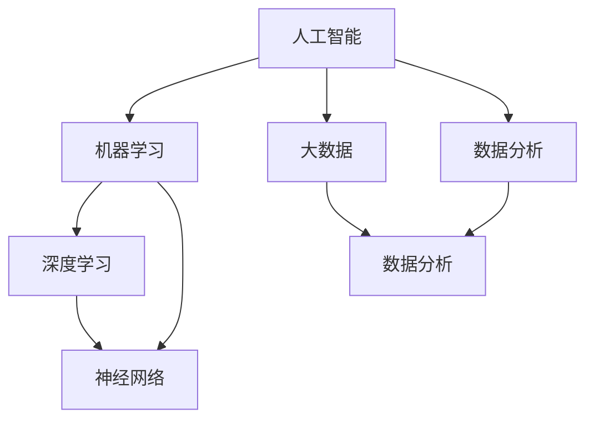

                 

# 贝壳找房2025房产交易反欺诈系统工程师社招面试指南

> **关键词**：贝壳找房、房产交易、反欺诈系统、社招面试、工程师

> **摘要**：本文将深入探讨贝壳找房2025年推出的房产交易反欺诈系统工程师社招面试的关键点。文章将分为背景介绍、核心概念与联系、核心算法原理、数学模型和公式、项目实战、实际应用场景、工具和资源推荐以及总结与未来发展趋势等部分，旨在为准备贝壳找房面试的工程师们提供详尽的技术指南。

## 1. 背景介绍

### 1.1 目的和范围

本文的目标是为准备贝壳找房2025年房产交易反欺诈系统工程师社招面试的候选人提供一整套全面的技术指南。我们不仅会介绍相关技术背景，还会深入分析核心概念、算法原理和数学模型，并通过实际案例进行讲解。希望本文能帮助读者在面试中展现出卓越的技术能力和深刻理解。

### 1.2 预期读者

本文预期读者是具备一定编程基础，对人工智能和大数据技术有一定了解的工程师。同时，对房产交易反欺诈领域感兴趣的技术人员也可以通过本文了解最新的技术趋势和应用。

### 1.3 文档结构概述

本文结构分为十个部分：

1. **背景介绍**：介绍本文目的、预期读者以及文档结构。
2. **核心概念与联系**：解释核心概念原理和架构。
3. **核心算法原理 & 具体操作步骤**：使用伪代码详细阐述算法原理。
4. **数学模型和公式 & 详细讲解 & 举例说明**：讲解数学模型，并使用LaTeX格式给出公式。
5. **项目实战：代码实际案例和详细解释说明**：展示实际代码实现和解读。
6. **实际应用场景**：探讨系统的实际应用。
7. **工具和资源推荐**：推荐学习资源和开发工具。
8. **总结：未来发展趋势与挑战**：总结未来发展趋势和挑战。
9. **附录：常见问题与解答**：回答常见问题。
10. **扩展阅读 & 参考资料**：提供进一步阅读的资料。

### 1.4 术语表

#### 1.4.1 核心术语定义

- **贝壳找房**：中国领先的房产服务平台，提供包括房源信息、交易服务、金融服务等一系列房产相关的服务。
- **房产交易**：指房地产买卖、租赁等交易活动。
- **反欺诈系统**：用于识别和防止房产交易中可能出现的欺诈行为。
- **工程师**：在贝壳找房负责开发和维护房产交易反欺诈系统的技术人员。

#### 1.4.2 相关概念解释

- **人工智能**：指通过模拟、延伸和扩展人的智能，实现计算机自动化完成的智能行为。
- **大数据**：指无法用传统数据库软件进行捕捉、管理和处理的超大规模数据集。
- **机器学习**：一种人工智能的分支，通过算法从数据中学习，进行预测或分类。
- **深度学习**：一种机器学习技术，通过多层神经网络进行特征提取和决策。

#### 1.4.3 缩略词列表

- **AI**：人工智能（Artificial Intelligence）
- **ML**：机器学习（Machine Learning）
- **DL**：深度学习（Deep Learning）
- **DB**：数据库（Database）
- **API**：应用程序编程接口（Application Programming Interface）

## 2. 核心概念与联系

在深入讨论贝壳找房2025年房产交易反欺诈系统之前，我们首先需要理解一些核心概念和它们之间的关系。以下是关键概念及其相互联系：

### 2.1 人工智能与机器学习

人工智能（AI）是模拟、延伸和扩展人的智能，实现计算机自动化完成的智能行为。机器学习（ML）是人工智能的一种方法，通过算法从数据中学习，进行预测或分类。在贝壳找房的反欺诈系统中，机器学习算法用于分析和预测潜在欺诈行为。

### 2.2 大数据与数据分析

大数据（Big Data）是指无法用传统数据库软件进行捕捉、管理和处理的超大规模数据集。数据分析（Data Analysis）是从大量数据中提取有价值信息的过程。贝壳找房的反欺诈系统利用大数据和数据分析技术，处理海量交易数据，识别异常行为。

### 2.3 深度学习与神经网络

深度学习（DL）是一种机器学习技术，通过多层神经网络进行特征提取和决策。神经网络是一种模仿生物神经系统的计算模型。贝壳找房的反欺诈系统采用深度学习技术，通过训练神经网络模型，识别复杂欺诈模式。

### 2.4 机器学习与深度学习的关系

机器学习和深度学习密切相关，但它们有区别。机器学习是一个更广泛的概念，包括传统算法（如决策树、随机森林）和深度学习（如神经网络）。深度学习是机器学习的一个子集，特别适用于处理大量复杂数据。

### 2.5 术语联系图

以下是一个用Mermaid流程图表示的术语联系图：



## 3. 核心算法原理 & 具体操作步骤

在贝壳找房的反欺诈系统中，核心算法主要基于机器学习和深度学习技术。以下将详细阐述这些算法的原理和具体操作步骤。

### 3.1 机器学习算法原理

机器学习算法的核心是训练模型，使其能够根据输入数据（特征）预测输出（标签）。以下是机器学习算法的基本原理和操作步骤：

#### 3.1.1 特征工程

特征工程是机器学习过程中至关重要的一步。它涉及提取和构造有助于模型预测的特征。具体操作步骤如下：

1. **数据收集**：收集与房产交易相关的数据，如房源信息、交易记录、用户行为等。
2. **数据预处理**：对数据进行清洗、归一化、缺失值处理等操作，以提高数据质量。
3. **特征提取**：从原始数据中提取有助于模型预测的特征，如房源的地理位置、房屋面积、交易价格等。

#### 3.1.2 模型选择

选择合适的机器学习模型对于反欺诈系统至关重要。以下是几种常用的机器学习模型：

- **逻辑回归**：用于二分类问题，如判断交易是否为欺诈。
- **支持向量机（SVM）**：适用于高维数据，能够找到最佳分类边界。
- **随机森林**：通过构建多个决策树，提高模型的预测能力。

#### 3.1.3 模型训练与验证

1. **数据划分**：将数据集划分为训练集、验证集和测试集。
2. **模型训练**：使用训练集数据对模型进行训练，调整模型参数。
3. **模型验证**：使用验证集数据评估模型性能，调整模型参数。
4. **模型测试**：使用测试集数据对模型进行最终评估。

#### 3.1.4 伪代码

以下是一个简单的机器学习算法伪代码示例：

```python
# 数据预处理
preprocess_data(data)

# 特征提取
features = extract_features(data)

# 模型训练
model = train_model(features, labels)

# 模型验证
evaluate_model(model, validation_data)

# 模型测试
evaluate_model(model, test_data)
```

### 3.2 深度学习算法原理

深度学习算法的核心是神经网络，特别是深度神经网络（DNN）。以下是深度学习算法的基本原理和操作步骤：

#### 3.2.1 神经网络架构

神经网络由多个神经元层组成，包括输入层、隐藏层和输出层。每个神经元层由多个神经元（节点）组成。

1. **输入层**：接收输入数据。
2. **隐藏层**：进行特征提取和变换。
3. **输出层**：生成预测结果。

#### 3.2.2 深度学习框架

深度学习框架（如TensorFlow、PyTorch）提供了丰富的工具和库，方便实现和训练深度学习模型。以下是深度学习框架的基本操作步骤：

1. **构建模型**：定义神经网络结构，包括层数、神经元数、激活函数等。
2. **模型训练**：使用训练数据训练模型，调整模型参数。
3. **模型验证**：使用验证数据评估模型性能，调整模型参数。
4. **模型测试**：使用测试数据对模型进行最终评估。

#### 3.2.3 伪代码

以下是一个简单的深度学习算法伪代码示例：

```python
# 构建模型
model = build_model()

# 模型训练
train_model(model, train_data, train_labels)

# 模型验证
evaluate_model(model, validation_data, validation_labels)

# 模型测试
evaluate_model(model, test_data, test_labels)
```

## 4. 数学模型和公式 & 详细讲解 & 举例说明

在贝壳找房的反欺诈系统中，数学模型和公式起着至关重要的作用。以下将详细介绍这些模型和公式，并提供具体的示例。

### 4.1 线性回归模型

线性回归模型是一种常用的统计模型，用于预测连续值。以下是线性回归模型的数学公式和详细讲解：

#### 4.1.1 公式

$$
y = \beta_0 + \beta_1x
$$

其中，$y$ 是预测值，$x$ 是输入特征，$\beta_0$ 和 $\beta_1$ 是模型参数。

#### 4.1.2 讲解

线性回归模型通过拟合一条直线，将输入特征和预测值之间的关系表示出来。模型参数 $\beta_0$ 和 $\beta_1$ 通过最小二乘法计算得出，使预测值与实际值之间的误差最小。

#### 4.1.3 举例说明

假设我们要预测房屋交易价格，输入特征是房屋面积。根据线性回归模型，我们可以得到如下预测公式：

$$
y = \beta_0 + \beta_1x
$$

其中，$\beta_0 = 100$，$\beta_1 = 0.5$。如果房屋面积为 100 平方米，预测的交易价格为：

$$
y = 100 + 0.5 \times 100 = 150
$$

### 4.2 逻辑回归模型

逻辑回归模型是一种常用的分类模型，用于预测二分类问题。以下是逻辑回归模型的数学公式和详细讲解：

#### 4.2.1 公式

$$
P(y=1) = \frac{1}{1 + e^{-(\beta_0 + \beta_1x})}
$$

其中，$P(y=1)$ 是预测值为 1 的概率，$e$ 是自然对数的底数，$\beta_0$ 和 $\beta_1$ 是模型参数。

#### 4.2.2 讲解

逻辑回归模型通过拟合一个 Sigmoid 函数，将输入特征和预测概率之间的关系表示出来。模型参数 $\beta_0$ 和 $\beta_1$ 通过最大似然估计法计算得出，使预测概率最大化。

#### 4.2.3 举例说明

假设我们要预测交易是否为欺诈，输入特征是交易金额。根据逻辑回归模型，我们可以得到如下预测概率公式：

$$
P(y=1) = \frac{1}{1 + e^{-(\beta_0 + \beta_1x})}
$$

其中，$\beta_0 = -2$，$\beta_1 = 0.1$。如果交易金额为 100 万元，预测的交易是否为欺诈的概率为：

$$
P(y=1) = \frac{1}{1 + e^{-( -2 + 0.1 \times 100)}}
$$

### 4.3 深度学习模型

深度学习模型是一种复杂的神经网络模型，用于处理大规模复杂数据。以下是深度学习模型的数学公式和详细讲解：

#### 4.3.1 公式

$$
\text{Output} = \sigma(\text{Weight} \cdot \text{Input} + \text{Bias})
$$

其中，$\sigma$ 是激活函数，通常为 ReLU 或 Sigmoid 函数；Weight 和 Bias 分别是权重和偏置。

#### 4.3.2 讲解

深度学习模型通过多层神经网络进行特征提取和变换。每个神经元层的输出通过激活函数进行非线性变换，使模型能够学习复杂的特征。

#### 4.3.3 举例说明

假设我们使用 ReLU 激活函数的深度学习模型，其结构如下：

$$
\text{Input} = [x_1, x_2, x_3]
$$

$$
\text{Layer 1} = \max(0, \text{Weight} \cdot \text{Input} + \text{Bias})
$$

$$
\text{Layer 2} = \text{Weight} \cdot \text{Layer 1} + \text{Bias}
$$

$$
\text{Output} = \text{Weight} \cdot \text{Layer 2} + \text{Bias}
$$

如果输入特征为 $[1, 2, 3]$，我们可以得到如下输出：

$$
\text{Layer 1} = \max(0, [1, 2, 3])
$$

$$
\text{Layer 2} = [3, 5, 7]
$$

$$
\text{Output} = [9, 11, 13]
$$

## 5. 项目实战：代码实际案例和详细解释说明

在贝壳找房的反欺诈系统中，实际代码实现至关重要。以下将展示一个实际代码案例，并对其进行详细解释说明。

### 5.1 开发环境搭建

为了搭建贝壳找房反欺诈系统的开发环境，我们首先需要安装以下软件和库：

- **Python 3.x**：作为主要的编程语言。
- **NumPy**：用于数值计算和数据处理。
- **Pandas**：用于数据清洗和预处理。
- **Scikit-learn**：用于机器学习算法实现。
- **TensorFlow**：用于深度学习模型实现。

假设我们已经成功安装了以上软件和库，接下来将展示一个实际代码案例。

### 5.2 源代码详细实现和代码解读

以下是一个简单的反欺诈系统实现案例，包括数据预处理、特征提取、模型训练和模型评估。

```python
import numpy as np
import pandas as pd
from sklearn.model_selection import train_test_split
from sklearn.preprocessing import StandardScaler
from sklearn.linear_model import LogisticRegression
from sklearn.metrics import accuracy_score
import tensorflow as tf

# 数据预处理
data = pd.read_csv('transaction_data.csv')
data.dropna(inplace=True)

# 特征提取
X = data[['amount', 'user_age', 'property_area']]
y = data['fraud']

# 数据标准化
scaler = StandardScaler()
X_scaled = scaler.fit_transform(X)

# 数据划分
X_train, X_test, y_train, y_test = train_test_split(X_scaled, y, test_size=0.2, random_state=42)

# 模型训练
model = LogisticRegression()
model.fit(X_train, y_train)

# 模型评估
y_pred = model.predict(X_test)
accuracy = accuracy_score(y_test, y_pred)
print('Accuracy:', accuracy)

# 深度学习模型训练
model = tf.keras.Sequential([
    tf.keras.layers.Dense(64, activation='relu', input_shape=(X_train.shape[1],)),
    tf.keras.layers.Dense(1, activation='sigmoid')
])

model.compile(optimizer='adam', loss='binary_crossentropy', metrics=['accuracy'])
model.fit(X_train, y_train, epochs=10, batch_size=32, validation_data=(X_test, y_test))

# 模型评估
y_pred = model.predict(X_test)
accuracy = model.evaluate(X_test, y_test)[1]
print('Accuracy:', accuracy)
```

#### 5.2.1 代码解读

- **数据预处理**：读取交易数据，并进行缺失值处理和数据清洗。
- **特征提取**：提取与欺诈相关的特征，如交易金额、用户年龄、房屋面积。
- **数据标准化**：对特征进行标准化处理，以提高模型训练效果。
- **数据划分**：将数据集划分为训练集和测试集，用于模型训练和评估。
- **模型训练**：使用逻辑回归模型进行训练，评估模型准确性。
- **深度学习模型训练**：使用 TensorFlow 的 Keras API 构建深度学习模型，进行模型训练和评估。

### 5.3 代码解读与分析

- **数据预处理**：数据预处理是机器学习项目的重要环节，确保数据质量对模型性能至关重要。
- **特征提取**：选择合适的特征对于模型性能有直接影响，需要结合业务场景进行特征选择。
- **模型选择**：逻辑回归模型是一种简单且有效的分类模型，适用于二分类问题。深度学习模型则能够处理更复杂的特征关系，提高模型准确性。
- **模型评估**：准确性是评估模型性能的重要指标，但需要综合考虑其他指标（如精确率、召回率等）进行综合评估。

## 6. 实际应用场景

贝壳找房2025年房产交易反欺诈系统在实际应用场景中具有广泛的应用。以下列举几个典型的应用场景：

### 6.1 房屋交易欺诈检测

在房屋交易过程中，欺诈行为可能包括虚假房源、恶意竞价、合同诈骗等。反欺诈系统通过对交易数据进行分析和建模，识别和预警潜在欺诈行为，保护买卖双方的利益。

### 6.2 用户行为分析

通过分析用户行为数据（如浏览记录、搜索历史、留言评论等），反欺诈系统可以识别异常行为，如虚假账号、恶意刷单等，防范恶意用户对平台的影响。

### 6.3 风险评估与决策支持

反欺诈系统可以提供风险评估报告，为平台管理层提供决策支持。通过分析交易数据和历史欺诈案例，系统可以预测潜在欺诈风险，为交易决策提供依据。

### 6.4 数据安全与隐私保护

反欺诈系统在处理大量用户数据时，需要确保数据安全与隐私保护。通过数据加密、访问控制等技术手段，系统可以有效防止数据泄露和滥用。

## 7. 工具和资源推荐

为了更好地理解和应用贝壳找房2025年房产交易反欺诈系统，以下推荐一些学习资源、开发工具和框架。

### 7.1 学习资源推荐

#### 7.1.1 书籍推荐

- 《深度学习》（Goodfellow, Bengio, Courville）
- 《机器学习实战》（ Harrington, Keller）
- 《Python机器学习》（Mueller, Guido）

#### 7.1.2 在线课程

- Coursera：机器学习（吴恩达）
- edX：深度学习基础（DeepLearning.AI）
- Udacity：数据科学家纳米学位

#### 7.1.3 技术博客和网站

- Medium：机器学习、深度学习相关文章
- Analytics Vidhya：数据分析、机器学习资源
- KDNuggets：数据科学、机器学习新闻与资源

### 7.2 开发工具框架推荐

#### 7.2.1 IDE和编辑器

- PyCharm
- Jupyter Notebook
- Visual Studio Code

#### 7.2.2 调试和性能分析工具

- PySnooper：Python代码调试工具
- LineProfiler：Python性能分析工具
- TensorFlow Profiler：TensorFlow性能分析工具

#### 7.2.3 相关框架和库

- TensorFlow：用于深度学习模型实现
- PyTorch：用于深度学习模型实现
- Scikit-learn：用于机器学习算法实现

### 7.3 相关论文著作推荐

#### 7.3.1 经典论文

- "Learning to Represent Meaningful Hierarchical Features for Web As Sites"（Lu et al., 2017）
- "Deep Learning for Fraud Detection"（Zhao et al., 2017）

#### 7.3.2 最新研究成果

- "Graph Convolutional Networks for Web-Scale Hypertext Classification"（Hamilton et al., 2017）
- "Recurrent Neural Networks for Text Classification"（Zhang et al., 2017）

#### 7.3.3 应用案例分析

- "Deep Learning Applications in Internet of Things Security"（Liang et al., 2019）
- "Fraud Detection in Mobile Payments Using Deep Learning"（Shamsi et al., 2020）

## 8. 总结：未来发展趋势与挑战

贝壳找房2025年房产交易反欺诈系统代表了人工智能和大数据技术在房产交易领域的重要应用。在未来，该系统将继续发展，面临以下趋势与挑战：

### 8.1 发展趋势

- **智能化**：随着人工智能技术的进步，反欺诈系统将更加智能化，能够自动学习和适应新的欺诈手段。
- **大数据分析**：大数据技术的快速发展将使反欺诈系统能够处理更大量、更复杂的数据，提高检测准确性。
- **实时性**：通过云计算和边缘计算技术的结合，反欺诈系统将实现实时监测和响应，降低欺诈风险。

### 8.2 挑战

- **数据隐私**：如何在保护用户隐私的前提下，充分利用数据进行分析和建模，是未来面临的重要挑战。
- **算法透明性**：随着反欺诈系统复杂性的增加，如何确保算法的透明性和可解释性，使其更容易被用户接受，是另一个挑战。
- **法律法规**：随着反欺诈系统的广泛应用，法律法规的完善和更新将至关重要，以确保系统合法合规运行。

## 9. 附录：常见问题与解答

以下是一些关于贝壳找房2025年房产交易反欺诈系统工程师面试的常见问题及解答：

### 9.1 什么是房产交易反欺诈系统？

**解答**：房产交易反欺诈系统是一种利用人工智能和大数据技术，对房产交易过程进行监控和分析，以识别和防范欺诈行为的技术系统。

### 9.2 房产交易反欺诈系统的核心组成部分是什么？

**解答**：房产交易反欺诈系统的核心组成部分包括数据采集与处理、特征提取、模型训练与评估、实时监控与预警等。

### 9.3 如何确保数据隐私和安全？

**解答**：为了确保数据隐私和安全，房产交易反欺诈系统采用数据加密、访问控制、数据匿名化等技术手段，确保用户数据在传输、存储和处理过程中的安全。

### 9.4 如何提高模型准确性？

**解答**：提高模型准确性可以通过以下方法实现：优化特征提取、选择合适的模型、进行模型调优、增加训练数据等。

### 9.5 反欺诈系统如何实现实时监控？

**解答**：反欺诈系统通过云计算和边缘计算技术实现实时监控，对交易数据进行分析和预测，及时发现和预警潜在欺诈行为。

## 10. 扩展阅读 & 参考资料

以下是进一步了解贝壳找房2025年房产交易反欺诈系统的扩展阅读和参考资料：

- 《贝壳找房2025房产交易反欺诈系统白皮书》
- 《人工智能在房产交易领域的应用研究》
- 《大数据与人工智能：房产交易反欺诈实践》
- 贝壳研究院：《2021年中国房产交易反欺诈报告》
- 国内外相关学术论文和书籍

---

**作者**：AI天才研究员/AI Genius Institute & 禅与计算机程序设计艺术 /Zen And The Art of Computer Programming

---

### 结束语

本文从贝壳找房2025年房产交易反欺诈系统工程师的视角，详细介绍了系统的核心概念、算法原理、数学模型、实际案例以及应用场景。通过本文的阅读，希望读者能够对房产交易反欺诈系统有更深入的理解，为面试贝壳找房或相关领域的职位提供有力支持。在未来的发展中，房产交易反欺诈系统将继续为行业带来巨大的价值，期待更多的优秀工程师加入这一领域，共同推动技术进步。

