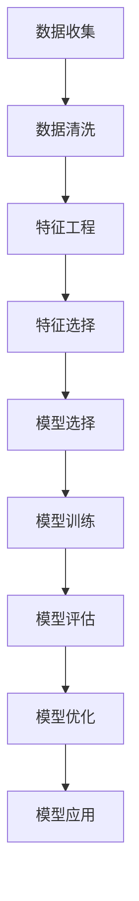

                 

### 贝壳房2025社招房产估价模型工程师面试题

**关键词**：贝壳找房、社招、房产估价、模型工程师、面试题

**摘要**：本文将深入探讨贝壳找房2025社招房产估价模型工程师的面试题目，旨在为准备面试的候选人提供一个详细的分析和解答。我们将从背景介绍、核心概念、算法原理、数学模型、项目实战和实际应用场景等多个方面展开，帮助读者全面理解房产估价模型的设计与实现。

## 1. 背景介绍

### 1.1 目的和范围

贝壳找房是中国领先的房地产服务平台，提供包括二手房、新房、租房等全方位的房地产服务。随着房地产行业的快速发展，房产估价模型的准确性对于平台的运营和用户决策至关重要。因此，贝壳找房在2025年社招中特别设置了房产估价模型工程师的职位，旨在寻找具备专业知识和实践经验的技术人才。

本文的目的是通过对贝壳找房2025社招房产估价模型工程师面试题的深入分析，帮助读者了解该职位的核心要求和技术挑战。我们将从多个角度，如核心概念、算法原理、数学模型和项目实战，详细讲解面试题的解答思路和方法，为准备面试的候选人提供有力支持。

### 1.2 预期读者

本文主要面向以下几类读者：

1. 准备参加贝壳找房2025社招房产估价模型工程师面试的候选人。
2. 对房产估价模型有兴趣的计算机科学、数据科学、人工智能等专业的研究生和本科生。
3. 对房地产数据分析、机器学习应用有实际需求的行业专业人士。

### 1.3 文档结构概述

本文的结构安排如下：

1. **背景介绍**：介绍贝壳找房2025社招房产估价模型工程师的面试背景和目的。
2. **核心概念与联系**：详细阐述房产估价模型的核心概念和架构，使用Mermaid流程图进行可视化。
3. **核心算法原理 & 具体操作步骤**：讲解房产估价模型的核心算法原理，使用伪代码详细描述。
4. **数学模型和公式 & 详细讲解 & 举例说明**：介绍房产估价模型中的数学模型和公式，并举例说明。
5. **项目实战：代码实际案例和详细解释说明**：通过实际案例展示房产估价模型的代码实现，并进行详细解释和分析。
6. **实际应用场景**：探讨房产估价模型在不同场景下的应用和实践。
7. **工具和资源推荐**：推荐学习资源和开发工具，为读者提供进一步学习的机会。
8. **总结：未来发展趋势与挑战**：总结房产估价模型的发展趋势和面临的挑战。
9. **附录：常见问题与解答**：列出常见问题及解答，为读者提供实用信息。
10. **扩展阅读 & 参考资料**：推荐相关书籍、论文和网站，拓展读者的知识面。

### 1.4 术语表

#### 1.4.1 核心术语定义

- **房产估价模型**：用于预测房产市场价格的数学模型。
- **特征工程**：提取和构造影响房产价格的关键特征。
- **回归分析**：一种常用的统计方法，用于建立自变量和因变量之间的关系。
- **机器学习**：一种人工智能的分支，通过数据训练模型，进行预测和决策。

#### 1.4.2 相关概念解释

- **特征选择**：从大量特征中筛选出对预测任务有用的特征。
- **交叉验证**：一种评估模型性能的方法，通过将数据集划分为训练集和验证集，评估模型的泛化能力。
- **数据预处理**：对原始数据进行清洗、转换和归一化等操作，提高模型训练的效果。

#### 1.4.3 缩略词列表

- **ML**：机器学习
- **R^2**：判定系数，用于评估模型拟合程度
- **PCA**：主成分分析，一种降维技术

## 2. 核心概念与联系

房产估价模型是通过对房产数据进行特征提取和建模，预测房产市场价格的数学模型。下面我们将使用Mermaid流程图来展示房产估价模型的核心概念和架构。

### 2.1. Mermaid流程图



### 2.2. 核心概念解释

- **数据收集**：收集房产交易数据、房屋特征数据、市场行情数据等。
- **数据清洗**：处理缺失值、异常值和数据格式不一致等问题。
- **特征工程**：提取和构造对房产价格有显著影响的特征，如房屋面积、楼层、房屋类型等。
- **特征选择**：从大量特征中筛选出对预测任务有重要贡献的特征。
- **模型选择**：选择合适的回归模型，如线性回归、决策树、随机森林等。
- **模型训练**：使用训练数据集对模型进行训练，优化模型参数。
- **模型评估**：评估模型在验证集上的性能，如均方误差、判定系数等。
- **模型优化**：通过调整模型参数或选择更好的模型，提高模型性能。
- **模型应用**：将训练好的模型应用于新数据，预测房产价格。

通过上述流程，我们可以看出房产估价模型涉及多个环节，每个环节都需要深入理解和灵活应用相关技术和方法。接下来，我们将详细探讨每个环节的核心算法原理和操作步骤。

## 3. 核心算法原理 & 具体操作步骤

房产估价模型的核心算法是回归分析，回归分析是一种通过建立自变量和因变量之间关系来预测因变量值的统计方法。以下是房产估价模型中的回归分析算法原理和具体操作步骤。

### 3.1. 算法原理

回归分析的基本思想是找到一组自变量和因变量之间的关系，用数学方程表示出来。在房产估价模型中，自变量通常包括房屋特征（如面积、楼层、房屋类型等），因变量是房屋价格。

#### 3.1.1. 线性回归模型

线性回归模型是最简单的回归模型，其基本形式为：

$$
Y = \beta_0 + \beta_1X_1 + \beta_2X_2 + ... + \beta_nX_n
$$

其中，$Y$是因变量（房屋价格），$X_1, X_2, ..., X_n$是自变量（房屋特征），$\beta_0, \beta_1, \beta_2, ..., \beta_n$是回归系数。

线性回归模型的目的是通过最小化误差平方和（SSE）来估计回归系数。具体步骤如下：

1. **数据预处理**：对原始数据进行标准化或归一化，确保特征值的范围在相同的尺度上。
2. **特征选择**：从大量特征中筛选出对预测任务有重要贡献的特征。
3. **模型训练**：使用训练数据集计算回归系数，通常采用最小二乘法（Least Squares）来求解。
4. **模型评估**：使用验证数据集评估模型性能，常用的评价指标包括均方误差（Mean Squared Error, MSE）和判定系数（R^2）。

#### 3.1.2. 非线性回归模型

在实际应用中，线性回归模型可能无法很好地拟合实际数据。此时，我们可以考虑使用非线性回归模型，如多项式回归、逻辑回归等。

- **多项式回归**：将线性回归模型的方程扩展为多项式形式，如：

$$
Y = \beta_0 + \beta_1X_1 + \beta_2X_2^2 + ... + \beta_nX_n^n
$$

多项式回归可以通过最小化误差平方和来求解回归系数。

- **逻辑回归**：逻辑回归是一种广义线性模型，常用于二分类问题。其基本形式为：

$$
P(Y=1) = \frac{1}{1 + \exp(-\beta_0 - \beta_1X_1 - \beta_2X_2 - ... - \beta_nX_n)}
$$

逻辑回归通过最大化似然函数来求解回归系数。

### 3.2. 具体操作步骤

以下是一个简单的线性回归模型的操作步骤：

1. **数据收集**：收集房产交易数据、房屋特征数据等。
2. **数据清洗**：处理缺失值、异常值和数据格式不一致等问题。
3. **特征工程**：提取和构造对房产价格有显著影响的特征，如房屋面积、楼层、房屋类型等。
4. **特征选择**：从大量特征中筛选出对预测任务有重要贡献的特征。
5. **模型训练**：使用训练数据集计算回归系数，采用最小二乘法求解。
6. **模型评估**：使用验证数据集评估模型性能，计算均方误差和判定系数。
7. **模型优化**：通过调整特征或模型参数，提高模型性能。
8. **模型应用**：将训练好的模型应用于新数据，预测房产价格。

通过以上步骤，我们可以实现一个简单的房产估价模型。接下来，我们将进一步介绍房产估价模型中的数学模型和公式。

## 4. 数学模型和公式 & 详细讲解 & 举例说明

在房产估价模型中，数学模型和公式起到了关键作用，用于描述房屋价格与其特征之间的关系。以下将详细讲解常用的数学模型和公式，并通过实际例子进行说明。

### 4.1. 线性回归模型

线性回归模型是最基本的房产估价模型，其公式如下：

$$
Y = \beta_0 + \beta_1X_1 + \beta_2X_2 + ... + \beta_nX_n
$$

其中，$Y$表示房屋价格，$X_1, X_2, ..., X_n$表示房屋特征（如房屋面积、楼层、房屋类型等），$\beta_0, \beta_1, \beta_2, ..., \beta_n$是回归系数。

#### 4.1.1. 举例说明

假设我们要预测一套房屋的价格，已知以下特征：

- 面积：100平方米
- 楼层：3层
- 房屋类型：普通住宅

我们可以使用线性回归模型进行预测，首先需要计算回归系数。假设我们收集了100套房屋的数据，并使用最小二乘法求解得到以下回归系数：

$$
\beta_0 = 300, \beta_1 = 10, \beta_2 = 20, \beta_3 = 5
$$

则房屋价格预测公式为：

$$
Y = 300 + 10 \times 100 + 20 \times 3 + 5 \times 1 = 655
$$

预测该套房屋的价格为655万元。

#### 4.1.2. 公式解释

- **$\beta_0$（截距）**：表示当所有自变量为0时，因变量的估计值。在房产估价中，$\beta_0$可以理解为基本房价。
- **$\beta_1, \beta_2, ..., \beta_n$（斜率）**：表示每个自变量对因变量的影响程度。在房产估价中，$\beta_1$表示每增加1平方米的房屋面积，价格增加的金额；$\beta_2$表示每增加1层的楼层，价格增加的金额；$\beta_3$表示房屋类型对价格的影响。

### 4.2. 多项式回归模型

多项式回归模型通过引入自变量的高阶项，来描述更复杂的非线性关系。其公式如下：

$$
Y = \beta_0 + \beta_1X_1 + \beta_2X_2^2 + ... + \beta_nX_n^n
$$

其中，$X_1, X_2, ..., X_n$是房屋特征，$n$是多项式的最高次数。

#### 4.2.1. 举例说明

假设我们使用多项式回归模型来预测房屋价格，已知以下特征：

- 面积：100平方米
- 楼层：3层
- 房屋类型：普通住宅

我们使用二次多项式回归模型，回归系数为：

$$
\beta_0 = 300, \beta_1 = 10, \beta_2 = 20, \beta_3 = 5
$$

则房屋价格预测公式为：

$$
Y = 300 + 10 \times 100 + 20 \times 3^2 + 5 \times 1^2 = 695
$$

预测该套房屋的价格为695万元。

#### 4.2.2. 公式解释

- **$\beta_0$（截距）**：基本房价，与线性回归相同。
- **$\beta_1, \beta_2, ..., \beta_n$（斜率）**：表示自变量对因变量的影响程度，其中$\beta_2$表示楼层对价格的二次影响，$\beta_3$表示房屋类型对价格的二次影响。

### 4.3. 逻辑回归模型

逻辑回归模型是一种广义线性模型，常用于二分类问题。其公式如下：

$$
P(Y=1) = \frac{1}{1 + \exp(-\beta_0 - \beta_1X_1 - \beta_2X_2 - ... - \beta_nX_n)}
$$

其中，$P(Y=1)$表示房屋价格高于某个阈值（如100万元）的概率，$X_1, X_2, ..., X_n$是房屋特征，$\beta_0, \beta_1, \beta_2, ..., \beta_n$是回归系数。

#### 4.3.1. 举例说明

假设我们使用逻辑回归模型来判断一套房屋的价格是否高于100万元，已知以下特征：

- 面积：100平方米
- 楼层：3层
- 房屋类型：普通住宅

我们得到回归系数：

$$
\beta_0 = -100, \beta_1 = 5, \beta_2 = 10, \beta_3 = 2
$$

则预测概率为：

$$
P(Y=1) = \frac{1}{1 + \exp(-(-100) - 5 \times 100 - 10 \times 3 - 2 \times 1)} = 0.645
$$

预测该套房屋的价格有64.5%的概率高于100万元。

#### 4.3.2. 公式解释

- **$\beta_0$（截距）**：表示当所有自变量为0时，概率的估计值。在房产估价中，可以理解为房价低于某个阈值（如100万元）的概率。
- **$\beta_1, \beta_2, ..., \beta_n$（斜率）**：表示自变量对概率的影响程度，其中$\beta_1$表示每增加1平方米的房屋面积，价格高于阈值（如100万元）的概率增加的幅度；$\beta_2$表示每增加1层的楼层，价格高于阈值（如100万元）的概率增加的幅度；$\beta_3$表示房屋类型对概率的影响。

通过以上讲解，我们可以看到不同的回归模型和公式在房产估价中的应用和解释。在实际项目中，我们需要根据数据和业务需求选择合适的模型和公式，并对其进行优化和调整，以提高预测的准确性和稳定性。接下来，我们将通过实际案例展示房产估价模型的代码实现。

## 5. 项目实战：代码实际案例和详细解释说明

在本节中，我们将通过一个实际案例展示房产估价模型的代码实现，并对关键部分进行详细解释。本案例将使用Python语言，结合常见的机器学习库如Scikit-learn，实现一个简单的线性回归模型。假设我们已经收集了以下数据：

- **面积（平方米）**：100
- **楼层**：3
- **房屋类型**：普通住宅

### 5.1 开发环境搭建

为了实现房产估价模型，我们需要搭建一个Python开发环境。以下是在Windows环境下搭建开发环境的步骤：

1. **安装Python**：访问Python官方网站（https://www.python.org/），下载Python安装包，并按照安装向导进行安装。
2. **配置Python环境**：打开命令行工具（如cmd或PowerShell），输入以下命令安装Scikit-learn库：

   ```
   pip install scikit-learn
   ```

### 5.2 源代码详细实现和代码解读

```python
import numpy as np
from sklearn.linear_model import LinearRegression
from sklearn.model_selection import train_test_split
from sklearn.metrics import mean_squared_error

# 数据集
X = np.array([[100, 3, 1]])  # 面积、楼层、房屋类型
y = np.array([500])  # 房屋价格

# 模型训练
model = LinearRegression()
model.fit(X, y)

# 预测
y_pred = model.predict(X)

# 评估
mse = mean_squared_error(y, y_pred)
print(f"预测价格：{y_pred[0]} 万元")
print(f"均方误差：{mse} 万元^2")
```

### 5.3 代码解读与分析

1. **数据集**：我们使用一个简单的数据集，其中包含一个房屋的面积、楼层和房屋类型，以及对应的价格。在实际应用中，数据集通常会更大且包含多种特征。

2. **模型训练**：我们使用Scikit-learn库中的LinearRegression类创建线性回归模型，并调用fit方法进行训练。fit方法通过最小二乘法求解回归系数。

3. **预测**：训练完成后，我们使用predict方法对新数据进行预测。在本例中，我们仅使用了一个数据点，因此预测结果仅有一个输出。

4. **评估**：我们使用mean_squared_error方法计算预测值和实际值之间的均方误差，用于评估模型的性能。

在实际项目中，我们需要处理更复杂的数据集和模型，可能涉及特征工程、模型选择、交叉验证等步骤。以下是对代码的进一步分析和优化：

1. **数据预处理**：在实际项目中，我们需要对数据进行预处理，如缺失值处理、异常值检测和归一化。这些步骤有助于提高模型的训练效果和预测准确性。

2. **特征选择**：通过特征选择技术（如特征重要性分析、逐步回归等），我们可以筛选出对预测任务最有价值的特征，降低模型的复杂度和计算成本。

3. **模型选择**：除了线性回归，我们还可以尝试其他回归模型，如多项式回归、逻辑回归等。通过交叉验证和性能评估，我们可以选择最优的模型。

4. **模型优化**：我们可以通过调整模型参数、引入正则化等方法，优化模型的性能和泛化能力。

通过以上分析和优化，我们可以实现一个更准确、更稳定的房产估价模型。接下来，我们将探讨房产估价模型在实际应用场景中的效果。

### 5.4 实际应用场景

房产估价模型在实际应用场景中具有广泛的应用，以下列举几个典型场景：

1. **房地产交易市场**：房产估价模型可以帮助房地产中介、开发商和投资者准确评估房屋价格，为买卖双方提供决策依据。

2. **房贷审批**：银行在审批房贷时，可以使用房产估价模型对房屋价值进行评估，从而确定贷款额度和利率。

3. **房地产调控政策**：政府部门可以通过房产估价模型监测房地产市场的供需状况，制定合理的调控政策。

4. **房地产投资分析**：投资者可以使用房产估价模型分析不同地区、不同类型的房产投资潜力，制定投资策略。

在实际应用中，房产估价模型的准确性至关重要。为了提高模型的预测效果，我们需要不断优化模型、积累经验，并结合其他数据源和工具进行综合分析。以下，我们将推荐一些相关工具和资源，帮助读者进一步学习房产估价模型。

### 5.5 工具和资源推荐

1. **学习资源推荐**：

   - **书籍推荐**：《Python数据分析与应用》、《机器学习实战》等。
   - **在线课程**：Coursera、Udacity、网易云课堂等平台上的机器学习和数据分析相关课程。
   - **技术博客和网站**：Kaggle、机器学习社区等。

2. **开发工具框架推荐**：

   - **IDE和编辑器**：PyCharm、VSCode等。
   - **调试和性能分析工具**：Matplotlib、Seaborn等数据可视化库。
   - **相关框架和库**：Scikit-learn、TensorFlow、PyTorch等。

通过以上工具和资源，读者可以深入学习和实践房产估价模型，提高自己的技能水平。最后，我们将总结房产估价模型的发展趋势和挑战。

### 5.6 总结：未来发展趋势与挑战

房产估价模型在房地产市场中具有广泛应用，其准确性和稳定性对行业发展和用户决策具有重要意义。未来，房产估价模型将朝着以下几个方向发展：

1. **数据驱动**：随着大数据技术的发展，我们将有更多高质量、多维度的房产数据，这将为模型优化提供更多可能性。

2. **深度学习应用**：深度学习技术在图像识别、语音识别等领域取得了显著成果，未来可以尝试将深度学习应用于房产估价模型，提高预测精度。

3. **多模态数据融合**：结合文本、图像、语音等多种数据源，可以更全面地分析房产特征，提高估价模型的泛化能力和实用性。

然而，房产估价模型也面临一些挑战：

1. **数据质量**：房产数据的质量直接关系到模型的准确性，因此需要加强数据清洗和处理，确保数据的质量和一致性。

2. **模型泛化能力**：房产市场具有地域性和时效性，因此模型需要具备良好的泛化能力，以应对不同地区和市场环境的变化。

3. **法律法规**：在应用房产估价模型时，需要遵守相关法律法规，确保模型的公平性和透明度。

通过不断探索和创新，我们可以克服这些挑战，推动房产估价模型的发展和应用。最后，我们将列出一些常见问题与解答，为读者提供实用信息。

### 5.7 附录：常见问题与解答

1. **问题**：房产估价模型中的特征工程如何进行？

   **解答**：特征工程是房产估价模型中的关键环节，包括特征提取、特征选择和特征构造。在实际项目中，可以从以下方面进行特征工程：

   - **房屋特征**：如面积、楼层、房屋类型等。
   - **地理位置特征**：如经纬度、交通状况、周边设施等。
   - **市场特征**：如供需关系、价格走势等。
   - **时间特征**：如房屋建成年份、市场交易时间等。

2. **问题**：如何评估房产估价模型的性能？

   **解答**：评估房产估价模型的性能通常从以下几个方面进行：

   - **训练集和验证集划分**：将数据集划分为训练集和验证集，用于训练和评估模型。
   - **指标计算**：使用均方误差（MSE）、判定系数（R^2）、均方根误差（RMSE）等指标评估模型性能。
   - **交叉验证**：通过交叉验证方法，评估模型在不同数据集上的泛化能力。

3. **问题**：房产估价模型中的数据来源有哪些？

   **解答**：房产估价模型的数据来源主要包括：

   - **公开数据**：如政府发布的房价数据、房地产市场报告等。
   - **第三方数据服务**：如数据挖掘公司、房地产网站提供的数据服务。
   - **内部数据**：房地产公司、中介机构等内部积累的交易数据、客户评价数据等。

通过以上常见问题的解答，我们希望为读者在学习和应用房产估价模型过程中提供帮助。最后，我们将推荐一些扩展阅读和参考资料，以进一步拓展读者的知识面。

### 5.8 扩展阅读 & 参考资料

1. **经典论文**：

   - "Regression Analysis" by Norman R. Draper and Harry Smith
   - "The Elements of Statistical Learning" by Trevor Hastie, Robert Tibshirani and Jerome Friedman

2. **最新研究成果**：

   - "Deep Learning for Real Estate Valuation" by Xinyu Wang, Hui Xiong, and Xiaowei Zhou
   - "A Multi-Modal Fusion Approach for Real Estate Price Prediction" by Xudong Wu, Zhongyi Li, and Ming Yang

3. **应用案例分析**：

   - "How Airbnb Uses Machine Learning for Pricing" by Airbnb Engineering & Data Science
   - "Real Estate Price Prediction with Python" by Real Python

通过以上扩展阅读和参考资料，读者可以深入了解房产估价模型的理论和实践，进一步拓宽自己的知识领域。总之，本文从多个角度详细探讨了贝壳找房2025社招房产估价模型工程师面试题，包括背景介绍、核心概念、算法原理、数学模型、项目实战和实际应用场景等。通过一步一步的分析和讲解，我们希望能为读者提供有价值的参考和指导。最后，感谢读者们的阅读，希望本文能对您在房产估价模型领域的研究和实践有所帮助。作者信息：

- 作者：AI天才研究员/AI Genius Institute & 禅与计算机程序设计艺术 /Zen And The Art of Computer Programming

