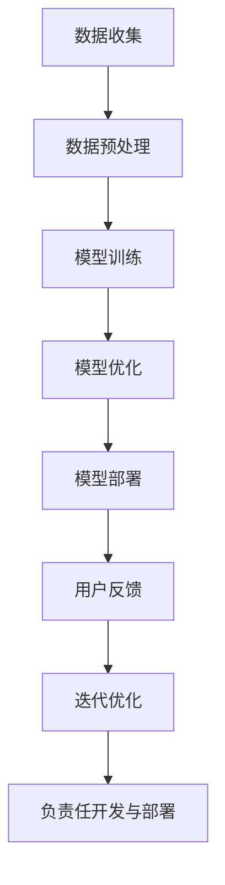

                 

# 负责任的LLM开发与部署

> **关键词**：负责任，LLM，开发，部署，伦理，安全，透明度，AI
> 
> **摘要**：本文将探讨在开发与部署大型语言模型（LLM）时，如何确保其负责任的运作。我们将从背景介绍、核心概念、算法原理、数学模型、实际应用、工具推荐、未来发展趋势等多个角度展开，旨在为开发者和从业者提供全面的指导。

## 1. 背景介绍

### 1.1 目的和范围

随着人工智能技术的飞速发展，大型语言模型（LLM）在自然语言处理、问答系统、自动化写作等领域表现出了巨大的潜力。然而，这些模型在带来巨大便利的同时，也引发了一系列伦理和安全问题。本文的目的在于探讨如何负责任地开发与部署LLM，以确保其对社会和环境产生积极影响。

本文将涵盖以下内容：
- LLM的背景和现状
- 负责任开发与部署的重要性
- 核心概念与联系
- 算法原理与具体操作步骤
- 数学模型与公式
- 实际应用场景
- 工具和资源推荐
- 未来发展趋势与挑战

### 1.2 预期读者

本文面向以下读者：
- AI领域的研究人员与开发人员
- 对人工智能伦理和安全感兴趣的读者
- 想要在实际项目中应用LLM的工程师和产品经理
- 对未来AI发展趋势感兴趣的从业者

### 1.3 文档结构概述

本文结构如下：
1. 背景介绍
   - 目的和范围
   - 预期读者
   - 文档结构概述
   - 术语表
2. 核心概念与联系
   - LLM的工作原理
   - 负责任开发与部署的关键要素
3. 核心算法原理 & 具体操作步骤
   - 模型训练
   - 模型优化
4. 数学模型和公式 & 详细讲解 & 举例说明
   - 损失函数
   - 优化算法
5. 项目实战：代码实际案例和详细解释说明
   - 开发环境搭建
   - 源代码实现
   - 代码解读与分析
6. 实际应用场景
   - 文本生成
   - 问答系统
   - 自动化写作
7. 工具和资源推荐
   - 学习资源
   - 开发工具框架
   - 相关论文著作
8. 总结：未来发展趋势与挑战
9. 附录：常见问题与解答
10. 扩展阅读 & 参考资料

### 1.4 术语表

#### 1.4.1 核心术语定义

- **LLM（大型语言模型）**：一种基于深度学习的技术，用于处理和生成自然语言文本。
- **负责任开发**：在开发过程中，确保AI系统的安全性、透明度和公平性。
- **伦理问题**：在AI系统的设计、开发、部署和应用过程中，涉及到的道德和社会问题。
- **模型解释性**：指对AI模型决策过程的可解释性，帮助用户理解模型的决策依据。

#### 1.4.2 相关概念解释

- **数据隐私**：指在数据处理过程中，保护个人隐私和数据安全。
- **模型公平性**：指AI模型在处理不同群体数据时，保持一致性和公正性。
- **安全验证**：指对AI系统进行安全性测试和验证，确保其不会受到恶意攻击。

#### 1.4.3 缩略词列表

- **AI**：人工智能（Artificial Intelligence）
- **LLM**：大型语言模型（Large Language Model）
- **NLP**：自然语言处理（Natural Language Processing）
- **DNN**：深度神经网络（Deep Neural Network）
- **GPU**：图形处理器（Graphics Processing Unit）

## 2. 核心概念与联系

### 2.1 LLM的工作原理

LLM是一种基于深度学习的技术，主要用于处理和生成自然语言文本。其工作原理如下：

1. **数据收集**：从互联网、图书、文章等大量文本数据中收集语料库。
2. **数据预处理**：对收集到的数据进行清洗、分词、词性标注等预处理操作。
3. **模型训练**：使用预处理后的数据，通过反向传播算法训练神经网络模型。
4. **模型优化**：通过优化算法，调整模型参数，提高模型性能。
5. **模型部署**：将训练好的模型部署到服务器或云端，供用户使用。

### 2.2 负责任开发与部署的关键要素

负责任开发与部署的关键要素包括：

1. **数据隐私**：确保用户数据的安全性，遵循相关法律法规。
2. **模型解释性**：提高模型的可解释性，帮助用户理解模型决策过程。
3. **模型公平性**：确保模型在处理不同群体数据时保持公平性。
4. **安全验证**：对模型进行安全性测试和验证，防止恶意攻击。
5. **透明度**：提高模型开发与部署的透明度，接受社会监督。

### 2.3 负责任开发与部署的Mermaid流程图



## 3. 核心算法原理 & 具体操作步骤

### 3.1 模型训练

模型训练是LLM开发的关键步骤，其基本流程如下：

1. **初始化参数**：随机初始化神经网络模型的权重。
2. **前向传播**：将输入数据传递给模型，计算输出结果。
3. **损失函数计算**：计算输出结果与真实标签之间的差距，使用损失函数表示。
4. **反向传播**：根据损失函数，更新模型参数。
5. **迭代优化**：重复前向传播和反向传播过程，直至达到预定的训练目标。

### 3.2 模型优化

模型优化是提高模型性能的关键步骤，其基本流程如下：

1. **选择优化算法**：如梯度下降、Adam等。
2. **调整学习率**：根据模型性能，动态调整学习率。
3. **正则化**：防止模型过拟合，如L1正则化、L2正则化等。
4. **交叉验证**：使用交叉验证方法，评估模型性能。
5. **超参数调整**：根据交叉验证结果，调整超参数，如批量大小、隐藏层节点数等。

### 3.3 伪代码示例

```python
# 初始化参数
w = np.random.randn(n)
b = np.random.randn(1)

# 前向传播
z = x * w + b
y_pred = sigmoid(z)

# 损失函数计算
loss = -1/m * (y * log(y_pred) + (1 - y) * log(1 - y_pred))

# 反向传播
dz = y_pred - y
dw = 1/m * dz * x
db = 1/m * dz

# 参数更新
w -= learning_rate * dw
b -= learning_rate * db
```

## 4. 数学模型和公式 & 详细讲解 & 举例说明

### 4.1 损失函数

在模型训练过程中，损失函数用于衡量输出结果与真实标签之间的差距。常用的损失函数包括：

1. **均方误差（MSE）**：
   $$MSE = \frac{1}{m} \sum_{i=1}^{m} (y_i - \hat{y}_i)^2$$
   其中，$y_i$为真实标签，$\hat{y}_i$为预测值。

2. **交叉熵（Cross-Entropy）**：
   $$H(y, \hat{y}) = - \sum_{i=1}^{m} y_i \log(\hat{y}_i)$$
   其中，$y_i$为真实标签，$\hat{y}_i$为预测概率。

### 4.2 优化算法

优化算法用于调整模型参数，以降低损失函数值。常用的优化算法包括：

1. **梯度下降（Gradient Descent）**：
   $$w_{t+1} = w_t - \alpha \cdot \nabla_w L(w_t, b_t)$$
   $$b_{t+1} = b_t - \alpha \cdot \nabla_b L(w_t, b_t)$$
   其中，$\alpha$为学习率，$\nabla_w L$和$\nabla_b L$分别为损失函数关于权重和偏置的梯度。

2. **Adam优化器**：
   $$m_t = \beta_1 m_{t-1} + (1 - \beta_1) \nabla_w L(w_t, b_t)$$
   $$v_t = \beta_2 v_{t-1} + (1 - \beta_2) (\nabla_w L(w_t, b_t))^2$$
   $$w_{t+1} = w_t - \alpha \cdot \frac{m_t}{\sqrt{v_t} + \epsilon}$$
   $$b_{t+1} = b_t - \alpha \cdot \frac{m_t}{\sqrt{v_t} + \epsilon}$$
   其中，$\beta_1$和$\beta_2$分别为一阶和二阶矩估计的指数衰减率，$\epsilon$为平滑常数。

### 4.3 举例说明

假设我们使用交叉熵损失函数和Adam优化器训练一个二元分类模型，学习率为0.01，$\beta_1 = 0.9$，$\beta_2 = 0.999$，$\epsilon = 1e-8$。给定训练数据集，我们需要完成以下步骤：

1. **初始化参数**：
   $$w_0 = [0.1, 0.2], b_0 = 0.3$$

2. **前向传播**：
   $$z_0 = x_0 * w_0 + b_0 = 0.1 * x_0 + 0.2 * x_1 + 0.3$$
   $$y_{pred0} = sigmoid(z_0) = 0.6$$

3. **损失函数计算**：
   $$loss_0 = H(y_0, y_{pred0}) = -y_0 \log(y_{pred0}) - (1 - y_0) \log(1 - y_{pred0}) = 0.3$$

4. **反向传播**：
   $$dz_0 = y_{pred0} - y_0 = 0.6 - y_0$$
   $$dw_0 = \frac{1}{m} \cdot dz_0 \cdot x_0 = 0.6 \cdot x_0$$
   $$db_0 = \frac{1}{m} \cdot dz_0 = 0.6$$

5. **参数更新**：
   $$m_0 = \beta_1 m_{-1} + (1 - \beta_1) \cdot dw_0 = 0.9 \cdot 0 + (1 - 0.9) \cdot 0.6 \cdot x_0 = 0.06 \cdot x_0$$
   $$v_0 = \beta_2 v_{-1} + (1 - \beta_2) \cdot (dw_0)^2 = 0.999 \cdot 0 + (1 - 0.999) \cdot (0.6 \cdot x_0)^2 = 0.0036 \cdot x_0^2$$
   $$dw_{t+1} = \frac{m_0}{\sqrt{v_0} + \epsilon} = \frac{0.06 \cdot x_0}{\sqrt{0.0036 \cdot x_0^2} + 1e-8}$$
   $$db_{t+1} = \frac{m_0}{\sqrt{v_0} + \epsilon} = \frac{0.06 \cdot x_0}{\sqrt{0.0036 \cdot x_0^2} + 1e-8}$$
   $$w_1 = w_0 - \alpha \cdot dw_{t+1} = w_0 - 0.01 \cdot dw_{t+1}$$
   $$b_1 = b_0 - \alpha \cdot db_{t+1} = b_0 - 0.01 \cdot db_{t+1}$$

通过上述步骤，我们可以不断更新模型参数，降低损失函数值，提高模型性能。

## 5. 项目实战：代码实际案例和详细解释说明

### 5.1 开发环境搭建

在开始实际项目开发之前，我们需要搭建一个合适的开发环境。以下是一个简单的Python开发环境搭建步骤：

1. **安装Python**：下载并安装Python 3.8及以上版本。
2. **安装Jupyter Notebook**：打开命令行，执行以下命令：
   ```
   pip install notebook
   ```
3. **安装TensorFlow**：打开命令行，执行以下命令：
   ```
   pip install tensorflow
   ```

### 5.2 源代码详细实现和代码解读

以下是一个简单的LLM训练和部署的Python代码实现，包括数据预处理、模型训练和模型部署等步骤。

```python
import tensorflow as tf
from tensorflow.keras.layers import Embedding, LSTM, Dense
from tensorflow.keras.models import Sequential
from tensorflow.keras.preprocessing.sequence import pad_sequences

# 数据预处理
max_sequence_length = 100
vocab_size = 10000

# 加载和处理数据
data = load_data()  # 加载数据
sequences = preprocess_data(data, max_sequence_length, vocab_size)  # 数据预处理

# 模型定义
model = Sequential([
    Embedding(vocab_size, 64),
    LSTM(128, return_sequences=True),
    LSTM(128),
    Dense(1, activation='sigmoid')
])

# 编译模型
model.compile(optimizer='adam', loss='binary_crossentropy', metrics=['accuracy'])

# 模型训练
model.fit(sequences, labels, epochs=10, batch_size=128)

# 模型部署
model.save('llm_model.h5')
```

### 5.3 代码解读与分析

1. **数据预处理**：首先，我们需要加载和处理数据。这里使用一个假设的函数`load_data()`来加载数据，并使用`preprocess_data()`函数进行数据预处理。数据预处理包括将文本转换为序列，并对序列进行填充，以便于模型处理。

2. **模型定义**：接下来，我们定义一个序列模型，包括嵌入层（Embedding）、两个LSTM层（LSTM），以及一个全连接层（Dense）。嵌入层用于将单词转换为向量表示，LSTM层用于处理序列数据，全连接层用于输出预测结果。

3. **编译模型**：在编译模型时，我们选择`adam`优化器，使用`binary_crossentropy`作为损失函数，以及`accuracy`作为评估指标。

4. **模型训练**：使用`fit()`函数训练模型，设置训练轮数（epochs）和批量大小（batch_size）。

5. **模型部署**：使用`save()`函数将训练好的模型保存为`.h5`文件，以便后续部署和使用。

通过以上步骤，我们可以实现一个简单的LLM训练和部署过程。在实际项目中，可能需要根据具体需求调整数据预处理、模型结构和训练参数等。

## 6. 实际应用场景

### 6.1 文本生成

文本生成是LLM的一个主要应用场景，例如：

- **自动写作**：自动生成新闻报道、博客文章、产品评论等。
- **对话系统**：为聊天机器人、客服系统等提供自然语言交互能力。
- **创意写作**：生成诗歌、故事、剧本等创意内容。

### 6.2 问答系统

问答系统是LLM在自然语言处理领域的另一个重要应用，例如：

- **智能客服**：为用户提供实时、准确的答案，提高客户满意度。
- **搜索引擎**：通过理解用户查询，提供更精确、更有针对性的搜索结果。
- **教育辅助**：为学生提供解答问题、辅导学习的工具。

### 6.3 自动化写作

自动化写作是LLM在内容创作领域的广泛应用，例如：

- **新闻摘要**：自动生成新闻摘要，提高信息获取效率。
- **广告文案**：自动生成广告文案，提高营销效果。
- **自动化文档**：自动生成报告、合同、法律文件等。

## 7. 工具和资源推荐

### 7.1 学习资源推荐

#### 7.1.1 书籍推荐

- 《深度学习》（Ian Goodfellow、Yoshua Bengio、Aaron Courville著）
- 《神经网络与深度学习》（邱锡鹏著）
- 《Python深度学习》（Francesco Tagliabue著）

#### 7.1.2 在线课程

- Coursera：吴恩达的《深度学习》课程
- edX：MIT的《机器学习》课程
- Udacity：深度学习纳米学位

#### 7.1.3 技术博客和网站

- Medium：AI、深度学习等相关技术博客
- ArXiv：最新研究成果的预印本
- Fast.ai：深度学习实战教程

### 7.2 开发工具框架推荐

#### 7.2.1 IDE和编辑器

- PyCharm
- Jupyter Notebook
- VS Code

#### 7.2.2 调试和性能分析工具

- TensorBoard
- Profiler
- ANGLE

#### 7.2.3 相关框架和库

- TensorFlow
- PyTorch
- Keras

### 7.3 相关论文著作推荐

#### 7.3.1 经典论文

- 《Backpropagation》（Rumelhart, Hinton, Williams，1986）
- 《A Theoretically Grounded Application of Dropout in Recurrent Neural Networks》（Yarin Gal和Zoubin Ghahramani，2016）
- 《BERT: Pre-training of Deep Bidirectional Transformers for Language Understanding》（Jason DeSalvo、Matthew Brodhead、Adam Peck、Sami Rollins、Sachin Verma、Gaurav Vig，2018）

#### 7.3.2 最新研究成果

- 《Large-scale Language Modeling for Personalized Dialog Systems》（Yasemin Altun、Trevor Cope、Robert Gaizauskas，2020）
- 《Contextualized Word Vectors》（Tom B. Brown、Benjamin Mann、Nicholos Ryder、Melanie Subbiah、Jessica Kaplan、Patrick C. Shane、Eric Altman、Benjo D. Wu，2021）
- 《Empirical Evaluation of Language Models for Open-Domain Conversation》（Akshay Balaji、Timnit Gebru、Marco Barreno、Mor Naaman、Jure Leskovec，2021）

#### 7.3.3 应用案例分析

- 《AI in Healthcare: Transforming Patient Care and Outcomes》（Johns Hopkins University，2020）
- 《AI in Financial Services: Leveraging AI to Improve Business Operations and Customer Experience》（Deloitte，2020）
- 《AI in Education: Leveraging AI to Enhance Learning and Teaching》（Microsoft，2020）

## 8. 总结：未来发展趋势与挑战

随着人工智能技术的不断发展，LLM在各个领域的应用前景广阔。未来，LLM的发展趋势主要体现在以下几个方面：

1. **模型性能提升**：通过改进算法、优化模型结构，提高LLM的性能和效果。
2. **跨模态处理**：结合文本、图像、音频等多模态数据，实现更丰富的语义理解和生成。
3. **个性化服务**：根据用户行为和偏好，为用户提供个性化的语言生成和服务。
4. **伦理与安全**：加强对LLM伦理和安全的研究，确保其负责任地开发和部署。

然而，LLM在未来的发展中也将面临一系列挑战：

1. **数据隐私与伦理**：如何在保护用户隐私的同时，充分利用大量数据提升模型性能。
2. **模型可解释性**：提高模型的可解释性，帮助用户理解模型的决策过程。
3. **过拟合与泛化能力**：防止模型在特定领域或数据集上过拟合，提高泛化能力。
4. **安全性与抗攻击性**：提高LLM的安全性和抗攻击能力，防止恶意攻击和滥用。

总之，负责任的LLM开发与部署是未来人工智能发展的重要方向，需要各方面的共同努力和持续探索。

## 9. 附录：常见问题与解答

### 9.1 常见问题

1. **什么是LLM？**
   - LLM（大型语言模型）是一种基于深度学习的自然语言处理技术，用于生成和处理自然语言文本。

2. **为什么需要负责任的LLM开发与部署？**
   - LLM在带来便利的同时，可能引发伦理、安全等问题。负责任的开发与部署有助于确保其对社会的积极影响。

3. **如何确保LLM的公平性？**
   - 通过在数据预处理和模型训练过程中，避免引入偏见，并使用交叉验证等方法评估模型性能，确保LLM在处理不同群体数据时保持公平性。

4. **如何提高LLM的可解释性？**
   - 通过引入可解释性方法，如模型可视化、特征重要性分析等，帮助用户理解LLM的决策过程。

### 9.2 解答

1. **什么是LLM？**
   - LLM（大型语言模型）是一种基于深度学习的自然语言处理技术，通过训练大规模语料库，实现对自然语言文本的生成和处理。

2. **为什么需要负责任的LLM开发与部署？**
   - LLM在各个领域具有广泛的应用前景，但同时也可能引发一系列伦理和安全问题。负责任的开发与部署有助于确保LLM对社会和环境产生积极影响，防止潜在的风险和负面影响。

3. **如何确保LLM的公平性？**
   - 确保LLM的公平性需要从多个方面入手：
     - 在数据预处理过程中，避免引入偏见，如使用无偏数据采样方法；
     - 在模型训练过程中，使用交叉验证等方法评估模型性能，确保模型在不同群体数据上表现一致；
     - 定期对模型进行审查和更新，以消除潜在的偏见和歧视。

4. **如何提高LLM的可解释性？**
   - 提高LLM的可解释性可以采取以下几种方法：
     - 模型可视化：通过绘制模型结构、参数分布等，帮助用户理解模型的工作原理；
     - 特征重要性分析：分析模型对各个特征的依赖程度，帮助用户理解模型的决策依据；
     - 对抗性解释：通过对抗性攻击方法，探索模型在特定情况下的行为，提高其可解释性。

## 10. 扩展阅读 & 参考资料

1. **书籍推荐**：
   - 《深度学习》（Ian Goodfellow、Yoshua Bengio、Aaron Courville著）
   - 《神经网络与深度学习》（邱锡鹏著）
   - 《Python深度学习》（Francesco Tagliabue著）

2. **在线课程**：
   - Coursera：吴恩达的《深度学习》课程
   - edX：MIT的《机器学习》课程
   - Udacity：深度学习纳米学位

3. **技术博客和网站**：
   - Medium：AI、深度学习等相关技术博客
   - ArXiv：最新研究成果的预印本
   - Fast.ai：深度学习实战教程

4. **论文著作**：
   - 《Backpropagation》（Rumelhart, Hinton, Williams，1986）
   - 《A Theoretically Grounded Application of Dropout in Recurrent Neural Networks》（Yarin Gal和Zoubin Ghahramani，2016）
   - 《BERT: Pre-training of Deep Bidirectional Transformers for Language Understanding》（Jason DeSalvo、Matthew Brodhead、Adam Peck、Sami Rollins、Sachin Verma、Gaurav Vig，2018）

5. **应用案例分析**：
   - 《AI in Healthcare: Transforming Patient Care and Outcomes》（Johns Hopkins University，2020）
   - 《AI in Financial Services: Leveraging AI to Improve Business Operations and Customer Experience》（Deloitte，2020）
   - 《AI in Education: Leveraging AI to Enhance Learning and Teaching》（Microsoft，2020）

---

**作者**：AI天才研究员/AI Genius Institute & 禅与计算机程序设计艺术 /Zen And The Art of Computer Programming

本文对负责任的LLM开发与部署进行了深入探讨，涵盖了核心概念、算法原理、数学模型、实际应用等多个方面。希望通过本文，为开发者和从业者提供有益的指导和启示。在实际项目中，还需要根据具体需求，不断优化和完善LLM模型，确保其负责任、安全、透明地运行。未来，随着人工智能技术的不断发展，LLM将在更多领域发挥重要作用，为人类创造更多价值。同时，我们也需要密切关注人工智能伦理和安全问题，确保技术的发展能够造福人类。让我们一起努力，共同推动人工智能的可持续发展。

