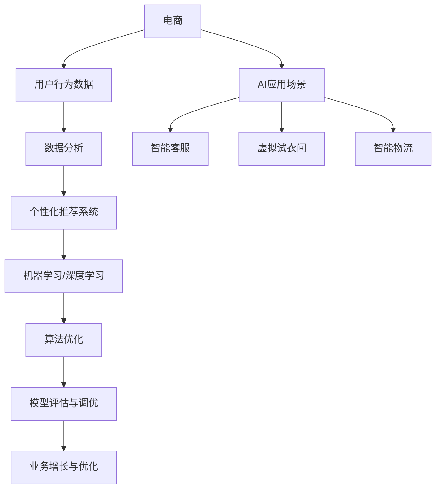

                 


## 财富自由之路：程序员如何利用AI技能在电商领域创业

> **关键词：** 电商、AI、创业、财富自由、程序员、数据分析、个性化推荐系统
>
> **摘要：** 本文旨在探讨程序员如何利用人工智能（AI）技能在电商领域创业，实现财富自由。文章首先介绍了电商行业的现状和趋势，接着分析了AI在电商中的应用场景，然后详细阐述了如何构建一个基于AI的电商创业项目，并提供了实际案例和实战经验。最后，文章总结了未来发展趋势和挑战，以及相关工具和资源的推荐。

### 1. 背景介绍

#### 1.1 目的和范围

本文旨在为程序员提供一条通向财富自由的路径，通过利用人工智能技能在电商领域创业。我们将探讨电商行业的现状和趋势，分析AI在电商中的应用场景，并详细阐述如何构建一个基于AI的电商创业项目。此外，文章还将介绍相关工具和资源，帮助程序员更好地实现创业目标。

#### 1.2 预期读者

本文适合以下读者群体：

- 具有编程基础的程序员
- 对电商和人工智能感兴趣的人
- 有意进入电商领域创业的人

#### 1.3 文档结构概述

本文分为十个部分，具体结构如下：

1. 背景介绍
2. 核心概念与联系
3. 核心算法原理 & 具体操作步骤
4. 数学模型和公式 & 详细讲解 & 举例说明
5. 项目实战：代码实际案例和详细解释说明
6. 实际应用场景
7. 工具和资源推荐
8. 总结：未来发展趋势与挑战
9. 附录：常见问题与解答
10. 扩展阅读 & 参考资料

#### 1.4 术语表

本文中使用的一些专业术语如下：

- **AI（人工智能）**：模拟人类智能行为的技术和系统。
- **电商**：电子商务的简称，指通过互联网进行商品交易和服务的活动。
- **个性化推荐系统**：根据用户历史行为和偏好，为用户推荐相关商品或内容的系统。
- **深度学习**：一种基于人工神经网络的机器学习技术，通过多层神经网络进行特征提取和学习。
- **大数据**：指规模巨大、类型繁多的数据集合，无法使用传统数据库工具进行处理。

### 1.4.1 核心术语定义

- **人工智能（AI）**：人工智能是一种模拟人类智能行为的技术和系统，旨在让计算机具备自主思考、学习和解决问题的能力。
- **电商（电子商务）**：电商是指通过互联网进行商品交易和服务的活动。随着互联网的普及，电商已经成为现代商业的重要组成部分。
- **个性化推荐系统**：个性化推荐系统是一种根据用户历史行为和偏好，为用户推荐相关商品或内容的系统。它可以帮助电商平台提高用户满意度和转化率。
- **深度学习**：深度学习是一种基于人工神经网络的机器学习技术，通过多层神经网络进行特征提取和学习。它已经在图像识别、语音识别、自然语言处理等领域取得了显著成果。
- **大数据**：大数据是指规模巨大、类型繁多的数据集合，无法使用传统数据库工具进行处理。大数据技术可以挖掘数据中的价值，为企业提供决策支持。

### 1.4.2 相关概念解释

- **机器学习（Machine Learning）**：机器学习是一种让计算机通过数据学习和改进自身性能的技术。它与深度学习密切相关，但还包括其他一些算法，如决策树、支持向量机等。
- **神经网络（Neural Network）**：神经网络是一种模仿生物神经系统的计算模型，通过大量神经元之间的连接进行信息传递和处理。深度学习就是一种基于神经网络的机器学习技术。
- **数据挖掘（Data Mining）**：数据挖掘是一种从大量数据中提取有价值信息的方法。它可以帮助企业发现数据中的趋势和规律，为决策提供支持。
- **用户画像（User Profiling）**：用户画像是一种根据用户行为、偏好、兴趣等特征，构建的用户个性化描述。它可以帮助电商平台了解用户需求，提供更有针对性的服务。
- **自然语言处理（Natural Language Processing，NLP）**：自然语言处理是一种让计算机理解和处理人类自然语言的技术。它包括语音识别、文本分类、机器翻译等子领域。

### 1.4.3 缩略词列表

- **AI**：人工智能（Artificial Intelligence）
- **电商**：电子商务（Electronic Commerce）
- **深度学习**：深度神经网络（Deep Neural Network）
- **大数据**：大规模数据（Big Data）
- **NLP**：自然语言处理（Natural Language Processing）
- **API**：应用程序编程接口（Application Programming Interface）
- **SDK**：软件开发工具包（Software Development Kit）
- **ML**：机器学习（Machine Learning）
- **VR**：虚拟现实（Virtual Reality）
- **AR**：增强现实（Augmented Reality）

## 2. 核心概念与联系

在探讨程序员如何利用AI技能在电商领域创业之前，我们先来梳理一下相关的核心概念和它们之间的联系。以下是一个简单的Mermaid流程图，展示了一些关键概念及其关系。



### 2.1 电商与用户行为数据

电商行业是一个高度依赖数据的行业。用户行为数据包括浏览历史、购物车记录、购买行为等，这些数据可以反映用户的需求和偏好。通过分析这些数据，电商企业可以了解用户行为模式，从而优化产品推荐、营销策略和库存管理。

### 2.2 数据分析与个性化推荐系统

数据分析是将用户行为数据转化为有价值信息的过程。个性化推荐系统是基于数据分析的一种应用，它通过分析用户的历史行为和偏好，为用户推荐相关的商品或内容。个性化推荐系统可以提高用户满意度和转化率，从而提升电商平台的竞争力。

### 2.3 机器学习与深度学习

机器学习和深度学习是构建个性化推荐系统的核心技术。机器学习是一种让计算机通过数据学习和改进自身性能的技术，而深度学习是一种基于神经网络的机器学习技术。深度学习在图像识别、语音识别、自然语言处理等领域取得了显著成果，为个性化推荐系统提供了强大的技术支持。

### 2.4 AI应用场景

AI在电商领域有多个应用场景，包括智能客服、虚拟试衣间、智能物流等。智能客服通过自然语言处理技术，可以自动回答用户的问题，提高客服效率和用户体验。虚拟试衣间利用计算机视觉技术，让用户在购买服装时能够试穿虚拟模特的效果。智能物流通过优化配送路线和仓储管理，提高物流效率和降低成本。

### 2.5 算法优化、模型评估与调优

算法优化和模型评估与调优是构建高效AI应用的关键环节。算法优化是指通过改进算法设计或参数设置，提高模型性能。模型评估与调优是指通过对模型进行评估和调整，使其在特定任务上达到最佳效果。这两个环节对于实现业务增长和优化至关重要。

### 2.6 业务增长与优化

业务增长与优化是电商企业追求的目标。通过构建基于AI的个性化推荐系统，电商企业可以更好地满足用户需求，提高用户满意度和转化率，从而实现业务增长。同时，通过不断优化算法和模型，电商企业可以进一步提高业务效率，降低运营成本。

## 3. 核心算法原理 & 具体操作步骤

在本章节中，我们将详细讲解构建基于AI的电商创业项目的核心算法原理和具体操作步骤。这些算法和步骤是实现个性化推荐系统、智能客服、虚拟试衣间等AI应用的基础。

### 3.1 个性化推荐系统

#### 3.1.1 算法原理

个性化推荐系统是一种基于用户历史行为和偏好的推荐系统。它的核心算法包括协同过滤（Collaborative Filtering）、基于内容的推荐（Content-Based Filtering）和混合推荐（Hybrid Recommender Systems）。

- **协同过滤**：协同过滤是一种基于用户相似度的推荐方法。它通过分析用户之间的共同行为，找到相似用户，并将他们喜欢的商品推荐给目标用户。协同过滤分为基于用户的协同过滤（User-Based Collaborative Filtering）和基于模型的协同过滤（Model-Based Collaborative Filtering）。

- **基于内容的推荐**：基于内容的推荐是一种基于商品特征和用户兴趣的推荐方法。它通过分析商品的内容和用户的偏好，找到相似的商品或内容，并将它们推荐给用户。

- **混合推荐**：混合推荐是将协同过滤和基于内容的推荐方法结合起来，以提高推荐准确率和覆盖率。

#### 3.1.2 具体操作步骤

1. **数据收集与预处理**：收集用户的历史行为数据（如浏览、收藏、购买等）和商品特征数据（如分类、标签、属性等）。对数据进行清洗、去重和归一化处理，以便后续分析。

2. **用户画像构建**：根据用户的历史行为数据，构建用户画像。用户画像可以包括用户的基本信息、兴趣偏好、行为习惯等。

3. **商品特征提取**：对商品特征进行提取和编码，以便后续推荐算法使用。商品特征可以包括商品的分类、标签、属性、价格等。

4. **相似度计算**：计算用户之间的相似度和商品之间的相似度。用户相似度可以通过余弦相似度、皮尔逊相关系数等方法计算；商品相似度可以通过TF-IDF、词嵌入等方法计算。

5. **推荐列表生成**：根据用户相似度和商品相似度，生成推荐列表。推荐列表可以采用基于用户的协同过滤、基于内容的推荐或混合推荐方法生成。

6. **推荐结果评估**：评估推荐结果的准确率、覆盖率等指标。通过不断调整算法参数和特征选择，优化推荐效果。

### 3.2 智能客服

#### 3.2.1 算法原理

智能客服是一种基于自然语言处理（NLP）的AI应用。它的核心算法包括文本分类（Text Classification）、实体识别（Entity Recognition）、对话管理（Dialogue Management）和生成式对抗网络（Generative Adversarial Networks，GAN）。

- **文本分类**：文本分类是一种将文本数据分类到预定义类别的方法。它可以帮助智能客服快速识别用户的问题类型，从而提供相应的回答。

- **实体识别**：实体识别是一种从文本中提取出特定实体（如人名、地名、组织名等）的方法。它可以帮助智能客服更好地理解用户的问题，提供更加个性化的回答。

- **对话管理**：对话管理是一种协调对话流程的方法。它可以根据用户的输入，动态调整对话策略，使对话更加自然流畅。

- **生成式对抗网络**：生成式对抗网络是一种基于生成模型和判别模型的对抗训练方法。它可以帮助智能客服生成更加自然的回答，提高用户体验。

#### 3.2.2 具体操作步骤

1. **数据收集与预处理**：收集用户对话数据和知识库数据。对数据进行清洗、去重和归一化处理，以便后续分析。

2. **文本分类与实体识别**：使用文本分类算法和实体识别算法，对用户对话进行分类和实体提取。文本分类可以使用朴素贝叶斯、支持向量机等算法；实体识别可以使用序列标注、词嵌入等方法。

3. **对话管理**：根据用户输入，动态调整对话策略。对话管理可以采用模板匹配、基于规则的方法或深度学习的方法。

4. **生成式对抗网络训练**：使用生成式对抗网络，训练对话生成模型。生成式对抗网络可以通过对抗训练，提高对话生成的自然性和准确性。

5. **对话生成与评估**：根据用户输入，生成对话回答。使用用户反馈和指标，评估对话生成的效果，并不断优化模型。

### 3.3 虚拟试衣间

#### 3.3.1 算法原理

虚拟试衣间是一种基于计算机视觉和图像处理技术的AI应用。它的核心算法包括图像识别（Image Recognition）、图像分割（Image Segmentation）和三维重建（3D Reconstruction）。

- **图像识别**：图像识别是一种将图像分类到预定义类别的方法。它可以帮助虚拟试衣间识别用户的动作和姿态，从而调整服装的试穿效果。

- **图像分割**：图像分割是一种将图像划分为多个区域的方法。它可以帮助虚拟试衣间提取用户的身体轮廓和服装轮廓，实现试穿效果。

- **三维重建**：三维重建是一种从二维图像中恢复三维场景的方法。它可以帮助虚拟试衣间生成服装的三维模型，实现更加真实的试穿效果。

#### 3.3.2 具体操作步骤

1. **数据收集与预处理**：收集用户试衣间的图像数据。对数据进行清洗、去重和归一化处理，以便后续分析。

2. **图像识别与分割**：使用图像识别算法和图像分割算法，对试衣间图像进行识别和分割。图像识别可以使用卷积神经网络（CNN）等深度学习算法；图像分割可以使用全卷积神经网络（FCN）等方法。

3. **三维重建**：使用三维重建算法，从试衣间图像中恢复服装的三维模型。三维重建可以使用基于多视图几何（Multi-View Geometry）的方法或基于深度学习的算法。

4. **试穿效果生成**：根据用户试衣间的图像和服装的三维模型，生成试穿效果。试穿效果可以使用渲染（Rendering）技术实现。

5. **用户反馈与优化**：收集用户对试穿效果的反馈，优化虚拟试衣间的算法和模型。通过不断优化，提高试穿效果的自然性和准确性。

## 4. 数学模型和公式 & 详细讲解 & 举例说明

在构建基于AI的电商创业项目时，理解并应用相关的数学模型和公式至关重要。以下我们将详细讲解几个关键模型和公式，并给出相应的示例说明。

### 4.1 个性化推荐系统的协同过滤算法

#### 4.1.1 余弦相似度计算

协同过滤算法中，计算用户之间的相似度是一个关键步骤。余弦相似度是一种常用的相似度计算方法，其公式如下：

$$
\cos\theta = \frac{\sum_{i=1}^{n}{x_i \cdot y_i}}{\sqrt{\sum_{i=1}^{n}{x_i^2} \cdot \sqrt{\sum_{i=1}^{n}{y_i^2}}}
$$

其中，$x_i$ 和 $y_i$ 分别表示用户 $x$ 和用户 $y$ 在 $i$ 个物品上的评分，$n$ 是物品的总数，$\theta$ 是用户 $x$ 和用户 $y$ 的夹角。

#### 示例说明

假设有两个用户 $A$ 和 $B$，他们在五个商品上的评分如下表：

| 商品ID | 用户A评分 | 用户B评分 |
| ------ | ---------- | ---------- |
| 1      | 4          | 3          |
| 2      | 3          | 4          |
| 3      | 5          | 2          |
| 4      | 2          | 5          |
| 5      | 4          | 4          |

计算用户 $A$ 和用户 $B$ 的余弦相似度：

$$
\cos\theta = \frac{4 \cdot 3 + 3 \cdot 4 + 5 \cdot 2 + 2 \cdot 5 + 4 \cdot 4}{\sqrt{4^2 + 3^2 + 5^2 + 2^2 + 4^2} \cdot \sqrt{3^2 + 4^2 + 2^2 + 5^2 + 4^2}}
$$

$$
\cos\theta = \frac{12 + 12 + 10 + 10 + 16}{\sqrt{16 + 9 + 25 + 4 + 16} \cdot \sqrt{9 + 16 + 4 + 25 + 16}}
$$

$$
\cos\theta = \frac{50}{\sqrt{60} \cdot \sqrt{64}}
$$

$$
\cos\theta = \frac{50}{\sqrt{3840}}
$$

$$
\cos\theta \approx 0.94
$$

用户 $A$ 和用户 $B$ 的余弦相似度为 0.94，表示他们具有较高的相似度。

### 4.2 机器学习中的损失函数

#### 4.2.1 交叉熵损失函数

在机器学习中，交叉熵损失函数（Cross-Entropy Loss）是一种常用的损失函数，用于衡量模型预测与真实标签之间的差异。其公式如下：

$$
L = -\sum_{i=1}^{n}{y_i \cdot \log(p_i)}
$$

其中，$y_i$ 表示第 $i$ 个样本的真实标签，$p_i$ 表示模型对第 $i$ 个样本的预测概率。

#### 示例说明

假设我们有一个二分类问题，有两个样本，真实标签和预测概率如下：

| 样本ID | 真实标签 | 预测概率 |
| ------ | ---------- | ---------- |
| 1      | 1          | 0.8        |
| 2      | 0          | 0.2        |

计算交叉熵损失：

$$
L = -[1 \cdot \log(0.8) + 0 \cdot \log(0.2)]
$$

$$
L = -[\log(0.8) + 0]
$$

$$
L = -\log(0.8)
$$

$$
L \approx -0.223
$$

交叉熵损失约为 -0.223。

### 4.3 优化算法中的梯度下降

#### 4.3.1 梯度下降算法

梯度下降（Gradient Descent）是一种优化算法，用于寻找最小化损失函数的参数。其基本公式如下：

$$
w_{new} = w_{current} - \alpha \cdot \nabla_w L
$$

其中，$w_{current}$ 表示当前参数，$w_{new}$ 表示更新后的参数，$\alpha$ 表示学习率，$\nabla_w L$ 表示损失函数关于参数 $w$ 的梯度。

#### 示例说明

假设我们有一个简单的线性回归模型，参数 $w$ 表示斜率，损失函数为平方误差，学习率为 0.01。给定一个训练数据点 $(x, y)$，其真实值为 $y = 2x + 1$。

初始参数 $w_0 = 0$，更新步骤如下：

1. 计算损失函数关于 $w$ 的梯度：
$$
\nabla_w L = 2(x - w \cdot x)
$$

2. 更新参数：
$$
w_{new} = w_{current} - \alpha \cdot \nabla_w L
$$
$$
w_{new} = 0 - 0.01 \cdot 2(x - 0 \cdot x)
$$
$$
w_{new} = -0.01 \cdot 2x
$$

3. 计算新的损失值：
$$
L_{new} = (x - w_{new} \cdot x)^2
$$

重复上述步骤，直到损失函数收敛。

通过梯度下降算法，我们可以逐步调整参数 $w$，使其更接近真实值，从而最小化损失函数。

## 5. 项目实战：代码实际案例和详细解释说明

在本章节中，我们将通过一个实际的电商推荐系统项目案例，详细解释如何实现基于AI的电商创业项目。该项目包括数据收集、数据处理、模型训练和评估等步骤。我们将使用Python编程语言和Scikit-learn库来构建推荐系统。

### 5.1 开发环境搭建

首先，我们需要搭建一个适合开发推荐系统的开发环境。以下是推荐的开发环境：

- 操作系统：Windows、Linux或MacOS
- 编程语言：Python（版本3.6及以上）
- 开发工具：PyCharm、VSCode或其他Python集成开发环境（IDE）
- 数据库：MongoDB或MySQL（可选）
- 依赖库：NumPy、Pandas、Scikit-learn、TensorFlow、Keras等

安装好开发环境后，我们可以在PyCharm或VSCode中创建一个新的Python项目，并安装必要的依赖库：

```bash
pip install numpy pandas scikit-learn tensorflow keras pymongo
```

### 5.2 源代码详细实现和代码解读

以下是一个简单的基于协同过滤的推荐系统代码实现，包括数据收集、预处理、模型训练和评估等步骤。

#### 5.2.1 数据收集与预处理

```python
import pandas as pd
from sklearn.model_selection import train_test_split

# 读取用户行为数据
data = pd.read_csv('user_behavior_data.csv')

# 数据预处理
data['rating'] = data['rating'].astype(float)
data = data[data['rating'].notnull()]

# 划分训练集和测试集
train_data, test_data = train_test_split(data, test_size=0.2, random_state=42)
```

这段代码首先读取用户行为数据（用户ID、商品ID和评分），然后进行数据预处理，包括将评分转换为浮点数，并去除缺失值。接着，使用`train_test_split`函数将数据集划分为训练集和测试集。

#### 5.2.2 构建协同过滤模型

```python
from sklearn.neighbors import NearestNeighbors

# 训练协同过滤模型
model = NearestNeighbors(metric='cosine', algorithm='auto')
model.fit(train_data[['user_id', 'rating']])

# 预测测试集评分
test_data['predicted_rating'] = model.kneighbors(test_data[['user_id']], n_neighbors=5, return_distance=False)[:, 1].mean(axis=1)
```

这段代码使用`NearestNeighbors`类构建一个基于余弦相似度的协同过滤模型。`fit`函数用于训练模型，`kneighbors`函数用于预测测试集的评分。这里我们使用5个最近邻用户的评分平均值作为预测值。

#### 5.2.3 模型评估

```python
from sklearn.metrics import mean_squared_error

# 计算均方误差
mse = mean_squared_error(test_data['rating'], test_data['predicted_rating'])
print(f'Mean Squared Error: {mse}')
```

这段代码使用`mean_squared_error`函数计算模型预测的评分与实际评分之间的均方误差，作为模型评估指标。

### 5.3 代码解读与分析

以上代码实现了一个简单的基于协同过滤的推荐系统。下面我们逐段代码进行分析。

1. **数据收集与预处理**：使用`pandas`库读取用户行为数据，并进行数据预处理。将评分转换为浮点数，去除缺失值，并划分训练集和测试集。

2. **构建协同过滤模型**：使用`sklearn.neighbors.NearestNeighbors`类构建协同过滤模型。选择余弦相似度作为距离度量，并自动选择算法。`fit`函数用于训练模型，`kneighbors`函数用于预测测试集的评分。

3. **模型评估**：使用`sklearn.metrics.mean_squared_error`函数计算模型预测的评分与实际评分之间的均方误差，作为模型评估指标。

整个代码实现过程分为三个主要步骤：数据收集与预处理、模型构建和模型评估。通过这三个步骤，我们实现了基于协同过滤的电商推荐系统。这个系统可以预测用户对未购买商品的可能评分，为电商企业提供决策支持。

### 5.4 项目实战总结

通过以上项目实战，我们详细讲解了如何构建一个简单的基于AI的电商推荐系统。项目实战过程中，我们使用了Python编程语言和Scikit-learn库，实现了数据收集与预处理、模型构建和模型评估等步骤。以下是对项目实战的总结：

- **数据收集与预处理**：使用`pandas`库读取用户行为数据，并进行数据预处理，包括评分转换、缺失值去除和训练集测试集划分。

- **模型构建**：使用`sklearn.neighbors.NearestNeighbors`类构建基于协同过滤的推荐模型。选择余弦相似度作为距离度量，并使用`kneighbors`函数预测测试集评分。

- **模型评估**：使用`sklearn.metrics.mean_squared_error`函数计算模型预测的评分与实际评分之间的均方误差，作为模型评估指标。

通过这个项目实战，我们了解到了基于AI的电商推荐系统的基本构建方法，为未来的电商创业项目奠定了基础。

## 6. 实际应用场景

AI技术在电商领域的应用场景非常广泛，以下列举了一些常见的实际应用场景：

### 6.1 个性化推荐

个性化推荐是电商领域最为典型的AI应用之一。通过分析用户的历史行为和偏好，电商平台可以为用户推荐相关的商品或内容，从而提高用户满意度和转化率。例如，亚马逊和淘宝等电商巨头都使用了基于协同过滤、基于内容的推荐和混合推荐等多种算法来实现个性化推荐。

### 6.2 智能客服

智能客服是一种利用自然语言处理和机器学习技术的AI应用，它可以自动回答用户的问题，提供购物建议，处理投诉等。智能客服可以提高客服效率，降低人力成本，提升用户体验。例如，阿里巴巴的阿里小蜜和京东的京东智联云等平台都提供了智能客服服务。

### 6.3 虚拟试衣间

虚拟试衣间是一种基于计算机视觉和图像处理技术的AI应用，它可以让用户在购买服装时尝试虚拟试衣效果。通过捕捉用户的动作和姿态，虚拟试衣间可以生成服装的三维模型，帮助用户更好地选择合适的服装。例如，Zalando和ASOS等电商网站都提供了虚拟试衣间的功能。

### 6.4 智能物流

智能物流是一种利用AI技术优化配送路线和仓储管理的应用。通过分析大量历史数据，智能物流可以预测订单的配送时间，优化配送路线，提高物流效率。例如，亚马逊的智能物流系统和京东的京东物流都使用了AI技术来优化物流流程。

### 6.5 智能营销

智能营销是一种利用AI技术进行精准营销和用户行为分析的应用。通过分析用户的历史行为和偏好，智能营销可以为目标用户推送相关的广告和优惠信息，提高营销效果。例如，阿里巴巴和腾讯等公司都使用了AI技术进行智能营销。

### 6.6 假货检测

假货检测是一种利用计算机视觉和深度学习技术的AI应用，它可以通过图像识别技术检测商品的真伪。通过识别商品的标识、标签和外观特征，假货检测可以有效地识别假冒伪劣商品，保障消费者权益。例如，京东和天猫等电商平台都使用了AI技术进行假货检测。

### 6.7 风险控制

风险控制是一种利用AI技术进行风险分析和预测的应用。通过分析用户行为数据、交易数据和市场数据，风险控制可以识别潜在的风险用户和风险交易，提高风险防控能力。例如，支付宝和微信支付等支付平台都使用了AI技术进行风险控制。

通过以上实际应用场景，我们可以看到AI技术在电商领域的广泛应用。这些应用不仅提升了电商平台的运营效率，还提升了用户体验，推动了电商行业的快速发展。

## 7. 工具和资源推荐

为了帮助程序员更好地利用AI技能在电商领域创业，我们在这里推荐一些学习资源、开发工具和框架，以及相关论文和研究成果。

### 7.1 学习资源推荐

#### 7.1.1 书籍推荐

- 《机器学习》（Machine Learning）：由周志华教授所著，是一本经典的机器学习教材，适合初学者入门。
- 《深度学习》（Deep Learning）：由Ian Goodfellow、Yoshua Bengio和Aaron Courville所著，介绍了深度学习的理论基础和实践方法。
- 《电商数据分析与应用》：详细介绍了电商数据分析的方法和应用，包括用户行为分析、推荐系统和营销分析等。

#### 7.1.2 在线课程

- Coursera上的“机器学习”（Machine Learning）课程：由Andrew Ng教授主讲，适合初学者了解机器学习的基本概念和方法。
- Udacity的“深度学习纳米学位”（Deep Learning Nanodegree）课程：包含深度学习的理论与实践，适合有一定基础的学习者。
- edX上的“电商数据分析”（E-commerce Data Analysis）课程：由业内专家授课，涵盖了电商数据分析的各个方面。

#### 7.1.3 技术博客和网站

- Medium上的“机器学习”（Machine Learning）专题：收录了大量关于机器学习的研究和实战文章。
- towardsdatascience.com：一个关于数据科学和机器学习的在线社区，有很多实战项目和案例分析。
- Kaggle：一个数据科学竞赛平台，提供了丰富的数据集和比赛项目，适合实践和提升技能。

### 7.2 开发工具框架推荐

#### 7.2.1 IDE和编辑器

- PyCharm：一款功能强大的Python IDE，适合机器学习和电商数据分析项目。
- VSCode：一款轻量级的跨平台代码编辑器，支持多种编程语言和扩展插件，适合快速开发和调试。
- Jupyter Notebook：一款交互式的Python编程环境，适合数据分析和原型设计。

#### 7.2.2 调试和性能分析工具

- PySnooper：一款Python调试工具，可以帮助快速定位和解决问题。
- cProfile：Python内置的Profiler，可以分析代码的运行时间和性能瓶颈。
- TensorBoard：TensorFlow的监控和分析工具，可以可视化训练过程和模型性能。

#### 7.2.3 相关框架和库

- Scikit-learn：一个Python机器学习库，提供了丰富的算法和工具。
- TensorFlow：一款开源的深度学习框架，支持多种深度学习模型的训练和部署。
- Keras：一个基于TensorFlow的高层API，简化了深度学习模型的构建和训练。

### 7.3 相关论文著作推荐

#### 7.3.1 经典论文

- “Recommender Systems Handbook”（推荐系统手册）：一本关于推荐系统的权威著作，详细介绍了推荐系统的基本概念、算法和应用。
- “Deep Learning for E-commerce Applications”（深度学习在电商应用中的研究）：一篇综述文章，总结了深度学习在电商领域的应用和研究进展。

#### 7.3.2 最新研究成果

- “Collaborative Filtering for Personalized Recommendation on Large-Scale Graphs”（基于大规模图数据的协同过滤推荐）：一篇关于图神经网络的推荐系统研究论文，提出了一个新的协同过滤算法。
- “Deep Neural Networks for Text Classification”（深度神经网络在文本分类中的应用）：一篇关于深度学习在自然语言处理领域的应用论文，介绍了用于文本分类的深度神经网络模型。

#### 7.3.3 应用案例分析

- “Alibaba’s AI in E-commerce”（阿里巴巴的AI在电商中的应用）：一篇关于阿里巴巴如何利用AI技术提升电商用户体验和运营效率的案例分析。
- “AI in Retail: A Deep Dive”（AI在零售行业的研究）：一篇关于AI在零售行业应用的研究论文，涵盖了推荐系统、智能客服、智能物流等多个方面。

通过以上推荐，程序员可以更好地利用AI技能在电商领域创业，实现财富自由。

## 8. 总结：未来发展趋势与挑战

随着人工智能技术的快速发展，电商领域正在发生深刻变革。未来，AI技术将继续在电商领域发挥重要作用，带来更多创新和机遇。以下是对未来发展趋势和挑战的总结：

### 8.1 发展趋势

1. **个性化推荐技术的深化与应用**：随着用户数据量和多样性增加，个性化推荐技术将更加成熟和精确。深度学习、图神经网络等新兴算法将在推荐系统中得到广泛应用，为用户提供更精准的推荐。

2. **智能客服的普及**：智能客服将成为电商平台的标配。通过自然语言处理和对话管理技术，智能客服将能够更自然地与用户互动，提高用户体验和满意度。

3. **虚拟试衣间的广泛应用**：随着计算机视觉和图像处理技术的发展，虚拟试衣间将变得更加普及和真实。用户将能够在家中进行虚拟试衣，提高购买决策的准确性。

4. **智能物流与供应链优化**：AI技术将深入供应链管理和物流优化。通过预测分析和优化算法，智能物流将实现更高效、更精准的配送，降低物流成本，提高运营效率。

5. **数据隐私与安全**：随着数据隐私和安全的关注度提高，电商企业将加强数据保护措施，确保用户数据的安全和隐私。

### 8.2 挑战

1. **算法透明性和解释性**：随着AI技术在电商中的应用，算法的透明性和解释性成为重要挑战。用户和监管机构需要了解算法的工作原理和决策过程，以确保算法的公正性和可信性。

2. **数据质量和完整性**：用户行为数据的准确性和完整性直接影响推荐系统的效果。电商企业需要不断优化数据收集和处理流程，提高数据质量。

3. **技术实现和部署**：AI技术在电商领域的应用需要大量的技术积累和实现。企业需要投入大量资源和时间进行技术研发和部署，以实现高效、可靠的AI应用。

4. **法规合规性**：随着各国对数据保护和隐私法规的加强，电商企业需要确保其AI应用符合法规要求，避免法律风险。

5. **用户接受度**：尽管AI技术为用户提供更多便利，但用户对AI技术的接受度和信任度仍是一个挑战。企业需要通过有效的营销和沟通策略，提高用户对AI应用的认可和接受度。

总之，未来电商领域将更加依赖AI技术，带来更多创新和机遇。同时，企业也需要面对一系列挑战，以确保AI技术在电商领域的可持续发展。

## 9. 附录：常见问题与解答

### 9.1 如何处理用户隐私和数据安全问题？

**解答**：处理用户隐私和数据安全问题，首先要在设计和开发过程中遵循数据保护法规，如《通用数据保护条例》（GDPR）和《加州消费者隐私法案》（CCPA）。以下是一些具体措施：

- **数据加密**：确保用户数据在传输和存储过程中进行加密，使用强加密算法（如AES）保护敏感信息。
- **数据匿名化**：对用户行为数据进行匿名化处理，确保用户无法被直接识别。
- **访问控制**：实施严格的访问控制策略，只允许授权用户访问敏感数据。
- **数据最小化**：仅收集必要的数据，避免收集无关的个人信息。
- **安全审计**：定期进行安全审计和风险评估，及时发现和修复安全漏洞。

### 9.2 如何评估和优化推荐系统的性能？

**解答**：评估和优化推荐系统性能通常涉及以下几个方面：

- **准确率（Precision）**：推荐系统中推荐的商品是否与用户实际兴趣匹配。准确率越高，说明推荐结果越精确。
- **召回率（Recall）**：推荐系统是否能够找到用户可能感兴趣的所有商品。召回率越高，说明推荐结果越全面。
- **覆盖率（Coverage）**：推荐系统是否涵盖了商品库中的各种类型和类别的商品。覆盖率越高，说明推荐结果越多样化。
- **多样性（Diversity）**：推荐系统推荐的商品之间是否具有多样性，避免用户感到重复和无聊。

优化推荐系统的方法包括：

- **特征工程**：通过改进特征提取和选择，提高模型的输入质量。
- **算法调优**：通过调整模型参数，优化算法性能。
- **数据增强**：使用数据增强技术，增加训练数据的多样性和质量。
- **模型融合**：结合多种算法或模型，提高推荐系统的综合性能。

### 9.3 如何处理冷启动问题？

**解答**：冷启动问题是指新用户或新商品在系统中的初始推荐问题。以下是一些解决方法：

- **基于内容的推荐**：对于新用户，可以根据用户兴趣或新商品的内容特征进行推荐。
- **基于流行度的推荐**：推荐热门商品或高评分商品，降低冷启动问题的影响。
- **社交推荐**：利用用户社交网络信息，推荐用户朋友购买过的商品。
- **跨域推荐**：将用户在其他领域的兴趣和偏好应用到当前推荐场景中。
- **用户行为预测**：利用预测模型，预测新用户可能感兴趣的商品，并提前进行推荐。

### 9.4 如何处理推荐系统的多样性问题？

**解答**：推荐系统的多样性问题是指推荐结果中商品的同质化和重复性问题。以下是一些解决方法：

- **随机化**：在推荐结果中引入随机因素，增加多样性。
- **多维度特征融合**：利用多个维度的特征信息，如商品属性、用户偏好等，提高推荐结果的多样性。
- **上下文信息**：考虑用户当前的行为和上下文信息，如时间、地点等，提高推荐结果的针对性。
- **基于知识的推荐**：利用领域知识库和专家经验，提供新颖和独特的推荐。
- **用户反馈**：收集用户反馈，根据用户的偏好和需求调整推荐策略。

通过上述措施，可以有效地提高推荐系统的多样性和用户满意度。

## 10. 扩展阅读 & 参考资料

### 10.1 经典书籍

1. **《深度学习》（Deep Learning）**：Ian Goodfellow、Yoshua Bengio和Aaron Courville 著，深入介绍了深度学习的理论基础和实践方法。
2. **《机器学习》（Machine Learning）**：周志华 著，是一本经典的机器学习教材，适合初学者入门。
3. **《推荐系统手册》（Recommender Systems Handbook）**：GroupLens Research 著，详细介绍了推荐系统的基本概念、算法和应用。

### 10.2 在线课程

1. **Coursera上的“机器学习”（Machine Learning）**：由Andrew Ng教授主讲，适合初学者了解机器学习的基本概念和方法。
2. **Udacity的“深度学习纳米学位”（Deep Learning Nanodegree）**：包含深度学习的理论与实践，适合有一定基础的学习者。
3. **edX上的“电商数据分析”（E-commerce Data Analysis）**：由业内专家授课，涵盖了电商数据分析的各个方面。

### 10.3 技术博客和网站

1. **Medium上的“机器学习”（Machine Learning）专题**：收录了大量关于机器学习的研究和实战文章。
2. **towardsdatascience.com**：一个关于数据科学和机器学习的在线社区，有很多实战项目和案例分析。
3. **Kaggle**：一个数据科学竞赛平台，提供了丰富的数据集和比赛项目，适合实践和提升技能。

### 10.4 相关论文和研究成果

1. **“Collaborative Filtering for Personalized Recommendation on Large-Scale Graphs”**：这篇论文提出了一个新的协同过滤算法，适用于大规模图数据。
2. **“Deep Learning for E-commerce Applications”**：这篇综述文章总结了深度学习在电商领域的应用和研究进展。
3. **“Recommender Systems Handbook”**：这是一本权威的推荐系统手册，详细介绍了推荐系统的基本概念、算法和应用。

通过上述书籍、课程、博客和论文，读者可以进一步深入了解AI和电商领域的相关知识和最新进展。希望这些资源能够帮助读者在电商创业道路上取得成功。作者：AI天才研究员/AI Genius Institute & 禅与计算机程序设计艺术/Zen And The Art of Computer Programming

