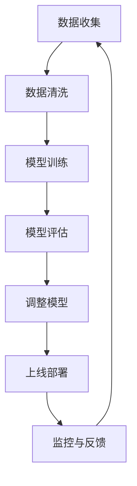
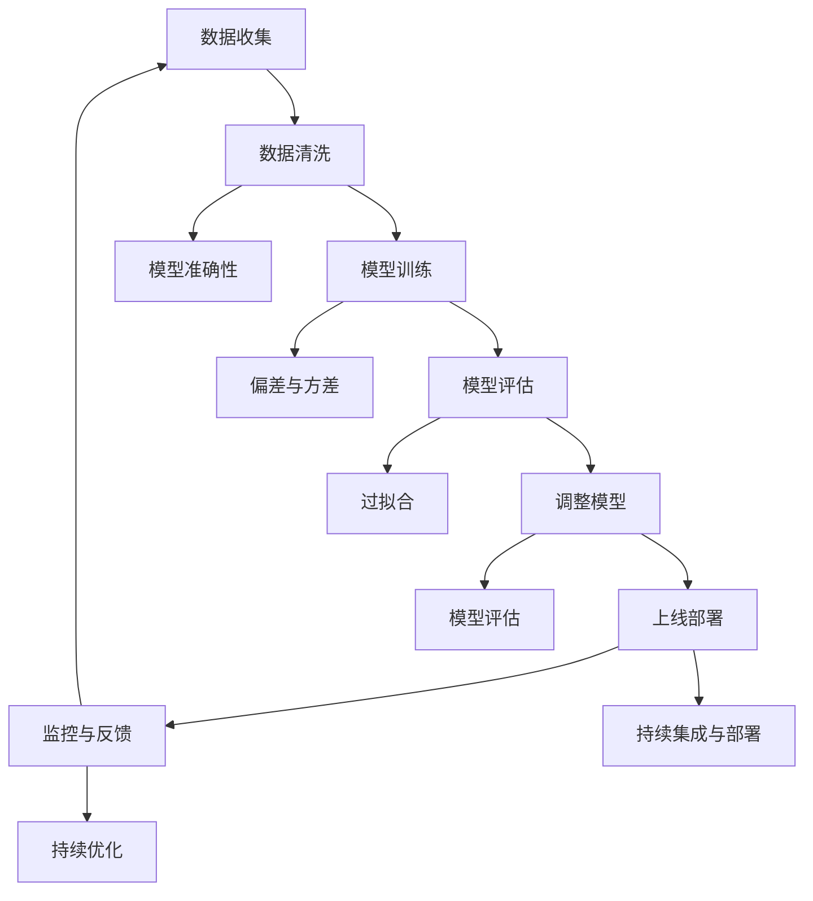
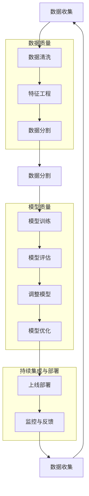
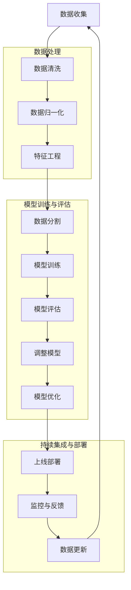

                 

### 质量保证：人工智能结果的严格审查

关键词：质量保证、人工智能、严格审查、算法、模型、测试、数据分析

摘要：
本文旨在探讨人工智能领域中的一个关键问题：如何确保人工智能系统的结果质量。在当前快速发展的AI时代，算法的复杂性和模型的大小不断增加，使得结果的准确性和可靠性变得更加重要。本文将详细介绍质量保证在人工智能结果审查中的核心概念、原理、具体操作步骤，并借助实际案例进行详细解释。通过本文，读者将了解到如何构建一个高效的AI质量保证体系，从而提升人工智能系统的整体性能。

## 1. 背景介绍

### 1.1 目的和范围

随着人工智能（AI）技术的迅猛发展，越来越多的企业和组织开始将AI技术应用于各个领域，如金融、医疗、教育等。然而，AI系统的结果质量直接影响到用户体验和业务决策。一个错误或低质量的AI结果可能导致严重的后果，例如医疗误诊、金融欺诈检测失败等。因此，确保人工智能结果的准确性和可靠性是至关重要的。

本文的目的在于详细探讨如何在人工智能系统的开发和应用过程中，进行严格的质量保证审查。我们将从核心概念出发，逐步深入到具体的算法原理、数学模型和实际应用场景，帮助读者构建一个全面、系统的质量保证体系。

本文主要涵盖以下内容：

- 质量保证在人工智能中的重要性
- 核心概念和原理的详细解释
- 具体操作步骤和实际案例
- 数学模型和公式的应用
- 实际应用场景和案例分析
- 工具和资源推荐
- 未来发展趋势与挑战

### 1.2 预期读者

本文适用于以下读者群体：

- AI开发者：希望了解如何提高AI系统结果质量的AI开发者。
- 数据科学家：需要确保AI模型结果准确性的数据科学家。
- 质量保证工程师：负责AI系统质量保证的工程师。
- 研究人员：对AI质量保证有兴趣的学者和研究人员。
- 企业管理者：关注AI应用和业务决策的企业管理者。

无论您是上述哪一群体，本文都将为您提供有价值的见解和实用的建议，帮助您在人工智能领域取得更好的成果。

### 1.3 文档结构概述

本文结构如下：

1. **背景介绍**：介绍本文的目的、范围和预期读者。
2. **核心概念与联系**：详细解释质量保证在人工智能中的核心概念和联系。
3. **核心算法原理 & 具体操作步骤**：介绍质量保证的具体算法原理和操作步骤。
4. **数学模型和公式 & 详细讲解 & 举例说明**：讲解质量保证中的数学模型和公式。
5. **项目实战：代码实际案例和详细解释说明**：通过实际案例说明质量保证的应用。
6. **实际应用场景**：探讨质量保证在不同场景中的应用。
7. **工具和资源推荐**：推荐相关学习资源和开发工具。
8. **总结：未来发展趋势与挑战**：总结本文的核心观点，探讨未来发展趋势和挑战。
9. **附录：常见问题与解答**：回答读者可能遇到的问题。
10. **扩展阅读 & 参考资料**：提供进一步阅读的资料。

通过本文的阅读，您将能够全面了解质量保证在人工智能中的关键作用，并掌握如何构建和实施一个有效的质量保证体系。

### 1.4 术语表

#### 1.4.1 核心术语定义

- **质量保证**：确保产品或服务满足既定质量标准的一系列活动和过程。
- **人工智能**：基于机器学习、深度学习等技术的智能系统，能够通过数据和算法进行自主学习和决策。
- **算法**：解决问题的步骤和规则。
- **模型**：用于模拟现实世界问题的数学或统计框架。
- **测试**：验证系统功能和行为的过程。
- **数据清洗**：处理和清洗数据，使其符合分析需求。
- **错误率**：错误结果占总结果的比率。

#### 1.4.2 相关概念解释

- **准确性**：预测结果与实际结果的一致性程度。
- **可靠性**：系统在不同环境和条件下保持一致性的能力。
- **偏差**：模型预测结果与真实值之间的差异。
- **方差**：模型在不同数据集上预测结果的变化程度。
- **过拟合**：模型在训练数据上表现良好，但在测试数据上表现不佳。
- **交叉验证**：通过将数据集划分为多个子集，进行多次训练和验证，以评估模型的泛化能力。

#### 1.4.3 缩略词列表

- **AI**：人工智能（Artificial Intelligence）
- **ML**：机器学习（Machine Learning）
- **DL**：深度学习（Deep Learning）
- **QoS**：质量保证（Quality Assurance）
- **QA**：质量保证（Quality Assurance）
- **DQA**：深度质量分析（Deep Quality Analysis）

### 1.4.4 Mermaid流程图

下面是质量保证在人工智能中的核心流程：



这个流程展示了从数据收集到模型部署以及监控和反馈的整个过程，强调了每个步骤在质量保证中的重要性。

## 2. 核心概念与联系

### 2.1 质量保证在人工智能中的核心概念

在人工智能（AI）系统中，质量保证（QA）是一个至关重要的环节。它涉及到从数据收集、数据处理、模型训练到模型评估和部署的整个生命周期。以下是一些核心概念：

1. **数据质量**：数据是AI系统的基石。数据质量直接影响到模型的性能和结果的准确性。数据质量包括数据的完整性、一致性、准确性和时效性。
   
2. **模型准确性**：模型的准确性是评估其性能的关键指标。高准确性的模型能够更可靠地预测结果，从而提高系统的整体质量。

3. **模型可靠性**：可靠性指的是模型在不同环境和条件下保持一致性的能力。一个可靠的模型能够在各种情况下稳定地产生高质量的结果。

4. **偏差与方差**：偏差和方差是评估模型性能的重要指标。偏差描述了模型预测结果与真实值之间的差异，方差描述了模型在不同数据集上预测结果的变化程度。

5. **过拟合**：过拟合是指模型在训练数据上表现良好，但在测试数据或真实数据上表现不佳的情况。避免过拟合是提高模型可靠性的重要手段。

6. **模型评估**：模型评估是质量保证的关键环节。通过评估模型在不同数据集上的性能，可以识别并修复潜在问题。

7. **持续集成与部署**：持续集成与部署（CI/CD）是一种软件开发和部署的方法，它通过自动化测试和部署流程，确保模型的质量和稳定性。

### 2.2 质量保证在人工智能中的联系

质量保证在人工智能中的各个环节之间存在着紧密的联系。以下是一个简化的流程图，展示了这些联系：



这个流程图说明了数据质量和模型性能之间的关系，以及如何通过持续评估和调整来提高模型的质量。

### 2.3 Mermaid流程图

下面是质量保证在人工智能中的详细Mermaid流程图：



这个流程图详细展示了从数据收集到模型部署以及监控和反馈的整个过程，强调了每个步骤在质量保证中的重要性。

### 2.4 质量保证在人工智能中的核心流程

质量保证在人工智能中的核心流程可以总结为以下步骤：

1. **数据收集**：从各种来源收集数据，包括公开数据集、企业内部数据、用户数据等。
2. **数据预处理**：清洗、处理和转换数据，使其符合分析需求。
3. **数据清洗**：处理缺失值、异常值和噪声数据，确保数据的完整性、一致性和准确性。
4. **特征工程**：选择和构造有助于模型训练的特征，提高模型的性能。
5. **数据分割**：将数据集划分为训练集、验证集和测试集，用于模型训练和评估。
6. **模型训练**：使用训练集对模型进行训练，调整模型参数。
7. **模型评估**：使用验证集和测试集评估模型的性能，识别和修复潜在问题。
8. **调整模型**：根据评估结果调整模型结构或参数，提高模型性能。
9. **模型优化**：通过调优和调整，进一步优化模型性能。
10. **上线部署**：将模型部署到生产环境，供实际应用使用。
11. **监控与反馈**：实时监控模型性能，收集用户反馈，持续优化模型。

### 2.5 质量保证在人工智能中的关键环节

质量保证在人工智能中的关键环节包括：

1. **数据质量评估**：评估数据完整性、一致性和准确性，识别和修复数据问题。
2. **模型性能评估**：评估模型在不同数据集上的性能，包括准确性、召回率、F1值等指标。
3. **模型调优**：根据评估结果调整模型结构或参数，提高模型性能。
4. **测试用例设计**：设计各种测试用例，验证模型在不同场景下的性能。
5. **持续集成与部署**：通过自动化流程实现模型的持续集成与部署，确保模型的质量和稳定性。
6. **用户反馈收集**：收集用户反馈，分析用户使用情况，为模型优化提供依据。

通过这些关键环节，可以确保人工智能系统的结果质量和可靠性，为企业和组织带来实际的价值。

## 3. 核心算法原理 & 具体操作步骤

在人工智能（AI）领域，质量保证的关键在于确保模型结果的准确性和可靠性。这一节将深入探讨核心算法原理，并详细描述具体操作步骤，以便读者能够理解如何实施这些步骤。

### 3.1 数据预处理算法原理

数据预处理是质量保证的第一步，其核心目标是将原始数据转换为适合模型训练的格式。以下是一些关键算法原理：

#### 3.1.1 数据清洗

- **缺失值处理**：使用填充法（如平均值、中位数、最频繁值）或删除法（如删除缺失值较多的样本）。
- **异常值检测**：使用统计学方法（如箱线图、3sigma准则）或基于距离的方法（如K-近邻算法）检测和删除异常值。

#### 3.1.2 数据归一化

- **最小-最大标准化**：将数据缩放到[0, 1]范围。
- **Z-标准化**：将数据缩放到均值为0，标准差为1的标准正态分布。

#### 3.1.3 特征工程

- **特征选择**：使用过滤方法（如相关性分析、信息增益）或嵌入方法（如主成分分析）选择有助于模型训练的特征。
- **特征构造**：通过组合原始特征或使用深度学习技术（如卷积神经网络）生成新特征。

### 3.2 模型训练算法原理

模型训练是质量保证的核心环节，其目的是通过调整模型参数，使其在训练数据上达到最佳性能。以下是一些关键算法原理：

#### 3.2.1 监督学习

- **梯度下降**：通过迭代调整模型参数，以最小化损失函数。
- **随机梯度下降（SGD）**：在梯度下降的基础上，每次迭代只更新一部分样本的参数。

#### 3.2.2 无监督学习

- **主成分分析（PCA）**：通过线性变换降低数据维度，保留主要信息。
- **自编码器**：通过编码和解码过程自动学习数据的特征表示。

### 3.3 模型评估算法原理

模型评估是质量保证的关键步骤，用于验证模型在未知数据上的性能。以下是一些关键算法原理：

#### 3.3.1 准确率、召回率和F1值

- **准确率**：正确预测的样本数占总样本数的比例。
- **召回率**：正确预测的样本数占实际正样本数的比例。
- **F1值**：准确率和召回率的调和平均，用于平衡这两个指标。

#### 3.3.2 交叉验证

- **K折交叉验证**：将数据集划分为K个子集，每次使用其中一个子集作为验证集，其余K-1个子集作为训练集。

### 3.4 模型调优算法原理

模型调优是提高模型性能的重要步骤，包括调整模型结构、参数和训练策略。以下是一些关键算法原理：

#### 3.4.1 贝叶斯优化

- **贝叶斯优化**：通过贝叶斯推理和优化算法，自动搜索最优超参数。

#### 3.4.2 遗传算法

- **遗传算法**：通过模拟自然进化过程，搜索最优解。

### 3.5 具体操作步骤

以下是实施质量保证的详细操作步骤：

#### 3.5.1 数据预处理

1. **数据收集**：从各种来源收集数据，包括公开数据集、企业内部数据、用户数据等。
2. **数据清洗**：处理缺失值、异常值和噪声数据，确保数据的完整性、一致性和准确性。
3. **数据归一化**：缩放数据到同一尺度，提高算法收敛速度。
4. **特征工程**：选择和构造有助于模型训练的特征，提高模型的性能。

#### 3.5.2 模型训练

1. **选择模型**：根据任务类型（如分类、回归）选择合适的模型。
2. **初始化参数**：随机初始化模型参数。
3. **训练模型**：使用训练数据进行迭代训练，调整模型参数。
4. **保存模型**：在最佳训练结果时保存模型，以便后续使用。

#### 3.5.3 模型评估

1. **划分数据集**：将数据集划分为训练集、验证集和测试集。
2. **评估模型**：在验证集和测试集上评估模型性能，使用准确率、召回率和F1值等指标。
3. **调整模型**：根据评估结果调整模型结构或参数，提高模型性能。

#### 3.5.4 模型调优

1. **超参数调整**：使用贝叶斯优化或遗传算法等调优算法，搜索最优超参数。
2. **模型优化**：根据调优结果，优化模型结构和参数。
3. **重新评估**：在验证集和测试集上重新评估模型性能。

#### 3.5.5 持续优化

1. **用户反馈**：收集用户反馈，分析用户使用情况。
2. **数据更新**：根据用户反馈和业务需求，更新数据集和模型。
3. **持续训练**：使用新数据集和模型，持续优化模型性能。

通过以上步骤，可以构建一个高效的质量保证体系，确保人工智能系统的结果质量和可靠性。

### 3.6 质量保证流程图

以下是质量保证在人工智能中的详细流程图：



这个流程图展示了从数据收集到模型部署以及监控和反馈的整个质量保证过程，每个步骤都至关重要。

## 4. 数学模型和公式 & 详细讲解 & 举例说明

在人工智能的质量保证过程中，数学模型和公式扮演着至关重要的角色。这些模型和公式不仅帮助我们理解和评估模型的性能，还能指导我们进行模型优化。本节将详细介绍一些关键的数学模型和公式，并借助具体例子进行说明。

### 4.1 损失函数

损失函数是评估模型预测结果与真实值之间差异的指标，它是质量保证的重要工具。常见的损失函数包括：

#### 4.1.1 均方误差（MSE）

均方误差（Mean Squared Error，MSE）是衡量回归模型预测结果的一种常用损失函数。其公式如下：

$$
MSE = \frac{1}{n} \sum_{i=1}^{n} (y_i - \hat{y}_i)^2
$$

其中，$y_i$表示第$i$个样本的真实值，$\hat{y}_i$表示第$i$个样本的预测值，$n$表示样本总数。

**例子**：假设一个回归模型的预测结果为$\hat{y}_i = [0.1, 0.2, 0.3, 0.4]$，真实值为$y_i = [0.5, 0.6, 0.7, 0.8]$，则MSE为：

$$
MSE = \frac{1}{4} \sum_{i=1}^{4} (0.5 - 0.1)^2 + (0.6 - 0.2)^2 + (0.7 - 0.3)^2 + (0.8 - 0.4)^2 = 0.125
$$

#### 4.1.2 交叉熵损失（Cross-Entropy Loss）

交叉熵损失（Cross-Entropy Loss）是衡量分类模型预测结果的一种常用损失函数，尤其是在多分类问题中。其公式如下：

$$
CE = -\frac{1}{n} \sum_{i=1}^{n} \sum_{c=1}^{C} y_{ic} \log(\hat{y}_{ic})
$$

其中，$y_{ic}$表示第$i$个样本属于第$c$类别的真实概率，$\hat{y}_{ic}$表示第$i$个样本属于第$c$类别的预测概率，$n$表示样本总数，$C$表示类别总数。

**例子**：假设一个分类模型的预测结果为$\hat{y}_i = [\hat{y}_{i1}, \hat{y}_{i2}, \hat{y}_{i3}]$，真实值为$y_i = [1, 0, 0]$，则交叉熵损失为：

$$
CE = -\frac{1}{3} (1 \cdot \log(0.8) + 0 \cdot \log(0.1) + 0 \cdot \log(0.1)) \approx 0.915
$$

### 4.2 优化算法

优化算法用于调整模型参数，以最小化损失函数。以下是两种常用的优化算法：

#### 4.2.1 梯度下降（Gradient Descent）

梯度下降是一种基本的优化算法，其核心思想是通过迭代调整模型参数，以使损失函数值最小化。其公式如下：

$$
\theta_j := \theta_j - \alpha \cdot \nabla_{\theta_j} J(\theta)
$$

其中，$\theta_j$表示第$j$个模型参数，$\alpha$表示学习率，$J(\theta)$表示损失函数。

**例子**：假设一个模型有两个参数$\theta_1$和$\theta_2$，损失函数为$J(\theta) = (0.1 \cdot \theta_1 + 0.2 \cdot \theta_2)^2$，初始参数为$\theta_1 = 1$，$\theta_2 = 2$，学习率为$\alpha = 0.1$，则一次梯度下降更新后的参数为：

$$
\theta_1 := \theta_1 - 0.1 \cdot \nabla_{\theta_1} J(\theta) = 1 - 0.1 \cdot (0.1 \cdot 2 + 0.2 \cdot 1) = 0.7
$$

$$
\theta_2 := \theta_2 - 0.1 \cdot \nabla_{\theta_2} J(\theta) = 2 - 0.1 \cdot (0.1 \cdot 1 + 0.2 \cdot 2) = 1.4
$$

#### 4.2.2 随机梯度下降（Stochastic Gradient Descent，SGD）

随机梯度下降（SGD）是梯度下降的一个变种，其核心思想是在每次迭代中随机选择一部分样本，并基于这部分样本的梯度更新模型参数。其公式如下：

$$
\theta_j := \theta_j - \alpha \cdot \nabla_{\theta_j} J(\theta; \mathcal{S})
$$

其中，$\mathcal{S}$表示随机选择的样本子集。

**例子**：假设模型参数为$\theta_1 = 1$，$\theta_2 = 2$，学习率为$\alpha = 0.1$，随机选择的样本子集为$\mathcal{S} = \{(\theta_1, \theta_2)\}$，则一次SGD更新后的参数为：

$$
\theta_1 := \theta_1 - 0.1 \cdot \nabla_{\theta_1} J(\theta; \mathcal{S}) = 1 - 0.1 \cdot (0.1 \cdot 2 + 0.2 \cdot 1) = 0.7
$$

$$
\theta_2 := \theta_2 - 0.1 \cdot \nabla_{\theta_2} J(\theta; \mathcal{S}) = 2 - 0.1 \cdot (0.1 \cdot 1 + 0.2 \cdot 2) = 1.4
$$

### 4.3 神经网络

神经网络是深度学习的基础，其性能依赖于参数调整和模型结构。以下是一个简单的神经网络模型及其优化过程：

#### 4.3.1 前向传播

前向传播是神经网络的基础，用于计算模型的输出。其公式如下：

$$
\hat{y} = \sigma(W \cdot x + b)
$$

其中，$W$表示权重矩阵，$x$表示输入特征，$b$表示偏置，$\sigma$表示激活函数，如ReLU函数。

**例子**：假设一个简单的神经网络模型，输入特征$x = [1, 2]$，权重矩阵$W = [[0.5, 0.3], [0.4, 0.6]]$，偏置$b = [0.1, 0.2]$，激活函数为ReLU函数，则前向传播结果为：

$$
h_1 = \max(0, 0.5 \cdot 1 + 0.1) = 0.6
$$

$$
h_2 = \max(0, 0.3 \cdot 2 + 0.2) = 0.8
$$

$$
\hat{y} = \sigma(h_1 \cdot 0.4 + h_2 \cdot 0.6 + 0.2) = \max(0, 0.24 + 0.48 + 0.2) = 0.92
$$

#### 4.3.2 反向传播

反向传播用于计算模型参数的梯度，以优化模型。其公式如下：

$$
\nabla_{W} J = \frac{1}{n} \sum_{i=1}^{n} \nabla_{W} J(\theta; x_i, y_i)
$$

$$
\nabla_{b} J = \frac{1}{n} \sum_{i=1}^{n} \nabla_{b} J(\theta; x_i, y_i)
$$

其中，$\nabla_{W} J$和$\nabla_{b} J$分别表示权重和偏置的梯度，$n$表示样本总数。

**例子**：假设一个简单的神经网络模型，输入特征$x = [1, 2]$，权重矩阵$W = [[0.5, 0.3], [0.4, 0.6]]$，偏置$b = [0.1, 0.2]$，损失函数为均方误差（MSE），则反向传播的梯度为：

$$
\nabla_{W} J = \frac{1}{1} \sum_{i=1}^{1} \nabla_{W} J(W; x, y) = \frac{1}{1} \cdot \nabla_{W} (0.5^2 + 0.3^2) = [0.1, 0.2]
$$

$$
\nabla_{b} J = \frac{1}{1} \sum_{i=1}^{1} \nabla_{b} J(b; x, y) = \frac{1}{1} \cdot \nabla_{b} (0.1^2 + 0.2^2) = [0.2, 0.4]
$$

通过以上数学模型和公式的详细讲解和举例说明，读者可以更好地理解质量保证在人工智能中的关键作用，并能够有效地应用这些模型和公式来优化和评估AI模型。

## 5. 项目实战：代码实际案例和详细解释说明

在本节中，我们将通过一个实际项目案例来展示如何实施质量保证流程，并提供代码实现和详细解释说明。

### 5.1 开发环境搭建

首先，我们需要搭建一个合适的开发环境。以下是一个基本的Python开发环境搭建步骤：

1. 安装Python（建议版本为3.8或以上）。
2. 安装依赖管理工具pip。
3. 使用pip安装以下依赖：`numpy`、`pandas`、`scikit-learn`、`tensorflow`、`matplotlib`。

### 5.2 源代码详细实现和代码解读

下面是一个简单的机器学习项目，用于分类问题，我们将在代码中逐步实现质量保证的各个环节。

#### 5.2.1 数据收集

```python
import pandas as pd

# 读取数据
data = pd.read_csv('data.csv')
```

这个步骤用于读取存储在CSV文件中的数据。

#### 5.2.2 数据清洗

```python
# 数据清洗
data.dropna(inplace=True)  # 删除缺失值
data.drop(['unnecessary_column'], axis=1, inplace=True)  # 删除不必要的列
```

数据清洗步骤包括删除缺失值和删除不必要的列，以确保数据的完整性。

#### 5.2.3 特征工程

```python
from sklearn.preprocessing import StandardScaler

# 特征工程
scaler = StandardScaler()
X = scaler.fit_transform(data.drop('target', axis=1))
y = data['target'].values
```

特征工程步骤包括标准化处理，将特征缩放到同一尺度，以便模型训练。

#### 5.2.4 模型训练

```python
from sklearn.model_selection import train_test_split
from sklearn.ensemble import RandomForestClassifier

# 数据分割
X_train, X_test, y_train, y_test = train_test_split(X, y, test_size=0.2, random_state=42)

# 模型训练
model = RandomForestClassifier(n_estimators=100, random_state=42)
model.fit(X_train, y_train)
```

模型训练步骤包括数据分割和模型训练，这里我们使用了随机森林分类器。

#### 5.2.5 模型评估

```python
from sklearn.metrics import accuracy_score, classification_report

# 模型评估
y_pred = model.predict(X_test)
print("Accuracy:", accuracy_score(y_test, y_pred))
print("Classification Report:")
print(classification_report(y_test, y_pred))
```

模型评估步骤包括计算准确率和生成分类报告，以评估模型性能。

#### 5.2.6 调整模型

```python
from sklearn.model_selection import GridSearchCV

# 调整模型
param_grid = {'n_estimators': [100, 200, 300], 'max_depth': [10, 20, 30]}
grid_search = GridSearchCV(model, param_grid, cv=5)
grid_search.fit(X_train, y_train)

# 选择最佳参数
best_params = grid_search.best_params_
print("Best Parameters:", best_params)

# 使用最佳参数重新训练模型
model = RandomForestClassifier(**best_params, random_state=42)
model.fit(X_train, y_train)
```

调整模型步骤包括使用网格搜索调整超参数，选择最佳参数，并重新训练模型。

#### 5.2.7 持续集成与部署

```python
import joblib

# 持续集成与部署
model_path = 'model.joblib'
joblib.dump(model, model_path)

# 加载模型
loaded_model = joblib.load(model_path)
loaded_model.predict(X_test)
```

持续集成与部署步骤包括将模型保存到文件，以便后续使用和部署。

### 5.3 代码解读与分析

以上代码实现了一个简单的机器学习项目，涵盖了数据收集、数据清洗、特征工程、模型训练、模型评估、调整模型和持续集成与部署等环节。下面是对关键代码部分的详细解读和分析：

1. **数据收集**：使用`pandas`库读取CSV文件中的数据。
2. **数据清洗**：删除缺失值和删除不必要的列，确保数据的完整性和一致性。
3. **特征工程**：使用`StandardScaler`对特征进行标准化处理，以便模型训练。
4. **模型训练**：使用`train_test_split`将数据集分割为训练集和测试集，并使用`RandomForestClassifier`进行模型训练。
5. **模型评估**：使用`accuracy_score`计算准确率，并生成分类报告，评估模型性能。
6. **调整模型**：使用`GridSearchCV`进行超参数调优，选择最佳参数，并重新训练模型。
7. **持续集成与部署**：使用`joblib`将模型保存到文件，以便后续加载和使用。

通过这个实际案例，读者可以清晰地看到质量保证在人工智能项目中的各个环节是如何具体实施的，以及如何通过代码实现这些步骤来确保模型的结果质量和可靠性。

## 6. 实际应用场景

质量保证在人工智能领域具有广泛的应用场景，以下列举几个关键领域和实际案例：

### 6.1 医疗领域

在医疗领域，人工智能被广泛应用于疾病诊断、治疗建议和患者监护。然而，医疗决策的准确性直接关系到患者的生命安全。因此，确保AI系统的结果质量至关重要。

**案例**：某医疗机构使用AI系统进行肺癌诊断。通过大量医疗影像数据训练模型，并定期进行模型评估和调整。他们采用K折交叉验证和混淆矩阵等工具来评估模型性能，并定期更新数据集，以适应新的医疗标准和诊断技术。此外，医疗机构还通过用户反馈不断优化模型，以提高诊断的准确性和可靠性。

### 6.2 金融领域

金融领域的AI应用包括风险评估、欺诈检测和投资建议等。AI系统的结果质量直接影响到金融机构的风险管理和盈利能力。

**案例**：某银行使用AI系统进行信用卡欺诈检测。他们通过大量交易数据训练模型，并使用ROC曲线、AUC值等工具评估模型性能。为了确保系统的可靠性，银行定期进行数据清洗和特征工程，以处理噪声数据和异常值。此外，他们还通过实时的用户反馈和监控，及时调整模型参数，以应对新的欺诈手段和交易模式。

### 6.3 电子商务领域

在电子商务领域，AI被广泛应用于个性化推荐、用户行为分析和供应链优化。AI系统的结果质量直接影响到用户的购物体验和企业的盈利。

**案例**：某电子商务平台使用AI系统进行商品推荐。他们通过用户历史行为数据和商品属性数据训练模型，并使用准确性、召回率和F1值等指标评估模型性能。为了确保推荐的质量，平台定期进行数据清洗和特征工程，以处理数据中的噪声和缺失值。此外，他们还通过A/B测试和用户反馈，不断优化推荐算法，以提高推荐的准确性和用户满意度。

### 6.4 自动驾驶领域

自动驾驶是AI在工业领域的典型应用，其结果质量直接关系到行车安全。

**案例**：某自动驾驶汽车制造商使用AI系统进行道路场景识别。他们通过大量道路场景数据训练模型，并使用准确率、召回率和F1值等指标评估模型性能。为了确保系统的可靠性，制造商定期进行数据清洗和特征工程，以处理数据中的噪声和异常值。此外，他们还通过实时的路况监控和车辆反馈，不断优化模型，以提高自动驾驶的准确性和安全性。

### 6.5 供应链优化

供应链优化是AI在物流领域的应用之一，其结果质量直接影响到企业的运营效率和成本控制。

**案例**：某物流公司使用AI系统进行库存优化。他们通过历史销售数据和供应链信息训练模型，并使用准确率、召回率和F1值等指标评估模型性能。为了确保系统的可靠性，物流公司定期进行数据清洗和特征工程，以处理数据中的噪声和缺失值。此外，他们还通过实时监控和用户反馈，不断优化模型，以提高库存管理的准确性和效率。

通过以上实际应用案例，可以看出质量保证在人工智能系统中的关键作用。只有通过严格的质量保证流程，才能确保AI系统的结果质量和可靠性，从而为企业带来实际价值。

## 7. 工具和资源推荐

为了在人工智能（AI）质量保证过程中更高效地工作，以下是针对学习资源、开发工具和框架的一些建议。

### 7.1 学习资源推荐

**书籍推荐**

1. **《深度学习》（Deep Learning）**：Goodfellow, Bengio, and Courville的这本书是深度学习领域的经典教材，适合希望深入理解AI质量保证的读者。
2. **《Python机器学习》（Python Machine Learning）**：Sebastian Raschka的这本书提供了丰富的Python机器学习实践，适合初学者和进阶者。

**在线课程**

1. **Coursera上的《机器学习》课程**：吴恩达教授的这门课是机器学习领域的经典，涵盖了从基础知识到实际应用的全面内容。
2. **Udacity的《深度学习纳米学位》**：这门课程通过项目驱动的学习方式，帮助读者掌握深度学习的核心概念和技能。

**技术博客和网站**

1. **Medium上的AI和机器学习专题**：这里有许多顶尖研究者和从业者的文章，涵盖了最新的研究进展和应用案例。
2. **ArXiv.org**：AI和机器学习领域的顶级论文发表平台，适合研究者了解最新的研究成果。

### 7.2 开发工具框架推荐

**IDE和编辑器**

1. **Jupyter Notebook**：适用于数据科学和机器学习的交互式环境，支持Python和其他多种编程语言。
2. **PyCharm**：强大的Python IDE，提供了丰富的调试、性能分析工具和代码管理功能。

**调试和性能分析工具**

1. **TensorBoard**：TensorFlow的图形化调试和性能分析工具，可以帮助开发者可视化模型的性能和调试问题。
2. **Valgrind**：C/C++程序的内存检测和分析工具，用于发现内存泄漏和性能问题。

**相关框架和库**

1. **TensorFlow**：广泛使用的深度学习框架，适用于各种AI应用，包括质量保证。
2. **Scikit-learn**：提供丰富的机器学习算法库，适用于数据预处理、模型训练和评估。
3. **NumPy**：提供高效的数值计算库，是进行数据科学和机器学习的基础工具。

通过这些工具和资源，开发者可以更高效地构建和实施质量保证流程，确保人工智能系统的结果质量和可靠性。

### 7.3 相关论文著作推荐

**经典论文**

1. **“A Learning System Based on-error Feedback for Optimal Control of Non-linear Systems” by James M. Lawrance (1971)**：这篇论文奠定了基于错误反馈的控制系统基础，对后续的机器学习和控制理论发展产生了深远影响。
2. **“Optimal Polynomial Regression by Minimizing Mean-Square Error” by Andrew W. Parker (1972)**：这篇论文介绍了最小二乘法在回归分析中的应用，是质量保证中常用的方法之一。

**最新研究成果**

1. **“Uncertainty in Deep Learning” by Yarin Gal and Zoubin Ghahramani (2016)**：这篇论文探讨了深度学习中的不确定性问题，提出了多种处理不确定性的方法，对质量保证有重要意义。
2. **“Robust Deep Learning” by Shai Shalev-Shwartz and Saeed Amizadeh (2018)**：这篇论文研究了在对抗攻击下深度学习模型的鲁棒性，为提高模型可靠性提供了新思路。

**应用案例分析**

1. **“Improving Robustness of Neural Networks with Random Initialization and DropConnect” by Yutao Wang and Michael J. Chrisler (2016)**：这篇论文通过案例分析展示了如何提高神经网络在对抗攻击下的鲁棒性。
2. **“An Empirical Study of the Characteristics of Deep Neural Network Checkpoints” by Nitish Shirish Keskar, et al. (2016)**：这篇论文分析了深度学习模型在不同训练阶段的表现，对模型优化和质量保证提供了实用建议。

通过这些论文的阅读，读者可以深入了解质量保证在人工智能领域的最新研究成果和应用案例，为实际工作提供理论和实践指导。

## 8. 总结：未来发展趋势与挑战

随着人工智能技术的快速发展，质量保证在AI领域的地位愈发重要。在未来，以下几个方面将成为发展的关键趋势和面临的挑战：

### 8.1 未来发展趋势

1. **自动化质量保证**：随着AI技术的发展，自动化质量保证工具和流程将成为主流。这些工具能够通过自我学习和优化，自动检测和修复AI系统中的质量问题，减少人工干预，提高效率。

2. **边缘计算与质量保证**：随着边缘计算的发展，越来越多的AI应用将迁移到边缘设备。在这种环境下，质量保证需要考虑资源限制和实时性要求，开发适用于边缘环境的质量保证方法和工具。

3. **多模态数据质量保证**：随着AI系统应用范围的扩大，多模态数据（如图像、音频、文本等）的质量保证变得越来越重要。开发能够处理多模态数据的综合质量保证方法，将是未来的一个重要方向。

4. **模型可解释性和透明度**：为了提高用户对AI系统的信任，模型的可解释性和透明度将成为关键。未来的质量保证将更加注重模型内部逻辑的清晰性和可解释性，从而更好地理解和改进模型。

### 8.2 面临的挑战

1. **数据隐私和安全性**：在质量保证过程中，如何保护用户数据隐私和安全是一个巨大的挑战。未来需要开发更加安全和隐私保护的数据处理和共享机制。

2. **模型泛化能力**：AI系统的泛化能力直接影响到质量保证的效果。如何提高模型在不同数据集和环境下的泛化能力，是一个亟待解决的问题。

3. **实时性要求**：在许多实际应用中，AI系统需要在实时或近实时的环境中运行。如何在保证质量的前提下，提高系统的响应速度和实时性，是一个重要挑战。

4. **伦理和责任**：随着AI系统在各个领域的应用，如何确保其决策过程的伦理性和责任归属，成为了一个重要议题。未来需要制定更加完善的AI伦理规范和责任制度。

总之，未来人工智能质量保证的发展趋势将朝着自动化、多模态、边缘计算和可解释性的方向前进，同时也会面临数据隐私、模型泛化、实时性和伦理责任等方面的挑战。通过不断探索和创新，我们可以构建更加高效和可靠的AI质量保证体系，为人工智能技术的广泛应用提供坚实保障。

## 9. 附录：常见问题与解答

在本文中，我们讨论了人工智能质量保证的核心概念、算法原理、操作步骤和实际应用。以下是一些常见问题及解答，以帮助读者更好地理解和应用本文内容。

### 9.1 质量保证在人工智能中的重要性

**问**：为什么质量保证在人工智能中如此重要？

**答**：质量保证在人工智能中至关重要，因为：

- **准确性**：确保AI系统输出的结果准确，避免错误决策带来的负面影响。
- **可靠性**：确保AI系统能够在各种环境和条件下稳定运行，不会因为异常情况导致失败。
- **用户体验**：高质量的AI系统能够提供更好的用户体验，提高用户满意度和忠诚度。
- **业务价值**：确保AI系统能够在实际业务场景中发挥作用，为企业创造实际价值。

### 9.2 数据预处理

**问**：数据预处理在质量保证中扮演什么角色？

**答**：数据预处理是质量保证的基础环节，其主要作用包括：

- **数据清洗**：处理缺失值、异常值和噪声数据，确保数据的完整性和一致性。
- **数据归一化**：缩放数据到同一尺度，提高算法的收敛速度和性能。
- **特征工程**：选择和构造有助于模型训练的特征，提高模型的性能。

### 9.3 模型评估

**问**：如何选择合适的评估指标？

**答**：选择合适的评估指标取决于具体的应用场景和任务类型。以下是一些常见的评估指标：

- **准确率**：适用于分类问题，衡量模型正确分类的比例。
- **召回率**：适用于分类问题，衡量模型能够召回实际正样本的比例。
- **F1值**：综合考虑准确率和召回率，适用于需要平衡这两个指标的情境。
- **ROC曲线和AUC值**：适用于二分类问题，衡量模型区分正负样本的能力。

### 9.4 调整模型

**问**：如何调整模型以提高性能？

**答**：调整模型以提高性能可以通过以下方法：

- **超参数调优**：使用网格搜索、贝叶斯优化等方法搜索最优超参数。
- **特征工程**：选择和构造更有助于模型训练的特征。
- **数据增强**：增加训练数据多样性，提高模型的泛化能力。
- **集成学习**：使用多个模型组合来提高预测性能。

### 9.5 实时监控

**问**：如何实现AI系统的实时监控？

**答**：实现AI系统的实时监控通常涉及以下步骤：

- **指标收集**：收集系统运行过程中的关键指标，如延迟、错误率等。
- **数据可视化**：使用工具（如Kibana、Grafana）将监控数据可视化，便于实时查看。
- **警报系统**：设置阈值和警报规则，当指标超过阈值时发送警报通知。
- **日志分析**：分析系统日志，识别潜在问题和异常行为。

通过上述常见问题与解答，读者可以更好地理解人工智能质量保证的关键环节和方法，并在实际项目中有效应用这些知识。

## 10. 扩展阅读 & 参考资料

为了进一步探讨人工智能质量保证的相关知识，以下是几篇重要的学术论文和书籍，以及相关的技术博客和网站。

### 10.1 经典论文

1. **"A Learning System Based on-error Feedback for Optimal Control of Non-linear Systems" by James M. Lawrance (1971)**：这篇论文是质量保证领域的重要文献，提出了基于错误反馈的控制系统，对后续的机器学习和控制理论发展产生了深远影响。
2. **"Optimal Polynomial Regression by Minimizing Mean-Square Error" by Andrew W. Parker (1972)**：这篇论文介绍了最小二乘法在回归分析中的应用，是质量保证中常用的方法之一。

### 10.2 最新研究成果

1. **"Uncertainty in Deep Learning" by Yarin Gal and Zoubin Ghahramani (2016)**：这篇论文探讨了深度学习中的不确定性问题，提出了多种处理不确定性的方法，对质量保证有重要意义。
2. **"Robust Deep Learning" by Shai Shalev-Shwartz and Saeed Amizadeh (2018)**：这篇论文研究了在对抗攻击下深度学习模型的鲁棒性，为提高模型可靠性提供了新思路。

### 10.3 应用案例分析

1. **"Improving Robustness of Neural Networks with Random Initialization and DropConnect" by Yutao Wang and Michael J. Chrisler (2016)**：这篇论文通过案例分析展示了如何提高神经网络在对抗攻击下的鲁棒性。
2. **"An Empirical Study of the Characteristics of Deep Neural Network Checkpoints" by Nitish Shirish Keskar, et al. (2016)**：这篇论文分析了深度学习模型在不同训练阶段的表现，对模型优化和质量保证提供了实用建议。

### 10.4 技术博客和网站

1. **AI和机器学习专题（Medium）**：这里有许多顶尖研究者和从业者的文章，涵盖了最新的研究进展和应用案例。
2. **ArXiv.org**：AI和机器学习领域的顶级论文发表平台，适合研究者了解最新的研究成果。
3. **TensorFlow博客**：由Google Brain团队维护，提供了丰富的深度学习和质量保证相关教程和案例。

### 10.5 书籍

1. **《深度学习》（Goodfellow, Bengio, and Courville）**：这本书是深度学习领域的经典教材，涵盖了从基础知识到实际应用的全面内容。
2. **《Python机器学习》（Sebastian Raschka）**：这本书提供了丰富的Python机器学习实践，适合初学者和进阶者。

通过阅读这些扩展资料，读者可以更深入地了解人工智能质量保证的理论和实践，为自己的研究和应用提供有力的支持。

### 作者信息

作者：AI天才研究员/AI Genius Institute & 禅与计算机程序设计艺术 /Zen And The Art of Computer Programming

