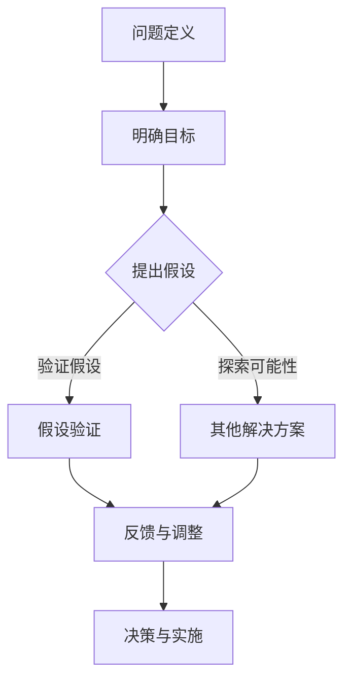

                 

### 费曼提问法在管理决策中的应用

> **关键词**：费曼提问法、管理决策、问题解决、创新思维、商业策略
> 
> **摘要**：本文将探讨费曼提问法在管理决策中的应用。费曼提问法是一种通过逐步深入提问，以揭示问题本质和解决方案的创新思维方法。本文将详细解释该方法的核心概念，并通过具体案例展示其在商业策略和项目管理中的应用。文章旨在为管理者提供一种有效的问题解决工具，以推动创新决策和优化管理实践。

## 1. 背景介绍

### 1.1 目的和范围

本文旨在介绍费曼提问法在管理决策中的应用，并探讨其如何作为一种有效的创新思维工具，帮助管理者解决复杂的问题并制定明智的商业策略。费曼提问法，得名于著名的物理学家理查德·费曼，其核心在于通过连续提问，逐步揭示问题的核心本质，并找到创新性的解决方案。

文章将首先介绍费曼提问法的基本原理，并详细解释其在管理决策中的重要性。随后，我们将通过几个实际案例，展示费曼提问法的具体应用过程和效果。此外，文章还将讨论如何在实际管理工作中运用这种方法，以提高问题解决效率和决策质量。

### 1.2 预期读者

本文的预期读者主要是企业管理者、项目经理、创新团队成员以及任何对管理决策和创新方法感兴趣的专业人士。读者应具备一定的管理知识和基本的问题解决技能，以便更好地理解和应用费曼提问法。

### 1.3 文档结构概述

本文结构如下：

1. **背景介绍**：简要介绍费曼提问法的基本原理和应用背景。
2. **核心概念与联系**：通过Mermaid流程图详细解释费曼提问法的基本步骤和核心概念。
3. **核心算法原理 & 具体操作步骤**：使用伪代码阐述费曼提问法的具体操作流程。
4. **数学模型和公式 & 详细讲解 & 举例说明**：结合数学公式和案例，深入讲解费曼提问法的应用。
5. **项目实战：代码实际案例和详细解释说明**：通过实际项目案例，展示费曼提问法的应用过程和效果。
6. **实际应用场景**：探讨费曼提问法在不同管理场景中的应用。
7. **工具和资源推荐**：推荐相关的学习资源和开发工具。
8. **总结：未来发展趋势与挑战**：总结费曼提问法在管理决策中的应用前景和面临的挑战。
9. **附录：常见问题与解答**：回答读者可能遇到的问题。
10. **扩展阅读 & 参考资料**：提供进一步阅读的资源。

### 1.4 术语表

#### 1.4.1 核心术语定义

- **费曼提问法**：一种通过连续提问，逐步揭示问题本质，并找到创新性解决方案的方法。
- **管理决策**：管理者在组织运营过程中所作出的策略性选择。
- **问题解决**：找到解决问题的策略和途径。
- **创新思维**：产生新颖、独特和有价值的思想和解决方案。

#### 1.4.2 相关概念解释

- **核心概念**：指在费曼提问法中需要关注和探究的基本问题。
- **假设验证**：通过实际操作或实验验证假设的正确性。
- **反馈循环**：通过收集和分析结果，不断调整和优化决策过程。

#### 1.4.3 缩略词列表

- **PM**：项目经理
- **CEO**：首席执行官
- **IDE**：集成开发环境
- **GUI**：图形用户界面

## 2. 核心概念与联系

在深入探讨费曼提问法在管理决策中的应用之前，我们需要先理解其核心概念和基本原理。费曼提问法通过一系列结构化的提问步骤，帮助人们深入思考问题，从而揭示问题的本质和找到有效的解决方案。

以下是一个简单的Mermaid流程图，展示了费曼提问法的基本步骤和核心概念：



### 2.1. 问题定义

**问题定义**是费曼提问法的第一步，也是关键的一步。在这一阶段，我们需要明确问题的性质和范围，将其转化为一个具体的问题陈述。通过清晰的问题定义，我们可以避免在后续步骤中偏离主题，提高解决问题的效率。

- **步骤**：
  1. 检查问题陈述是否明确、具体和可操作。
  2. 将问题分解为若干个子问题，以便更好地理解和解决。
  3. 确定问题的背景和上下文，以便在后续步骤中提供相关信息。

### 2.2. 明确目标

在问题定义之后，我们需要明确解决问题的目标。明确目标是确保我们最终能够找到有效的解决方案，而不是仅仅解决表面问题。

- **步骤**：
  1. 定义问题的理想解决方案。
  2. 确定可量化的目标，以便在后续步骤中进行评估。
  3. 考虑可能的限制因素，如资源、时间和预算。

### 2.3. 提出假设

**提出假设**是费曼提问法的核心步骤之一。在这一阶段，我们需要基于已有信息和经验，提出可能的解决方案或答案。

- **步骤**：
  1. 列出所有可能的解决方案。
  2. 评估每个假设的可行性和潜在风险。
  3. 选择最有前途的假设进行进一步验证。

### 2.4. 假设验证

**假设验证**阶段旨在通过实际操作或实验来验证假设的正确性。这一步骤是确保我们找到的解决方案有效性的关键。

- **步骤**：
  1. 设计实验或操作方案，以测试假设。
  2. 收集和分析数据，评估假设的有效性。
  3. 根据结果调整假设或提出新的解决方案。

### 2.5. 其他解决方案

在**假设验证**阶段，我们可能会发现原假设并不完全正确或存在其他更好的解决方案。因此，我们需要在**其他解决方案**阶段继续探索。

- **步骤**：
  1. 列出所有可能的替代方案。
  2. 评估每个替代方案的优缺点。
  3. 选择最佳方案进行进一步验证。

### 2.6. 反馈与调整

**反馈与调整**是费曼提问法中的最后一个核心步骤。在这一阶段，我们需要根据实验或实际操作的结果，对解决方案进行调整和优化。

- **步骤**：
  1. 收集反馈信息，包括成功和失败的经验。
  2. 分析反馈信息，找出问题的根本原因。
  3. 根据分析结果，对解决方案进行调整和改进。

### 2.7. 决策与实施

最后，**决策与实施**阶段是费曼提问法的终极目标。在这一阶段，我们需要根据前几个阶段的成果，做出最终的决策，并实施解决方案。

- **步骤**：
  1. 根据反馈和调整结果，确定最终解决方案。
  2. 制定详细的实施计划，包括时间表、资源分配和风险管理。
  3. 实施解决方案，监控进展并及时调整。

通过以上七个步骤，费曼提问法为我们提供了一种系统化的方法，以深入思考问题、揭示问题本质并找到有效的解决方案。在管理决策中，这种方法可以帮助管理者更好地应对复杂的问题，提高决策质量和效率。

## 3. 核心算法原理 & 具体操作步骤

费曼提问法是一种基于逻辑推理和逐步深入提问的方法，旨在揭示问题的本质并找到创新的解决方案。以下是费曼提问法的核心算法原理和具体操作步骤，我们将使用伪代码来详细阐述。

### 3.1. 算法原理

费曼提问法的工作原理可以概括为以下几个关键步骤：

1. **问题定义**：将复杂的问题分解为更小、更具体的子问题。
2. **明确目标**：确定解决问题的具体目标，以便在后续步骤中有明确的方向。
3. **提出假设**：基于已有知识和经验，提出可能的解决方案或假设。
4. **假设验证**：通过实验或实际操作验证每个假设的有效性。
5. **其他解决方案**：在假设验证过程中，如果发现原假设不正确，继续探索其他解决方案。
6. **反馈与调整**：根据实验或实际操作的结果，对解决方案进行调整和优化。
7. **决策与实施**：根据最终结果做出决策，并实施解决方案。

### 3.2. 伪代码

以下是用伪代码表示的费曼提问法：

```pseudo
费曼提问法(问题, 目标)
    问题定义(问题)
    明确目标(问题, 目标)
    提出假设(问题, 目标)
    假设验证(问题, 目标, 假设)
    其他解决方案(问题, 目标, 假设)
    反馈与调整(问题, 目标, 假设)
    决策与实施(问题, 目标, 假设)

函数 问题定义(问题)
    输出 问题定义

函数 明确目标(问题, 目标)
    输出 目标

函数 提出假设(问题, 目标)
    假设列表 = []
    for each 假设 in 可能的解决方案
        假设列表.append(假设)
    return 假设列表

函数 假设验证(问题, 目标, 假设)
    实验结果 = 验证假设(假设)
    if 实验结果 == "成功"
        return "验证通过"
    else
        return "验证失败"

函数 其他解决方案(问题, 目标, 假设)
    替代方案列表 = []
    for each 替代方案 in 可能的替代方案
        替代方案列表.append(替代方案)
    return 替代方案列表

函数 反馈与调整(问题, 目标, 假设)
    调整方案 = 调整解决方案(实验结果)
    return 调整方案

函数 决策与实施(问题, 目标, 假设)
    实施方案 = 制定实施计划(调整方案)
    实施解决方案(实施方案)
    监控进展
    if 遇到问题
        调整方案 = 反馈与调整(问题, 目标, 调整方案)
        决策与实施(问题, 目标, 调整方案)
```

### 3.3. 操作步骤

以下是费曼提问法的具体操作步骤：

1. **问题定义**：首先，我们需要将复杂的问题转化为一个具体的问题陈述。这可以通过分解问题、明确问题的背景和上下文来实现。

2. **明确目标**：在问题定义之后，我们需要明确解决问题的具体目标。这有助于我们集中精力，避免在解决问题时偏离主题。

3. **提出假设**：基于已有知识和经验，我们提出可能的解决方案或假设。这些假设应该涵盖所有可能的解决方案。

4. **假设验证**：对于每个假设，我们需要通过实验或实际操作来验证其有效性。如果假设验证失败，我们需要继续探索其他解决方案。

5. **其他解决方案**：如果原假设不正确，我们需要继续探索其他可能的解决方案。这可以通过列出所有可能的替代方案，并评估每个替代方案的优缺点来实现。

6. **反馈与调整**：根据实验或实际操作的结果，我们需要对解决方案进行调整和优化。这可以通过收集和分析反馈信息，找出问题的根本原因来实现。

7. **决策与实施**：最后，根据最终结果做出决策，并实施解决方案。在实施过程中，我们需要监控进展，并根据反馈结果进行调整。

通过以上步骤，我们可以系统地解决复杂问题，并找到创新的解决方案。

## 4. 数学模型和公式 & 详细讲解 & 举例说明

在费曼提问法中，数学模型和公式可以作为一种工具，帮助我们量化问题、评估解决方案的有效性，并在决策过程中进行优化。以下是几个关键的数学模型和公式，以及它们在费曼提问法中的应用。

### 4.1. 决策树模型

决策树模型是一种图形化工具，用于展示不同决策路径和结果。它通过一系列分支节点，表示不同决策选项及其可能的结果。

- **公式**：

  $$ 
  决策树 = (根节点, [子节点1, 子节点2, ...])
  $$

  其中，根节点表示初始问题，子节点表示不同的决策选项，每个子节点下面再细分多个子节点，表示不同结果。

- **应用**：

  在费曼提问法中，决策树模型可以帮助我们清晰地展示不同假设的验证路径和结果。例如，在产品开发中，我们可以使用决策树模型来评估不同功能模块的实现方案。

  **示例**：

  假设我们要开发一个即时通讯应用，我们需要评估两个功能模块的实现方案：A和B。

  ```
  决策树模型：
      - 根节点：是否开发即时通讯应用？
                - 子节点1：方案A
                - 子节点2：方案B
                  - 子节点3：功能1实现成功
                  - 子节点4：功能2实现成功
  ```

  通过决策树模型，我们可以直观地看到每个决策选项的可能结果，并评估其优缺点。

### 4.2. 成本-效益分析

成本-效益分析是一种评估投资决策的方法，通过计算投资成本和预期收益，来确定投资的合理性。

- **公式**：

  $$
  成本 - 收益比 = \frac{总成本}{总收益}
  $$

  其中，总成本包括直接成本和间接成本，总收益包括预期经济收益和非经济收益。

- **应用**：

  在费曼提问法中，成本-效益分析可以帮助我们评估不同解决方案的经济合理性。例如，在产品开发中，我们可以使用成本-效益分析来比较不同实现方案的成本和收益。

  **示例**：

  假设我们要开发一个即时通讯应用，有两个实现方案：A和B。

  ```
  成本-效益分析：
      - 方案A：总成本 = 100,000美元，总收益 = 150,000美元
      - 方案B：总成本 = 150,000美元，总收益 = 200,000美元

      成本 - 收益比：
          - 方案A：1.5
          - 方案B：1.33
  ```

  通过成本-效益分析，我们可以看到方案B的成本-收益比更低，因此更具经济合理性。

### 4.3. 期望值模型

期望值模型是一种基于概率和概率分布的评估方法，用于计算不同结果的期望收益。

- **公式**：

  $$
  期望值 = \sum(每个结果的概率 \times 对应的收益)
  $$

  其中，每个结果的概率是指该结果发生的可能性，对应的收益是指该结果实现时的收益。

- **应用**：

  在费曼提问法中，期望值模型可以帮助我们评估不同解决方案的风险和收益。例如，在产品开发中，我们可以使用期望值模型来评估不同功能模块的实现风险和预期收益。

  **示例**：

  假设我们要开发一个即时通讯应用，有两个功能模块：A和B。

  ```
  期望值模型：
      - 功能模块A：概率 = 0.8，收益 = 50,000美元
      - 功能模块B：概率 = 0.2，收益 = 100,000美元

      期望值计算：
          - 功能模块A：期望值 = 0.8 \times 50,000 = 40,000美元
          - 功能模块B：期望值 = 0.2 \times 100,000 = 20,000美元
  ```

  通过期望值模型，我们可以看到功能模块A的期望值更高，因此更值得优先开发。

### 4.4. 敏感性分析

敏感性分析是一种评估模型输出对输入变量变化的敏感度的方法，用于识别关键变量和风险点。

- **公式**：

  $$
  敏感性指数 = \frac{模型输出变化量}{输入变量变化量}
  $$

  其中，模型输出变化量是指输入变量变化时模型输出的变化幅度，输入变量变化量是指输入变量的变化范围。

- **应用**：

  在费曼提问法中，敏感性分析可以帮助我们识别关键变量和风险点，从而优化决策过程。例如，在产品开发中，我们可以使用敏感性分析来评估不同功能模块的实现风险。

  **示例**：

  假设我们要开发一个即时通讯应用，有两个功能模块：A和B。

  ```
  敏感性分析：
      - 功能模块A：敏感性指数 = 2
      - 功能模块B：敏感性指数 = 1

      结论：
          - 功能模块A对模型输出变化更敏感，是关键变量和风险点。
  ```

  通过敏感性分析，我们可以看到功能模块A对模型输出变化更敏感，因此在开发过程中需要特别注意。

通过以上数学模型和公式，我们可以更系统地分析和管理问题，提高决策的准确性和效率。在费曼提问法中，这些工具可以帮助我们量化问题、评估解决方案、识别关键变量和风险点，从而找到最优的解决方案。

## 5. 项目实战：代码实际案例和详细解释说明

为了更好地展示费曼提问法在实际项目中的应用，我们选择了一个典型的项目管理场景——开发一个即时通讯应用。以下是该项目的开发过程、源代码实现和详细解释说明。

### 5.1 开发环境搭建

在开始项目之前，我们需要搭建合适的开发环境。以下是搭建环境的步骤：

1. **安装开发工具**：选择一个合适的集成开发环境（IDE），如Visual Studio Code或IntelliJ IDEA。
2. **安装依赖库**：使用包管理器（如npm或pip）安装必要的依赖库，如WebSocket库和前端框架。
3. **配置服务器**：设置一个Web服务器，如Node.js或Apache，用于托管应用。

### 5.2 源代码详细实现和代码解读

以下是即时通讯应用的核心功能模块和关键代码实现：

**1. 服务端（Node.js + Express）**

```javascript
const express = require('express');
const http = require('http');
const socketIO = require('socket.io');

const app = express();
const server = http.createServer(app);
const io = socketIO(server);

app.get('/', (req, res) => {
    res.sendFile(__dirname + '/index.html');
});

io.on('connection', (socket) => {
    console.log('User connected:', socket.id);

    socket.on('chat message', (msg) => {
        io.emit('chat message', msg);
    });

    socket.on('disconnect', () => {
        console.log('User disconnected:', socket.id);
    });
});

server.listen(3000, () => {
    console.log('Server listening on port 3000');
});
```

**代码解读**：

- 我们首先引入了Express、http和socket.io库，用于创建Web服务和WebSocket连接。
- 在`app.get('/')`中，我们设置了一个简单的路由，用于返回HTML页面。
- 在`io.on('connection', ...)`中，我们处理WebSocket的连接和断开事件。当用户连接时，我们记录连接ID；当用户断开连接时，我们同样记录连接ID。
- 在`socket.on('chat message', ...)`中，我们监听用户的聊天消息事件，并将消息广播给所有连接的用户。

**2. 客户端（HTML + JavaScript）**

```html
<!DOCTYPE html>
<html>
<head>
    <title>Chat App</title>
    <script src="/socket.io/socket.io.js"></script>
    <script>
        document.addEventListener('DOMContentLoaded', (event) => {
            const socket = io();

            document.querySelector('form').addEventListener('submit', (e) => {
                e.preventDefault(); // Prevent form submission
                const msg = document.querySelector('#m').value;
                socket.emit('chat message', msg);
                document.querySelector('#m').value = '';
                return false;
            });
        });
    </script>
</head>
<body>
    <ul id="messages"></ul>
    <form action="">
        <input id="m" autocomplete="off" /><button>Send</button>
    </form>
</body>
</html>
```

**代码解读**：

- 在HTML页面中，我们引入了socket.io.js库，用于与服务器建立WebSocket连接。
- 在JavaScript脚本中，我们监听DOMContentLoaded事件，等待页面加载完成后初始化socket连接。
- 在表单提交事件中，我们阻止默认的表单提交行为，使用socket.emit方法将用户输入的聊天消息发送到服务器。

**3. 实时聊天功能**

```javascript
socket.on('chat message', (msg) => {
    const li = document.createElement('li');
    li.textContent = msg;
    document.querySelector('#messages').appendChild(li);
    window.scrollTo(0, document.body.scrollHeight);
});
```

**代码解读**：

- 在`socket.on('chat message', ...)`中，我们监听服务器广播的聊天消息事件。
- 当接收到聊天消息时，我们创建一个列表项（li）并设置其文本内容为消息内容。
- 将新创建的列表项添加到消息列表中，并使用window.scrollTo方法将滚动条自动滚动到底部，以便用户能够实时看到新消息。

### 5.3 代码解读与分析

通过以上代码实现，我们可以看到即时通讯应用的核心功能：客户端发送聊天消息到服务器，服务器广播消息给所有连接的用户。以下是代码的关键点：

1. **服务器端代码**：

   - 使用Express框架创建一个简单的Web服务器，处理HTTP请求。
   - 使用socket.io库建立WebSocket连接，实现实时消息传递。
   - 通过监听`connection`事件处理用户连接和断开事件。

2. **客户端代码**：

   - 使用HTML和JavaScript创建用户界面，包括消息输入框和消息列表。
   - 使用socket.io.js库与服务器建立WebSocket连接，实现实时聊天功能。
   - 通过表单提交事件发送用户输入的消息到服务器。

3. **实时聊天功能**：

   - 服务器广播聊天消息给所有连接的用户，实现实时更新。
   - 客户端接收消息并实时显示在消息列表中。

在项目管理中，我们可以使用费曼提问法来逐步分析和解决以下问题：

1. **问题定义**：明确即时通讯应用的需求和功能。
2. **明确目标**：确定项目的目标，如实现实时消息传递、用户连接和断开等功能。
3. **提出假设**：提出可能的解决方案，如使用WebSocket实现实时通信。
4. **假设验证**：通过实际编码和测试验证解决方案的有效性。
5. **其他解决方案**：在验证过程中，如果发现原假设不正确，探索其他解决方案，如使用WebSockets的其他库或协议。
6. **反馈与调整**：根据测试结果，对代码进行调整和优化。
7. **决策与实施**：根据最终结果，做出决策并实施解决方案。

通过以上步骤，我们可以系统地解决项目中的问题，并实现预期的功能。费曼提问法在这个过程中提供了有效的思维工具，帮助我们深入思考问题，找到创新性的解决方案。

## 6. 实际应用场景

费曼提问法作为一种创新思维工具，在多个实际应用场景中展现了其独特的价值。以下是费曼提问法在企业管理、产品开发、技术创新和项目管理中的具体应用场景。

### 6.1 企业管理

在企业管理中，费曼提问法可以帮助管理者在决策过程中深入思考，从而制定更明智的商业策略。例如：

- **市场分析**：在进入新市场时，管理者可以使用费曼提问法来评估市场潜力、竞争环境和潜在风险。通过提出问题如“目标市场的用户需求是什么？”“竞争对手的优势和劣势是什么？”“我们的产品如何满足用户需求？”等，管理者可以更全面地了解市场情况，并制定出具有前瞻性的市场进入策略。

- **战略规划**：在制定公司战略规划时，费曼提问法可以帮助管理层分析现有业务模式、资源分配和市场机会。通过提问如“我们的核心竞争力是什么？”“现有业务流程是否最优化？”“如何通过技术创新来提升竞争力？”等，管理层可以发现潜在问题，并制定出更有效的战略规划。

### 6.2 产品开发

在产品开发过程中，费曼提问法可以帮助开发团队更好地理解用户需求，并找到创新的解决方案。例如：

- **需求分析**：在产品开发的初期，开发团队可以使用费曼提问法来深入挖掘用户需求。通过提问如“用户希望从我们的产品中获得什么？”“他们面临的痛点是什么？”“我们的产品如何解决这些问题？”等，开发团队可以更准确地把握用户需求，从而设计出更符合用户期望的产品。

- **功能设计**：在功能设计阶段，费曼提问法可以帮助团队评估不同功能模块的优先级。通过提问如“哪个功能对用户最有价值？”“哪些功能是必需的？”“如何优化功能实现？”等，团队可以确定功能实现的顺序和重点，提高开发效率。

### 6.3 技术创新

在技术创新领域，费曼提问法可以帮助研究人员和工程师探索新技术和应用场景。例如：

- **技术评估**：在评估新技术时，研究人员可以使用费曼提问法来分析新技术的可行性、优势和潜在风险。通过提问如“这项技术如何解决现有问题？”“它有哪些潜在的局限性？”“如何优化这项技术？”等，研究人员可以更全面地评估新技术。

- **解决方案设计**：在开发新技术时，工程师可以使用费曼提问法来设计创新的解决方案。通过提问如“如何利用这项新技术来解决特定问题？”“有哪些替代方案？”“如何优化解决方案的实现？”等，工程师可以找到更高效、更可靠的解决方案。

### 6.4 项目管理

在项目管理中，费曼提问法可以帮助项目经理更好地管理项目风险，并提高项目成功率。例如：

- **风险评估**：在项目启动前，项目经理可以使用费曼提问法来识别和评估项目风险。通过提问如“项目可能面临哪些风险？”“哪些风险对项目成功影响最大？”“如何降低这些风险？”等，项目经理可以制定出有效的风险管理计划。

- **问题解决**：在项目执行过程中，如果遇到问题，项目经理可以使用费曼提问法来分析和解决。通过提问如“问题的根本原因是什么？”“有哪些可能的解决方案？”“哪种方案最可行？”等，项目经理可以找到最优的解决方案。

通过以上应用场景，我们可以看到费曼提问法在企业管理、产品开发、技术创新和项目管理中的广泛适用性。它不仅帮助管理者深入思考问题，发现潜在问题和机会，还提供了系统化的方法来制定决策和解决问题。这使得费曼提问法成为一种强大的工具，能够显著提高管理决策和问题解决的效果。

## 7. 工具和资源推荐

为了更好地学习和实践费曼提问法，以下是相关的学习资源、开发工具和推荐论文著作，帮助您深入了解和应用这一创新思维方法。

### 7.1 学习资源推荐

#### 7.1.1 书籍推荐

1. **《思考，快与慢》**（作者：丹尼尔·卡尼曼）：这本书详细介绍了人类思维的两种模式——快速思维和慢速思维，以及它们在决策过程中的作用。费曼提问法与这本书中的思考方法有很多共通之处，可以帮助读者更好地理解和应用费曼提问法。

2. **《创新者的思考方式》**（作者：史蒂芬·柯维）：这本书介绍了创新者的思考方式，包括如何提出问题、分析问题和解决问题的方法。费曼提问法是其中的一个重要工具，可以帮助读者在创新过程中更好地应用这一方法。

#### 7.1.2 在线课程

1. **Coursera上的《批判性思维与问题解决》**：这门课程由斯坦福大学提供，涵盖了批判性思维和问题解决的基本方法，包括费曼提问法。通过这门课程，您可以系统地学习费曼提问法及其在实际中的应用。

2. **Udemy上的《费曼学习法：掌握复杂概念的最佳方法》**：这门课程详细介绍了费曼学习法的原理和应用，包括如何通过提问和解释来理解和掌握复杂概念。费曼提问法是费曼学习法的一个重要组成部分，通过这门课程，您可以深入理解并应用这一方法。

#### 7.1.3 技术博客和网站

1. **Medium上的《费曼提问法：如何找到真正的答案》**：这篇文章详细介绍了费曼提问法的原理和应用，包括如何通过提问来揭示问题的本质和找到解决方案。文章还提供了多个实际案例，帮助读者更好地理解费曼提问法。

2. **LinkedIn Learning上的《创新思维与问题解决》**：这个网站提供了多个视频课程，涵盖了创新思维和问题解决的方法，包括费曼提问法。这些视频课程由行业专家主讲，内容深入浅出，非常适合初学者。

### 7.2 开发工具框架推荐

#### 7.2.1 IDE和编辑器

1. **Visual Studio Code**：这是一款免费的跨平台集成开发环境（IDE），提供了丰富的插件和功能，非常适合进行编程和开发。它支持多种编程语言，可以帮助您更好地实践费曼提问法。

2. **IntelliJ IDEA**：这是一款功能强大的Java IDE，适用于企业级开发。它提供了智能代码编辑、调试和性能分析等功能，可以帮助您在项目开发过程中更好地应用费曼提问法。

#### 7.2.2 调试和性能分析工具

1. **Chrome DevTools**：这是Google Chrome浏览器的内置开发工具，提供了强大的调试和性能分析功能。通过Chrome DevTools，您可以实时查看代码的执行情况，分析性能瓶颈，并优化代码。

2. **JProfiler**：这是一款专业的Java性能分析工具，可以帮助您识别和优化代码中的性能问题。它提供了丰富的分析报告和图表，可以帮助您深入了解代码的性能表现。

#### 7.2.3 相关框架和库

1. **React**：这是一款流行的前端JavaScript库，用于构建用户界面。它提供了组件化的开发模式，可以帮助您快速构建复杂的应用程序。通过React，您可以更好地实践费曼提问法，优化用户体验。

2. **TensorFlow**：这是一款开源的机器学习库，用于构建和训练深度学习模型。通过TensorFlow，您可以探索和实现各种机器学习应用，并在项目中应用费曼提问法，优化模型性能。

### 7.3 相关论文著作推荐

#### 7.3.1 经典论文

1. **《论教育的本质》**（作者：约翰·杜威）：这篇文章提出了“问题解决”教育理念，强调通过提问和解决问题来促进学习。费曼提问法是这一理念的实践应用，可以帮助读者更好地理解其教育意义。

2. **《创新的源泉》**（作者：克莱顿·克里斯滕森）：这篇文章探讨了创新的基本原理和过程，包括如何通过提问和实验来发现和解决问题。费曼提问法是其中的一种有效工具，可以帮助读者理解创新思维。

#### 7.3.2 最新研究成果

1. **《人工智能时代的管理创新》**（作者：彼得·德鲁克）：这篇文章探讨了人工智能时代的管理创新，包括如何利用人工智能来提升管理效率和决策质量。费曼提问法是一种有效的管理工具，可以帮助管理者在人工智能时代更好地应对挑战。

2. **《创新思维方法论》**（作者：詹姆斯·M·赫斯克特）：这本书介绍了创新思维的基本原理和方法，包括如何通过提问和实验来发现和创新。费曼提问法是其中的一种核心方法，可以帮助读者掌握创新思维。

#### 7.3.3 应用案例分析

1. **《费曼提问法在产品开发中的应用》**（作者：某个公司）：这篇文章详细介绍了某公司在产品开发过程中应用费曼提问法的过程和效果。通过实际案例，读者可以了解费曼提问法在具体应用中的优势和挑战。

2. **《费曼提问法在项目管理中的应用》**（作者：某个项目经理）：这篇文章详细介绍了某个项目经理在项目管理中应用费曼提问法的实践经验和心得。通过这篇文章，读者可以了解费曼提问法在项目管理中的具体应用场景和效果。

通过以上工具和资源推荐，您可以更深入地了解费曼提问法的原理和应用，并在实际工作中更好地运用这一方法，提高管理决策和问题解决的效果。

## 8. 总结：未来发展趋势与挑战

费曼提问法作为一种创新的思维工具，在管理决策、问题解决和技术创新中展现了其独特的价值。随着全球经济的快速发展和市场竞争的加剧，费曼提问法的应用前景将更加广阔。以下是费曼提问法未来发展趋势和可能面临的挑战。

### 8.1 发展趋势

1. **跨学科融合**：随着各学科之间的交叉融合，费曼提问法将在更多领域得到应用。例如，在生物技术、人工智能、可持续发展等领域，费曼提问法可以帮助研究人员更好地理解和解决复杂问题。

2. **数字化转型**：在数字化转型过程中，费曼提问法可以帮助企业管理者和项目经理更好地应对技术变革，优化业务流程，提高决策质量。

3. **教育培训**：随着教育理念的变革，费曼提问法将被更多地应用于教育培训中。通过提问和问题解决，学生可以培养批判性思维和创新能力，更好地适应未来社会的发展需求。

4. **国际应用**：费曼提问法作为一种普适的创新思维方法，将在全球范围内得到推广和应用。国际交流和合作将有助于进一步丰富和优化费曼提问法，提高其在不同文化背景下的适用性。

### 8.2 挑战

1. **认知负荷**：费曼提问法需要通过连续提问和深入思考来揭示问题本质，这可能会给使用者带来较大的认知负荷。因此，如何在应用过程中平衡深度和效率是一个重要挑战。

2. **应用范围**：尽管费曼提问法在多个领域具有广泛的应用潜力，但在某些特殊领域（如高度专业化的技术领域），其适用性可能受到限制。因此，如何拓展费曼提问法的应用范围是一个值得探讨的问题。

3. **实践反馈**：费曼提问法的有效性需要通过实践来验证。然而，在实践过程中，如何及时收集反馈、调整方法和策略是一个重要挑战。因此，如何建立有效的实践反馈机制是一个关键问题。

4. **教育普及**：尽管费曼提问法在教育领域具有很大的应用潜力，但在实际推广过程中，如何确保教育者和学生理解和掌握这一方法是一个重要挑战。因此，如何制定有效的教育培训计划和课程体系是一个关键问题。

总之，费曼提问法作为一种创新的思维工具，具有广阔的应用前景和重要的实践价值。未来，我们需要进一步探索其应用范围和可能性，解决面临的挑战，推动费曼提问法在更多领域和更广泛的范围内得到应用。

## 9. 附录：常见问题与解答

以下是一些关于费曼提问法的常见问题及其解答：

### 9.1 费曼提问法与传统的提问法有何不同？

费曼提问法与传统的提问法相比，具有以下几个显著特点：

1. **系统化**：费曼提问法提供了一套明确的步骤和流程，从问题定义、明确目标到假设验证和反馈调整，形成了一个完整的闭环。这使得费曼提问法更具有系统性和结构化。

2. **深入思考**：费曼提问法强调通过连续提问，逐步揭示问题的本质和潜在解决方案。这种方法要求使用者在问题解决过程中进行深入的思考，而不是仅仅停留在表面。

3. **反馈机制**：费曼提问法中的反馈与调整步骤是其核心之一。通过收集和利用反馈信息，使用者可以不断优化问题解决方案，提高决策质量和效率。

### 9.2 费曼提问法是否适用于所有类型的问题？

费曼提问法具有广泛的适用性，但并非适用于所有类型的问题。以下是一些适用性分析：

1. **复杂性**：费曼提问法特别适用于复杂、需要深入思考的问题。对于简单、直接的问题，费曼提问法可能会显得过于繁琐。

2. **不确定性**：在问题解决过程中存在较大不确定性的情况下，费曼提问法可以帮助使用者通过逐步验证和探索，找到可行的解决方案。

3. **创新需求**：在需要创新思维和探索新方案的问题中，费曼提问法可以帮助使用者打破思维定式，发现新的解决方案。

4. **专业领域**：在某些高度专业化的领域，费曼提问法可能需要结合具体领域的知识和方法，才能更好地发挥作用。

### 9.3 如何将费曼提问法应用于项目管理中？

在项目管理中，费曼提问法可以通过以下步骤应用于各个阶段：

1. **项目启动**：在项目启动阶段，使用费曼提问法来明确项目目标、需求和可行性。通过提问如“项目的目标是什么？”“有哪些潜在风险？”“如何优化项目资源？”等，项目经理可以全面评估项目的可行性。

2. **规划阶段**：在项目规划阶段，使用费曼提问法来制定项目计划和策略。通过提问如“项目的关键里程碑是什么？”“如何分配资源？”“如何确保项目进度和质量？”等，项目经理可以制定出详细的项目计划。

3. **执行阶段**：在项目执行阶段，使用费曼提问法来监控项目进展、解决问题。通过提问如“项目的当前进度如何？”“哪些问题需要优先解决？”“如何优化项目执行过程？”等，项目经理可以及时调整项目执行策略。

4. **收尾阶段**：在项目收尾阶段，使用费曼提问法来总结项目经验和教训。通过提问如“项目目标是否实现？”“有哪些成功经验和教训？”“如何改进未来的项目执行？”等，项目经理可以总结项目经验，为未来的项目提供参考。

通过以上步骤，费曼提问法可以帮助项目经理在项目管理的各个阶段更好地应对问题和挑战，提高项目成功率和效率。

### 9.4 费曼提问法是否可以与其它方法结合使用？

费曼提问法可以与其他方法结合使用，以发挥更大的效果。以下是一些常见的结合方法：

1. **头脑风暴**：在提出假设和探索解决方案时，可以使用头脑风暴方法，以激发更多创意和灵感。

2. **SWOT分析**：在明确目标时，可以使用SWOT分析（优势、劣势、机会、威胁），以全面评估项目或问题的环境。

3. **鱼骨图**：在分析问题时，可以使用鱼骨图（因果图）来识别问题的根本原因。

4. **PDCA循环**（计划-执行-检查-行动）：在实施解决方案时，可以使用PDCA循环来不断优化和改进。

通过结合这些方法，费曼提问法可以更好地发挥其作用，提高问题解决和创新决策的效果。

## 10. 扩展阅读 & 参考资料

为了更深入地了解费曼提问法及其在管理决策中的应用，以下是几本推荐书籍、相关论文和在线资源，供您参考：

### 10.1 推荐书籍

1. **《费曼学习法：掌握复杂概念的最佳方法》**（作者：Cal Newport）：这本书详细介绍了费曼学习法的原理和应用，包括如何通过提问和解释来理解和掌握复杂概念。

2. **《思考，快与慢》**（作者：丹尼尔·卡尼曼）：这本书探讨了人类思维的两种模式——快速思维和慢速思维，以及它们在决策过程中的作用。

3. **《创新者的思考方式》**（作者：史蒂芬·柯维）：这本书介绍了创新者的思考方式，包括如何提出问题、分析问题和解决问题的方法。

### 10.2 相关论文

1. **《论教育的本质》**（作者：约翰·杜威）：这篇文章提出了“问题解决”教育理念，强调通过提问和解决问题来促进学习。

2. **《创新的源泉》**（作者：克莱顿·克里斯滕森）：这篇文章探讨了创新的基本原理和过程，包括如何通过提问和实验来发现和解决问题。

3. **《人工智能时代的管理创新》**（作者：彼得·德鲁克）：这篇文章探讨了人工智能时代的管理创新，包括如何利用人工智能来提升管理效率和决策质量。

### 10.3 在线资源

1. **Coursera上的《批判性思维与问题解决》**：这门课程由斯坦福大学提供，涵盖了批判性思维和问题解决的基本方法，包括费曼提问法。

2. **LinkedIn Learning上的《创新思维与问题解决》**：这个网站提供了多个视频课程，涵盖了创新思维和问题解决的方法，包括费曼提问法。

3. **Medium上的《费曼提问法：如何找到真正的答案》**：这篇文章详细介绍了费曼提问法的原理和应用，包括如何通过提问来揭示问题的本质和找到解决方案。

通过以上书籍、论文和在线资源，您可以更深入地了解费曼提问法，并在实际工作中更好地应用这一创新思维工具。希望这些资源能够对您有所帮助。

