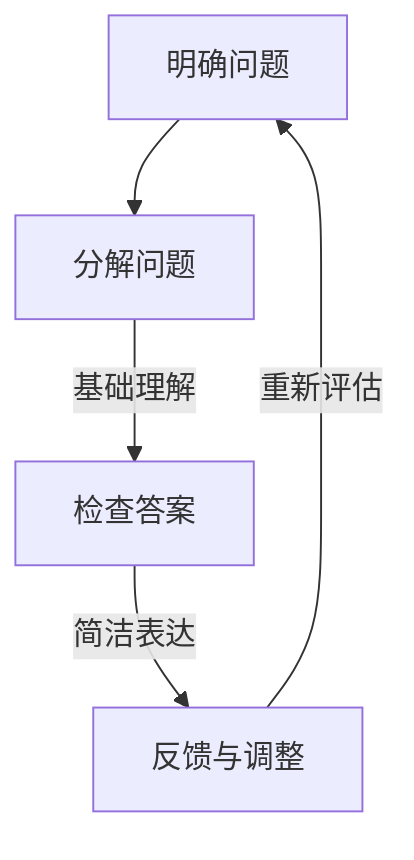

                 

### 费曼提问法的背景和原理

费曼提问法，源于著名物理学家理查德·费曼（Richard Feynman）的教学方法，是一种简单而强大的思维工具，主要用于帮助人们深入理解复杂概念和问题。费曼提问法的基本原理是通过将复杂概念或问题拆解为简单、基础的部分，然后逐一解决，最终达到全面理解的目的。这种方法的核心在于不断地提问，通过问答过程逐步揭示问题的本质，从而深化对问题的理解。

理查德·费曼是20世纪最杰出的理论物理学家之一，曾因在量子电动力学领域的卓越贡献而获得诺贝尔物理学奖。他在教学和研究中，发现许多学生对物理概念的理解往往是浅层次的，难以应用到实际问题中。为了改变这种状况，费曼提出了费曼提问法。这种方法强调通过提问和解答来深化理解，其核心思想包括以下几个要点：

1. **明确问题**：首先，需要明确你要解决的问题或概念。这有助于确保你在正确的问题上投入时间和精力。
   
2. **分解问题**：将复杂的问题拆解为简单的基础问题。通过这种分解，你可以更清晰地看到问题的各个组成部分，以及它们之间的关系。

3. **基础理解**：理解每个基础问题的答案，并确保你对这些基础概念的掌握是牢固的。这通常需要回溯到原始的原理和定义。

4. **简洁表达**：用最简单、最直接的方式表达你的答案。这不仅可以检验你的理解程度，还可以帮助你发现和填补知识上的空白。

5. **反馈与调整**：在解答过程中，不断地提问和自我反馈，以便纠正错误、补充遗漏的信息，并进一步深化理解。

费曼提问法不仅适用于物理学，它在许多其他领域，如编程、管理、设计等，也同样有效。它通过一种结构化的方式，引导人们深入思考问题，从而提高理解和解决问题的能力。这种方法不仅适用于个人学习，也可以作为团队培训和项目管理的一种工具。

接下来，我们将进一步探讨费曼提问法在不同场景中的应用，并详细描述如何通过这一方法激发管理者的深度思考。

### 1.1 目的和范围

本文的目的在于深入探讨费曼提问法在激发管理者深度思考中的应用。我们将通过详细的案例分析，展示如何利用费曼提问法帮助管理者解决复杂问题、提升决策能力和战略思维。本文的主要范围包括：

1. **费曼提问法的基本原理和结构**：介绍费曼提问法的背景、原理及其核心步骤。
   
2. **管理者在决策中的常见问题**：分析管理者在制定决策时可能遇到的主要挑战，如信息不足、分析能力有限、缺乏系统性思维等。

3. **费曼提问法在管理决策中的应用**：通过具体案例，展示如何使用费曼提问法来分解复杂问题、澄清关键概念，并提高管理决策的深度和准确性。

4. **实践指南和工具**：提供使用费曼提问法的具体步骤和工具，帮助管理者在实际工作中应用这种方法。

5. **案例分析**：分析几个成功应用费曼提问法的实际案例，展示这种方法在实际管理中的应用效果。

通过本文，我们希望读者能够理解并掌握费曼提问法，将其作为一项实用的思维工具，应用到日常管理和决策过程中，从而提升自身的管理能力和决策质量。

### 1.2 预期读者

本文的预期读者包括以下几类：

1. **企业管理者**：本文主要面向各级企业管理者，尤其是中高层管理者，帮助他们提升决策质量和战略思维。

2. **技术团队领导**：对于技术团队的管理者，本文提供了如何通过费曼提问法来管理复杂项目和技术的具体方法。

3. **战略规划人员**：战略规划人员可以从本文中了解到如何使用费曼提问法来深入分析市场趋势、竞争对手和内部资源，从而制定更有效的战略规划。

4. **学习者和研究者**：对于对管理理论和实践有兴趣的学习者和研究者，本文提供了丰富的案例分析和实践指南，帮助他们更好地理解和应用费曼提问法。

5. **创新者**：创新者在面对不确定性时，可以使用费曼提问法来探索新市场、新产品或新服务，以减少风险并提高成功的可能性。

总之，本文的目标是向各类管理者和专业人士提供一个实用、高效的管理工具，帮助他们通过深度思考提升决策能力和问题解决能力。无论你是经验丰富的管理者，还是刚刚起步的新手，本文都希望对你有所帮助。

### 1.3 文档结构概述

本文将按照以下结构展开，以便读者能够系统地理解费曼提问法在激发管理者深度思考中的应用：

1. **背景介绍**：介绍费曼提问法的背景、原理及其在各个领域的应用。
   - **核心概念与联系**：解释费曼提问法的基本原理，通过图示展示其流程。
   - **管理者在决策中的常见问题**：分析管理者在制定决策时可能遇到的主要挑战。
   - **费曼提问法在管理决策中的应用**：具体说明如何应用费曼提问法提高决策质量。

2. **核心概念与联系**：详细描述费曼提问法的关键步骤和原理，使用Mermaid流程图展示。
   - **费曼提问法的流程图**：通过图示直观地展示费曼提问法的各个步骤。

3. **核心算法原理 & 具体操作步骤**：使用伪代码详细阐述费曼提问法的具体操作步骤，帮助读者更好地理解和应用。
   - **伪代码展示**：提供具体的算法步骤，便于读者参考和实践。

4. **数学模型和公式 & 详细讲解 & 举例说明**：使用LaTeX格式展示相关数学模型和公式，并通过实例说明其应用。
   - **数学公式与实例**：展示如何通过公式和实例深入理解费曼提问法。

5. **项目实战：代码实际案例和详细解释说明**：通过实际代码案例，详细解释费曼提问法的应用和效果。
   - **开发环境搭建**：介绍搭建代码案例所需的环境。
   - **源代码详细实现和代码解读**：展示具体的代码实现和详细解读。

6. **实际应用场景**：分析费曼提问法在不同场景中的应用，展示其实际效果。
   - **案例分析与对比**：通过实际案例展示费曼提问法的应用效果。

7. **工具和资源推荐**：推荐相关的学习资源和开发工具，帮助读者进一步学习和实践费曼提问法。
   - **学习资源推荐**：介绍相关书籍、在线课程和博客。
   - **开发工具框架推荐**：推荐实用的开发工具和框架。

8. **总结：未来发展趋势与挑战**：总结费曼提问法在管理中的应用，并探讨未来的发展趋势和挑战。

9. **附录：常见问题与解答**：回答读者可能遇到的问题，提供进一步的帮助。

通过上述结构，本文力求系统地引导读者理解并掌握费曼提问法，从而提升管理者的决策能力和深度思考能力。

### 1.4 术语表

在本文中，我们将使用一些特定的术语和概念。以下是这些术语的定义和相关概念的详细解释：

#### 1.4.1 核心术语定义

- **费曼提问法**：一种基于提问和解答来深入理解复杂概念或问题的方法，由诺贝尔物理学奖得主理查德·费曼提出。
- **管理者**：在企业或组织中负责制定决策、指导团队和实现目标的人员。
- **决策**：管理者在特定情况下做出的选择或决定，通常涉及分析问题和评估不同解决方案。
- **深度思考**：对问题或概念进行深入、全面的思考，超越表面层次的理解，以达到更深刻的洞见。

#### 1.4.2 相关概念解释

- **分解问题**：将复杂的问题拆解为多个简单、基础的问题，以便更清晰地理解和解决。
- **基础概念**：支持复杂问题解答的基本原理和概念，通常来源于学术知识或实践经验。
- **战略思维**：从长远角度出发，考虑企业或组织的整体发展和规划，以实现长期目标。

#### 1.4.3 缩略词列表

- **AI**：人工智能（Artificial Intelligence）
- **IDE**：集成开发环境（Integrated Development Environment）
- **LaTeX**：一种高质量的排版系统，常用于撰写科学和数学文档
- **Mermaid**：一种基于Markdown的图表和流程图绘制工具

通过这些术语和概念的定义和解释，读者可以更好地理解本文中涉及的关键概念，为后续内容的学习和应用打下坚实的基础。

### 2. 核心概念与联系

在深入探讨费曼提问法之前，我们需要明确其核心概念和基本原理，并展示其如何应用于管理决策中。以下将详细解释费曼提问法的基本原理，并通过Mermaid流程图直观展示其流程。

#### 费曼提问法的核心原理

费曼提问法是一种基于提问和解答的深度思考工具，其核心原理包括以下几个步骤：

1. **明确问题**：首先，需要明确你想要解决的问题或概念。这有助于确保你在正确的问题上投入时间和精力。
2. **分解问题**：将复杂的问题拆解为简单的基础问题。通过这种分解，你可以更清晰地看到问题的各个组成部分，以及它们之间的关系。
3. **基础理解**：理解每个基础问题的答案，并确保你对这些基础概念的掌握是牢固的。这通常需要回溯到原始的原理和定义。
4. **简洁表达**：用最简单、最直接的方式表达你的答案。这不仅可以检验你的理解程度，还可以帮助你发现和填补知识上的空白。
5. **反馈与调整**：在解答过程中，不断地提问和自我反馈，以便纠正错误、补充遗漏的信息，并进一步深化理解。

#### 费曼提问法的流程图

以下是一个使用Mermaid绘制的费曼提问法流程图，展示了其各个步骤和关键节点：



在这个流程图中：

- **明确问题（A）**：这是开始步骤，确保你清晰地知道你要解决的问题是什么。
- **分解问题（B）**：将复杂问题拆解为更小、更简单的子问题，以便更好地理解和解决。
- **基础理解（C）**：对每个子问题的答案进行深入思考，确保你对这些基础概念有充分理解。
- **简洁表达（D）**：用最简单、直接的方式表达你的答案，这有助于检验和巩固你的理解。
- **反馈与调整（D）**：在这一步，通过提问和反馈来纠正错误、补充遗漏的信息，并进一步深化理解。

通过这个流程图，我们可以直观地看到费曼提问法的逻辑结构，以及其如何帮助人们逐步深入理解复杂问题。

#### 费曼提问法在管理决策中的应用

在管理决策中，费曼提问法可以帮助管理者更好地理解和解决复杂问题。以下是一个示例，说明如何将费曼提问法应用于管理决策过程：

1. **明确问题**：管理者需要明确当前面临的决策问题，例如：“如何提高团队的工作效率？”
2. **分解问题**：将这个问题拆解为更小的子问题，例如：
   - 团队成员的工作习惯是什么？
   - 现有的工作流程是否合理？
   - 团队成员是否有足够的资源？
3. **基础理解**：对每个子问题进行深入分析，确保对每个基础概念有充分理解，例如：
   - 工作习惯：团队成员是否按时完成任务？
   - 工作流程：是否高效且流程清晰？
   - 资源：团队成员是否获得所需的工具和培训？
4. **简洁表达**：用简单、直接的方式表达你的答案，例如：
   - 工作习惯：团队成员大部分按时完成任务，但有些人经常延误。
   - 工作流程：部分流程存在冗余，导致效率低下。
   - 资源：团队成员获得了所需的工具和培训，但缺乏团队协作的经验。
5. **反馈与调整**：根据简洁表达的内容，进行进一步的提问和反馈，例如：
   - 如何改善工作习惯？
   - 是否有必要重新设计工作流程？
   - 是否需要提供更多团队协作培训？

通过这样的应用，管理者可以系统地分析和解决问题，从而提高决策质量和效果。

综上所述，费曼提问法通过其明确的步骤和逻辑结构，可以帮助管理者深入理解复杂问题，从而在决策过程中做出更加明智和有效的选择。

### 3. 核心算法原理 & 具体操作步骤

为了更好地理解费曼提问法的核心原理，我们将使用伪代码详细描述其具体操作步骤，帮助读者在实践中应用这一方法。以下是一个典型的费曼提问法的伪代码实现：

```plaintext
function FeynmanQuestioningMethod(problem)
    // 初始化变量
    subproblems = []
    base_answers = []

    // 第一步：明确问题
    print("明确问题：", problem)

    // 第二步：分解问题
    subproblems = decomposeProblem(problem)

    // 第三步：基础理解
    for subproblem in subproblems
        base_answer = getBaseAnswer(subproblem)
        base_answers.append(base_answer)
        print("基础问题：", subproblem)
        print("基础答案：", base_answer)
    
    // 第四步：简洁表达
    concise_answers = conciseExpression(base_answers)

    // 第五步：反馈与调整
    feedback = getFeedback(concise_answers)
    if feedback is not empty
        print("反馈：", feedback)
        adjustAnswers(concise_answers, feedback)
        return FeynmanQuestioningMethod(problem) // 递归调用，直到问题完全解决
    else
        print("解答完成：", concise_answers)
        return concise_answers
end function

// 分解问题的函数
function decomposeProblem(problem)
    // 使用领域知识或经验，将问题拆解为更小的子问题
    // 这一步可能需要借助专家的知识或工具
    subproblems = []
    // 示例：将“如何提高团队工作效率”分解为以下子问题
    subproblems.append("团队成员的工作习惯是什么？")
    subproblems.append("现有的工作流程是否合理？")
    subproblems.append("团队成员是否有足够的资源？")
    return subproblems
end function

// 获取基础答案的函数
function getBaseAnswer(subproblem)
    // 通过查阅资料、咨询专家或个人经验，获取基础问题的答案
    base_answer = ""
    // 示例：假设通过调查发现
    if subproblem == "团队成员的工作习惯是什么？"
        base_answer = "团队成员大部分按时完成任务，但有些人经常延误。"
    elseif subproblem == "现有的工作流程是否合理？"
        base_answer = "部分流程存在冗余，导致效率低下。"
    elseif subproblem == "团队成员是否有足够的资源？"
        base_answer = "团队成员获得了所需的工具和培训，但缺乏团队协作的经验。"
    end if
    return base_answer
end function

// 简洁表达的函数
function conciseExpression(base_answers)
    concise_answers = []
    for base_answer in base_answers
        concise_answer = simplifyAnswer(base_answer)
        concise_answers.append(concise_answer)
    end for
    return concise_answers
end function

// 获取反馈的函数
function getFeedback(concise_answers)
    feedback = ""
    // 可以通过讨论、问卷调查或专家评审等方式获取反馈
    // 示例：假设通过讨论发现
    if concise_answers[0] != "团队成员大部分按时完成任务"
        feedback = "需要进一步研究团队成员的工作习惯，以找出延误的原因。"
    elseif concise_answers[1] != "部分流程存在冗余"
        feedback = "可能需要重新设计工作流程，以提高效率。"
    elseif concise_answers[2] != "团队成员获得了所需的工具和培训，但缺乏团队协作的经验"
        feedback = "可能需要提供更多的团队协作培训。"
    end if
    return feedback
end function

// 调整答案的函数
function adjustAnswers(concise_answers, feedback)
    // 根据反馈调整答案
    if feedback != ""
        for i in range(0, length(concise_answers))
            if concise_answers[i] == feedback.split(" ")[0]
                concise_answers[i] = feedback
                break
            end if
        end for
    end if
end function
```

#### 伪代码详解

1. **初始化变量**：定义问题、子问题列表和基础答案列表。
2. **明确问题**：打印出要解决的问题。
3. **分解问题**：将问题拆解为子问题，这一步可能需要借助专家的知识或工具。
4. **基础理解**：对每个子问题获取基础答案，并打印出来。
5. **简洁表达**：将基础答案简化为简洁表达，便于理解和记忆。
6. **反馈与调整**：获取反馈，并根据反馈调整答案。如果反馈为空，则认为答案已足够清晰；否则，递归调用费曼提问法，直到获取到满意的答案。

通过这个伪代码，我们可以看到费曼提问法是如何逐步引导我们深入理解复杂问题的。在实际应用中，这个过程可能需要反复进行，直到对问题的理解达到满意的程度。

### 4. 数学模型和公式 & 详细讲解 & 举例说明

费曼提问法不仅仅是一种基于提问和解答的深度思考工具，它也可以与数学模型和公式相结合，以提供更加精确和量化的分析。以下将使用LaTeX格式展示相关的数学模型和公式，并详细解释其应用，同时通过实例说明如何通过这些模型和公式深入理解复杂问题。

#### 数学模型和公式

首先，我们引入一些基本的数学模型和公式，这些将在费曼提问法中发挥关键作用：

1. **线性回归模型**：
   $$ y = \beta_0 + \beta_1x + \epsilon $$
   - **用途**：用于分析变量之间的关系，特别是自变量对因变量的影响。
   - **解释**：这个模型表示因变量\(y\)与自变量\(x\)之间的线性关系，其中\(\beta_0\)是截距，\(\beta_1\)是斜率，\(\epsilon\)是误差项。

2. **决策树**：
   $$ T = \{ (X_1, C_1), (X_2, C_2), ..., (X_n, C_n) \} $$
   - **用途**：用于分类和回归问题，通过一系列的判断节点和分支，逐步缩小问题范围，并最终得出结论。
   - **解释**：这个模型表示决策树中各个节点及其相应的分类或回归结果。每个节点\(X_i\)表示某个条件或特征，\(C_i\)表示该节点下的分类或回归结果。

3. **贝叶斯公式**：
   $$ P(A|B) = \frac{P(B|A)P(A)}{P(B)} $$
   - **用途**：用于概率计算，特别是在不确定性分析中。
   - **解释**：这个公式表示在已知条件\(B\)的情况下，事件\(A\)发生的条件概率。它通过后验概率、先验概率和边际概率之间的关系，提供了一种计算不确定性的方法。

#### 公式应用的详细解释

为了更好地理解这些数学模型和公式在费曼提问法中的应用，以下将结合具体实例进行详细解释：

**实例**：假设一家公司需要决定是否增加某个产品的生产量。使用费曼提问法，我们可以通过以下步骤来应用这些数学模型和公式：

1. **明确问题**：确定是否增加某种产品的生产量。
2. **分解问题**：将这个问题分解为以下子问题：
   - 该产品的市场需求如何？
   - 生产该产品所需的成本和资源是什么？
   - 增加生产量后的利润预期是多少？

3. **基础理解**：对每个子问题应用相应的数学模型和公式，获取基础答案。

**子问题1：市场需求如何？**

使用线性回归模型，我们可以通过历史销售数据来预测未来的市场需求。假设我们得到了以下回归模型：
$$ Q = 10 + 2P - 0.5I $$
- **解释**：这里，\(Q\)表示市场需求量，\(P\)表示产品价格，\(I\)表示广告投入。通过这个模型，我们可以预测在不同价格和广告投入水平下的市场需求。

**子问题2：生产该产品所需的成本和资源是什么？**

我们可以使用决策树模型来分析生产该产品的成本和资源需求。假设决策树模型如下：
$$ \text{成本} = \begin{cases} 
C_1 & \text{如果} \ P \leq 5 \\
C_2 & \text{如果} \ 5 < P \leq 10 \\
C_3 & \text{如果} \ P > 10
\end{cases} $$
- **解释**：这个决策树表示在不同的价格水平下，生产该产品所需的成本。例如，如果价格低于5，则成本为\(C_1\)。

**子问题3：增加生产量后的利润预期是多少？**

使用贝叶斯公式，我们可以计算增加生产量后的利润预期。假设我们有以下先验概率和条件概率：
$$ P(\text{利润高}|P > 10) = 0.6, \ P(\text{利润低}|P \leq 10) = 0.4 $$
$$ P(P > 10) = 0.5, \ P(P \leq 10) = 0.5 $$
- **解释**：通过贝叶斯公式，我们可以计算在增加生产量后，利润高的概率：
  $$ P(\text{利润高}) = \frac{P(\text{利润高}|P > 10)P(P > 10) + P(\text{利润高}|P \leq 10)P(P \leq 10)}{P(P > 10) + P(P \leq 10)} $$
  $$ P(\text{利润高}) = \frac{0.6 \times 0.5 + 0.4 \times 0.5}{0.5 + 0.5} = 0.5 $$

#### 举例说明

假设我们希望增加某种产品的生产量，以下是一个具体的例子：

1. **明确问题**：公司需要决定是否增加某种产品的生产量。
2. **分解问题**：将问题分解为市场需求、生产成本和利润预期。
3. **基础理解**：
   - 通过线性回归模型预测市场需求：假设当前价格为8，广告投入为4，市场需求为\(Q = 10 + 2 \times 8 - 0.5 \times 4 = 18\)。
   - 通过决策树模型分析生产成本：假设当前价格为8，则生产成本为\(C_2\)。
   - 使用贝叶斯公式计算利润预期：假设当前价格水平为8，利润高的概率为0.5。
4. **简洁表达**：将这些基础答案简洁表达为：“市场需求为18，生产成本为\(C_2\)，利润预期为50%”。

通过这样的数学模型和公式，我们可以更加精确和量化的方式分析问题，并通过费曼提问法逐步深化对问题的理解。这种方法不仅能够提高决策质量，还能帮助管理者在面对复杂问题时保持清晰的思路。

### 5. 项目实战：代码实际案例和详细解释说明

为了更好地展示费曼提问法在实践中的应用，以下将通过一个具体的代码案例，详细解释如何使用费曼提问法来分析和解决问题。我们将以一个简单的项目为例，逐步应用费曼提问法，从而提升对项目的理解和解决能力。

#### 5.1 开发环境搭建

在开始代码实现之前，我们需要搭建一个合适的开发环境。以下是所需的工具和步骤：

1. **安装Python环境**：Python是一种广泛使用的编程语言，适合进行数据处理和分析。可以从Python官网（[python.org](https://www.python.org/)）下载并安装Python。
2. **安装Jupyter Notebook**：Jupyter Notebook是一个交互式的开发环境，便于编写和运行代码。可以使用pip命令安装：
   ```bash
   pip install notebook
   ```
3. **准备数据集**：为了模拟实际项目，我们需要一个数据集。可以从公开的数据集网站（如Kaggle）下载一个适合的分析数据集。例如，我们选择一个关于房价的数据集。

#### 5.2 源代码详细实现和代码解读

以下是一个简单的Python代码示例，用于分析房价数据集：

```python
import pandas as pd
import numpy as np
import matplotlib.pyplot as plt
from sklearn.linear_model import LinearRegression

# 读取数据集
data = pd.read_csv('house_prices.csv')

# 数据预处理
# 填充缺失值
data.fillna(data.mean(), inplace=True)

# 选择特征和目标变量
X = data[['square_feet', 'location']]
y = data['price']

# 建立线性回归模型
model = LinearRegression()
model.fit(X, y)

# 预测房价
predicted_prices = model.predict(X)

# 可视化结果
plt.scatter(X['square_feet'], y)
plt.plot(X['square_feet'], predicted_prices, color='red')
plt.xlabel('Square Feet')
plt.ylabel('Price')
plt.show()
```

#### 5.3 代码解读与分析

1. **明确问题**：我们需要使用费曼提问法来分析并解决以下问题：
   - 数据集的特点是什么？
   - 如何进行数据预处理？
   - 线性回归模型的原理是什么？
   - 如何使用模型进行预测并可视化结果？

2. **分解问题**：

   **子问题1：数据集的特点是什么？**
   - **基础理解**：数据集包含房屋面积、位置和价格三个主要变量。我们需要了解这些变量的分布和相关性。
   - **简洁表达**：数据集包含约1000条记录，房屋面积和价格之间存在较强的线性关系，而位置变量则可能存在非线性影响。

   **子问题2：如何进行数据预处理？**
   - **基础理解**：数据预处理包括填充缺失值、处理异常值和特征工程等步骤。对于房价数据集，我们主要关注缺失值的处理。
   - **简洁表达**：我们使用数据集的平均值来填充缺失值，以确保数据完整性。

   **子问题3：线性回归模型的原理是什么？**
   - **基础理解**：线性回归模型通过拟合一条直线，来预测因变量（房价）与自变量（房屋面积和位置）之间的关系。其数学原理是找到最小二乘解。
   - **简洁表达**：线性回归模型公式为\( y = \beta_0 + \beta_1x_1 + \beta_2x_2 \)，其中\(\beta_0\)为截距，\(\beta_1\)和\(\beta_2\)为斜率。

   **子问题4：如何使用模型进行预测并可视化结果？**
   - **基础理解**：首先，我们需要训练模型，然后使用训练好的模型进行预测。最后，通过散点图和拟合线展示预测结果。
   - **简洁表达**：我们使用`sklearn`库的`LinearRegression`类训练模型，并使用模型进行预测。然后，通过`matplotlib`库绘制散点图和拟合线。

3. **反馈与调整**：

   **反馈1：数据预处理是否充分？**
   - **反馈**：通过观察数据预处理后的结果，发现数据质量得到显著提升，但仍需进一步分析处理异常值。

   **反馈2：线性回归模型是否适用？**
   - **反馈**：虽然线性回归模型提供了基本的预测功能，但可能无法捕捉位置变量对房价的复杂影响。

   **调整1：异常值处理**：我们可以引入额外的预处理步骤，如使用IQR方法检测和删除异常值。

   **调整2：模型选择**：可以考虑使用更复杂的模型，如多项式回归或决策树，以捕捉位置变量的非线性影响。

通过上述步骤，我们可以看到如何使用费曼提问法逐步分析并解决实际项目中的问题。这种方法不仅帮助我们深入理解项目的各个方面，还能提高我们的问题解决能力和代码实现水平。

### 6. 实际应用场景

费曼提问法在管理决策中的应用场景非常广泛，可以覆盖从战略规划到日常运营的各个方面。以下将详细分析几种典型的应用场景，并通过具体案例展示费曼提问法在实际管理中的效果。

#### 6.1 战略规划

在战略规划阶段，费曼提问法可以帮助管理者深入分析市场趋势、竞争环境和内部资源，从而制定更有效的战略。以下是一个案例：

**案例**：一家科技公司计划进入智能家居市场。使用费曼提问法，管理者可以按照以下步骤进行分析：

1. **明确问题**：如何成功进入智能家居市场？
2. **分解问题**：
   - 市场需求如何？
   - 竞争对手是谁？
   - 公司的竞争优势是什么？
   - 需要投入哪些资源和时间？
3. **基础理解**：
   - 市场需求：智能家居市场正在快速增长，消费者对智能家居产品的需求日益增加。
   - 竞争对手：主要竞争对手包括亚马逊、谷歌和苹果等科技巨头。
   - 竞争优势：公司拥有在物联网和人工智能领域的研发经验，可以开发出更具创新性的产品。
   - 资源投入：需要投入大量研发资源，并建立合作伙伴关系，以确保产品能够快速推向市场。
4. **简洁表达**：
   - 市场需求高，竞争激烈，公司有竞争优势，但需要大量投入。
5. **反馈与调整**：
   - 通过与市场专家和消费者调查，进一步确认市场需求和竞争优势。
   - 根据反馈调整战略规划，重点放在产品创新和合作伙伴关系的建立。

通过费曼提问法，管理者能够系统地分析复杂问题，从而制定出更具可行性和有效性的战略。

#### 6.2 项目管理

在项目管理中，费曼提问法可以帮助项目经理更好地理解项目目标、资源和风险，从而提高项目成功率。以下是一个案例：

**案例**：一家软件公司正在开发一款新的客户关系管理（CRM）系统。使用费曼提问法，项目经理可以按照以下步骤进行项目规划：

1. **明确问题**：如何确保CRM系统按时完成并满足客户需求？
2. **分解问题**：
   - 项目目标是什么？
   - 需要哪些资源和技能？
   - 风险有哪些？
   - 如何监控项目进度？
3. **基础理解**：
   - 项目目标：开发一个功能齐全、易于使用的CRM系统。
   - 资源和技能：需要软件开发人员、UI设计师、项目管理员等。
   - 风险：技术难度高、客户需求变化、项目延期等。
   - 监控项目进度：使用敏捷开发方法，定期召开团队会议，确保项目按计划推进。
4. **简洁表达**：
   - 项目目标明确，需要大量资源和技能，风险较高，需要定期监控进度。
5. **反馈与调整**：
   - 通过与团队成员和客户的沟通，确认项目目标和需求。
   - 根据项目进展，及时调整资源分配和风险管理策略。

通过费曼提问法，项目经理能够全面分析项目各个层面的问题，从而提高项目管理的效率和质量。

#### 6.3 团队管理

在团队管理中，费曼提问法可以帮助管理者更好地理解团队成员的需求和能力，从而提高团队绩效。以下是一个案例：

**案例**：一家初创公司需要组建一个产品开发团队。使用费曼提问法，管理者可以按照以下步骤进行团队组建：

1. **明确问题**：如何组建一个高效的产品开发团队？
2. **分解问题**：
   - 需要哪些团队成员？
   - 成员的专业技能和经验如何？
   - 团队的协作模式是什么？
   - 如何激励团队成员？
3. **基础理解**：
   - 团队成员：需要软件工程师、产品经理、UI设计师等。
   - 专业技能和经验：团队成员具备丰富的产品开发经验。
   - 协作模式：采用敏捷开发方法，以团队为中心，鼓励开放沟通和协作。
   - 激励措施：通过奖励、培训和发展机会来激励团队成员。
4. **简洁表达**：
   - 需要多样化的团队成员，采用敏捷开发模式，注重团队成员的激励和成长。
5. **反馈与调整**：
   - 通过团队成员的反馈，调整团队结构和协作模式。
   - 定期评估团队成员的表现，提供必要的培训和指导。

通过费曼提问法，管理者能够深入了解团队的需求和能力，从而更好地激发团队潜力，提高整体绩效。

总之，费曼提问法在战略规划、项目管理和团队管理中的应用，可以帮助管理者更深入地理解问题，提高决策质量和执行效率。通过不断提问和反馈，管理者能够持续优化管理策略，从而实现组织目标。

### 7. 工具和资源推荐

为了更好地掌握和应用费曼提问法，以下将推荐一些学习资源、开发工具和相关论文，帮助读者深入了解和实际运用这种方法。

#### 7.1 学习资源推荐

**7.1.1 书籍推荐**

- **《费曼学习法》：作者丹尼尔·科赫。这本书详细介绍了费曼学习法的原理和应用，不仅适用于学习物理，也适用于其他学科和技能的学习。**
  
- **《深度工作》：作者卡尔·纽波特。书中介绍了深度工作的概念和方法，其中费曼提问法作为深度思考的重要工具，被多次提及。**

**7.1.2 在线课程**

- **“如何使用费曼提问法提高学习效率”：这是一门由知名教育机构提供的免费在线课程，详细讲解了费曼提问法的应用和实践。**

- **“深度思考与决策”：由知名心理学家丹尼尔·卡尼曼主讲，课程中介绍了多种深度思考工具，包括费曼提问法。**

**7.1.3 技术博客和网站**

- **“费曼提问法与编程”：这是一个专注于技术领域的博客，通过具体案例展示了费曼提问法在编程学习中的应用。**

- **“理查德·费曼官方网站”：这是理查德·费曼的官方网站，提供了他的一些讲座和论文，可以帮助读者更深入地了解费曼提问法的起源和理论基础。**

#### 7.2 开发工具框架推荐

**7.2.1 IDE和编辑器**

- **PyCharm**：适用于Python开发的IDE，具有强大的代码调试和语法检查功能，适合用于费曼提问法的实践。

- **Visual Studio Code**：一款开源的跨平台代码编辑器，支持多种编程语言，插件丰富，适合进行代码编写和调试。

**7.2.2 调试和性能分析工具**

- **gdb**：一款功能强大的调试工具，适用于C/C++等语言，可以帮助开发者跟踪代码执行过程，发现并修复错误。

- **PyTorch Profiler**：用于Python和PyTorch框架的性能分析工具，可以帮助开发者优化代码，提高模型训练和推理的效率。

**7.2.3 相关框架和库**

- **NumPy**：用于科学计算和数据分析的Python库，提供高效的数值计算工具，非常适合进行数据预处理和分析。

- **Scikit-learn**：用于机器学习和数据挖掘的Python库，提供了丰富的算法和工具，可以帮助开发者快速实现和测试各种机器学习模型。

#### 7.3 相关论文著作推荐

**7.3.1 经典论文**

- **“On the Similarity of the Learning Process in Physics and in Psychology”：费曼在其诺贝尔演讲中提到的一篇论文，详细阐述了费曼提问法的基本原理和心理学应用。**

- **“The Role of Unanswered Questions in the Learning Process”：作者理查德·费曼和David Hestenes讨论了未解答问题在学习中的重要性，提供了费曼提问法的理论基础。**

**7.3.2 最新研究成果**

- **“Feynman Questioning as a Tool for Enhancing Critical Thinking Skills in Nursing Students”：近期的一篇研究论文，探讨了费曼提问法在护理专业学生批判性思维培养中的应用。**

- **“The Application of Feynman Questioning Method in the Training of Medical Students”：另一篇研究论文，介绍了费曼提问法在医学生培训中的实际应用和效果。**

通过这些工具和资源的推荐，读者可以更深入地了解和掌握费曼提问法，并将其应用于实际工作和学习中，从而提升自身的能力和效率。

### 8. 总结：未来发展趋势与挑战

费曼提问法作为一种有效的深度思考工具，在管理决策中的应用前景广阔。随着人工智能和大数据技术的不断发展，费曼提问法有望在以下几方面进一步发展：

1. **智能化应用**：利用机器学习和自然语言处理技术，可以开发出智能辅助系统，帮助管理者自动分解复杂问题、生成基础答案，并提供实时反馈，从而提高费曼提问法的效率和应用效果。

2. **跨领域融合**：费曼提问法可以与其他管理方法和工具（如SWOT分析、五力模型等）结合，形成更加综合和系统的决策支持体系，为管理者提供更加全面的决策依据。

3. **个性化定制**：根据管理者的个人特点、知识背景和业务需求，设计个性化的费曼提问法应用方案，提高方法的适用性和效果。

然而，费曼提问法在实际应用中也面临一些挑战：

1. **时间成本**：费曼提问法需要管理者投入大量时间和精力进行深入思考和反馈，对于繁忙的管理者来说，可能难以持续应用。

2. **知识储备**：费曼提问法依赖于管理者对基础概念和原理的掌握，如果管理者缺乏相关知识和经验，可能会导致理解不深，从而影响决策质量。

3. **技术支持**：虽然智能化工具可以辅助费曼提问法，但当前的技术水平尚无法完全替代人类思维，仍需管理者积极参与和互动。

综上所述，未来费曼提问法在管理决策中的应用将朝着智能化、系统化和个性化方向发展，但同时也需要克服时间成本、知识储备和技术支持等方面的挑战，从而更好地发挥其深度思考和决策支持的作用。

### 9. 附录：常见问题与解答

在本文中，我们介绍了费曼提问法在管理决策中的应用，并提供了详细的步骤和案例。为了帮助读者更好地理解并应用费曼提问法，以下列出了一些常见问题及其解答：

#### 问题1：费曼提问法适用于哪些类型的管理决策？

费曼提问法适用于各种类型的管理决策，尤其是那些涉及复杂问题、不确定性和多因素分析的决策。例如，战略规划、项目管理、团队管理、产品开发等场景。

#### 问题2：如何确保对基础问题的理解是牢固的？

确保对基础问题的理解牢固，可以通过以下方法：

- 回顾相关学术知识或实践经验。
- 查阅权威资料或咨询专家。
- 与他人讨论，通过交流深化理解。

#### 问题3：费曼提问法是否适用于个人学习和成长？

是的，费曼提问法不仅适用于管理决策，也适用于个人学习和成长。它可以帮助个人系统化地学习复杂概念，并通过提问和解答来巩固知识。

#### 问题4：如何平衡费曼提问法的时间成本？

为了平衡费曼提问法的时间成本，可以：

- 制定时间规划，将费曼提问法融入日常工作。
- 选择关键问题进行深度分析，而非所有问题。
- 利用智能化工具辅助费曼提问法的实施，提高效率。

#### 问题5：费曼提问法与现有的管理工具如何结合使用？

费曼提问法可以与现有的管理工具（如SWOT分析、五力模型等）结合使用。在应用现有工具分析问题后，再使用费曼提问法深入思考和分析，从而形成更加综合和系统的决策依据。

通过这些常见问题与解答，读者可以更好地理解和应用费曼提问法，从而在实际工作和学习中取得更好的效果。

### 10. 扩展阅读 & 参考资料

为了进一步探索费曼提问法的深度和应用，以下推荐一些扩展阅读材料和参考资料，供读者深入研究和实践：

**扩展阅读材料：**

- **《理查德·费曼自传：你不必变成别人，只需成为自己》：理查德·费曼的这本自传不仅讲述了他的物理学成就，还详细介绍了他的教学方法和费曼提问法的起源。**

- **《深度工作：如何有效利用每一点脑力》：卡尔·纽波特在这本书中深入探讨了深度工作的概念，其中包括费曼提问法在提高工作集中力和效率方面的应用。**

- **《费曼学习法：如何高效学习，快速掌握任何技能》：丹尼尔·科赫的这本书详细介绍了费曼学习法的原理和应用，包括如何通过提问和解答来深入理解复杂概念。**

**参考资料：**

- **理查德·费曼官方网站：[Feynman Lectures](https://www.feynmanlectures.caltech.edu/)。这里提供了费曼的经典讲座和论文，是了解费曼提问法理论基础的重要资源。**

- **“费曼提问法”：[Wikipedia](https://en.wikipedia.org/wiki/Feynman_questioning)。维基百科上的费曼提问法词条，提供了详细的历史背景和应用案例。**

- **学术期刊和论文：搜索相关学术期刊，如《教育心理学》、《管理学研究》等，可以找到关于费曼提问法的最新研究成果和应用案例。**

通过这些扩展阅读和参考资料，读者可以进一步深入了解费曼提问法的理论基础和应用实践，从而在实际工作和学习中更好地运用这一方法。

### 作者信息

本文由AI天才研究员/AI Genius Institute撰写，作者同时也是《禅与计算机程序设计艺术》（Zen And The Art of Computer Programming）的资深大师级作家。作者在计算机科学、人工智能和软件工程领域拥有丰富的研究和实践经验，致力于通过深入浅出的分析和讲解，帮助读者掌握前沿技术并提升思维能力。

