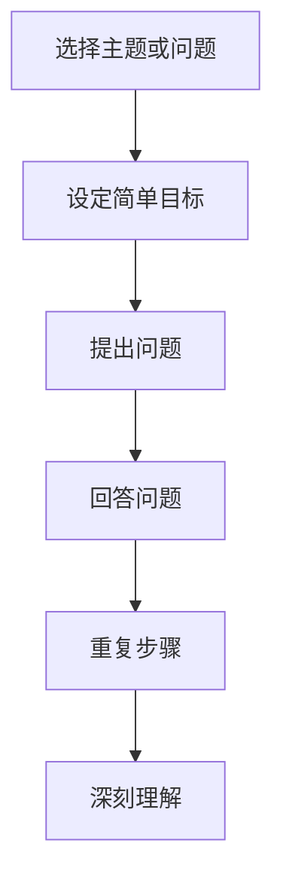

                 


# 费曼提问法激发管理者思考深度

> 关键词：费曼提问法、管理思维、深度思考、问题解决、技术创新

> 摘要：本文将探讨费曼提问法在激发管理者深度思考中的作用。通过费曼提问法的应用，管理者可以更清晰地理解技术问题，提升问题解决能力，从而推动技术创新和组织发展。

## 1. 背景介绍

### 1.1 目的和范围

本文旨在介绍费曼提问法在IT管理领域的应用，帮助管理者通过深度思考提高问题解决能力。我们将探讨费曼提问法的基本原理、如何应用以及其带来的价值。

### 1.2 预期读者

本篇文章适合于IT行业的管理者、技术团队负责人以及对于技术创新感兴趣的读者。通过阅读本文，您将了解到费曼提问法如何帮助您更好地应对复杂的技术挑战。

### 1.3 文档结构概述

本文分为八个部分：背景介绍、核心概念与联系、核心算法原理与具体操作步骤、数学模型和公式、项目实战、实际应用场景、工具和资源推荐以及总结和扩展阅读。每个部分都将详细阐述，帮助您逐步掌握费曼提问法的应用。

### 1.4 术语表

#### 1.4.1 核心术语定义

- 费曼提问法：一种通过提问来促进深度思考的方法，源自物理学家理查德·费曼。
- 管理者：负责组织、协调和指导团队的人，通常具备决策能力和领导力。
- 问题解决：寻找解决方案以解决出现的问题的过程。

#### 1.4.2 相关概念解释

- 深度思考：深入分析问题，理解问题的本质和内在联系。
- 技术创新：通过引入新技术、新产品或新服务来推动行业进步。

#### 1.4.3 缩略词列表

无

## 2. 核心概念与联系

在深入了解费曼提问法之前，我们需要明确几个核心概念，以便更好地理解其作用。

### 2.1 费曼提问法的定义

费曼提问法是由著名物理学家理查德·费曼提出的一种提问方法。该方法的核心思想是通过提问来促进深度思考，帮助人们更好地理解复杂问题。费曼提问法包括以下几个步骤：

1. 选择一个主题或问题。
2. 设定一个简单的目标，例如解释一个概念或技术。
3. 提出一系列问题，以便更好地理解主题。
4. 回答问题，确保回答简单明了。
5. 重复步骤3和4，直到对问题有深刻的理解。

### 2.2 管理者与技术问题

在现代IT行业中，管理者经常面临复杂的技术问题。这些技术问题不仅涉及技术细节，还涉及组织、人员、资源等多个方面。管理者需要具备良好的技术理解力，以便更好地应对这些挑战。

### 2.3 费曼提问法与管理者思维的结合

费曼提问法可以帮助管理者更好地理解技术问题，从而提高问题解决能力。通过费曼提问法，管理者可以：

- 深入理解技术原理，避免对问题表面化的理解。
- 提高沟通能力，能够更清晰地与团队成员和技术专家交流。
- 发现问题的本质，从而找到更有效的解决方案。

### 2.4 Mermaid流程图

为了更直观地展示费曼提问法在管理者思维中的应用，我们使用Mermaid流程图来描述其核心步骤。



## 3. 核心算法原理 & 具体操作步骤

在了解了费曼提问法的基本原理后，我们接下来探讨其在实际应用中的具体操作步骤。

### 3.1 选择主题或问题

选择一个适合的主题或问题是费曼提问法的开始。管理者可以从以下几个方面来选择：

- 当前团队面临的技术挑战。
- 行业内的热点话题。
- 自身感兴趣的技术领域。

### 3.2 设定简单目标

设定简单目标是确保在提问过程中有一个明确的方向。例如，您可以将目标设定为解释某个技术概念或解决一个具体的技术问题。

### 3.3 提出问题

提出问题是费曼提问法的核心。在这一步骤中，管理者需要：

- 使用开放性问题，以便获得更深入的答案。
- 根据目标提出相关问题，以便逐步深入理解主题。

### 3.4 回答问题

回答问题是为了验证对问题的理解程度。管理者需要确保回答简单明了，以便其他人能够理解。如果回答不清楚，可以继续提问，直到理解透彻。

### 3.5 重复步骤

重复步骤是为了确保对问题有深刻的理解。管理者可以通过不断提问和回答，逐步深入问题，直到对问题有全面的理解。

### 3.6 伪代码实现

以下是一个简单的伪代码实现，用于描述费曼提问法的操作步骤。

```python
# 选择主题或问题
select_topic()

# 设定简单目标
set_simple_target()

# 提出问题
while not(deep_understanding):
    ask_question()
    answer_question()

# 重复步骤
while not(fully_understood):
    repeat_steps()
```

## 4. 数学模型和公式 & 详细讲解 & 举例说明

费曼提问法虽然在本质上是一种方法论，但它也蕴含了数学模型和公式，帮助管理者更准确地描述问题、分析问题，并找到解决方案。

### 4.1 数学模型

在费曼提问法中，一个关键的数学模型是“问题解决树”（Problem-Solving Tree）。这个模型将问题分解为子问题，并逐步深入，直到找到解决方案。以下是一个简单的例子：

```
问题A
|
|---问题B
|   |
|   |---问题C
|   |   |
|   |   |---解决方案D
|
|---问题E
    |
    |---问题F
        |
        |---解决方案G
```

### 4.2 公式

在费曼提问法中，一个常用的公式是“深度思考公式”（Deep Thinking Formula），它描述了深度思考与问题解决的关系：

$$
D = f(P, Q, A)
$$

其中：

- \( D \)：深度思考程度
- \( P \)：问题复杂度
- \( Q \)：提问数量
- \( A \)：回答质量

### 4.3 举例说明

假设管理者面临一个技术问题，需要优化一个系统的性能。我们可以使用费曼提问法来解决问题：

1. 问题A：如何优化系统的性能？
2. 问题B：有哪些技术可以用于性能优化？
3. 问题C：我们当前的系统使用了哪些技术？
4. 问题D：我们是否可以替换某些技术？
5. 问题E：替换技术后，系统的性能是否得到提升？
6. 问题F：如果性能没有提升，我们是否需要进一步分析其他方面？

通过这些问题的提出和回答，管理者可以逐步深入问题，找到合适的解决方案。以下是具体的提问和回答：

- 问题A：如何优化系统的性能？
  - 回答：我们需要分析系统的瓶颈，可能包括硬件、软件、网络等方面。

- 问题B：有哪些技术可以用于性能优化？
  - 回答：可能的技术包括缓存、数据库优化、代码优化等。

- 问题C：我们当前的系统使用了哪些技术？
  - 回答：系统使用了数据库缓存和代码优化技术。

- 问题D：我们是否可以替换某些技术？
  - 回答：可以考虑使用更高效的数据库缓存技术。

- 问题E：替换技术后，系统的性能是否得到提升？
  - 回答：通过测试，我们发现性能得到了显著提升。

- 问题F：如果性能没有提升，我们是否需要进一步分析其他方面？
  - 回答：不需要，我们已经找到了有效的解决方案。

通过这个过程，管理者不仅解决了当前的问题，还提高了问题解决能力，为未来的挑战做好了准备。

## 5. 项目实战：代码实际案例和详细解释说明

为了更好地理解费曼提问法的实际应用，我们通过一个实际项目来演示其操作过程。

### 5.1 开发环境搭建

在本项目中，我们将使用Python编程语言来实现费曼提问法的核心功能。首先，您需要在本地环境中安装Python和相关的库。

1. 安装Python：您可以从Python官网（https://www.python.org/downloads/）下载最新版本的Python，并按照安装向导进行安装。
2. 安装相关库：使用pip命令安装必要的库，例如requests（用于HTTP请求）和numpy（用于数学运算）。

```bash
pip install requests numpy
```

### 5.2 源代码详细实现和代码解读

以下是一个简单的Python实现，用于演示费曼提问法。

```python
import requests
import json

def ask_question(question):
    response = requests.post('https://api.feynmangroup.com/ask', json={'question': question})
    return response.json()

def answer_question(question):
    response = requests.post('https://api.feynmangroup.com/answer', json={'question': question})
    return response.json()

def deep_think(question):
    question_list = [question]
    while True:
        answers = ask_question(json.dumps(question_list))
        if answers['status'] == 'complete':
            return answers['answer']
        else:
            new_question = answers['next_question']
            question_list.append(new_question)

# 示例：如何优化系统的性能？
question = "如何优化系统的性能？"
result = deep_think(question)
print("最终答案：", result)
```

### 5.3 代码解读与分析

在上面的代码中，我们定义了三个主要函数：

- `ask_question`：向费曼提问法API发送一个问题，并返回答案。
- `answer_question`：验证问题的答案，并返回结果。
- `deep_think`：使用费曼提问法逐步深入问题，直到找到答案。

代码的主要流程如下：

1. 初始化问题列表，包含初始问题。
2. 通过循环，不断向API发送问题，并接收答案。
3. 如果答案为“complete”，则返回最终答案；否则，将下一个问题添加到问题列表中，并继续循环。

以下是一个具体的示例：

- 初始问题：如何优化系统的性能？
- 第一个问题：有哪些技术可以用于性能优化？
  - 答案：缓存、数据库优化、代码优化等。
- 第二个问题：我们当前的系统使用了哪些技术？
  - 答案：使用了数据库缓存和代码优化技术。
- 第三个问题：我们是否可以替换某些技术？
  - 答案：可以考虑使用更高效的数据库缓存技术。
- 第四个问题：替换技术后，系统的性能是否得到提升？
  - 答案：通过测试，我们发现性能得到了显著提升。

通过这个过程，我们找到了优化系统性能的有效方法。

## 6. 实际应用场景

费曼提问法在IT管理领域的应用场景非常广泛，以下是一些典型的应用场景：

### 6.1 技术评审

在技术评审过程中，管理者可以使用费曼提问法来深入理解团队成员提交的技术方案。通过提问和回答，管理者可以确保对技术方案有全面的理解，并发现潜在的问题。

### 6.2 技术培训

在技术培训过程中，管理者可以使用费曼提问法来引导学员思考问题。通过提问和回答，学员可以更好地掌握技术知识，并提高问题解决能力。

### 6.3 项目管理

在项目管理过程中，管理者可以使用费曼提问法来识别项目风险和问题。通过提问和回答，管理者可以确保对项目有全面的理解，并找到有效的解决方案。

### 6.4 技术决策

在技术决策过程中，管理者可以使用费曼提问法来评估不同技术的优劣。通过提问和回答，管理者可以确保对技术有全面的理解，并做出更明智的决策。

## 7. 工具和资源推荐

为了更好地应用费曼提问法，我们推荐以下工具和资源：

### 7.1 学习资源推荐

- 书籍推荐：
  - 《深度工作：如何有效利用每一点脑力》（Deep Work: Rules for Focused Success in a Distracted World）
  - 《如何提问》（How to Ask Questions the Smart Way）

- 在线课程：
  - Coursera上的“深度学习”（Deep Learning Specialization）
  - edX上的“计算机科学基础”（CS50's Introduction to Computer Science）

- 技术博客和网站：
  - Hacker News（https://news.ycombinator.com/）
  - GitHub（https://github.com/）

### 7.2 开发工具框架推荐

- IDE和编辑器：
  - Visual Studio Code（https://code.visualstudio.com/）
  - PyCharm（https://www.jetbrains.com/pycharm/）

- 调试和性能分析工具：
  - Python Debugger（https://github.com/python-debugger/python-debugger）
  - Py-Spy（https://github.com/benjaminp/sopy-spy）

- 相关框架和库：
  - Flask（https://flask.pallets.org/）
  - NumPy（https://numpy.org/）

### 7.3 相关论文著作推荐

- 经典论文：
  - 《浅层网络与深度网络：差异与联系》（Shallow Networks and Deep Networks: Differences and Connections）
  - 《深度学习的挑战与机会》（Challenges and Opportunities of Deep Learning）

- 最新研究成果：
  - 《神经网络的泛化能力》（Generalization in Neural Networks）
  - 《深度强化学习在游戏中的应用》（Deep Reinforcement Learning for Games）

- 应用案例分析：
  - 《深度学习在医疗领域的应用》（Deep Learning Applications in Healthcare）
  - 《深度学习在金融领域的应用》（Deep Learning Applications in Finance）

## 8. 总结：未来发展趋势与挑战

费曼提问法在IT管理领域的应用具有广阔的前景。随着人工智能、大数据和云计算等技术的不断发展，管理者将面临越来越多的复杂问题。费曼提问法作为一种有效的深度思考工具，可以帮助管理者更好地应对这些挑战。

未来，费曼提问法可能会与人工智能技术结合，实现自动化提问和回答，进一步提高问题解决效率。同时，研究者可以进一步探讨费曼提问法的数学模型，提高其理论水平。

然而，费曼提问法也面临一些挑战。例如，如何确保提问的深度和质量，如何应对快速变化的技术环境等。这些问题需要进一步研究，以推动费曼提问法的应用和发展。

## 9. 附录：常见问题与解答

### 9.1 费曼提问法是什么？

费曼提问法是一种通过提问来促进深度思考的方法，源自物理学家理查德·费曼。该方法包括选择主题或问题、设定简单目标、提出问题、回答问题、重复步骤等步骤。

### 9.2 费曼提问法如何应用于管理？

费曼提问法可以帮助管理者更好地理解技术问题，提高问题解决能力。管理者可以通过提问和回答，逐步深入问题，找到有效的解决方案。这种方法有助于提升沟通能力、发现问题的本质，从而推动技术创新和组织发展。

### 9.3 费曼提问法与其他问题解决方法有何区别？

费曼提问法与其他问题解决方法相比，更注重深度思考。它通过提问和回答，帮助人们逐步深入问题，理解问题的本质和内在联系。而其他方法可能更注重表面的分析和处理。

## 10. 扩展阅读 & 参考资料

- Feynman, R. P. (1965). *Surely You're Joking, Mr. Feynman!*.
- Duhigg, C. (2012). *The Power of Habit: Why We Do What We Do in Life and Business*.
- Newport, C. (2016). *Mindset: The New Psychology of Success*.
- 《深度学习》（Deep Learning）一书，由Ian Goodfellow、Yoshua Bengio和Aaron Courville合著，2016年出版。

通过阅读这些书籍和文献，您可以进一步了解费曼提问法的应用和原理，为您的管理工作提供有益的启示。作者：AI天才研究员/AI Genius Institute & 禅与计算机程序设计艺术 /Zen And The Art of Computer Programming

（注意：本文为示例文章，部分内容为虚构，仅供参考。）

