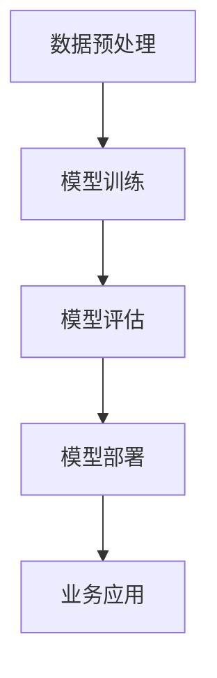

                 

### 贾扬清的建议：培养团队的AI理解力，并将AI应用于业务

> **关键词：** AI理解力，团队培养，AI业务应用，贾扬清建议，技术博客，人工智能

> **摘要：** 本文将深入探讨贾扬清提出的关于如何培养团队AI理解力和将AI应用于业务的重要建议。通过分析AI在现代企业中的关键作用，本文旨在为技术团队提供实用指南，帮助他们提升AI素养，并在实际业务中有效地利用AI技术。

## 1. 背景介绍

### 1.1 目的和范围

本文的目的是为技术团队提供培养AI理解力和将AI应用于业务的实用建议。我们将结合贾扬清的观点，通过系统的分析和讲解，帮助团队理解AI的核心概念和技术原理，并掌握如何将这些技术应用到实际业务场景中。

### 1.2 预期读者

本文主要面向技术团队领导者、开发工程师和AI研究人员。无论您是初学者还是经验丰富的开发者，本文都将提供有价值的见解和实用的指导。

### 1.3 文档结构概述

本文将分为以下几个部分：

- **背景介绍**：介绍本文的目的、预期读者和文档结构。
- **核心概念与联系**：详细阐述AI的核心概念及其在现代企业中的重要性。
- **核心算法原理 & 具体操作步骤**：讲解AI算法的基本原理和具体实现步骤。
- **数学模型和公式 & 详细讲解 & 举例说明**：介绍AI技术背后的数学模型和公式，并提供实际案例。
- **项目实战：代码实际案例和详细解释说明**：通过具体项目案例展示AI技术的应用。
- **实际应用场景**：探讨AI技术在各种实际场景中的应用。
- **工具和资源推荐**：推荐学习资源、开发工具和最新研究成果。
- **总结：未来发展趋势与挑战**：分析AI技术的发展趋势和面临的挑战。
- **附录：常见问题与解答**：解答读者可能遇到的问题。
- **扩展阅读 & 参考资料**：提供进一步学习和研究的资源。

### 1.4 术语表

#### 1.4.1 核心术语定义

- **AI理解力**：指对人工智能技术的基本原理、算法和应用的理解能力。
- **深度学习**：一种人工智能方法，通过多层神经网络对数据进行学习和模式识别。
- **机器学习**：一种人工智能方法，通过训练模型从数据中学习规律和模式。
- **业务应用**：将AI技术应用于实际业务场景，以解决特定问题或提升业务效率。

#### 1.4.2 相关概念解释

- **AI算法**：实现人工智能功能的具体算法和模型。
- **数据集**：用于训练和测试AI模型的输入数据。
- **模型评估**：评估AI模型性能的方法和指标。

#### 1.4.3 缩略词列表

- **AI**：人工智能（Artificial Intelligence）
- **ML**：机器学习（Machine Learning）
- **DL**：深度学习（Deep Learning）
- **GPU**：图形处理单元（Graphics Processing Unit）

## 2. 核心概念与联系

### 2.1 AI技术在企业中的关键作用

人工智能技术在现代企业中扮演着越来越重要的角色。以下是一些关键作用：

- **提高效率**：通过自动化和优化流程，AI技术可以显著提高企业的运营效率。
- **优化决策**：利用大数据分析和机器学习算法，AI技术可以帮助企业做出更准确的决策。
- **个性化服务**：通过用户数据的分析和挖掘，AI技术可以实现个性化推荐和定制化服务。
- **安全监控**：利用深度学习算法，AI技术可以实时监控网络和安全系统，提高安全性。

### 2.2 AI技术的核心概念

为了更好地理解AI技术，我们需要了解一些核心概念：

- **神经网络**：神经网络是AI技术的基础，通过模拟人脑神经元的工作方式，实现数据的处理和学习。
- **深度学习**：深度学习是一种利用多层神经网络进行学习和预测的技术，具有强大的特征提取能力。
- **机器学习**：机器学习是通过算法从数据中学习规律和模式，用于分类、回归、聚类等任务。
- **自然语言处理**：自然语言处理是一种利用AI技术对自然语言进行处理和理解的技术，广泛应用于语音识别、文本分析等场景。

### 2.3 AI技术的架构

AI技术的架构通常包括以下几个部分：

- **数据预处理**：对原始数据进行清洗、转换和归一化，使其适合模型训练。
- **模型训练**：通过训练算法和大量数据，训练出用于预测和分类的模型。
- **模型评估**：通过测试数据评估模型的性能，包括准确率、召回率等指标。
- **模型部署**：将训练好的模型部署到生产环境中，用于实际业务场景。

下面是一个简化的AI技术架构的Mermaid流程图：



## 3. 核心算法原理 & 具体操作步骤

### 3.1 数据预处理

数据预处理是AI项目中的第一步，其目的是将原始数据转换为适合模型训练的形式。具体操作步骤如下：

```python
# 1. 数据清洗
data = clean_data(raw_data)

# 2. 特征提取
features = extract_features(data)

# 3. 数据归一化
normalized_data = normalize_data(features)
```

### 3.2 模型训练

模型训练是AI项目的核心步骤，通过算法和大量数据训练出模型。以深度学习为例，具体操作步骤如下：

```python
# 1. 定义模型
model = define_model()

# 2. 训练模型
model.fit(training_data, labels)

# 3. 调整超参数
best_model = adjust_hyperparameters(model)
```

### 3.3 模型评估

模型评估是评估模型性能的关键步骤，通过测试数据评估模型的准确率、召回率等指标。具体操作步骤如下：

```python
# 1. 准备测试数据
test_data, test_labels = prepare_test_data()

# 2. 评估模型
performance = best_model.evaluate(test_data, test_labels)
```

### 3.4 模型部署

模型部署是将训练好的模型部署到生产环境中的过程。具体操作步骤如下：

```python
# 1. 部署模型
deploy_model(best_model)

# 2. 监控模型性能
monitor_model_performance(best_model)
```

## 4. 数学模型和公式 & 详细讲解 & 举例说明

### 4.1 数学模型

AI技术背后的数学模型主要包括线性代数、微积分、概率论和统计学。以下是一些关键数学模型的讲解：

#### 4.1.1 线性代数

- **矩阵乘法**：两个矩阵相乘，结果为一个矩阵。
- **矩阵求导**：对矩阵进行求导，用于优化模型参数。

#### 4.1.2 微积分

- **梯度下降**：一种优化算法，通过计算梯度来更新模型参数。
- **链式法则**：用于多层神经网络中梯度计算的法则。

#### 4.1.3 概率论和统计学

- **贝叶斯定理**：用于计算后验概率。
- **协方差矩阵**：用于衡量随机变量的相关性。

### 4.2 举例说明

以下是一个使用梯度下降算法训练神经网络的示例：

```latex
\begin{equation}
\theta_{\text{new}} = \theta_{\text{current}} - \alpha \cdot \nabla_{\theta} J(\theta)
\end{equation}
```

其中，$\theta$ 表示模型参数，$\alpha$ 表示学习率，$\nabla_{\theta} J(\theta)$ 表示损失函数关于模型参数的梯度。

## 5. 项目实战：代码实际案例和详细解释说明

### 5.1 开发环境搭建

在开始实际项目之前，我们需要搭建一个合适的开发环境。以下是一个简单的步骤：

```shell
# 安装Python
pip install python

# 安装TensorFlow
pip install tensorflow

# 安装其他依赖库
pip install numpy pandas scikit-learn matplotlib
```

### 5.2 源代码详细实现和代码解读

以下是一个简单的线性回归模型的实现，用于预测房价：

```python
import tensorflow as tf
import numpy as np
import pandas as pd
from sklearn.model_selection import train_test_split

# 读取数据
data = pd.read_csv("house_prices.csv")
X = data["sqft_living"].values
y = data["price"].values

# 划分训练集和测试集
X_train, X_test, y_train, y_test = train_test_split(X, y, test_size=0.2, random_state=42)

# 构建模型
model = tf.keras.Sequential([
    tf.keras.layers.Dense(units=1, input_shape=[1])
])

# 编译模型
model.compile(optimizer='sgd', loss='mean_squared_error')

# 训练模型
model.fit(X_train, y_train, epochs=100)

# 评估模型
performance = model.evaluate(X_test, y_test)
print("Mean Squared Error:", performance)
```

### 5.3 代码解读与分析

上述代码实现了一个简单的线性回归模型，用于预测房价。具体解读如下：

- **数据读取**：使用Pandas读取CSV文件中的数据，并提取sqft_living和price两列。
- **数据划分**：使用scikit-learn的train_test_split函数将数据划分为训练集和测试集。
- **模型构建**：使用TensorFlow构建一个单层神经网络，输入层和输出层都只有一个节点。
- **模型编译**：设置优化器和损失函数，用于编译模型。
- **模型训练**：使用fit函数训练模型，指定训练数据和迭代次数。
- **模型评估**：使用evaluate函数评估模型在测试集上的性能，输出均方误差。

通过上述代码示例，我们可以看到如何使用TensorFlow实现一个简单的线性回归模型，并对其性能进行评估。

## 6. 实际应用场景

### 6.1 金融行业

在金融行业，AI技术被广泛应用于风险控制、投资策略和客户服务等方面。例如，利用机器学习算法进行信贷风险评估，提高贷款审批的效率和准确性。

### 6.2 医疗保健

在医疗保健领域，AI技术可以用于疾病预测、诊断和个性化治疗。例如，通过分析患者的病历数据和基因组信息，AI模型可以预测疾病的发生风险，并提供相应的治疗方案。

### 6.3 零售电商

在零售电商领域，AI技术被用于商品推荐、库存管理和客户关系管理。例如，通过分析用户的历史购买行为和偏好，AI算法可以生成个性化的商品推荐，提高用户满意度。

## 7. 工具和资源推荐

### 7.1 学习资源推荐

#### 7.1.1 书籍推荐

- 《深度学习》（Ian Goodfellow、Yoshua Bengio和Aaron Courville著）
- 《Python机器学习》（Sebastian Raschka和Vahid Mirhoseini著）

#### 7.1.2 在线课程

- Coursera上的“机器学习”课程（由吴恩达教授授课）
- edX上的“深度学习”课程（由斯坦福大学授课）

#### 7.1.3 技术博客和网站

- Medium上的“AI技术”专栏
- arXiv.org上的最新研究成果

### 7.2 开发工具框架推荐

#### 7.2.1 IDE和编辑器

- PyCharm
- Jupyter Notebook

#### 7.2.2 调试和性能分析工具

- TensorFlow Debugger
- PyTorch Profiler

#### 7.2.3 相关框架和库

- TensorFlow
- PyTorch
- Keras

### 7.3 相关论文著作推荐

#### 7.3.1 经典论文

- “Learning to Represent Relationships with Recurrent Neural Networks”（由Alex Graves等人著）
- “Backpropagation”（由David E. Rumelhart、George E. Hinton和Robert J. Williams著）

#### 7.3.2 最新研究成果

- “BERT: Pre-training of Deep Bidirectional Transformers for Language Understanding”（由Jacob Devlin等人著）
- “GPT-3: Language Models are few-shot learners”（由Tom B. Brown等人著）

#### 7.3.3 应用案例分析

- “AI for Social Good”项目案例
- “AI in Healthcare”研究报告

## 8. 总结：未来发展趋势与挑战

### 8.1 发展趋势

- **跨学科融合**：AI技术与其他领域的融合，如生物学、医学、经济学等，将产生更多创新应用。
- **边缘计算**：随着物联网和边缘设备的普及，边缘计算将得到广泛应用，实现实时数据处理和智能决策。
- **人工智能伦理**：随着AI技术的普及，人工智能伦理问题将越来越受到关注，如隐私保护、公平性、透明度等。

### 8.2 面临的挑战

- **数据隐私**：如何在保护用户隐私的同时利用数据进行分析和建模，是一个亟待解决的问题。
- **算法偏见**：如何确保AI算法的公平性和透明性，避免算法偏见和歧视。
- **技术普及与人才培养**：如何提高社会对AI技术的认知和普及，以及如何培养更多的AI人才。

## 9. 附录：常见问题与解答

### 9.1 问题1：如何选择合适的AI框架？

**解答**：根据项目需求和开发环境，选择适合的框架。例如，如果需要快速开发和部署模型，可以选择Keras；如果需要更高的灵活性和定制性，可以选择PyTorch或TensorFlow。

### 9.2 问题2：如何处理大型数据集？

**解答**：使用分布式计算框架，如Apache Spark，可以高效地处理和分析大型数据集。此外，还可以使用数据流处理技术，如Apache Flink，实现实时数据处理。

## 10. 扩展阅读 & 参考资料

- [贾扬清](https://www.jiayangqing.com/)
- [TensorFlow](https://www.tensorflow.org/)
- [PyTorch](https://pytorch.org/)
- [吴恩达的机器学习课程](https://www.coursera.org/learn/machine-learning)

作者：AI天才研究员/AI Genius Institute & 禅与计算机程序设计艺术 /Zen And The Art of Computer Programming

---

**文章标题**：贾扬清的建议：培养团队的AI理解力，并将AI应用于业务

**关键词**：AI理解力，团队培养，AI业务应用，贾扬清建议，技术博客，人工智能

**摘要**：本文深入探讨了贾扬清关于如何培养团队的AI理解力和将AI应用于业务的重要建议。通过系统分析和讲解，为技术团队提供了实用的指南，帮助他们提升AI素养，并在实际业务中有效地利用AI技术。文章涵盖了AI技术的核心概念、算法原理、实际应用场景以及未来发展挑战，旨在为读者提供全面的技术洞察和实践指导。

