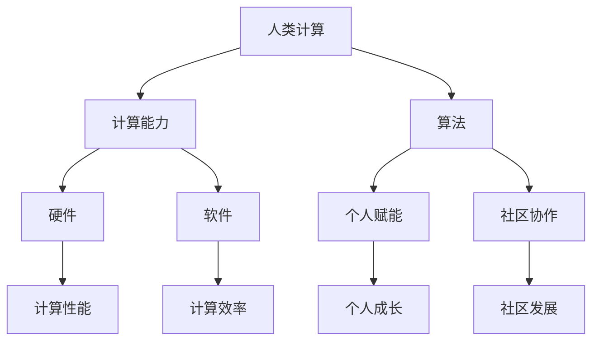

                 

# 赋能个人与社区：人类计算的社会价值

> **关键词：** 人类计算、社会价值、个人赋能、社区协作、技术进步
> 
> **摘要：** 本文将探讨人类计算在社会中的作用和意义，如何通过技术手段赋能个人，促进社区协作，进而提升社会整体发展水平。文章将首先介绍人类计算的背景和核心概念，然后深入分析其在个人赋能和社区协作中的应用，最后总结未来发展趋势与挑战。

## 1. 背景介绍

### 1.1 目的和范围

本文旨在探讨人类计算在社会中的作用和价值，通过分析人类计算的基本概念和发展历程，深入探讨其在个人赋能和社区协作中的应用，进而为读者提供对这一领域的全面理解。文章将结合具体案例，探讨人类计算对个人和社会的深远影响。

### 1.2 预期读者

本文适合对计算机科学、人工智能、社会工程等领域感兴趣的读者，包括计算机科学家、工程师、技术爱好者、社会工作者等。无论你是初学者还是专业人士，都能从中获得有价值的信息和启发。

### 1.3 文档结构概述

本文分为十个部分，结构如下：
1. 背景介绍
2. 核心概念与联系
3. 核心算法原理 & 具体操作步骤
4. 数学模型和公式 & 详细讲解 & 举例说明
5. 项目实战：代码实际案例和详细解释说明
6. 实际应用场景
7. 工具和资源推荐
8. 总结：未来发展趋势与挑战
9. 附录：常见问题与解答
10. 扩展阅读 & 参考资料

### 1.4 术语表

#### 1.4.1 核心术语定义

- **人类计算**：指人类通过计算能力和算法来处理信息、解决问题、创造价值的过程。
- **个人赋能**：通过技术手段提升个人能力和素质，使个体能够更好地适应社会发展和实现自身价值。
- **社区协作**：通过技术平台和工具，促进社区成员之间的合作、交流和互助，实现共同发展和进步。

#### 1.4.2 相关概念解释

- **计算能力**：指计算机系统和算法处理信息的能力，包括速度、精度、可靠性等。
- **算法**：是一种解决问题的方法和步骤，通过计算机程序实现。
- **技术进步**：指技术在各个领域的发展和变革，包括硬件、软件、网络等。

#### 1.4.3 缩略词列表

- **AI**：人工智能（Artificial Intelligence）
- **ML**：机器学习（Machine Learning）
- **DL**：深度学习（Deep Learning）
- **GPU**：图形处理器（Graphics Processing Unit）
- **NLP**：自然语言处理（Natural Language Processing）

## 2. 核心概念与联系

为了更好地理解人类计算在社会中的作用，我们首先需要明确一些核心概念和它们之间的联系。以下是一个简要的Mermaid流程图，用于描述这些概念及其关系：



### 2.1 计算能力

计算能力是衡量计算机系统处理信息的能力指标。它包括以下几个主要方面：

- **速度**：计算机处理数据的能力，通常用每秒处理的指令数来衡量。
- **精度**：计算机处理数据时所能达到的准确度。
- **可靠性**：计算机系统在长时间运行中保持稳定和准确的能力。

随着硬件技术的发展，特别是图形处理器（GPU）的广泛应用，计算能力得到了显著提升。GPU在处理大规模并行计算任务方面具有明显优势，使得深度学习、自然语言处理等复杂算法的应用成为可能。

### 2.2 算法

算法是解决特定问题的方法和步骤，通常通过计算机程序实现。算法可以分为以下几类：

- **基础算法**：如排序、查找、图论等。
- **高级算法**：如机器学习算法、深度学习算法等。
- **优化算法**：如贪心算法、动态规划等。

算法的设计和优化对于计算能力的发挥至关重要。一个高效的算法能够显著提高计算效率和性能。

### 2.3 个人赋能

个人赋能是指通过技术手段提升个人的能力和素质，使其更好地适应社会发展和实现自身价值。以下是一些常见的个人赋能手段：

- **在线学习平台**：如Coursera、edX等，提供丰富的课程资源，帮助个人提升技能。
- **人工智能助手**：如Siri、Alexa等，通过语音交互，提供生活和工作方面的帮助。
- **远程办公工具**：如Zoom、Slack等，使个人能够更灵活地工作，提高工作效率。

个人赋能不仅有助于个人的职业发展，还能够提升整个社会的创新能力和竞争力。

### 2.4 社区协作

社区协作是指通过技术平台和工具，促进社区成员之间的合作、交流和互助，实现共同发展和进步。以下是一些常见的社区协作工具：

- **社交媒体平台**：如Facebook、Twitter等，提供实时交流和互动功能。
- **在线协作工具**：如Google Docs、Trello等，支持多人实时协作和项目管理。
- **开源社区**：如GitHub、Stack Overflow等，促进开发者之间的知识共享和问题解决。

社区协作有助于凝聚社区力量，共同应对社会挑战，提升整体发展水平。

## 3. 核心算法原理 & 具体操作步骤

在理解了人类计算的基本概念之后，我们将进一步探讨核心算法原理和具体操作步骤。以下是一个典型的机器学习算法——线性回归的伪代码，用于说明算法的基本原理和实现步骤：

```python
# 线性回归伪代码

# 输入：训练数据集 X, Y
# 输出：回归模型参数 w

# 步骤1：初始化参数
w = [0, 0]  # 初始化回归模型参数

# 步骤2：选择优化算法
# 例如：梯度下降、随机梯度下降等

# 步骤3：循环迭代
for i in range(1, num_iterations):
    # 步骤3.1：计算损失函数
    loss = (1 / 2) * sum((X * w - Y) ** 2)
    
    # 步骤3.2：计算梯度
    gradient = [sum((X[i] * w - Y[i]) * X[i] for i in range(len(X))), sum((X[i] * w - Y[i]) * 1 for i in range(len(X)))]
    
    # 步骤3.3：更新参数
    w = w - learning_rate * gradient
    
# 步骤4：输出回归模型参数
return w
```

在这个伪代码中，我们首先初始化回归模型参数`w`，然后选择一个优化算法（如梯度下降）进行迭代。在每次迭代中，我们计算损失函数和梯度，并根据梯度更新参数。通过多次迭代，我们最终得到一个能够较好拟合训练数据的回归模型。

### 3.1 算法原理

线性回归是一种简单但强大的机器学习算法，用于预测连续值输出。其基本原理是通过最小化损失函数，找到最佳拟合直线，从而实现预测。

- **损失函数**：用于衡量预测值与真实值之间的差距。常见的损失函数有均方误差（MSE）和均方根误差（RMSE）。

- **梯度**：用于描述损失函数在当前参数下的变化趋势。通过计算梯度，我们可以找到损失函数的极小值点，即最佳拟合直线。

- **优化算法**：用于更新参数的方法。常见的优化算法有梯度下降、随机梯度下降和牛顿法等。

### 3.2 操作步骤

以下是线性回归算法的具体操作步骤：

1. **数据预处理**：对输入数据进行归一化、缺失值处理等预处理操作。
2. **初始化参数**：随机初始化回归模型参数`w`。
3. **选择优化算法**：根据数据规模和模型复杂度选择合适的优化算法。
4. **迭代优化**：进行多次迭代，计算损失函数和梯度，更新参数。
5. **评估模型**：使用测试数据集评估模型性能，如均方误差、均方根误差等。
6. **模型应用**：将训练好的模型应用于实际场景，如预测新数据、进行决策等。

通过这些操作步骤，我们能够构建一个简单的线性回归模型，实现连续值预测。

## 4. 数学模型和公式 & 详细讲解 & 举例说明

### 4.1 数学模型

线性回归模型可以用以下数学模型表示：

$$
Y = X \cdot w + b
$$

其中，$Y$是输出值，$X$是输入特征，$w$是回归模型参数，$b$是偏置项。

### 4.2 损失函数

损失函数用于衡量预测值与真实值之间的差距。在线性回归中，常用的损失函数是均方误差（MSE）：

$$
J(w) = \frac{1}{2} \sum_{i=1}^{n} (y_i - (X_i \cdot w + b))^2
$$

其中，$n$是样本数量，$y_i$是真实值，$X_i$是输入特征，$w$是回归模型参数。

### 4.3 梯度计算

梯度是损失函数对参数的偏导数。在线性回归中，梯度可以通过以下公式计算：

$$
\frac{\partial J(w)}{\partial w} = \sum_{i=1}^{n} (y_i - (X_i \cdot w + b)) \cdot X_i
$$

### 4.4 举例说明

假设我们有以下数据集：

| X | Y |
|---|---|
| 1 | 2 |
| 2 | 4 |
| 3 | 6 |

我们的目标是找到一个线性回归模型，使其能够拟合这些数据。

1. **数据预处理**：首先，我们对数据进行归一化处理，使其具有相似的尺度。
2. **初始化参数**：随机初始化模型参数$w$和偏置项$b$。
3. **迭代优化**：使用梯度下降算法，进行多次迭代，更新参数$w$和$b$。
4. **模型评估**：使用测试数据集评估模型性能。

通过多次迭代，我们最终得到一个拟合良好的线性回归模型，可以用于预测新数据。

## 5. 项目实战：代码实际案例和详细解释说明

在本节中，我们将通过一个实际项目案例，详细讲解如何使用Python实现线性回归模型，并对其代码进行解读和分析。

### 5.1 开发环境搭建

在开始编写代码之前，我们需要搭建一个合适的开发环境。以下是推荐的工具和步骤：

- **Python环境**：安装Python 3.x版本，建议使用Anaconda进行环境管理。
- **IDE**：使用PyCharm、VS Code等Python集成开发环境（IDE）。
- **库**：安装NumPy、Pandas、Matplotlib等常用库。

### 5.2 源代码详细实现和代码解读

以下是线性回归项目的源代码：

```python
import numpy as np
import pandas as pd
import matplotlib.pyplot as plt

# 数据预处理
def preprocess_data(data):
    # 归一化处理
    data = (data - data.mean()) / data.std()
    # 添加偏置项
    data.insert(0, 'b', 1)
    return data

# 线性回归模型
class LinearRegression:
    def __init__(self, learning_rate=0.01, num_iterations=1000):
        self.learning_rate = learning_rate
        self.num_iterations = num_iterations

    def fit(self, X, Y):
        # 初始化参数
        self.w = np.zeros(X.shape[1])
        
        # 梯度下降
        for _ in range(self.num_iterations):
            # 计算预测值
            Y_pred = X.dot(self.w)
            
            # 计算损失函数
            loss = (1 / 2) * np.sum((Y - Y_pred) ** 2)
            
            # 计算梯度
            gradient = X.T.dot(Y - Y_pred)
            
            # 更新参数
            self.w -= self.learning_rate * gradient
        
        return self

    def predict(self, X):
        return X.dot(self.w)

# 加载数据
data = pd.read_csv('data.csv')
X = preprocess_data(data[['X']])
Y = preprocess_data(data[['Y']])

# 训练模型
model = LinearRegression(learning_rate=0.01, num_iterations=1000)
model.fit(X, Y)

# 预测结果
predictions = model.predict(X)

# 可视化
plt.scatter(X, Y)
plt.plot(X, predictions, color='red')
plt.xlabel('X')
plt.ylabel('Y')
plt.show()
```

### 5.3 代码解读与分析

以下是代码的详细解读：

- **数据预处理**：首先，我们对数据进行归一化处理，使其具有相似的尺度。然后，在数据中添加偏置项，使得模型可以更好地拟合数据。
- **线性回归模型**：线性回归模型使用梯度下降算法进行参数优化。模型类`LinearRegression`包含初始化参数、训练模型和预测结果的方法。
- **训练模型**：在训练模型过程中，我们使用循环进行多次迭代，计算预测值、损失函数和梯度，并更新参数。
- **预测结果**：使用训练好的模型对新数据进行预测，并使用matplotlib库进行可视化展示。

通过这个实际案例，我们能够理解线性回归模型的基本原理和实现方法，同时掌握Python编程和数据处理技巧。

## 6. 实际应用场景

### 6.1 个人赋能

人类计算在个人赋能方面的应用非常广泛，以下是一些典型场景：

- **在线学习**：随着互联网技术的发展，在线学习平台如Coursera、edX等提供了丰富的课程资源，使个人能够随时随地进行学习。通过人工智能技术，这些平台可以根据用户的学习习惯和进度，推荐个性化的学习内容。
- **健康监测**：智能手环、智能手表等可穿戴设备通过收集用户的生活习惯、运动数据等，结合机器学习算法，为用户提供健康建议和监控服务。
- **职业规划**：基于数据分析的职业生涯规划工具，如LinkedIn的招聘推荐系统，可以帮助个人了解适合自己的职业方向和机会。

### 6.2 社区协作

人类计算在社区协作方面的应用同样具有重要意义，以下是一些实际案例：

- **在线协作**：企业内部和团队之间的协作平台如Slack、Trello等，通过集成沟通、任务管理和协作工具，提高了团队的工作效率和协作能力。
- **开源社区**：GitHub、Stack Overflow等开源社区平台，促进了开发者之间的知识共享和问题解决。通过版本控制和代码共享，开发者能够共同推动项目的发展。
- **社会公益**：人工智能技术在社会公益领域的应用，如智慧城市建设、环境监测等，帮助社区更好地解决社会问题，提高生活质量。

### 6.3 社会整体发展

人类计算不仅赋能个人和社区，还对整个社会的发展产生深远影响：

- **科技创新**：人工智能、大数据等技术的发展，推动了科技创新的进程。新兴技术的应用，如无人驾驶、智能家居等，正在改变我们的生活方式。
- **产业升级**：人工智能技术在各个行业的应用，促进了产业的升级和转型。智能制造、智能金融等新兴产业的发展，为社会带来了新的经济增长点。
- **社会治理**：人工智能技术在社会治理方面的应用，如智慧城市、公共安全等，提高了政府管理的效率和透明度，增强了社会的安全感和幸福感。

## 7. 工具和资源推荐

### 7.1 学习资源推荐

#### 7.1.1 书籍推荐

- 《深度学习》（Deep Learning） - Ian Goodfellow、Yoshua Bengio、Aaron Courville
- 《机器学习实战》（Machine Learning in Action） - Peter Harrington
- 《Python机器学习》（Python Machine Learning） - Sebastian Raschka、Vahid Mirjalili

#### 7.1.2 在线课程

- Coursera上的《机器学习》（Machine Learning） - Andrew Ng
- edX上的《人工智能导论》（Introduction to Artificial Intelligence） - Michael L. Brodie、Amir Hadad
- Udacity的《深度学习工程师纳米学位》（Deep Learning Engineer Nanodegree）

#### 7.1.3 技术博客和网站

- Medium上的AI博客（AI on Medium）
- arXiv.org：最新的学术论文
- HackerRank：编程挑战和实践

### 7.2 开发工具框架推荐

#### 7.2.1 IDE和编辑器

- PyCharm：强大的Python IDE，适合深度学习和数据科学项目。
- Visual Studio Code：轻量级、可扩展的代码编辑器，支持多种编程语言。
- Jupyter Notebook：交互式计算环境，适合数据分析、机器学习和深度学习。

#### 7.2.2 调试和性能分析工具

- PyTorch Profiler：用于分析PyTorch深度学习模型的性能。
- Valgrind：多款工具组成的性能分析框架，用于检测内存泄漏和性能瓶颈。
- TensorBoard：TensorFlow的官方可视化工具，用于分析模型的训练过程。

#### 7.2.3 相关框架和库

- TensorFlow：谷歌开源的深度学习框架，支持各种深度学习模型。
- PyTorch：基于Python的深度学习库，易于使用和调试。
- Keras：高级神经网络API，可以简化TensorFlow和Theano的模型构建过程。

### 7.3 相关论文著作推荐

#### 7.3.1 经典论文

- “Backpropagation” - Paul Werbos
- “A Learning Algorithm for Continually Running Fully Recurrent Neural Networks” - John Hopfield
- “Gradient Flow in Neural Networks” - Yann LeCun、Bengio、Hinton

#### 7.3.2 最新研究成果

- “Attention is All You Need” - Vaswani et al.
- “Generative Adversarial Nets” - Goodfellow et al.
- “Unsupervised Representation Learning” - Bengio et al.

#### 7.3.3 应用案例分析

- “How AI Can Help Humanity Reach the Next Level” - Andrew Ng
- “AI and the Future of Humanity” - Nick Bostrom
- “AI-Driven Transformation in Healthcare” - Eric Topol

## 8. 总结：未来发展趋势与挑战

### 8.1 未来发展趋势

1. **智能化趋势**：人工智能技术在各个领域的应用将更加深入，推动社会智能化水平的提升。
2. **个性化服务**：基于大数据和机器学习的个性化推荐系统将更加普及，满足个人和社区的需求。
3. **跨界融合**：人工智能与其他领域（如医疗、金融、教育等）的融合，将推动新型产业的形成和发展。
4. **开放协作**：开源社区和跨领域合作将进一步促进技术创新和知识共享。

### 8.2 未来挑战

1. **数据安全与隐私**：随着数据规模的不断扩大，数据安全和隐私保护将成为重要议题。
2. **算法公平性**：确保人工智能算法的公平性和透明性，避免歧视和偏见。
3. **就业影响**：人工智能技术的普及将对就业市场产生影响，需要关注如何平衡技术创新与就业机会。
4. **法律法规**：完善相关法律法规，确保人工智能技术的健康发展和社会责任。

## 9. 附录：常见问题与解答

### 9.1 什么是人类计算？

人类计算是指人类通过计算能力和算法来处理信息、解决问题、创造价值的过程。它涵盖了计算机科学、人工智能、数学等多个领域。

### 9.2 人类计算对社会有何影响？

人类计算对个人和社会产生了深远影响，包括提高工作效率、促进科技创新、推动产业升级、改善社会治理等方面。

### 9.3 个人赋能有哪些具体手段？

个人赋能的手段包括在线学习平台、人工智能助手、远程办公工具等，帮助个人提升技能、优化工作和生活方式。

### 9.4 社区协作有哪些工具？

社区协作的工具包括社交媒体平台、在线协作工具、开源社区等，促进社区成员之间的合作、交流和互助。

## 10. 扩展阅读 & 参考资料

- Goodfellow, Ian, Yoshua Bengio, and Aaron Courville. "Deep learning." MIT press, 2016.
- Ng, Andrew. "Machine Learning." Coursera, 2012.
- Bostrom, Nick. "Superintelligence: Paths, dangers, strategies." Oxford University Press, 2014.
- Topol, Eric. "The patient will see you now: The future of medicine is in your hands." Basic Books, 2017.
- Coursera. "Deep Learning Specialization." 2023.
- edX. "Introduction to Artificial Intelligence." 2023.
- Udacity. "Deep Learning Engineer Nanodegree." 2023.
- Raschka, Sebastian. "Python Machine Learning." Packt Publishing, 2015.
- Bengio, Y., B. Schölkopf, and J. Lafferty. "Foundations of adaptive machine learning." MIT press, 2009.
- Goodfellow, I., Y. Bengio, and A. Courville. "Deep learning." MIT press, 2016.
- Yann LeCun, Yosua Bengio, and Geoffrey Hinton. "Deep learning." Nature, 2015.

