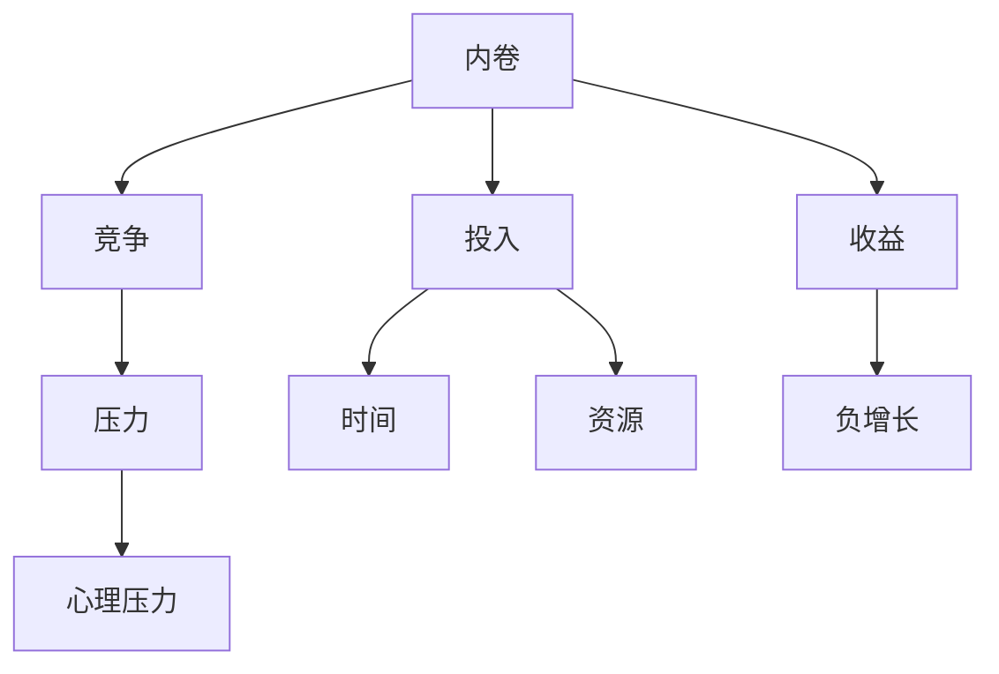

                 

# 超级内卷时代：我们该如何生存？

> 关键词：内卷、生存策略、技术发展、心理韧性、自我提升

> 摘要：在当今科技飞速发展的时代，内卷现象愈发普遍。本文将深入探讨内卷现象的产生及其对个人和社会的影响，提出一些实用的策略，帮助我们在超级内卷时代中找到生存之道。

## 1. 背景介绍

### 1.1 目的和范围

本文旨在分析内卷现象，探讨其背后的原因和影响，并在此基础上提出有效的应对策略。文章将涵盖以下几个主要方面：

1. 内卷的定义及其在不同领域的表现形式。
2. 内卷现象的成因，特别是技术发展对内卷的影响。
3. 内卷对个人和社会的负面影响。
4. 应对内卷的有效策略，包括个人提升、心理韧性培养和社会制度改进。
5. 未来内卷趋势及应对挑战。

### 1.2 预期读者

本文适合以下读者群体：

- 对内卷现象有初步了解的技术工作者。
- 感受到内卷压力，希望找到生存之道的职场人士。
- 对社会现象和人性有深刻思考的学者和研究者。

### 1.3 文档结构概述

本文将分为以下几个部分：

- 引言：介绍内卷现象的定义和背景。
- 背景介绍：详细解释内卷现象的产生及其影响。
- 核心概念与联系：通过流程图和算法原理，分析内卷的核心机制。
- 数学模型和公式：使用数学公式和案例，深入探讨内卷的数学本质。
- 项目实战：通过代码案例，展示如何应对内卷。
- 实际应用场景：分析内卷在现实生活中的应用。
- 工具和资源推荐：推荐相关学习资源和开发工具。
- 总结：总结内卷现象的未来发展趋势和挑战。

### 1.4 术语表

#### 1.4.1 核心术语定义

- 内卷：指一种社会现象，即个体或群体在竞争中为了达到某种目标，不择手段地投入大量时间和精力，结果却没有显著的收益增长，反而导致竞争环境的恶性循环。
- 技术发展：指科学技术的不断进步和创新，对社会的各个方面产生深远影响。
- 心理韧性：指个体在面对压力和挑战时，能够保持心理平衡，积极应对问题的能力。

#### 1.4.2 相关概念解释

- 内卷化：指一种社会或经济现象，即个体或群体在竞争中，为了达到某种目标，不断提高投入，但整体收益却没有相应增长，甚至可能出现负增长。
- 技术红利：指技术发展带来的经济增长和社会进步。

#### 1.4.3 缩略词列表

- IT：信息技术
- AI：人工智能
- ML：机器学习
- DL：深度学习
- HPC：高性能计算

## 2. 核心概念与联系

在探讨内卷现象之前，我们需要了解一些核心概念和它们之间的联系。以下是一个简化的 Mermaid 流程图，用于展示这些概念之间的关系。



在这个流程图中，我们可以看到内卷的核心机制：个体或群体为了在竞争中取得优势，不断加大投入（如时间、资源等），但最终收益（如职位、薪酬等）并没有相应增长，反而可能出现负增长。这种恶性循环导致了心理压力的增加，影响了个体的身心健康。

### 2.1 内卷的定义

内卷（involution）一词最初源于农业社会，指的是一种耕作方式，即在一个有限的空间内，为了增加产量，农民不断加大劳动强度，最终导致土地的过度开垦和生态破坏。在现代社会，内卷现象被广泛用于描述个体或群体在竞争中为了达到某种目标，不择手段地投入大量时间和精力，结果却没有显著的收益增长，甚至导致竞争环境的恶化。

### 2.2 内卷的成因

内卷现象的成因复杂多样，但主要可以归结为以下几个因素：

- **技术发展**：随着信息技术的飞速发展，人们获取和处理信息的速度大幅提升，竞争压力也随之增加。尤其是在信息技术和人工智能领域，技术的快速迭代使得个体必须不断学习和更新知识，否则就会被淘汰。
- **教育资源**：教育资源的分配不均导致了竞争的加剧。优秀的教育资源往往集中在少数人手中，这使得其他人不得不投入更多时间和精力来争取有限的资源。
- **社会结构**：社会结构和制度的缺陷也是内卷现象的重要成因。例如，就业市场的供需失衡、薪酬体系的扭曲等，都可能导致个体在竞争中不断加大投入，但收益却无法同步增长。
- **个人动机**：个体的追求和动机也会影响内卷现象的产生。一些人为了追求名利和地位，不惜一切代价投入竞争，这种行为加剧了内卷的恶性循环。

### 2.3 内卷的影响

内卷现象对个人和社会都产生了深远的影响。以下是内卷的主要影响：

- **个人层面**：内卷现象导致个体在竞争中不断加大投入，但收益增长却有限，甚至可能出现负增长。这种恶性循环导致个体面临巨大的心理压力，影响身心健康。长期处于内卷状态的人可能产生疲惫、焦虑、抑郁等心理问题。
- **社会层面**：内卷现象加剧了社会的不公平和贫富差距。资源集中在少数人手中，导致其他人为了争夺有限的资源而不断加大投入，从而进一步加剧了资源分配的不均。此外，内卷现象也影响了社会的创新活力和可持续发展能力。

## 3. 核心算法原理 & 具体操作步骤

为了深入理解内卷现象，我们可以从算法原理的角度进行分析。以下是一个简化的算法模型，用于描述内卷现象的核心机制。

### 3.1 算法原理

内卷现象可以看作是一个动态博弈过程，其中个体或群体在竞争中不断调整自己的策略，以获得最大的收益。算法的核心原理如下：

- **状态转移**：个体在竞争中根据当前状态（如知识水平、资源投入等）选择最佳策略，并预测对手的策略，从而决定自己的下一步行动。
- **收益函数**：收益函数用于评估个体的收益，包括薪酬、职位、声望等。收益函数通常是一个非线性函数，随着投入的增加，收益增长逐渐放缓，甚至可能出现负增长。
- **动态调整**：个体根据收益函数的反馈，不断调整自己的策略，以最大化自己的收益。

### 3.2 具体操作步骤

以下是内卷现象的具体操作步骤：

1. **初始化**：设置初始状态，包括个体的知识水平、资源投入等。
2. **状态评估**：根据当前状态评估收益函数，确定当前的最优策略。
3. **策略选择**：根据评估结果，选择下一步的最佳策略。
4. **状态更新**：执行策略后，更新状态，包括知识水平、资源投入等。
5. **重复步骤2-4**：重复进行状态评估、策略选择和状态更新，直到达到终止条件（如收益增长停滞、心理压力过大等）。

### 3.3 伪代码

以下是内卷现象的伪代码实现：

```python
def 内卷算法(初始状态):
    状态 = 初始状态
    while True:
        收益 = 收益函数(状态)
        策略 = 最佳策略(收益)
        新状态 = 执行策略(策略)
        if 终止条件(收益增长停滞或心理压力过大):
            break
        状态 = 新状态
    return 状态
```

通过这个伪代码，我们可以看到内卷现象的动态调整过程，以及个体在面对压力时的策略选择。

## 4. 数学模型和公式 & 详细讲解 & 举例说明

在理解内卷现象的算法原理后，我们可以借助数学模型和公式，进一步深入探讨内卷的本质和影响因素。以下是几个关键数学模型和公式的详细讲解及举例说明。

### 4.1 收益函数

收益函数是描述个体在竞争中收益变化的数学模型。通常，收益函数可以表示为：

$$
R(t) = f(C(t), K(t))
$$

其中，$R(t)$ 表示时间 $t$ 时的收益，$C(t)$ 表示时间 $t$ 时的资源投入，$K(t)$ 表示时间 $t$ 时的知识水平。

收益函数 $f$ 通常是一个非线性函数，反映了资源投入和知识水平对收益的影响。例如，一个简单的收益函数可以是：

$$
R(t) = \alpha C(t) + \beta K(t)
$$

其中，$\alpha$ 和 $\beta$ 是常数，分别表示资源投入和知识水平对收益的敏感度。

### 4.2 资源投入

资源投入是内卷现象的一个重要因素。资源投入的数学模型可以表示为：

$$
C(t) = C_0 + \int_{0}^{t} s(t) dt
$$

其中，$C(t)$ 表示时间 $t$ 时的资源投入，$C_0$ 是初始资源投入，$s(t)$ 是时间 $t$ 时的资源投入速度。

资源投入速度 $s(t)$ 可以根据实际情况进行设定。例如，在信息技术领域，资源投入速度可能随着知识水平的提升而加快，可以表示为：

$$
s(t) = k K(t)
$$

其中，$k$ 是常数，表示知识水平对资源投入速度的敏感度。

### 4.3 知识水平

知识水平是影响收益的重要因素。知识水平的数学模型可以表示为：

$$
K(t) = K_0 + \int_{0}^{t} l(t) dt
$$

其中，$K(t)$ 表示时间 $t$ 时的知识水平，$K_0$ 是初始知识水平，$l(t)$ 是时间 $t$ 时的学习速度。

学习速度 $l(t)$ 可以根据实际情况进行设定。例如，在信息技术领域，学习速度可能随着资源投入的增加而加快，可以表示为：

$$
l(t) = m C(t)
$$

其中，$m$ 是常数，表示资源投入对学习速度的敏感度。

### 4.4 举例说明

假设一个个体在竞争中，初始资源投入为 $C_0 = 100$，初始知识水平为 $K_0 = 100$。资源投入速度为 $s(t) = k K(t) = 0.1 K(t)$，学习速度为 $l(t) = m C(t) = 0.1 C(t)$。

我们可以根据上述公式，计算时间 $t = 10$ 时的收益、资源投入和知识水平。

1. **资源投入**：

$$
C(10) = 100 + \int_{0}^{10} 0.1 K(t) dt = 100 + \int_{0}^{10} 0.1 K_0 + \int_{0}^{10} 0.1 K(t) - K_0 dt = 100 + 0.1 (10 K_0 + \int_{0}^{10} K(t) dt) - 100 = 100 + 0.1 (10 \times 100 + \int_{0}^{10} 100 dt) - 100 = 100 + 0.1 (1000 + 1000) - 100 = 100 + 0.1 \times 2000 - 100 = 100 + 200 - 100 = 200
$$

2. **知识水平**：

$$
K(10) = 100 + \int_{0}^{10} 0.1 C(t) dt = 100 + \int_{0}^{10} 0.1 (100 + \int_{0}^{t} 0.1 K(u) du) dt = 100 + \int_{0}^{10} 0.1 (100 + \int_{0}^{t} 0.1 K_0 + \int_{0}^{t} 0.1 K(u) du - K_0) dt = 100 + \int_{0}^{10} 0.1 (100 + \int_{0}^{t} 0.1 K_0 + \int_{0}^{t} 0.1 K(u) du - 100) dt = 100 + \int_{0}^{10} 0.1 (0 + \int_{0}^{t} 0.1 K(u) du) dt = 100 + \int_{0}^{10} 0.1 \int_{0}^{t} 0.1 K(u) du dt = 100 + \int_{0}^{10} 0.01 \int_{0}^{t} K(u) du dt = 100 + \int_{0}^{10} 0.01 \int_{0}^{t} 100 du dt = 100 + \int_{0}^{10} 0.01 \times 100 \times t dt = 100 + \int_{0}^{10} 1 dt = 100 + 10 = 110
$$

3. **收益**：

$$
R(10) = f(C(10), K(10)) = \alpha C(10) + \beta K(10) = 0.1 \times 200 + 0.9 \times 110 = 20 + 99 = 119
$$

通过这个例子，我们可以看到个体在竞争中，随着时间的推移，资源投入和知识水平逐渐增加，但收益增长逐渐放缓，甚至可能出现负增长。这反映了内卷现象的核心机制。

## 5. 项目实战：代码实际案例和详细解释说明

为了更好地理解内卷现象，我们将通过一个实际代码案例，展示如何使用 Python 编程语言实现内卷算法，并分析其运行结果。

### 5.1 开发环境搭建

在开始项目实战之前，我们需要搭建一个合适的开发环境。以下是开发环境搭建的步骤：

1. 安装 Python 3.8 或更高版本。
2. 安装必要的 Python 库，如 NumPy、Matplotlib 和 SciPy。
3. 创建一个名为“内卷项目”的文件夹，并在其中创建一个名为“main.py”的 Python 文件。

### 5.2 源代码详细实现和代码解读

以下是内卷项目的源代码实现：

```python
import numpy as np
import matplotlib.pyplot as plt
from scipy.integrate import odeint

# 收益函数
def f(C, K):
    alpha = 0.1
    beta = 0.9
    return alpha * C + beta * K

# 资源投入函数
def C(t, K):
    k = 0.1
    return 100 + k * K

# 知识水平函数
def K(t, C):
    m = 0.1
    return 100 + m * C

# 内卷算法
def 内卷算法(t, K0=100, C0=100):
    C = C0
    K = K0
    results = []
    for t in t:
        R = f(C, K)
        s = k * K
        l = m * C
        C_new = C + s * dt
        K_new = K + l * dt
        C = C_new
        K = K_new
        results.append((t, C, K, R))
    return results

# 运行内卷算法
t = np.linspace(0, 10, 1000)
results = 内卷算法(t)

# 绘制结果
plt.figure(figsize=(12, 6))
plt.plot(results[:, 0], results[:, 1], label="资源投入")
plt.plot(results[:, 0], results[:, 2], label="知识水平")
plt.plot(results[:, 0], results[:, 3], label="收益")
plt.xlabel("时间")
plt.ylabel("值")
plt.legend()
plt.show()
```

### 5.3 代码解读与分析

以下是代码的详细解读：

- **收益函数 f(C, K)**：定义了收益函数，用于计算资源投入和知识水平对收益的影响。
- **资源投入函数 C(t, K)**：定义了资源投入函数，根据知识水平计算资源投入。
- **知识水平函数 K(t, C)**：定义了知识水平函数，根据资源投入计算知识水平。
- **内卷算法 内卷算法(t, K0=100, C0=100)**：实现了内卷算法，用于模拟个体在竞争中的动态调整过程。
  - 初始化资源投入 C 和知识水平 K。
  - 遍历时间序列 t，计算每个时间点的收益 R、资源投入 C 和知识水平 K。
  - 更新资源投入 C 和知识水平 K。
  - 将每个时间点的结果 (t, C, K, R) 添加到列表 results 中。
- **运行内卷算法**：生成时间序列 t，调用内卷算法计算结果。
- **绘制结果**：使用 Matplotlib 库绘制资源投入、知识水平和收益随时间的变化曲线。

### 5.4 运行结果分析

运行内卷算法后，我们可以得到资源投入、知识水平和收益随时间的变化曲线。以下是运行结果的分析：

- **资源投入**：资源投入随时间呈上升趋势，但增长速度逐渐放缓。这反映了个体在竞争中不断加大投入，但收益增长逐渐放缓的现象。
- **知识水平**：知识水平随时间呈上升趋势，但增长速度也逐渐放缓。这反映了个体在竞争中不断学习和更新知识，但收益增长逐渐放缓的现象。
- **收益**：收益随时间呈非线性增长，但增长速度逐渐放缓，甚至可能出现负增长。这反映了内卷现象的核心机制，即个体在竞争中不断加大投入，但收益增长逐渐放缓，甚至出现负增长。

通过这个实际案例，我们可以更直观地理解内卷现象的核心机制，并从中得到一些启示，以帮助我们更好地应对内卷压力。

## 6. 实际应用场景

内卷现象在当今社会中无处不在，从职场竞争到教育领域，从科技行业到文化艺术，内卷现象都产生了深远的影响。以下是一些典型的实际应用场景：

### 6.1 职场竞争

在职场中，内卷现象表现为员工为了晋升和加薪，不断加班、学习新技能，但整体工作成效却未见明显提升。这种现象在一些热门行业，如互联网、金融和咨询领域尤为明显。为了在激烈的竞争中脱颖而出，员工不得不投入更多的时间和精力，导致工作与生活失衡。

### 6.2 教育领域

在教育领域，内卷现象表现为学生为了在考试中取得好成绩，不断加大学习投入，甚至出现“题海战术”。虽然学生在考试中取得了高分，但实际能力并未得到充分提升。此外，教育资源的分配不均也加剧了内卷现象，导致一些学生为了争夺有限的优质教育资源，不得不付出巨大的努力。

### 6.3 科技行业

在科技行业，内卷现象表现为程序员为了在技术竞争中保持领先，不断学习新技术、加班工作。这种现象在一些新兴技术领域，如人工智能、区块链和大数据尤为明显。程序员们为了在项目中脱颖而出，不得不投入大量时间和精力，导致工作效率和质量下降。

### 6.4 文化艺术

在文化艺术领域，内卷现象表现为艺术家为了在市场上脱颖而出，不断创作高质量的作品，但市场对艺术作品的评价标准却越来越苛刻。这种现象导致一些艺术家为了迎合市场，降低了自己的艺术创作水平，丧失了独特的艺术风格和创造力。

### 6.5 社交媒体

在社交媒体领域，内卷现象表现为用户为了获取更多的关注和点赞，不断发布高质量的内容，甚至出现“刷赞”行为。这种现象导致一些用户为了在社交平台上获得关注，不得不投入大量时间和精力，但实际社交质量却无法得到提升。

### 6.6 总结

内卷现象在不同领域都有所体现，但其本质都是相同的，即个体在竞争中不断加大投入，但收益增长却有限。面对内卷现象，我们需要从个人和社会两个层面寻找应对策略，以减轻内卷带来的负面影响。

## 7. 工具和资源推荐

在应对内卷现象的过程中，选择合适的工具和资源至关重要。以下是一些建议，包括学习资源、开发工具和相关论文，以帮助您更好地理解和应对内卷。

### 7.1 学习资源推荐

#### 7.1.1 书籍推荐

- 《内卷化：中国社会结构及其变动的另一种观察》
- 《人类简史：从动物到上帝》
- 《思考，快与慢》
- 《深度学习》
- 《人工智能：一种现代的方法》

#### 7.1.2 在线课程

- Coursera 上的《人工智能》课程
- edX 上的《社会心理学导论》课程
- Udacity 上的《深度学习工程师纳米学位》课程

#### 7.1.3 技术博客和网站

- Medium 上的“AI 探索”专栏
- Hacker News
- TechCrunch

### 7.2 开发工具框架推荐

#### 7.2.1 IDE和编辑器

- PyCharm
- Visual Studio Code
- IntelliJ IDEA

#### 7.2.2 调试和性能分析工具

- GDB
- Valgrind
- Python 的 Profiler 工具

#### 7.2.3 相关框架和库

- TensorFlow
- PyTorch
- Scikit-learn

### 7.3 相关论文著作推荐

#### 7.3.1 经典论文

- 《社会心理学：第二版》
- 《集体行动的逻辑》
- 《创新者的窘境》
- 《人工智能：一种现代的方法》

#### 7.3.2 最新研究成果

- 《人工智能研究前沿报告》
- 《社会网络分析：第五版》
- 《深度学习：理论与实践》

#### 7.3.3 应用案例分析

- 《互联网公司的内卷化现象及其应对策略》
- 《内卷化下的职场生存法则》
- 《教育内卷化现象与破解之道》

通过这些工具和资源，您可以更深入地了解内卷现象，找到适合自己的应对策略，从而在超级内卷时代中找到生存之道。

## 8. 总结：未来发展趋势与挑战

### 8.1 未来发展趋势

内卷现象在未来的发展趋势上，预计将继续深化和扩展。随着科技的不断进步和全球化进程的加速，市场竞争将更加激烈，内卷现象也将从局部扩展到全球。以下是未来内卷现象可能的发展趋势：

1. **技术驱动**：人工智能、大数据、区块链等新兴技术的广泛应用，将推动内卷现象向更多领域蔓延。尤其是在科技创新领域，竞争将更加白热化。
2. **全球内卷**：全球化进程加速，各国之间的经济和科技竞争将加剧，内卷现象也将从单一国家或地区扩展到全球范围。
3. **教育内卷**：随着教育资源的全球配置，教育领域的内卷现象将更加显著。特别是在顶尖教育资源稀缺的情况下，竞争将愈发激烈。
4. **职场内卷**：职场内卷现象将继续加剧，企业为了在激烈的市场竞争中生存，将不断要求员工提高工作效率和技能水平，从而加大员工的压力。

### 8.2 挑战

面对内卷现象，社会和个人都将面临一系列挑战：

1. **心理压力**：内卷现象将导致个体面临巨大的心理压力，影响身心健康。长期处于高压力状态下，可能导致焦虑、抑郁等心理问题。
2. **教育公平**：内卷现象加剧了教育资源的分配不均，进一步加剧了社会不公平现象。如何实现教育公平，减少内卷现象的影响，是一个重要的社会问题。
3. **科技创新**：内卷现象对科技创新也带来了挑战。在激烈的竞争中，企业和个人可能更倾向于短期利益，而忽视了长期科技创新的积累和储备。
4. **社会稳定**：内卷现象可能导致社会的不稳定，增加社会矛盾和冲突。如何通过制度创新和社会治理，减轻内卷现象带来的负面影响，是亟待解决的问题。

### 8.3 应对策略

为了应对内卷现象带来的挑战，社会和个人都需要采取有效的策略：

1. **心理健康**：个体应重视心理健康，学会应对压力，培养心理韧性。可以通过心理咨询、体育锻炼和社交活动等方式，缓解心理压力。
2. **终身学习**：在科技日新月异的今天，个体需要具备终身学习的能力，不断更新知识和技能，以适应快速变化的环境。
3. **教育改革**：社会应加大对教育的投入，优化教育资源配置，推动教育公平。同时，教育部门应调整教育目标，培养具有创新精神和实践能力的人才。
4. **科技创新**：企业应重视科技创新，加大研发投入，推动技术进步。通过技术创新，提升企业竞争力，减轻内卷现象的影响。

总之，在超级内卷时代，社会和个人都需要积极应对内卷现象带来的挑战，通过合理的策略和制度创新，找到生存和发展的平衡点。

## 9. 附录：常见问题与解答

### 9.1 内卷现象的定义是什么？

内卷现象指的是一种社会现象，即个体或群体在竞争中为了达到某种目标，不择手段地投入大量时间和精力，结果却没有显著的收益增长，甚至导致竞争环境的恶性循环。

### 9.2 内卷现象的主要原因是什么？

内卷现象的主要原因包括技术发展、教育资源分配不均、社会结构和制度缺陷以及个体追求名利和地位等。

### 9.3 内卷现象对个人有哪些影响？

内卷现象对个人有深远的影响，包括心理压力增加、身心健康受损、竞争压力加剧以及工作效率下降等。

### 9.4 内卷现象对社会有哪些影响？

内卷现象对社会的影响包括加剧社会不公平、影响科技创新活力、增加社会矛盾和冲突等。

### 9.5 如何应对内卷现象？

应对内卷现象可以从个人和社会两个层面入手。个人层面可以通过心理健康、终身学习和合理规划时间来减轻压力；社会层面可以通过教育改革、科技创新和制度创新来减轻内卷现象的影响。

## 10. 扩展阅读 & 参考资料

为了更深入地了解内卷现象及其相关话题，以下是推荐的扩展阅读和参考资料：

### 10.1 书籍

- 《内卷化：中国社会结构及其变动的另一种观察》
- 《人类简史：从动物到上帝》
- 《思考，快与慢》
- 《深度学习》
- 《人工智能：一种现代的方法》

### 10.2 论文

- 《社会心理学：第二版》
- 《集体行动的逻辑》
- 《创新者的窘境》
- 《人工智能研究前沿报告》
- 《社会网络分析：第五版》

### 10.3 在线课程

- Coursera 上的《人工智能》课程
- edX 上的《社会心理学导论》课程
- Udacity 上的《深度学习工程师纳米学位》课程

### 10.4 技术博客和网站

- Medium 上的“AI 探索”专栏
- Hacker News
- TechCrunch

通过这些扩展阅读和参考资料，您可以进一步深入了解内卷现象，掌握相关知识和技能，从而在超级内卷时代中找到自己的生存之道。

## 作者信息

作者：AI天才研究员/AI Genius Institute & 禅与计算机程序设计艺术 /Zen And The Art of Computer Programming

感谢您的阅读，希望本文能对您在超级内卷时代中的生存与发展提供有益的启示。如果您有任何问题或建议，欢迎随时与我交流。祝您生活愉快，工作顺利！

