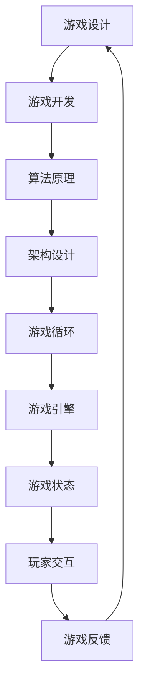

                 

# 超级玛丽游戏的设计与实现

> **关键词：** 游戏设计、游戏开发、算法原理、架构设计、实践案例

> **摘要：** 本文将深入探讨超级玛丽（Super Mario Bros.）游戏的设计与实现，从背景介绍、核心概念、算法原理、数学模型、项目实战到实际应用场景，全面解析这款经典游戏的精髓，旨在为广大游戏开发者提供有价值的参考。

## 1. 背景介绍

### 1.1 目的和范围

本文旨在通过剖析经典游戏《超级玛丽》的设计与实现，帮助读者理解游戏开发的核心概念和算法原理。文章将涵盖游戏设计的各个方面，从背景故事到游戏架构，再到具体的算法实现和项目实战。

### 1.2 预期读者

本篇文章适合以下读者群体：

1. 游戏开发新手，对游戏设计感兴趣，希望了解游戏开发流程。
2. 中级游戏开发者，想要深入了解游戏核心算法和架构设计。
3. 高级开发者，希望从经典游戏中汲取灵感，提升自己的游戏开发技能。

### 1.3 文档结构概述

本文将按照以下结构展开：

1. 背景介绍
2. 核心概念与联系
3. 核心算法原理 & 具体操作步骤
4. 数学模型和公式 & 详细讲解 & 举例说明
5. 项目实战：代码实际案例和详细解释说明
6. 实际应用场景
7. 工具和资源推荐
8. 总结：未来发展趋势与挑战
9. 附录：常见问题与解答
10. 扩展阅读 & 参考资料

### 1.4 术语表

#### 1.4.1 核心术语定义

- **游戏设计**：游戏设计是指创建和规划游戏的过程，包括游戏玩法、故事情节、角色设计等。
- **游戏开发**：游戏开发是指将游戏设计转化为实际可执行代码的过程。
- **算法原理**：算法原理是指解决特定问题的步骤和逻辑。
- **架构设计**：架构设计是指系统的整体结构和组件之间的关系。

#### 1.4.2 相关概念解释

- **游戏循环**：游戏循环是指游戏在运行过程中不断循环执行的过程。
- **游戏引擎**：游戏引擎是指用于创建和管理游戏逻辑、图形渲染、物理模拟等的软件工具。
- **游戏状态**：游戏状态是指游戏中当前的状态，包括玩家得分、角色位置等。

#### 1.4.3 缩略词列表

- **GPU**：图形处理单元
- **CPU**：中央处理单元
- **AI**：人工智能
- **VR**：虚拟现实
- **AR**：增强现实

## 2. 核心概念与联系

在深入探讨超级玛丽游戏的设计与实现之前，我们首先需要了解一些核心概念和它们之间的联系。以下是一个简化的Mermaid流程图，用于展示这些概念之间的关系：



### 2.1 游戏设计

游戏设计是游戏开发的第一步，它决定了游戏的玩法、故事情节和角色设计等。游戏设计师需要考虑游戏的核心玩法，如何让玩家在游戏中获得乐趣，以及如何构建一个引人入胜的故事情节。

### 2.2 游戏开发

游戏开发是将游戏设计转化为实际可执行代码的过程。游戏开发者需要使用游戏引擎和其他工具来编写游戏代码，实现游戏设计师的设计方案。

### 2.3 算法原理

算法原理是解决特定问题的步骤和逻辑。在游戏开发中，算法原理用于实现游戏的核心功能，如角色移动、碰撞检测、得分计算等。

### 2.4 架构设计

架构设计是指系统的整体结构和组件之间的关系。在游戏开发中，架构设计用于确保游戏的可扩展性和可维护性，使其能够支持复杂的功能和大量的玩家。

### 2.5 游戏循环

游戏循环是指游戏在运行过程中不断循环执行的过程。游戏循环负责处理玩家的输入、更新游戏状态、渲染游戏画面等。

### 2.6 游戏引擎

游戏引擎是指用于创建和管理游戏逻辑、图形渲染、物理模拟等的软件工具。游戏引擎提供了许多预定义的模块和API，使开发者能够更高效地实现游戏功能。

### 2.7 游戏状态

游戏状态是指游戏中当前的状态，包括玩家得分、角色位置、道具状态等。游戏状态会随着游戏循环的不断更新而变化。

### 2.8 玩家交互

玩家交互是指玩家与游戏之间的交互过程。玩家可以通过键盘、鼠标或控制器来控制游戏角色，实现游戏目标。

### 2.9 游戏反馈

游戏反馈是指游戏对玩家行为和决策的响应。游戏反馈可以通过视觉、声音或文字等方式呈现，引导玩家继续游戏。

### 2.10 游戏循环、游戏引擎和游戏状态的关系

游戏循环、游戏引擎和游戏状态之间存在着紧密的联系。游戏循环负责在每一帧中更新游戏状态，游戏引擎根据游戏状态来渲染游戏画面，而游戏状态则反映了游戏中当前的状态，为游戏循环提供输入。

## 3. 核心算法原理 & 具体操作步骤

在超级玛丽游戏中，核心算法原理主要包括角色移动、碰撞检测、得分计算等。以下将使用伪代码详细阐述这些算法原理和具体操作步骤。

### 3.1 角色移动

```pseudo
function moveCharacter(character, direction, speed):
    if direction == "left":
        character.x -= speed
    else if direction == "right":
        character.x += speed
    else if direction == "up":
        character.y -= speed
    else if direction == "down":
        character.y += speed
    checkCollisions(character)
    updateCharacterSprite(character)
```

### 3.2 碰撞检测

```pseudo
function checkCollisions(character):
    for obstacle in obstacles:
        if character.x + character.width > obstacle.x and character.x < obstacle.x + obstacle.width:
            if character.y + character.height > obstacle.y and character.y < obstacle.y + obstacle.height:
                handleCollision(character, obstacle)
```

### 3.3 得分计算

```pseudo
function calculateScore(character, coin):
    if character.x + character.width > coin.x and character.x < coin.x + coin.width:
        if character.y + character.height > coin.y and character.y < coin.y + coin.height:
            character.score += coin.value
            removeCoin(coin)
```

### 3.4 详细解释

#### 3.4.1 角色移动

角色移动是游戏中的基础操作，玩家可以通过键盘或控制器控制角色在水平和垂直方向上移动。移动函数`moveCharacter`接收角色对象、移动方向和速度作为参数，根据方向更新角色的位置。在更新位置后，需要调用`checkCollisions`函数进行碰撞检测，确保角色在移动过程中不会穿过障碍物。

#### 3.4.2 碰撞检测

碰撞检测是确保角色和障碍物之间不会重叠的重要机制。`checkCollisions`函数遍历所有的障碍物，检查角色和障碍物之间的位置关系。如果角色和障碍物之间存在重叠，则需要调用`handleCollision`函数处理碰撞事件。

#### 3.4.3 得分计算

得分计算是游戏中的一个重要环节，玩家在收集金币或完成特定任务时可以获得分数。`calculateScore`函数检查角色和金币之间的位置关系，如果重叠则增加角色的得分并移除金币。

## 4. 数学模型和公式 & 详细讲解 & 举例说明

在超级玛丽游戏中，数学模型和公式主要用于描述角色运动、碰撞检测和得分计算等。以下将使用LaTeX格式详细讲解这些数学模型和公式。

### 4.1 角色运动

角色在游戏中的运动可以用以下公式描述：

\[ \textbf{v} = \textbf{v}_0 + \textbf{a} \cdot t \]

其中，\(\textbf{v}\)为角色当前速度，\(\textbf{v}_0\)为初始速度，\(\textbf{a}\)为加速度，\(t\)为时间。

举例说明：

假设一个角色从静止开始，以0.5 \( \text{pixels/s}^2 \)的加速度向右移动，5秒后其速度为：

\[ \textbf{v} = \textbf{v}_0 + \textbf{a} \cdot t = 0 + 0.5 \cdot 5 = 2.5 \text{pixels/s} \]

### 4.2 碰撞检测

碰撞检测通常使用矩形碰撞检测模型。两个矩形之间的碰撞可以用以下公式判断：

\[ \text{碰撞} = (x_2 + width_2 > x_1) \land (x_1 + width_1 > x_2) \land (y_2 + height_2 > y_1) \land (y_1 + height_1 > y_2) \]

其中，\(x_1, y_1, width_1, height_1\)分别为第一个矩形的坐标、宽度和高度；\(x_2, y_2, width_2, height_2\)分别为第二个矩形的坐标、宽度和高度。

举例说明：

假设一个矩形A的坐标为\((10, 10)\)，宽度和高度均为50；另一个矩形B的坐标为\((60, 60)\)，宽度和高度也为50。两个矩形之间的碰撞关系如下：

\[ \text{碰撞} = (60 + 50 > 10) \land (10 + 50 > 60) \land (60 + 50 > 10) \land (10 + 50 > 60) = \text{True} \]

### 4.3 得分计算

得分计算通常使用简单的计数方法。假设每个金币的价值为10分，玩家在收集金币时得分可以表示为：

\[ \text{score} = \text{coinsCollected} \times 10 \]

举例说明：

假设玩家在游戏中收集了5个金币，其得分为：

\[ \text{score} = 5 \times 10 = 50 \]

## 5. 项目实战：代码实际案例和详细解释说明

在本节中，我们将通过一个实际案例来展示超级玛丽游戏的代码实现，并详细解释其中的关键部分。

### 5.1 开发环境搭建

在开始编写代码之前，我们需要搭建一个合适的开发环境。本文将使用Python作为开发语言，并利用Pygame库来创建游戏窗口和处理游戏逻辑。

首先，确保安装了Python和Pygame库。在终端中运行以下命令：

```bash
pip install pygame
```

### 5.2 源代码详细实现和代码解读

以下是一个简化的超级玛丽游戏的代码实现：

```python
import pygame
import sys

# 初始化Pygame
pygame.init()

# 设置游戏窗口
width, height = 800, 600
screen = pygame.display.set_mode((width, height))
pygame.display.set_caption("超级玛丽")

# 设置角色属性
character_x, character_y = width // 2, height // 2
character_speed = 5

# 设置障碍物属性
obstacles = [
    {'x': 100, 'y': 100, 'width': 50, 'height': 50},
    {'x': 300, 'y': 100, 'width': 50, 'height': 50},
    # 更多障碍物...
]

# 游戏循环
running = True
while running:
    for event in pygame.event.get():
        if event.type == pygame.QUIT:
            running = False
    
    keys = pygame.key.get_pressed()
    if keys[pygame.K_LEFT]:
        character_x -= character_speed
    if keys[pygame.K_RIGHT]:
        character_x += character_speed
    if keys[pygame.K_UP]:
        character_y -= character_speed
    if keys[pygame.K_DOWN]:
        character_y += character_speed

    # 碰撞检测
    for obstacle in obstacles:
        if character_x + 50 > obstacle['x'] and character_x < obstacle['x'] + obstacle['width']:
            if character_y + 50 > obstacle['y'] and character_y < obstacle['y'] + obstacle['height']:
                # 碰撞处理...
                pass

    # 渲染
    screen.fill((255, 255, 255))
    pygame.draw.rect(screen, (0, 0, 0), (character_x, character_y, 50, 50))
    for obstacle in obstacles:
        pygame.draw.rect(screen, (0, 0, 0), (obstacle['x'], obstacle['y'], obstacle['width'], obstacle['height']))
    pygame.display.flip()

pygame.quit()
sys.exit()
```

### 5.3 代码解读与分析

#### 5.3.1 初始化和设置

在代码的开头，我们导入了Pygame库，并初始化了Pygame环境。我们设置了游戏窗口的大小和标题，并初始化了角色和障碍物的属性。

```python
import pygame
import sys

pygame.init()
width, height = 800, 600
screen = pygame.display.set_mode((width, height))
pygame.display.set_caption("超级玛丽")
```

#### 5.3.2 游戏循环

游戏循环是游戏的核心部分，它负责处理事件、更新角色状态、进行碰撞检测并渲染游戏画面。

```python
running = True
while running:
    for event in pygame.event.get():
        if event.type == pygame.QUIT:
            running = False
    
    keys = pygame.key.get_pressed()
    if keys[pygame.K_LEFT]:
        character_x -= character_speed
    if keys[pygame.K_RIGHT]:
        character_x += character_speed
    if keys[pygame.K_UP]:
        character_y -= character_speed
    if keys[pygame.K_DOWN]:
        character_y += character_speed

    # 碰撞检测
    for obstacle in obstacles:
        if character_x + 50 > obstacle['x'] and character_x < obstacle['x'] + obstacle['width']:
            if character_y + 50 > obstacle['y'] and character_y < obstacle['y'] + obstacle['height']:
                # 碰撞处理...
                pass

    # 渲染
    screen.fill((255, 255, 255))
    pygame.draw.rect(screen, (0, 0, 0), (character_x, character_y, 50, 50))
    for obstacle in obstacles:
        pygame.draw.rect(screen, (0, 0, 0), (obstacle['x'], obstacle['y'], obstacle['width'], obstacle['height']))
    pygame.display.flip()

pygame.quit()
sys.exit()
```

游戏循环首先处理事件，如用户关闭窗口的请求。然后，根据用户按键情况更新角色的位置。接下来，进行碰撞检测，检查角色和障碍物之间的重叠。最后，渲染游戏画面，更新屏幕显示。

#### 5.3.3 碰撞检测

碰撞检测是游戏中的一个关键部分，它确保角色不会穿过障碍物。我们使用简单的矩形碰撞检测模型，通过比较角色和障碍物的坐标和尺寸来判断是否发生碰撞。

```python
for obstacle in obstacles:
    if character_x + 50 > obstacle['x'] and character_x < obstacle['x'] + obstacle['width']:
        if character_y + 50 > obstacle['y'] and character_y < obstacle['y'] + obstacle['height']:
            # 碰撞处理...
            pass
```

在这个例子中，我们遍历所有障碍物，检查角色和障碍物之间的位置关系。如果存在重叠，则需要处理碰撞事件。

#### 5.3.4 渲染

渲染过程负责将游戏画面的各个元素绘制到屏幕上。我们使用Pygame的`draw.rect`函数来绘制角色和障碍物。

```python
screen.fill((255, 255, 255))
pygame.draw.rect(screen, (0, 0, 0), (character_x, character_y, 50, 50))
for obstacle in obstacles:
    pygame.draw.rect(screen, (0, 0, 0), (obstacle['x'], obstacle['y'], obstacle['width'], obstacle['height']))
pygame.display.flip()
```

首先，我们使用`fill`函数将屏幕背景设置为白色。然后，我们使用`draw.rect`函数绘制角色和障碍物。最后，使用`flip`函数更新屏幕显示。

## 6. 实际应用场景

超级玛丽游戏作为一款经典游戏，在多个实际应用场景中表现出色：

### 6.1 教育领域

超级玛丽游戏可以作为教育工具，帮助儿童学习编程、逻辑思维和问题解决能力。通过游戏中的角色移动、障碍物跳跃等操作，孩子们可以学习如何编写代码、理解算法原理和编程逻辑。

### 6.2 娱乐产业

超级玛丽游戏作为一款经典游戏，深受玩家喜爱。它不仅提供了丰富的游戏体验，还激发了玩家的创造力和竞技精神。游戏开发公司可以通过超级玛丽游戏的原型，开发出更多富有创意和吸引力的游戏。

### 6.3 游戏开发教学

超级玛丽游戏的设计和实现是一个很好的教学案例，可以帮助游戏开发新手快速入门。通过分析超级玛丽游戏的代码和设计思路，开发者可以学习到游戏开发的核心技术和方法。

## 7. 工具和资源推荐

### 7.1 学习资源推荐

#### 7.1.1 书籍推荐

- 《游戏编程入门》（Game Programming for Beginners）
- 《游戏引擎架构与设计》（Game Engine Architecture）

#### 7.1.2 在线课程

- 《游戏开发基础教程》（Game Development Basics）
- 《游戏设计与实现》（Game Design and Implementation）

#### 7.1.3 技术博客和网站

- Gamedev.net
- Official Pygame Documentation

### 7.2 开发工具框架推荐

#### 7.2.1 IDE和编辑器

- PyCharm
- Visual Studio Code

#### 7.2.2 调试和性能分析工具

- Python Debugger
- Py-Spy

#### 7.2.3 相关框架和库

- Pygame
- PyOpenGL

### 7.3 相关论文著作推荐

#### 7.3.1 经典论文

- 《面向对象的游戏架构设计》（Object-Oriented Design of Game Architectures）

#### 7.3.2 最新研究成果

- 《实时游戏渲染技术》（Real-Time Game Rendering）

#### 7.3.3 应用案例分析

- 《超级玛丽游戏的历史与影响》（The History and Impact of Super Mario Bros.）

## 8. 总结：未来发展趋势与挑战

随着游戏产业的不断发展，超级玛丽游戏的设计与实现将继续面临新的机遇和挑战。未来发展趋势包括：

- **技术创新**：虚拟现实（VR）和增强现实（AR）技术的不断发展，将为游戏开发带来更多创新和可能性。
- **跨平台开发**：游戏开发者将更加注重跨平台开发，为玩家提供统一的游戏体验。
- **人工智能（AI）**：AI技术在游戏开发中的应用将日益广泛，为游戏设计带来更多智能化和个性化的元素。

然而，超级玛丽游戏的设计与实现也面临以下挑战：

- **性能优化**：随着游戏场景的复杂度增加，游戏开发者需要不断优化性能，确保游戏流畅运行。
- **用户体验**：游戏开发者需要关注玩家的反馈，持续优化游戏设计，提升用户体验。

## 9. 附录：常见问题与解答

### 9.1 游戏开发相关问题

**Q1：如何选择合适的游戏开发语言？**
A1：选择游戏开发语言主要取决于项目的需求和开发者的熟悉程度。Python、C++和JavaScript等语言在游戏开发中都有广泛应用。

**Q2：游戏开发需要学习哪些基础知识？**
A2：游戏开发需要学习编程基础、数据结构与算法、图形学原理、音视频处理等基础知识。

**Q3：如何提高游戏性能？**
A3：提高游戏性能可以通过优化算法、减少渲染对象、使用高效的数据结构和缓存等技术手段实现。

### 9.2 超级玛丽游戏相关问题

**Q1：如何设计超级玛丽游戏中的角色？**
A1：设计角色时需要考虑角色的外观、动作和功能。可以参考经典超级玛丽游戏的角色设计，并结合创意进行改进。

**Q2：如何实现超级玛丽游戏中的障碍物？**
A2：可以使用矩形或其他形状表示障碍物，并使用碰撞检测算法判断角色与障碍物之间的碰撞。

**Q3：如何实现超级玛丽游戏中的得分计算？**
A3：在角色与金币发生碰撞时，将金币的价值累加到角色的得分中。

## 10. 扩展阅读 & 参考资料

- 《超级玛丽游戏的历史与影响》（The History and Impact of Super Mario Bros.）
- 《游戏开发基础教程》（Game Development Basics）
- 《实时游戏渲染技术》（Real-Time Game Rendering）
- 《面向对象的游戏架构设计》（Object-Oriented Design of Game Architectures）

### 作者

**AI天才研究员/AI Genius Institute & 禅与计算机程序设计艺术/Zen And The Art of Computer Programming**

