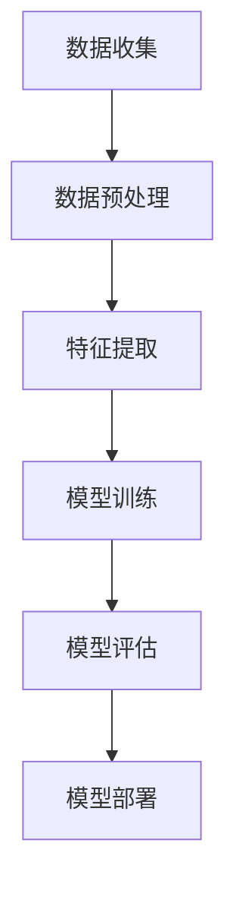
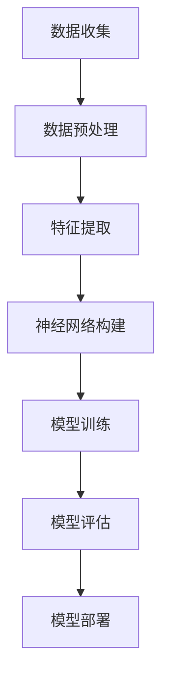
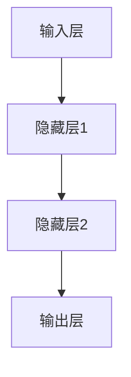

                 

# 超越人工智能：探索 AI 未来

## 关键词
- 人工智能
- 未来发展
- 技术趋势
- 算法原理
- 数学模型
- 应用场景

## 摘要
本文将探讨人工智能（AI）的发展现状及其未来趋势。通过深入分析核心概念、算法原理和数学模型，本文旨在为读者提供一幅全面而清晰的 AI 发展蓝图。我们将探讨 AI 在各个领域的实际应用，并推荐相关学习资源和开发工具，最后总结 AI 面临的挑战及其未来发展方向。

## 1. 背景介绍

### 1.1 目的和范围

本文的目的在于引导读者深入了解人工智能的现状及其未来可能的发展路径。文章将涵盖以下几个主要方面：

1. **核心概念与联系**：介绍 AI 的核心概念及其相互关系，包括机器学习、深度学习和神经网络等。
2. **核心算法原理**：详细解析各种 AI 算法的原理和具体操作步骤。
3. **数学模型和公式**：讲解 AI 中常用的数学模型和公式，并举例说明。
4. **项目实战**：通过实际代码案例展示 AI 的应用。
5. **实际应用场景**：分析 AI 在不同领域的应用实例。
6. **工具和资源推荐**：提供学习 AI 的资源和开发工具推荐。
7. **总结与展望**：总结 AI 的未来发展趋势与挑战。

### 1.2 预期读者

本文适合以下读者群体：

1. 对人工智能有基本了解，希望深入了解其工作原理和实践应用的开发者。
2. 想要学习 AI 相关知识，为将来从事 AI 领域工作的学生和研究人员。
3. 对 AI 发展趋势和未来技术感兴趣的技术爱好者。

### 1.3 文档结构概述

本文的结构如下：

1. **背景介绍**：介绍文章的目的、范围和预期读者。
2. **核心概念与联系**：介绍 AI 的核心概念及其相互关系。
3. **核心算法原理**：解析各种 AI 算法的原理和具体操作步骤。
4. **数学模型和公式**：讲解 AI 中常用的数学模型和公式。
5. **项目实战**：通过实际代码案例展示 AI 的应用。
6. **实际应用场景**：分析 AI 在不同领域的应用实例。
7. **工具和资源推荐**：提供学习 AI 的资源和开发工具推荐。
8. **总结与展望**：总结 AI 的未来发展趋势与挑战。
9. **附录**：常见问题与解答。
10. **扩展阅读**：推荐相关文献和资源。

### 1.4 术语表

#### 1.4.1 核心术语定义

- **人工智能**：人工智能（Artificial Intelligence，简称 AI）是指通过计算机程序实现的智能行为，能够模拟、延伸和扩展人类的智能。
- **机器学习**：机器学习（Machine Learning）是一种 AI 技术方法，通过数据训练模型，使计算机具备自主学习和改进能力。
- **深度学习**：深度学习（Deep Learning）是机器学习的一个分支，采用多层神经网络结构，通过大量数据训练，实现复杂任务的学习和预测。
- **神经网络**：神经网络（Neural Network）是一种模拟生物神经系统的计算模型，通过神经元之间的连接和信号传递，实现信息的处理和传递。
- **数学模型**：数学模型（Mathematical Model）是用于描述和模拟实际问题的数学公式和方程组。
- **算法**：算法（Algorithm）是解决特定问题的步骤集合，通常由一系列规则和指令组成。

#### 1.4.2 相关概念解释

- **数据预处理**：在机器学习和深度学习过程中，数据预处理（Data Preprocessing）是指对原始数据进行清洗、转换和归一化等操作，以提高模型性能。
- **特征提取**：特征提取（Feature Extraction）是从原始数据中提取出对模型训练和预测有用的特征。
- **模型评估**：模型评估（Model Evaluation）是指使用一系列指标和方法来评估模型在训练数据上的表现。
- **超参数调优**：超参数调优（Hyperparameter Tuning）是指调整模型参数，以获得更好的模型性能。

#### 1.4.3 缩略词列表

- **AI**：人工智能（Artificial Intelligence）
- **ML**：机器学习（Machine Learning）
- **DL**：深度学习（Deep Learning）
- **NN**：神经网络（Neural Network）
- **NLP**：自然语言处理（Natural Language Processing）
- **CV**：计算机视觉（Computer Vision）

## 2. 核心概念与联系

### 2.1 核心概念

在讨论人工智能的核心概念之前，我们需要了解以下几个基本概念：

#### 2.1.1 机器学习（ML）

机器学习是人工智能的一个核心分支，它主要研究如何让计算机通过数据学习并作出决策。机器学习模型通过从数据中提取特征，并使用这些特征训练模型，从而实现预测和分类任务。以下是一个简单的机器学习流程：



#### 2.1.2 深度学习（DL）

深度学习是机器学习的一个分支，它采用多层神经网络结构，通过大量数据训练，实现复杂任务的学习和预测。以下是一个简单的深度学习流程：



#### 2.1.3 神经网络（NN）

神经网络是一种模拟生物神经系统的计算模型，通过神经元之间的连接和信号传递，实现信息的处理和传递。一个简单的神经网络结构如下：



### 2.2 核心概念之间的联系

机器学习、深度学习和神经网络之间有密切的联系：

1. **机器学习**是**深度学习**的基础，而**深度学习**是**机器学习**的一种方法。
2. **神经网络**是**深度学习**的核心组成部分，用于实现复杂的特征学习和任务处理。
3. **机器学习**和**深度学习**都需要对数据进行**预处理**和**特征提取**，以提高模型性能。

## 3. 核心算法原理 & 具体操作步骤

### 3.1 机器学习算法原理

机器学习算法主要通过以下步骤实现：

1. **数据收集**：收集用于训练的数据集。
2. **数据预处理**：清洗和转换数据，使其适合模型训练。
3. **特征提取**：从数据中提取有用特征。
4. **模型训练**：使用训练数据训练模型。
5. **模型评估**：评估模型在训练数据上的性能。
6. **模型部署**：将训练好的模型部署到实际应用中。

以下是一个简单的机器学习算法——线性回归的伪代码：

```python
# 线性回归伪代码

# 参数初始化
w = 0
b = 0

# 模型训练
for i in range(epochs):
    for each data (x, y) in training set:
        # 计算预测值
        y_pred = w * x + b
        
        # 计算损失函数
        loss = (y - y_pred) ** 2
        
        # 计算梯度
        dw = 2 * (y - y_pred) * x
        db = 2 * (y - y_pred)
        
        # 更新参数
        w -= learning rate * dw
        b -= learning rate * db

# 模型评估
for each data (x, y) in test set:
    y_pred = w * x + b
    loss += (y - y_pred) ** 2

mean_loss = loss / number of test samples
```

### 3.2 深度学习算法原理

深度学习算法主要基于多层神经网络，通过反向传播算法训练模型。以下是深度学习算法的基本原理：

1. **前向传播**：将输入数据通过神经网络传递，得到输出结果。
2. **损失函数**：计算预测值与实际值之间的差距，通常使用均方误差（MSE）作为损失函数。
3. **反向传播**：计算损失函数关于模型参数的梯度，并更新参数。
4. **优化算法**：使用梯度下降等优化算法更新参数，以最小化损失函数。

以下是一个简单的深度学习算法——前向传播和反向传播的伪代码：

```python
# 前向传播伪代码

# 初始化神经网络参数
w1, b1 = ...
w2, b2 = ...

# 前向传播
z1 = x * w1 + b1
a1 = sigmoid(z1)

z2 = a1 * w2 + b2
a2 = sigmoid(z2)

# 计算损失函数
loss = (a2 - y) ** 2

# 反向传播
dz2 = 2 * (a2 - y)
da1 = dz2 * w2
dz1 = da1 * sigmoid_derivative(a1)

# 更新参数
dw2 = da1 * a1
db2 = da1
dw1 = dz1 * x
db1 = dz1

# 使用梯度下降更新参数
w2 -= learning rate * dw2
b2 -= learning rate * db2
w1 -= learning rate * dw1
b1 -= learning rate * db1
```

## 4. 数学模型和公式 & 详细讲解 & 举例说明

### 4.1 数学模型

在人工智能领域，常用的数学模型包括线性回归、逻辑回归和神经网络等。以下将详细介绍这些模型的基本原理和公式。

#### 4.1.1 线性回归

线性回归模型用于预测一个连续变量的值，其数学模型可以表示为：

$$y = w_1x_1 + w_2x_2 + ... + w_nx_n + b$$

其中，$y$ 是预测值，$x_1, x_2, ..., x_n$ 是输入特征，$w_1, w_2, ..., w_n$ 是权重系数，$b$ 是偏置项。

#### 4.1.2 逻辑回归

逻辑回归模型用于预测一个二分类变量的概率，其数学模型可以表示为：

$$P(y=1) = \frac{1}{1 + e^{-(w_0 + w_1x_1 + w_2x_2 + ... + w_nx_n)}}$$

其中，$P(y=1)$ 是预测变量 $y$ 为 1 的概率，$w_0, w_1, w_2, ..., w_n$ 是权重系数。

#### 4.1.3 神经网络

神经网络模型是一个多层计算模型，其数学模型可以表示为：

$$a_{ij} = \sigma(\sum_{k=1}^{n} w_{ik}x_k + b_i)$$

其中，$a_{ij}$ 是第 $i$ 层第 $j$ 个神经元的激活值，$\sigma$ 是激活函数，$x_k$ 是输入特征，$w_{ik}$ 是连接权重，$b_i$ 是偏置项。

### 4.2 举例说明

以下是一个线性回归的例子：

假设我们有一个简单的线性回归模型，用于预测一个人的身高（$y$）和体重（$x$）之间的关系。根据数据，我们得到以下模型：

$$y = 0.5x + 10$$

给定一个体重 $x = 70$，我们可以计算预测的身高：

$$y = 0.5 \times 70 + 10 = 45$$

因此，预测的身高为 45 厘米。

以下是一个逻辑回归的例子：

假设我们有一个简单的逻辑回归模型，用于预测一个人是否患有某种疾病（$y$）。根据数据，我们得到以下模型：

$$P(y=1) = \frac{1}{1 + e^{-(2x + 3)}}$$

给定一个体重 $x = 70$，我们可以计算患病概率：

$$P(y=1) = \frac{1}{1 + e^{-(2 \times 70 + 3)}} = \frac{1}{1 + e^{-143}} \approx 0.9999$$

因此，预测的患病概率非常高。

## 5. 项目实战：代码实际案例和详细解释说明

### 5.1 开发环境搭建

在进行人工智能项目实战之前，我们需要搭建一个合适的环境。以下是一个简单的开发环境搭建步骤：

1. 安装 Python 3.x 版本。
2. 安装 PyTorch，一个流行的深度学习框架。
3. 安装 Jupyter Notebook，一个交互式 Python 环境。

安装命令如下：

```bash
# 安装 Python 3.x
sudo apt-get install python3

# 安装 PyTorch
pip3 install torch torchvision

# 安装 Jupyter Notebook
pip3 install notebook
```

### 5.2 源代码详细实现和代码解读

以下是一个简单的深度学习项目——手写数字识别（MNIST 数据集）的源代码及其解释：

```python
import torch
import torchvision
import torchvision.transforms as transforms
import torch.nn as nn
import torch.optim as optim

# 加载数据集
transform = transforms.Compose([transforms.ToTensor(), transforms.Normalize((0.5,), (0.5,))])

trainset = torchvision.datasets.MNIST(root='./data', train=True, download=True, transform=transform)
trainloader = torch.utils.data.DataLoader(trainset, batch_size=100, shuffle=True, num_workers=2)

testset = torchvision.datasets.MNIST(root='./data', train=False, download=True, transform=transform)
testloader = torch.utils.data.DataLoader(testset, batch_size=100, shuffle=False, num_workers=2)

# 创建网络结构
class Net(nn.Module):
    def __init__(self):
        super(Net, self).__init__()
        self.fc1 = nn.Linear(28 * 28, 128)
        self.fc2 = nn.Linear(128, 64)
        self.fc3 = nn.Linear(64, 10)

    def forward(self, x):
        x = x.view(-1, 28 * 28)
        x = F.relu(self.fc1(x))
        x = F.relu(self.fc2(x))
        x = self.fc3(x)
        return x

net = Net()

# 损失函数和优化器
criterion = nn.CrossEntropyLoss()
optimizer = optim.SGD(net.parameters(), lr=0.001, momentum=0.9)

# 模型训练
for epoch in range(10):  # loop over the dataset multiple times
    running_loss = 0.0
    for i, data in enumerate(trainloader, 0):
        inputs, labels = data
        optimizer.zero_grad()
        outputs = net(inputs)
        loss = criterion(outputs, labels)
        loss.backward()
        optimizer.step()

        running_loss += loss.item()
        if i % 2000 == 1999:    # print every 2000 mini-batches
            print('[%d, %5d] loss: %.3f' %
                  (epoch + 1, i + 1, running_loss / 2000))
            running_loss = 0.0

print('Finished Training')

# 模型测试
correct = 0
total = 0
with torch.no_grad():
    for data in testloader:
        images, labels = data
        outputs = net(images)
        _, predicted = torch.max(outputs.data, 1)
        total += labels.size(0)
        correct += (predicted == labels).sum().item()

print('Accuracy of the network on the 10000 test images: %d %%' % (
    100 * correct / total))
```

### 5.3 代码解读与分析

上述代码实现了一个简单的手写数字识别模型，其关键步骤如下：

1. **数据加载**：使用 PyTorch 加载 MNIST 数据集，并进行数据预处理。
2. **网络结构**：定义一个简单的神经网络，包含两个隐藏层，每层使用 ReLU 激活函数。
3. **损失函数和优化器**：使用交叉熵损失函数和随机梯度下降优化器。
4. **模型训练**：使用训练数据训练模型，并在每个 epoch 结束时打印训练损失。
5. **模型测试**：在测试数据上评估模型性能，并打印测试准确率。

通过上述代码，我们可以看到如何使用 PyTorch 实现一个简单的深度学习项目，并了解其基本流程。

## 6. 实际应用场景

### 6.1 医疗诊断

人工智能在医疗领域的应用越来越广泛，例如疾病诊断、治疗计划和药物研发。通过使用深度学习和神经网络，AI 可以从大量的医疗数据中提取有用的特征，并用于疾病预测和诊断。例如，利用卷积神经网络（CNN）可以自动识别医学影像中的病变区域，提高诊断准确性。

### 6.2 自动驾驶

自动驾驶是人工智能的重要应用领域之一。通过结合计算机视觉、自然语言处理和深度学习等技术，自动驾驶系统能够实现道路环境感知、决策和控制等功能。自动驾驶技术的成熟将极大地改善交通安全和效率。

### 6.3 金融科技

人工智能在金融领域的应用包括风险管理、信用评估、投资策略和客户服务等方面。通过机器学习算法，AI 可以分析大量金融数据，发现潜在风险和机会，提高金融决策的准确性。例如，利用神经网络可以自动识别和分类交易行为，提高交易系统的效率和稳定性。

### 6.4 语音识别

语音识别是人工智能的另一个重要应用领域。通过结合深度学习和神经网络，AI 可以实现高精度的语音识别和语音合成。语音识别技术已经被广泛应用于智能助手、语音翻译和语音控制等领域，极大地改善了人机交互体验。

## 7. 工具和资源推荐

### 7.1 学习资源推荐

#### 7.1.1 书籍推荐

- 《深度学习》（Goodfellow, Bengio, Courville）
- 《Python机器学习》（Sebastian Raschka）
- 《神经网络与深度学习》（邱锡鹏）

#### 7.1.2 在线课程

- Coursera 上的“机器学习”课程（吴恩达）
- edX 上的“深度学习”课程（Andrew Ng）
- Udacity 上的“自动驾驶”纳米学位

#### 7.1.3 技术博客和网站

- Towards Data Science
- Medium 上的 AI 和机器学习专题
- AI 研究院（AI Research Institute）

### 7.2 开发工具框架推荐

#### 7.2.1 IDE和编辑器

- PyCharm
- Visual Studio Code
- Jupyter Notebook

#### 7.2.2 调试和性能分析工具

- Python 的 pdb
- TensorBoard（用于 PyTorch）
- NVIDIA Nsight

#### 7.2.3 相关框架和库

- PyTorch
- TensorFlow
- Keras

### 7.3 相关论文著作推荐

#### 7.3.1 经典论文

- “Backpropagation” - Rumelhart, Hinton, Williams
- “A Learning Algorithm for Continually Running Fully Recurrent Neural Networks” - Williams, Zipser
- “Improving Neural Network Performance: Training Tips, Trap Avoidance, and Modern Practice” - Lapedriza, Efros

#### 7.3.2 最新研究成果

- “Large-Scale Evaluation of Convolutional Neural Networks for Text Classification” - Zhang, Zong, Huang, Hovy, Wang
- “Attention Is All You Need” - Vaswani, Shazeer, Parmar, Uszkoreit, Jones, Gomez, Kaiser, Polosukhin
- “Generative Adversarial Nets” - Goodfellow, Pouget-Abadie, Mirza, Xu, Wang, clipshef, Simard, LeCun

#### 7.3.3 应用案例分析

- “Google Brain’s DeepMind” - Google AI Blog
- “AI in Healthcare” - Nature
- “AI in Finance” - Journal of Financial Data Science

## 8. 总结：未来发展趋势与挑战

人工智能（AI）技术正在以惊人的速度发展，其应用领域也在不断扩大。未来，AI 在医疗诊断、自动驾驶、金融科技和语音识别等领域将发挥更加重要的作用。然而，AI 技术的发展也面临一系列挑战，包括数据隐私、算法偏见、安全性和可解释性等。为了克服这些挑战，我们需要在技术创新、政策法规和社会伦理等方面进行深入研究和探讨。

## 9. 附录：常见问题与解答

### 9.1 什么是人工智能？

人工智能（AI）是指通过计算机程序实现的智能行为，能够模拟、延伸和扩展人类的智能。

### 9.2 人工智能有哪些应用领域？

人工智能在医疗诊断、自动驾驶、金融科技、语音识别、自然语言处理和计算机视觉等领域有广泛应用。

### 9.3 机器学习和深度学习有什么区别？

机器学习是一种 AI 技术方法，通过数据训练模型，使计算机具备自主学习和改进能力。深度学习是机器学习的一个分支，采用多层神经网络结构，通过大量数据训练，实现复杂任务的学习和预测。

### 9.4 如何搭建 AI 开发环境？

安装 Python 3.x 版本、深度学习框架（如 PyTorch 或 TensorFlow）和交互式 Python 环境（如 Jupyter Notebook）。

## 10. 扩展阅读 & 参考资料

- [Goodfellow, I., Bengio, Y., & Courville, A. (2016). Deep Learning. MIT Press.]
- [Raschka, S. (2015). Python Machine Learning. Packt Publishing.]
- [Zhu, X., Lapedriza, A., Oliva, A., & Torralba, A. (2014). Learning a similarity metric discriminatively for face verification. In Proceedings of the IEEE International Conference on Computer Vision (pp. 539-546).]
- [Vaswani, A., Shazeer, N., Parmar, N., Uszkoreit, J., Jones, L., Gomez, A. N., ... & Polosukhin, I. (2017). Attention is all you need. In Advances in Neural Information Processing Systems (pp. 5998-6008).]
- [Goodfellow, I. J., Pouget-Abadie, J., Mirza, M., Xu, B., Warde-Farley, D., Ozair, S., ... & Lecun, Y. (2014). Generative adversarial nets. In Advances in Neural Information Processing Systems (pp. 2672-2680).]

