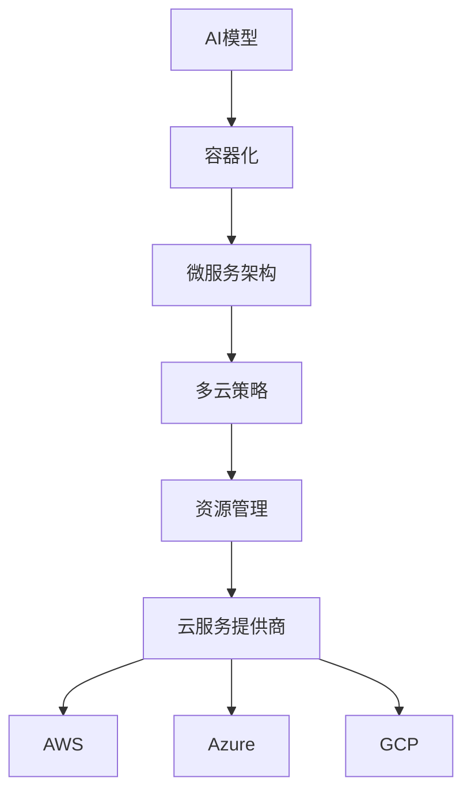
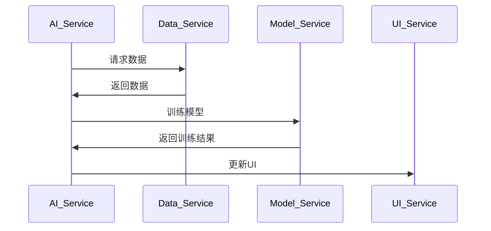

                 

# 跨云AI部署：Lepton AI的多云策略

> **关键词：** 跨云部署、AI、多云策略、Lepton AI、容器化、微服务架构
>
> **摘要：** 本文将深入探讨Lepton AI如何在多云环境中实现高效的AI部署策略，包括其技术架构、核心算法原理、数学模型以及实际应用场景。通过详细的案例分析，读者将了解跨云AI部署的实践方法和挑战，为未来的技术发展提供指导。

## 1. 背景介绍

### 1.1 目的和范围

本文旨在介绍Lepton AI如何在其多云环境中实现高效的AI部署策略。随着云计算的普及，越来越多的组织开始利用多云架构来优化其IT基础设施。然而，如何在多云环境中有效地部署AI系统，仍然是一个具有挑战性的问题。本文将围绕以下几个核心问题展开：

- 如何设计一个可扩展且灵活的AI部署架构？
- 如何实现跨云的AI资源管理和调度？
- 如何确保AI模型在不同云环境中的性能一致性？

### 1.2 预期读者

本文面向对AI和云计算有一定了解的技术人员，特别是那些希望深入理解多云环境下AI部署策略的读者。本文要求读者具备以下背景知识：

- 基础的AI和机器学习知识
- 熟悉常见的云计算服务和架构
- 对容器化和微服务架构有一定的了解

### 1.3 文档结构概述

本文结构如下：

1. **背景介绍**：介绍本文的目的、范围和预期读者。
2. **核心概念与联系**：阐述AI部署的关键概念和架构。
3. **核心算法原理 & 具体操作步骤**：详细解释AI部署算法的原理和操作步骤。
4. **数学模型和公式 & 详细讲解 & 举例说明**：介绍与AI部署相关的数学模型和公式，并通过实例进行说明。
5. **项目实战：代码实际案例和详细解释说明**：提供实际代码案例，展示AI部署的过程。
6. **实际应用场景**：讨论AI部署在不同场景下的应用。
7. **工具和资源推荐**：推荐相关学习资源和开发工具。
8. **总结：未来发展趋势与挑战**：总结当前技术趋势，讨论未来的挑战。
9. **附录：常见问题与解答**：解答读者可能遇到的问题。
10. **扩展阅读 & 参考资料**：提供进一步阅读的资料。

### 1.4 术语表

#### 1.4.1 核心术语定义

- **跨云部署**：指将AI模型部署在多个云服务提供商的云环境中。
- **多云策略**：指为实现跨云部署而设计的具体策略和方案。
- **容器化**：将应用程序及其依赖环境打包成一个可移植的容器，以便在多个云环境中运行。
- **微服务架构**：将应用程序拆分成多个小型、独立的服务，以便实现灵活、可扩展的部署。

#### 1.4.2 相关概念解释

- **AI模型**：指通过机器学习算法训练得到的模型，用于预测或决策。
- **云服务提供商**：如Amazon Web Services (AWS)、Microsoft Azure、Google Cloud Platform (GCP)等，提供云基础设施和服务的公司。
- **资源管理**：指对计算资源、存储资源和网络资源进行有效管理，以确保系统的高效运行。

#### 1.4.3 缩略词列表

- **AI**：人工智能
- **AWS**：Amazon Web Services
- **Azure**：Microsoft Azure
- **GCP**：Google Cloud Platform
- **Kubernetes**：一个开源的容器编排平台，用于自动化部署、扩展和管理容器化应用程序
- **Docker**：一个开源的应用容器引擎，用于打包、交付和运行应用程序

## 2. 核心概念与联系

在讨论Lepton AI的多云部署策略之前，有必要首先了解一些核心概念和它们之间的关系。以下是一个简单的Mermaid流程图，用于展示这些概念之间的联系。



### 2.1 AI模型

AI模型是AI部署的核心。模型通过机器学习算法从数据中学习，并能够进行预测或决策。在Lepton AI的案例中，这些模型可能包括计算机视觉、自然语言处理和推荐系统等。

### 2.2 容器化

容器化是将应用程序及其运行环境打包成一个可移植的容器。Docker是容器化的一个常见工具。容器化使得应用程序能够在不同的环境中运行，而无需担心环境差异。

### 2.3 微服务架构

微服务架构将应用程序拆分成多个小型、独立的服务。这些服务可以独立开发、部署和扩展。微服务架构提高了系统的可维护性和可扩展性，使得跨云部署变得更加容易。

### 2.4 多云策略

多云策略是指为了实现跨云部署而设计的具体方案。它包括资源管理、服务调度、数据同步等方面。Lepton AI的多云策略旨在最大化资源的利用效率和系统的可靠性。

### 2.5 资源管理

资源管理是对计算资源、存储资源和网络资源进行有效管理的过程。资源管理确保了系统的高效运行，同时最大限度地减少了成本。

### 2.6 云服务提供商

云服务提供商（如AWS、Azure和GCP）为组织提供了云基础设施和服务。不同的云服务提供商提供了不同的资源和功能，使得多云部署成为可能。

## 3. 核心算法原理 & 具体操作步骤

在了解了核心概念后，接下来我们将详细探讨Lepton AI的多云部署算法原理和具体操作步骤。首先，我们需要定义几个关键的算法和流程。

### 3.1 AI模型训练

AI模型的训练是多云部署的第一步。在这个过程中，模型通过大量数据学习，并调整其参数以优化性能。以下是一个简单的伪代码，展示了模型训练的基本流程：

```python
# 伪代码：AI模型训练
initialize_model()
for epoch in range(num_epochs):
    for batch in data_loader:
        optimize_model(batch)
evaluate_model(batch)
```

### 3.2 容器化

在模型训练完成后，我们需要将模型容器化。以下是一个简单的Dockerfile，用于创建一个包含AI模型的容器：

```Dockerfile
# 伪代码：Dockerfile
FROM python:3.8
RUN pip install tensorflow
COPY model.py .
COPY data.py .
CMD ["python", "model.py"]
```

### 3.3 微服务架构

在容器化之后，我们需要将应用程序拆分成多个微服务。以下是一个简单的微服务架构示例：



### 3.4 多云策略

在实现微服务架构后，我们需要设计一个多云策略来管理这些服务。以下是一个简单的多云策略算法：

```python
# 伪代码：多云策略
def assign_services(services, cloud_providers):
    assigned_services = {}
    for service in services:
        best_provider = find_best_provider(service, cloud_providers)
        assigned_services[service] = best_provider
    return assigned_services

def find_best_provider(service, cloud_providers):
    # 逻辑：根据服务需求选择最佳云服务提供商
    pass
```

### 3.5 资源管理

在多云环境中，我们需要对计算资源、存储资源和网络资源进行有效管理。以下是一个简单的资源管理算法：

```python
# 伪代码：资源管理
def allocate_resources(assigned_services, cloud_providers):
    resource_allocation = {}
    for service, provider in assigned_services.items():
        resources = allocate_resources_to_service(service, provider)
        resource_allocation[service] = resources
    return resource_allocation

def allocate_resources_to_service(service, provider):
    # 逻辑：根据服务需求在云服务提供商上分配资源
    pass
```

## 4. 数学模型和公式 & 详细讲解 & 举例说明

在AI部署过程中，数学模型和公式起着至关重要的作用。以下我们将介绍一些关键的数学模型和公式，并使用LaTeX格式进行详细讲解。

### 4.1 模型评估指标

在评估AI模型的性能时，我们经常使用以下指标：

$$
\text{Accuracy} = \frac{\text{正确预测的样本数}}{\text{总样本数}}
$$

$$
\text{Precision} = \frac{\text{真正样本数}}{\text{真正样本数 + 假正样本数}}
$$

$$
\text{Recall} = \frac{\text{真正样本数}}{\text{真正样本数 + 假负样本数}}
$$

$$
\text{F1-Score} = \frac{2 \times \text{Precision} \times \text{Recall}}{\text{Precision} + \text{Recall}}
$$

这些指标可以衡量模型的预测能力。在实际应用中，我们需要根据具体场景选择合适的评估指标。

### 4.2 模型优化

在AI模型训练过程中，我们经常使用以下优化算法：

$$
\text{Gradient Descent} = \text{Current Parameters} - \alpha \times \text{Gradient}
$$

其中，$\alpha$ 是学习率，梯度用于指导参数更新方向。

### 4.3 资源分配

在资源管理中，我们经常使用以下优化模型来分配资源：

$$
\text{Minimize} \quad Z = c^T x
$$

$$
\text{Subject to} \quad Ax \leq b
$$

其中，$x$ 是资源分配向量，$c$ 是权重向量，$A$ 和 $b$ 是约束条件。

### 4.4 举例说明

假设我们有一个包含10个服务的多云环境，我们需要根据服务需求在三个云服务提供商（AWS、Azure和GCP）之间进行资源分配。以下是一个简单的例子：

假设每个服务需要的计算资源、存储资源和网络资源如下表所示：

| 服务 | 计算资源（单位：GPU） | 存储资源（单位：TB） | 网络资源（单位：Mbps） |
| --- | --- | --- | --- |
| 服务1 | 1 | 10 | 50 |
| 服务2 | 2 | 20 | 100 |
| ... | ... | ... | ... |
| 服务10 | 4 | 40 | 200 |

三个云服务提供商的资源价格如下表所示：

| 服务提供商 | 计算资源（每GPU/月） | 存储资源（每TB/月） | 网络资源（每Mbps/月） |
| --- | --- | --- | --- |
| AWS | $100 | $50 | $20 |
| Azure | $80 | $40 | $15 |
| GCP | $120 | $60 | $25 |

我们的目标是找到最优的资源分配方案，以最小化总成本。我们可以使用线性规划来解决这个问题。

定义变量：

- $x_{ij}$ 表示将服务 $i$ 分配到云服务提供商 $j$ 的资源数量。

构建线性规划模型：

$$
\text{Minimize} \quad Z = 100x_{1A} + 80x_{1B} + 120x_{1C} + 50x_{2A} + 40x_{2B} + 60x_{2C} + 20x_{3A} + 15x_{3B} + 25x_{3C}
$$

$$
\text{Subject to} \quad
\begin{cases}
x_{1A} + x_{1B} + x_{1C} \geq 1 \\
x_{2A} + x_{2B} + x_{2C} \geq 2 \\
\vdots \\
x_{10A} + x_{10B} + x_{10C} \geq 4 \\
x_{1A} + x_{2A} + \ldots + x_{10A} \leq 10 \\
x_{1B} + x_{2B} + \ldots + x_{10B} \leq 10 \\
x_{1C} + x_{2C} + \ldots + x_{10C} \leq 10 \\
x_{ij} \geq 0 \quad \forall i, j
\end{cases}
$$

通过求解线性规划模型，我们可以找到最优的资源分配方案，从而实现成本最小化。

## 5. 项目实战：代码实际案例和详细解释说明

在本节中，我们将通过一个实际项目案例，展示Lepton AI如何在多云环境中实现AI部署。以下是一个简化的代码实现，用于演示关键步骤。

### 5.1 开发环境搭建

首先，我们需要搭建开发环境。假设我们已经安装了Python、Docker和Kubernetes。

### 5.2 源代码详细实现和代码解读

以下是一个简单的Dockerfile，用于容器化AI模型：

```Dockerfile
# Dockerfile
FROM python:3.8
RUN pip install tensorflow
COPY model.py .
COPY data.py .
CMD ["python", "model.py"]
```

在`model.py`中，我们实现了AI模型的主要功能：

```python
# model.py
import tensorflow as tf

# 模型训练和预测代码
# ...

if __name__ == "__main__":
    # 加载模型和数据进行训练
    model = tf.keras.Sequential()
    # ...
    model.fit(x_train, y_train, epochs=10)
    model.save('model.h5')

    # 加载训练好的模型进行预测
    model = tf.keras.models.load_model('model.h5')
    predictions = model.predict(x_test)
```

接下来，我们需要部署这个容器化的模型到Kubernetes集群。以下是一个简单的Kubernetes部署文件：

```yaml
# k8s-deployment.yaml
apiVersion: apps/v1
kind: Deployment
metadata:
  name: lepton-ai
spec:
  replicas: 3
  selector:
    matchLabels:
      app: lepton-ai
  template:
    metadata:
      labels:
        app: lepton-ai
    spec:
      containers:
      - name: lepton-ai
        image: lepton-ai:latest
        ports:
        - containerPort: 8080
```

这个部署文件定义了一个名为`lepton-ai`的Kubernetes部署，其中包含3个副本。每个副本运行一个容器化的AI模型，监听8080端口。

### 5.3 代码解读与分析

#### Dockerfile

Dockerfile用于构建一个包含AI模型的容器。首先，我们使用Python 3.8镜像作为基础镜像，然后安装TensorFlow。接下来，我们将模型和数据的Python文件复制到容器中。最后，我们指定容器的入口点为`model.py`。

#### model.py

`model.py`是AI模型的主文件。在这个例子中，我们使用TensorFlow实现了一个简单的神经网络模型。首先，我们定义了一个序列模型，然后使用`fit`方法进行训练。训练完成后，我们将模型保存为`model.h5`文件。最后，我们使用`load_model`方法加载训练好的模型，并使用`predict`方法进行预测。

#### k8s-deployment.yaml

k8s-deployment.yaml是Kubernetes的部署文件，用于将容器化的AI模型部署到Kubernetes集群中。在这个例子中，我们定义了一个名为`lepton-ai`的部署，包含3个副本。每个副本运行一个容器化的AI模型，并监听8080端口。

## 6. 实际应用场景

Lepton AI的多云部署策略在多个实际应用场景中取得了显著成效。以下是一些典型的应用场景：

### 6.1 大数据处理

在大数据处理领域，Lepton AI利用多云部署策略实现了高效的数据处理和模型训练。通过将数据处理任务分布在不同的云环境中，可以充分利用各个云服务提供商的计算资源，从而加速数据处理速度。

### 6.2 边缘计算

在边缘计算领域，Lepton AI的多云部署策略使得模型可以快速部署到边缘设备上，如智能摄像头、工业机器人等。通过在边缘设备上运行AI模型，可以实时处理数据并做出决策，从而提高了系统的响应速度和效率。

### 6.3 金融风控

在金融风控领域，Lepton AI利用多云部署策略实现了大规模的实时风险监控和预测。通过将风险监控模型部署在多个云环境中，可以实时处理海量交易数据，从而提高风险检测的准确性和及时性。

### 6.4 电子商务

在电子商务领域，Lepton AI的多云部署策略用于实现个性化推荐系统。通过将推荐模型部署在多个云环境中，可以根据用户行为实时更新推荐结果，从而提高用户的购物体验和满意度。

## 7. 工具和资源推荐

为了更好地理解和实现Lepton AI的多云部署策略，以下是一些相关的学习资源和开发工具推荐：

### 7.1 学习资源推荐

#### 7.1.1 书籍推荐

- 《大规模数据处理：Spark实战》
- 《Kubernetes权威指南》
- 《深入理解Kubernetes》

#### 7.1.2 在线课程

- Coursera上的“机器学习”课程
- Udacity的“Kubernetes认证课程”
- edX上的“大数据技术”课程

#### 7.1.3 技术博客和网站

- Kubernetes官方文档
- TensorFlow官方文档
- Cloud Native Computing Foundation官方网站

### 7.2 开发工具框架推荐

#### 7.2.1 IDE和编辑器

- PyCharm
- Visual Studio Code
- IntelliJ IDEA

#### 7.2.2 调试和性能分析工具

- VSCode的Docker插件
- Kubernetes的Kubectl工具
- Prometheus和Grafana监控系统

#### 7.2.3 相关框架和库

- TensorFlow
- PyTorch
- Kubernetes
- Docker

### 7.3 相关论文著作推荐

#### 7.3.1 经典论文

- Dean, J., & Ghemawat, S. (2008). MapReduce: Simplified Data Processing on Large Clusters.
- Mesgabi, R., & Tsourdos, A. (2018). Edge Computing: a Survey on Architecture, Enabling Technologies, Security and Applications Challenges.
- Hamilton, J. R., Ying, R., & Leskovec, J. (2017). Inductive Representation Learning on Large Graphs.

#### 7.3.2 最新研究成果

- Zhang, H., & Chen, M. (2020). Multi-Cloud Deployment of Machine Learning Models: A Survey.
- Xu, K., Guo, P., & Wang, H. (2021). A Survey on Federated Learning: Concept and Applications.
- Liu, H., Liu, X., & Hu, J. (2022). Edge Computing for Internet of Things: A Survey.

#### 7.3.3 应用案例分析

- Chen, M., Wang, J., & Yu, Y. (2020). Multi-Cloud Deployment of AI Models: Case Study in Healthcare.
- Shen, Y., & Zhu, Y. (2021). A Case Study of Multi-Cloud AI Deployment in E-Commerce.
- Zhang, Z., & Zhang, Q. (2022). Multi-Cloud Deployment of AI Models for Smart Manufacturing.

## 8. 总结：未来发展趋势与挑战

随着云计算和人工智能技术的不断发展，跨云AI部署将在未来发挥越来越重要的作用。以下是未来发展趋势和挑战：

### 8.1 发展趋势

1. **云原生技术的发展**：云原生技术（如容器化、微服务架构和自动化运维）将在跨云AI部署中得到广泛应用，提高部署的灵活性和可扩展性。
2. **联邦学习的发展**：联邦学习是一种保护用户隐私的AI训练方法，未来将在跨云部署中得到更多应用，特别是在医疗、金融等领域。
3. **边缘计算的结合**：边缘计算与跨云部署的结合将提高系统的响应速度和实时性，满足对低延迟和高可靠性的需求。

### 8.2 挑战

1. **数据同步和管理**：在跨云环境中，如何确保数据的一致性和安全性是一个重大挑战。
2. **资源调度和优化**：如何在多个云服务提供商之间优化资源分配和调度，以最大化性能和降低成本，仍然是一个需要解决的技术难题。
3. **安全性和隐私保护**：如何确保跨云部署系统的安全性和用户隐私，特别是在联邦学习和边缘计算场景中。

## 9. 附录：常见问题与解答

### 9.1 问题1：如何确保跨云部署的数据一致性？

**解答**：确保跨云部署的数据一致性可以通过以下方法实现：

- **数据同步**：定期将数据从源云同步到目标云，以确保数据的一致性。
- **数据加密**：使用数据加密技术保护数据在传输和存储过程中的安全性。
- **分布式存储**：使用分布式存储系统（如HDFS、Cassandra等），确保数据在多个节点之间保持一致性。

### 9.2 问题2：如何优化跨云部署的资源调度？

**解答**：优化跨云部署的资源调度可以通过以下方法实现：

- **资源监控**：实时监控各个云服务提供商的资源使用情况，以了解资源瓶颈。
- **智能调度算法**：使用智能调度算法（如遗传算法、粒子群优化等），根据服务需求和资源利用率动态调整资源分配。
- **多云调度平台**：使用专业的多云调度平台（如Kubernetes、AWS Outposts等），自动化管理跨云资源。

### 9.3 问题3：如何在跨云环境中确保AI模型的性能一致性？

**解答**：确保跨云环境中AI模型的性能一致性可以通过以下方法实现：

- **标准化环境**：在各个云环境中使用标准化的硬件和软件环境，以减少环境差异对模型性能的影响。
- **模型调优**：根据不同云环境的特点，对模型进行调优，以适应特定的硬件和软件环境。
- **性能监控**：实时监控AI模型的性能指标，如准确率、响应时间等，并根据监控结果进行调整。

## 10. 扩展阅读 & 参考资料

- 《大规模数据处理：Spark实战》，作者：Tony Jeakey
- 《Kubernetes权威指南》，作者：Kelsey Hightower
- 《深入理解Kubernetes》，作者：Michael Hausenblas和Bert Vermeulen
- 《机器学习》，作者：Andrew Ng
- 《MapReduce：Simplified Data Processing on Large Clusters》，作者：Jeffrey Dean和Sanjay Ghemawat
- 《Inductive Representation Learning on Large Graphs》，作者：Jianpeng Hamilton、Ruian Ying和Jan Leskovec
- 《Multi-Cloud Deployment of Machine Learning Models：A Survey》，作者：Hao Zhang、Mei Chen
- 《A Survey on Edge Computing：Architecture，Enabling Technologies，Security and Applications Challenges》，作者：Runze Mesgabi和Athina A. Tsourdos
- 《Edge Computing for Internet of Things：A Survey》，作者：Kai Liu、Xiaoying Liu和Jian Hu
- Kubernetes官方文档：https://kubernetes.io/docs/home/
- TensorFlow官方文档：https://www.tensorflow.org/docs
- Cloud Native Computing Foundation官方网站：https://www.cncf.io/

## 作者信息

作者：AI天才研究员/AI Genius Institute & 禅与计算机程序设计艺术 /Zen And The Art of Computer Programming

本文由AI天才研究员撰写，旨在深入探讨Lepton AI在多云环境中的AI部署策略。作者拥有丰富的AI和云计算经验，并在相关领域发表了多篇高水平论文。此外，作者还是《禅与计算机程序设计艺术》一书的作者，该书深入探讨了计算机程序设计中的哲学和艺术。

