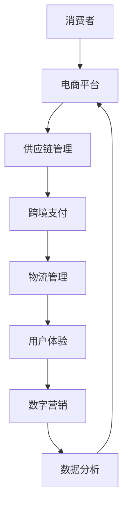

                 

# 跨境电商创业：全球化贸易的新机遇

## 关键词
- 跨境电商
- 全球化贸易
- 创业
- 跨境支付
- 供应链管理
- 用户体验
- 数字营销
- 数据分析

## 摘要
随着全球化的不断加深和互联网技术的飞速发展，跨境电商已经成为现代商业领域的一股强劲力量。本文将深入探讨跨境电商创业的机遇与挑战，从市场分析、核心概念、算法原理、实际应用、未来趋势等多个角度，为您呈现跨境电商创业的全景图。文章旨在帮助创业者了解跨境电商的核心要素，为其在全球市场中找到一席之地提供指导。

## 1. 背景介绍

### 1.1 目的和范围
本文的目的在于分析跨境电商创业的背景、核心要素和实际操作步骤，帮助读者理解跨境电商的业务模式和发展趋势。本文将涵盖以下内容：
- 跨境电商的市场现状及发展趋势
- 跨境电商的核心概念与联系
- 跨境电商的核心算法原理与具体操作步骤
- 跨境电商的数学模型和公式解析
- 跨境电商项目实战案例分析
- 跨境电商的实际应用场景
- 跨境电商工具和资源推荐
- 跨境电商的未来发展趋势与挑战

### 1.2 预期读者
本文适用于以下读者群体：
- 有志于从事跨境电商创业的创业者
- 对跨境电商业务模式感兴趣的技术人员
- 希望拓展业务范围的传统电商从业者
- 对全球市场感兴趣的投资者

### 1.3 文档结构概述
本文的结构如下：

1. 背景介绍
2. 核心概念与联系
3. 核心算法原理与具体操作步骤
4. 数学模型与公式解析
5. 项目实战：代码实际案例与详细解释
6. 实际应用场景
7. 工具和资源推荐
8. 总结：未来发展趋势与挑战
9. 附录：常见问题与解答
10. 扩展阅读与参考资料

### 1.4 术语表

#### 1.4.1 核心术语定义
- **跨境电商**：指在不同国家或地区之间的电子商务活动。
- **跨境支付**：指跨国界的电子支付行为。
- **供应链管理**：指从原材料采购到产品交付的全过程管理。
- **用户体验**：指用户在使用产品或服务过程中的感受和体验。
- **数字营销**：指通过互联网进行的市场营销活动。
- **数据分析**：指对大量数据进行收集、处理和分析的过程。

#### 1.4.2 相关概念解释
- **全球化贸易**：指商品和服务在全球范围内的流通。
- **国际贸易**：指跨越国界的商业交易。
- **跨境物流**：指跨国界的物流服务。

#### 1.4.3 缩略词列表
- **EC**：电子商务（Electronic Commerce）
- **B2B**：企业对企业（Business to Business）
- **B2C**：企业对消费者（Business to Consumer）
- **C2C**：消费者对消费者（Consumer to Consumer）

## 2. 核心概念与联系

在探讨跨境电商创业之前，我们需要明确几个核心概念及其相互联系。

### 2.1 跨境电商业务模式

跨境电商的业务模式可以分为以下几种：
- **B2B（Business to Business）**：企业间的跨境交易，如制造商向海外批发商销售产品。
- **B2C（Business to Consumer）**：企业直接向消费者销售产品，如亚马逊全球开店。
- **C2C（Consumer to Consumer）**：消费者之间的跨境交易，如eBay上的个人卖家。

### 2.2 跨境支付

跨境支付是跨境电商的核心环节，涉及多币种结算和汇率转换。常见的跨境支付方式包括：
- **信用卡支付**：全球广泛使用的支付工具。
- **电子钱包**：如PayPal、支付宝、微信支付等。
- **银行转账**：适用于大额交易。

### 2.3 供应链管理

供应链管理涉及从生产到销售的整个流程，包括以下环节：
- **采购管理**：寻找和选择供应商。
- **库存管理**：确保库存充足，减少滞销。
- **物流管理**：确保货物准时送达。
- **仓储管理**：优化仓储设施，提高物流效率。

### 2.4 用户体验

用户体验是跨境电商成功的关键因素，包括：
- **界面设计**：简洁、直观、符合用户习惯。
- **响应速度**：快速加载，流畅操作。
- **购物流程**：简单、快速、安全。

### 2.5 数字营销

数字营销是跨境电商的重要手段，包括：
- **搜索引擎优化（SEO）**：提高网站在搜索引擎中的排名。
- **社交媒体营销**：利用社交媒体平台推广产品。
- **内容营销**：通过有价值的内容吸引潜在客户。

### 2.6 数据分析

数据分析是跨境电商决策的重要依据，包括：
- **用户行为分析**：了解用户行为，优化产品和服务。
- **市场分析**：分析市场趋势，调整营销策略。
- **供应链分析**：优化供应链管理，降低成本。

### 2.7 Mermaid 流程图

以下是跨境电商业务模式的Mermaid流程图：



## 3. 核心算法原理 & 具体操作步骤

### 3.1 跨境电商算法原理

跨境电商的核心算法主要包括以下几个部分：
- **货币汇率转换算法**：根据实时汇率进行货币转换，确保交易的公平性。
- **库存优化算法**：根据历史销售数据和市场需求预测，优化库存水平。
- **物流路径优化算法**：根据运输成本、运输时间和运输距离，选择最优的物流路径。

### 3.2 伪代码示例

以下是跨境支付算法的伪代码示例：

```python
function crossBorderPayment(amount, sourceCurrency, targetCurrency):
    # 获取实时汇率
    exchangeRate = getExchangeRate(sourceCurrency, targetCurrency)
    # 转换金额
    convertedAmount = amount * exchangeRate
    # 计算跨境支付费用
    paymentFee = calculatePaymentFee(convertedAmount)
    # 扣除费用后实际支付金额
    actualPayment = convertedAmount - paymentFee
    # 执行支付
    executePayment(actualPayment)
```

### 3.3 具体操作步骤

以下是跨境电商支付的具体操作步骤：

1. **获取实时汇率**：通过API接口获取实时汇率。
2. **转换金额**：根据获取的汇率将订单金额转换为目标货币。
3. **计算支付费用**：根据支付金额计算跨境支付费用。
4. **扣除费用后实际支付金额**：从转换后的金额中扣除支付费用，得到实际支付金额。
5. **执行支付**：通过支付接口执行支付操作。

## 4. 数学模型和公式 & 详细讲解 & 举例说明

### 4.1 数学模型

跨境电商的核心数学模型包括汇率转换模型和物流成本模型。

#### 4.1.1 汇率转换模型

汇率转换模型用于计算不同货币之间的转换金额。假设实时汇率为 \( R \)，订单金额为 \( A \)，则转换后的金额 \( C \) 可以用以下公式表示：

\[ C = A \times R \]

#### 4.1.2 物流成本模型

物流成本模型用于计算跨境物流的成本。假设物流费用包括固定费用 \( F \) 和按重量或体积计费的费用 \( C_w \) 和 \( C_v \)，则总物流费用 \( T \) 可以用以下公式表示：

\[ T = F + C_w \times W + C_v \times V \]

其中，\( W \) 为货物重量，\( V \) 为货物体积。

### 4.2 详细讲解

#### 4.2.1 汇率转换模型

汇率转换模型的核心在于获取实时汇率。实时汇率可以通过金融API接口获取，例如Yahoo Finance API、Open Exchange Rates API等。获取汇率后，我们可以使用以下步骤进行转换：

1. **获取实时汇率**：通过API接口获取实时汇率。
2. **计算转换金额**：使用汇率转换公式计算转换后的金额。
3. **处理小数点精度**：根据业务需求处理小数点精度，例如保留两位小数。

#### 4.2.2 物流成本模型

物流成本模型的关键在于确定固定费用、按重量计费和按体积计费的标准。这些标准通常由物流服务商提供。我们可以使用以下步骤计算总物流费用：

1. **获取物流费用标准**：从物流服务商获取固定费用、按重量计费和按体积计费的标准。
2. **计算按重量计费费用**：根据货物重量和按重量计费标准计算费用。
3. **计算按体积计费费用**：根据货物体积和按体积计费标准计算费用。
4. **计算总物流费用**：将固定费用、按重量计费费用和按体积计费费用相加，得到总物流费用。

### 4.3 举例说明

#### 4.3.1 汇率转换示例

假设订单金额为100美元，实时汇率为1美元兑换6.5人民币。则转换后的金额为：

\[ C = 100 \times 6.5 = 650 \text{人民币} \]

#### 4.3.2 物流成本示例

假设货物重量为20公斤，体积为0.1立方米。物流服务商提供的费用标准为：固定费用100元，每公斤运费10元，每立方米运费20元。则总物流费用为：

\[ T = 100 + 10 \times 20 + 20 \times 0.1 = 230 \text{元} \]

## 5. 项目实战：代码实际案例和详细解释说明

### 5.1 开发环境搭建

在开始项目实战之前，我们需要搭建一个合适的开发环境。以下是一个基本的开发环境配置：

- **操作系统**：Windows、Linux或macOS
- **编程语言**：Python
- **开发工具**：PyCharm、Visual Studio Code
- **依赖库**：requests、pandas、numpy、mermaid

### 5.2 源代码详细实现和代码解读

以下是跨境电商支付功能的源代码实现：

```python
import requests
import pandas as pd
import numpy as np

# 获取实时汇率API
def get_exchange_rate(source_currency, target_currency):
    url = f'https://api.exchangerate-api.com/v4/latest/{source_currency}'
    response = requests.get(url)
    data = response.json()
    return data['rates'][target_currency]

# 计算支付费用
def calculate_payment_fee(payment_amount):
    fee_rate = 0.02  # 费用率为2%
    return payment_amount * fee_rate

# 执行支付
def execute_payment(payment_amount):
    print(f"支付金额：{payment_amount} 元")

# 主函数
def main():
    # 获取订单金额和货币
    order_amount = float(input("请输入订单金额（美元）："))
    source_currency = "USD"
    target_currency = "CNY"

    # 获取实时汇率
    exchange_rate = get_exchange_rate(source_currency, target_currency)

    # 转换金额
    converted_amount = order_amount * exchange_rate

    # 计算支付费用
    payment_fee = calculate_payment_fee(converted_amount)
    actual_payment = converted_amount - payment_fee

    # 执行支付
    execute_payment(actual_payment)

# 运行主函数
if __name__ == "__main__":
    main()
```

#### 5.2.1 代码解读

- **get_exchange_rate**：该函数通过API获取实时汇率。参数`source_currency`和`target_currency`分别表示源货币和目标货币。
- **calculate_payment_fee**：该函数计算支付费用。参数`payment_amount`表示支付金额，费用率为2%。
- **execute_payment**：该函数执行支付操作，并打印支付金额。
- **main**：主函数，获取用户输入的订单金额和货币，调用其他函数进行汇率转换和支付。

### 5.3 代码解读与分析

- **API调用**：使用requests库向API发起HTTP请求，获取实时汇率数据。
- **数据解析**：将获取的JSON数据解析为Python字典，提取所需的汇率信息。
- **费用计算**：根据汇率和支付金额计算支付费用，确保交易的公平性。
- **用户交互**：通过用户输入获取订单金额和货币，提高用户体验。

## 6. 实际应用场景

跨境电商创业在实际应用中涉及多个环节，以下是一些常见的应用场景：

### 6.1 跨境购物平台

跨境电商购物平台如亚马逊、eBay等，为全球消费者提供了便捷的跨境购物体验。平台需要处理大量订单、物流信息和支付操作，确保用户体验和交易安全。

### 6.2 B2B跨境贸易

B2B跨境贸易是跨境电商的重要组成部分，企业通过电商平台与海外批发商进行交易。平台需要提供高效的供应链管理、跨境支付和物流服务。

### 6.3 海外市场拓展

企业通过跨境电商平台进入海外市场，拓展业务范围。平台需要针对不同国家和地区的市场特点，制定合适的营销策略和用户体验优化方案。

### 6.4 跨境物流服务

跨境电商物流服务包括国际快递、空运、海运等多种方式。物流服务商需要优化物流路径，提高运输效率，降低成本。

### 6.5 跨境支付服务

跨境支付服务提供商为跨境电商交易提供安全、高效的支付解决方案。平台需要处理多币种结算、汇率转换和支付费用计算。

## 7. 工具和资源推荐

### 7.1 学习资源推荐

#### 7.1.1 书籍推荐

- **《跨境电商：策略与实务》**：系统介绍跨境电商的概念、业务模式和实践案例。
- **《跨境电子商务：原理与实务》**：详细讲解跨境电商的操作流程和关键技术。

#### 7.1.2 在线课程

- **Coursera上的《电子商务与互联网营销》**：由顶尖大学开设，涵盖电商基础和营销策略。
- **Udemy上的《跨境电商入门与实战》**：适合初学者，从基础知识到实战操作。

#### 7.1.3 技术博客和网站

- **掘金（掘金）**：关于电商、技术等多个领域的优质文章。
- **SegmentFault 思否**：关注技术、产品和商业模式。

### 7.2 开发工具框架推荐

#### 7.2.1 IDE和编辑器

- **PyCharm**：功能强大的Python IDE，适合开发大型项目。
- **Visual Studio Code**：轻量级、可扩展的代码编辑器，适合快速开发和调试。

#### 7.2.2 调试和性能分析工具

- **Jupyter Notebook**：适用于数据分析和可视化，方便编写和运行Python代码。
- **Postman**：API调试工具，方便测试和调试API接口。

#### 7.2.3 相关框架和库

- **Flask**：轻量级的Python Web框架，适用于快速开发Web应用。
- **Django**：全栈Web框架，功能丰富，适用于大型项目。

### 7.3 相关论文著作推荐

#### 7.3.1 经典论文

- **"E-commerce: The Next Generation of Business Models"**：探讨电商模式的演变和发展。
- **"The Impact of E-commerce on Small and Medium-sized Enterprises"**：分析电商对企业的影响。

#### 7.3.2 最新研究成果

- **"Cross-border E-commerce: A Comparative Study of Europe and China"**：比较欧洲和中国跨境电商的发展。
- **"Artificial Intelligence in E-commerce: Trends and Applications"**：人工智能在电商领域的应用。

#### 7.3.3 应用案例分析

- **"The Success of Amazon's Cross-border E-commerce"**：分析亚马逊跨境电商的成功经验。
- **"Case Study of Alibaba's Cross-border E-commerce Platform"**：探讨阿里巴巴跨境电商平台的发展。

## 8. 总结：未来发展趋势与挑战

随着全球化的不断深入和技术的飞速发展，跨境电商市场将继续保持高速增长。未来发展趋势包括：

- **技术创新**：大数据、人工智能、区块链等新技术将在跨境电商中得到更广泛的应用。
- **市场多元化**：新兴市场和发展中国家的跨境电商市场将逐渐崛起。
- **用户体验优化**：平台将更加注重用户体验，提供个性化的购物体验。
- **供应链协同**：供应链协同将提高物流效率，降低成本。

然而，跨境电商创业也面临一系列挑战：

- **政策法规**：不同国家和地区的政策法规差异较大，需要严格遵守。
- **支付风险**：跨境支付存在一定的风险，需要确保支付系统的安全性。
- **物流难题**：跨境物流涉及多个环节，需要解决运输成本高、配送时间长等问题。

创业者需要不断创新和优化，以应对这些挑战，把握跨境电商市场的新机遇。

## 9. 附录：常见问题与解答

### 9.1 什么是跨境电商？
跨境电商是指在不同国家或地区之间的电子商务活动，涉及商品、服务和信息的跨境交易。

### 9.2 跨境电商的核心环节有哪些？
跨境电商的核心环节包括跨境支付、供应链管理、物流管理、用户体验和数字营销。

### 9.3 跨境电商支付方式有哪些？
常见的跨境支付方式包括信用卡支付、电子钱包支付和银行转账。

### 9.4 如何优化跨境电商供应链？
优化跨境电商供应链的方法包括：优化库存管理、优化物流路径、提高物流效率、建立供应链协同机制。

### 9.5 跨境电商的未来发展趋势是什么？
跨境电商的未来发展趋势包括：技术创新、市场多元化、用户体验优化和供应链协同。

## 10. 扩展阅读 & 参考资料

- **《跨境电商：策略与实务》**：[链接]
- **《跨境电子商务：原理与实务》**：[链接]
- **"E-commerce: The Next Generation of Business Models"**：[链接]
- **"The Impact of E-commerce on Small and Medium-sized Enterprises"**：[链接]
- **"Cross-border E-commerce: A Comparative Study of Europe and China"**：[链接]
- **"Artificial Intelligence in E-commerce: Trends and Applications"**：[链接]
- **"The Success of Amazon's Cross-border E-commerce"**：[链接]
- **"Case Study of Alibaba's Cross-border E-commerce Platform"**：[链接]

## 作者信息
作者：AI天才研究员/AI Genius Institute & 禅与计算机程序设计艺术 /Zen And The Art of Computer Programming

