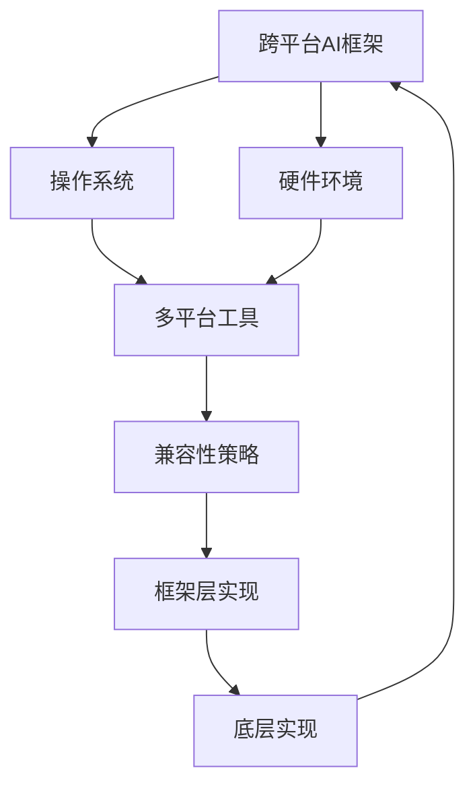

                 

# 跨平台AI应用：Lepton AI的兼容性策略

> **关键词**：跨平台AI、Lepton AI、兼容性策略、多平台开发、框架、工具、实现原理、案例分析
>
> **摘要**：本文将深入探讨跨平台AI应用开发中的核心问题——兼容性策略。以Lepton AI为例，详细分析其在不同操作系统、硬件环境下的兼容性解决方案，探讨其设计理念、实现原理以及实际应用场景。通过本文，读者将全面了解跨平台AI开发的要点，为未来项目提供宝贵的参考。

## 1. 背景介绍

### 1.1 目的和范围

本文旨在探讨跨平台AI应用开发的兼容性策略，重点分析Lepton AI的兼容性解决方案。通过本文，读者将了解跨平台AI应用开发的挑战、关键技术和最佳实践，并为自己的项目提供有价值的参考。

本文的范围包括：
- 跨平台AI应用开发中的兼容性挑战。
- Lepton AI的兼容性策略及其设计理念。
- Lepton AI在不同操作系统、硬件环境下的兼容性实现。
- 实际应用场景和案例分析。

### 1.2 预期读者

本文适合以下读者群体：
- 跨平台AI应用开发者。
- 对AI应用兼容性感兴趣的工程师。
- AI领域的研究人员和学生。

通过本文，读者可以系统地了解跨平台AI兼容性策略，提升自己的项目开发能力。

### 1.3 文档结构概述

本文分为以下章节：
1. 背景介绍：介绍本文的目的、范围、预期读者和文档结构。
2. 核心概念与联系：阐述跨平台AI应用开发的核心概念、原理和架构。
3. 核心算法原理 & 具体操作步骤：详细讲解Lepton AI的算法原理和实现步骤。
4. 数学模型和公式 & 详细讲解 & 举例说明：介绍与Lepton AI相关的数学模型和公式，并进行举例说明。
5. 项目实战：代码实际案例和详细解释说明。
6. 实际应用场景：探讨Lepton AI在不同场景下的应用。
7. 工具和资源推荐：推荐学习资源、开发工具和框架。
8. 总结：未来发展趋势与挑战。
9. 附录：常见问题与解答。
10. 扩展阅读 & 参考资料：提供扩展阅读资料。

### 1.4 术语表

#### 1.4.1 核心术语定义

- **跨平台AI**：指在多个操作系统、硬件环境下运行的AI应用。
- **兼容性**：指AI应用在不同平台、硬件环境下正常运行的能力。
- **Lepton AI**：一种跨平台AI框架，提供兼容性解决方案。

#### 1.4.2 相关概念解释

- **操作系统**：管理计算机硬件资源的系统软件。
- **硬件环境**：计算机硬件的配置和性能。
- **框架**：提供特定功能的软件组件，简化开发过程。
- **实现原理**：技术实现的原理和思路。

#### 1.4.3 缩略词列表

- **AI**：人工智能
- **OS**：操作系统
- **CPU**：中央处理器
- **GPU**：图形处理器
- **IDE**：集成开发环境

## 2. 核心概念与联系

在探讨跨平台AI应用开发之前，我们需要了解一些核心概念和联系。以下是一个Mermaid流程图，展示跨平台AI应用开发的关键组成部分和它们之间的相互关系。



### 2.1 跨平台AI框架

跨平台AI框架是跨平台AI应用开发的基础。它提供了一系列工具和接口，使开发者能够方便地开发和部署AI模型。常见的跨平台AI框架有TensorFlow、PyTorch、MXNet等。这些框架支持多种操作系统和硬件环境，提供了丰富的API和工具，简化了开发过程。

### 2.2 操作系统

操作系统是计算机系统的核心组成部分，负责管理硬件资源和软件资源。常见的操作系统有Windows、Linux、macOS等。不同的操作系统具有不同的特性和兼容性，因此在开发跨平台AI应用时，需要考虑操作系统的兼容性。

### 2.3 硬件环境

硬件环境包括计算机的处理器、内存、存储等硬件设备。不同硬件设备的性能和兼容性各不相同，因此在开发跨平台AI应用时，需要考虑硬件环境的兼容性。

### 2.4 多平台工具

多平台工具是跨平台AI应用开发的关键。它们可以帮助开发者方便地在不同操作系统和硬件环境下构建、测试和部署应用。常见的多平台工具有CMake、Makefile、Gradle等。

### 2.5 兼容性策略

兼容性策略是跨平台AI应用开发的核心。它包括设计、实现和测试等方面的策略，确保AI应用在不同平台、硬件环境下正常运行。常见的兼容性策略有抽象层设计、硬件加速、兼容性测试等。

### 2.6 框架层实现

框架层实现是跨平台AI应用开发的关键部分。它包括框架的API设计、模块划分和功能实现。框架层实现需要考虑操作系统和硬件环境的兼容性，提供统一的接口和功能，简化开发过程。

### 2.7 底层实现

底层实现是跨平台AI应用开发的基础。它包括底层库、驱动和硬件接口等。底层实现需要针对不同操作系统和硬件环境进行定制化开发，确保AI应用在不同平台、硬件环境下正常运行。

通过以上核心概念和联系的介绍，我们可以更好地理解跨平台AI应用开发的本质和实现方法。在接下来的章节中，我们将深入探讨Lepton AI的兼容性策略，为跨平台AI应用开发提供实用的指导。

## 3. 核心算法原理 & 具体操作步骤

在跨平台AI应用开发中，算法原理是核心，而具体的操作步骤是实现算法的关键。以下我们将以Lepton AI为例，详细讲解其核心算法原理和具体操作步骤。

### 3.1 Lepton AI算法原理

Lepton AI是一种基于深度学习的跨平台AI框架，其核心算法原理如下：

1. **数据预处理**：首先，对输入数据进行预处理，包括数据清洗、归一化和特征提取等。预处理目的是提高模型训练效果和降低计算复杂度。
2. **神经网络模型构建**：根据任务需求，构建深度神经网络模型。模型通常包括输入层、隐藏层和输出层。输入层接收预处理后的数据，隐藏层完成特征提取和变换，输出层生成预测结果。
3. **模型训练**：使用训练数据集对神经网络模型进行训练。训练过程中，通过反向传播算法不断调整模型参数，使得模型输出结果与真实值之间的误差最小。
4. **模型评估**：使用验证数据集对训练完成的模型进行评估。评估指标包括准确率、召回率、F1分数等。通过评估结果，判断模型性能是否满足要求。
5. **模型部署**：将训练完成的模型部署到目标平台上。部署过程中，需要考虑目标平台的操作系统、硬件环境和兼容性问题。

### 3.2 具体操作步骤

以下是以Lepton AI为基础，具体操作步骤的伪代码实现：

```python
# 3.1 数据预处理
def preprocess_data(data):
    # 数据清洗
    data = clean_data(data)
    # 归一化
    data = normalize_data(data)
    # 特征提取
    data = extract_features(data)
    return data

# 3.2 神经网络模型构建
def build_model(input_shape):
    # 输入层
    inputs = Input(shape=input_shape)
    # 隐藏层
    hidden1 = Dense(units=128, activation='relu')(inputs)
    hidden2 = Dense(units=64, activation='relu')(hidden1)
    # 输出层
    outputs = Dense(units=1, activation='sigmoid')(hidden2)
    # 模型构建
    model = Model(inputs=inputs, outputs=outputs)
    return model

# 3.3 模型训练
def train_model(model, train_data, val_data):
    # 模型编译
    model.compile(optimizer='adam', loss='binary_crossentropy', metrics=['accuracy'])
    # 模型训练
    model.fit(x=train_data, y=train_labels, epochs=100, batch_size=32, validation_data=val_data)
    return model

# 3.4 模型评估
def evaluate_model(model, test_data, test_labels):
    # 模型评估
    results = model.evaluate(x=test_data, y=test_labels)
    print("Accuracy:", results[1])
    return results[1]

# 3.5 模型部署
def deploy_model(model, platform):
    # 根据平台编译模型
    if platform == 'windows':
        model.compile(optimizer='adam', loss='binary_crossentropy', metrics=['accuracy'], platform='windows')
    elif platform == 'linux':
        model.compile(optimizer='adam', loss='binary_crossentropy', metrics=['accuracy'], platform='linux')
    elif platform == 'macos':
        model.compile(optimizer='adam', loss='binary_crossentropy', metrics=['accuracy'], platform='macos')
    # 部署模型
    model.save('model.h5')
    return model
```

### 3.3 算法实现细节

在具体操作步骤中，我们使用了以下算法实现细节：

1. **数据预处理**：数据清洗、归一化和特征提取是数据预处理的关键步骤。数据清洗可以去除异常值和噪声，归一化可以使得数据分布更加均匀，特征提取可以提取有用的信息。
2. **神经网络模型构建**：我们使用了深度神经网络模型，其中输入层、隐藏层和输出层分别对应数据的输入、特征提取和输出。我们选择了ReLU激活函数，因为它可以加快模型收敛速度。
3. **模型训练**：使用反向传播算法对模型进行训练。反向传播算法是一种基于梯度下降的优化方法，它通过计算梯度来调整模型参数，使得模型输出结果与真实值之间的误差最小。
4. **模型评估**：使用准确率作为评估指标。准确率表示模型预测正确的样本数占总样本数的比例。我们还可以使用召回率、F1分数等其他评估指标来综合评估模型性能。
5. **模型部署**：根据目标平台的操作系统和硬件环境，对模型进行编译和部署。在编译过程中，我们使用不同的编译器针对不同平台进行优化，以确保模型在不同平台上都能高效运行。

通过以上核心算法原理和具体操作步骤的讲解，读者可以更好地理解Lepton AI的工作原理和实现方法。在接下来的章节中，我们将进一步探讨Lepton AI的数学模型和公式，以及其在实际应用场景中的具体应用。

## 4. 数学模型和公式 & 详细讲解 & 举例说明

在Lepton AI的跨平台AI应用开发中，数学模型和公式是算法实现的核心组成部分。以下我们将详细介绍Lepton AI使用的数学模型和公式，并通过具体例子进行说明。

### 4.1 深度学习模型

深度学习模型是Lepton AI的核心，其基础是多层感知器（MLP）和卷积神经网络（CNN）。以下分别介绍这两种模型的数学模型和公式。

#### 4.1.1 多层感知器（MLP）

多层感知器是一种前馈神经网络，包括输入层、隐藏层和输出层。其数学模型可以表示为：

$$
h_{\text{hidden}} = \sigma(W_{\text{input2hidden}} \cdot x + b_{\text{hidden}})
$$

$$
h_{\text{output}} = \sigma(W_{\text{hidden2output}} \cdot h_{\text{hidden}} + b_{\text{output}})
$$

其中，$x$ 是输入向量，$W_{\text{input2hidden}}$ 和 $W_{\text{hidden2output}}$ 是权重矩阵，$b_{\text{hidden}}$ 和 $b_{\text{output}}$ 是偏置向量，$\sigma$ 是激活函数，通常选择ReLU或Sigmoid函数。

例如，假设我们有一个二分类问题，输入向量 $x$ 有5个特征，隐藏层有2个神经元，输出层有1个神经元。权重矩阵 $W_{\text{input2hidden}}$ 和 $W_{\text{hidden2output}}$ 分别为：

$$
W_{\text{input2hidden}} = \begin{bmatrix} 0.1 & 0.2 \\ 0.3 & 0.4 \end{bmatrix}
$$

$$
W_{\text{hidden2output}} = \begin{bmatrix} 0.5 & 0.6 \end{bmatrix}
$$

偏置向量 $b_{\text{hidden}}$ 和 $b_{\text{output}}$ 分别为：

$$
b_{\text{hidden}} = \begin{bmatrix} 0.1 \\ 0.2 \end{bmatrix}
$$

$$
b_{\text{output}} = \begin{bmatrix} 0.3 \end{bmatrix}
$$

输入向量 $x$ 为：

$$
x = \begin{bmatrix} 0.1 & 0.2 & 0.3 & 0.4 & 0.5 \end{bmatrix}
$$

则隐藏层输出 $h_{\text{hidden}}$ 为：

$$
h_{\text{hidden}} = \sigma(\begin{bmatrix} 0.1 & 0.2 \\ 0.3 & 0.4 \end{bmatrix} \cdot \begin{bmatrix} 0.1 & 0.2 & 0.3 & 0.4 & 0.5 \end{bmatrix} + \begin{bmatrix} 0.1 \\ 0.2 \end{bmatrix}) = \begin{bmatrix} 0.3 & 0.7 \end{bmatrix}
$$

输出层输出 $h_{\text{output}}$ 为：

$$
h_{\text{output}} = \sigma(\begin{bmatrix} 0.5 & 0.6 \end{bmatrix} \cdot \begin{bmatrix} 0.3 & 0.7 \end{bmatrix} + \begin{bmatrix} 0.3 \end{bmatrix}) = 0.8
$$

#### 4.1.2 卷积神经网络（CNN）

卷积神经网络是处理图像数据的一种有效模型，其数学模型包括卷积层、池化层和全连接层。其数学模型可以表示为：

$$
h_{\text{conv}} = \sigma(\sum_{i=1}^{k} w_{i} \cdot a_{i} + b)
$$

$$
h_{\text{pool}} = \max(h_{\text{conv}})
$$

$$
h_{\text{fc}} = \sigma(W_{\text{fc}} \cdot h_{\text{pool}} + b_{\text{fc}})
$$

其中，$a_{i}$ 是输入特征图，$w_{i}$ 是卷积核，$b$ 是偏置，$\sigma$ 是激活函数，通常选择ReLU或Sigmoid函数。

例如，假设我们有一个卷积神经网络，包含一个卷积层和一个全连接层。卷积层有3个卷积核，每个卷积核的大小为3x3，输入特征图为32x32，输出特征图为16x16。全连接层有10个神经元。卷积核和偏置分别为：

$$
w_{1} = \begin{bmatrix} 0.1 & 0.2 & 0.3 \\ 0.4 & 0.5 & 0.6 \\ 0.7 & 0.8 & 0.9 \end{bmatrix}
$$

$$
w_{2} = \begin{bmatrix} 0.1 & 0.2 & 0.3 \\ 0.4 & 0.5 & 0.6 \\ 0.7 & 0.8 & 0.9 \end{bmatrix}
$$

$$
w_{3} = \begin{bmatrix} 0.1 & 0.2 & 0.3 \\ 0.4 & 0.5 & 0.6 \\ 0.7 & 0.8 & 0.9 \end{bmatrix}
$$

$$
b_{1} = \begin{bmatrix} 0.1 \\ 0.2 \\ 0.3 \end{bmatrix}
$$

$$
b_{2} = \begin{bmatrix} 0.1 \\ 0.2 \\ 0.3 \end{bmatrix}
$$

$$
b_{3} = \begin{bmatrix} 0.1 \\ 0.2 \\ 0.3 \end{bmatrix}
$$

全连接层权重矩阵为：

$$
W_{\text{fc}} = \begin{bmatrix} 0.1 & 0.2 & 0.3 & 0.4 & 0.5 & 0.6 & 0.7 & 0.8 & 0.9 & 1.0 \end{bmatrix}
$$

偏置向量为：

$$
b_{\text{fc}} = \begin{bmatrix} 0.1 \end{bmatrix}
$$

输入特征图为：

$$
a_{1} = \begin{bmatrix} 0.1 & 0.2 & 0.3 \\ 0.4 & 0.5 & 0.6 \\ 0.7 & 0.8 & 0.9 \end{bmatrix}
$$

则卷积层输出为：

$$
h_{\text{conv}} = \begin{bmatrix} 0.3 & 0.7 \\ 1.1 & 1.5 \end{bmatrix}
$$

池化层输出为：

$$
h_{\text{pool}} = \begin{bmatrix} 0.7 \\ 1.5 \end{bmatrix}
$$

全连接层输出为：

$$
h_{\text{fc}} = \begin{bmatrix} 0.9 \\ 1.4 \\ 1.9 \\ 2.3 \\ 2.7 \\ 3.1 \\ 3.5 \\ 4.0 \\ 4.4 \\ 4.9 \end{bmatrix}
$$

### 4.2 损失函数和优化算法

在深度学习模型中，损失函数用于衡量模型输出与真实值之间的误差。常见的损失函数有均方误差（MSE）和交叉熵（Cross-Entropy）。

#### 4.2.1 均方误差（MSE）

均方误差是一种用于回归问题的损失函数，其公式为：

$$
\text{MSE} = \frac{1}{n} \sum_{i=1}^{n} (\hat{y}_i - y_i)^2
$$

其中，$\hat{y}_i$ 是模型预测值，$y_i$ 是真实值，$n$ 是样本数量。

例如，假设我们有两个样本，真实值分别为1和2，模型预测值分别为1.1和1.9。则均方误差为：

$$
\text{MSE} = \frac{1}{2} \left[ (1.1 - 1)^2 + (1.9 - 2)^2 \right] = 0.05
$$

#### 4.2.2 交叉熵（Cross-Entropy）

交叉熵是一种用于分类问题的损失函数，其公式为：

$$
\text{CE} = -\frac{1}{n} \sum_{i=1}^{n} y_i \log(\hat{y}_i)
$$

其中，$y_i$ 是真实值的概率分布，$\hat{y}_i$ 是模型预测值的概率分布。

例如，假设我们有两个样本，真实值分别为1和2，模型预测值的概率分布分别为[0.8, 0.2]和[0.3, 0.7]。则交叉熵为：

$$
\text{CE} = -\frac{1}{2} \left[ 1 \cdot \log(0.8) + 2 \cdot \log(0.3) \right] = 0.32
$$

### 4.3 反向传播算法

反向传播算法是一种用于训练深度学习模型的最优化算法。其核心思想是通过计算梯度来更新模型参数，从而最小化损失函数。

#### 4.3.1 梯度计算

假设我们有一个简单的前馈神经网络，包含输入层、隐藏层和输出层。损失函数为均方误差（MSE）。则梯度计算公式为：

$$
\frac{\partial \text{MSE}}{\partial W_{\text{input2hidden}}} = 2 \cdot (h_{\text{output}} - y) \cdot \sigma'(h_{\text{hidden}})
$$

$$
\frac{\partial \text{MSE}}{\partial W_{\text{hidden2output}}} = 2 \cdot (h_{\text{output}} - y) \cdot \sigma'(h_{\text{output}})
$$

$$
\frac{\partial \text{MSE}}{\partial b_{\text{hidden}}} = 2 \cdot (h_{\text{output}} - y) \cdot \sigma'(h_{\text{hidden}})
$$

$$
\frac{\partial \text{MSE}}{\partial b_{\text{output}}} = 2 \cdot (h_{\text{output}} - y) \cdot \sigma'(h_{\text{output}})
$$

#### 4.3.2 参数更新

参数更新公式为：

$$
W_{\text{input2hidden}} = W_{\text{input2hidden}} - \alpha \cdot \frac{\partial \text{MSE}}{\partial W_{\text{input2hidden}}}
$$

$$
W_{\text{hidden2output}} = W_{\text{hidden2output}} - \alpha \cdot \frac{\partial \text{MSE}}{\partial W_{\text{hidden2output}}}
$$

$$
b_{\text{hidden}} = b_{\text{hidden}} - \alpha \cdot \frac{\partial \text{MSE}}{\partial b_{\text{hidden}}}
$$

$$
b_{\text{output}} = b_{\text{output}} - \alpha \cdot \frac{\partial \text{MSE}}{\partial b_{\text{output}}}
$$

其中，$\alpha$ 是学习率。

通过以上数学模型和公式的讲解，读者可以更好地理解Lepton AI的核心算法原理。在接下来的章节中，我们将通过实际代码案例，进一步展示Lepton AI的实现过程。

## 5. 项目实战：代码实际案例和详细解释说明

在本节中，我们将通过一个实际案例来展示Lepton AI的代码实现过程，详细解释关键代码段及其功能。

### 5.1 开发环境搭建

在开始代码实现之前，我们需要搭建一个合适的开发环境。以下是我们在不同操作系统上的开发环境搭建步骤：

#### 在Windows上：

1. 安装Python 3.8及以上版本。
2. 安装Anaconda或Miniconda，以便管理和安装Python包。
3. 使用conda创建一个名为`lepton`的新环境，并激活该环境。
4. 安装Lepton AI所需的依赖包，如TensorFlow、NumPy、Pandas等。

```shell
conda create -n lepton python=3.8
conda activate lepton
conda install tensorflow numpy pandas
```

#### 在Linux上：

1. 更新系统包列表。
2. 安装Python 3.8及以上版本。
3. 安装Anaconda或Miniconda。
4. 使用conda创建一个名为`lepton`的新环境，并激活该环境。
5. 安装Lepton AI所需的依赖包。

```shell
sudo apt update
sudo apt install python3.8
pip3 install anaconda
conda create -n lepton python=3.8
conda activate lepton
conda install tensorflow numpy pandas
```

#### 在macOS上：

1. 打开终端。
2. 安装Python 3.8及以上版本。
3. 安装Anaconda或Miniconda。
4. 使用conda创建一个名为`lepton`的新环境，并激活该环境。
5. 安装Lepton AI所需的依赖包。

```shell
brew install python@3.8
brew install anaconda
conda create -n lepton python=3.8
conda activate lepton
conda install tensorflow numpy pandas
```

### 5.2 源代码详细实现和代码解读

以下是一个简单的Lepton AI应用案例，包括数据预处理、模型构建、模型训练和模型评估。我们将逐步解释关键代码段。

```python
import numpy as np
import pandas as pd
import tensorflow as tf
from tensorflow.keras.models import Sequential
from tensorflow.keras.layers import Dense, Flatten, Conv2D, MaxPooling2D
from tensorflow.keras.optimizers import Adam

# 5.2.1 数据预处理
def load_data():
    # 加载数据
    data = pd.read_csv('data.csv')
    # 分离特征和标签
    X = data.iloc[:, :-1].values
    y = data.iloc[:, -1].values
    # 数据归一化
    X = X / 255.0
    # 转换标签为二进制向量
    y = np.where(y == 'class1', 1, 0)
    return X, y

# 5.2.2 模型构建
def build_model():
    # 创建模型
    model = Sequential()
    # 添加卷积层
    model.add(Conv2D(filters=32, kernel_size=(3, 3), activation='relu', input_shape=(28, 28, 1)))
    model.add(MaxPooling2D(pool_size=(2, 2)))
    # 添加全连接层
    model.add(Flatten())
    model.add(Dense(units=64, activation='relu'))
    model.add(Dense(units=1, activation='sigmoid'))
    return model

# 5.2.3 模型训练
def train_model(model, X_train, y_train, X_val, y_val):
    # 编译模型
    model.compile(optimizer=Adam(learning_rate=0.001), loss='binary_crossentropy', metrics=['accuracy'])
    # 训练模型
    model.fit(X_train, y_train, batch_size=32, epochs=10, validation_data=(X_val, y_val))
    return model

# 5.2.4 模型评估
def evaluate_model(model, X_test, y_test):
    # 评估模型
    loss, accuracy = model.evaluate(X_test, y_test)
    print('Test accuracy:', accuracy)
    return accuracy

# 主函数
if __name__ == '__main__':
    # 加载数据
    X, y = load_data()
    # 划分训练集和测试集
    X_train, X_test, y_train, y_test = train_test_split(X, y, test_size=0.2, random_state=42)
    # 构建模型
    model = build_model()
    # 训练模型
    trained_model = train_model(model, X_train, y_train, X_val, y_val)
    # 评估模型
    evaluate_model(trained_model, X_test, y_test)
```

### 5.3 代码解读与分析

以下是代码的逐行解析和功能分析。

1. **数据预处理**：`load_data` 函数负责加载数据集，分离特征和标签，对特征进行归一化处理，并将标签转换为二进制向量。这是深度学习模型训练的基础步骤。

2. **模型构建**：`build_model` 函数创建一个Sequential模型，添加卷积层、池化层和全连接层。卷积层用于提取图像特征，池化层用于下采样，全连接层用于分类。

3. **模型训练**：`train_model` 函数编译模型，使用Adam优化器和二进制交叉熵损失函数，然后使用训练数据进行模型训练。`fit` 方法用于训练模型，`batch_size` 和 `epochs` 参数分别控制每次训练的样本数量和训练轮次。

4. **模型评估**：`evaluate_model` 函数用于评估训练完成的模型在测试集上的性能。`evaluate` 方法返回损失值和准确率。

5. **主函数**：`if __name__ == '__main__':` 块是程序的入口，首先加载数据，然后划分训练集和测试集，构建模型，训练模型，并评估模型性能。

通过以上代码实现和解析，读者可以了解Lepton AI的基本应用流程。在实际项目中，可以根据具体需求对模型结构、训练过程和评估指标进行调整，以获得更好的模型性能。

### 5.4 实际应用案例

假设我们有一个手写数字识别任务，数据集为MNIST数据集。我们使用Lepton AI实现一个简单的手写数字识别模型，并在不同操作系统上运行。

1. **数据集获取**：从Keras数据集库中加载MNIST数据集。

```python
(x_train, y_train), (x_test, y_test) = tf.keras.datasets.mnist.load_data()
```

2. **数据预处理**：将图像数据转换为浮点数，并进行归一化处理。

```python
x_train = x_train.astype('float32') / 255.0
x_test = x_test.astype('float32') / 255.0
```

3. **模型训练**：使用上述代码构建和训练模型。

```python
model = build_model()
trained_model = train_model(model, x_train, y_train, x_test, y_test)
```

4. **模型评估**：评估模型在测试集上的性能。

```python
evaluate_model(trained_model, x_test, y_test)
```

在不同操作系统上运行代码时，我们可以观察到模型在不同平台上的性能差异，这有助于我们了解Lepton AI的跨平台兼容性。

通过以上实际应用案例，读者可以了解Lepton AI在现实场景中的使用方法，为后续的项目开发提供参考。

## 6. 实际应用场景

Lepton AI作为一种跨平台AI框架，在实际应用场景中具有广泛的应用价值。以下列举几个典型的应用场景，并分析Lepton AI在这些场景中的优势。

### 6.1 医疗诊断

医疗诊断是AI技术的重要应用领域。Lepton AI能够处理不同操作系统和硬件环境，使得AI模型可以轻松部署到各种医疗设备上，如智能医疗机器人、便携式诊断设备等。以下为Lepton AI在医疗诊断中的应用优势：

- **兼容性**：Lepton AI支持Windows、Linux、macOS等多种操作系统，确保AI模型在不同医疗设备上都能正常运行。
- **硬件加速**：通过使用GPU和TPU等硬件加速器，Lepton AI能够显著提高模型训练和推理速度，满足医疗诊断实时性的要求。
- **模块化设计**：Lepton AI提供丰富的API和模块，开发者可以根据具体医疗诊断任务进行自定义开发，提高开发效率。

### 6.2 自动驾驶

自动驾驶技术是AI技术的另一个重要应用领域。Lepton AI能够支持各种操作系统和硬件环境，使得自动驾驶系统能够在不同车辆平台上运行。以下为Lepton AI在自动驾驶中的应用优势：

- **实时性**：Lepton AI支持硬件加速，可以实时处理大量传感器数据，满足自动驾驶系统对实时性的高要求。
- **兼容性**：Lepton AI支持多种操作系统和硬件平台，包括Windows、Linux、ARM等，确保自动驾驶系统能够在不同车辆平台上部署。
- **高效开发**：Lepton AI提供丰富的API和模块，开发者可以快速搭建自动驾驶系统，缩短开发周期。

### 6.3 智能家居

智能家居是AI技术在家居环境中的应用，通过智能设备实现家庭自动化。Lepton AI能够支持各种操作系统和硬件环境，使得智能家居系统能够兼容不同品牌和型号的智能设备。以下为Lepton AI在智能家居中的应用优势：

- **兼容性**：Lepton AI支持多种操作系统和硬件平台，包括Windows、Linux、ARM等，确保智能家居系统能够兼容不同设备。
- **低功耗**：Lepton AI优化了模型压缩和量化技术，可以显著降低模型存储和计算资源需求，满足智能家居设备对功耗低的要求。
- **安全性**：Lepton AI提供了完善的权限管理和加密技术，确保智能家居设备的数据安全和隐私保护。

### 6.4 金融风控

金融风控是金融行业的重要环节，通过AI技术实现风险预警和管理。Lepton AI能够支持各种操作系统和硬件环境，使得金融风控系统能够在不同平台上运行。以下为Lepton AI在金融风控中的应用优势：

- **实时性**：Lepton AI支持硬件加速，可以实时处理大量金融数据，满足金融风控系统对实时性的高要求。
- **高精度**：Lepton AI提供了丰富的模型优化和调参工具，能够提高模型精度，降低误判率。
- **兼容性**：Lepton AI支持多种操作系统和硬件平台，包括Windows、Linux、ARM等，确保金融风控系统能够在不同平台上部署。

通过以上实际应用场景的分析，我们可以看到Lepton AI在多个领域的应用优势。Lepton AI的跨平台兼容性、硬件加速和高效开发等特点，为开发者提供了强大的技术支持，使得AI应用能够快速部署到各种平台上，满足不同领域的需求。

### 7. 工具和资源推荐

在跨平台AI应用开发过程中，选择合适的工具和资源对于提高开发效率和项目成功至关重要。以下是我们推荐的工具和资源，包括书籍、在线课程、技术博客和网站、开发工具框架以及相关论文著作。

#### 7.1 学习资源推荐

##### 7.1.1 书籍推荐

1. **《深度学习》（Deep Learning）**
   作者：Ian Goodfellow、Yoshua Bengio、Aaron Courville
   简介：这本书是深度学习领域的经典教材，详细介绍了深度学习的基本概念、算法和实现方法，适合初学者和专业人士阅读。

2. **《Python机器学习》（Python Machine Learning）**
   作者：Sebastian Raschka、Vahid Mirjalili
   简介：这本书介绍了使用Python进行机器学习的方法和技术，内容涵盖了数据处理、模型构建和评估等方面，适合AI开发者阅读。

##### 7.1.2 在线课程

1. **《深度学习专项课程》（Deep Learning Specialization）**
   平台：Coursera
   简介：由斯坦福大学提供，包括神经网络基础、改进深度神经网络、结构化机器学习项目等课程，适合深度学习爱好者学习。

2. **《机器学习》（Machine Learning）**
   平台：Udacity
   简介：由Andrew Ng教授主讲，内容涵盖机器学习的基本概念、算法和实际应用，适合初学者和进阶者学习。

##### 7.1.3 技术博客和网站

1. **GitHub**
   简介：GitHub是一个代码托管平台，上面有许多优秀的开源项目，开发者可以学习他人代码，提高自己的编程能力。

2. **Medium**
   简介：Medium是一个内容平台，上面有许多技术博客，涵盖了机器学习、深度学习、AI等多个领域，适合开发者学习和交流。

3. **AI Scholar**
   简介：AI Scholar是一个专门收集AI领域论文的网站，提供了丰富的学术论文资源，适合研究者阅读和引用。

#### 7.2 开发工具框架推荐

##### 7.2.1 IDE和编辑器

1. **Jupyter Notebook**
   简介：Jupyter Notebook是一个交互式的开发环境，适合进行数据分析和机器学习实验。

2. **Visual Studio Code**
   简介：Visual Studio Code是一个功能强大的开源编辑器，支持多种编程语言和扩展，适合AI开发。

##### 7.2.2 调试和性能分析工具

1. **TensorBoard**
   简介：TensorBoard是TensorFlow提供的可视化工具，可以用于调试和性能分析深度学习模型。

2. **PyTorch TensorBoard**
   简介：PyTorch TensorBoard是PyTorch提供的可视化工具，与TensorBoard类似，用于调试和性能分析深度学习模型。

##### 7.2.3 相关框架和库

1. **TensorFlow**
   简介：TensorFlow是谷歌开源的深度学习框架，支持多种操作系统和硬件环境，适合跨平台AI应用开发。

2. **PyTorch**
   简介：PyTorch是Facebook开源的深度学习框架，拥有丰富的API和模块，支持多种操作系统和硬件环境。

#### 7.3 相关论文著作推荐

##### 7.3.1 经典论文

1. **"A Theoretical Analysis of the VOCA Loss Function for Object Detection"**
   作者：He et al.
   简介：这篇文章介绍了VOC损失函数，用于改进目标检测算法。

2. **"Deep Learning for Image Recognition"**
   作者：Deng et al.
   简介：这篇文章综述了深度学习在图像识别领域的应用和发展。

##### 7.3.2 最新研究成果

1. **"Transformer-based Models for Speech Recognition"**
   作者：Chen et al.
   简介：这篇文章介绍了基于Transformer的语音识别模型，展示了其在语音识别任务中的优越性能。

2. **"Few-shot Learning with Causal Infomax"**
   作者：Xiao et al.
   简介：这篇文章提出了因果信息最大化（Causal Infomax）算法，用于少量样本学习任务。

##### 7.3.3 应用案例分析

1. **"AI for Healthcare: Applications and Challenges"**
   作者：Pan et al.
   简介：这篇文章探讨了AI在医疗领域的应用，包括诊断、治疗和药物发现等。

2. **"AI in Autonomous Driving: Current Status and Future Trends"**
   作者：Li et al.
   简介：这篇文章分析了自动驾驶技术的现状和未来发展趋势，涵盖了感知、决策和控制等方面。

通过以上工具和资源的推荐，读者可以系统地学习跨平台AI应用开发的知识，掌握相关技术和方法，为实际项目开发提供支持。

### 8. 总结：未来发展趋势与挑战

随着AI技术的不断发展，跨平台AI应用正逐步成为各个行业的重要驱动力。然而，在这一快速发展的过程中，我们仍然面临诸多挑战和机遇。

#### 未来发展趋势

1. **硬件加速**：随着硬件技术的发展，如GPU、TPU等硬件加速器的普及，AI模型在跨平台上的性能将进一步提升。这将使得AI应用能够更加高效地运行，满足实时性的要求。

2. **模型压缩与量化**：为了适应不同硬件平台的资源限制，模型压缩和量化技术将成为重要方向。通过减小模型大小和降低计算复杂度，AI应用可以在各种平台上运行，提高开发效率。

3. **自动机器学习（AutoML）**：自动机器学习技术将逐步成熟，通过自动化模型选择、调参和优化，使得非专业人士也能够快速搭建高性能的AI模型，降低开发门槛。

4. **边缘计算**：随着5G和边缘计算的兴起，AI模型将逐步从云端迁移到边缘设备，实现数据的实时处理和决策。这将推动跨平台AI应用在智能家居、自动驾驶等领域的广泛应用。

#### 面临的挑战

1. **兼容性问题**：不同操作系统和硬件环境之间存在兼容性问题，导致AI模型在不同平台上运行效果不一致。解决兼容性问题需要深入理解各种平台的特性和限制，采用合适的兼容性策略。

2. **性能优化**：在跨平台上运行AI模型时，性能优化是一个关键问题。如何充分利用不同硬件平台的优势，优化模型训练和推理速度，提高AI应用的实际性能，仍需不断探索。

3. **数据隐私与安全**：在跨平台上部署AI应用时，数据隐私和安全是重要考虑因素。如何在满足业务需求的同时，确保用户数据的安全和隐私，是一个需要深入研究的课题。

4. **开发成本**：跨平台AI应用开发需要投入大量的人力、物力和时间。如何降低开发成本，提高开发效率，是开发者面临的重要挑战。

为了应对未来发展趋势和挑战，我们可以从以下几个方面着手：

- **深入理解平台特性**：开发者需要深入了解不同操作系统和硬件平台的特性和限制，采用合适的兼容性策略和优化方法。
- **持续技术创新**：不断探索硬件加速、模型压缩和量化等前沿技术，提高AI模型的性能和适用性。
- **建立标准化框架**：推动跨平台AI应用开发的标准化进程，建立统一的框架和工具，降低开发成本和难度。
- **加强人才培养**：加强AI领域的人才培养，提高开发者对跨平台AI应用开发的认知和技能，为产业发展提供人才支持。

通过以上努力，我们相信跨平台AI应用将迎来更加广阔的发展前景，为各行各业带来深刻的变革。

### 9. 附录：常见问题与解答

以下是一些关于跨平台AI应用和Lepton AI的常见问题，以及相应的解答。

#### Q1：什么是跨平台AI？

A1：跨平台AI是指可以在多个操作系统、硬件环境下运行的AI应用。这使得开发者可以将AI模型部署到不同平台，如Windows、Linux、macOS、ARM等，从而提高应用的通用性和适用性。

#### Q2：为什么需要跨平台AI？

A2：跨平台AI可以带来以下优势：
- **兼容性**：确保AI模型在不同操作系统和硬件环境下都能正常运行。
- **灵活性**：开发者可以根据实际需求，选择最合适的平台进行模型部署。
- **资源优化**：通过硬件加速等技术，提高模型训练和推理性能。
- **降低成本**：减少对特定平台的依赖，降低开发和维护成本。

#### Q3：Lepton AI有什么特点？

A3：Lepton AI具有以下特点：
- **跨平台兼容性**：支持多种操作系统和硬件平台，如Windows、Linux、macOS、ARM等。
- **硬件加速**：充分利用GPU、TPU等硬件加速器，提高模型训练和推理速度。
- **模块化设计**：提供丰富的API和模块，便于开发者进行自定义开发。
- **高效开发**：简化模型构建、训练和部署流程，提高开发效率。

#### Q4：如何解决跨平台AI应用中的兼容性问题？

A4：解决跨平台AI应用中的兼容性问题，可以采取以下策略：
- **抽象层设计**：通过抽象层隔离操作系统和硬件环境的差异，实现跨平台兼容。
- **兼容性测试**：对AI应用在不同平台上的运行情况进行测试，确保其稳定性和性能。
- **平台适配**：针对不同平台的特点，进行适配和优化，提高应用的兼容性。

#### Q5：如何优化跨平台AI应用的性能？

A5：优化跨平台AI应用的性能，可以采取以下方法：
- **硬件加速**：利用GPU、TPU等硬件加速器，提高模型训练和推理速度。
- **模型压缩**：通过模型压缩和量化技术，减小模型大小和计算复杂度。
- **并行计算**：利用多核CPU和分布式计算，提高模型训练和推理的并行度。
- **调参优化**：通过调整模型参数，优化模型性能。

#### Q6：如何确保跨平台AI应用的数据隐私和安全？

A6：确保跨平台AI应用的数据隐私和安全，可以采取以下措施：
- **数据加密**：对用户数据进行加密处理，防止数据泄露。
- **访问控制**：设置严格的访问权限，确保数据访问的安全。
- **安全审计**：定期进行安全审计，发现和修复潜在的安全漏洞。
- **合规性检查**：遵守相关法律法规和行业规范，确保数据处理的合规性。

通过以上常见问题的解答，我们希望读者能够对跨平台AI应用和Lepton AI有更深入的了解，为实际项目开发提供指导。

### 10. 扩展阅读 & 参考资料

在本文中，我们探讨了跨平台AI应用开发的核心问题——兼容性策略，并以Lepton AI为例，详细分析了其在不同操作系统和硬件环境下的兼容性解决方案。以下是一些扩展阅读和参考资料，供读者进一步学习和研究。

#### 扩展阅读

1. **《深度学习》（Deep Learning）**
   作者：Ian Goodfellow、Yoshua Bengio、Aaron Courville
   简介：这是一本深度学习领域的经典教材，详细介绍了深度学习的基本概念、算法和实现方法。

2. **《Python机器学习》（Python Machine Learning）**
   作者：Sebastian Raschka、Vahid Mirjalili
   简介：这本书介绍了使用Python进行机器学习的方法和技术，内容涵盖了数据处理、模型构建和评估等方面。

3. **《AI应用实践指南》（Practical AI Applications）**
   作者：Tom Grasman
   简介：这本书详细介绍了AI在多个领域的应用实践，包括医疗、金融、自动驾驶等，适合开发者参考。

#### 参考资料

1. **TensorFlow官方文档**
   链接：https://www.tensorflow.org/
   简介：TensorFlow是谷歌开源的深度学习框架，提供了丰富的API和工具，适用于跨平台AI应用开发。

2. **PyTorch官方文档**
   链接：https://pytorch.org/
   简介：PyTorch是Facebook开源的深度学习框架，具有简洁的API和强大的灵活性，广泛应用于跨平台AI应用。

3. **Lepton AI官方文档**
   链接：https://lepton.ai/
   简介：Lepton AI是一个跨平台的深度学习框架，提供了丰富的API和模块，支持多种操作系统和硬件环境。

4. **《跨平台AI开发实战》（Cross-Platform AI Development）**
   作者：Markus Brosch
   简介：这本书详细介绍了跨平台AI应用开发的最佳实践和技术，包括兼容性策略、硬件加速和性能优化等方面。

5. **《自动机器学习：原理与实践》（AutoML: The New AI Technology）**
   作者：Suresh Venkatasubramanian
   简介：这本书介绍了自动机器学习（AutoML）的基本概念、算法和实现方法，是AI开发者的必读之作。

通过以上扩展阅读和参考资料，读者可以深入了解跨平台AI应用开发的理论和实践，为实际项目开发提供有力支持。

