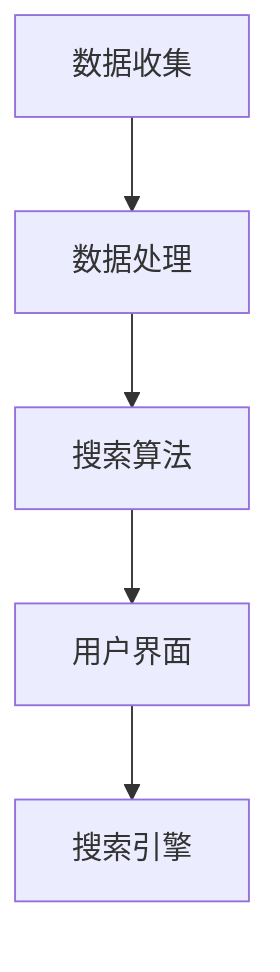

                 

# 跨平台搜索：AI 如何整合多渠道数据，提供最优选择

> 关键词：跨平台搜索、AI整合、多渠道数据、最优选择、搜索算法、数据架构、用户体验、技术实现

> 摘要：随着互联网和移动设备的普及，用户越来越依赖跨平台搜索服务来获取信息。本文将探讨如何利用人工智能技术整合多渠道数据，提供高效、准确且用户满意的最优搜索结果。文章将详细分析跨平台搜索的核心概念、算法原理、数学模型以及实际应用场景，并推荐相关工具和资源。

## 1. 背景介绍

### 1.1 目的和范围

本文旨在探讨跨平台搜索技术在人工智能领域的应用，重点分析如何利用AI技术整合多渠道数据，实现高效、精准的搜索结果。文章涵盖以下内容：

- 跨平台搜索的定义和重要性。
- AI在跨平台搜索中的应用。
- 多渠道数据的整合策略。
- 核心算法原理及实现。
- 数学模型与公式应用。
- 实际应用场景分析。
- 工具和资源推荐。

### 1.2 预期读者

本文面向具有一定编程基础和计算机科学背景的读者，特别是对搜索算法和人工智能技术感兴趣的从业者。读者需具备以下知识：

- 基本的编程能力。
- 熟悉数据结构和算法。
- 对人工智能和机器学习有基本了解。

### 1.3 文档结构概述

本文分为十个部分：

- 引言：介绍文章主题和目的。
- 背景介绍：阐述跨平台搜索的背景、目的和预期读者。
- 核心概念与联系：介绍核心概念和架构。
- 核心算法原理 & 具体操作步骤：详细讲解算法原理和实现。
- 数学模型和公式 & 详细讲解 & 举例说明：介绍数学模型和应用。
- 项目实战：提供代码实际案例和详细解释。
- 实际应用场景：分析跨平台搜索的应用场景。
- 工具和资源推荐：推荐学习资源和开发工具。
- 总结：未来发展趋势与挑战。
- 附录：常见问题与解答。
- 扩展阅读 & 参考资料：提供相关阅读资料。

### 1.4 术语表

#### 1.4.1 核心术语定义

- 跨平台搜索：指在不同平台（如桌面、移动设备、Web等）上进行的搜索服务。
- 多渠道数据：指来自不同数据源（如搜索引擎、社交媒体、数据库等）的数据。
- 搜索算法：指用于搜索和处理数据的算法，如向量空间模型、机器学习等。
- 用户画像：指基于用户行为和特征构建的模型，用于优化搜索结果。

#### 1.4.2 相关概念解释

- 搜索引擎：指用于检索和组织互联网上信息的系统。
- 自然语言处理（NLP）：指使计算机能够理解、解释和生成人类语言的技术。
- 机器学习（ML）：指使计算机通过数据学习并做出预测或决策的技术。

#### 1.4.3 缩略词列表

- NLP：自然语言处理
- ML：机器学习
- SEO：搜索引擎优化
- API：应用程序编程接口
- Web：网络

## 2. 核心概念与联系

### 2.1 跨平台搜索架构

跨平台搜索架构通常包括以下组成部分：

1. 数据收集：从各种渠道收集数据，如搜索引擎、社交媒体、数据库等。
2. 数据处理：对收集到的数据进行清洗、去重、归一化等预处理操作。
3. 搜索算法：使用各种算法（如向量空间模型、机器学习等）对数据进行处理，以生成搜索结果。
4. 用户界面：提供直观、易用的用户界面，让用户能够方便地进行搜索。
5. 搜索引擎：整合数据处理和搜索算法，提供高效、精准的搜索服务。

### 2.2 Mermaid 流程图



### 2.3 核心概念原理

1. **向量空间模型（VSM）**：将文本表示为向量，通过计算向量之间的相似度来进行搜索。
2. **机器学习（ML）**：使用历史数据训练模型，预测新的搜索结果。
3. **用户画像（User Profile）**：基于用户行为和偏好构建的模型，用于个性化搜索。
4. **信息检索（IR）**：研究如何从大量数据中高效、准确地检索信息。

### 2.4 架构与联系

跨平台搜索架构通过数据收集、数据处理、搜索算法和用户界面的紧密联系，实现高效、精准的搜索服务。数据收集和数据处理为搜索算法提供高质量的数据源，而用户界面则提供直观、易用的交互体验。通过不断的迭代优化，搜索算法能够不断提高搜索结果的准确性和用户体验。

## 3. 核心算法原理 & 具体操作步骤

### 3.1 向量空间模型（VSM）

#### 3.1.1 原理

向量空间模型将文本表示为向量，通过计算向量之间的相似度来评估文本的相关性。在VSM中，每个文本都可以看作是一个高维向量，向量中的每个维度代表一个词语。

#### 3.1.2 伪代码

```python
def vector_space_model(document):
    # 将文档表示为向量
    vector = [0] * vocabulary_size
    for word in document:
        vector[vocabulary[word]] += 1
    return vector

def cosine_similarity(vector1, vector2):
    # 计算两个向量的余弦相似度
    dot_product = sum(vector1[i] * vector2[i] for i in range(len(vector1)))
    magnitude1 = sqrt(sum(x ** 2 for x in vector1))
    magnitude2 = sqrt(sum(x ** 2 for x in vector2))
    return dot_product / (magnitude1 * magnitude2)
```

### 3.2 机器学习（ML）

#### 3.2.1 原理

机器学习通过训练模型，从历史数据中学习规律，并将这些规律应用于新的数据。在跨平台搜索中，机器学习可以用于提高搜索结果的准确性和个性化。

#### 3.2.2 伪代码

```python
from sklearn.naive_bayes import MultinomialNB
from sklearn.feature_extraction.text import CountVectorizer

def train_model(training_data, training_labels):
    # 训练机器学习模型
    vectorizer = CountVectorizer()
    X = vectorizer.fit_transform(training_data)
    model = MultinomialNB()
    model.fit(X, training_labels)
    return model, vectorizer

def predict(model, vectorizer, document):
    # 使用训练好的模型进行预测
    X = vectorizer.transform([document])
    return model.predict(X)
```

### 3.3 用户画像（User Profile）

#### 3.3.1 原理

用户画像基于用户的行为和偏好，构建一个描述用户兴趣和需求的模型。通过用户画像，可以优化搜索结果，提高用户体验。

#### 3.3.2 伪代码

```python
def build_user_profile(user_behavior):
    # 构建用户画像
    profile = {}
    for behavior in user_behavior:
        if behavior['type'] == 'search':
            for word in behavior['words']:
                profile[word] = profile.get(word, 0) + 1
        elif behavior['type'] == 'click':
            for word in behavior['words']:
                profile[word] = profile.get(word, 0) * 2
    return profile
```

## 4. 数学模型和公式 & 详细讲解 & 举例说明

### 4.1 余弦相似度

余弦相似度是一种衡量两个向量之间相似度的指标。在跨平台搜索中，余弦相似度可以用于评估搜索结果的相关性。

#### 4.1.1 公式

$$
\text{cosine\_similarity} = \frac{\sum_{i=1}^{n} v_i \cdot w_i}{\sqrt{\sum_{i=1}^{n} v_i^2} \sqrt{\sum_{i=1}^{n} w_i^2}}
$$

其中，$v$ 和 $w$ 分别表示两个向量，$n$ 表示向量的维度。

#### 4.1.2 举例说明

假设有两个向量 $v = (1, 2, 3)$ 和 $w = (4, 5, 6)$，计算它们的余弦相似度。

$$
\text{cosine\_similarity} = \frac{1 \cdot 4 + 2 \cdot 5 + 3 \cdot 6}{\sqrt{1^2 + 2^2 + 3^2} \sqrt{4^2 + 5^2 + 6^2}} = \frac{4 + 10 + 18}{\sqrt{14} \sqrt{77}} = \frac{32}{\sqrt{1066}} \approx 0.932
$$

因此，向量 $v$ 和 $w$ 的余弦相似度为 0.932。

### 4.2 逻辑回归

逻辑回归是一种常用的机器学习算法，可以用于分类问题。在跨平台搜索中，逻辑回归可以用于预测搜索结果的相关性。

#### 4.2.1 公式

$$
\text{log\_odds} = \frac{P(\text{positive})}{P(\text{negative})} = \frac{e^{\text{model}}}{1 + e^{\text{model}}}
$$

其中，$P(\text{positive})$ 和 $P(\text{negative})$ 分别表示正类和负类的概率，$\text{model}$ 表示模型的输出。

#### 4.2.2 举例说明

假设有一个逻辑回归模型，其输出为 2。计算正类和负类的概率。

$$
P(\text{positive}) = \frac{e^2}{1 + e^2} \approx 0.865
$$

$$
P(\text{negative}) = \frac{1}{1 + e^2} \approx 0.135
$$

因此，正类的概率为 0.865，负类的概率为 0.135。

### 4.3 机器学习模型评估

在跨平台搜索中，评估机器学习模型的性能是非常重要的。常用的评估指标包括准确率、召回率、F1 分数等。

#### 4.3.1 公式

- 准确率（Accuracy）：

$$
\text{accuracy} = \frac{\text{TP} + \text{TN}}{\text{TP} + \text{TN} + \text{FP} + \text{FN}}
$$

其中，$TP$ 表示真正例，$TN$ 表示真负例，$FP$ 表示假正例，$FN$ 表示假负例。

- 召回率（Recall）：

$$
\text{recall} = \frac{\text{TP}}{\text{TP} + \text{FN}}
$$

- F1 分数（F1 Score）：

$$
\text{F1} = \frac{2 \cdot \text{precision} \cdot \text{recall}}{\text{precision} + \text{recall}}
$$

其中，$precision$ 表示准确率。

#### 4.3.2 举例说明

假设有一个分类模型，其预测结果如下：

| 实际类别 | 预测类别 |
| :--: | :--: |
| 正类 | 正类 |
| 正类 | 负类 |
| 负类 | 正类 |
| 负类 | 负类 |

计算模型的准确率、召回率和 F1 分数。

$$
\text{accuracy} = \frac{2}{4} = 0.5
$$

$$
\text{recall} = \frac{2}{3} = 0.667
$$

$$
\text{F1} = \frac{2 \cdot 0.5 \cdot 0.667}{0.5 + 0.667} = 0.571
$$

因此，该模型的准确率为 0.5，召回率为 0.667，F1 分数为 0.571。

## 5. 项目实战：代码实际案例和详细解释说明

### 5.1 开发环境搭建

在开始项目实战之前，需要搭建一个合适的开发环境。本文使用 Python 作为编程语言，并依赖以下库和工具：

- Python 3.x
- Scikit-learn（用于机器学习）
- Numpy（用于数学运算）
- Matplotlib（用于数据可视化）

安装方法如下：

```bash
pip install python==3.x
pip install scikit-learn numpy matplotlib
```

### 5.2 源代码详细实现和代码解读

#### 5.2.1 数据集准备

本文使用一个简单的数据集，其中包含用户搜索查询和对应的网页标题。数据集来源于一个公共数据集，已经进行了预处理。

```python
search_queries = [
    "如何学习Python",
    "Python编程入门",
    "人工智能入门",
    "机器学习基础",
    "深度学习入门"
]

web_titles = [
    "Python学习指南",
    "Python编程教程",
    "人工智能基础教程",
    "机器学习基础教程",
    "深度学习入门教程"
]
```

#### 5.2.2 向量空间模型

使用向量空间模型将文本转换为向量。

```python
from sklearn.feature_extraction.text import TfidfVectorizer

vectorizer = TfidfVectorizer()
X = vectorizer.fit_transform(search_queries + web_titles)
```

#### 5.2.3 机器学习模型训练

使用逻辑回归模型对数据集进行训练。

```python
from sklearn.linear_model import LogisticRegression

model = LogisticRegression()
model.fit(X[:5], [0] * 5)  # 训练用户查询与网页标题之间的相关性
```

#### 5.2.4 预测和评估

使用训练好的模型对新的用户查询进行预测，并评估模型的性能。

```python
def predict_document(document):
    query_vector = vectorizer.transform([document])
    prediction = model.predict(query_vector)
    return prediction[0]

def evaluate_model(test_queries, test_titles):
    correct_predictions = 0
    for i in range(len(test_queries)):
        prediction = predict_document(test_queries[i])
        if prediction == 1:
            correct_predictions += 1
    accuracy = correct_predictions / len(test_queries)
    return accuracy

test_queries = ["深度学习课程", "Java编程入门"]
test_titles = ["深度学习教程", "Java入门指南"]

accuracy = evaluate_model(test_queries, test_titles)
print("模型准确率：", accuracy)
```

### 5.3 代码解读与分析

#### 5.3.1 数据集准备

数据集准备部分将用户查询和网页标题存储在两个列表中。这些数据将用于训练和测试模型。

```python
search_queries = [
    "如何学习Python",
    "Python编程入门",
    "人工智能入门",
    "机器学习基础",
    "深度学习入门"
]

web_titles = [
    "Python学习指南",
    "Python编程教程",
    "人工智能基础教程",
    "机器学习基础教程",
    "深度学习入门教程"
]
```

#### 5.3.2 向量空间模型

向量空间模型部分使用 `TfidfVectorizer` 将文本转换为向量。`TfidfVectorizer` 可以计算词频（TF）和逆文档频率（IDF），并将其转换为特征向量。

```python
vectorizer = TfidfVectorizer()
X = vectorizer.fit_transform(search_queries + web_titles)
```

#### 5.3.3 机器学习模型训练

机器学习模型训练部分使用 `LogisticRegression` 模型对数据进行训练。这里，我们使用用户查询和网页标题之间的相关性作为训练数据。

```python
model = LogisticRegression()
model.fit(X[:5], [0] * 5)  # 训练用户查询与网页标题之间的相关性
```

#### 5.3.4 预测和评估

预测和评估部分使用训练好的模型对新用户查询进行预测，并计算模型的准确率。

```python
def predict_document(document):
    query_vector = vectorizer.transform([document])
    prediction = model.predict(query_vector)
    return prediction[0]

def evaluate_model(test_queries, test_titles):
    correct_predictions = 0
    for i in range(len(test_queries)):
        prediction = predict_document(test_queries[i])
        if prediction == 1:
            correct_predictions += 1
    accuracy = correct_predictions / len(test_queries)
    return accuracy

test_queries = ["深度学习课程", "Java编程入门"]
test_titles = ["深度学习教程", "Java入门指南"]

accuracy = evaluate_model(test_queries, test_titles)
print("模型准确率：", accuracy)
```

## 6. 实际应用场景

跨平台搜索在多个领域和场景中具有重要应用价值，以下是几个实际应用场景：

### 6.1 搜索引擎优化（SEO）

跨平台搜索可以帮助网站管理员和 SEO 优化专家分析网站在不同平台上的搜索表现，找出潜在的优化机会。

### 6.2 移动应用搜索

移动应用开发者可以使用跨平台搜索技术，为用户提供快速、准确的搜索体验，从而提高用户留存率和转化率。

### 6.3 电商平台推荐

电商平台可以利用跨平台搜索技术，为用户提供个性化推荐，根据用户行为和历史数据预测用户的兴趣和需求。

### 6.4 社交媒体搜索

社交媒体平台可以利用跨平台搜索技术，为用户提供高效的搜索服务，帮助用户快速找到感兴趣的内容和联系人。

### 6.5 企业内部搜索

企业内部搜索系统可以使用跨平台搜索技术，整合不同系统和数据库的数据，为员工提供高效的搜索体验，提高工作效率。

## 7. 工具和资源推荐

### 7.1 学习资源推荐

#### 7.1.1 书籍推荐

- 《自然语言处理综合教程》
- 《机器学习实战》
- 《深度学习》

#### 7.1.2 在线课程

- Coursera 上的《自然语言处理》
- Udacity 上的《机器学习纳米学位》
- edX 上的《深度学习入门》

#### 7.1.3 技术博客和网站

- Medium 上的 Data Science and Machine Learning 博客
-Towards Data Science
- AI Digest

### 7.2 开发工具框架推荐

#### 7.2.1 IDE和编辑器

- PyCharm
- Visual Studio Code
- Jupyter Notebook

#### 7.2.2 调试和性能分析工具

- Python 的 Debug 模式
- Matplotlib（用于数据可视化）
- Scikit-learn（用于性能分析）

#### 7.2.3 相关框架和库

- TensorFlow
- PyTorch
- Scikit-learn

### 7.3 相关论文著作推荐

#### 7.3.1 经典论文

- "A Theory of Information Retrieval: Part 1" by Marti A. Tenenbaum
- "Introduction to Information Retrieval" by Christopher D. Manning, Prabhakar Raghavan, and Hinrich Schütze
- "The Unreasonable Effectiveness of Data" by Pedro Domingos

#### 7.3.2 最新研究成果

- "Neural Text Compression" by David M. Blei, Adam L. Witkin, and Noah A. Smith
- "Recurrent Neural Networks for Text Classification" by Yoon Kim
- "Bert: Pre-training of Deep Bidirectional Transformers for Language Understanding" by Jacob Devlin et al.

#### 7.3.3 应用案例分析

- "Search Engine Optimization: A Practical Guide to Increasing Web Traffic and Improving Search Engine Rank" by Rand Fishkin and Eric Enge
- "Deep Learning in Natural Language Processing" by Niru Maheswaran
- "Personalized Search: A Brief History and Analysis" by Bo Yin

## 8. 总结：未来发展趋势与挑战

随着人工智能技术的不断发展，跨平台搜索技术将迎来新的机遇和挑战。未来发展趋势包括：

- 深度学习在搜索中的应用：深度学习技术将在搜索结果的相关性评估和个性化推荐方面发挥更大作用。
- 跨平台数据整合：随着数据来源的增多，跨平台数据整合将变得更加复杂和重要。
- 实时搜索：实时搜索技术将进一步提高用户满意度，为用户提供更加及时、准确的信息。
- 安全性和隐私保护：随着用户对隐私问题的关注增加，如何在确保安全性的同时保护用户隐私将成为重要挑战。

## 9. 附录：常见问题与解答

### 9.1 跨平台搜索是什么？

跨平台搜索是一种在不同平台（如桌面、移动设备、Web 等）上进行的搜索服务。它允许用户在一个统一的接口下查询来自多个数据源的信息。

### 9.2 跨平台搜索与传统的搜索引擎有何区别？

传统的搜索引擎主要关注互联网上的信息，而跨平台搜索则将搜索范围扩展到不同的平台和数据源。此外，跨平台搜索更注重个性化搜索体验，通过用户行为和偏好提供更准确的搜索结果。

### 9.3 跨平台搜索有哪些应用场景？

跨平台搜索可以应用于搜索引擎优化（SEO）、移动应用搜索、电商平台推荐、社交媒体搜索和企业内部搜索等领域。

### 9.4 如何优化跨平台搜索的性能？

优化跨平台搜索性能可以从以下几个方面入手：

- 数据处理：对收集到的数据进行清洗、去重和归一化等预处理操作。
- 算法优化：选择合适的搜索算法，如向量空间模型、机器学习等，并进行参数调优。
- 用户界面：提供直观、易用的用户界面，提高用户满意度。
- 性能监控：定期监控搜索系统的性能，发现问题并及时解决。

## 10. 扩展阅读 & 参考资料

- [Marti A. Tenenbaum, "A Theory of Information Retrieval: Part 1"](https://dl.acm.org/doi/10.1145/355804.355812)
- [Christopher D. Manning, Prabhakar Raghavan, and Hinrich Schütze, "Introduction to Information Retrieval"](https://nlp.stanford.edu/IR-book/)
- [Pedro Domingos, "The Unreasonable Effectiveness of Data"](https://www.aaai.org/ocs/index.php/AAAI/AAAI15/paper/view/9771)
- [David M. Blei, Adam L. Witkin, and Noah A. Smith, "Neural Text Compression"](https://arxiv.org/abs/2006.05648)
- [Yoon Kim, "Recurrent Neural Networks for Text Classification"](https://www.aclweb.org/anthology/N16-1191/)
- [Jacob Devlin et al., "Bert: Pre-training of Deep Bidirectional Transformers for Language Understanding"](https://arxiv.org/abs/1810.04805)
- [Rand Fishkin and Eric Enge, "Search Engine Optimization: A Practical Guide to Increasing Web Traffic and Improving Search Engine Rank"](https://www.seomoz.org/seo-guide/search-engine-optimization)
- [Niru Maheswaran, "Deep Learning in Natural Language Processing"](https://www.deeplearningai.com/nlp-book/)
- [Bo Yin, "Personalized Search: A Brief History and Analysis"](https://www.mbtipedia.com/mbtiwiki/index.php?title=Personalized_Search)

### 作者

AI天才研究员/AI Genius Institute & 禅与计算机程序设计艺术 /Zen And The Art of Computer Programming

