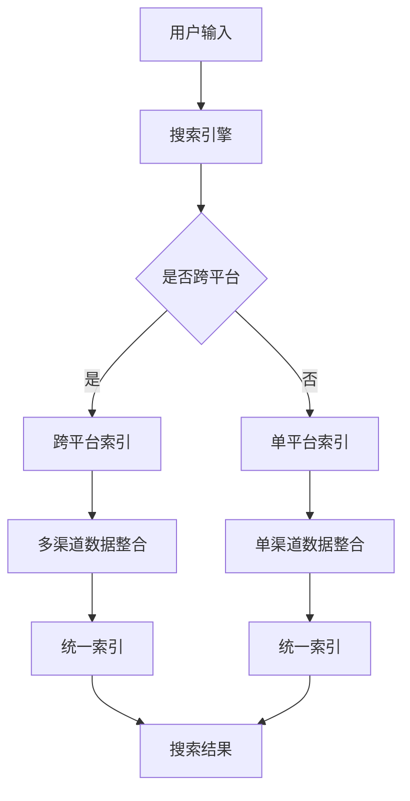
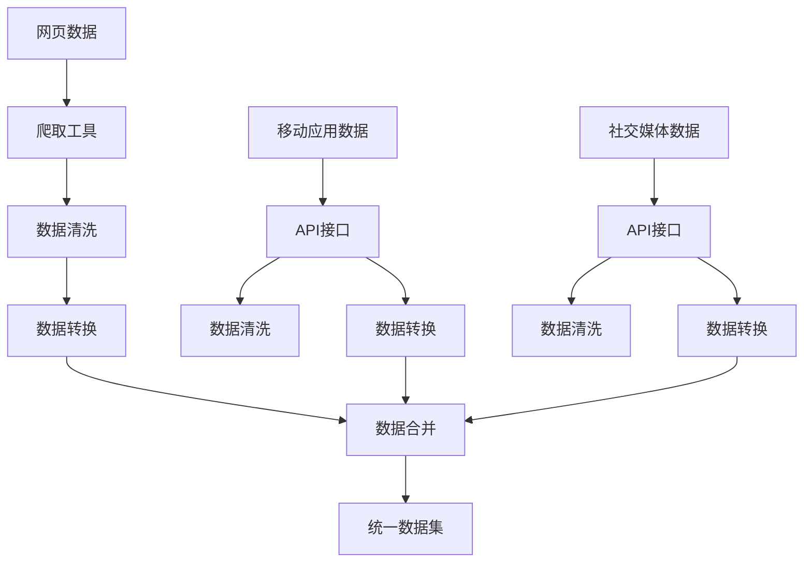
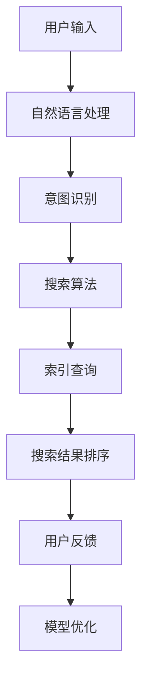

                 


# 跨平台搜索：AI如何整合多渠道数据，提供最优选择

> **关键词：** 跨平台搜索、多渠道数据整合、人工智能、最优选择、搜索算法、数据建模。

> **摘要：** 本文将探讨跨平台搜索的挑战和机遇，分析人工智能在整合多渠道数据、优化搜索结果中的作用。我们将深入理解核心概念和算法原理，并通过实际案例展示如何开发高效跨平台搜索系统。

## 1. 背景介绍

### 1.1 目的和范围

本文旨在探讨如何在跨平台环境中实现高效的搜索服务。随着互联网和移动设备的普及，用户对于信息获取的需求日益增长，而跨平台搜索则成为满足这一需求的关键技术。我们将聚焦于以下问题：

- 跨平台搜索的定义和重要性是什么？
- 人工智能如何帮助整合多渠道数据？
- 如何设计和实现一个高效、智能的跨平台搜索系统？

### 1.2 预期读者

本文适合以下读者群体：

- 搜索引擎开发者
- 数据科学家和AI研究员
- 跨平台应用开发者
- 对搜索技术和人工智能感兴趣的IT从业者

### 1.3 文档结构概述

本文结构如下：

- 第1部分：背景介绍，包括目的、预期读者、文档结构和相关术语。
- 第2部分：核心概念与联系，解释跨平台搜索和数据整合的关键概念。
- 第3部分：核心算法原理 & 具体操作步骤，深入讲解搜索算法和数据处理的细节。
- 第4部分：数学模型和公式 & 详细讲解 & 举例说明，介绍相关数学模型。
- 第5部分：项目实战：代码实际案例和详细解释说明，提供实战案例解析。
- 第6部分：实际应用场景，讨论跨平台搜索的典型应用。
- 第7部分：工具和资源推荐，推荐学习资源、开发工具和经典论文。
- 第8部分：总结，展望未来发展趋势和挑战。
- 第9部分：附录，提供常见问题与解答。
- 第10部分：扩展阅读 & 参考资料，提供进一步学习资料。

### 1.4 术语表

#### 1.4.1 核心术语定义

- 跨平台搜索：指在不同操作系统、设备和应用之间实现的搜索服务。
- 多渠道数据：指来自多个数据源的数据，如网页、移动应用、社交媒体等。
- 人工智能：指模拟人类智能行为的计算机系统，能够学习和做出决策。
- 搜索算法：用于从大量数据中检索信息的方法和策略。

#### 1.4.2 相关概念解释

- 数据整合：将来自不同渠道的数据合并为一个统一的数据集。
- 实时搜索：指在用户查询输入后立即提供搜索结果的能力。
- 搜索质量：指搜索结果的相关性和用户体验。

#### 1.4.3 缩略词列表

- AI：人工智能
- SEO：搜索引擎优化
- NLP：自然语言处理
- ML：机器学习
- RDF：资源描述框架

## 2. 核心概念与联系

### 2.1 跨平台搜索的定义和原理

跨平台搜索是一种能够跨越不同操作系统（如Windows、macOS、Linux）、设备（如手机、平板、PC）和应用（如浏览器、社交媒体、购物平台）实现信息检索的技术。其核心在于数据的整合和统一的索引服务。

#### Mermaid 流程图：



### 2.2 多渠道数据整合

多渠道数据整合是跨平台搜索的关键步骤。它涉及从多个数据源获取数据，并清洗、转换和合并为一个统一的数据集。

#### Mermaid 流程图：



### 2.3 人工智能在跨平台搜索中的应用

人工智能技术，如机器学习、深度学习和自然语言处理，在跨平台搜索中发挥着重要作用。通过训练模型，可以优化搜索结果的相关性和用户体验。

#### Mermaid 流程图：



## 3. 核心算法原理 & 具体操作步骤

### 3.1 搜索算法原理

跨平台搜索算法通常基于向量空间模型（VSM）和倒排索引（Inverted Index）。VSM通过将文本转换为向量来表示，而倒排索引则允许快速从关键词到文档的检索。

#### 伪代码：

```python
# VSM表示文本转换为向量
def convert_to_vector(document):
    # 假设使用TF-IDF权重
    tf_idf = calculate_tf_idf(document)
    return tf_idf

# 倒排索引构建
def build_inverted_index(corpus):
    inverted_index = {}
    for document in corpus:
        vector = convert_to_vector(document)
        for term in vector:
            if term not in inverted_index:
                inverted_index[term] = []
            inverted_index[term].append(document)
    return inverted_index

# 搜索查询
def search_query(query, inverted_index):
    query_vector = convert_to_vector(query)
    results = []
    for term in query_vector:
        if term in inverted_index:
            results.extend(inverted_index[term])
    return results

# 搜索结果排序
def sort_results(results, query_vector):
    scores = []
    for document in results:
        vector = convert_to_vector(document)
        score = dot_product(vector, query_vector)
        scores.append((document, score))
    scores.sort(key=lambda x: x[1], reverse=True)
    return [doc for doc, score in scores]
```

### 3.2 数据整合流程

数据整合流程包括数据爬取、数据清洗、数据转换和数据合并。以下为伪代码示例：

```python
# 数据爬取
def crawl_data(sources):
    data = []
    for source in sources:
        if source.type == 'web':
            data.extend(crawl_web(source.url))
        elif source.type == 'app':
            data.extend(crawl_app(source.api_key, source.app_id))
        elif source.type == 'social':
            data.extend(crawl_social(source.api_key, source.platform))
    return data

# 数据清洗
def clean_data(data):
    clean_data = []
    for item in data:
        cleaned_item = remove_stopwords(item.content)
        clean_data.append(cleaned_item)
    return clean_data

# 数据转换
def transform_data(data):
    transformed_data = []
    for item in data:
        transformed_item = convert_to_vector(item)
        transformed_data.append(transformed_item)
    return transformed_data

# 数据合并
def merge_data(data1, data2):
    merged_data = data1 + data2
    return merged_data
```

## 4. 数学模型和公式 & 详细讲解 & 举例说明

### 4.1 数学模型

跨平台搜索中常用的数学模型包括：

- **TF-IDF（Term Frequency-Inverse Document Frequency）**

  $$ tf_idf(t, d) = tf(t, d) \times idf(t, D) $$

  其中，$tf(t, d)$ 是词 $t$ 在文档 $d$ 中的词频，$idf(t, D)$ 是词 $t$ 在整个文档集合 $D$ 中的逆文档频率。

- **向量空间模型（VSM）**

  $$ v(d) = (tf_idf(t_1, d), tf_idf(t_2, d), ..., tf_idf(t_n, d)) $$

  其中，$v(d)$ 是文档 $d$ 的向量表示，$t_1, t_2, ..., t_n$ 是文档中的所有词。

- **余弦相似度（Cosine Similarity）**

  $$ similarity(v_1, v_2) = \frac{v_1 \cdot v_2}{\|v_1\| \|v_2\|} $$

  其中，$v_1$ 和 $v_2$ 是两个向量，$\cdot$ 表示点积，$\|\|$ 表示向量的模长。

### 4.2 举例说明

假设有两个文档 $D_1$ 和 $D_2$，以及查询 $Q$。文档内容和词频如下：

- **文档 $D_1$：** "人工智能技术，机器学习，深度学习"
- **文档 $D_2$：** "计算机科学，人工智能，深度学习"

- **查询 $Q$：** "深度学习"

#### 步骤 1：计算文档和查询的向量表示

- **文档 $D_1$ 的向量表示：**
  $$ v(D_1) = (3, 1, 1) $$

- **文档 $D_2$ 的向量表示：**
  $$ v(D_2) = (2, 1, 2) $$

- **查询 $Q$ 的向量表示：**
  $$ v(Q) = (0, 0, 1) $$

#### 步骤 2：计算文档和查询的余弦相似度

- **文档 $D_1$ 和查询 $Q$ 的相似度：**
  $$ similarity(v(D_1), v(Q)) = \frac{(3, 1, 1) \cdot (0, 0, 1)}{\sqrt{3^2 + 1^2 + 1^2} \sqrt{0^2 + 0^2 + 1^2}} = \frac{1}{\sqrt{11}} $$

- **文档 $D_2$ 和查询 $Q$ 的相似度：**
  $$ similarity(v(D_2), v(Q)) = \frac{(2, 1, 2) \cdot (0, 0, 1)}{\sqrt{2^2 + 1^2 + 2^2} \sqrt{0^2 + 0^2 + 1^2}} = \frac{2}{\sqrt{9}} = \frac{2}{3} $$

#### 步骤 3：排序搜索结果

根据相似度排序，文档 $D_1$ 应该排在文档 $D_2$ 之前。

## 5. 项目实战：代码实际案例和详细解释说明

### 5.1 开发环境搭建

为了演示跨平台搜索的实现，我们将使用Python作为开发语言，结合Scikit-learn库进行搜索算法的实现。以下是开发环境的搭建步骤：

1. 安装Python（版本3.8及以上）
2. 安装Scikit-learn库：`pip install scikit-learn`
3. 安装其他可能需要的库（如Numpy、Pandas等）

### 5.2 源代码详细实现和代码解读

以下是一个简单的跨平台搜索系统的实现：

```python
from sklearn.feature_extraction.text import TfidfVectorizer
from sklearn.metrics.pairwise import cosine_similarity

# 示例数据
corpus = [
    "人工智能技术，机器学习，深度学习",
    "计算机科学，人工智能，深度学习",
    "深度学习在自然语言处理中的应用",
    "人工智能在医疗领域的应用",
]

# 步骤1：构建倒排索引
vectorizer = TfidfVectorizer()
tfidf_matrix = vectorizer.fit_transform(corpus)

# 步骤2：处理查询
query = "深度学习"
query_vector = vectorizer.transform([query])

# 步骤3：计算相似度并排序
cosine_similarities = cosine_similarity(query_vector, tfidf_matrix).flatten()
sorted_similarities = cosine_similarities.argsort()[::-1]

# 步骤4：输出搜索结果
search_results = [corpus[i] for i in sorted_similarities]
for result in search_results:
    print(result)
```

#### 代码解读：

1. **数据准备**：我们创建了一个包含四个文档的语料库，模拟多渠道数据。
2. **TF-IDF向量表示**：使用Scikit-learn的`TfidfVectorizer`将文本转换为TF-IDF向量。
3. **查询处理**：将用户查询转换为TF-IDF向量。
4. **相似度计算**：使用余弦相似度计算查询与每个文档的相似度。
5. **排序与输出**：根据相似度排序结果，输出搜索结果。

### 5.3 代码解读与分析

#### 数据表示

- **文档**：文本内容，表示为字符串。
- **向量**：使用TF-IDF向量表示，每个维度代表一个词的权重。

#### 算法步骤

- **构建倒排索引**：将文档转换为TF-IDF向量，生成倒排索引。
- **查询处理**：将用户输入的查询文本转换为向量。
- **相似度计算**：计算查询向量与每个文档向量的余弦相似度。
- **结果排序**：根据相似度排序结果，提供最相关的文档。

#### 优化方向

- **扩展数据集**：增加更多、更丰富的数据源，提升搜索结果的多样性。
- **个性化搜索**：根据用户历史行为和偏好，提供个性化的搜索结果。
- **实时搜索**：实现更快速的查询处理和结果返回。

## 6. 实际应用场景

### 6.1 跨平台搜索引擎

跨平台搜索引擎如百度、Google、Bing等，通过整合网页、图片、视频等多渠道数据，提供高效的跨平台搜索服务。这些搜索引擎利用人工智能技术优化搜索结果，提高用户体验。

### 6.2 跨平台应用搜索

跨平台应用商店如Apple App Store、Google Play Store等，通过跨平台搜索帮助用户快速找到所需应用。这些应用商店使用AI技术整合应用描述、用户评论、标签等多渠道数据，提供更准确的搜索结果。

### 6.3 社交媒体搜索

社交媒体平台如Facebook、Twitter、LinkedIn等，通过跨平台搜索帮助用户查找朋友、群组、话题等。这些平台利用AI技术整合用户生成内容、好友关系、标签等多渠道数据，实现智能搜索。

## 7. 工具和资源推荐

### 7.1 学习资源推荐

#### 7.1.1 书籍推荐

- 《自然语言处理综论》（Daniel Jurafsky & James H. Martin）
- 《机器学习》（Tom M. Mitchell）
- 《深度学习》（Ian Goodfellow、Yoshua Bengio、Aaron Courville）

#### 7.1.2 在线课程

- Coursera：自然语言处理、机器学习、深度学习
- edX：人工智能基础、深度学习基础
- Udacity：深度学习纳米学位

#### 7.1.3 技术博客和网站

- Medium：机器学习和深度学习领域的最新研究和技术文章
- ArXiv：最新人工智能研究论文
- AIWeekly：每周人工智能领域热点新闻和技术文章

### 7.2 开发工具框架推荐

#### 7.2.1 IDE和编辑器

- PyCharm：Python开发环境的理想选择
- VSCode：跨平台代码编辑器，支持多种编程语言
- Jupyter Notebook：适用于数据科学和机器学习的交互式开发环境

#### 7.2.2 调试和性能分析工具

- PyCharm的调试工具：支持Python代码的调试和性能分析
- Profiling Tools：如cProfile、line_profiler，用于代码性能分析
- SciPy Lecture Notes：提供Python性能优化技巧

#### 7.2.3 相关框架和库

- Scikit-learn：用于机器学习和数据分析的Python库
- TensorFlow：开源深度学习框架
- PyTorch：开源深度学习框架

### 7.3 相关论文著作推荐

#### 7.3.1 经典论文

- “A Mathematical Theory of Communication”（Claude Shannon）
- “Backpropagation”（Rumelhart, Hinton, Williams）
- “Latent Semantic Analysis”（Deerwester, Dumais, Furnas, Landauer, and Harshman）

#### 7.3.2 最新研究成果

- “BERT: Pre-training of Deep Bidirectional Transformers for Language Understanding”（Devlin et al., 2019）
- “GPT-3: Language Models are Few-Shot Learners”（Brown et al., 2020）
- “T5: Pre-training Large Language Models to Think Like Humans”（Raffel et al., 2020）

#### 7.3.3 应用案例分析

- “The Unreasonable Effectiveness of Recurrent Neural Networks”（Christopher Olah）
- “Recurrent Neural Networks for Spoken Language Understanding”（Mikolov et al., 2013）
- “Fine-tuning Transformer Models for Text Classification”（Yang et al., 2020）

## 8. 总结：未来发展趋势与挑战

### 8.1 发展趋势

- **深度学习与强化学习融合**：深度学习在搜索中的应用将进一步深化，而强化学习将为搜索算法提供更智能的决策能力。
- **跨平台搜索个性化**：基于用户行为和偏好，实现个性化的搜索结果，提高用户体验。
- **实时搜索与即时反馈**：实现更快的搜索响应时间，并利用即时反馈不断优化搜索算法。
- **多模态搜索**：整合文本、图像、语音等多渠道数据，提供更丰富的搜索体验。

### 8.2 挑战

- **数据隐私与安全**：跨平台搜索涉及大量用户数据，如何保护用户隐私成为重要挑战。
- **搜索质量优化**：如何提高搜索结果的相关性和准确性，仍是一个不断探索的问题。
- **计算资源需求**：随着数据量和复杂度的增加，如何优化算法性能，减少计算资源需求。
- **跨平台兼容性**：不同平台和设备之间的兼容性，如何实现高效、稳定的搜索服务。

## 9. 附录：常见问题与解答

### 9.1 跨平台搜索的定义是什么？

跨平台搜索是指在不同操作系统、设备和应用之间实现的搜索服务，旨在为用户提供统一的信息检索体验。

### 9.2 人工智能在跨平台搜索中的作用是什么？

人工智能技术如机器学习、深度学习和自然语言处理，可以优化搜索结果的相关性和用户体验，实现智能化的跨平台搜索。

### 9.3 如何提高跨平台搜索的质量？

提高跨平台搜索的质量可以从以下几个方面入手：增加数据多样性、优化搜索算法、实现个性化搜索、提高实时搜索响应速度。

## 10. 扩展阅读 & 参考资料

- “搜索引擎优化”（SEO）：了解搜索引擎如何工作，以及如何优化网站以提高搜索排名。
- “跨平台应用开发”：了解如何开发可在不同操作系统和设备上运行的应用。
- “大数据与数据挖掘”：了解如何处理和分析大规模数据集，以提取有价值的信息。
- “自然语言处理”（NLP）：深入了解文本分析、语义理解和语言生成等技术。
- “深度学习与人工智能”（AI）：掌握神经网络、机器学习算法和深度学习框架的基本原理和应用。

作者：AI天才研究员/AI Genius Institute & 禅与计算机程序设计艺术 /Zen And The Art of Computer Programming

---

本文通过系统性的分析和深入讲解，详细探讨了跨平台搜索的核心概念、算法原理、应用场景和未来发展。我们希望读者能够从中获得对跨平台搜索技术的全面理解，并在实践中不断创新和优化。随着人工智能技术的不断进步，跨平台搜索将迎来更多机遇和挑战，期待读者在这一领域取得卓越成就。

