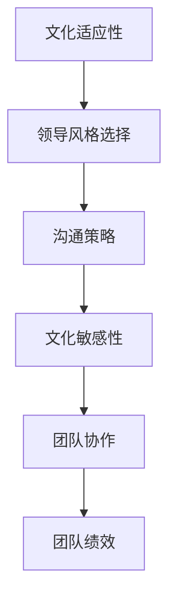

                 

# 跨文化领导：在多元化团队中发挥优势

> **关键词：** 跨文化领导、多元化团队、团队协作、文化差异、沟通策略、领导力发展
>
> **摘要：** 本文将探讨在多元化团队中实施有效的跨文化领导的重要性。通过分析跨文化领导的核心概念、相关理论，以及具体的实践策略，本文旨在帮助IT行业的领导者更好地理解并利用文化差异，提升团队绩效和创新能力。

## 1. 背景介绍

### 1.1 目的和范围

本文的目的在于探讨跨文化领导在多元化团队中的应用，帮助IT行业的领导者更好地理解文化差异，提高团队协作效率。文章将涵盖以下几个主要方面：

- **跨文化领导的核心概念与理论**：介绍跨文化领导的定义、重要性以及理论基础。
- **多元化团队的优势与挑战**：分析多元化团队的优势和面临的挑战。
- **跨文化领导策略**：探讨如何在实际工作中运用跨文化领导策略，提高团队绩效。
- **案例与实践**：分享跨文化领导在IT行业的实际案例，提供实践参考。

### 1.2 预期读者

本文适合以下读者：

- **IT行业的领导者**：对跨文化领导有浓厚兴趣，希望提升团队管理能力。
- **人力资源从业者**：关注多元化团队的管理和人才发展。
- **跨文化沟通专家**：希望了解如何在IT行业中应用跨文化领导策略。

### 1.3 文档结构概述

本文的结构如下：

1. **背景介绍**：介绍文章的目的、预期读者和文档结构。
2. **核心概念与联系**：阐述跨文化领导的核心概念和相关理论。
3. **核心算法原理 & 具体操作步骤**：详细讲解跨文化领导的具体实践策略。
4. **数学模型和公式 & 详细讲解 & 举例说明**：运用数学模型分析跨文化领导。
5. **项目实战：代码实际案例和详细解释说明**：通过实际案例展示跨文化领导的实践。
6. **实际应用场景**：分析跨文化领导在不同场景中的应用。
7. **工具和资源推荐**：推荐相关学习资源和开发工具。
8. **总结：未来发展趋势与挑战**：展望跨文化领导的未来发展方向。
9. **附录：常见问题与解答**：解答读者可能遇到的问题。
10. **扩展阅读 & 参考资料**：提供进一步阅读的推荐。

### 1.4 术语表

#### 1.4.1 核心术语定义

- **跨文化领导**：指在多元化团队中，领导者通过有效沟通和协调，激发团队成员的潜能，实现团队目标的过程。
- **多元化团队**：由来自不同文化背景、性别、年龄、教育水平等多元成员组成的团队。
- **文化差异**：指不同文化群体在价值观、行为规范、沟通方式等方面的差异。

#### 1.4.2 相关概念解释

- **文化适应性**：指个体或团队在不同文化环境中调整自己的行为和思维模式，以适应新的环境。
- **团队绩效**：指团队在实现预定目标过程中的表现和成果。

#### 1.4.3 缩略词列表

- **IT**：信息技术（Information Technology）
- **HR**：人力资源（Human Resources）
- **IDE**：集成开发环境（Integrated Development Environment）

## 2. 核心概念与联系

在探讨跨文化领导之前，我们需要了解一些核心概念和相关理论，这将帮助我们更好地理解跨文化领导的重要性和实施方法。

### 2.1 跨文化领导的概念

跨文化领导是指在一个多元化团队中，领导者通过有效沟通和协调，激发团队成员的潜能，实现团队目标的过程。跨文化领导不仅仅是在不同的文化背景下进行管理，更是在尊重和理解不同文化的基础上，推动团队成员的协作和创新。

### 2.2 跨文化领导的理论基础

跨文化领导的理论基础主要包括以下几个关键概念：

1. **文化适应性**：文化适应性是指个体或团队在不同文化环境中调整自己的行为和思维模式，以适应新的环境。文化适应性的高低直接影响跨文化领导的成败。

2. **领导风格**：跨文化领导需要根据不同文化背景选择合适的领导风格。常见的领导风格包括权威型、民主型、参与型等。在不同的文化背景下，这些领导风格的效果可能大相径庭。

3. **沟通策略**：有效的沟通是跨文化领导的关键。领导者需要了解不同文化群体的沟通方式，如语言表达、非语言沟通、沟通风格等，以避免误解和冲突。

4. **文化敏感性**：文化敏感性是指领导者对文化差异的敏感度和理解能力。具备文化敏感性的领导者能够更好地理解团队成员的文化背景，从而采取更有效的领导策略。

### 2.3 跨文化领导的架构

为了更好地理解跨文化领导，我们可以使用Mermaid流程图来展示其核心架构。



在这个架构中，文化适应性是跨文化领导的基础，领导风格选择、沟通策略和文化敏感性是核心要素，它们共同作用于团队协作和团队绩效。

## 3. 核心算法原理 & 具体操作步骤

### 3.1 跨文化领导算法原理

跨文化领导算法的核心在于如何在不同文化背景下实现有效的团队管理。以下是一个简化的跨文化领导算法原理：

```plaintext
算法名称：跨文化领导算法

输入：团队成员信息、文化背景数据、团队目标

输出：跨文化领导策略

步骤：

1. 收集团队成员的文化背景信息，包括价值观、行为规范、沟通风格等。

2. 分析团队成员的文化差异，识别可能的文化冲突点。

3. 根据文化差异，选择合适的领导风格。例如，在强调集体主义的文化背景下，采用参与型领导风格可能更为有效。

4. 制定沟通策略，确保信息传递的准确性和及时性。例如，在跨文化沟通中，使用简洁、明确的语言，避免使用模糊或具有文化特定含义的词汇。

5. 培养文化敏感性，提升领导者的文化理解能力。例如，通过参加跨文化培训或阅读相关书籍，增强对文化差异的敏感度和理解能力。

6. 在实际工作中，持续评估和调整领导策略，确保团队目标的实现。

7. 鼓励团队成员积极参与，发挥各自的优势，实现团队绩效的提升。
```

### 3.2 跨文化领导的具体操作步骤

以下是一个详细的跨文化领导操作步骤：

#### 3.2.1 收集团队成员的文化背景信息

- **数据收集方法**：问卷调查、个人面谈、团队讨论等。

- **数据收集内容**：团队成员的价值观、行为规范、沟通风格、教育背景、工作经验等。

#### 3.2.2 分析团队成员的文化差异

- **文化差异分析方法**：比较分析、文化地图、文化适应度量表等。

- **文化差异识别**：识别可能的文化冲突点，如价值观差异、沟通风格冲突等。

#### 3.2.3 选择合适的领导风格

- **领导风格选择方法**：根据文化差异，选择合适的领导风格。例如，在强调集体主义的文化背景下，采用参与型领导风格可能更为有效。

- **领导风格实施**：在团队会议、项目讨论等场合，运用所选领导风格，引导团队协作。

#### 3.2.4 制定沟通策略

- **沟通策略制定方法**：根据团队成员的文化背景，制定沟通策略。例如，在跨文化沟通中，使用简洁、明确的语言，避免使用模糊或具有文化特定含义的词汇。

- **沟通策略实施**：在团队内部沟通、跨文化沟通等场合，运用所选沟通策略，确保信息传递的准确性和及时性。

#### 3.2.5 培养文化敏感性

- **文化敏感性培养方法**：参加跨文化培训、阅读相关书籍、与来自不同文化背景的同事交流等。

- **文化敏感性提升**：通过持续的学习和实践，提升领导者的文化理解能力。

#### 3.2.6 实际工作中评估和调整领导策略

- **评估方法**：定期评估团队绩效、团队成员满意度等指标。

- **策略调整**：根据评估结果，调整领导策略，确保团队目标的实现。

#### 3.2.7 鼓励团队成员积极参与

- **参与方式**：开展团队建设活动、设立团队目标、鼓励团队成员提出建议等。

- **参与激励**：通过奖励、认可等方式，激励团队成员积极参与。

## 4. 数学模型和公式 & 详细讲解 & 举例说明

### 4.1 数学模型

在跨文化领导中，我们可以运用一些数学模型来分析和优化团队绩效。以下是一个简化的跨文化领导数学模型：

```latex
团队绩效 = f(文化适应性, 领导风格, 沟通策略, 文化敏感性)
```

在这个模型中，团队绩效是由文化适应性、领导风格、沟通策略和文化敏感性四个变量共同决定的。我们可以通过优化这些变量来提升团队绩效。

### 4.2 公式详解

#### 4.2.1 文化适应性

文化适应性可以通过以下公式计算：

```latex
文化适应性 = \frac{文化理解度 + 文化包容度}{2}
```

其中，文化理解度和文化包容度分别表示领导者在不同文化背景下的理解能力和包容度。

#### 4.2.2 领导风格

领导风格可以通过以下公式计算：

```latex
领导风格 = \frac{权威型领导 + 民主型领导 + 参与型领导}{3}
```

在这个公式中，权威型领导、民主型领导和参与型领导分别表示领导者在不同文化背景下的领导风格。

#### 4.2.3 沟通策略

沟通策略可以通过以下公式计算：

```latex
沟通策略 = \frac{跨文化沟通 + 内部沟通}{2}
```

其中，跨文化沟通和内部沟通分别表示领导者在跨文化和内部沟通中的策略。

#### 4.2.4 文化敏感性

文化敏感性可以通过以下公式计算：

```latex
文化敏感性 = \frac{文化培训 + 文化经验}{2}
```

在这个公式中，文化培训和

