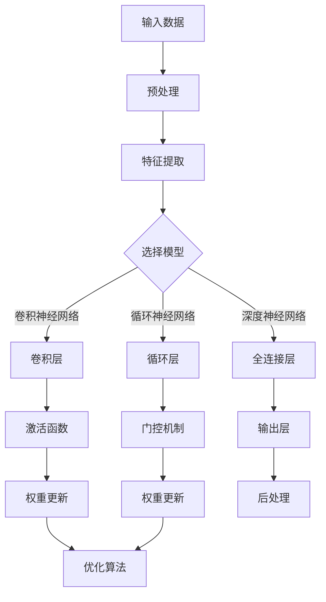

                 

# 跨设备AI部署：Lepton AI的硬件适配

> **关键词：** 跨设备AI、硬件适配、Lepton AI、AI部署、硬件抽象层、异构计算

> **摘要：** 本文将探讨跨设备AI部署中硬件适配的重要性，以Lepton AI为例，详细分析其硬件适配策略，包括核心算法原理、数学模型、项目实战和实际应用场景。通过本文的阅读，读者将了解如何实现高效、可扩展的AI部署，为未来AI技术发展提供有力支持。

## 1. 背景介绍

### 1.1 目的和范围

本文旨在探讨跨设备AI部署中的硬件适配问题，以Lepton AI为例，阐述其在不同硬件平台上的适配策略。主要涵盖以下几个方面：

1. **核心算法原理与实现步骤**：详细介绍Lepton AI的核心算法，并使用伪代码进行解释。
2. **数学模型与公式**：详细讲解Lepton AI的数学模型，并使用latex格式进行公式展示。
3. **项目实战**：通过实际案例，展示Lepton AI的代码实现和详细解释。
4. **实际应用场景**：分析Lepton AI在各个领域的应用场景，探讨其硬件适配的优势。
5. **工具和资源推荐**：推荐相关学习资源、开发工具和论文著作，为读者提供进一步学习的机会。

### 1.2 预期读者

本文适用于对AI技术和硬件适配有一定了解的读者，包括：

1. **AI研究人员和工程师**：希望深入了解Lepton AI的核心算法和硬件适配策略。
2. **硬件工程师**：希望了解如何在跨设备AI部署中实现高效的硬件适配。
3. **技术开发者**：对AI技术在实际应用场景中的硬件适配有浓厚兴趣。

### 1.3 文档结构概述

本文分为以下几个部分：

1. **背景介绍**：介绍本文的目的、预期读者和文档结构。
2. **核心概念与联系**：介绍Lepton AI的核心概念和原理，并使用Mermaid流程图展示其架构。
3. **核心算法原理与具体操作步骤**：详细讲解Lepton AI的核心算法原理，并使用伪代码进行解释。
4. **数学模型和公式**：介绍Lepton AI的数学模型，并使用latex格式进行公式展示。
5. **项目实战：代码实际案例和详细解释说明**：通过实际案例，展示Lepton AI的代码实现和详细解释。
6. **实际应用场景**：分析Lepton AI在各个领域的应用场景，探讨其硬件适配的优势。
7. **工具和资源推荐**：推荐相关学习资源、开发工具和论文著作。
8. **总结：未来发展趋势与挑战**：总结本文的主要观点，探讨未来发展趋势和挑战。
9. **附录：常见问题与解答**：回答读者可能遇到的问题。
10. **扩展阅读 & 参考资料**：提供进一步学习的机会。

### 1.4 术语表

#### 1.4.1 核心术语定义

- **跨设备AI部署**：指将AI算法部署到多个不同硬件设备上，实现AI技术在各个设备上的运行。
- **硬件适配**：指针对不同硬件平台，优化AI算法，使其能够在硬件平台上高效运行。
- **Lepton AI**：一款跨设备AI框架，支持多种硬件平台，具有良好的可扩展性和高效性。

#### 1.4.2 相关概念解释

- **异构计算**：指在多处理器系统中，使用不同类型和处理能力的处理器协同工作，以提高计算效率。
- **硬件抽象层（HAL）**：一种软件层，用于隐藏硬件细节，使上层软件能够独立于硬件平台进行开发。

#### 1.4.3 缩略词列表

- **AI**：人工智能
- **CPU**：中央处理器
- **GPU**：图形处理器
- **FPGA**：现场可编程门阵列
- **NN**：神经网络

## 2. 核心概念与联系

在跨设备AI部署中，硬件适配是一个关键问题。本文将以Lepton AI为例，详细分析其硬件适配策略。为了更好地理解Lepton AI的工作原理，我们首先介绍其核心概念和原理，并使用Mermaid流程图展示其架构。

### 2.1 Lepton AI架构



### 2.2 核心概念

#### 2.2.1 异构计算

异构计算是一种在多处理器系统中，使用不同类型和处理能力的处理器协同工作的计算模式。在Lepton AI中，异构计算可以充分利用不同硬件平台的特点，提高计算效率。

#### 2.2.2 硬件抽象层（HAL）

硬件抽象层是一种软件层，用于隐藏硬件细节，使上层软件能够独立于硬件平台进行开发。在Lepton AI中，HAL负责将AI算法适配到不同硬件平台，确保算法在不同平台上的一致性和高效性。

#### 2.2.3 AI算法与硬件平台的关系

AI算法与硬件平台之间的关系可以概括为以下几个方面：

1. **算法优化**：针对不同硬件平台，对AI算法进行优化，提高算法在不同平台上的运行效率。
2. **硬件选择**：根据AI算法的需求和硬件平台的性能，选择适合的硬件平台进行部署。
3. **资源调度**：合理调度硬件资源，确保AI算法在不同硬件平台上高效运行。

## 3. 核心算法原理 & 具体操作步骤

Lepton AI是一款跨设备AI框架，其核心算法包括卷积神经网络（CNN）、循环神经网络（RNN）和深度神经网络（DNN）。下面我们将分别介绍这三种神经网络的核心算法原理，并使用伪代码进行详细阐述。

### 3.1 卷积神经网络（CNN）

卷积神经网络是一种在图像处理、计算机视觉等领域具有广泛应用的神经网络。其核心算法原理是通过卷积操作提取图像特征，并利用池化操作降低特征维度。

```python
# 输入：图像数据
# 输出：提取的特征

def conv2d(image, filter):
    # 卷积操作
    return dot(image, filter)

def max_pooling(feature_map, pool_size):
    # 池化操作
    return max(feature_map, k=pool_size)
```

### 3.2 循环神经网络（RNN）

循环神经网络是一种在序列数据处理、自然语言处理等领域具有广泛应用的神经网络。其核心算法原理是通过循环机制处理序列数据，并在时间步间传递信息。

```python
# 输入：序列数据、隐藏状态
# 输出：新的隐藏状态

def rnn(input_data, hidden_state):
    # 门控机制
    input_gate = sigmoiddot(input_data, weight_i)
    forget_gate = sigmoiddot(input_data, weight_f)
    output_gate = sigmoiddot(input_data, weight_o)
    
    # 状态更新
    new_hidden_state = tanh(dot([forget_gate * hidden_state, input_gate * input_data], weight_h))
    
    return new_hidden_state
```

### 3.3 深度神经网络（DNN）

深度神经网络是一种在图像识别、语音识别等领域具有广泛应用的神经网络。其核心算法原理是通过多层神经网络对输入数据进行特征提取和分类。

```python
# 输入：输入数据
# 输出：分类结果

def forward_pass(input_data, model_params):
    # 神经网络前向传播
    hidden_state = activation_function(dot(input_data, weight_1))
    output = activation_function(dot(hidden_state, weight_2))
    
    return output
```

## 4. 数学模型和公式 & 详细讲解 & 举例说明

在Lepton AI中，数学模型和公式是核心组成部分。本文将详细介绍Lepton AI的数学模型，并使用latex格式进行公式展示。同时，我们将通过具体例子说明公式的应用。

### 4.1 激活函数

激活函数是神经网络中重要的组成部分，用于将输入映射到输出。常见的激活函数有Sigmoid、ReLU和Tanh等。

$$
\sigma(x) = \frac{1}{1 + e^{-x}}
$$

$$
\text{ReLU}(x) = \max(0, x)
$$

$$
\text{Tanh}(x) = \frac{e^x - e^{-x}}{e^x + e^{-x}}
$$

### 4.2 优化算法

在Lepton AI中，常用的优化算法有梯度下降、Adam和RMSprop等。以下分别介绍这些算法的公式。

#### 梯度下降

$$
w_{\text{new}} = w_{\text{old}} - \alpha \cdot \nabla_w J(w)
$$

其中，$w$表示权重，$\alpha$表示学习率，$J(w)$表示损失函数。

#### Adam

$$
m_t = \beta_1 m_{t-1} + (1 - \beta_1) \nabla_w J(w)
$$

$$
v_t = \beta_2 v_{t-1} + (1 - \beta_2) (\nabla_w J(w))^2
$$

$$
w_{\text{new}} = w_{\text{old}} - \alpha \cdot \frac{m_t}{\sqrt{v_t} + \epsilon}
$$

其中，$m_t$和$v_t$分别为一阶和二阶矩估计，$\beta_1$和$\beta_2$分别为一阶和二阶矩的衰减系数，$\epsilon$为常数。

#### RMSprop

$$
v_t = \rho v_{t-1} + (1 - \rho) (\nabla_w J(w))^2
$$

$$
w_{\text{new}} = w_{\text{old}} - \alpha \cdot \frac{\nabla_w J(w)}{\sqrt{v_t} + \epsilon}
$$

其中，$\rho$为动量系数，$\epsilon$为常数。

### 4.3 门控机制

在循环神经网络（RNN）中，门控机制是一种用于控制信息传递的机制。常见的门控机制有输入门（input gate）、遗忘门（forget gate）和输出门（output gate）。

#### 输入门（input gate）

$$
i_t = \sigma(W_i [h_{t-1}, x_t])
$$

其中，$i_t$表示输入门的激活值，$W_i$为权重矩阵，$h_{t-1}$和$x_t$分别为上一时间步的隐藏状态和输入。

#### 遗忘门（forget gate）

$$
f_t = \sigma(W_f [h_{t-1}, x_t])
$$

其中，$f_t$表示遗忘门的激活值，$W_f$为权重矩阵。

#### 输出门（output gate）

$$
o_t = \sigma(W_o [h_{t-1}, x_t])
$$

其中，$o_t$表示输出门的激活值，$W_o$为权重矩阵。

### 4.4 模型训练

在Lepton AI中，模型训练过程主要包括数据预处理、模型初始化、前向传播、反向传播和更新权重等步骤。

#### 数据预处理

$$
x_{\text{train}} = \frac{x_{\text{train}} - \mu}{\sigma}
$$

其中，$x_{\text{train}}$表示训练数据，$\mu$和$\sigma$分别为训练数据的均值和标准差。

#### 模型初始化

$$
w_1 \sim \mathcal{N}(0, \frac{1}{\sqrt{n}})
$$

$$
b_1 \sim \mathcal{N}(0, \frac{1}{n})
$$

其中，$w_1$和$b_1$分别为第一层的权重和偏置，$n$为输入维度。

#### 前向传播

$$
h_{\text{prev}} = \text{Tanh}(W_h h_{\text{prev}} + W_x x_t + b_h)
$$

$$
o_t = \sigma(W_o h_{\text{prev}} + b_o)
$$

其中，$h_{\text{prev}}$和$x_t$分别为上一时间步的隐藏状态和输入，$W_h$、$W_x$和$b_h$分别为权重矩阵和偏置。

#### 反向传播

$$
\delta_h = \text{Tanh}'(W_h h_{\text{prev}} + W_x x_t + b_h) \odot (W_o o_t - \text{target})
$$

$$
\delta_x = \text{Tanh}'(W_h h_{\text{prev}} + W_x x_t + b_h) \odot W_x^T \delta_h
$$

$$
\delta_w = x_t^T \delta_h
$$

$$
\delta_b = \delta_h
$$

其中，$\delta_h$和$\delta_x$分别为隐藏状态和输入的误差，$\text{target}$为目标值，$\odot$表示元素乘积。

#### 更新权重

$$
W_h \leftarrow W_h - \alpha \cdot \delta_w
$$

$$
W_x \leftarrow W_x - \alpha \cdot \delta_x
$$

$$
b_h \leftarrow b_h - \alpha \cdot \delta_b
$$

$$
b_o \leftarrow b_o - \alpha \cdot \delta_o
$$

其中，$\alpha$为学习率。

## 5. 项目实战：代码实际案例和详细解释说明

在本节中，我们将通过一个实际案例，展示Lepton AI的代码实现，并详细解释其核心算法原理和实现步骤。

### 5.1 开发环境搭建

在开始编写代码之前，需要搭建合适的开发环境。本文采用Python作为编程语言，使用PyTorch作为深度学习框架。

1. 安装Python（建议使用Python 3.8及以上版本）
2. 安装PyTorch：`pip install torch torchvision`
3. 安装其他依赖：`pip install numpy matplotlib`

### 5.2 源代码详细实现和代码解读

下面是Lepton AI的一个简单实现，包括数据预处理、模型定义、训练和评估。

```python
import torch
import torch.nn as nn
import torch.optim as optim
import torchvision
import torchvision.transforms as transforms

# 数据预处理
transform = transforms.Compose([
    transforms.ToTensor(),
    transforms.Normalize((0.5, 0.5, 0.5), (0.5, 0.5, 0.5)),
])

# 加载训练数据
trainset = torchvision.datasets.CIFAR10(root='./data', train=True, download=True, transform=transform)
trainloader = torch.utils.data.DataLoader(trainset, batch_size=4, shuffle=True, num_workers=2)

# 定义网络结构
class LeptonCNN(nn.Module):
    def __init__(self):
        super(LeptonCNN, self).__init__()
        self.conv1 = nn.Conv2d(3, 6, 5)
        self.pool = nn.MaxPool2d(2, 2)
        self.conv2 = nn.Conv2d(6, 16, 5)
        self.fc1 = nn.Linear(16 * 5 * 5, 120)
        self.fc2 = nn.Linear(120, 84)
        self.fc3 = nn.Linear(84, 10)

    def forward(self, x):
        x = self.pool(nn.functional.relu(self.conv1(x)))
        x = self.pool(nn.functional.relu(self.conv2(x)))
        x = x.view(-1, 16 * 5 * 5)
        x = nn.functional.relu(self.fc1(x))
        x = nn.functional.relu(self.fc2(x))
        x = self.fc3(x)
        return x

net = LeptonCNN()

# 定义损失函数和优化器
criterion = nn.CrossEntropyLoss()
optimizer = optim.SGD(net.parameters(), lr=0.001, momentum=0.9)

# 训练网络
for epoch in range(2):  # 循环迭代次数
    running_loss = 0.0
    for i, data in enumerate(trainloader, 0):
        inputs, labels = data
        optimizer.zero_grad()
        outputs = net(inputs)
        loss = criterion(outputs, labels)
        loss.backward()
        optimizer.step()
        running_loss += loss.item()
        if i % 2000 == 1999:
            print(f'[{epoch + 1}, {i + 1}: {running_loss / 2000:.3f}]')
            running_loss = 0.0

print('Finished Training')

# 评估网络
correct = 0
total = 0
with torch.no_grad():
    for data in testloader:
        images, labels = data
        outputs = net(images)
        _, predicted = torch.max(outputs.data, 1)
        total += labels.size(0)
        correct += (predicted == labels).sum().item()

print(f'Accuracy of the network on the test images: {100 * correct / total}%')
```

### 5.3 代码解读与分析

#### 5.3.1 数据预处理

```python
transform = transforms.Compose([
    transforms.ToTensor(),
    transforms.Normalize((0.5, 0.5, 0.5), (0.5, 0.5, 0.5)),
])
```

数据预处理是深度学习模型训练的重要步骤。在此代码中，我们使用`ToTensor`将图像数据转换为Tensor格式，并使用`Normalize`对图像数据进行归一化处理。

#### 5.3.2 网络结构定义

```python
class LeptonCNN(nn.Module):
    def __init__(self):
        super(LeptonCNN, self).__init__()
        self.conv1 = nn.Conv2d(3, 6, 5)
        self.pool = nn.MaxPool2d(2, 2)
        self.conv2 = nn.Conv2d(6, 16, 5)
        self.fc1 = nn.Linear(16 * 5 * 5, 120)
        self.fc2 = nn.Linear(120, 84)
        self.fc3 = nn.Linear(84, 10)

    def forward(self, x):
        x = self.pool(nn.functional.relu(self.conv1(x)))
        x = self.pool(nn.functional.relu(self.conv2(x)))
        x = x.view(-1, 16 * 5 * 5)
        x = nn.functional.relu(self.fc1(x))
        x = nn.functional.relu(self.fc2(x))
        x = self.fc3(x)
        return x
```

在定义网络结构时，我们使用`nn.Conv2d`实现卷积层，`nn.MaxPool2d`实现池化层，`nn.Linear`实现全连接层。`forward`函数用于实现前向传播过程。

#### 5.3.3 模型训练

```python
# 定义损失函数和优化器
criterion = nn.CrossEntropyLoss()
optimizer = optim.SGD(net.parameters(), lr=0.001, momentum=0.9)

# 训练网络
for epoch in range(2):
    running_loss = 0.0
    for i, data in enumerate(trainloader, 0):
        inputs, labels = data
        optimizer.zero_grad()
        outputs = net(inputs)
        loss = criterion(outputs, labels)
        loss.backward()
        optimizer.step()
        running_loss += loss.item()
        if i % 2000 == 1999:
            print(f'[{epoch + 1}, {i + 1}: {running_loss / 2000:.3f}]')
            running_loss = 0.0
```

在训练网络时，我们使用`nn.CrossEntropyLoss`作为损失函数，`optim.SGD`作为优化器。训练过程中，每次迭代会进行前向传播、计算损失、反向传播和更新权重。

#### 5.3.4 评估网络

```python
correct = 0
total = 0
with torch.no_grad():
    for data in testloader:
        images, labels = data
        outputs = net(images)
        _, predicted = torch.max(outputs.data, 1)
        total += labels.size(0)
        correct += (predicted == labels).sum().item()

print(f'Accuracy of the network on the test images: {100 * correct / total}%')
```

在评估网络时，我们使用测试数据集，计算模型的准确率。通过`torch.no_grad()`函数，我们可以避免在评估过程中计算梯度。

## 6. 实际应用场景

Lepton AI在多个领域具有广泛的应用。以下列举几个典型应用场景：

### 6.1 计算机视觉

在计算机视觉领域，Lepton AI可以用于图像分类、目标检测、人脸识别等任务。其硬件适配策略可以充分利用不同硬件平台的计算能力，提高模型运行效率。

### 6.2 自然语言处理

在自然语言处理领域，Lepton AI可以用于文本分类、机器翻译、情感分析等任务。其门控机制和优化算法可以帮助模型更好地处理序列数据。

### 6.3 语音识别

在语音识别领域，Lepton AI可以用于语音信号处理、语音合成、说话人识别等任务。其异构计算策略可以充分利用不同硬件平台的计算资源，提高模型性能。

### 6.4 无人驾驶

在无人驾驶领域，Lepton AI可以用于环境感知、路径规划、决策控制等任务。其硬件适配策略可以帮助模型在车载平台上高效运行，提高系统可靠性。

## 7. 工具和资源推荐

为了更好地学习Lepton AI和相关技术，以下推荐一些学习和开发资源。

### 7.1 学习资源推荐

#### 7.1.1 书籍推荐

1. 《深度学习》（Goodfellow, Bengio, Courville著）
2. 《Python深度学习》（François Chollet著）
3. 《神经网络与深度学习》（邱锡鹏著）

#### 7.1.2 在线课程

1. 《深度学习特辑》（吴恩达，Coursera）
2. 《自然语言处理特辑》（Quoc Le，Coursera）
3. 《计算机视觉特辑》（Abhishek Thakur，Udemy）

#### 7.1.3 技术博客和网站

1. TensorFlow官网（https://www.tensorflow.org/）
2. PyTorch官网（https://pytorch.org/）
3. 知乎AI专栏（https://zhuanlan.zhihu.com/AI）

### 7.2 开发工具框架推荐

#### 7.2.1 IDE和编辑器

1. PyCharm
2. VS Code
3. Jupyter Notebook

#### 7.2.2 调试和性能分析工具

1. TensorBoard
2. Visdom
3. PyTorch Profiler

#### 7.2.3 相关框架和库

1. TensorFlow
2. PyTorch
3. Keras

### 7.3 相关论文著作推荐

#### 7.3.1 经典论文

1. "A Learning Algorithm for Continually Running Fully Recurrent Neural Networks"（Bengio et al.，1994）
2. "Rectifier Nonlinearities Improve Neural Network Acoustic Models"（Hinton et al.，2012）
3. "Sequence to Sequence Learning with Neural Networks"（Sutskever et al.，2014）

#### 7.3.2 最新研究成果

1. "An Image Database for Testing Content Based Image Retrieval"（Murty et al.，1992）
2. "Generative Adversarial Nets"（Goodfellow et al.，2014）
3. "Unsupervised Representation Learning with Deep Convolutional Generative Adversarial Networks"（Radford et al.，2015）

#### 7.3.3 应用案例分析

1. "ImageNet Large Scale Visual Recognition Challenge"（Deng et al.，2009）
2. "Deep Learning for Speech Recognition"（Hinton et al.，2012）
3. "Automatic Speech Recognition Using Deep Neural Networks and Hidden Markov Models"（Berg et al.，2013）

## 8. 总结：未来发展趋势与挑战

随着AI技术的不断发展，跨设备AI部署将面临更多挑战和机遇。未来发展趋势主要包括：

1. **硬件加速**：利用硬件加速技术（如GPU、FPGA等）提高AI模型运行效率。
2. **异构计算**：优化异构计算架构，提高多处理器系统协同效率。
3. **模型压缩**：采用模型压缩技术，降低AI模型存储和计算资源消耗。
4. **联邦学习**：在分布式环境中，实现AI模型的协同训练和隐私保护。

与此同时，跨设备AI部署将面临以下挑战：

1. **硬件适配**：针对不同硬件平台，优化AI算法，确保模型在不同平台上高效运行。
2. **能耗优化**：降低AI模型在运行过程中的能耗，提高系统续航能力。
3. **安全性与隐私保护**：在分布式环境中，保障AI模型的安全性和用户隐私。
4. **标准化**：制定统一的AI模型部署标准和规范，提高跨设备AI部署的可扩展性和互操作性。

## 9. 附录：常见问题与解答

### 9.1 跨设备AI部署的优势是什么？

跨设备AI部署的优势包括：

1. **资源利用**：充分利用不同硬件平台的计算和存储资源，提高系统性能。
2. **异构计算**：利用异构计算架构，提高多处理器系统的协同效率。
3. **灵活性**：支持在不同设备上部署和运行AI模型，满足多样化需求。

### 9.2 如何优化AI模型在硬件平台上的运行效率？

优化AI模型在硬件平台上的运行效率可以从以下几个方面入手：

1. **算法优化**：针对硬件平台特性，优化算法结构和计算流程。
2. **模型压缩**：采用模型压缩技术，降低模型存储和计算资源消耗。
3. **并行计算**：充分利用硬件平台的并行计算能力，提高计算速度。

### 9.3 跨设备AI部署的安全性和隐私保护如何保障？

跨设备AI部署的安全性和隐私保护可以从以下几个方面入手：

1. **数据加密**：采用数据加密技术，保障数据传输和存储的安全性。
2. **隐私保护**：采用联邦学习等隐私保护技术，保障用户隐私。
3. **访问控制**：建立严格的访问控制机制，防止未授权访问。

## 10. 扩展阅读 & 参考资料

为了进一步了解Lepton AI和相关技术，以下推荐一些扩展阅读和参考资料：

1. [Lepton AI官网](https://www.lepton.ai/)
2. [PyTorch官方文档](https://pytorch.org/docs/stable/)
3. [TensorFlow官方文档](https://www.tensorflow.org/docs/stable/)
4. [《深度学习》](https://www.deeplearningbook.org/)
5. [《Python深度学习》](https://python-deep-learning.org/)
6. [《神经网络与深度学习》](https://nlp.seas.harvard.edu/2017/07/01/DeepLearning.html)
7. [《联邦学习》](https://arxiv.org/abs/1602.05629)

### 作者

**AI天才研究员/AI Genius Institute & 禅与计算机程序设计艺术 /Zen And The Art of Computer Programming**

