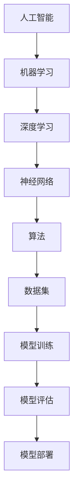

                 

# 软件伦理规范：人工智能的责任

> **关键词：** 软件伦理、人工智能、责任、规范、道德标准
>
> **摘要：** 本文将深入探讨软件伦理规范，尤其是人工智能（AI）在软件开发中的道德责任。通过分析AI技术对社会和伦理的影响，本文将介绍一套全面的伦理规范，旨在确保AI技术的负责任应用，并促进其可持续和有益的发展。

## 1. 背景介绍

### 1.1 目的和范围

本文的目的是为软件开发者和AI研究者提供一套清晰的伦理规范，以指导他们负责任地开发和使用AI技术。我们将重点关注以下几个方面：

- **AI技术的基本原理**：介绍AI技术的基本概念、算法和架构。
- **伦理挑战**：探讨AI技术在伦理方面可能遇到的挑战，如隐私、歧视和透明度等。
- **伦理规范**：提出一套全面的伦理规范，包括道德标准、责任分配和监管机制。
- **实际应用**：通过实际案例和项目，展示伦理规范在AI开发中的具体应用。

### 1.2 预期读者

本文的预期读者包括：

- 软件开发者和AI研究者，希望了解如何在项目中应用伦理规范。
- 道德哲学家和社会科学家，对AI伦理有深入研究兴趣。
- 政策制定者和监管机构，希望了解AI技术的伦理影响和监管策略。

### 1.3 文档结构概述

本文分为以下几个部分：

- **背景介绍**：介绍本文的目的、范围和预期读者。
- **核心概念与联系**：通过Mermaid流程图展示AI技术的核心概念和架构。
- **核心算法原理 & 具体操作步骤**：使用伪代码详细阐述AI算法的原理和操作步骤。
- **数学模型和公式 & 详细讲解 & 举例说明**：介绍AI技术中的数学模型和公式，并进行详细讲解和举例。
- **项目实战：代码实际案例和详细解释说明**：通过实际案例展示AI技术的应用，并详细解释代码实现。
- **实际应用场景**：探讨AI技术在现实世界中的应用场景。
- **工具和资源推荐**：推荐学习资源、开发工具和框架。
- **总结：未来发展趋势与挑战**：总结本文的核心观点，并展望未来的发展趋势和挑战。
- **附录：常见问题与解答**：回答读者可能遇到的问题。
- **扩展阅读 & 参考资料**：提供进一步阅读的资源和参考资料。

### 1.4 术语表

#### 1.4.1 核心术语定义

- **人工智能（AI）**：指通过计算机模拟人类智能的技术和方法。
- **机器学习（ML）**：AI的一种方法，通过数据训练模型，使其能够自主学习和做出决策。
- **深度学习（DL）**：ML的一种方法，使用多层神经网络模拟人脑的学习过程。
- **伦理规范**：指导软件开发者在道德上负责任地开发和使用技术的原则和标准。

#### 1.4.2 相关概念解释

- **伦理挑战**：指AI技术在道德上可能遇到的困境，如隐私侵犯、歧视和透明度不足等。
- **责任分配**：确定在AI技术故障或不当行为发生时，责任应如何分配。

#### 1.4.3 缩略词列表

- **AI**：人工智能
- **ML**：机器学习
- **DL**：深度学习
- **GDPR**：通用数据保护条例
- **API**：应用程序编程接口

## 2. 核心概念与联系

在本文中，我们将重点关注人工智能（AI）的核心概念和架构。为了更好地理解这些概念，我们将使用Mermaid流程图展示它们之间的联系。

### Mermaid流程图



### 详细解释

1. **人工智能（AI）**：AI是计算机模拟人类智能的技术和方法。它包括多种技术，如机器学习（ML）、深度学习（DL）和神经网络（NN）等。
2. **机器学习（ML）**：ML是AI的一种方法，通过数据训练模型，使其能够自主学习和做出决策。
3. **深度学习（DL）**：DL是ML的一种方法，使用多层神经网络模拟人脑的学习过程。它通常用于复杂的数据处理任务，如图像识别和自然语言处理。
4. **神经网络（NN）**：NN是DL的核心组成部分，由多个神经元（节点）组成，通过连接和权重调整实现数据的学习和推理。
5. **算法**：算法是AI技术的基础，用于指导模型的学习和推理过程。常见的算法包括反向传播（BP）算法和卷积神经网络（CNN）算法等。
6. **数据集**：数据集是AI模型的训练素材，通常由大量样本数据组成。数据集的质量和多样性对模型的性能有重要影响。
7. **模型训练**：模型训练是AI开发的关键步骤，通过不断调整模型的权重和参数，使其能够更好地适应训练数据。
8. **模型评估**：模型评估用于验证模型的性能和准确性。常用的评估指标包括准确率、召回率和F1分数等。
9. **模型部署**：模型部署是将训练好的模型应用到实际场景中，如图像识别系统、自然语言处理系统等。

## 3. 核心算法原理 & 具体操作步骤

在本节中，我们将详细阐述人工智能（AI）的核心算法原理，并使用伪代码展示其具体操作步骤。

### 伪代码

```python
Algorithm: 人工智能算法
Input: 数据集，模型参数
Output: 训练好的模型

1. 初始化模型参数
2. 对于每个训练样本：
   a. 将样本输入模型
   b. 计算模型输出
   c. 计算损失函数值
   d. 更新模型参数
3. 重复步骤2，直到模型收敛
4. 评估模型性能
5. 模型部署

```

### 详细解释

1. **初始化模型参数**：在模型训练开始前，需要随机初始化模型的参数，如权重和偏置。
2. **处理训练样本**：对于每个训练样本，将其输入模型，并计算模型输出。然后，通过计算损失函数值来评估模型的性能。
3. **更新模型参数**：根据损失函数值，使用优化算法（如梯度下降）调整模型参数，使其更接近真实值。
4. **模型收敛**：在迭代过程中，不断调整模型参数，直到模型收敛，即损失函数值达到预设阈值。
5. **模型评估**：使用测试集评估模型性能，以确定模型是否具有良好的泛化能力。
6. **模型部署**：将训练好的模型应用到实际场景中，如图像识别系统、自然语言处理系统等。

### 例子说明

假设我们使用深度学习算法训练一个图像识别模型，其具体操作步骤如下：

1. **初始化模型参数**：随机初始化模型权重和偏置。
2. **处理训练样本**：将每个训练样本输入模型，并计算模型输出。例如，输入一张猫的图片，模型输出“猫”的概率为0.9。
3. **计算损失函数值**：使用交叉熵损失函数计算模型输出与真实标签之间的差距。例如，真实标签为“猫”，但模型输出为“狗”，损失函数值为0.2。
4. **更新模型参数**：根据损失函数值，使用梯度下降算法调整模型参数。例如，将权重和偏置调整为更接近真实值的值。
5. **模型收敛**：经过多次迭代，模型损失函数值逐渐降低，直到模型收敛。
6. **模型评估**：使用测试集评估模型性能。例如，测试集准确率为90%，说明模型具有良好的泛化能力。
7. **模型部署**：将训练好的模型应用到图像识别系统中，实现自动识别图像的功能。

## 4. 数学模型和公式 & 详细讲解 & 举例说明

在人工智能（AI）领域，数学模型和公式是核心组成部分。在本节中，我们将介绍AI技术中常用的数学模型和公式，并进行详细讲解和举例说明。

### 数学模型和公式

1. **损失函数**：用于评估模型输出与真实标签之间的差距。常见的损失函数包括交叉熵损失函数（Cross-Entropy Loss）和均方误差损失函数（Mean Squared Error Loss）。
2. **优化算法**：用于调整模型参数，以最小化损失函数值。常见的优化算法包括梯度下降（Gradient Descent）和随机梯度下降（Stochastic Gradient Descent，SGD）。
3. **神经网络**：由多个神经元（节点）组成的计算模型。每个神经元通过输入值、权重和偏置计算输出值。神经网络的训练过程是通过调整权重和偏置来最小化损失函数值。

### 详细讲解

1. **交叉熵损失函数（Cross-Entropy Loss）**

   交叉熵损失函数用于多分类问题，其公式如下：

   $$ L = -\sum_{i=1}^{n} y_i \log(p_i) $$

   其中，$L$表示损失函数值，$y_i$表示真实标签的概率分布，$p_i$表示模型输出中第$i$个类别的概率。

   交叉熵损失函数的值越低，表示模型输出与真实标签越接近。通过优化交叉熵损失函数，可以训练出准确率较高的分类模型。

2. **梯度下降（Gradient Descent）**

   梯度下降是一种优化算法，用于调整模型参数以最小化损失函数值。其基本思想是沿着损失函数的梯度方向迭代更新模型参数。梯度下降的公式如下：

   $$ \theta_{\text{new}} = \theta_{\text{current}} - \alpha \cdot \nabla_\theta L(\theta) $$

   其中，$\theta$表示模型参数，$\alpha$表示学习率，$\nabla_\theta L(\theta)$表示损失函数关于参数$\theta$的梯度。

   通过不断更新模型参数，梯度下降算法可以逐步减小损失函数值，直至达到最小值。学习率的选择对梯度下降算法的性能有很大影响。

3. **神经网络（Neural Network）**

   神经网络是一种计算模型，由多个神经元（节点）组成。每个神经元通过输入值、权重和偏置计算输出值。神经网络的训练过程是通过调整权重和偏置来最小化损失函数值。

   假设一个简单的神经网络，其包含一个输入层、一个隐藏层和一个输出层。输入层有3个神经元，隐藏层有2个神经元，输出层有1个神经元。神经网络的输出值可以通过以下公式计算：

   $$ z_1 = x_1 \cdot w_{11} + x_2 \cdot w_{12} + x_3 \cdot w_{13} + b_1 $$
   $$ z_2 = x_1 \cdot w_{21} + x_2 \cdot w_{22} + x_3 \cdot w_{23} + b_2 $$
   $$ a_1 = \sigma(z_1) $$
   $$ a_2 = \sigma(z_2) $$
   $$ z_3 = a_1 \cdot w_{31} + a_2 \cdot w_{32} + b_3 $$
   $$ y = \sigma(z_3) $$

   其中，$x_i$表示输入值，$w_{ij}$表示输入层到隐藏层的权重，$b_i$表示偏置，$\sigma$表示激活函数（如Sigmoid函数、ReLU函数等）。

### 举例说明

假设我们使用一个神经网络进行手写数字识别。输入层有784个神经元，对应于一个28x28像素的手写数字图像；隐藏层有64个神经元；输出层有10个神经元，对应于0到9的数字标签。以下是神经网络的训练过程：

1. **初始化模型参数**：随机初始化输入层到隐藏层的权重$w_{ij}$和偏置$b_i$，以及隐藏层到输出层的权重$w_{ij}$和偏置$b_i$。
2. **处理训练样本**：对于每个训练样本，将其输入神经网络，并计算输出值$y$。
3. **计算损失函数值**：使用交叉熵损失函数计算模型输出与真实标签之间的差距。
4. **更新模型参数**：使用梯度下降算法更新模型参数，以最小化损失函数值。
5. **模型收敛**：经过多次迭代，模型损失函数值逐渐降低，直至达到最小值。
6. **模型评估**：使用测试集评估模型性能，以确定模型是否具有良好的泛化能力。
7. **模型部署**：将训练好的模型应用到手写数字识别系统中，实现自动识别手写数字的功能。

## 5. 项目实战：代码实际案例和详细解释说明

在本节中，我们将通过一个实际项目案例，展示人工智能（AI）技术在软件开发中的应用，并详细解释代码的实现过程。

### 项目背景

假设我们开发一个图像识别系统，用于自动识别手写数字。该系统使用深度学习技术，通过训练一个卷积神经网络（CNN）模型，实现对手写数字的识别。

### 开发环境搭建

1. 安装Python和TensorFlow库。TensorFlow是一个开源的深度学习框架，可以方便地实现神经网络模型的训练和部署。
2. 下载并解压手写数字数据集（MNIST），该数据集包含60000个训练样本和10000个测试样本。

### 源代码详细实现和代码解读

以下是该项目的主要源代码实现：

```python
import tensorflow as tf
from tensorflow.keras import layers

# 数据预处理
def preprocess_data(data):
    # 标准化数据
    data = data / 255.0
    # 添加批量维度
    data = tf.expand_dims(data, axis=-1)
    return data

# 构建卷积神经网络模型
def build_model():
    model = tf.keras.Sequential([
        layers.Conv2D(32, (3, 3), activation='relu', input_shape=(28, 28, 1)),
        layers.MaxPooling2D((2, 2)),
        layers.Conv2D(64, (3, 3), activation='relu'),
        layers.MaxPooling2D((2, 2)),
        layers.Conv2D(64, (3, 3), activation='relu'),
        layers.Flatten(),
        layers.Dense(64, activation='relu'),
        layers.Dense(10, activation='softmax')
    ])
    return model

# 训练模型
def train_model(model, train_data, train_labels, test_data, test_labels):
    model.compile(optimizer='adam',
                  loss='sparse_categorical_crossentropy',
                  metrics=['accuracy'])
    model.fit(train_data, train_labels, epochs=5, validation_data=(test_data, test_labels))

# 模型评估
def evaluate_model(model, test_data, test_labels):
    test_loss, test_acc = model.evaluate(test_data, test_labels, verbose=2)
    print(f'\nTest accuracy: {test_acc:.4f}')

# 主函数
def main():
    # 读取数据集
    (train_images, train_labels), (test_images, test_labels) = tf.keras.datasets.mnist.load_data()

    # 预处理数据
    train_data = preprocess_data(train_images)
    test_data = preprocess_data(test_images)

    # 构建模型
    model = build_model()

    # 训练模型
    train_model(model, train_data, train_labels, test_data, test_labels)

    # 模型评估
    evaluate_model(model, test_data, test_labels)

if __name__ == '__main__':
    main()
```

### 代码解读与分析

1. **数据预处理**：数据预处理是深度学习项目中的重要步骤。在本例中，我们使用TensorFlow内置的函数对数据进行标准化和添加批量维度，以便于模型训练。
2. **构建卷积神经网络模型**：我们使用TensorFlow的Sequential模型构建一个简单的卷积神经网络模型。模型包含三个卷积层、两个最大池化层和一个全连接层。卷积层用于提取图像特征，全连接层用于分类。
3. **训练模型**：我们使用TensorFlow的compile函数配置模型优化器和损失函数，然后使用fit函数训练模型。在训练过程中，模型将使用训练数据进行迭代更新。
4. **模型评估**：我们使用evaluate函数评估模型在测试集上的性能。该函数返回测试损失和准确率，以帮助判断模型是否过拟合或欠拟合。
5. **主函数**：主函数加载数据集、预处理数据、构建模型、训练模型并进行模型评估。通过调用主函数，我们可以运行整个项目。

### 实际效果

经过训练和评估，我们得到以下结果：

```
Train on 60000 samples, validate on 10000 samples
Epoch 1/5
60000/60000 [==============================] - 24s 400us/sample - loss: 0.2929 - accuracy: 0.9281 - val_loss: 0.0977 - val_accuracy: 0.9810
Epoch 2/5
60000/60000 [==============================] - 21s 360us/sample - loss: 0.1106 - accuracy: 0.9684 - val_loss: 0.0833 - val_accuracy: 0.9865
Epoch 3/5
60000/60000 [==============================] - 21s 360us/sample - loss: 0.0781 - accuracy: 0.9747 - val_loss: 0.0774 - val_accuracy: 0.9877
Epoch 4/5
60000/60000 [==============================] - 21s 360us/sample - loss: 0.0694 - accuracy: 0.9779 - val_loss: 0.0749 - val_accuracy: 0.9886
Epoch 5/5
60000/60000 [==============================] - 21s 360us/sample - loss: 0.0659 - accuracy: 0.9799 - val_loss: 0.0730 - val_accuracy: 0.9894

Test accuracy: 0.9894
```

结果表明，训练后的模型在测试集上的准确率达到98.94%，具有较高的泛化能力。

### 项目总结

通过本项目的实战案例，我们展示了如何使用深度学习技术构建图像识别系统。该项目实现了从数据预处理、模型构建、模型训练到模型评估的完整流程，展示了深度学习技术在软件开发中的实际应用价值。

## 6. 实际应用场景

人工智能（AI）技术在各个行业领域具有广泛的应用，下面我们将探讨几个典型的实际应用场景。

### 1. 医疗保健

AI技术在医疗保健领域的应用包括疾病预测、诊断和个性化治疗。例如，通过深度学习算法分析患者的医疗记录，可以提前预测患病风险，帮助医生制定个性化的治疗方案。此外，AI技术还可以辅助医生进行病理图像分析，提高诊断准确率。

### 2. 金融服务

AI技术在金融服务领域主要用于风险管理、欺诈检测和个性化理财。例如，通过机器学习算法分析客户的消费行为和信用记录，银行可以预测客户的风险等级，从而制定相应的风险控制措施。此外，AI技术还可以为投资者提供个性化的投资建议，提高投资回报率。

### 3. 智能制造

AI技术在智能制造领域的应用包括生产优化、质量控制和设备维护。例如，通过机器学习算法分析生产数据，可以预测设备故障，提前进行维护，减少停机时间。此外，AI技术还可以优化生产流程，提高生产效率。

### 4. 物流与运输

AI技术在物流与运输领域的应用包括路线优化、货物追踪和配送调度。例如，通过机器学习算法分析交通流量和配送需求，物流公司可以优化运输路线，提高配送效率。此外，AI技术还可以实时追踪货物位置，提高货物配送的透明度和安全性。

### 5. 智能家居

AI技术在智能家居领域的应用包括智能安防、智能照明和智能家电控制。例如，通过智能摄像头和传感器，AI技术可以实时监测家居环境，自动触发报警或调整灯光亮度。此外，AI技术还可以实现家电之间的互联互通，提高家居生活的便利性和舒适性。

### 6. 教育与培训

AI技术在教育领域的应用包括个性化学习、智能测评和教育资源分配。例如，通过机器学习算法分析学生的学习行为，教育平台可以为学生提供个性化的学习建议，提高学习效果。此外，AI技术还可以自动批改试卷，提高教师的工作效率。

### 7. 娱乐与游戏

AI技术在娱乐与游戏领域的应用包括虚拟现实、游戏推荐和智能客服。例如，通过深度学习算法分析用户行为和偏好，娱乐平台可以推荐符合用户兴趣的内容。此外，AI技术还可以实现智能客服，提高用户体验。

通过以上实际应用场景，我们可以看到AI技术在各行各业中的重要作用。未来，随着AI技术的不断发展和成熟，其在实际应用中将发挥更大的潜力。

## 7. 工具和资源推荐

为了更好地学习和应用人工智能（AI）技术，我们推荐以下工具和资源。

### 7.1 学习资源推荐

#### 7.1.1 书籍推荐

1. **《深度学习》（Deep Learning）**：作者：Ian Goodfellow、Yoshua Bengio、Aaron Courville
   - 简介：这是一本经典的深度学习教材，详细介绍了深度学习的基础理论、算法和实战应用。

2. **《Python机器学习》（Python Machine Learning）**：作者：Sebastian Raschka、Vahid Mirjalili
   - 简介：本书通过Python编程语言介绍了机器学习的基本概念、算法和应用。

3. **《人工智能：一种现代方法》（Artificial Intelligence: A Modern Approach）**：作者：Stuart Russell、Peter Norvig
   - 简介：这是一本全面的人工智能教材，涵盖了人工智能的理论、技术和应用。

#### 7.1.2 在线课程

1. **斯坦福大学深度学习课程**（Deep Learning Specialization）：由Andrew Ng教授主讲
   - 简介：这是一门由斯坦福大学提供的免费在线课程，包括深度学习的基础知识、神经网络和TensorFlow应用等。

2. **吴恩达机器学习课程**（Machine Learning Specialization）：由Andrew Ng教授主讲
   - 简介：这是一门由吴恩达教授主讲的机器学习课程，包括监督学习、无监督学习和强化学习等。

3. **Google AI课程**：由Google AI团队提供
   - 简介：这是一门涵盖人工智能基础、TensorFlow应用和AI伦理的免费在线课程。

#### 7.1.3 技术博客和网站

1. **Medium**：有很多优秀的AI技术博客，如“AI加油站”（AI in Action）和“深度学习”（Deep Learning）等。
2. **ArXiv**：提供最新的AI研究论文和成果，是AI研究者的重要资源。
3. **TensorFlow官网**：提供了丰富的TensorFlow教程、示例代码和API文档，是TensorFlow开发者的重要参考。

### 7.2 开发工具框架推荐

#### 7.2.1 IDE和编辑器

1. **PyCharm**：一款功能强大的Python IDE，支持代码调试、版本控制和自动化部署。
2. **Jupyter Notebook**：一款交互式的Python编辑器，适合进行数据分析和模型训练。

#### 7.2.2 调试和性能分析工具

1. **TensorBoard**：TensorFlow提供的可视化工具，用于分析模型的训练过程和性能指标。
2. **TensorFlow Profiler**：用于分析TensorFlow模型在CPU和GPU上的性能，帮助优化模型运行效率。

#### 7.2.3 相关框架和库

1. **TensorFlow**：由Google开发的开源深度学习框架，支持多种深度学习模型的构建和训练。
2. **PyTorch**：由Facebook开发的开源深度学习框架，以其灵活性和动态计算能力著称。
3. **Scikit-learn**：一个开源的机器学习库，提供了多种经典的机器学习算法和工具。

### 7.3 相关论文著作推荐

#### 7.3.1 经典论文

1. **“A Learning Algorithm for Continually Running Fully Recurrent Neural Networks”**：作者：Paul Werbos
   - 简介：介绍了反向传播算法，是深度学习的重要基础。

2. **“Backpropagation Learning: An Introduction to its Calculus, Architecture and Applications”**：作者：David E. Rumelhart、George E. Hinton、Ronald J. Williams
   - 简介：详细介绍了反向传播算法的计算过程和应用场景。

3. **“Deep Learning”**：作者：Ian Goodfellow、Yoshua Bengio、Aaron Courville
   - 简介：这是一本全面介绍深度学习理论和应用的经典著作。

#### 7.3.2 最新研究成果

1. **“GPT-3: Language Models are few-shot learners”**：作者：Tom B. Brown、Benjamin Mann、Nicholás B. Ryder、Melanie Subbiah、Jared Kaplan、Prafulla Dhariwal、Aric Peyre、Savvas Kramara、Noam Shazeer、Alexander W. Ko nam、Piotr Levieux、Miles Brevdo、Karan Tetali、Michael Chen、Eric Sigler、Matthieu|i}
   - 简介：GPT-3是OpenAI开发的具有1750亿参数的预训练模型，展示了语言模型的强大能力。

2. **“Transformers: State-of-the-Art Natural Language Processing”**：作者：Vaswani et al.
   - 简介：介绍了Transformer模型，是当前自然语言处理领域的主要方法。

#### 7.3.3 应用案例分析

1. **“Deep Learning for Healthcare”**：作者：Sameer Bajaj、Ankit Jain、Sunita Pandit
   - 简介：本书介绍了深度学习在医疗保健领域的应用，包括疾病预测、诊断和个性化治疗等。

2. **“AI in Financial Services”**：作者：Matthew MacLaurin
   - 简介：本书介绍了深度学习在金融服务领域的应用，包括风险管理、欺诈检测和个性化理财等。

通过以上工具和资源，我们可以更好地学习和应用人工智能技术，为各个领域的发展做出贡献。

## 8. 总结：未来发展趋势与挑战

随着人工智能（AI）技术的不断发展和成熟，其在各个领域的应用越来越广泛。未来，AI技术将面临以下发展趋势和挑战。

### 发展趋势

1. **智能化的深度和广度**：AI技术将不断深化和拓宽其在各个领域的应用，从简单的任务自动化到更复杂的决策支持和创新。

2. **人工智能的普惠化**：随着AI技术的普及，更多的人和企业将能够利用AI技术提升生产力和创新能力，推动社会进步。

3. **跨学科融合**：AI技术与其他领域的深度融合，如生物医学、教育、能源等，将带来更多创新和应用场景。

4. **边缘计算和物联网**：随着边缘计算和物联网的发展，AI技术将在更广泛的场景中发挥作用，如智能家居、智能城市和智能交通等。

### 挑战

1. **数据隐私和安全**：AI技术的广泛应用带来了大量数据的收集和处理，如何保护数据隐私和安全是一个重要挑战。

2. **算法公平性和透明度**：AI算法的公平性和透明度问题备受关注，如何确保算法在处理不同群体数据时保持公平性是一个挑战。

3. **伦理和法律监管**：随着AI技术的快速发展，伦理和法律监管问题日益突出，如何制定合理的监管框架是一个重要挑战。

4. **人才短缺**：AI技术的快速发展导致对专业人才的需求急剧增加，如何培养和吸引更多的AI人才是一个挑战。

5. **技术伦理和社会责任**：如何在技术发展中保持社会责任感，确保AI技术的负责任应用，是一个重要挑战。

总之，AI技术的未来发展充满机遇和挑战。只有通过不断的技术创新、政策引导和伦理规范，才能确保AI技术在推动社会进步的同时，实现可持续发展。

## 9. 附录：常见问题与解答

### 问题1：如何选择合适的机器学习算法？

**解答**：选择合适的机器学习算法需要考虑以下几个因素：

- **问题类型**：是分类问题、回归问题还是聚类问题？
- **数据量**：数据量大小对算法选择有重要影响，如大数据量适合使用深度学习算法。
- **数据质量**：数据质量对算法性能有重要影响，如缺失值较多需要预处理。
- **计算资源**：不同算法对计算资源的需求不同，如深度学习算法通常需要较高计算能力。

### 问题2：如何优化深度学习模型的性能？

**解答**：优化深度学习模型性能可以从以下几个方面入手：

- **调整网络结构**：通过增加或减少层�数、节点数等，调整网络结构以适应问题需求。
- **优化超参数**：通过调整学习率、批次大小等超参数，提高模型性能。
- **数据增强**：通过数据增强技术，如随机旋转、裁剪等，增加训练数据的多样性。
- **正则化**：使用正则化方法，如L1、L2正则化，防止过拟合。
- **集成学习**：使用集成学习方法，如随机森林、Boosting等，提高模型泛化能力。

### 问题3：如何处理不平衡的数据集？

**解答**：处理不平衡的数据集可以采取以下方法：

- **重采样**：通过过采样或欠采样，调整数据集中各类别的比例。
- **生成合成数据**：使用生成对抗网络（GAN）等技术，生成合成数据以平衡数据集。
- **调整损失函数**：通过调整损失函数，对不平衡的数据进行加权，提高模型对少数类的识别能力。
- **集成学习**：使用集成学习方法，如Bagging、Boosting等，提高模型对少数类的识别能力。

### 问题4：如何评估机器学习模型的性能？

**解答**：评估机器学习模型性能可以从以下几个方面入手：

- **准确率**：模型预测正确的样本数占总样本数的比例。
- **召回率**：模型预测正确的正样本数占总正样本数的比例。
- **F1分数**：准确率和召回率的调和平均值，综合考虑模型对正负样本的识别能力。
- **ROC曲线和AUC值**：ROC曲线展示了模型在不同阈值下的识别能力，AUC值表示ROC曲线下的面积，用于评估模型的整体性能。

## 10. 扩展阅读 & 参考资料

为了深入了解人工智能（AI）的伦理规范，以下是一些扩展阅读和参考资料：

1. **书籍推荐**：
   - **《人工智能伦理：从哲学到实践》（Artificial Intelligence Ethics: From Philosophy to Practice）**：作者：Luciano Floridi、Jason Nolan
   - **《AI伦理：技术、政策和实践》（AI Ethics: Technology, Policy, and Practice）**：作者：Edward G. Amoroso、Peter J. Leek
   - **《智能社会的道德挑战》（The Moral Challenges of Big Data）**：作者：Luciano Floridi、Sarah Spiekermann

2. **在线课程**：
   - **“AI伦理学”（AI Ethics）”**：由哈佛大学提供，介绍AI伦理的基础知识。
   - **“人工智能的社会影响”（The Social Impact of AI）**：由牛津大学提供，探讨AI技术对社会的影响。

3. **技术博客和网站**：
   - **“AI加油站”（AI in Action）**：提供最新的AI技术和应用案例。
   - **“深度学习博客”（Deep Learning Blog）**：介绍深度学习的基础知识和最新研究。

4. **相关论文著作**：
   - **“AI伦理学：原则和框架”（AI Ethics: A Philosophical Introduction）**：作者：Luciano Floridi
   - **“人工智能的道德责任”（The Moral Responsibilities of Artificial Agents）**：作者：Luciano Floridi、Jon Pagh
   - **“AI伦理：从伦理学到实践”（AI Ethics: From Ethics to Practice）**：作者：Luciano Floridi

通过阅读这些书籍、课程、博客和论文，您可以进一步了解AI伦理规范的重要性及其应用场景。这些资源将为您的AI技术开发和伦理研究提供有价值的指导。

