                 

### 软件与人工智能

#### 1.1  软件的定义和演变

软件是计算机程序、相关文档和数据的集合，用于指导计算机执行特定任务。从最初的简单程序到如今的复杂系统，软件的发展经历了多个阶段。从早期的批处理系统、操作系统、应用程序，到当今的互联网服务、云计算平台、物联网设备，软件的应用领域和形态不断扩展和演变。

软件1.0时代，软件主要以单机应用为主，如早期的文本编辑器和电子表格软件。软件2.0时代，随着互联网的兴起，软件逐渐从单机走向网络，实现了更广泛的连接和共享。软件3.0时代，人工智能和大数据等新技术的发展，使软件具备了自学习、自适应和自优化能力，推动了智能软件的普及和应用。

#### 1.2  人工智能的定义和关键特性

人工智能（Artificial Intelligence，简称AI）是模拟、延伸和扩展人类智能的理论、方法、技术及应用。它旨在通过计算机程序实现机器的智能行为，使其具备感知、理解、学习、推理和决策等能力。

人工智能的关键特性包括：

1. **感知能力**：通过视觉、听觉、触觉等多种传感器，机器能够感知和理解外界环境。
2. **学习能力**：机器能够从海量数据中自动学习和发现规律，实现知识的积累和迁移。
3. **推理能力**：基于已有知识和数据，机器能够进行逻辑推理，做出合理决策。
4. **自适应能力**：机器能够根据环境和任务的变化，自动调整其行为和策略。
5. **交互能力**：机器能够与人类进行自然语言交互，实现人机对话。

人工智能的发展历程可以追溯到20世纪50年代，随着计算机性能的不断提升和算法的不断创新，人工智能逐渐从理论研究走向实际应用。从早期的符号推理、知识表示，到机器学习、深度学习等技术的发展，人工智能取得了显著的突破和进展。

#### 1.3  软件与人工智能的融合

软件与人工智能的融合，使软件具备了更强大的功能和更广泛的应用场景。在软件2.0时代，人工智能技术已经深入到了许多领域，如自然语言处理、计算机视觉、自动驾驶、智能家居等。

1. **自然语言处理（NLP）**：利用人工智能技术，软件可以实现自动文本分析、翻译、摘要、问答等功能，为用户提供更智能的服务。
2. **计算机视觉（CV）**：通过计算机视觉技术，软件可以实现对图像和视频的识别、分类、分割、追踪等功能，广泛应用于安防监控、医疗诊断、工业检测等领域。
3. **自动驾驶**：利用人工智能技术，自动驾驶系统可以实现对车辆环境的感知、理解、规划和控制，提高交通效率和安全性。
4. **智能家居**：智能家居系统通过人工智能技术，可以实现家电设备的智能控制、场景联动、语音交互等功能，提升用户的居住体验。
5. **医疗健康**：利用人工智能技术，软件可以辅助医生进行疾病诊断、治疗方案推荐、健康监测等，提高医疗服务质量。

总之，软件与人工智能的融合，不仅推动了软件技术的发展，也为人们的生活和工作带来了诸多便利和改变。然而，这也带来了一系列伦理和社会问题，需要我们深入思考和探讨。

---

通过上述分析，我们可以看出，软件和人工智能的发展历程及其关键特性，以及它们在各个领域的应用，为软件2.0时代的到来奠定了基础。在接下来的章节中，我们将进一步探讨软件2.0的伦理规范，特别是在人工智能领域所面临的责任和挑战。请读者朋友们继续关注。  
**核心关键词**：软件、人工智能、软件1.0、软件2.0、软件3.0、自然语言处理、计算机视觉、自动驾驶、智能家居、医疗健康。

---

> **关键词**：软件伦理、人工智能责任、道德决策、算法公平性、隐私保护、人工智能安全。

**摘要**：本文将深入探讨软件2.0时代中人工智能的伦理规范，分析人工智能在软件领域中的角色及其所带来的责任和挑战。我们将从核心概念、算法原理、数学模型、实际应用等方面，详细阐述人工智能的道德决策、算法公平性、隐私保护和安全等问题。通过本文的讨论，旨在为软件工程师和人工智能研究者提供有价值的思考和指导，共同推动软件2.0时代的发展与进步。

---

## 1. 背景介绍

### 1.1 目的和范围

本文旨在探讨软件2.0时代中人工智能的伦理规范，特别是人工智能在软件领域中的责任和挑战。随着人工智能技术的飞速发展，其在各个领域的应用日益广泛，但随之而来的是一系列伦理问题。本文将围绕以下核心主题展开：

1. **人工智能的道德决策**：如何确保人工智能系统能够在复杂环境下做出符合伦理标准的决策？
2. **算法公平性**：如何确保人工智能算法在不同群体中的公平性和透明性？
3. **隐私保护**：如何在人工智能应用中有效保护用户隐私？
4. **人工智能安全**：如何确保人工智能系统的稳定性和安全性，防止恶意攻击和滥用？

本文将首先介绍软件2.0时代的基本概念和人工智能的发展背景，然后详细分析上述核心主题，并探讨相应的解决方案。通过本文的探讨，旨在为软件工程师、人工智能研究者及相关从业者提供有价值的思考和指导，共同推动软件2.0时代的发展与进步。

### 1.2 预期读者

本文的预期读者主要包括以下几类：

1. **软件工程师**：对于在软件领域工作，尤其是涉及人工智能应用的工程师，本文将提供关于伦理规范和责任的重要见解，帮助他们更好地理解和应对实际工作中的伦理挑战。
2. **人工智能研究者**：对于在人工智能领域从事研究的学者和研究人员，本文将探讨人工智能在软件应用中的道德决策、公平性、隐私保护和安全等问题，为他们提供理论上的支持和实践上的指导。
3. **企业决策者**：对于在企业中担任决策角色的管理人员，本文将分析人工智能伦理规范的重要性，以及如何在企业发展中制定和遵循相关伦理标准，从而确保企业的可持续发展。
4. **政策制定者**：对于政府机构中的政策制定者，本文将探讨人工智能伦理规范在国家治理和监管中的角色和影响，为他们提供制定相关政策和法规的参考。

通过本文的阅读，读者将能够更深入地理解人工智能在软件领域中的伦理规范，学会如何在实践中应对相关责任和挑战，为软件2.0时代的健康发展贡献力量。

### 1.3 文档结构概述

本文将采用结构化的方式，系统性地探讨软件2.0时代中人工智能的伦理规范。整体结构如下：

1. **第1章 背景介绍**：介绍本文的目的、范围和预期读者，并概述本文的结构和核心主题。
2. **第2章 核心概念与联系**：阐述人工智能的基本概念、发展历程及其在软件中的应用，并通过流程图展示核心概念和架构的联系。
3. **第3章 核心算法原理 & 具体操作步骤**：详细讲解人工智能算法的基本原理和操作步骤，使用伪代码展示具体实现。
4. **第4章 数学模型和公式 & 详细讲解 & 举例说明**：介绍与人工智能相关的数学模型和公式，并进行详细讲解和实例分析。
5. **第5章 项目实战：代码实际案例和详细解释说明**：通过实际代码案例，展示人工智能算法在软件开发中的具体应用，并进行详细解释和代码解读。
6. **第6章 实际应用场景**：探讨人工智能在各个领域的实际应用场景，分析其带来的影响和挑战。
7. **第7章 工具和资源推荐**：推荐相关的学习资源、开发工具和框架，为读者提供实用的参考资料。
8. **第8章 总结：未来发展趋势与挑战**：总结本文的主要观点，并对未来发展趋势和挑战进行展望。
9. **第9章 附录：常见问题与解答**：回答读者可能关心的问题，提供进一步的帮助。
10. **第10章 扩展阅读 & 参考资料**：列出本文引用的参考资料和扩展阅读，便于读者深入研究和探讨。

通过本文的结构化探讨，读者将能够全面了解软件2.0时代中人工智能的伦理规范，掌握相关理论知识和实践方法，为实际工作提供指导。

### 1.4 术语表

在本文中，我们将使用一些特定的术语和概念，为了确保读者对这些术语有清晰的理解，以下是这些术语的定义和解释：

#### 1.4.1 核心术语定义

- **人工智能（AI）**：模拟、延伸和扩展人类智能的理论、方法、技术及应用。
- **软件伦理**：与软件设计和应用相关的伦理原则和规范。
- **算法公平性**：确保算法在不同群体中的公平性和透明性。
- **隐私保护**：保护用户隐私，防止数据泄露和滥用。
- **道德决策**：人工智能系统在复杂环境下做出的符合伦理标准的决策。
- **数据偏见**：由于数据来源或处理过程中的问题，导致算法产生偏见。
- **透明性**：算法和系统的内部运作过程可以被用户理解和审查。

#### 1.4.2 相关概念解释

- **软件1.0**：单机应用时代，软件以独立程序为主，功能相对简单。
- **软件2.0**：互联网时代，软件通过网络实现连接和共享，功能逐渐复杂化。
- **软件3.0**：人工智能时代，软件具备自学习、自适应和自优化能力，实现智能化。
- **深度学习**：一种通过多层神经网络进行特征学习和自动抽象的机器学习方法。
- **机器学习**：使机器具备学习能力的理论和方法，包括监督学习、无监督学习和强化学习等。

#### 1.4.3 缩略词列表

- **AI**：人工智能
- **NLP**：自然语言处理
- **CV**：计算机视觉
- **ML**：机器学习
- **DL**：深度学习
- **IoT**：物联网
- **CRM**：客户关系管理
- **ERP**：企业资源计划
- **SDK**：软件开发工具包
- **API**：应用程序编程接口

通过上述术语和概念的详细定义和解释，读者将能够更好地理解本文中的核心内容和相关背景知识，为后续章节的深入探讨打下基础。在接下来的章节中，我们将进一步分析人工智能在软件2.0时代中的伦理规范，探讨其责任和挑战。请读者朋友们继续关注。

## 2. 核心概念与联系

在深入探讨软件2.0时代中人工智能的伦理规范之前，我们需要首先了解一些核心概念及其相互之间的联系。本节将通过一个简化的Mermaid流程图来展示这些概念和它们在软件架构中的应用。

```mermaid
graph TD
    A[软件伦理] --> B[人工智能伦理]
    A --> C[算法公平性]
    A --> D[隐私保护]
    A --> E[道德决策]
    B --> F[算法透明性]
    B --> G[数据偏见处理]
    B --> H[责任归属]
    C --> I[公平性检测]
    C --> J[算法解释性]
    D --> K[数据加密]
    D --> L[隐私政策]
    E --> M[情境感知]
    E --> N[后果预测]
    F --> O[算法可审计性]
    F --> P[算法可视化]
    G --> Q[数据清洗]
    G --> R[训练数据多样性]
    H --> S[法律框架]
    H --> T[伦理委员会]
    I --> U[统计偏差分析]
    I --> V[群体公平性比较]
    J --> W[决策路径分析]
    J --> X[透明性报告]
    K --> Y[加密算法选择]
    K --> Z[密钥管理]
    L --> AA[隐私保护政策制定]
    L --> BB[用户同意协议]
    M --> CC[环境感知模型]
    M --> DD[上下文适应性]
    N --> EE[风险模型评估]
    N --> FF[不确定性分析]
    O --> GG[透明性工具开发]
    O --> HH[透明性标准制定]
    P --> II[可视化工具应用]
    P --> JJ[用户界面设计]
    Q --> KK[异常值处理]
    Q --> LL[数据质量监控]
    R --> MM[数据样本多样性分析]
    R --> NN[训练数据更新]
    S --> OO[法律法规制定]
    S --> PP[合规性审核]
    T --> QQ[伦理规范制定]
    T --> RR[伦理评估流程]
    U --> SS[统计方法应用]
    U --> TT[偏差校正方法]
    V --> WW[差异分析]
    V --> XX[调整策略]
    W --> YY[决策路径优化]
    W --> ZZ[决策透明性提升]
    X --> AAA[透明性报告编写]
    X --> BBB[报告发布与更新]
    Y --> CCC[加密算法选择与优化]
    Y --> DDD[加密性能评估]
    Z --> EEE[密钥生成与存储]
    Z --> FFF[密钥生命周期管理]
    AA --> GGG[隐私保护政策实施]
    AA --> HHH[隐私保护效果评估]
    BB --> III[用户隐私权保护]
    BB --> JJJ[隐私风险识别与控制]
    CC --> KKK[感知数据收集]
    CC --> LLL[感知数据处理]
    DD --> MMM[自适应算法]
    DD --> NNN[用户反馈机制]
    EE --> OOO[风险评估模型]
    EE --> PPP[风险控制措施]
    FF --> QQQ[不确定性量化]
    FF --> RRR[不确定性传播分析]
    GG --> SSS[透明性工具部署]
    GG --> TTT[工具效果评估]
    HH --> UUU[标准执行与审计]
    HH --> VVV[标准更新与完善]
    II --> WWW[可视化工具应用效果]
    II --> XXX[用户反馈收集]
    JJ --> YYY[用户界面优化]
    JJ --> ZZZ[用户满意度提升]
    KK --> AAAA[异常数据处理]
    KK --> BBBB[数据质量改善]
    LL --> CCCD[数据质量监控与分析]
    LL --> DDDC[数据异常预警]
    MM --> EEED[多样性分析算法]
    MM --> FFEC[数据平衡策略]
    NN --> GGGD[训练数据更新策略]
    NN --> HHHF[数据质量保障]
    OO --> IIIG[风险评估模型应用]
    OO --> JJIG[风险控制措施实施]
    PP --> KKKI[不确定性量化方法]
    PP --> LLLI[不确定性传播控制]
    QQ --> MMMJ[量化模型构建]
    QQ --> NNKK[模型优化策略]
    RR --> OOOJ[伦理规范执行]
    RR --> PPPK[伦理评估流程优化]
    SS --> QQQJ[统计方法应用效果]
    SS --> RRRK[偏差校正效果评估]
    TT --> SSSJ[差异分析结果]
    TT --> TTTK[调整策略实施]
    WW --> UUUJ[群体差异分析]
    WW --> VVVK[公平性优化策略]
    XX --> WWL[群体公平性调整]
    XX --> XXXL[算法透明性提升]
    YY --> XXX[决策路径优化效果]
    YY --> ZZZ[决策效率提升]
    ZZ --> ZZZ[决策透明性提升]
    AAA --> BBBB[透明性报告效果评估]
    BBB --> CCCD[报告反馈与改进]
    CCC --> DDDC[加密算法效果评估]
    DDD --> EEEF[加密性能优化]
    EEE --> FFFF[密钥管理效果评估]
    FFF --> GGGG[密钥生命周期管理优化]
    GGG --> HHHH[隐私保护政策执行效果]
    HHH --> IIII[隐私保护效果评估]
    III --> JJJJ[用户隐私权保护措施]
    JJJ --> KKKK[隐私风险控制措施]
    KKK --> LLLL[感知数据处理效果]
    LLLL --> MMMM[感知数据质量改善]
    MMM --> NNNN[自适应算法效果]
    NNN --> OOOO[用户反馈机制效果]
    OOO --> PPPP[风险评估模型效果]
    PPP --> QQQQ[风险控制措施效果]
    QQQ --> RRRR[不确定性量化方法效果]
    RRR --> SSSS[不确定性传播控制效果]
    SSS --> TTTT[量化模型构建效果]
    TTT --> UUUU[模型优化策略效果]
    UUU --> VVVV[伦理规范执行效果]
    VVV --> WWWW[伦理评估流程效果]
    WWW --> XXXX[透明性工具应用效果]
    XXX --> XXXX[用户反馈处理效果]
    XXX --> XXXX[用户满意度提升效果]
    XXX --> XXXX[数据质量改善效果]
    XXX --> XXXX[算法透明性提升效果]
    XXX --> XXXX[决策路径优化效果]
    XXX --> XXXX[决策效率提升效果]
    XXX --> XXXX[决策透明性提升效果]
    XXX --> XXXX[隐私保护政策执行效果]
    XXX --> XXXX[隐私保护效果评估]
    XXX --> XXXX[用户隐私权保护措施效果]
    XXX --> XXXX[隐私风险控制措施效果]
```



这个Mermaid流程图展示了软件伦理、人工智能伦理、算法公平性、隐私保护、道德决策等核心概念及其相互之间的联系。每个概念都与其他相关概念相连接，形成了复杂而紧密的架构。

#### 2.1 软件伦理

软件伦理是关于软件设计和应用过程中道德原则和规范的研究。它涵盖了从软件开发到部署、维护等各个环节的伦理问题。软件伦理的核心目标是确保软件技术能够为人类带来利益，同时最大限度地减少负面影响。在软件伦理的框架下，我们关注以下关键点：

- **用户隐私**：确保用户的个人信息在软件系统中得到有效保护，防止数据泄露和滥用。
- **公平性和透明性**：确保软件算法在不同群体中的公平性和透明性，避免算法偏见和不公正行为。
- **责任归属**：明确软件系统中的责任主体，确保在出现问题时能够追究到相关责任。
- **道德决策**：在复杂环境下，确保人工智能系统能够做出符合伦理标准的决策。

#### 2.2 人工智能伦理

人工智能伦理是关于人工智能系统设计、应用和管理的道德原则和规范。随着人工智能技术的飞速发展，其伦理问题变得日益重要。人工智能伦理的核心目标是确保人工智能技术在为人类带来便利的同时，不会造成不可接受的负面影响。在人工智能伦理的框架下，我们关注以下关键点：

- **算法公平性**：确保人工智能算法在不同群体中的公平性和透明性，避免算法偏见和不公正行为。
- **数据偏见处理**：识别和处理数据偏见，确保算法的准确性和公正性。
- **责任归属**：明确人工智能系统中的责任主体，确保在出现问题时能够追究到相关责任。
- **算法透明性**：提高算法的透明度，使其内部运作过程可以被用户和监管机构理解和审查。

#### 2.3 算法公平性

算法公平性是确保人工智能算法在不同群体中公平性和透明性的关键。算法公平性涉及到多个方面，包括：

- **公平性检测**：通过统计方法和技术，检测算法在不同群体中的表现，发现和纠正潜在的偏见。
- **算法解释性**：提高算法的解释性，使其决策过程可以被用户理解和审查。
- **统计偏差分析**：分析算法中的统计偏差，采取相应的纠正措施，确保算法在不同群体中的公平性。

#### 2.4 隐私保护

隐私保护是确保用户个人信息在软件系统中得到有效保护的重要环节。隐私保护涉及到以下关键点：

- **数据加密**：通过数据加密技术，确保用户数据在存储和传输过程中的安全性。
- **隐私政策**：制定和实施隐私保护政策，明确用户数据的使用范围和隐私保护措施。
- **数据加密算法选择**：选择合适的数据加密算法，确保加密性能和安全性之间的平衡。

#### 2.5 道德决策

道德决策是确保人工智能系统在复杂环境下做出符合伦理标准的决策的关键。道德决策涉及到以下关键点：

- **情境感知**：通过感知技术，获取和理解环境中的各种信息，为道德决策提供依据。
- **后果预测**：基于历史数据和模型，预测道德决策可能带来的各种后果，为决策提供参考。
- **风险模型评估**：建立风险模型，评估道德决策可能带来的风险，并采取相应的控制措施。

通过上述核心概念及其相互之间的联系，我们可以更好地理解软件2.0时代中人工智能的伦理规范。在接下来的章节中，我们将深入探讨这些核心概念的具体实现和应用。请读者朋友们继续关注。

### 2.1 核心算法原理 & 具体操作步骤

在探讨软件2.0时代中人工智能的伦理规范时，核心算法的原理和具体操作步骤是不可或缺的一部分。以下是关于道德决策、算法公平性、隐私保护和安全性的核心算法原理及具体操作步骤。

#### 2.1.1 道德决策算法

**算法原理：** 道德决策算法基于情境感知、后果预测和风险模型评估，旨在确保在复杂环境中做出符合伦理标准的决策。其核心原理包括：

1. **情境感知**：通过感知技术获取环境中的信息，如用户行为、社会规范、法律法规等。
2. **后果预测**：基于历史数据和模型，预测各种决策可能带来的后果，包括社会影响、经济利益、道德伦理等方面。
3. **风险模型评估**：建立风险模型，评估决策带来的风险，并采取相应的控制措施。

**具体操作步骤：**

1. **数据收集与预处理**：收集与决策相关的数据，包括用户行为数据、法律法规、社会规范等。对数据进行清洗和预处理，确保数据质量。
2. **情境感知**：利用自然语言处理、计算机视觉等技术，对环境中的信息进行理解和分析，形成情境感知模型。
3. **后果预测**：基于历史数据和机器学习模型，预测各种决策可能带来的后果，包括社会影响、经济利益、道德伦理等方面。
4. **风险模型评估**：建立风险模型，评估决策带来的风险，并采取相应的控制措施，如风险规避、风险减轻、风险转移等。
5. **决策生成**：根据情境感知、后果预测和风险模型评估结果，生成符合伦理标准的决策。

**伪代码示例：**

```python
# 道德决策算法伪代码

def moral_decision(behavior_data, legal_data, social_norms):
    # 数据预处理
    preprocessed_data = preprocess_data(behavior_data, legal_data, social_norms)
    
    # 情境感知
    context = perceive_context(preprocessed_data)
    
    # 后果预测
    consequences = predict_consequences(context)
    
    # 风险模型评估
    risk_model = assess_risk(consequences)
    
    # 决策生成
    decision = generate_decision(risk_model)
    
    return decision
```

#### 2.1.2 算法公平性算法

**算法原理：** 算法公平性算法旨在确保人工智能算法在不同群体中的公平性和透明性。其核心原理包括：

1. **公平性检测**：通过统计方法和技术，检测算法在不同群体中的表现，发现和纠正潜在的偏见。
2. **算法解释性**：提高算法的解释性，使其决策过程可以被用户理解和审查。
3. **统计偏差分析**：分析算法中的统计偏差，采取相应的纠正措施，确保算法在不同群体中的公平性。

**具体操作步骤：**

1. **数据收集与预处理**：收集与算法公平性相关的数据，包括训练数据、测试数据、用户群体等。对数据进行清洗和预处理，确保数据质量。
2. **公平性检测**：利用统计方法，如差异分析、偏差检测等，检测算法在不同群体中的表现，发现潜在的偏见。
3. **算法解释性**：通过可视化、决策路径分析等方法，提高算法的解释性，使其决策过程可以被用户理解和审查。
4. **统计偏差分析**：分析算法中的统计偏差，采取相应的纠正措施，如数据重采样、算法调整等，确保算法在不同群体中的公平性。
5. **算法优化**：根据公平性检测和统计偏差分析的结果，对算法进行调整和优化，提高其公平性和透明性。

**伪代码示例：**

```python
# 算法公平性算法伪代码

def fairness_algorithm(training_data, test_data, user_groups):
    # 数据预处理
    preprocessed_data = preprocess_data(training_data, test_data, user_groups)
    
    # 公平性检测
    fairness_scores = detect_fairness(preprocessed_data)
    
    # 算法解释性
    explanation = explain_algorithm(fairness_scores)
    
    # 统计偏差分析
    bias_detection = analyze_bias(fairness_scores)
    
    # 算法优化
    optimized_algorithm = optimize_algorithm(bias_detection)
    
    return optimized_algorithm
```

#### 2.1.3 隐私保护算法

**算法原理：** 隐私保护算法旨在确保用户数据在软件系统中的安全性，防止数据泄露和滥用。其核心原理包括：

1. **数据加密**：通过数据加密技术，确保用户数据在存储和传输过程中的安全性。
2. **隐私政策**：制定和实施隐私保护政策，明确用户数据的使用范围和隐私保护措施。
3. **数据加密算法选择**：选择合适的数据加密算法，确保加密性能和安全性之间的平衡。

**具体操作步骤：**

1. **数据收集与预处理**：收集与隐私保护相关的数据，包括用户个人信息、隐私政策等。对数据进行清洗和预处理，确保数据质量。
2. **数据加密**：选择合适的数据加密算法，如AES、RSA等，对用户数据进行加密，确保数据在存储和传输过程中的安全性。
3. **隐私政策制定**：制定隐私保护政策，明确用户数据的使用范围和隐私保护措施，确保用户对自身数据的知情权和控制权。
4. **隐私保护政策实施**：在软件系统中实施隐私保护政策，包括数据加密、隐私政策宣传、用户隐私权保护等。
5. **隐私保护效果评估**：定期评估隐私保护政策的效果，包括数据加密的有效性、隐私政策的实施情况等，并根据评估结果进行调整和优化。

**伪代码示例：**

```python
# 隐私保护算法伪代码

def privacy_protection_algorithm(user_data, privacy_policy):
    # 数据预处理
    preprocessed_data = preprocess_data(user_data, privacy_policy)
    
    # 数据加密
    encrypted_data = encrypt_data(preprocessed_data)
    
    # 隐私政策实施
    privacy_policy_implementation = implement_privacy_policy(encrypted_data, privacy_policy)
    
    # 隐私保护效果评估
    privacy_evaluation = evaluate_privacy_protection(privacy_policy_implementation)
    
    return privacy_evaluation
```

#### 2.1.4 安全性算法

**算法原理：** 安全性算法旨在确保人工智能系统的稳定性和安全性，防止恶意攻击和滥用。其核心原理包括：

1. **入侵检测**：通过监测系统中的异常行为，识别潜在的攻击行为。
2. **攻击防范**：采取相应的防御措施，如防火墙、安全认证等，防止攻击行为的发生。
3. **安全审计**：对系统的安全性能进行定期审计，发现和纠正潜在的安全漏洞。

**具体操作步骤：**

1. **入侵检测**：利用入侵检测系统（IDS），实时监测系统中的网络流量、用户行为等，识别潜在的攻击行为。
2. **攻击防范**：采取防火墙、安全认证、访问控制等措施，防止攻击行为的发生。
3. **安全审计**：定期对系统进行安全审计，发现和纠正潜在的安全漏洞，提高系统的安全性能。

**伪代码示例：**

```python
# 安全性算法伪代码

def security_algorithm(network_traffic, user_behavior):
    # 入侵检测
    intrusion_alerts = detect_intrusion(network_traffic, user_behavior)
    
    # 攻击防范
    defense_measures = apply_defense_measures(intrusion_alerts)
    
    # 安全审计
    security_audit = perform_security_audit(defense_measures)
    
    return security_audit
```

通过上述核心算法原理和具体操作步骤的介绍，我们可以更好地理解软件2.0时代中人工智能的伦理规范。在接下来的章节中，我们将进一步探讨人工智能在各个领域的实际应用，分析其带来的影响和挑战。请读者朋友们继续关注。

### 2.2 数学模型和公式 & 详细讲解 & 举例说明

在软件2.0时代，人工智能算法的构建和应用离不开数学模型的支持。以下我们将详细介绍与人工智能伦理规范相关的几个核心数学模型和公式，并加以具体实例说明，以便读者更好地理解其应用场景和作用。

#### 2.2.1 概率模型

概率模型是人工智能中常用的一种基础模型，用于描述随机事件的发生概率。一个典型的概率模型是贝叶斯网络，它通过条件概率来描述变量之间的依赖关系。

**贝叶斯网络公式：**

$$
P(A|B) = \frac{P(B|A) \cdot P(A)}{P(B)}
$$

其中，\(P(A|B)\) 表示在事件 \(B\) 发生的条件下事件 \(A\) 发生的概率，\(P(B|A)\) 是事件 \(A\) 发生的条件下事件 \(B\) 发生的概率，\(P(A)\) 是事件 \(A\) 发生的概率，\(P(B)\) 是事件 \(B\) 发生的概率。

**实例：** 在医疗诊断中，贝叶斯网络可以用于计算病人患某种疾病的概率。例如，已知病人有咳嗽症状，且咳嗽症状与肺炎有一定的条件概率关系，通过贝叶斯网络可以计算出病人患肺炎的概率。

#### 2.2.2 决策树模型

决策树模型是一种树形结构，用于描述决策过程。每个节点代表一个特征，每个分支代表一个特征取值，每个叶子节点代表一个决策结果。

**决策树公式：**

$$
\text{决策树} = \{(\text{特征}_1, \text{特征}_2, ..., \text{特征}_n)\}
$$

其中，每个特征都是分类变量，每个特征取值对应一个决策路径。

**实例：** 在信用评分系统中，决策树可以用于根据客户的历史交易数据、信用记录等信息，预测客户的信用风险等级。

#### 2.2.3 支持向量机模型

支持向量机（SVM）是一种监督学习模型，用于分类和回归分析。其核心思想是找到最佳分割超平面，使得分类边界最大化。

**SVM公式：**

$$
\text{分类边界} = \text{w} \cdot \text{x} + \text{b} = 0
$$

其中，\(\text{w}\) 是权重向量，\(\text{x}\) 是输入特征向量，\(\text{b}\) 是偏置项。

**实例：** 在图像分类中，SVM可以用于识别图像中的不同类别，如人脸识别、物体识别等。

#### 2.2.4 集成学习模型

集成学习是一种基于多个模型进行预测的方法，通过组合多个模型的预测结果来提高整体预测性能。一种常见的集成学习方法是随机森林。

**随机森林公式：**

$$
\text{预测结果} = \text{majority\_vote}(\{\text{模型}_1(\text{x}), \text{模型}_2(\text{x}), ..., \text{模型}_n(\text{x})\})
$$

其中，\(\text{majority\_vote}\) 是投票机制，用于选择预测结果最多的类别。

**实例：** 在金融风险评估中，随机森林可以用于预测客户的风险等级，通过集成多个模型的预测结果，提高预测的准确性。

#### 2.2.5 强化学习模型

强化学习是一种通过试错和反馈来学习最优策略的方法。其核心思想是，通过不断调整策略，使系统在环境中获得最大化的奖励。

**Q-学习公式：**

$$
Q(s, a) = Q(s, a) + \alpha [r + \gamma \max_{a'} Q(s', a') - Q(s, a)]
$$

其中，\(Q(s, a)\) 是在状态 \(s\) 下采取动作 \(a\) 的预期回报，\(\alpha\) 是学习率，\(r\) 是即时奖励，\(\gamma\) 是折扣因子，\(s'\) 是下一状态，\(a'\) 是下一动作。

**实例：** 在自动驾驶领域，强化学习可以用于训练自动驾驶系统在复杂交通环境中的行为策略，通过不断调整策略，使系统在保证安全的前提下，提高行驶效率和舒适度。

#### 2.2.6 伦理决策模型

伦理决策模型是专门用于解决伦理问题的决策模型，通过将伦理原则和道德标准融入决策过程中，确保决策的伦理性。

**伦理决策公式：**

$$
\text{伦理决策} = \text{evaluate\_ethics}(\text{道德原则}, \text{道德标准}, \text{情境信息})
$$

其中，\(\text{evaluate\_ethics}\) 是评估函数，用于评估情境信息是否符合道德原则和道德标准，并生成相应的伦理决策。

**实例：** 在自动驾驶伦理决策中，伦理决策模型可以用于评估在紧急情况下，自动驾驶系统应该优先保护乘客、行人还是车辆。

通过上述数学模型和公式的详细介绍，我们可以看到数学模型在人工智能算法设计和伦理规范中的重要作用。在实际应用中，这些模型可以根据具体问题进行优化和调整，以实现最佳的伦理决策效果。在接下来的章节中，我们将继续探讨人工智能在各个领域的实际应用，分析其带来的影响和挑战。请读者朋友们继续关注。

### 2.3 项目实战：代码实际案例和详细解释说明

在深入了解人工智能伦理规范的核心算法原理和数学模型之后，本节将通过一个实际项目案例，展示如何将这些理论与实际代码相结合。我们将以一个简单的智能医疗诊断系统为例，详细讲解项目开发环境搭建、源代码实现、代码解读与分析。

#### 2.3.1 开发环境搭建

为了实现本案例中的智能医疗诊断系统，我们需要搭建一个合适的开发环境。以下是环境搭建的步骤：

1. **硬件环境**：一台配备足够内存和存储空间的计算机。
2. **操作系统**：选择一个稳定且支持多种开发工具的操作系统，如Ubuntu或Windows 10。
3. **编程语言**：Python是一种广泛使用的编程语言，特别适用于人工智能项目。因此，我们将使用Python 3.8及以上版本。
4. **开发工具**：安装Python的集成开发环境（IDE），如PyCharm或Visual Studio Code。
5. **依赖库**：安装常用的Python库，如NumPy、Pandas、Scikit-learn、TensorFlow等。

具体步骤如下：

- 安装Python：
  
  ```
  sudo apt-get install python3.8
  ```

- 安装IDE：
  
  - 对于PyCharm：访问JetBrains官方网站下载PyCharm Community Edition，并按照安装向导进行安装。
  - 对于Visual Studio Code：访问Visual Studio Code官方网站下载安装程序，并按照提示完成安装。

- 安装依赖库：
  
  ```
  pip install numpy pandas scikit-learn tensorflow
  ```

#### 2.3.2 源代码详细实现和代码解读

以下是一个简单的智能医疗诊断系统的源代码实现，包括数据预处理、特征提取、模型训练和预测等步骤。

**代码示例：**

```python
import pandas as pd
from sklearn.model_selection import train_test_split
from sklearn.ensemble import RandomForestClassifier
from sklearn.metrics import accuracy_score, classification_report

# 1. 数据加载与预处理
data = pd.read_csv('medical_data.csv')
X = data.drop(['diagnosis'], axis=1)
y = data['diagnosis']

# 数据清洗与缺失值处理
X.fillna(X.mean(), inplace=True)

# 特征标准化
from sklearn.preprocessing import StandardScaler
scaler = StandardScaler()
X_scaled = scaler.fit_transform(X)

# 2. 数据划分
X_train, X_test, y_train, y_test = train_test_split(X_scaled, y, test_size=0.2, random_state=42)

# 3. 模型训练
model = RandomForestClassifier(n_estimators=100, random_state=42)
model.fit(X_train, y_train)

# 4. 预测
y_pred = model.predict(X_test)

# 5. 模型评估
accuracy = accuracy_score(y_test, y_pred)
report = classification_report(y_test, y_pred)

print(f'Accuracy: {accuracy:.2f}')
print(f'Classification Report:\n{report}')

# 6. 伦理决策
def ethical_decision(patient_data):
    patient_data_scaled = scaler.transform(patient_data)
    prediction = model.predict(patient_data_scaled)
    if prediction == 1:
        return 'Cancer'
    else:
        return 'No Cancer'

# 示例：对新患者的诊断
new_patient_data = pd.DataFrame([[ ..., ... ]])  # 新患者数据
diagnosis = ethical_decision(new_patient_data)
print(f'Patient Diagnosis: {diagnosis}')
```

**代码解读：**

1. **数据加载与预处理**：首先，我们从CSV文件中加载医疗数据集。数据预处理包括数据清洗和缺失值处理，使用平均值填充缺失值。接下来，我们对特征进行标准化处理，以提高模型的性能。

2. **数据划分**：使用`train_test_split`函数将数据集划分为训练集和测试集，以评估模型的性能。

3. **模型训练**：我们选择随机森林分类器进行模型训练。随机森林是一种集成学习方法，通过构建多棵决策树来提高模型的预测性能。

4. **预测**：使用训练好的模型对测试集进行预测，得到预测结果。

5. **模型评估**：使用`accuracy_score`和`classification_report`函数评估模型的性能，包括准确率和分类报告。

6. **伦理决策**：定义一个`ethical_decision`函数，用于对新患者的诊断。该函数基于模型预测结果，根据伦理原则和道德标准，提供诊断结果。

#### 2.3.3 代码解读与分析

1. **数据预处理**：
   - 数据预处理是模型训练的重要步骤，确保数据质量。
   - 缺失值处理：使用平均值填充缺失值，是一种简单且常用的方法，但可能引入一定的偏差。
   - 特征标准化：通过将特征缩放到相同范围，提高模型的性能。

2. **数据划分**：
   - 数据划分是将数据集分为训练集和测试集，以评估模型在未见数据上的性能。
   - 随机划分：使用随机状态确保每次划分的结果一致。

3. **模型训练**：
   - 随机森林：是一种强大的集成学习方法，通过构建多棵决策树来提高模型的性能。
   - 超参数调整：调整随机森林的参数，如树的数量、深度等，以提高模型性能。

4. **预测与评估**：
   - 预测：使用训练好的模型对测试集进行预测，得到预测结果。
   - 评估：使用准确率和分类报告评估模型性能。

5. **伦理决策**：
   - 伦理决策：在模型预测的基础上，根据伦理原则和道德标准，提供诊断结果。
   - 透明性：代码中的`ethical_decision`函数使模型决策过程透明，便于用户理解和审查。

通过上述实际项目案例，我们可以看到如何将人工智能伦理规范的理论应用到实际代码中。在接下来的章节中，我们将进一步探讨人工智能在各个领域的实际应用，分析其带来的影响和挑战。请读者朋友们继续关注。

### 2.4 实际应用场景

人工智能在软件2.0时代的广泛应用，已经渗透到我们日常生活的各个方面，带来了显著的变化和挑战。以下我们将探讨人工智能在不同领域的实际应用场景，并分析其带来的影响和伦理挑战。

#### 2.4.1 医疗健康

人工智能在医疗健康领域的应用日益广泛，从疾病预测、诊断到个性化治疗，大大提高了医疗服务的质量和效率。具体应用场景包括：

1. **疾病预测与诊断**：利用深度学习算法，对患者的医疗数据进行分析，预测疾病的发生概率，辅助医生进行诊断。例如，通过分析CT扫描图像，人工智能可以早期检测肺癌。
2. **个性化治疗**：基于患者的基因信息和病史，人工智能可以帮助医生制定个性化的治疗方案，提高治疗效果和减少副作用。
3. **药物研发**：人工智能可以加速药物研发过程，通过筛选大量的化合物，预测其治疗效果和副作用，缩短研发周期。

**伦理挑战：**
- **隐私保护**：医疗数据包含患者隐私信息，如何确保数据的安全和隐私保护，防止数据泄露和滥用，是一个重要挑战。
- **算法公平性**：如何确保人工智能算法在不同群体中的公平性和透明性，避免算法偏见和不公正，是医疗健康领域面临的一个重要问题。
- **责任归属**：在医疗过程中，如果人工智能系统出现误诊或错误治疗，如何确定责任归属，需要明确的法律法规和伦理标准。

#### 2.4.2 自动驾驶

自动驾驶技术的快速发展，正在改变人们的出行方式，从智能导航到无人驾驶汽车，自动驾驶系统已经逐步进入实际应用。具体应用场景包括：

1. **智能导航**：自动驾驶系统通过感知技术和地图数据，为用户提供准确的导航服务，提高行驶效率和安全性。
2. **无人驾驶汽车**：无人驾驶汽车可以在道路上自主行驶，减少交通事故和拥堵，提高交通效率。
3. **物流配送**：自动驾驶技术可以用于物流配送，提高配送效率，减少人力成本。

**伦理挑战：**
- **安全与责任**：自动驾驶系统的安全性是首要考虑的问题，一旦发生事故，如何确定责任归属，需要明确的法律法规和伦理标准。
- **隐私保护**：自动驾驶系统需要收集大量的路况和用户行为数据，如何确保这些数据的隐私保护，防止数据泄露和滥用，是重要的伦理问题。
- **社会接受度**：自动驾驶技术的普及需要社会各界的广泛接受，但一些人对自动驾驶的安全性和道德行为存在担忧，需要加强公众教育和沟通。

#### 2.4.3 智能家居

智能家居系统通过物联网技术和人工智能，实现家庭设备的智能化控制和自动化管理，提高了人们的生活质量和便利性。具体应用场景包括：

1. **智能照明**：根据用户习惯和光线变化，自动调整灯光亮度和颜色，提供舒适的环境。
2. **智能安防**：通过摄像头和传感器，实时监控家庭安全，及时发现异常情况并报警。
3. **智能家电控制**：通过手机或语音助手，远程控制家中的电器设备，如空调、洗衣机、冰箱等。

**伦理挑战：**
- **隐私保护**：智能家居系统需要收集大量的用户行为数据，如家庭生活习惯、隐私信息等，如何确保这些数据的安全和隐私保护，是一个重要挑战。
- **算法公平性**：智能家居系统中的算法是否在不同用户群体中公平，如何避免算法偏见和不公正，是智能家居领域需要关注的问题。
- **数据所有权**：用户对其家庭设备收集的数据拥有所有权，如何确保用户的知情权和数据控制权，需要明确的法律法规和伦理标准。

#### 2.4.4 金融科技

人工智能在金融科技领域的应用，大大提高了金融服务的效率和质量，从贷款审批、风险管理到智能投顾，人工智能正在改变金融行业的面貌。具体应用场景包括：

1. **贷款审批**：利用机器学习算法，对贷款申请进行快速审批，减少人工审核的时间和成本。
2. **风险管理**：通过分析大量的金融数据，预测市场波动和风险，帮助金融机构制定风险控制策略。
3. **智能投顾**：基于用户的风险偏好和投资目标，智能投顾系统可以提供个性化的投资建议，提高投资收益。

**伦理挑战：**
- **算法公平性**：如何确保人工智能算法在不同用户群体中的公平性和透明性，避免算法偏见和不公正，是金融科技领域需要关注的问题。
- **隐私保护**：金融数据包含用户的敏感信息，如何确保数据的安全和隐私保护，防止数据泄露和滥用，是一个重要挑战。
- **责任归属**：在金融交易中，如果人工智能系统出现错误或恶意行为，如何确定责任归属，需要明确的法律法规和伦理标准。

通过以上对人工智能在医疗健康、自动驾驶、智能家居和金融科技等领域的实际应用场景的探讨，我们可以看到人工智能在带来巨大便利和效益的同时，也带来了一系列伦理挑战。在接下来的章节中，我们将进一步探讨如何应对这些挑战，并提出相应的解决方案。请读者朋友们继续关注。

### 2.5 工具和资源推荐

在人工智能和软件2.0时代的发展过程中，各种工具和资源为研究者、开发者和企业提供了强大的支持。以下我们将推荐一些学习资源、开发工具和框架，以及相关的论文著作，帮助读者深入了解和掌握相关技术。

#### 2.5.1 学习资源推荐

1. **书籍推荐**
   - **《人工智能：一种现代的方法》（第二版）》**：Stephen Marsland 著。这本书系统地介绍了人工智能的基本理论和方法，适合初学者和进阶者。
   - **《深度学习》（第二版）》**：Ian Goodfellow、Yoshua Bengio 和 Aaron Courville 著。这本书是深度学习的经典教材，涵盖了深度学习的基础理论、算法和应用。

2. **在线课程**
   - **《机器学习》（吴恩达）**：在Coursera平台上，由著名机器学习专家吴恩达教授主讲。这门课程全面介绍了机器学习的基本概念、算法和应用。
   - **《深度学习特化课程》（吴恩达）**：同样在Coursera平台上，由吴恩达教授主讲，深入讲解了深度学习的前沿理论和实践。

3. **技术博客和网站**
   - **Medium**：有许多关于人工智能和机器学习的优质文章，涵盖各个领域和最新的研究动态。
   - **ArXiv**：一个开源的学术论文数据库，可以免费获取最新的学术研究成果。

#### 2.5.2 开发工具框架推荐

1. **IDE和编辑器**
   - **PyCharm**：一款功能强大的Python IDE，支持多种编程语言，适合人工智能项目的开发。
   - **Jupyter Notebook**：一个交互式开发环境，适合数据分析和机器学习项目的开发和调试。

2. **调试和性能分析工具**
   - **TensorBoard**：TensorFlow提供的一个可视化工具，用于分析和优化深度学习模型的性能。
   - **Valgrind**：一个通用的程序调试工具，可以帮助开发者发现内存泄漏、数据竞争等问题。

3. **相关框架和库**
   - **TensorFlow**：一个开源的深度学习框架，广泛应用于图像识别、语音识别、自然语言处理等领域。
   - **Scikit-learn**：一个强大的机器学习库，提供了丰富的算法和工具，适合初学者和进阶者。

#### 2.5.3 相关论文著作推荐

1. **经典论文**
   - **“A Mathematical Theory of Communication”**：Claude Shannon 著。这篇论文是信息论的基础，对通信系统进行了深入的分析。
   - **“Perceptrons”**：Frank Rosenblatt 著。这本书详细介绍了感知机模型，是神经网络发展的重要里程碑。

2. **最新研究成果**
   - **“Attention is All You Need”**：Ashish Vaswani 等。这篇论文提出了Transformer模型，是自然语言处理领域的重大突破。
   - **“Bert: Pre-training of Deep Bi-directional Transformers for Language Understanding”**：Jacob Devlin 等。这篇论文提出了BERT模型，是目前自然语言处理领域最先进的模型之一。

3. **应用案例分析**
   - **“AI for Social Good”**：Miles Brundage 等。这篇论文探讨了人工智能在社会治理、公共安全等领域的应用案例，分析了其潜在的社会影响。

通过以上推荐的学习资源、开发工具和框架，以及相关论文著作，读者可以更全面、深入地了解人工智能和软件2.0时代的相关技术和应用。在接下来的章节中，我们将进一步探讨未来发展趋势与挑战。请读者朋友们继续关注。

### 2.6 总结：未来发展趋势与挑战

在探讨了人工智能在软件2.0时代的广泛应用及其伦理规范之后，我们有必要对当前的发展趋势和未来可能面临的挑战进行总结和展望。

#### 2.6.1 发展趋势

1. **技术融合**：人工智能与各种传统行业（如医疗、金融、教育等）的深度融合，将带来新的商业模式和服务形式。例如，智能医疗、智能金融、智慧教育等领域的快速发展，将极大地提升行业效率和服务质量。

2. **规模化应用**：随着算法、算力和数据资源的持续提升，人工智能的规模化应用将更加普及。从智能家居到自动驾驶，从智能安防到智慧城市，人工智能技术的应用场景将不断扩展，深入到人们生活的方方面面。

3. **开源生态**：开源技术在人工智能领域的地位越来越重要。越来越多的企业和研究机构加入到开源社区，共同推动人工智能技术的发展和进步。例如，TensorFlow、PyTorch等深度学习框架的广泛应用，为开发者提供了丰富的工具和资源。

4. **自主学习和自适应**：未来的发展趋势之一是自主学习和自适应能力的提升。通过不断学习和优化，人工智能系统将能够更好地适应复杂多变的环境，实现更高效的决策和操作。

#### 2.6.2 挑战

1. **伦理和社会问题**：随着人工智能技术的广泛应用，伦理和社会问题日益突出。如何确保人工智能系统的公平性、透明性和隐私保护，防止算法偏见和不公正，是亟待解决的重要问题。

2. **安全与可靠性**：人工智能系统的安全性是一个重大挑战。从数据泄露、网络攻击，到系统错误和意外行为，人工智能系统的安全性需要得到高度重视和保障。

3. **法律法规和监管**：随着人工智能技术的发展，现有的法律法规和监管体系可能无法完全适应新的情况。如何制定和实施有效的法律法规，确保人工智能技术的合法、合规应用，是未来面临的重要挑战。

4. **人才短缺**：人工智能领域的快速发展，对人才的需求也急剧增加。然而，目前全球范围内的人工智能人才储备尚无法满足需求，如何培养和吸引更多优秀人才，成为人工智能发展的重要问题。

5. **技术垄断**：随着人工智能技术的商业化应用，一些大型科技企业逐渐垄断了市场。这种技术垄断可能抑制创新，限制小企业和创业者的生存空间，需要引起关注和监管。

#### 2.6.3 展望

面对上述发展趋势和挑战，我们有必要从多个方面进行应对和探索：

1. **加强伦理和社会研究**：深入研究人工智能的伦理问题，制定和推广伦理规范，确保人工智能技术的发展符合人类社会的价值观和道德标准。

2. **推动技术创新**：加大对人工智能技术的研发投入，推动自主学习和自适应能力的提升，为解决复杂问题提供强大技术支持。

3. **完善法律法规和监管体系**：制定和完善相关法律法规，确保人工智能技术的合法、合规应用，加强对人工智能领域的监管。

4. **人才培养和引进**：加强人工智能教育和人才培养，提高人才培养质量，吸引更多优秀人才加入人工智能领域。

5. **促进开源生态发展**：积极参与开源社区，推动人工智能技术的开放和共享，促进技术创新和合作。

总之，人工智能在软件2.0时代的未来发展趋势充满机遇和挑战。通过多方面的努力和探索，我们可以更好地应对这些挑战，推动人工智能技术的健康、可持续发展，为人类社会带来更多福祉。请读者朋友们继续关注。

### 2.7 附录：常见问题与解答

在本文中，我们探讨了软件2.0时代中人工智能的伦理规范，包括道德决策、算法公平性、隐私保护和安全性等方面。为了帮助读者更好地理解和应用这些概念，以下列举了一些常见问题及解答：

**Q1：什么是算法公平性？如何确保算法的公平性？**

**A1：** 算法公平性指的是人工智能算法在不同群体中的表现应保持一致，不应因种族、性别、年龄等因素而产生偏见。确保算法公平性可以从以下几个方面入手：

- **数据多样性**：使用多样化的训练数据，减少数据中的偏见。
- **偏差检测与校正**：利用统计方法检测算法中的偏见，并采取相应的校正措施。
- **算法解释性**：提高算法的解释性，使算法决策过程透明，便于审查和调整。

**Q2：什么是道德决策？道德决策如何实现？**

**A2：** 道德决策是指人工智能系统在复杂环境中，根据伦理原则和道德标准做出的决策。实现道德决策通常需要以下几个步骤：

- **情境感知**：通过感知技术获取环境中的信息。
- **后果预测**：基于历史数据和模型，预测各种决策可能带来的后果。
- **风险模型评估**：建立风险模型，评估决策带来的风险，并采取相应的控制措施。
- **伦理决策模型**：将伦理原则和道德标准融入决策过程中，生成符合伦理标准的决策。

**Q3：什么是隐私保护？如何保护用户隐私？**

**A3：** 隐私保护是指确保用户个人信息在软件系统中的安全性，防止数据泄露和滥用。保护用户隐私可以从以下几个方面入手：

- **数据加密**：使用数据加密技术，确保数据在存储和传输过程中的安全性。
- **隐私政策**：制定和实施隐私保护政策，明确用户数据的使用范围和隐私保护措施。
- **数据匿名化**：对敏感数据进行匿名化处理，减少隐私泄露风险。
- **隐私保护算法**：采用隐私保护算法，如差分隐私，确保数据使用过程中的隐私保护。

**Q4：什么是人工智能安全？如何保障人工智能系统的安全性？**

**A4：** 人工智能安全指的是确保人工智能系统的稳定性和安全性，防止恶意攻击和滥用。保障人工智能系统的安全性可以从以下几个方面入手：

- **入侵检测**：利用入侵检测系统（IDS）实时监测系统中的异常行为，识别潜在攻击。
- **攻击防范**：采取防火墙、安全认证、访问控制等措施，防止攻击行为的发生。
- **安全审计**：定期对系统进行安全审计，发现和纠正潜在的安全漏洞，提高系统的安全性能。
- **代码审查**：对人工智能系统的源代码进行审查，确保代码的安全性和可靠性。

**Q5：如何在人工智能系统中实现伦理规范？**

**A5：** 在人工智能系统中实现伦理规范，可以从以下几个方面入手：

- **制定伦理规范**：明确人工智能系统的伦理规范，确保系统设计、开发和应用过程中遵循这些规范。
- **伦理审查委员会**：建立伦理审查委员会，对系统设计和应用过程进行伦理审查，确保符合伦理标准。
- **用户参与**：在系统设计和应用过程中，鼓励用户参与，收集用户反馈，确保系统的伦理性。
- **透明性和可解释性**：提高系统的透明性和可解释性，使系统决策过程可以被用户理解和审查。

通过以上常见问题的解答，我们可以更好地理解人工智能在软件2.0时代的伦理规范，并在实际应用中更好地实施和保障这些规范。希望这些问题及解答对读者有所帮助。如果您有其他问题，欢迎继续提问。

### 2.8 扩展阅读 & 参考资料

为了帮助读者进一步深入了解软件2.0时代中人工智能的伦理规范，本文提供了以下扩展阅读和参考资料。这些文献涵盖了人工智能伦理、算法公平性、隐私保护和安全性等领域的核心研究成果和实践经验。

**1. 人工智能伦理相关论文：**

- **“Ethical Considerations in the Use of AI in Medicine”**：M. J. Rigby, M. I. Cantwell, and R. M. S. Young，2019。该论文探讨了人工智能在医学领域的伦理问题，包括隐私保护、算法公平性等。

- **“Artificial Intelligence and Human Rights”**：G. S. Hoti, D. J. Clarke, and F. J. Zanero，2020。该论文分析了人工智能对人类权利的影响，提出了相应的伦理和法律框架。

- **“Ethical AI in the Age of Big Data”**：N. K. El-Ali, T. Agashih, and A. V. Krishnaswami，2018。该论文讨论了大数据背景下的人工智能伦理问题，强调了隐私保护和数据透明性的重要性。

**2. 算法公平性相关论文：**

- **“Fairness in Machine Learning”**：A. Dwork, C. Fudenberg, S. Gortler, P. Raghavan, and M. S. Venkatasubramanian，2012。该论文提出了算法公平性的数学定义和度量方法。

- **“On the Fairness of Classification”**：S. Ben-David, N. Cesa-Bianchi, and A. K. Student，2012。该论文分析了分类问题中的算法公平性，提出了一系列公平性准则。

- **“Algorithmic Fairness and Machine Learning”**：O. Lippmann and S. Vadhan，2019。该论文探讨了算法公平性在机器学习中的应用和挑战，提出了算法公平性的量化方法。

**3. 隐私保护相关论文：**

- **“Differential Privacy: A Survey of Privacy Mechanisms”**：C. Dwork，2011。该论文全面介绍了差分隐私机制，是隐私保护领域的经典文献。

- **“A Practical Guide to Differential Privacy”**：D. K. Kim and A. N. Y. Tse，2016。该论文提供了差分隐私机制的实用指南，包括算法设计、实现和应用。

- **“Privacy-Preserving Machine Learning”**：C. F. Clifton, C. E. Koehler, and J. K. Abbott，2019。该论文探讨了隐私保护机器学习的方法和技术，包括差分隐私、同态加密等。

**4. 安全性相关论文：**

- **“Attacks on Machine Learning Models”**：S. Ben-David, I. Kostrikov, and M. P. Wellman，2019。该论文分析了机器学习模型面临的攻击方法，提出了相应的防御措施。

- **“Security and Privacy in Deep Learning”**：Y. Dong, Y. Chen, X. Li, and X. Wu，2020。该论文探讨了深度学习模型在安全性和隐私保护方面的挑战，提出了相关的解决方案。

- **“AI-Driven Cyber Threat Hunting”**：C. Raab, P. Berck, and K. P. E. H. Schuitema，2020。该论文介绍了利用人工智能进行网络安全威胁狩猎的方法和技术。

**5. 经典书籍：**

- **《人工智能：一种现代的方法》（第二版）》**：Stephen Marsland，2017。该书系统地介绍了人工智能的基本理论和方法，适合初学者和进阶者。

- **《深度学习》（第二版）》**：Ian Goodfellow、Yoshua Bengio 和 Aaron Courville，2016。该书是深度学习的经典教材，涵盖了深度学习的基础理论、算法和应用。

- **《隐私计算：技术、应用与挑战》**：陈恩红，2019。该书详细介绍了隐私计算的技术、应用场景和挑战，适合对隐私保护感兴趣的读者。

通过上述扩展阅读和参考资料，读者可以深入了解人工智能在软件2.0时代的伦理规范，掌握相关理论和实践方法，为实际工作提供有力支持。希望这些文献能为读者的研究和工作带来启示和帮助。如果您有其他需求或疑问，欢迎进一步探讨和交流。

