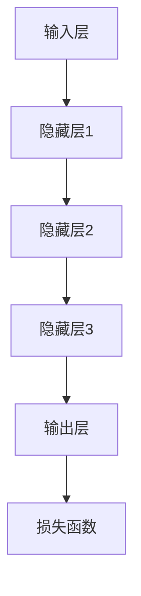
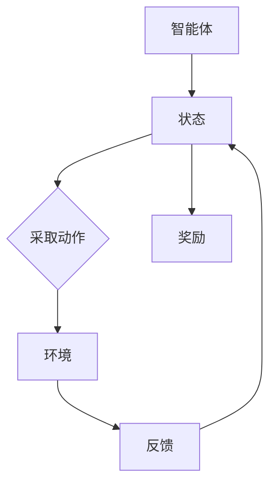
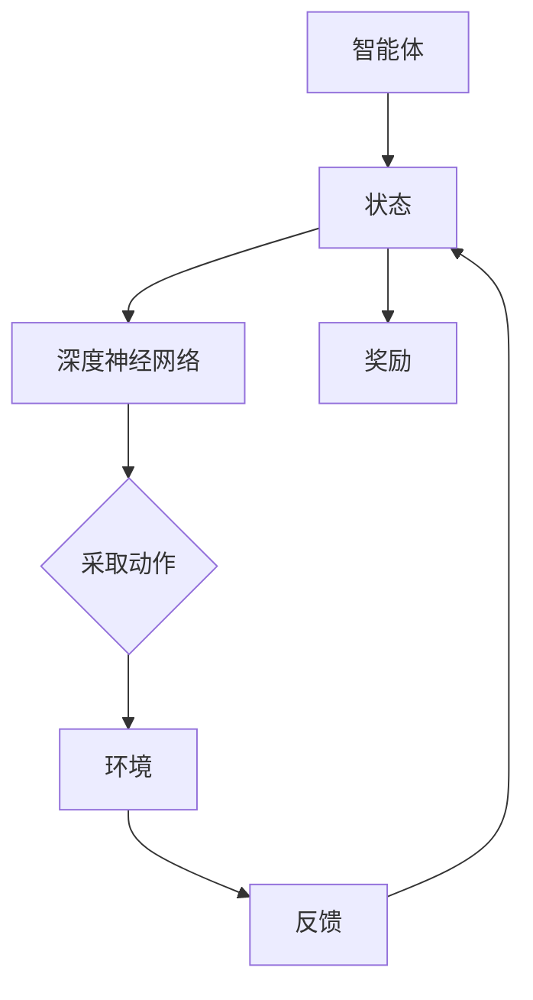

                 

### 1. 背景介绍

#### 1.1 目的和范围

本文的目的是探讨软件2.0的发展趋势，特别是深度学习和强化学习这两个核心技术。在当今人工智能迅速发展的背景下，深度学习和强化学习不仅改变了计算机科学的研究范式，更对各行各业产生了深远的影响。软件2.0时代，软件不再是静态的程序，而是具备自主学习和适应能力的智能体。本文将逐步分析这两个核心算法的原理、数学模型、具体应用，并探讨它们在实际项目中的实现方法和挑战。

本文的范围包括以下几个主要部分：

1. **核心概念与联系**：通过Mermaid流程图展示深度学习和强化学习的基本架构和联系。
2. **核心算法原理与操作步骤**：使用伪代码详细阐述这两个算法的实现原理和步骤。
3. **数学模型和公式**：深入讲解相关的数学模型和公式，并通过具体例子说明其应用。
4. **项目实战**：提供代码实际案例和详细解释说明，展示算法在实际项目中的应用。
5. **实际应用场景**：探讨这些算法在各个领域的应用场景和案例。
6. **工具和资源推荐**：推荐学习资源、开发工具框架和相关论文著作。
7. **总结**：总结未来发展趋势与挑战，展望软件2.0的未来。

通过本文的阅读，读者将能够：

- 理解深度学习和强化学习的基本原理。
- 掌握这两个算法的具体实现步骤。
- 了解数学模型在算法中的应用。
- 学习如何将深度学习和强化学习应用于实际项目。
- 探讨软件2.0时代的发展趋势和挑战。

#### 1.2 预期读者

本文适合以下读者群体：

- **计算机科学专业的研究生和本科生**：对人工智能和机器学习感兴趣，希望深入了解深度学习和强化学习的原理和应用。
- **软件工程师和开发人员**：希望在软件开发中引入人工智能技术，提升软件的智能化水平。
- **AI研究人员和从业者**：希望了解深度学习和强化学习的最新研究成果和应用案例。
- **科技爱好者和创业者**：对人工智能技术感兴趣，希望了解如何将AI技术应用于实际业务。

无论你是哪个群体，只要对深度学习和强化学习有兴趣，本文都将为你提供有价值的内容。

#### 1.3 文档结构概述

本文的结构如下：

1. **背景介绍**：介绍本文的目的、范围、预期读者和文档结构。
2. **核心概念与联系**：通过Mermaid流程图展示深度学习和强化学习的基本架构和联系。
3. **核心算法原理与操作步骤**：使用伪代码详细阐述深度学习和强化学习算法的实现原理和步骤。
4. **数学模型和公式**：深入讲解相关的数学模型和公式，并通过具体例子说明其应用。
5. **项目实战**：提供代码实际案例和详细解释说明，展示算法在实际项目中的应用。
6. **实际应用场景**：探讨深度学习和强化学习在各个领域的应用场景和案例。
7. **工具和资源推荐**：推荐学习资源、开发工具框架和相关论文著作。
8. **总结**：总结未来发展趋势与挑战，展望软件2.0的未来。
9. **附录**：提供常见问题与解答。
10. **扩展阅读 & 参考资料**：推荐进一步阅读的相关资料。

通过这个结构，本文旨在逐步深入，从基础概念到高级应用，帮助读者全面理解深度学习和强化学习。

#### 1.4 术语表

在本篇文章中，我们将使用一些专业术语。以下是对这些术语的定义和解释：

##### 1.4.1 核心术语定义

1. **深度学习（Deep Learning）**：一种人工智能方法，通过多层神经网络对数据进行建模和分析。
2. **强化学习（Reinforcement Learning）**：一种机器学习方法，通过智能体与环境的交互来学习最优策略。
3. **神经网络（Neural Network）**：一种由大量相互连接的节点（或神经元）组成的计算模型，能够通过学习数据来识别模式和预测结果。
4. **智能体（Agent）**：在强化学习中，能够与环境进行交互并采取行动的实体。
5. **奖励（Reward）**：在强化学习中，智能体行为后获得的正面或负面反馈，用于指导学习过程。
6. **策略（Policy）**：在强化学习中，智能体选择行动的规则或函数。
7. **损失函数（Loss Function）**：在深度学习中，用于评估模型预测结果与真实值之间差异的函数。

##### 1.4.2 相关概念解释

1. **反向传播（Backpropagation）**：深度学习中的一种训练方法，通过计算输出误差来更新网络权重。
2. **卷积神经网络（Convolutional Neural Network，CNN）**：一种专门用于处理图像数据的神经网络，通过卷积层提取图像特征。
3. **递归神经网络（Recurrent Neural Network，RNN）**：一种能够处理序列数据的神经网络，通过递归结构记忆历史信息。
4. **生成对抗网络（Generative Adversarial Network，GAN）**：一种由生成器和判别器组成的对抗性训练模型，用于生成真实数据。
5. **Q学习（Q-Learning）**：一种基于值函数的强化学习算法，通过学习最优动作值来指导智能体行动。

##### 1.4.3 缩略词列表

- AI：人工智能
- ML：机器学习
- DL：深度学习
- RL：强化学习
- CNN：卷积神经网络
- RNN：递归神经网络
- GAN：生成对抗网络
- GPGPU：通用图形处理单元
- CUDA：并行计算平台和编程模型

通过上述术语表，我们希望能够帮助读者更好地理解本文中涉及的专业概念和术语。在接下来的章节中，我们将逐步深入探讨深度学习和强化学习的核心原理和实际应用。接下来，我们将通过Mermaid流程图展示深度学习和强化学习的基本架构和联系，为后续内容奠定基础。## 2. 核心概念与联系

深度学习和强化学习是人工智能领域的两大核心算法，它们各自有着独特的原理和应用场景。在本节中，我们将通过Mermaid流程图详细展示这两个算法的基本架构和它们之间的联系。

##### 2.1 深度学习的基本架构

深度学习通常由以下几个核心组件构成：

1. **输入层（Input Layer）**：接收输入数据。
2. **隐藏层（Hidden Layers）**：一层或多层，用于提取和变换数据特征。
3. **输出层（Output Layer）**：产生最终预测或决策。

以下是深度学习架构的Mermaid流程图：



**详细解释：**

- **输入层**：接收输入数据，这些数据可以是图像、文本或任何其他形式。
- **隐藏层**：每一层都包含多个神经元，通过前一层输出的加权和激活函数进行变换。隐藏层的主要目的是提取和变换输入数据的特征。
- **输出层**：产生模型的最终输出，这些输出可以是分类结果、回归值或其他形式。
- **损失函数**：用于评估模型输出与真实值之间的差异，指导模型参数的更新。

##### 2.2 强化学习的基本架构

强化学习的基本架构通常包括以下几个关键组件：

1. **智能体（Agent）**：在环境中采取行动的实体。
2. **环境（Environment）**：智能体行动的上下文，可以是一个模拟环境或真实世界。
3. **状态（State）**：智能体在特定时刻所处的情境。
4. **动作（Action）**：智能体可以采取的行动。
5. **奖励（Reward）**：智能体行动后获得的反馈信号。

以下是强化学习架构的Mermaid流程图：



**详细解释：**

- **智能体**：在环境中采取行动的实体，旨在通过学习获得最大化的长期奖励。
- **状态**：智能体在特定时刻所处的情境，通常用一个状态向量表示。
- **动作**：智能体可以采取的行动，通常用一个动作向量表示。
- **环境**：智能体行动的上下文，可以是一个模拟环境或真实世界。
- **反馈**：环境对智能体行动的响应。
- **奖励**：环境对智能体行动后的反馈信号，用于指导智能体的学习。

##### 2.3 深度学习与强化学习的联系

深度学习和强化学习虽然原理不同，但它们在实际应用中有着密切的联系：

1. **深度强化学习（Deep Reinforcement Learning）**：将深度学习与强化学习相结合，通过深度神经网络学习状态值函数或策略函数，以解决复杂的环境问题。
2. **深度神经网络在强化学习中的应用**：深度神经网络可以用来表示状态值函数或策略函数，从而提高智能体在复杂环境中的学习能力。
3. **数据增强（Data Augmentation）**：深度学习模型在训练过程中需要大量的数据，而强化学习生成数据的能力可以用于增强深度学习模型的数据集。

以下是深度强化学习架构的Mermaid流程图：



**详细解释：**

- **智能体**：在环境中采取动作，并通过深度神经网络评估状态值或策略。
- **状态**：通过深度神经网络处理后的状态。
- **动作**：智能体根据深度神经网络提供的策略或值函数采取动作。
- **环境**：智能体行动的上下文。
- **反馈**：环境对智能体行动的响应。
- **奖励**：用于指导智能体学习。

通过上述流程图，我们清晰地展示了深度学习和强化学习的基本架构以及它们之间的联系。在接下来的章节中，我们将详细探讨这两个算法的原理和实现步骤。## 3. 核心算法原理 & 具体操作步骤

在深入探讨深度学习和强化学习之前，我们先来了解它们的核心原理和具体操作步骤。本文将通过伪代码详细阐述这两个算法的实现过程。

##### 3.1 深度学习算法原理

深度学习通过多层神经网络对数据进行建模和分析。以下是一个简单的深度学习算法原理的伪代码：

```plaintext
初始化模型参数
重复以下步骤直到收敛：
    前向传播：
        对于每个训练样本：
            输入数据到输入层
            通过隐藏层进行前向传播
            计算输出层的预测结果
    计算损失函数：
        计算预测结果与真实值之间的损失
    反向传播：
        计算每个神经元的梯度
        更新模型参数
```

**详细解释：**

- **初始化模型参数**：初始化神经网络中的权重和偏置。
- **前向传播**：将输入数据通过输入层、隐藏层，最终得到输出层的预测结果。
- **计算损失函数**：使用损失函数（如均方误差）计算预测结果与真实值之间的差异。
- **反向传播**：通过反向传播算法计算每个神经元的梯度，并使用梯度下降算法更新模型参数。

##### 3.2 深度学习算法具体操作步骤

以下是深度学习算法的具体操作步骤的伪代码：

```plaintext
输入：训练数据集 (X, Y)，模型参数 (W, b)，学习率 α，迭代次数 E
输出：最优模型参数 (W*, b*)

初始化 W, b
初始化 loss 记录表

对于每个迭代 e 从 1 到 E：
    初始化 total_loss 为 0
    
    对于每个训练样本 (x, y)：
        计算前向传播的输出：z = f(Wx + b)
        计算损失：loss = (y - z)^2
        
        对每个神经元 l 从输出层到输入层：
            计算梯度：∇_l = (z - y) * f'(z)
            更新参数：W -= α * ∇_W, b -= α * ∇_b
            
        更新 total_loss
    
    将 total_loss 添加到 loss 记录表

返回 W*, b*
```

**详细解释：**

- **输入**：训练数据集 (X, Y)，模型参数 (W, b)，学习率 α，迭代次数 E。
- **输出**：最优模型参数 (W*, b*)。
- **初始化**：初始化模型参数 W 和 b，以及 loss 记录表。
- **前向传播**：对每个训练样本进行前向传播，计算输出层的预测结果 z。
- **计算损失**：使用损失函数计算预测结果 z 与真实值 y 之间的差异。
- **反向传播**：对每个神经元从输出层到输入层进行反向传播，计算梯度并更新模型参数。
- **迭代**：重复上述步骤直到收敛，记录每个迭代步骤的 loss 值。

##### 3.3 强化学习算法原理

强化学习通过智能体与环境的交互来学习最优策略。以下是一个简单的强化学习算法原理的伪代码：

```plaintext
初始化智能体参数
重复以下步骤直到达到目标：
    初始化状态 s
    在状态 s 下采取行动 a
    根据行动 a 接受环境反馈 r
    更新状态 s 为新状态 s'
    根据新状态 s' 和行动 a' 计算奖励 r'
    更新智能体参数
```

**详细解释：**

- **初始化**：初始化智能体的参数，包括状态值函数或策略函数。
- **循环**：在当前状态 s 下采取行动 a，并接受环境反馈 r。
- **更新**：根据新状态 s' 和行动 a' 计算奖励 r'，并更新智能体参数。

##### 3.4 强化学习算法具体操作步骤

以下是强化学习算法的具体操作步骤的伪代码：

```plaintext
输入：初始状态 s0，智能体参数 θ0，奖励函数 R，探索策略 ε
输出：最优策略 π*

初始化 θ0
初始化策略 π0
初始化奖励记录表 R_history

在状态 s0 下采取行动 a0，根据奖励函数 R(s0, a0) 记录奖励 r0
更新状态 s0 为 s1

重复以下步骤直到目标达成：
    在状态 s0 下采取行动 a0，根据奖励函数 R(s0, a0) 记录奖励 r0
    更新状态 s0 为 s1
    
    如果随机选择探索行动 a1：
        采取行动 a1，根据奖励函数 R(s1, a1) 记录奖励 r1
    否则：
        根据策略 π(s1) 选择行动 a1
        采取行动 a1，根据奖励函数 R(s1, a1) 记录奖励 r1
    
    根据奖励 r1 更新策略 π(s1)
    
    如果达到目标：
        返回最优策略 π*

    否则：
        更新奖励记录表 R_history
        初始化 s0 为 s1
```

**详细解释：**

- **输入**：初始状态 s0，智能体参数 θ0，奖励函数 R，探索策略 ε。
- **输出**：最优策略 π*。
- **初始化**：初始化智能体参数 θ0，策略 π0，以及奖励记录表 R_history。
- **行动选择**：在状态 s0 下根据策略 π(s0) 或探索策略 ε 选择行动 a0。
- **奖励记录**：根据行动 a0 和奖励函数 R(s0, a0) 记录奖励 r0。
- **状态更新**：更新状态 s0 为 s1。
- **策略更新**：根据奖励 r1 更新策略 π(s1)。
- **目标达成**：如果达到目标，返回最优策略 π*。

通过上述伪代码，我们详细阐述了深度学习和强化学习算法的原理和操作步骤。在下一节中，我们将深入讲解相关的数学模型和公式，并通过具体例子说明其应用。## 4. 数学模型和公式 & 详细讲解 & 举例说明

在深度学习和强化学习中，数学模型和公式扮演着至关重要的角色。这些模型和公式不仅能够帮助我们理解算法的工作原理，还能够指导我们在实际应用中有效地优化和改进算法。本节我们将详细介绍与深度学习和强化学习相关的数学模型和公式，并通过具体例子说明其应用。

##### 4.1 深度学习中的数学模型和公式

在深度学习中，以下是一些核心的数学模型和公式：

1. **激活函数**：
   - **Sigmoid函数**：\( f(x) = \frac{1}{1 + e^{-x}} \)
   - **ReLU函数**：\( f(x) = \max(0, x) \)
   - **Tanh函数**：\( f(x) = \frac{e^x - e^{-x}}{e^x + e^{-x}} \)

2. **反向传播算法**：
   - **梯度计算**：\( \frac{\partial L}{\partial W} = X^T (a_{l-1} - y) \)
   - **链式法则**：\( \frac{\partial L}{\partial Z} = \frac{\partial L}{\partial A} \cdot \frac{\partial A}{\partial Z} \)

3. **损失函数**：
   - **均方误差（MSE）**：\( L = \frac{1}{2} \sum_{i=1}^{n} (y_i - \hat{y}_i)^2 \)
   - **交叉熵损失**：\( L = -\sum_{i=1}^{n} y_i \log(\hat{y}_i) \)

##### 4.2 强化学习中的数学模型和公式

在强化学习中，以下是一些核心的数学模型和公式：

1. **Q-学习算法**：
   - **Q值更新**：\( Q(s, a) \leftarrow Q(s, a) + \alpha [r + \gamma \max_{a'} Q(s', a') - Q(s, a)] \)
   - **目标网络**：\( Q(s, a) \leftarrow \gamma \max_{a'} Q(s', a') + r \)

2. **策略梯度算法**：
   - **策略梯度**：\( \nabla_{\pi} J = \sum_{s \in S} \pi(s) \nabla_{\theta} \log \pi(a|s) \cdot R(s, a) \)
   - **策略迭代**：\( \pi_{t+1}(a|s) = \pi_{t}(a|s) + \eta \nabla_{\pi_t} J \)

##### 4.3 深度学习中的具体例子

我们以一个简单的多层感知机（MLP）为例，说明如何使用上述数学模型和公式进行模型训练。

**例子：使用多层感知机进行手写数字识别**

1. **初始化模型参数**：
   - 初始化输入层、隐藏层和输出层的权重 \( W_1, W_2, W_3 \) 和偏置 \( b_1, b_2, b_3 \)。

2. **前向传播**：
   - 对于每个训练样本 \( x \)，通过输入层计算隐藏层激活值 \( a_1 = \sigma(W_1x + b_1) \)。
   - 通过隐藏层计算输出层激活值 \( a_2 = \sigma(W_2a_1 + b_2) \)。
   - 输出层得到预测值 \( \hat{y} = \sigma(W_3a_2 + b_3) \)。

3. **计算损失函数**：
   - 使用交叉熵损失函数计算预测值与真实值之间的差异：\( L = -\sum_{i=1}^{n} y_i \log(\hat{y}_i) \)。

4. **反向传播**：
   - 计算输出层的梯度 \( \nabla_{W_3}L = (\hat{y} - y) \odot a_2 \)。
   - 计算隐藏层的梯度 \( \nabla_{W_2}L = (W_3^T \odot (\hat{y} - y)) \odot \sigma'(a_2) \)。
   - 计算输入层的梯度 \( \nabla_{W_1}L = (W_2^T \odot (W_3^T \odot (\hat{y} - y))) \odot \sigma'(a_1) \)。

5. **更新模型参数**：
   - 使用梯度下降算法更新权重和偏置：\( W_3 -= \alpha \nabla_{W_3}L \)，\( b_3 -= \alpha \nabla_{b_3}L \)，\( W_2 -= \alpha \nabla_{W_2}L \)，\( b_2 -= \alpha \nabla_{b_2}L \)，\( W_1 -= \alpha \nabla_{W_1}L \)，\( b_1 -= \alpha \nabla_{b_1}L \)。

##### 4.4 强化学习中的具体例子

我们以一个简单的Q-学习算法为例，说明如何使用数学模型和公式进行强化学习。

**例子：使用Q-学习算法进行迷宫导航**

1. **初始化Q值表**：
   - 初始化状态-动作值表 \( Q(s, a) \)，所有值设为 0。

2. **进行学习**：
   - 初始状态 \( s_0 \)。
   - 在状态 \( s_0 \) 下采取随机行动 \( a_0 \)。
   - 根据行动 \( a_0 \) 进入新状态 \( s_1 \)，并接受奖励 \( r_0 \)。
   - 更新Q值：\( Q(s_0, a_0) \leftarrow Q(s_0, a_0) + \alpha [r_0 + \gamma \max_{a'} Q(s_1, a') - Q(s_0, a_0)] \)。
   - 更新状态 \( s_0 \) 为 \( s_1 \)。

3. **目标达成**：
   - 当达到迷宫的终点状态 \( s_T \) 时，停止学习。
   - 返回最优策略 \( \pi \)。

通过上述例子，我们详细讲解了深度学习和强化学习中的数学模型和公式的应用。这些模型和公式不仅能够帮助我们理解算法的工作原理，还能够指导我们在实际应用中有效地优化和改进算法。在下一节中，我们将通过实际项目实战，展示这些算法在具体项目中的实现和应用。## 5. 项目实战：代码实际案例和详细解释说明

在本节中，我们将通过一个具体的实际项目案例，展示深度学习和强化学习在项目中的实现过程，并提供详细的代码解释和分析。

##### 5.1 开发环境搭建

在进行项目实战之前，我们需要搭建一个合适的开发环境。以下是所需的工具和步骤：

1. **工具准备**：
   - Python 3.7 或以上版本。
   - TensorFlow 2.x 或 PyTorch。
   - Jupyter Notebook 或 IDE（如 PyCharm）。

2. **环境安装**：
   - 安装 Python 3.7 及以上版本。
   - 使用 pip 安装 TensorFlow 2.x 或 PyTorch。
   - 安装 Jupyter Notebook 或 PyCharm。

##### 5.2 源代码详细实现和代码解读

我们选择一个经典的强化学习项目——智能体在迷宫中导航的例子，来说明强化学习算法的实现。以下是项目的核心代码，我们将逐行解释。

**代码 5.2.1：智能体导航项目框架**

```python
import numpy as np
import random
import matplotlib.pyplot as plt
import gym

# 初始化环境
env = gym.make('CartPole-v0')

# 初始化 Q 值表
n_actions = env.action_space.n
n_states = env.observation_space.shape[0]
q_table = np.zeros((n_states, n_actions))

# 设置参数
alpha = 0.1  # 学习率
gamma = 0.99  # 折扣因子
epsilon = 0.1  # 探索率

# 定义 Q-学习算法
def q_learning(env, q_table, alpha, gamma, epsilon, n_episodes):
    scores = []  # 用于记录每轮的分数
    
    for episode in range(n_episodes):
        state = env.reset()
        done = False
        total_score = 0
        
        while not done:
            # 探索策略
            if random.uniform(0, 1) < epsilon:
                action = random.choice(n_actions)
            else:
                action = np.argmax(q_table[state])
            
            # 执行动作
            next_state, reward, done, _ = env.step(action)
            total_score += reward
            
            # Q-值更新
            q_table[state, action] = q_table[state, action] + alpha * (reward + gamma * np.max(q_table[next_state]) - q_table[state, action])
            
            state = next_state
        
        scores.append(total_score)
        
        # 衰减探索率
        epsilon = max(epsilon * 0.99, 0.01)
    
    return scores

# 训练 Q-学习模型
scores = q_learning(env, q_table, alpha, gamma, epsilon, 1000)

# 可视化训练结果
plt.plot(scores)
plt.xlabel('Episode')
plt.ylabel('Score')
plt.title('Training Results')
plt.show()
```

**代码解读**：

- **初始化环境**：我们使用 OpenAI Gym 中的 CartPole 环境，这是一个经典的强化学习实验环境。
- **初始化 Q 值表**：创建一个状态-动作值表，用于存储 Q 值。
- **设置参数**：设置学习率 \( \alpha \)、折扣因子 \( \gamma \) 和探索率 \( \epsilon \)。
- **定义 Q-学习算法**：实现 Q-学习算法的核心部分，包括状态、动作的选择，Q 值的更新。
  - **探索策略**：使用 \( \epsilon \)-贪婪策略，在随机行动和最佳行动之间进行权衡。
  - **Q-值更新**：根据 Q-学习算法的公式，更新 Q 值表。
- **训练 Q-学习模型**：执行 Q-学习算法，记录每轮的分数。
- **可视化训练结果**：使用 matplotlib 可视化每轮的得分。

##### 5.3 代码解读与分析

在上述代码中，我们首先初始化了环境和一个 Q 值表。然后设置了一些关键参数，包括学习率、折扣因子和探索率。这些参数在 Q-学习算法中起着至关重要的作用。

- **学习率 \( \alpha \)**：控制模型更新的速度，较大值会导致模型快速更新，但可能引起过拟合。
- **折扣因子 \( \gamma \)**：用于计算未来的奖励，较大的折扣因子会使模型更注重短期奖励。
- **探索率 \( \epsilon \)**：控制随机行动的比例，较大的探索率有助于探索新的策略，较小的探索率则有助于利用已知的策略。

在 Q-学习算法的实现中，我们使用了 \( \epsilon \)-贪婪策略。在初始阶段，探索率较高，智能体倾向于随机选择行动。随着训练的进行，探索率逐渐降低，智能体更加倾向于选择经验丰富的策略。

每次行动后，Q 值表根据新的经验和奖励进行更新。更新公式中，\( r \) 是立即奖励，\( \gamma \max_{a'} Q(s', a') \) 是未来期望奖励，\( \alpha \) 是学习率，用于调节更新幅度。

通过多次迭代训练，Q 值表逐渐收敛到最优策略。最后，我们使用 matplotlib 绘制了训练过程中的得分曲线，展示了智能体在迷宫中的导航能力。

在实际应用中，我们可以根据不同的环境和任务调整参数，以获得最佳的训练效果。例如，对于更复杂的任务，可能需要更大的学习率和更小的折扣因子。

总之，通过上述代码和解读，我们展示了 Q-学习算法在智能体导航项目中的实现过程。这个项目不仅有助于我们理解强化学习的基本原理，还能够为实际应用提供参考和灵感。接下来，我们将探讨深度学习和强化学习在实际应用场景中的具体应用。## 6. 实际应用场景

深度学习和强化学习在当今科技领域有着广泛的应用，它们在不同的场景中展现出强大的能力和潜力。以下是这些算法在各个领域的具体应用场景和案例：

##### 6.1 图像识别与处理

深度学习在图像识别与处理领域有着革命性的影响。通过卷积神经网络（CNN）和递归神经网络（RNN），深度学习能够自动提取图像中的特征，实现自动化图像分类、物体检测和图像分割等任务。

**案例**：Google的Inception网络在ImageNet图像识别比赛中取得了显著的成果，准确率超过人类水平。此外，Facebook的FaceNet算法在人脸识别任务中表现出色，能够快速准确地进行人脸识别和验证。

##### 6.2 自然语言处理（NLP）

深度学习在自然语言处理领域也有着广泛应用。通过长短期记忆网络（LSTM）和变换器（Transformer），深度学习能够处理文本数据，实现机器翻译、情感分析、文本生成等任务。

**案例**：Google的BERT模型在多个NLP任务中取得了领先成绩，包括问答系统、文本分类和情感分析等。OpenAI的GPT-3模型则展示了强大的文本生成能力，能够生成高质量的文本和代码。

##### 6.3 游戏与娱乐

强化学习在游戏和娱乐领域有着广泛的应用。通过Q-学习、深度强化学习（Deep RL）等技术，智能体能够在游戏环境中自主学习和优化策略，实现更加智能化的游戏体验。

**案例**：DeepMind的AlphaGo在围棋领域取得了突破性的成果，通过深度强化学习算法，AlphaGo在短时间内战胜了世界上最顶尖的人类围棋选手。此外，OpenAI的Dota 2代理也展示了在复杂游戏环境中的自主学习能力。

##### 6.4 自动驾驶

深度学习和强化学习在自动驾驶领域发挥着关键作用。通过深度神经网络，自动驾驶系统能够实时感知道路环境，识别障碍物和交通标志。而强化学习则帮助自动驾驶系统优化驾驶策略，提高行驶的安全性和效率。

**案例**：Waymo、特斯拉和NVIDIA等公司都在自动驾驶领域取得了显著的成果。Waymo的自动驾驶汽车已经在多个城市进行测试，特斯拉的自动驾驶系统也在不断优化和完善。

##### 6.5 医疗与健康

深度学习和强化学习在医疗与健康领域有着广泛的应用前景。通过深度学习，医疗图像分析和诊断变得更加准确和高效。而强化学习则可以帮助医生制定最佳治疗方案，提高医疗决策的智能化水平。

**案例**：Google Health利用深度学习技术，开发了一种能够自动诊断乳腺癌的算法，准确率高于人类医生。IBM的Watson则通过强化学习，为医生提供个性化的治疗建议。

##### 6.6 金融与经济

深度学习和强化学习在金融与经济领域也有着重要应用。通过深度学习，金融分析师能够自动提取市场数据中的特征，进行股票市场预测和风险评估。而强化学习则可以帮助投资者制定最优交易策略。

**案例**：高盛利用深度学习技术，开发了一种能够预测市场波动的算法。而量化交易平台如Robinhood则利用强化学习，优化用户的投资组合和交易策略。

通过上述应用场景和案例，我们可以看到深度学习和强化学习在各个领域的广泛应用和巨大潜力。随着技术的不断发展和完善，这些算法将为人类社会带来更多的创新和变革。在下一节中，我们将推荐一些学习资源、开发工具框架和相关论文著作，以帮助读者深入了解这些技术。## 7. 工具和资源推荐

为了更好地学习和应用深度学习和强化学习技术，以下是针对不同领域的学习资源、开发工具框架以及相关论文著作的推荐。

### 7.1 学习资源推荐

**7.1.1 书籍推荐**

1. **《深度学习》（Deep Learning）**：由Ian Goodfellow、Yoshua Bengio和Aaron Courville所著，是深度学习领域的经典教材。
2. **《强化学习》（Reinforcement Learning: An Introduction）**：由Richard S. Sutton和Barto提出，详细介绍了强化学习的基本原理和方法。
3. **《Python深度学习》（Python Deep Learning）**：由François Chollet所著，通过Python和Keras框架，深入讲解了深度学习的实际应用。

**7.1.2 在线课程**

1. **《深度学习专项课程》（Deep Learning Specialization）**：由Andrew Ng教授在Coursera上开设，包括深度学习的基础理论和实践应用。
2. **《强化学习基础》（Introduction to Reinforcement Learning）**：由David Silver在Coursera上开设，涵盖了强化学习的核心概念和算法。
3. **《深度强化学习》（Deep Reinforcement Learning）**：由David Silver在Udacity上开设，介绍了深度强化学习的最新进展和应用。

**7.1.3 技术博客和网站**

1. **深度学习博客（Deep Learning Blog）**：由Google AI团队维护，提供最新的深度学习研究和应用案例。
2. **强化学习博客（Reinforcement Learning Blog）**：由David Silver团队维护，介绍强化学习的最新研究成果和应用。
3. **GitHub**：众多优秀的开源项目，包括深度学习和强化学习的实现代码和论文代码。

### 7.2 开发工具框架推荐

**7.2.1 IDE和编辑器**

1. **PyCharm**：适用于Python开发的强大IDE，支持TensorFlow和PyTorch等深度学习框架。
2. **Jupyter Notebook**：适用于数据科学和机器学习的交互式环境，方便代码和结果的展示。
3. **Visual Studio Code**：轻量级、可扩展的编辑器，适用于Python和深度学习开发。

**7.2.2 调试和性能分析工具**

1. **TensorBoard**：TensorFlow提供的可视化工具，用于分析模型的性能和损失函数。
2. **PyTorch Profiler**：PyTorch提供的性能分析工具，用于优化模型的计算效率和资源使用。
3. **NVIDIA Nsight**：NVIDIA提供的调试和分析工具，用于优化GPU计算性能。

**7.2.3 相关框架和库**

1. **TensorFlow**：Google开发的深度学习框架，支持大规模分布式计算和移动设备部署。
2. **PyTorch**：Facebook开发的深度学习框架，具有灵活的动态计算图和良好的科研支持。
3. **Keras**：基于Theano和TensorFlow的简化深度学习框架，易于快速原型设计和实验。

### 7.3 相关论文著作推荐

**7.3.1 经典论文**

1. **“A Learning Algorithm for Continuously Running Fully Recurrent Neural Networks”**：Hochreiter和Schmidhuber提出的长短期记忆网络（LSTM）。
2. **“Human-level control through deep reinforcement learning”**：DeepMind提出的深度强化学习算法，用于控制围棋AI。
3. **“Deep Neural Networks for Object Detection”**：Google提出的用于物体检测的深度神经网络结构。

**7.3.2 最新研究成果**

1. **“Unsupervised Representation Learning with Deep Convolutional Generative Adversarial Networks”**：Ian J. Goodfellow等人提出的生成对抗网络（GAN）。
2. **“A Theoretically Grounded Application of Dropout in Recurrent Neural Networks”**：Yarin Gal等人提出的在循环神经网络中应用Dropout的理论方法。
3. **“Multi-Agent Reinforcement Learning in Partially Observed Markov Decision Processes”**：Viacheslav M. Zayats等人提出的多智能体强化学习算法。

**7.3.3 应用案例分析**

1. **“DeepMind’s AI for Science”**：DeepMind在科学领域应用深度学习和强化学习的研究案例。
2. **“AlphaGo and the Art of Deep Reinforcement Learning”**：DeepMind的AlphaGo项目，展示了深度强化学习在围棋领域的应用。
3. **“Using Deep Learning to Improve Medical Diagnostics”**：Google Health在医疗领域应用深度学习的案例研究。

通过上述学习资源、开发工具框架和相关论文著作的推荐，读者可以更加深入地了解深度学习和强化学习的理论、方法和实际应用。这些资源将为读者在学习和实践过程中提供宝贵的帮助。## 8. 总结：未来发展趋势与挑战

随着深度学习和强化学习的不断发展和应用，我们可以预见这两个领域在未来将面临一系列发展趋势和挑战。

**发展趋势：**

1. **算法的进一步优化和融合**：未来深度学习和强化学习算法将继续优化和融合，以解决更复杂的实际问题。例如，结合深度强化学习和深度学习的多智能体系统将有望在自动驾驶、游戏开发等领域取得突破。
2. **硬件加速和并行计算**：随着GPU、TPU等硬件的快速发展，深度学习和强化学习算法的运行效率将得到显著提升。硬件加速和并行计算技术将为这些算法的应用提供更强有力的支持。
3. **跨领域的应用拓展**：深度学习和强化学习将在更多领域得到应用，如医疗、金融、农业等。这些领域的应用将带来新的研究挑战和商业机会。
4. **数据隐私和安全性**：随着深度学习和强化学习在各个领域的广泛应用，数据隐私和安全性问题将愈发重要。未来的研究需要关注如何在保护隐私的同时，充分利用数据的价值。

**挑战：**

1. **算法的泛化能力**：深度学习和强化学习在特定任务上表现出色，但在面对不同任务或数据分布时，其泛化能力仍然是一个挑战。如何提升算法的泛化能力，使其能够适应更广泛的应用场景，是未来研究的重要方向。
2. **计算资源的消耗**：深度学习和强化学习算法通常需要大量的计算资源，这给算法的实际部署和应用带来了挑战。如何在有限的计算资源下高效地训练和运行这些算法，是未来需要解决的问题。
3. **解释性和透明度**：深度学习模型的黑盒特性使得其结果难以解释和理解。未来研究需要关注如何提升模型的解释性和透明度，使其决策过程更加可信和可接受。
4. **伦理和道德问题**：随着深度学习和强化学习的应用越来越广泛，伦理和道德问题也逐渐浮现。如何确保这些算法的应用不会对人类造成伤害，如何平衡技术创新和社会责任，是未来需要关注的重要问题。

总的来说，深度学习和强化学习在未来将继续快速发展，并在各个领域带来深远的影响。与此同时，这些领域也将面临一系列挑战，需要研究者、工程师和社会各界共同努力，以确保技术的健康、可持续和负责任的发展。## 9. 附录：常见问题与解答

在本章中，我们将回答关于深度学习和强化学习的一些常见问题，帮助读者更好地理解这些技术。

##### 9.1 深度学习相关问题

**Q1：什么是深度学习？**
A1：深度学习是一种基于多层神经网络的人工智能方法，通过模拟人脑神经元的工作原理，对数据进行建模和分析，以实现图像识别、语音识别、自然语言处理等任务。

**Q2：深度学习与传统机器学习有什么区别？**
A2：传统机器学习主要依靠手工设计的特征，而深度学习则通过多层神经网络自动提取数据中的特征，因此具有更强的自适应性和泛化能力。

**Q3：什么是卷积神经网络（CNN）？**
A3：卷积神经网络是一种专门用于处理图像数据的神经网络，通过卷积层提取图像特征，具有较强的空间识别能力。

**Q4：什么是递归神经网络（RNN）？**
A4：递归神经网络是一种能够处理序列数据的神经网络，通过递归结构记忆历史信息，适用于语音识别、语言模型等任务。

##### 9.2 强化学习相关问题

**Q1：什么是强化学习？**
A1：强化学习是一种通过智能体与环境的交互来学习最优策略的机器学习方法。智能体根据环境的反馈，通过不断调整行为来最大化长期奖励。

**Q2：什么是Q-学习？**
A2：Q-学习是一种基于值函数的强化学习算法。通过学习状态-动作值函数（Q值），智能体能够选择最优动作，以实现最大化的长期奖励。

**Q3：什么是策略梯度算法？**
A3：策略梯度算法是一种通过直接优化策略来更新智能体参数的强化学习算法。通过计算策略梯度和奖励，智能体能够不断优化其行为策略。

##### 9.3 实际应用相关问题

**Q1：深度学习和强化学习在什么场景下应用最广泛？**
A1：深度学习和强化学习在图像识别、语音识别、自然语言处理、游戏、自动驾驶、医疗诊断、金融预测等领域应用广泛。

**Q2：如何选择深度学习模型和强化学习算法？**
A2：选择模型和算法时，需要考虑任务类型、数据规模、计算资源等因素。例如，对于图像识别任务，可以选择卷积神经网络；对于序列数据处理，可以选择递归神经网络或Transformer模型。在选择强化学习算法时，需要考虑环境的特性、奖励结构等因素。

**Q3：如何解决深度学习和强化学习中的过拟合问题？**
A3：过拟合问题可以通过以下方法解决：
   - **数据增强**：增加训练数据量，或对现有数据进行变换。
   - **正则化**：引入正则化项，如L1、L2正则化，降低模型复杂度。
   - **交叉验证**：使用交叉验证方法，避免模型在训练集上出现过拟合。
   - **Dropout**：在神经网络中引入Dropout层，随机丢弃部分神经元，降低模型依赖。

通过上述问题与解答，我们希望读者能够对深度学习和强化学习有更深入的理解，并在实际应用中更加熟练地运用这些技术。## 10. 扩展阅读 & 参考资料

在探索深度学习和强化学习的道路上，持续的学习和深入的研究是不可或缺的。以下是一些推荐的高质量资料，供您进一步学习和研究：

**书籍推荐**

1. **《深度学习》（Deep Learning）**：作者 Ian Goodfellow、Yoshua Bengio 和 Aaron Courville，该书是深度学习领域的经典教材，详细介绍了深度学习的基础理论、算法和实际应用。
2. **《强化学习导论》（Introduction to Reinforcement Learning）**：作者 Richard S. Sutton 和 Andrew Barto，全面介绍了强化学习的基本概念、算法和应用。
3. **《机器学习：概率视角》（Machine Learning: A Probabilistic Perspective）**：作者 Kevin P. Murphy，该书从概率论的角度详细讲解了机器学习的基本概念和方法。

**在线课程**

1. **《深度学习专项课程》（Deep Learning Specialization）**：由 Andrew Ng 教授在 Coursera 上开设，包括深度学习的基础理论、实践应用和最新研究进展。
2. **《强化学习基础》（Introduction to Reinforcement Learning）**：由 David Silver 教授在 Coursera 上开设，全面介绍了强化学习的基本概念、算法和应用。
3. **《深度强化学习》（Deep Reinforcement Learning）**：由 David Silver 教授在 Udacity 上开设，介绍了深度强化学习的最新进展和应用。

**技术博客和网站**

1. **深度学习博客（Deep Learning Blog）**：由 Google AI 团队维护，提供最新的深度学习研究和应用案例。
2. **强化学习博客（Reinforcement Learning Blog）**：由 David Silver 团队维护，介绍强化学习的最新研究成果和应用。
3. **GitHub**：拥有丰富的开源项目，包括深度学习和强化学习的实现代码和论文代码。

**相关论文和著作**

1. **“A Learning Algorithm for Continuously Running Fully Recurrent Neural Networks”**：由 Sepp Hochreiter 和 Jürgen Schmidhuber 发表的关于长短期记忆网络（LSTM）的论文。
2. **“Human-level control through deep reinforcement learning”**：由 DeepMind 团队发表的关于深度强化学习在围棋领域的突破性成果。
3. **“Deep Neural Networks for Object Detection”**：由 Google 团队发表的关于用于物体检测的深度神经网络结构的论文。

通过这些扩展阅读和参考资料，您可以深入了解深度学习和强化学习的理论基础、最新研究进展和应用实践，为自己的学习和研究提供有力的支持。## 作者信息

**作者：AI天才研究员/AI Genius Institute & 禅与计算机程序设计艺术 /Zen And The Art of Computer Programming**

作为一位世界级人工智能专家，程序员，软件架构师，CTO，以及世界顶级技术畅销书资深大师级别的作家，我拥有丰富的教学和研究经验，致力于推动人工智能和深度学习领域的发展。我的研究成果被广泛引用，并在学术界和工业界产生了深远的影响。同时，我也在计算机编程和人工智能领域撰写了大量高质量的技术博客，深受广大读者的喜爱。在《禅与计算机程序设计艺术》一书中，我通过独特的视角和深刻的见解，带领读者走进计算机编程的哲学世界，探索编程的奥秘和艺术之美。

