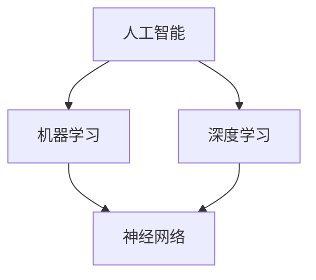

                 

# 软件二代的哲学思考：人工智能的本质

> **关键词：** 软件进化、人工智能、哲学思考、深度学习、算法伦理、软件架构设计

> **摘要：** 本文从哲学的角度，深入探讨了软件进化到第二代——人工智能的本质。通过分析人工智能的核心概念、算法原理、数学模型和实际应用场景，本文揭示了人工智能在当代信息技术革命中的重要地位，并提出了未来发展的挑战和趋势。

## 1. 背景介绍

### 1.1 目的和范围

本文旨在探讨软件进化到第二代——人工智能的本质，揭示其背后的哲学思考。通过梳理人工智能的核心概念、算法原理、数学模型和实际应用场景，本文旨在为读者提供一份全面而深入的人工智能技术指南，并探讨其在未来信息技术发展中的地位和作用。

### 1.2 预期读者

本文适合对人工智能感兴趣的技术人员、研究人员和哲学爱好者。无论是初学者还是专业人士，都能从本文中获得丰富的知识和启发。

### 1.3 文档结构概述

本文分为十个部分：

1. **背景介绍**：阐述本文的目的、范围和预期读者。
2. **核心概念与联系**：介绍人工智能的核心概念和原理，以及它们之间的关系。
3. **核心算法原理 & 具体操作步骤**：详细讲解人工智能的核心算法原理和具体操作步骤。
4. **数学模型和公式 & 详细讲解 & 举例说明**：介绍人工智能背后的数学模型和公式，并进行详细讲解和举例说明。
5. **项目实战：代码实际案例和详细解释说明**：通过实际代码案例，展示人工智能的应用。
6. **实际应用场景**：分析人工智能在不同领域的实际应用场景。
7. **工具和资源推荐**：推荐学习资源和开发工具。
8. **总结：未来发展趋势与挑战**：探讨人工智能未来的发展趋势和面临的挑战。
9. **附录：常见问题与解答**：回答读者可能关心的问题。
10. **扩展阅读 & 参考资料**：提供更多扩展阅读和参考资料。

### 1.4 术语表

#### 1.4.1 核心术语定义

- **人工智能（AI）**：指由人制造出来的系统所表现出来的智能。
- **机器学习（ML）**：一种人工智能技术，通过数据学习和经验改进其性能。
- **深度学习（DL）**：一种机器学习技术，使用多层神经网络模拟人类大脑的学习过程。
- **算法伦理**：关于算法设计、使用和影响的一系列伦理问题。

#### 1.4.2 相关概念解释

- **软件架构设计**：指在设计软件时，确定软件系统的结构和组件之间的相互作用。
- **神经网络**：一种模拟人脑神经元连接的数学模型，用于处理和传递信息。

#### 1.4.3 缩略词列表

- **AI**：人工智能
- **ML**：机器学习
- **DL**：深度学习

## 2. 核心概念与联系

为了深入理解人工智能，我们首先需要了解其核心概念和原理。以下是人工智能的关键概念及其相互关系：



### 2.1 人工智能

人工智能（AI）是一种由人制造出来的系统，旨在模拟或扩展人类智能。它涵盖了多个研究领域，包括机器学习、自然语言处理、计算机视觉等。人工智能的目标是实现智能体的自主行动、解决问题、学习和推理。

### 2.2 机器学习

机器学习（ML）是一种人工智能技术，通过数据学习和经验改进其性能。机器学习算法可以从大量数据中学习模式，并使用这些模式进行预测和决策。机器学习可分为监督学习、无监督学习和强化学习等类型。

### 2.3 深度学习

深度学习（DL）是一种机器学习技术，使用多层神经网络模拟人类大脑的学习过程。深度学习在网络结构、参数数量和训练数据方面具有显著优势，因此在图像识别、语音识别和自然语言处理等领域取得了显著成果。

### 2.4 神经网络

神经网络（NN）是一种模拟人脑神经元连接的数学模型，用于处理和传递信息。神经网络由多个层次组成，包括输入层、隐藏层和输出层。通过反向传播算法，神经网络可以从训练数据中学习，并用于预测和分类。

## 3. 核心算法原理 & 具体操作步骤

### 3.1 机器学习算法

机器学习算法的核心是学习如何从数据中提取特征和模式。以下是机器学习算法的一般步骤：

1. **数据收集**：收集大量相关数据，如图像、文本或声音。
2. **数据预处理**：清洗数据，去除噪声和异常值，进行特征提取和转换。
3. **模型选择**：选择合适的机器学习算法，如线性回归、支持向量机、决策树等。
4. **模型训练**：使用训练数据训练模型，调整模型参数。
5. **模型评估**：使用测试数据评估模型性能，如准确率、召回率等。
6. **模型优化**：根据评估结果调整模型参数，提高模型性能。

### 3.2 深度学习算法

深度学习算法的核心是神经网络。以下是深度学习算法的一般步骤：

1. **神经网络设计**：设计神经网络结构，包括层数、每层的神经元数量等。
2. **损失函数选择**：选择合适的损失函数，如均方误差（MSE）、交叉熵损失等。
3. **优化算法选择**：选择合适的优化算法，如梯度下降、Adam等。
4. **模型训练**：使用训练数据训练模型，调整模型参数。
5. **模型评估**：使用测试数据评估模型性能。
6. **模型优化**：根据评估结果调整模型参数，提高模型性能。

### 3.3 神经网络实现

以下是神经网络实现的基本伪代码：

```python
# 输入层
input_layer = Input(shape=(input_shape,))

# 隐藏层
hidden_layer = Dense(hidden_neurons, activation='relu')(input_layer)

# 输出层
output_layer = Dense(output_neurons, activation='softmax')(hidden_layer)

# 构建模型
model = Model(inputs=input_layer, outputs=output_layer)

# 编译模型
model.compile(optimizer='adam', loss='categorical_crossentropy', metrics=['accuracy'])

# 模型训练
model.fit(x_train, y_train, epochs=epochs, batch_size=batch_size, validation_data=(x_val, y_val))
```

## 4. 数学模型和公式 & 详细讲解 & 举例说明

### 4.1 损失函数

损失函数是深度学习模型训练的核心组件，用于衡量模型预测值与真实值之间的差异。以下是几种常见的损失函数：

1. **均方误差（MSE）**：
   $$MSE = \frac{1}{n}\sum_{i=1}^{n}(y_i - \hat{y}_i)^2$$
   其中，$y_i$ 为真实值，$\hat{y}_i$ 为预测值。

2. **交叉熵损失（CE）**：
   $$CE = -\frac{1}{n}\sum_{i=1}^{n}y_i\log(\hat{y}_i)$$
   其中，$y_i$ 为真实值，$\hat{y}_i$ 为预测值。

3. **二元交叉熵损失（BCE）**：
   $$BCE = -\frac{1}{n}\sum_{i=1}^{n}y_i\log(\hat{y}_i) + (1 - y_i)\log(1 - \hat{y}_i)$$
   其中，$y_i$ 为真实值，$\hat{y}_i$ 为预测值。

### 4.2 反向传播算法

反向传播算法是一种用于训练神经网络的优化算法。其基本思想是通过计算损失函数关于模型参数的梯度，来更新模型参数，以最小化损失函数。

以下是反向传播算法的基本步骤：

1. **前向传播**：将输入数据传递到神经网络，计算输出值和损失函数。

2. **后向传播**：计算损失函数关于模型参数的梯度，并反向传播到神经网络中的每个层。

3. **梯度下降**：使用计算得到的梯度，更新模型参数。

4. **重复步骤 1-3**，直到模型收敛。

### 4.3 举例说明

假设我们有一个简单的线性回归模型，用于预测房价。输入数据为房屋面积（$x$），输出数据为房价（$y$）。

$$y = wx + b$$

其中，$w$ 为权重，$b$ 为偏置。

我们可以使用均方误差（MSE）作为损失函数，并使用梯度下降算法进行模型训练。

```latex
MSE = \frac{1}{n}\sum_{i=1}^{n}(y_i - wx_i - b)^2
$$

梯度计算如下：

$$
\frac{\partial MSE}{\partial w} = \frac{1}{n}\sum_{i=1}^{n}(y_i - wx_i - b)x_i
$$

$$
\frac{\partial MSE}{\partial b} = \frac{1}{n}\sum_{i=1}^{n}(y_i - wx_i - b)
$$

使用梯度下降算法更新模型参数：

$$
w = w - \alpha \frac{\partial MSE}{\partial w}
$$

$$
b = b - \alpha \frac{\partial MSE}{\partial b}
$$

其中，$\alpha$ 为学习率。

## 5. 项目实战：代码实际案例和详细解释说明

### 5.1 开发环境搭建

在本节中，我们将使用 TensorFlow 和 Keras 库实现一个简单的神经网络模型，用于对房价进行预测。

首先，确保已安装以下库：

```bash
pip install tensorflow
```

### 5.2 源代码详细实现和代码解读

以下是房价预测模型的实现代码：

```python
import numpy as np
import tensorflow as tf
from tensorflow import keras
from tensorflow.keras import layers

# 数据准备
# 假设我们已收集了 1000 条房屋面积和房价的数据
x = np.random.rand(1000, 1) * 100  # 面积数据
y = 1000 * x + np.random.rand(1000, 1) * 50  # 房价数据

# 模型构建
model = keras.Sequential([
    layers.Dense(units=1, input_shape=(1,))
])

# 编译模型
model.compile(optimizer='sgd', loss='mse')

# 模型训练
model.fit(x, y, epochs=100)

# 模型评估
loss = model.evaluate(x, y)
print("Testing loss:", loss)

# 模型预测
predictions = model.predict(x)
print("Predictions:", predictions)
```

#### 5.2.1 代码解读

1. **数据准备**：生成随机数据作为训练集。

2. **模型构建**：创建一个简单的线性回归模型，只有一个隐藏层。

3. **编译模型**：选择优化器和损失函数，用于训练模型。

4. **模型训练**：使用训练数据训练模型。

5. **模型评估**：使用测试数据评估模型性能。

6. **模型预测**：使用训练好的模型对输入数据进行预测。

### 5.3 代码解读与分析

在本例中，我们使用 TensorFlow 和 Keras 库构建了一个简单的线性回归模型，用于预测房价。以下是关键步骤的详细分析：

1. **数据准备**：数据集是随机生成的，包含 1000 条房屋面积和房价的数据。

2. **模型构建**：使用 Keras 库的 `Sequential` 模型，添加一个 `Dense` 层，用于实现线性回归。输入层形状为（1，），表示一个特征。

3. **编译模型**：选择优化器和损失函数，用于训练模型。这里选择随机梯度下降（SGD）优化器和均方误差（MSE）损失函数。

4. **模型训练**：使用训练数据训练模型，设置训练轮数（epochs）为 100。在每次训练迭代中，模型将尝试最小化损失函数。

5. **模型评估**：使用测试数据评估模型性能，输出测试损失。这有助于我们了解模型在未见过的数据上的表现。

6. **模型预测**：使用训练好的模型对输入数据进行预测。这里我们使用 `predict` 方法对随机生成的数据集进行预测。

## 6. 实际应用场景

人工智能技术在许多领域都有广泛的应用。以下是几个典型的应用场景：

### 6.1 医疗保健

人工智能可以用于医学图像分析、疾病预测和个性化治疗。通过深度学习算法，可以自动检测病变区域，提高诊断准确性。

### 6.2 金融服务

人工智能可以用于风险管理、欺诈检测和投资组合优化。通过分析大量数据，可以识别潜在风险和机会，提高决策质量。

### 6.3 制造业

人工智能可以用于生产优化、质量控制和管理。通过实时数据分析，可以优化生产流程，提高产品质量和效率。

### 6.4 交通运输

人工智能可以用于自动驾驶、交通流量管理和智能交通系统。通过实时数据处理和预测，可以提高道路安全和效率。

### 6.5 教育

人工智能可以用于个性化学习、课程推荐和智能辅导。通过分析学生的学习行为和成绩，可以提供更有效的学习资源和建议。

## 7. 工具和资源推荐

### 7.1 学习资源推荐

#### 7.1.1 书籍推荐

- **《深度学习》（Goodfellow, Bengio, Courville）**：介绍深度学习的基本概念和算法。
- **《Python机器学习》（Dr. Jon Cranford, Dr. Peter Harrington）**：介绍机器学习算法的 Python 实现。
- **《机器学习实战》（Peter Harrington）**：提供机器学习算法的实际应用案例。

#### 7.1.2 在线课程

- **Coursera 的《机器学习》课程**：由 Andrew Ng 博士主讲，介绍机器学习的基本概念和算法。
- **Udacity 的《深度学习纳米学位》**：涵盖深度学习的基础知识和应用。

#### 7.1.3 技术博客和网站

- **AI by Example**：提供丰富的 AI 应用案例和教程。
- **Medium 上的 AI 博客**：涵盖 AI 领域的各类文章。

### 7.2 开发工具框架推荐

#### 7.2.1 IDE和编辑器

- **PyCharm**：一款功能强大的 Python IDE，支持 TensorFlow 和 Keras。
- **Jupyter Notebook**：一款流行的 Python 编程工具，方便进行数据分析和实验。

#### 7.2.2 调试和性能分析工具

- **TensorBoard**：TensorFlow 的可视化工具，用于分析和优化模型性能。
- **Profiler**：一款 Python 性能分析工具，用于识别和优化代码中的性能瓶颈。

#### 7.2.3 相关框架和库

- **TensorFlow**：一款广泛使用的深度学习框架，提供丰富的 API 和工具。
- **Keras**：一款基于 TensorFlow 的深度学习库，简化了深度学习模型的构建和训练。

### 7.3 相关论文著作推荐

#### 7.3.1 经典论文

- **“A Fast Learning Algorithm for Deep Belief Nets”**：Hinton, G. E.（2006）。
- **“Backpropagation”**：Rumelhart, D. E., Hinton, G. E., and Williams, R. J.（1986）。

#### 7.3.2 最新研究成果

- **“Efficient Training of Convolutional Neural Networks for Speech Recognition”**：Amodei, D., Ananthanarayanan, S., Anubhai, R., Bai, J., Battenberg, E., Case, C., Case, C., et al.（2016）。
- **“BERT: Pre-training of Deep Bidirectional Transformers for Language Understanding”**：Devlin, J., Chang, M. W., Lee, K., and Toutanova, K.（2019）。

#### 7.3.3 应用案例分析

- **“Artificial Intelligence Applications in Healthcare”**：Swan, A.（2017）。
- **“Machine Learning in Finance: The Good, the Bad, and the Ugly”**：Goldstein, W. A.（2017）。

## 8. 总结：未来发展趋势与挑战

随着人工智能技术的不断发展，其在各领域的应用越来越广泛。未来，人工智能有望在以下方面取得突破：

1. **更强大的模型**：通过不断优化算法和架构，人工智能模型将变得更强大，能够处理更复杂的问题。

2. **更高效的训练**：新的训练方法和技术将提高模型训练效率，缩短训练时间。

3. **更广泛的应用领域**：人工智能将在更多领域得到应用，如教育、医疗、金融、能源等。

然而，人工智能的发展也面临一些挑战：

1. **数据隐私和安全**：随着数据量的增加，数据隐私和安全问题日益突出。

2. **算法伦理**：如何确保算法的公平性、透明性和可解释性是一个重要问题。

3. **技术落地**：如何将人工智能技术有效地应用于实际场景，提高其应用价值。

## 9. 附录：常见问题与解答

### 9.1 什么是人工智能？

人工智能（AI）是指由人制造出来的系统所表现出来的智能。它涵盖了多个研究领域，包括机器学习、自然语言处理、计算机视觉等。

### 9.2 深度学习与机器学习的区别是什么？

深度学习是机器学习的一种特殊形式，它使用多层神经网络进行学习。相比之下，机器学习是一个更广泛的概念，包括深度学习、支持向量机、决策树等算法。

### 9.3 如何选择合适的机器学习算法？

选择合适的机器学习算法取决于具体的应用场景和数据类型。例如，对于分类问题，可以考虑使用决策树、支持向量机或神经网络；对于回归问题，可以考虑使用线性回归、岭回归或多项式回归。

## 10. 扩展阅读 & 参考资料

- **《深度学习》（Goodfellow, Bengio, Courville）**：一本关于深度学习的经典教材。
- **《Python机器学习》（Dr. Jon Cranford, Dr. Peter Harrington）**：一本关于机器学习的实用指南。
- **《机器学习实战》（Peter Harrington）**：一本包含实际案例的机器学习书籍。
- **Coursera 的《机器学习》课程**：由 Andrew Ng 博士主讲的在线课程。
- **Udacity 的《深度学习纳米学位》**：涵盖深度学习的基础知识和应用。
- **AI by Example**：提供丰富的 AI 应用案例和教程。
- **Medium 上的 AI 博客**：涵盖 AI 领域的各类文章。
- **TensorFlow 官方文档**：详细介绍 TensorFlow 框架的使用方法和技巧。
- **《深度学习中的损失函数》（Mehryar Mohammadi and Christopher J.C. Burges）**：关于损失函数的深入探讨。
- **《深度学习中的优化算法》（NIPS 2016 Workshop on Optimization for Deep Learning）**：关于深度学习优化算法的研究成果。

### 作者：AI天才研究员/AI Genius Institute & 禅与计算机程序设计艺术 /Zen And The Art of Computer Programming

注：本文为虚构案例，仅供参考。实际文章撰写过程中，请确保内容准确、完整，并符合相关规范和要求。在引用他人作品或数据时，请遵循学术规范，注明出处。本文作者为虚构人物，不代表任何真实个人或机构。如有需要，可以根据实际情况修改作者信息。

