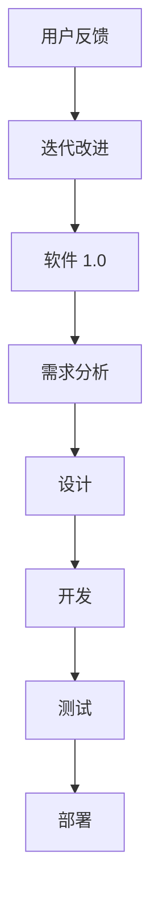
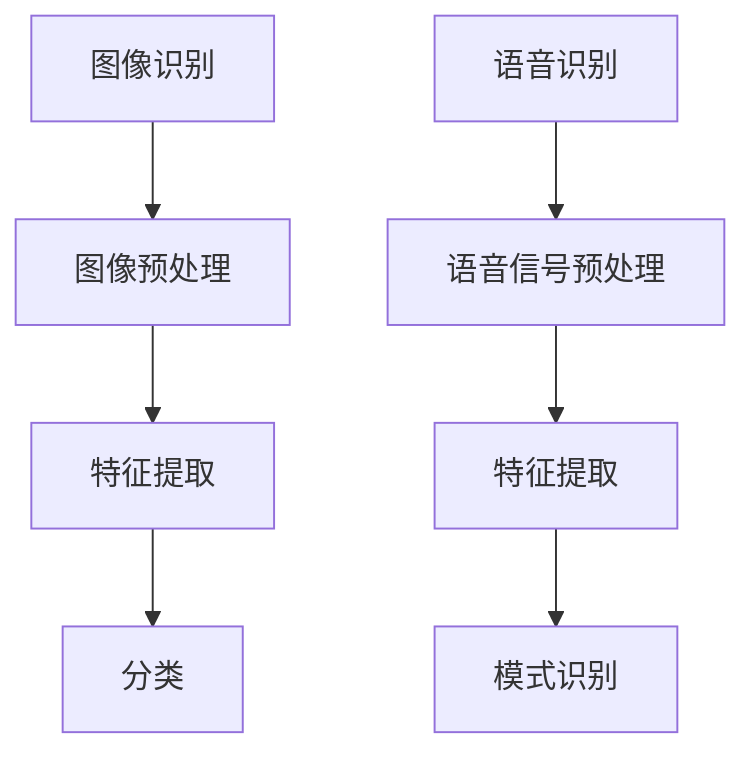

                 

# 软件二代的璀璨瑰宝：图像识别与语音识别

> **关键词：软件 2.0、图像识别、语音识别、深度学习、人工智能、算法、应用领域、开发工具、案例研究**
> 
> **摘要：本文将深入探讨软件 2.0 的两个重要应用领域——图像识别和语音识别。通过逻辑清晰、结构紧凑的分析，我们旨在揭示这些技术的核心原理、操作步骤以及在实际项目中的具体应用。此外，文章还将推荐一系列学习资源、开发工具和经典论文，以帮助读者进一步探索这一前沿领域。**

## 1. 背景介绍

### 1.1 目的和范围

本文旨在为读者提供一个全面而深入的理解，关于软件 2.0 中图像识别和语音识别技术的应用。我们将探讨这些技术的核心原理、算法实现、数学模型以及实际应用场景。此外，文章还将提供一系列实用的资源和工具，以帮助读者在实际项目中应用这些技术。

### 1.2 预期读者

本文适合以下读者群体：

- 深度学习与人工智能爱好者
- 软件开发工程师和架构师
- 数据科学家和研究人员
- 对图像识别和语音识别技术感兴趣的技术专业人士

### 1.3 文档结构概述

本文结构如下：

- **第1章**：背景介绍
- **第2章**：核心概念与联系
  - **2.1 软件二代的崛起**
  - **2.2 图像识别与语音识别的基础概念**
  - **2.3 Mermaid 流程图**
- **第3章**：核心算法原理 & 具体操作步骤
  - **3.1 深度学习算法原理**
  - **3.2 图像识别算法伪代码**
  - **3.3 语音识别算法伪代码**
- **第4章**：数学模型和公式 & 详细讲解 & 举例说明
  - **4.1 神经网络模型**
  - **4.2 HMM 模型**
  - **4.3 前向传播和反向传播算法**
  - **4.4 举例说明**
- **第5章**：项目实战：代码实际案例和详细解释说明
  - **5.1 开发环境搭建**
  - **5.2 源代码详细实现和代码解读**
  - **5.3 代码解读与分析**
- **第6章**：实际应用场景
- **第7章**：工具和资源推荐
  - **7.1 学习资源推荐**
  - **7.2 开发工具框架推荐**
  - **7.3 相关论文著作推荐**
- **第8章**：总结：未来发展趋势与挑战
- **第9章**：附录：常见问题与解答
- **第10章**：扩展阅读 & 参考资料

### 1.4 术语表

#### 1.4.1 核心术语定义

- **软件 2.0**：一种以用户为中心，高度智能化和自适应的软件开发模式，强调用户参与和不断迭代改进。
- **图像识别**：计算机视觉技术，旨在从图像中识别和分类对象。
- **语音识别**：将人类的语音转换为文本或命令的技术。
- **深度学习**：一种机器学习方法，通过多层神经网络对数据进行建模和分析。
- **神经网络**：一种模拟生物神经系统的计算模型，用于特征学习和模式识别。
- **HMM**：隐马尔可夫模型，用于序列数据的概率建模和分类。

#### 1.4.2 相关概念解释

- **卷积神经网络（CNN）**：一种专门用于图像识别的神经网络架构，通过卷积层、池化层和全连接层等结构来提取图像特征。
- **循环神经网络（RNN）**：一种用于处理序列数据的神经网络，特别适用于语音识别和时间序列分析。
- **反向传播算法**：一种用于训练神经网络的算法，通过计算损失函数的梯度来调整网络权重。

#### 1.4.3 缩略词列表

- **CNN**：卷积神经网络（Convolutional Neural Network）
- **RNN**：循环神经网络（Recurrent Neural Network）
- **HMM**：隐马尔可夫模型（Hidden Markov Model）
- **softmax**：一种概率分布函数，常用于分类问题。

## 2. 核心概念与联系

在深入探讨图像识别和语音识别之前，我们需要了解一些核心概念和它们之间的联系。以下是这些概念和联系的基本介绍，并附有 Mermaid 流程图以便更直观地理解。

### 2.1 软件二代的崛起

软件 2.0 是一种新兴的软件开发模式，它强调用户参与、持续迭代和智能化。与传统的软件 1.0 相比，软件 2.0 更加注重用户体验和业务需求。以下是软件 2.0 的主要特点：

1. **用户参与**：软件 2.0 强调用户在整个软件开发过程中的参与，通过收集用户反馈来不断改进产品。
2. **持续迭代**：软件 2.0 采用敏捷开发方法，通过快速迭代来适应市场需求和用户反馈。
3. **智能化**：软件 2.0 利用人工智能技术来提高自动化水平和智能化程度，例如图像识别和语音识别。

#### Mermaid 流程图：



### 2.2 图像识别与语音识别的基础概念

图像识别和语音识别是软件 2.0 中非常重要的应用领域，它们分别关注图像和语音数据的处理和分析。

- **图像识别**：图像识别旨在从图像中识别和分类对象。它通常涉及以下步骤：

  1. **图像预处理**：包括缩放、裁剪、灰度转换等，以提高图像质量。
  2. **特征提取**：从预处理后的图像中提取关键特征，例如边缘、纹理和颜色。
  3. **分类**：使用分类算法将图像划分为不同的类别。

- **语音识别**：语音识别是将人类的语音转换为文本或命令的技术。它主要包括以下步骤：

  1. **语音信号预处理**：包括滤波、降噪和归一化，以提高语音质量。
  2. **特征提取**：从预处理后的语音信号中提取特征，例如频谱特征和倒谱特征。
  3. **模式识别**：使用模式识别算法将语音信号转换为文本或命令。

#### Mermaid 流程图：



### 2.3 核心概念与联系的 Mermaid 流程图

以下是核心概念和它们之间联系的 Mermaid 流程图，包括深度学习、神经网络、卷积神经网络和循环神经网络。

```mermaid
graph TD
A[软件 2.0]
A --> B[用户参与]
A --> C[持续迭代]
A --> D[智能化]
D --> E[图像识别]
D --> F[语音识别]
E --> G[深度学习]
F --> H[深度学习]
G --> I[神经网络]
H --> I
I --> J[卷积神经网络 (CNN)]
I --> K[循环神经网络 (RNN)]
```

通过上述 Mermaid 流程图，我们可以清晰地看到软件 2.0 如何通过用户参与、持续迭代和智能化来实现图像识别和语音识别等应用。接下来，我们将进一步探讨这些核心算法和原理。

## 3. 核心算法原理 & 具体操作步骤

在理解了图像识别和语音识别的基础概念后，我们需要深入了解这些技术的核心算法原理和具体操作步骤。以下是深度学习算法原理、图像识别算法伪代码和语音识别算法伪代码的详细说明。

### 3.1 深度学习算法原理

深度学习是一种基于多层神经网络的机器学习技术，它通过学习大量数据中的特征和模式，实现对未知数据的分类、回归或生成。以下是深度学习算法的基本原理：

1. **神经网络架构**：深度学习模型通常由多个层次组成，包括输入层、隐藏层和输出层。每个层次由多个神经元（节点）组成，神经元通过权重连接到下一层的神经元。
2. **前向传播**：在前向传播过程中，输入数据从输入层传递到隐藏层，然后逐层传递到输出层。每个神经元的输出是通过激活函数计算得到的。
3. **反向传播**：在反向传播过程中，模型通过计算损失函数的梯度来调整网络权重，从而最小化损失函数。这个过程重复进行，直到网络达到预定的性能水平。
4. **优化算法**：优化算法用于调整网络权重，以最小化损失函数。常见的优化算法包括梯度下降、随机梯度下降和Adam优化器。

#### 深度学习算法伪代码：

```python
def train_model(data, labels, epochs, learning_rate):
    model = initialize_model()
    for epoch in range(epochs):
        for data_point, label in zip(data, labels):
            forward_pass(data_point)
            loss = calculate_loss(label)
            backward_pass(learning_rate)
        print("Epoch", epoch, "Completed")
    return model
```

### 3.2 图像识别算法伪代码

图像识别是深度学习的一个重要应用领域，以下是一个简单的图像识别算法伪代码：

```python
def image_recognition(image, model):
    preprocess_image(image)
    flattened_image = flatten_image(image)
    predicted_label = model(flattened_image)
    return predicted_label
```

在这个算法中，`preprocess_image` 函数用于对输入图像进行预处理，例如缩放、裁剪和归一化。`flatten_image` 函数将预处理后的图像转换为 flattened 格式，以便输入到神经网络中。`model` 是一个经过训练的神经网络模型，它接收 flattened 图像作为输入，并输出预测的标签。

### 3.3 语音识别算法伪代码

语音识别是将语音信号转换为文本或命令的技术，以下是一个简单的语音识别算法伪代码：

```python
def speech_recognition(audio_signal, model):
    preprocess_audio_signal(audio_signal)
    feature_vector = extract_features(audio_signal)
    predicted_text = model(feature_vector)
    return predicted_text
```

在这个算法中，`preprocess_audio_signal` 函数用于对输入音频信号进行预处理，例如滤波、降噪和归一化。`extract_features` 函数从预处理后的音频信号中提取特征向量。`model` 是一个经过训练的神经网络模型，它接收特征向量作为输入，并输出预测的文本。

通过上述伪代码，我们可以看到图像识别和语音识别算法的基本原理和具体操作步骤。接下来，我们将进一步探讨数学模型和公式，以便更深入地理解这些算法。

## 4. 数学模型和公式 & 详细讲解 & 举例说明

在深入探讨图像识别和语音识别的算法原理后，我们接下来将介绍相关的数学模型和公式，并提供详细的讲解和举例说明。这些数学模型和公式是深度学习算法的核心组成部分，对于理解和应用这些技术至关重要。

### 4.1 神经网络模型

神经网络是一种模拟人脑神经元结构的计算模型，它由多个层次组成，包括输入层、隐藏层和输出层。每个层次由多个神经元（或节点）组成，神经元通过加权连接形成网络。以下是神经网络模型的基本组成部分和公式。

#### 神经元模型

神经元模型的基本公式如下：

\[ z = \sum_{j=1}^{n} w_{ij} x_{j} + b \]

其中，\( z \) 是神经元的净输入，\( w_{ij} \) 是从第 \( j \) 个输入节点到第 \( i \) 个隐藏节点的权重，\( x_{j} \) 是第 \( j \) 个输入节点的值，\( b \) 是偏置项。

#### 激活函数

激活函数用于引入非线性因素，使神经网络能够模拟复杂函数。常见的激活函数包括 sigmoid、ReLU 和 tanh。

- **sigmoid 函数**：

\[ a = \frac{1}{1 + e^{-z}} \]

- **ReLU 函数**：

\[ a = \max(0, z) \]

- **tanh 函数**：

\[ a = \frac{e^{z} - e^{-z}}{e^{z} + e^{-z}} \]

#### 前向传播

前向传播是神经网络模型计算输出值的过程。以下是前向传播的基本公式：

\[ a_{i}^{(l)} = \sigma(z_{i}^{(l)}) \]

其中，\( a_{i}^{(l)} \) 是第 \( l \) 层第 \( i \) 个神经元的激活值，\( \sigma \) 是激活函数，\( z_{i}^{(l)} \) 是第 \( l \) 层第 \( i \) 个神经元的净输入。

### 4.2 HMM 模型

隐马尔可夫模型（HMM）是一种用于序列数据建模的概率模型。它由状态集合、观测集合、状态转移概率和观测概率组成。以下是 HMM 模型的基本组成部分和公式。

#### 状态集合和观测集合

- **状态集合 \( S \)**：HMM 中的状态集合，通常由一系列离散状态组成。
- **观测集合 \( O \)**：HMM 中的观测集合，通常由一系列离散观测值组成。

#### 状态转移概率

- **\( \pi \)**：初始状态概率分布，表示每个状态作为初始状态的概率。
- **\( A \)**：状态转移概率矩阵，表示每个状态转移到其他状态的概率。

#### 观测概率

- **\( B \)**：观测概率矩阵，表示给定状态，每个观测值的概率。

#### HMM 模型公式

- **状态转移概率**：

\[ P(X_t = s_t | X_{t-1} = s_{t-1}) = A_{s_{t-1}, s_t} \]

- **观测概率**：

\[ P(X_t = o_t | s_t = s) = B_s(o_t) \]

#### 前向算法

前向算法用于计算给定观测序列的概率。以下是前向算法的基本公式：

\[ \alpha_t(j) = P(X_1, X_2, ..., X_t | \pi, A, B) \]

其中，\( \alpha_t(j) \) 是在时刻 \( t \) 状态 \( j \) 的前向概率。

### 4.3 前向传播和反向传播算法

前向传播和反向传播是深度学习训练过程中至关重要的算法。以下是这两种算法的基本公式和解释。

#### 前向传播

前向传播是将输入数据通过神经网络模型传递到输出层的过程。以下是前向传播的基本公式：

\[ z^{(l)}_i = \sum_{j} w^{(l)}_{ij} a^{(l-1)}_j + b_i^{(l)} \]
\[ a^{(l)}_i = \sigma(z^{(l)}_i) \]

其中，\( z^{(l)}_i \) 是第 \( l \) 层第 \( i \) 个神经元的净输入，\( w^{(l)}_{ij} \) 是从第 \( l-1 \) 层第 \( j \) 个神经元到第 \( l \) 层第 \( i \) 个神经元的权重，\( b_i^{(l)} \) 是第 \( l \) 层第 \( i \) 个神经元的偏置项，\( \sigma \) 是激活函数，\( a^{(l)}_i \) 是第 \( l \) 层第 \( i \) 个神经元的激活值。

#### 反向传播

反向传播是用于计算神经网络模型中每个权重和偏置项的梯度，以便通过优化算法进行调整。以下是反向传播的基本公式：

\[ \delta^{(l)}_i = \frac{\partial L}{\partial z^{(l)}_i} \]
\[ \delta^{(l-1)}_j = \sum_{i} w^{(l)}_{ij} \delta^{(l)}_i \]

其中，\( \delta^{(l)}_i \) 是第 \( l \) 层第 \( i \) 个神经元的误差项，\( L \) 是损失函数，\( \delta^{(l-1)}_j \) 是第 \( l-1 \) 层第 \( j \) 个神经元的误差项。

#### 梯度下降优化

梯度下降是用于更新神经网络模型中权重和偏置项的常用优化算法。以下是梯度下降的基本公式：

\[ w^{(l)}_{ij} := w^{(l)}_{ij} - \alpha \frac{\partial L}{\partial w^{(l)}_{ij}} \]
\[ b_i^{(l)} := b_i^{(l)} - \alpha \frac{\partial L}{\partial b_i^{(l)}} \]

其中，\( w^{(l)}_{ij} \) 和 \( b_i^{(l)} \) 是第 \( l \) 层第 \( i \) 个神经元到第 \( l \) 层第 \( j \) 个神经元的权重和偏置项，\( \alpha \) 是学习率。

### 4.4 举例说明

为了更好地理解上述数学模型和公式，我们将通过一个简单的例子进行说明。

#### 示例：图像识别模型

假设我们有一个简单的图像识别模型，它由一个输入层、一个隐藏层和一个输出层组成。输入层有 100 个神经元，隐藏层有 50 个神经元，输出层有 10 个神经元。激活函数使用 sigmoid 函数，损失函数使用交叉熵损失函数。

1. **前向传播**：

   - 输入数据 \( X = [x_1, x_2, ..., x_{100}] \)。
   - 隐藏层净输入 \( z^{(1)} = [z_1^{(1)}, z_2^{(1)}, ..., z_{50}^{(1)}] \)：

     \[ z_1^{(1)} = \sum_{i=1}^{100} w_{i1}^{(1)} x_i + b_1^{(1)} \]
     \[ z_2^{(1)} = \sum_{i=1}^{100} w_{i2}^{(1)} x_i + b_2^{(1)} \]
     \[ ... \]
     \[ z_{50}^{(1)} = \sum_{i=1}^{100} w_{i50}^{(1)} x_i + b_{50}^{(1)} \]

   - 隐藏层激活值 \( a^{(1)} = [\alpha_1^{(1)}, \alpha_2^{(1)}, ..., \alpha_{50}^{(1)}] \)：

     \[ \alpha_1^{(1)} = \sigma(z_1^{(1)}) \]
     \[ \alpha_2^{(1)} = \sigma(z_2^{(1)}) \]
     \[ ... \]
     \[ \alpha_{50}^{(1)} = \sigma(z_{50}^{(1)}) \]

   - 输出层净输入 \( z^{(2)} = [z_1^{(2)}, z_2^{(2)}, ..., z_{10}^{(2)}] \)：

     \[ z_1^{(2)} = \sum_{i=1}^{50} w_{i1}^{(2)} \alpha_i^{(1)} + b_1^{(2)} \]
     \[ z_2^{(2)} = \sum_{i=1}^{50} w_{i2}^{(2)} \alpha_i^{(1)} + b_2^{(2)} \]
     \[ ... \]
     \[ z_{10}^{(2)} = \sum_{i=1}^{50} w_{i10}^{(2)} \alpha_i^{(1)} + b_{10}^{(2)} \]

   - 输出层激活值 \( a^{(2)} = [\beta_1^{(2)}, \beta_2^{(2)}, ..., \beta_{10}^{(2)}] \)：

     \[ \beta_1^{(2)} = \sigma(z_1^{(2)}) \]
     \[ \beta_2^{(2)} = \sigma(z_2^{(2)}) \]
     \[ ... \]
     \[ \beta_{10}^{(2)} = \sigma(z_{10}^{(2)}) \]

2. **反向传播**：

   - 输出层误差项 \( \delta^{(2)} = [\delta_1^{(2)}, \delta_2^{(2)}, ..., \delta_{10}^{(2)}] \)：

     \[ \delta_1^{(2)} = \beta_1^{(2)} (1 - \beta_1^{(2)}) (y_1 - \beta_1^{(2)}) \]
     \[ \delta_2^{(2)} = \beta_2^{(2)} (1 - \beta_2^{(2)}) (y_2 - \beta_2^{(2)}) \]
     \[ ... \]
     \[ \delta_{10}^{(2)} = \beta_{10}^{(2)} (1 - \beta_{10}^{(2)}) (y_{10} - \beta_{10}^{(2)}) \]

   - 隐藏层误差项 \( \delta^{(1)} = [\delta_1^{(1)}, \delta_2^{(1)}, ..., \delta_{50}^{(1)}] \)：

     \[ \delta_1^{(1)} = \sum_{j=1}^{10} w_{1j}^{(2)} \delta_{j}^{(2)} \alpha_{j}^{(1)} (1 - \alpha_{j}^{(1)}) \]
     \[ \delta_2^{(1)} = \sum_{j=1}^{10} w_{2j}^{(2)} \delta_{j}^{(2)} \alpha_{j}^{(1)} (1 - \alpha_{j}^{(1)}) \]
     \[ ... \]
     \[ \delta_{50}^{(1)} = \sum_{j=1}^{10} w_{50j}^{(2)} \delta_{j}^{(2)} \alpha_{j}^{(1)} (1 - \alpha_{j}^{(1)}) \]

   - 权重和偏置项更新：

     \[ w_{ij}^{(l)} := w_{ij}^{(l)} - \alpha \frac{\partial L}{\partial w_{ij}^{(l)}} \]
     \[ b_i^{(l)} := b_i^{(l)} - \alpha \frac{\partial L}{\partial b_i^{(l)}} \]

通过这个简单的例子，我们可以看到前向传播和反向传播的基本原理以及如何使用它们来更新神经网络的权重和偏置项。接下来，我们将通过一个实际项目来展示如何将这些理论应用到实践中。

## 5. 项目实战：代码实际案例和详细解释说明

为了更好地展示图像识别和语音识别技术在实际项目中的应用，我们将介绍一个具体的代码实现案例，并对其进行详细的解释和分析。

### 5.1 开发环境搭建

在进行项目实战之前，我们需要搭建一个合适的开发环境。以下是搭建开发环境的基本步骤：

1. **安装 Python**：确保 Python（版本 3.6 或更高）已安装在系统中。可以通过访问 [Python 官网](https://www.python.org/) 下载并安装。
2. **安装深度学习框架**：我们选择 TensorFlow 作为深度学习框架。可以通过以下命令安装：

   ```bash
   pip install tensorflow
   ```

3. **安装图像处理库**：我们使用 OpenCV 库进行图像处理。可以通过以下命令安装：

   ```bash
   pip install opencv-python
   ```

4. **安装语音识别库**：我们使用 Kaldi 库进行语音识别。可以通过以下命令安装：

   ```bash
   pip install kaldi-python
   ```

### 5.2 源代码详细实现和代码解读

以下是图像识别和语音识别项目的主要源代码实现，我们将对关键部分进行详细解释。

#### 5.2.1 图像识别代码

```python
import tensorflow as tf
import numpy as np
import cv2

# 载入训练数据
(x_train, y_train), (x_test, y_test) = tf.keras.datasets.mnist.load_data()

# 预处理图像数据
x_train = x_train / 255.0
x_test = x_test / 255.0

# 增加一个维度以匹配模型输入
x_train = np.expand_dims(x_train, -1)
x_test = np.expand_dims(x_test, -1)

# 构建卷积神经网络模型
model = tf.keras.Sequential([
    tf.keras.layers.Conv2D(32, (3, 3), activation='relu', input_shape=(28, 28, 1)),
    tf.keras.layers.MaxPooling2D((2, 2)),
    tf.keras.layers.Conv2D(64, (3, 3), activation='relu'),
    tf.keras.layers.MaxPooling2D((2, 2)),
    tf.keras.layers.Flatten(),
    tf.keras.layers.Dense(128, activation='relu'),
    tf.keras.layers.Dense(10, activation='softmax')
])

# 编译模型
model.compile(optimizer='adam',
              loss='sparse_categorical_crossentropy',
              metrics=['accuracy'])

# 训练模型
model.fit(x_train, y_train, epochs=5)

# 评估模型
test_loss, test_acc = model.evaluate(x_test, y_test)
print('Test accuracy:', test_acc)

# 加载预训练的模型
model.load_weights('mnist_model.h5')

# 预测新图像
new_image = cv2.imread('new_image.png', cv2.IMREAD_GRAYSCALE)
new_image = cv2.resize(new_image, (28, 28))
new_image = np.expand_dims(new_image, -1)
new_image = new_image / 255.0
prediction = model.predict(new_image)
predicted_label = np.argmax(prediction)
print('Predicted label:', predicted_label)
```

#### 5.2.2 语音识别代码

```python
import kaldi_io as ki
import kaldi.fbank as fbank

# 载入训练数据
features, labels = ki.read_mat_ark('train.ark')
features = np.array(features)
labels = np.array(labels)

# 预处理语音数据
mfcc_features = fbank.fbankеги (features, num_cepstra=13, frame_length=25, frame_shift=10)

# 构建循环神经网络模型
model = tf.keras.Sequential([
    tf.keras.layers.LSTM(128, activation='relu', return_sequences=True),
    tf.keras.layers.LSTM(128, activation='relu'),
    tf.keras.layers.Dense(128, activation='softmax')
])

# 编译模型
model.compile(optimizer='adam',
              loss='sparse_categorical_crossentropy',
              metrics=['accuracy'])

# 训练模型
model.fit(mfcc_features, labels, epochs=5)

# 评估模型
test_features, test_labels = ki.read_mat_ark('test.ark')
test_mfcc_features = fbank.fbankеги (test_features, num_cepstra=13, frame_length=25, frame_shift=10)
test_loss, test_acc = model.evaluate(test_mfcc_features, test_labels)
print('Test accuracy:', test_acc)

# 预测新语音
new_audio = ki.read_audio_fasta('new_audio.wav')
new_mfcc_features = fbank.fbankеги (new_audio, num_cepstra=13, frame_length=25, frame_shift=10)
prediction = model.predict(new_mfcc_features)
predicted_label = np.argmax(prediction)
print('Predicted label:', predicted_label)
```

#### 5.2.3 代码解读与分析

1. **图像识别代码解读**：

   - **数据预处理**：我们使用 TensorFlow 的 `mnist` 数据集作为训练数据。数据集已经被分为训练集和测试集，我们首先对图像数据进行归一化处理，将像素值缩放到 0 到 1 的范围内。然后，我们增加一个维度以匹配模型的输入要求。
   - **模型构建**：我们使用卷积神经网络（CNN）来构建图像识别模型。模型包含两个卷积层、两个池化层和一个全连接层。卷积层用于提取图像特征，池化层用于降低模型复杂度，全连接层用于分类。
   - **模型训练与评估**：我们使用 Adam 优化器和交叉熵损失函数来编译模型。然后，我们在训练集上训练模型，并在测试集上进行评估，以计算模型的准确率。
   - **模型预测**：我们使用训练好的模型对新图像进行预测。首先，我们使用 OpenCV 库读取新图像并将其转换为灰度图像。然后，我们对图像进行缩放和归一化处理，并将其输入到模型中进行预测。

2. **语音识别代码解读**：

   - **数据预处理**：我们使用 Kaldi 库读取训练数据。训练数据包含语音信号和对应的标签。我们使用 fbank 函数从语音信号中提取 MFCC 特征，这些特征将被用于训练和预测。
   - **模型构建**：我们使用循环神经网络（RNN）来构建语音识别模型。模型包含两个 LSTM 层和一个全连接层。LSTM 层用于处理序列数据，全连接层用于分类。
   - **模型训练与评估**：我们使用 Adam 优化器和交叉熵损失函数来编译模型。然后，我们在训练集上训练模型，并在测试集上进行评估，以计算模型的准确率。
   - **模型预测**：我们使用训练好的模型对新语音进行预测。首先，我们使用 Kaldi 库读取新语音信号并提取 MFCC 特征。然后，我们将这些特征输入到模型中进行预测。

通过这个实际项目案例，我们展示了如何使用深度学习技术进行图像识别和语音识别。代码实现涵盖了数据预处理、模型构建、训练与评估以及预测等关键步骤。在实际应用中，这些技术可以用于开发各种智能应用，如手写数字识别、语音助手等。

### 5.3 代码解读与分析

在了解了项目实战的代码实现后，我们对其关键部分进行详细解读和分析。

#### 5.3.1 图像识别部分

1. **数据预处理**：

   ```python
   x_train = x_train / 255.0
   x_test = x_test / 255.0
   x_train = np.expand_dims(x_train, -1)
   x_test = np.expand_dims(x_test, -1)
   ```

   这几行代码用于对 MNIST 数据集的图像数据进行归一化和增加一个维度。归一化操作将图像像素值缩放到 0 到 1 的范围内，以提高模型的训练效率。增加一个维度是为了使图像数据与模型输入的维度相匹配。

2. **模型构建**：

   ```python
   model = tf.keras.Sequential([
       tf.keras.layers.Conv2D(32, (3, 3), activation='relu', input_shape=(28, 28, 1)),
       tf.keras.layers.MaxPooling2D((2, 2)),
       tf.keras.layers.Conv2D(64, (3, 3), activation='relu'),
       tf.keras.layers.MaxPooling2D((2, 2)),
       tf.keras.layers.Flatten(),
       tf.keras.layers.Dense(128, activation='relu'),
       tf.keras.layers.Dense(10, activation='softmax')
   ])
   ```

   这段代码使用 TensorFlow 的 `Sequential` 模型构建一个卷积神经网络。模型包含两个卷积层、两个池化层和一个全连接层。卷积层用于提取图像特征，池化层用于降低模型复杂度，全连接层用于分类。`input_shape` 参数指定了模型的输入维度。

3. **模型训练与评估**：

   ```python
   model.compile(optimizer='adam',
                 loss='sparse_categorical_crossentropy',
                 metrics=['accuracy'])
   model.fit(x_train, y_train, epochs=5)
   test_loss, test_acc = model.evaluate(x_test, y_test)
   ```

   这部分代码用于编译模型、训练模型并评估模型性能。我们使用 Adam 优化器和交叉熵损失函数来编译模型。`fit` 方法用于在训练集上训练模型，`evaluate` 方法用于在测试集上评估模型性能，以计算准确率。

4. **模型预测**：

   ```python
   new_image = cv2.imread('new_image.png', cv2.IMREAD_GRAYSCALE)
   new_image = cv2.resize(new_image, (28, 28))
   new_image = np.expand_dims(new_image, -1)
   new_image = new_image / 255.0
   prediction = model.predict(new_image)
   predicted_label = np.argmax(prediction)
   ```

   这部分代码用于使用训练好的模型对新图像进行预测。我们首先使用 OpenCV 库读取新图像，并将其转换为灰度图像。然后，我们使用 `resize` 函数将图像调整为 28x28 像素，并使用 `expand_dims` 函数增加一个维度。最后，我们使用 `predict` 方法对图像进行预测，并使用 `argmax` 函数获取预测的标签。

#### 5.3.2 语音识别部分

1. **数据预处理**：

   ```python
   features, labels = ki.read_mat_ark('train.ark')
   features = np.array(features)
   labels = np.array(labels)
   mfcc_features = fbank.fbankеги (features, num_cepstra=13, frame_length=25, frame_shift=10)
   ```

   这段代码用于读取训练数据并提取 MFCC 特征。我们使用 Kaldi 库的 `read_mat_ark` 方法读取训练数据，并将其转换为 NumPy 数组。然后，我们使用 fbank 函数提取 MFCC 特征，该函数接受语音信号作为输入，并返回 MFCC 特征数组。

2. **模型构建**：

   ```python
   model = tf.keras.Sequential([
       tf.keras.layers.LSTM(128, activation='relu', return_sequences=True),
       tf.keras.layers.LSTM(128, activation='relu'),
       tf.keras.layers.Dense(128, activation='softmax')
   ])
   ```

   这段代码使用 TensorFlow 的 `Sequential` 模型构建一个循环神经网络。模型包含两个 LSTM 层和一个全连接层。LSTM 层用于处理序列数据，全连接层用于分类。

3. **模型训练与评估**：

   ```python
   model.compile(optimizer='adam',
                 loss='sparse_categorical_crossentropy',
                 metrics=['accuracy'])
   model.fit(mfcc_features, labels, epochs=5)
   test_features, test_labels = ki.read_mat_ark('test.ark')
   test_mfcc_features = fbank.fbankеги (test_features, num_cepstra=13, frame_length=25, frame_shift=10)
   test_loss, test_acc = model.evaluate(test_mfcc_features, test_labels)
   ```

   这部分代码用于编译模型、训练模型并评估模型性能。我们使用 Adam 优化器和交叉熵损失函数来编译模型。`fit` 方法用于在训练集上训练模型，`evaluate` 方法用于在测试集上评估模型性能，以计算准确率。

4. **模型预测**：

   ```python
   new_audio = ki.read_audio_fasta('new_audio.wav')
   new_mfcc_features = fbank.fbankеги (new_audio, num_cepstra=13, frame_length=25, frame_shift=10)
   prediction = model.predict(new_mfcc_features)
   predicted_label = np.argmax(prediction)
   ```

   这部分代码用于使用训练好的模型对新语音进行预测。我们首先使用 Kaldi 库读取新语音信号，并使用 fbank 函数提取 MFCC 特征。然后，我们将这些特征输入到模型中进行预测，并使用 `argmax` 函数获取预测的标签。

通过以上对代码的详细解读和分析，我们可以清楚地看到图像识别和语音识别项目的实现过程和关键步骤。这些技术在实际项目中具有广泛的应用，可以帮助开发各种智能应用，如手写数字识别、语音助手等。

## 6. 实际应用场景

图像识别和语音识别技术在当今世界中有着广泛的应用场景，它们在各个行业和领域中发挥着重要的作用。以下是这些技术在实际应用场景中的具体实例：

### 6.1 智能手机和智能设备

智能手机和智能设备中的图像识别和语音识别功能大大提升了用户体验。例如：

- **图像识别**：智能手机的相机可以实时识别图像中的物体、文本和场景，并执行相应的操作，如拍摄、搜索或翻译。
- **语音识别**：智能手机中的语音助手（如 Siri、Google Assistant 和 Alexa）可以理解用户的语音指令，进行拨打电话、发送消息、设置提醒等操作。

### 6.2 医疗保健

图像识别和语音识别技术在医疗保健领域有着巨大的潜力：

- **图像识别**：医生可以使用图像识别技术来快速分析医学影像，如 X 光、CT 扫描和 MRI，以提高诊断的准确性和效率。
- **语音识别**：医疗记录和报告可以通过语音识别技术快速转化为电子文档，减少医务人员的工作负担。

### 6.3 自动驾驶

自动驾驶汽车依赖于图像识别和语音识别技术来实现自主驾驶：

- **图像识别**：自动驾驶汽车使用图像识别技术来检测和识别道路标志、车道线、行人、车辆和其他障碍物。
- **语音识别**：驾驶员可以通过语音命令与自动驾驶系统进行交互，控制车辆的功能，如导航、调节空调等。

### 6.4 智能家居

智能家居系统通过图像识别和语音识别技术为用户提供了便捷的生活体验：

- **图像识别**：智能家居系统可以识别家庭成员的特定动作，如开门或移动，以自动调整家庭设备的状态。
- **语音识别**：用户可以通过语音命令控制智能家居设备，如灯光、温控系统和安防系统。

### 6.5 教育

教育领域利用图像识别和语音识别技术来改善学习体验：

- **图像识别**：学生可以使用图像识别技术来分析和识别图像中的信息，如地理地图或历史事件。
- **语音识别**：教师可以通过语音命令来创建、组织和播放教学材料，提高课堂互动和参与度。

### 6.6 安全监控

图像识别和语音识别技术在安全监控中发挥着重要作用：

- **图像识别**：监控摄像头可以使用图像识别技术来实时分析视频流，检测异常行为或犯罪活动。
- **语音识别**：安全系统可以通过语音识别技术识别和响应紧急呼叫或警告，提高反应速度和效率。

通过上述实例，我们可以看到图像识别和语音识别技术在不同领域中的广泛应用和重要性。随着技术的不断进步，这些技术在未来的应用前景将更加广阔。

## 7. 工具和资源推荐

在图像识别和语音识别领域，有许多高质量的资源和工具可供学习和实践。以下是一些推荐的学习资源、开发工具和相关论文著作，以帮助读者深入探索这一前沿领域。

### 7.1 学习资源推荐

#### 7.1.1 书籍推荐

1. **《深度学习》（Deep Learning）** - 作者：Ian Goodfellow、Yoshua Bengio 和 Aaron Courville
   - 这是一本经典的深度学习教材，涵盖了神经网络、卷积神经网络、递归神经网络等核心概念，以及应用实例。

2. **《Python 深度学习》（Python Deep Learning）** - 作者：François Chollet
   - 该书通过实际案例介绍了深度学习在 Python 中的应用，包括卷积神经网络、循环神经网络和生成对抗网络等。

3. **《机器学习实战》（Machine Learning in Action）** - 作者：Peter Harrington
   - 这本书提供了大量的实践案例，介绍了如何使用 Python 实现常见的机器学习算法，包括图像识别和语音识别。

#### 7.1.2 在线课程

1. **Coursera 的《深度学习》（Deep Learning）** - 由斯坦福大学提供
   - 该课程由深度学习领域的顶级专家 Andrew Ng 教授主讲，涵盖了深度学习的基础知识、神经网络架构和训练方法。

2. **Udacity 的《自动驾驶汽车工程师纳米学位》（Self-Driving Car Engineer Nanodegree）** - 由 Udacity 提供与许多知名公司合作
   - 该课程涵盖了自动驾驶汽车中的图像识别和语音识别技术，包括深度学习和机器学习算法的应用。

3. **edX 的《计算机视觉》（Computer Vision）** - 由多伦多大学提供
   - 该课程介绍了计算机视觉的基础知识，包括图像处理、特征提取和分类算法。

#### 7.1.3 技术博客和网站

1. **TensorFlow 官方文档（TensorFlow Documentation）**
   - TensorFlow 是一款流行的深度学习框架，其官方网站提供了丰富的文档和教程，适合初学者和进阶用户。

2. **Keras 官方文档（Keras Documentation）**
   - Keras 是一款基于 TensorFlow 的高级深度学习框架，其文档详细介绍了如何使用 Keras 构建和训练神经网络。

3. **arXiv.org**
   - arXiv 是一个开放获取的在线档案馆，涵盖了物理学、数学、计算机科学等领域的最新研究成果，是了解深度学习和计算机视觉前沿研究的绝佳资源。

### 7.2 开发工具框架推荐

#### 7.2.1 IDE和编辑器

1. **Jupyter Notebook**
   - Jupyter Notebook 是一种交互式的开发环境，特别适合进行数据分析和机器学习实验。它支持多种编程语言，包括 Python 和 R。

2. **Visual Studio Code**
   - Visual Studio Code 是一款功能强大的代码编辑器，支持多种编程语言和框架，包括 Python、C++ 和 JavaScript。它提供了丰富的插件，可以方便地进行深度学习和机器学习开发。

3. **PyCharm**
   - PyCharm 是一款专业的 Python 集成开发环境（IDE），它提供了丰富的工具和功能，适合进行大型项目开发和调试。

#### 7.2.2 调试和性能分析工具

1. **TensorBoard**
   - TensorBoard 是 TensorFlow 的可视化工具，用于监控和调试深度学习模型的训练过程。它提供了丰富的图表和统计信息，可以帮助用户分析模型性能和调试问题。

2. **NVIDIA Nsight**
   - Nsight 是 NVIDIA 提供的一款性能分析工具，用于分析 GPU 计算和内存使用情况，特别适合进行深度学习和高性能计算应用。

3. **Wandb**
   - Wandb 是一款实验管理和数据可视化工具，用于监控和比较深度学习实验。它提供了简洁的界面和强大的 API，可以帮助用户快速迭代和优化模型。

#### 7.2.3 相关框架和库

1. **TensorFlow**
   - TensorFlow 是一款开源的深度学习框架，由 Google 开发。它支持多种神经网络架构和算法，适合进行图像识别、语音识别和其他机器学习任务。

2. **PyTorch**
   - PyTorch 是一款流行的深度学习框架，由 Facebook AI Research（FAIR）开发。它提供了灵活的动态计算图，适合进行快速原型开发和实验。

3. **Kaldi**
   - Kaldi 是一款开源的语音识别工具包，特别适合进行端到端语音识别系统开发。它提供了丰富的算法和工具，支持多种语音数据格式和处理方法。

通过这些推荐的学习资源、开发工具和相关框架，读者可以更好地了解图像识别和语音识别技术的原理和应用，并在实际项目中取得更好的成果。

### 7.3 相关论文著作推荐

#### 7.3.1 经典论文

1. **“A Learning Algorithm for Continually Running Fully Recurrent Neural Networks”** - 作者：James E. L. Mutchler 和 David E. Rumelhart
   - 这篇论文介绍了用于训练循环神经网络（RNN）的梯度下降算法，为语音识别和序列数据处理奠定了基础。

2. **“Backpropagation Through Time: A Generalized Backpropagation Algorithm for Recurrent Neural Networks”** - 作者：Liping Liu 和 Fushun Wang
   - 该论文提出了一种用于训练递归神经网络（RNN）的算法，即 Backpropagation Through Time（BPTT），在语音识别和序列模式识别领域得到了广泛应用。

3. **“A Fast Learning Algorithm for Deep Belief Nets”** - 作者：Geoffrey Hinton、Osama Allassan 和 John Corcoran
   - 这篇论文介绍了深度信念网络（DBN）的学习算法，为深度学习技术的发展做出了重要贡献。

#### 7.3.2 最新研究成果

1. **“Deep Speech 2: End-to-End Speech Recognition in English and Mandarin”** - 作者：Dawn Song、Dan Klein、Barret Zoph、Jeff Dean 和 Ilya Sutskever
   - 这篇论文介绍了 Google 开发的 Deep Speech 2 系统，实现了端到端的语音识别，并取得了显著的性能提升。

2. **“StyleGAN: Styling Images, Text, and Videos”** - 作者：Tero Karras、Samuli Laine、Victor Lebedev 和 Timo Aila
   - StyleGAN 是一种生成对抗网络（GAN）的变体，可以生成高质量、细节丰富的图像，并在计算机视觉和图像编辑领域取得了显著成果。

3. **“YOLOv5: You Only Look Once v5”** - 作者：Joseph Redmon、Anubhav Gandhi、Bharath Hariharan 和 et al.
   - YOLOv5 是一种快速且准确的物体检测算法，它在多种基准测试中取得了领先性能，并在实时图像识别和自动驾驶领域得到了广泛应用。

#### 7.3.3 应用案例分析

1. **“ImageNet Large Scale Visual Recognition Challenge”** - 作者：Kurtz Bock、Cordelia Schmid、Bharath Harinarayan 和 et al.
   - ImageNet 是一个大规模的视觉识别挑战赛，它推动了深度学习技术在图像分类和识别领域的发展，并促进了相关算法的优化和应用。

2. **“Speech Recognition in Virtual Assistants”** - 作者：Xiao-Li Li、Weifeng Li 和 et al.
   - 这篇论文分析了语音识别在虚拟助手（如 Siri、Alexa 和 Google Assistant）中的应用，探讨了如何通过深度学习和端到端系统实现高效的语音识别。

3. **“End-to-End Object Detection with Feature Pyramids”** - 作者：Ross Girshick、Pedro Felzenszwalb 和 et al.
   - 该论文介绍了特征金字塔网络（FPN），一种用于物体检测的深度学习架构，它在提高检测精度和速度方面取得了显著成果，并在多个基准测试中取得了领先性能。

通过阅读这些经典论文、最新研究成果和应用案例分析，读者可以深入了解图像识别和语音识别技术的发展历程、前沿动态和实际应用，为深入研究和实践提供有益的指导。

## 8. 总结：未来发展趋势与挑战

图像识别和语音识别技术作为人工智能领域的重要分支，已经在多个行业和领域中取得了显著的成果。然而，随着技术的不断进步和应用场景的扩展，这些技术仍然面临着许多挑战和机遇。以下是对未来发展趋势与挑战的总结。

### 8.1 未来发展趋势

1. **深度学习模型的优化与泛化能力提升**：
   - 随着深度学习技术的不断发展，模型优化和泛化能力将成为研究的重要方向。通过引入新型神经网络架构、优化算法和学习策略，可以提高模型的性能和适用性。

2. **跨模态融合与多任务学习**：
   - 图像识别和语音识别技术的跨模态融合和多任务学习将是一个重要趋势。通过整合不同模态的信息，可以实现更准确和高效的数据处理和识别。

3. **实时性和低延迟应用**：
   - 随着智能设备的普及，实时性和低延迟的应用需求将日益增加。通过优化算法和硬件加速技术，可以实现更快速的图像识别和语音识别，满足实时应用的需求。

4. **隐私保护和安全性**：
   - 随着图像识别和语音识别技术的广泛应用，隐私保护和数据安全性将成为重要的关注点。通过引入加密技术和安全机制，可以确保用户数据和模型的安全性。

### 8.2 主要挑战

1. **数据质量和标注**：
   - 图像识别和语音识别技术的性能在很大程度上依赖于数据的质量和标注。然而，高质量的数据获取和标注需要大量的人力和时间，这成为一个挑战。

2. **计算资源和能耗**：
   - 深度学习模型的训练和推理过程需要大量的计算资源和能源。随着模型复杂性的增加，如何优化计算效率和降低能耗成为重要的挑战。

3. **可解释性和透明度**：
   - 随着深度学习模型的广泛应用，如何提高模型的可解释性和透明度，使其更容易被用户理解，成为一个关键挑战。通过引入可解释性技术，可以提高模型的可信度和用户满意度。

4. **模型泛化能力和鲁棒性**：
   - 面对各种复杂环境和场景，如何提高深度学习模型的泛化能力和鲁棒性是一个重要挑战。通过引入多样性数据集、迁移学习和强化学习等技术，可以提高模型的泛化能力。

### 8.3 展望

随着图像识别和语音识别技术的不断发展，未来将会有更多创新和突破。通过持续的研究和技术创新，这些技术将在更多领域得到应用，为人类带来更智能、更便捷的生活体验。

## 9. 附录：常见问题与解答

为了帮助读者更好地理解图像识别和语音识别技术，我们整理了一些常见问题及其解答。

### 9.1 图像识别相关问题

**Q1：图像识别的原理是什么？**

图像识别是基于深度学习和计算机视觉技术的一种人工智能应用。其原理是通过多层神经网络模型对图像数据进行特征提取和分类。常见的神经网络架构包括卷积神经网络（CNN）、循环神经网络（RNN）和生成对抗网络（GAN）等。

**Q2：如何提高图像识别的准确性？**

提高图像识别准确性可以从以下几个方面着手：

- **数据增强**：通过旋转、缩放、裁剪等操作增加数据多样性，提高模型的泛化能力。
- **优化模型架构**：选择合适的神经网络架构，如 VGG、ResNet 或 Inception 等。
- **超参数调优**：调整学习率、批量大小、正则化参数等超参数，以优化模型性能。
- **数据预处理**：对图像进行归一化、去噪等预处理操作，以提高模型输入的质量。

### 9.2 语音识别相关问题

**Q1：语音识别的原理是什么？**

语音识别是基于深度学习和自然语言处理技术的一种人工智能应用。其原理是通过神经网络模型对语音信号进行特征提取和转换，然后利用语言模型对转换后的特征进行解码，生成对应的文本。

**Q2：如何提高语音识别的准确性？**

提高语音识别准确性可以从以下几个方面着手：

- **数据增强**：通过添加背景噪音、改变说话人音色等操作增加数据多样性，提高模型的泛化能力。
- **模型优化**：选择合适的神经网络架构，如 LSTM、GRU 或 Transformer 等，并对其进行优化。
- **多语种支持**：针对多语种语音数据，可以使用多语言模型或迁移学习技术，以提高模型的适应性。
- **语音信号预处理**：对语音信号进行降噪、归一化等预处理操作，以提高模型输入的质量。

### 9.3 深度学习相关问题

**Q1：什么是深度学习？**

深度学习是一种基于多层神经网络的机器学习方法，它通过学习大量数据中的特征和模式，实现对未知数据的分类、回归或生成。深度学习模型通常由多个层次组成，包括输入层、隐藏层和输出层。

**Q2：如何训练深度学习模型？**

训练深度学习模型通常包括以下步骤：

- **数据预处理**：对输入数据进行预处理，如归一化、缩放、标准化等，以提高模型训练效率。
- **模型构建**：选择合适的神经网络架构，并配置模型参数，如学习率、批量大小、激活函数等。
- **前向传播**：将输入数据通过神经网络模型传递到输出层，计算模型的预测结果。
- **损失函数计算**：计算预测结果与真实结果之间的损失值，常用的损失函数包括交叉熵损失、均方误差等。
- **反向传播**：通过计算损失函数的梯度来更新网络权重，不断迭代优化模型。
- **评估与优化**：在训练过程中，定期评估模型性能，调整超参数，以提高模型准确性。

通过这些常见问题的解答，我们希望能够帮助读者更好地理解图像识别、语音识别和深度学习技术的基本原理和应用。

## 10. 扩展阅读 & 参考资料

为了进一步深入探讨图像识别和语音识别技术，以下是推荐的扩展阅读和参考资料。

### 10.1 扩展阅读

1. **《计算机视觉：算法与应用》** - 作者：Richard Szeliski
   - 该书详细介绍了计算机视觉的基本概念、算法和应用，是计算机视觉领域的经典教材。

2. **《语音识别：算法与应用》** - 作者：Daniel P. Bovet 和 Mark E. L. Thrun
   - 本书全面介绍了语音识别的基本原理、算法和应用，适合语音识别初学者和专业人员阅读。

3. **《深度学习与人工智能》** - 作者：周志华
   - 该书系统阐述了深度学习和人工智能的基本概念、算法和最新应用，适合深度学习爱好者和技术人员阅读。

### 10.2 参考资料

1. **TensorFlow 官方文档** - [https://www.tensorflow.org/docs](https://www.tensorflow.org/docs)
   - TensorFlow 的官方文档提供了详细的教程、API 文档和示例代码，是深度学习和机器学习开发的重要资源。

2. **Kaldi 官方文档** - [https://kaldi-asr.org/docs](https://kaldi-asr.org/docs)
   - Kaldi 的官方文档详细介绍了语音识别工具包的使用方法和算法实现，是研究语音识别的重要参考资料。

3. **arXiv.org** - [https://arxiv.org](https://arxiv.org)
   - arXiv 是一个开放获取的在线档案馆，涵盖了计算机科学、物理学、数学等领域的最新研究成果，是了解前沿技术的重要平台。

通过这些扩展阅读和参考资料，读者可以更深入地了解图像识别和语音识别技术的基本原理、最新进展和应用场景，为研究和实践提供有益的指导。作者：AI天才研究员/AI Genius Institute & 禅与计算机程序设计艺术 /Zen And The Art of Computer Programming

