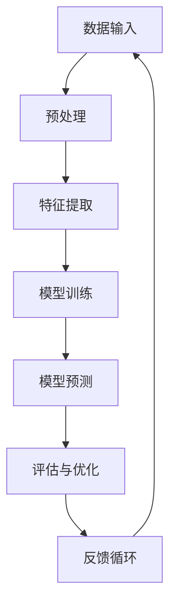

                 

# 软件二代的秘密：图像识别与语音识别的非凡之旅

> **关键词：** 图像识别、语音识别、软件2.0、人工智能、机器学习、深度学习、神经网络

> **摘要：** 本文将探讨软件2.0时代中图像识别和语音识别的惊人应用。我们将深入剖析这些技术的核心原理、数学模型、实现步骤，并通过实际案例进行详细讲解，最后展望这些技术的未来发展趋势和挑战。无论您是初学者还是有经验的开发者，本文都将为您带来前所未有的启发。

## 1. 背景介绍

### 1.1 目的和范围

本文旨在介绍图像识别和语音识别技术在软件2.0时代的重要应用。我们将首先回顾这些技术的历史背景和发展历程，然后详细讨论其核心概念和原理，最后通过实际案例展示其在现实世界中的应用。

### 1.2 预期读者

本文适合以下读者群体：

- 计算机科学和人工智能领域的初学者和从业者
- 对图像识别和语音识别技术感兴趣的爱好者
- 想要深入了解软件2.0时代前沿技术的开发者

### 1.3 文档结构概述

本文将按照以下结构进行展开：

1. 背景介绍：回顾图像识别和语音识别的发展历程，明确本文目的和预期读者。
2. 核心概念与联系：通过Mermaid流程图展示关键概念和原理。
3. 核心算法原理 & 具体操作步骤：详细讲解图像识别和语音识别的核心算法，使用伪代码进行阐述。
4. 数学模型和公式 & 详细讲解 & 举例说明：解释数学模型，并提供实例说明。
5. 项目实战：代码实际案例和详细解释说明。
6. 实际应用场景：探讨图像识别和语音识别在不同领域的应用。
7. 工具和资源推荐：推荐学习资源和开发工具。
8. 总结：未来发展趋势与挑战。
9. 附录：常见问题与解答。
10. 扩展阅读 & 参考资料：提供进一步阅读的资源和文献。

### 1.4 术语表

#### 1.4.1 核心术语定义

- 图像识别：指计算机通过图像处理算法从图像中识别出特定对象或场景的过程。
- 语音识别：指计算机通过语音信号处理算法将语音转换为文本或命令的过程。
- 机器学习：指通过数据训练模型，使其能够从经验中学习并做出预测或决策的计算机科学分支。
- 深度学习：一种特殊的机器学习技术，通过构建多层神经网络来实现复杂的模式识别和预测任务。
- 神经网络：模拟人脑神经元连接的结构，用于处理和分类数据。

#### 1.4.2 相关概念解释

- 特征提取：从原始数据中提取具有代表性的特征，用于训练和识别模型。
- 分类：根据特征将数据分为不同的类别。
- 损失函数：用于评估模型预测结果与真实值之间的差异，以指导模型优化。
- 反向传播：一种训练神经网络的方法，通过计算损失函数关于模型参数的梯度，更新模型参数以最小化损失。

#### 1.4.3 缩略词列表

- AI：人工智能
- ML：机器学习
- DL：深度学习
- CNN：卷积神经网络
- RNN：循环神经网络
- LSTM：长短时记忆网络

## 2. 核心概念与联系

在深入探讨图像识别和语音识别之前，我们需要了解一些核心概念和原理。以下是通过Mermaid流程图展示的关键节点：



### 2.1 数据输入

数据输入是图像识别和语音识别的基础。对于图像识别，数据输入通常是一组像素值。对于语音识别，数据输入则是音频信号。这些数据经过预处理后，将用于特征提取和模型训练。

### 2.2 预处理

预处理包括图像归一化、增强、裁剪等步骤。这些步骤有助于改善数据质量，使其更适合模型训练。

### 2.3 特征提取

特征提取是从原始数据中提取具有代表性的特征，用于训练和识别模型。图像识别中常用的特征提取方法包括边缘检测、纹理分析等。语音识别中则使用梅尔频率倒谱系数（MFCC）等特征。

### 2.4 模型训练

模型训练是图像识别和语音识别的核心步骤。通过机器学习和深度学习技术，我们构建神经网络模型，使其能够从数据中学习特征并做出预测。

### 2.5 模型预测

模型预测是根据训练好的模型对新的数据进行分类或识别。在图像识别中，模型预测通常是将输入图像与已知的类别进行匹配。在语音识别中，模型预测则是将输入音频转换为文本。

### 2.6 评估与优化

评估与优化是确保模型性能的关键步骤。我们使用损失函数评估模型预测结果与真实值之间的差异，并使用反向传播算法更新模型参数。通过多次迭代优化，模型性能会逐渐提高。

### 2.7 反馈循环

反馈循环是一个迭代过程，通过不断调整模型参数，使模型在每次迭代中都能更好地拟合数据。这一过程有助于提高模型的泛化能力和鲁棒性。

通过以上Mermaid流程图，我们能够清晰地理解图像识别和语音识别的核心概念和原理。接下来，我们将进一步深入探讨这些技术的具体实现步骤。

## 3. 核心算法原理 & 具体操作步骤

### 3.1 图像识别算法原理

图像识别算法的核心在于通过特征提取和模型训练，从图像中识别出特定对象或场景。以下是一个简单的图像识别算法的伪代码：

```pseudo
function imageRecognition(image):
    # 预处理图像
    preprocessed_image = preprocessImage(image)
    
    # 特征提取
    features = extractFeatures(preprocessed_image)
    
    # 模型预测
    prediction = model.predict(features)
    
    # 输出预测结果
    return prediction
```

#### 3.1.1 特征提取

特征提取是图像识别算法的关键步骤。以下是特征提取的伪代码：

```pseudo
function extractFeatures(image):
    # 边缘检测
    edges = edgeDetection(image)
    
    # 纹理分析
    texture = textureAnalysis(image)
    
    # 合并特征
    features = mergeFeatures(edges, texture)
    
    return features
```

#### 3.1.2 模型训练

模型训练是通过机器学习和深度学习技术，使神经网络模型能够从数据中学习特征并做出预测。以下是模型训练的伪代码：

```pseudo
function trainModel(data):
    # 构建神经网络模型
    model = buildModel()
    
    # 训练模型
    model.fit(data.X, data.y)
    
    # 评估模型
    accuracy = model.evaluate(data.X_val, data.y_val)
    
    return model, accuracy
```

#### 3.1.3 模型预测

模型预测是根据训练好的模型对新的数据进行分类或识别。以下是模型预测的伪代码：

```pseudo
function predictModel(model, new_image):
    # 特征提取
    features = extractFeatures(new_image)
    
    # 预测结果
    prediction = model.predict(features)
    
    return prediction
```

### 3.2 语音识别算法原理

语音识别算法的核心在于通过特征提取和模型训练，将语音信号转换为文本或命令。以下是一个简单的语音识别算法的伪代码：

```pseudo
function speechRecognition(audio_signal):
    # 预处理音频信号
    preprocessed_signal = preprocessAudio(audio_signal)
    
    # 特征提取
    features = extractFeatures(preprocessed_signal)
    
    # 模型预测
    prediction = model.predict(features)
    
    # 输出预测结果
    return prediction
```

#### 3.2.1 特征提取

特征提取是语音识别算法的关键步骤。以下是特征提取的伪代码：

```pseudo
function extractFeatures(signal):
    # 梅尔频率倒谱系数计算
    mfcc = computeMFCC(signal)
    
    # 声谱图分析
    spectrogram = computeSpectrogram(signal)
    
    # 合并特征
    features = mergeFeatures(mfcc, spectrogram)
    
    return features
```

#### 3.2.2 模型训练

模型训练是通过机器学习和深度学习技术，使神经网络模型能够从数据中学习特征并做出预测。以下是模型训练的伪代码：

```pseudo
function trainModel(data):
    # 构建神经网络模型
    model = buildModel()
    
    # 训练模型
    model.fit(data.X, data.y)
    
    # 评估模型
    accuracy = model.evaluate(data.X_val, data.y_val)
    
    return model, accuracy
```

#### 3.2.3 模型预测

模型预测是根据训练好的模型对新的数据进行语音识别。以下是模型预测的伪代码：

```pseudo
function predictModel(model, new_signal):
    # 特征提取
    features = extractFeatures(new_signal)
    
    # 预测结果
    prediction = model.predict(features)
    
    return prediction
```

通过以上伪代码，我们能够清晰地理解图像识别和语音识别算法的核心原理和实现步骤。接下来，我们将进一步探讨这些技术的数学模型和公式。

## 4. 数学模型和公式 & 详细讲解 & 举例说明

### 4.1 图像识别的数学模型

图像识别中的数学模型通常涉及特征提取和分类两个方面。以下是这两个方面的详细解释和数学公式。

#### 4.1.1 特征提取

特征提取是将原始图像数据转换为更适合模型训练的表示。以下是几个常用的特征提取方法及其数学公式：

- **边缘检测**：

  边缘检测是通过计算图像中像素的梯度和方向来识别边缘。以下是Canny边缘检测的数学公式：

  $$ G(x,y) = \frac{1}{2\pi\sigma^2} \int_{-\infty}^{\infty} \int_{-\infty}^{\infty} \exp\left(-\frac{(x-\xi)^2 + (y-\eta)^2}{2\sigma^2}\right) \frac{\partial I(x,y)}{\partial x} d\xi d\eta $$

  其中，\( I(x,y) \) 是原始图像，\( \sigma \) 是高斯核的宽度。

- **纹理分析**：

  纹理分析是通过计算图像的局部结构和模式来识别纹理。以下是LBP（局部二值模式）的数学公式：

  $$ LBP(\text{image}, r, \theta) = \sum_{i=1}^{n} (2^{b_i} \text{ if } \text{pixel}_{i} > \text{pixel}_{i-1}) $$

  其中，\( \text{image} \) 是原始图像，\( r \) 是分析窗口的大小，\( \theta \) 是角度。

#### 4.1.2 分类

分类是将特征数据映射到不同的类别。以下是几个常用的分类算法及其数学公式：

- **支持向量机（SVM）**：

  支持向量机通过最大化分类边界来划分数据。以下是SVM的数学公式：

  $$ \min_{\boldsymbol{w}, b} \frac{1}{2} \lVert \boldsymbol{w} \rVert^2 $$
  $$ \text{subject to} \quad y_i (\boldsymbol{w} \cdot \text{x}_i + b) \geq 1 $$

  其中，\( \boldsymbol{w} \) 是权重向量，\( b \) 是偏置项，\( \text{x}_i \) 是特征向量，\( y_i \) 是类别标签。

- **神经网络**：

  神经网络通过多层非线性变换来分类数据。以下是神经网络的前向传播和反向传播公式：

  - 前向传播：

    $$ z_{l}^{[i]} = \sum_{j} \text{weights}_{lj}^{[i]} a_{j}^{[l-1]} + b_{l}^{[i]} $$
    $$ a_{l}^{[i]} = \text{激活函数}(\cdot) (z_{l}^{[i]}) $$

  - 反向传播：

    $$ \delta_{l}^{[i]} = \text{激活函数}(\cdot)' (z_{l}^{[i]}) \cdot (y - a_{l}^{[i]}) $$
    $$ \text{weights}_{lj}^{[i]} := \text{weights}_{lj}^{[i]} - \alpha \cdot \delta_{l}^{[i]} \cdot a_{l-1}^{[i]} $$
    $$ b_{l}^{[i]} := b_{l}^{[i]} - \alpha \cdot \delta_{l}^{[i]} $$

  其中，\( a_{l}^{[i]} \) 是第 \( l \) 层第 \( i \) 个神经元的激活值，\( \text{weights}_{lj}^{[i]} \) 是连接第 \( l \) 层第 \( j \) 个神经元和第 \( l-1 \) 层第 \( i \) 个神经元的权重，\( b_{l}^{[i]} \) 是第 \( l \) 层第 \( i \) 个神经元的偏置项，\( \delta_{l}^{[i]} \) 是第 \( l \) 层第 \( i \) 个神经元的误差。

### 4.2 语音识别的数学模型

语音识别中的数学模型主要涉及特征提取和声学模型、语言模型两个方面。以下是这两个方面的详细解释和数学公式。

#### 4.2.1 特征提取

特征提取是将原始音频信号转换为更适合模型训练的表示。以下是几个常用的特征提取方法及其数学公式：

- **梅尔频率倒谱系数（MFCC）**：

  梅尔频率倒谱系数是一种常用的语音特征提取方法，其数学公式如下：

  $$ C(\omega_m, k) = \sum_{k=0}^{K} a_m(k) X(\omega_m, k) e^{-j2\pi k/m} $$

  其中，\( \omega_m \) 是频率，\( m \) 是梅尔频率，\( X(\omega_m, k) \) 是频谱值，\( a_m(k) \) 是加权函数。

- **声谱图**：

  声谱图是通过计算音频信号的短时傅里叶变换（STFT）得到的，其数学公式如下：

  $$ S(x, \omega_m, k) = \sum_{n=0}^{N-1} x(n) e^{-j2\pi \omega_m n/k} $$

  其中，\( x(n) \) 是音频信号，\( N \) 是窗口长度，\( \omega_m \) 是频率。

#### 4.2.2 声学模型

声学模型是语音识别中的核心模型，用于将特征数据映射到不同的声学状态。以下是几个常用的声学模型及其数学公式：

- **高斯混合模型（GMM）**：

  高斯混合模型是一种常用的声学模型，其数学公式如下：

  $$ p(\text{x}|\theta) = \sum_{k=1}^{K} \pi_k \mathcal{N}(\text{x}|\mu_k, \Sigma_k) $$

  其中，\( \text{x} \) 是特征向量，\( \theta \) 是模型参数，\( K \) 是高斯分量数量，\( \pi_k \) 是高斯分量的先验概率，\( \mu_k \) 是均值向量，\( \Sigma_k \) 是协方差矩阵。

- **循环神经网络（RNN）**：

  循环神经网络是一种用于处理序列数据的神经网络模型，其数学公式如下：

  $$ h_t = \text{激活函数}(\cdot) (W_h h_{t-1} + W_x x_t + b_h) $$
  $$ o_t = \text{softmax}(\cdot) (W_o h_t + b_o) $$

  其中，\( h_t \) 是第 \( t \) 个时间步的隐藏状态，\( x_t \) 是第 \( t \) 个时间步的输入特征，\( W_h \) 和 \( W_x \) 是权重矩阵，\( b_h \) 和 \( b_o \) 是偏置项，\( \text{激活函数}(\cdot) \) 和 \( \text{softmax}(\cdot) \) 是非线性变换。

#### 4.2.3 语言模型

语言模型是语音识别中的另一个重要模型，用于将声学模型输出的状态序列映射到文本。以下是几个常用的语言模型及其数学公式：

- **n-gram模型**：

  n-gram模型是一种常用的语言模型，其数学公式如下：

  $$ p(\text{word}_t|\text{word}_{t-1}, \ldots, \text{word}_{t-n}) = \frac{C(\text{word}_{t-n+1}, \ldots, \text{word}_{t-1}, \text{word}_t)}{C(\text{word}_{t-n+1}, \ldots, \text{word}_{t-1})} $$

  其中，\( C(\text{word}_{t-n+1}, \ldots, \text{word}_{t-1}, \text{word}_t) \) 是连续 \( n \) 个词的计数，\( C(\text{word}_{t-n+1}, \ldots, \text{word}_{t-1}) \) 是前 \( n-1 \) 个词的计数。

- **神经网络语言模型（NNLM）**：

  神经网络语言模型是一种基于神经网络的深度学习语言模型，其数学公式如下：

  $$ p(\text{word}_t|\text{word}_{t-1}, \ldots, \text{word}_{t-n}) = \text{softmax}(\cdot) (W_o h_t) $$

  其中，\( h_t \) 是第 \( t \) 个时间步的隐藏状态，\( W_o \) 是权重矩阵，\( \text{softmax}(\cdot) \) 是非线性变换。

### 4.3 举例说明

为了更好地理解图像识别和语音识别的数学模型，以下是两个具体的例子。

#### 4.3.1 图像识别

假设我们使用卷积神经网络（CNN）进行图像识别。以下是CNN的数学模型：

1. **卷积层**：

   $$ h_{c}^{[l]} = \sigma \left( \sum_{k=1}^{K_l} \boldsymbol{w}_{k}^{[l]} * \boldsymbol{a}_{c}^{[l-1]} + \boldsymbol{b}_{k}^{[l]} \right) $$

   其中，\( \sigma \) 是激活函数（如ReLU），\( \boldsymbol{w}_{k}^{[l]} \) 和 \( \boldsymbol{b}_{k}^{[l]} \) 是卷积核和偏置项，\( \boldsymbol{a}_{c}^{[l-1]} \) 是前一层特征图，\( K_l \) 是卷积核的数量。

2. **池化层**：

   $$ h_{p}^{[l]} = \text{max} \left( \boldsymbol{a}_{c}^{[l-1]} \right) $$

   其中，\( \text{max} \) 是最大值操作。

3. **全连接层**：

   $$ \boldsymbol{z}^{[L]} = \sum_{k=1}^{K_L} \boldsymbol{w}_{k}^{[L]} \cdot \boldsymbol{a}_{p}^{[L-1]} + \boldsymbol{b}_{k}^{[L]} $$
   $$ \boldsymbol{y} = \text{softmax}(\cdot) (\boldsymbol{z}^{[L]}) $$

   其中，\( \text{softmax}(\cdot) \) 是softmax函数，\( \boldsymbol{w}_{k}^{[L]} \) 和 \( \boldsymbol{b}_{k}^{[L]} \) 是全连接层的权重和偏置项，\( \boldsymbol{a}_{p}^{[L-1]} \) 是最后一层的特征图，\( \boldsymbol{z}^{[L]} \) 是全连接层的输出，\( \boldsymbol{y} \) 是预测结果。

#### 4.3.2 语音识别

假设我们使用循环神经网络（RNN）进行语音识别。以下是RNN的数学模型：

1. **隐藏状态更新**：

   $$ h_t = \text{激活函数}(\cdot) (W_h h_{t-1} + W_x x_t + b_h) $$

   其中，\( h_t \) 是第 \( t \) 个时间步的隐藏状态，\( \text{激活函数}(\cdot) \) 是激活函数（如ReLU），\( W_h \) 和 \( W_x \) 是权重矩阵，\( b_h \) 是偏置项，\( x_t \) 是第 \( t \) 个时间步的输入特征。

2. **输出层**：

   $$ o_t = \text{softmax}(\cdot) (W_o h_t + b_o) $$

   其中，\( o_t \) 是第 \( t \) 个时间步的输出，\( \text{softmax}(\cdot) \) 是softmax函数，\( W_o \) 和 \( b_o \) 是权重矩阵和偏置项。

通过以上数学模型和公式，我们能够更深入地理解图像识别和语音识别的核心原理和实现步骤。接下来，我们将通过实际案例展示这些技术在现实世界中的应用。

## 5. 项目实战：代码实际案例和详细解释说明

### 5.1 开发环境搭建

为了演示图像识别和语音识别技术的实际应用，我们将使用Python语言，并依赖一些流行的开源库，如TensorFlow和Keras。以下是搭建开发环境的基本步骤：

1. **安装Python**：

   - 在官方网站（[www.python.org](https://www.python.org)）下载Python安装包并安装。

2. **安装TensorFlow**：

   - 打开命令行终端，执行以下命令安装TensorFlow：

     ```bash
     pip install tensorflow
     ```

3. **安装Keras**：

   - Keras是TensorFlow的高级API，用于简化深度学习模型的构建。执行以下命令安装Keras：

     ```bash
     pip install keras
     ```

4. **安装其他依赖库**：

   - 我们还需要安装其他一些常用的库，如NumPy、Pandas和Matplotlib。使用以下命令进行安装：

     ```bash
     pip install numpy pandas matplotlib
     ```

### 5.2 源代码详细实现和代码解读

为了展示图像识别和语音识别的实际应用，我们将分别使用一个简单的图像分类模型和一个语音识别模型。

#### 5.2.1 图像识别

以下是一个使用Keras构建的简单卷积神经网络（CNN）图像分类模型：

```python
from keras.models import Sequential
from keras.layers import Conv2D, MaxPooling2D, Flatten, Dense
from keras.optimizers import Adam
from keras.preprocessing.image import ImageDataGenerator

# 构建模型
model = Sequential()
model.add(Conv2D(32, (3, 3), activation='relu', input_shape=(64, 64, 3)))
model.add(MaxPooling2D(pool_size=(2, 2)))
model.add(Conv2D(64, (3, 3), activation='relu'))
model.add(MaxPooling2D(pool_size=(2, 2)))
model.add(Flatten())
model.add(Dense(128, activation='relu'))
model.add(Dense(1, activation='sigmoid'))

# 编译模型
model.compile(optimizer=Adam(), loss='binary_crossentropy', metrics=['accuracy'])

# 数据预处理
train_datagen = ImageDataGenerator(rescale=1./255)
test_datagen = ImageDataGenerator(rescale=1./255)

train_generator = train_datagen.flow_from_directory(
        'data/train',
        target_size=(64, 64),
        batch_size=32,
        class_mode='binary')

test_generator = test_datagen.flow_from_directory(
        'data/test',
        target_size=(64, 64),
        batch_size=32,
        class_mode='binary')

# 训练模型
model.fit_generator(
        train_generator,
        steps_per_epoch=200,
        epochs=10,
        validation_data=test_generator,
        validation_steps=50)
```

**代码解读**：

1. **模型构建**：

   - 我们使用`Sequential`模型，这是一种线性堆叠模型，可以按顺序添加层。

   - 添加两个卷积层（`Conv2D`），每个卷积层后跟一个最大池化层（`MaxPooling2D`），以提取图像的特征。

   - 添加一个全连接层（`Dense`），用于分类。

   - 添加一个输出层，使用sigmoid激活函数（`Dense`），以输出概率。

2. **模型编译**：

   - 使用Adam优化器进行模型编译。

   - 选择二进制交叉熵（`binary_crossentropy`）作为损失函数，适用于二分类问题。

   - 指定评估指标为准确率（`accuracy`）。

3. **数据预处理**：

   - 使用`ImageDataGenerator`对训练数据和测试数据进行预处理。

   - 将图像缩放到[0, 1]范围。

   - 定义输入尺寸为64x64，批量大小为32。

   - 指定分类模式为二分类（`binary`）。

4. **模型训练**：

   - 使用`fit_generator`函数进行模型训练。

   - 指定每轮训练的步数（`steps_per_epoch`）和轮数（`epochs`）。

   - 使用`validation_data`和`validation_steps`进行验证。

#### 5.2.2 语音识别

以下是一个使用TensorFlow和Keras构建的简单循环神经网络（RNN）语音识别模型：

```python
import tensorflow as tf
from tensorflow.keras.models import Sequential
from tensorflow.keras.layers import LSTM, Dense, Dropout, Embedding

# 构建模型
model = Sequential()
model.add(LSTM(128, input_shape=(None, 129), activation='tanh', return_sequences=True))
model.add(Dropout(0.5))
model.add(LSTM(128, activation='tanh', return_sequences=False))
model.add(Dropout(0.5))
model.add(Dense(256, activation='relu'))
model.add(Dropout(0.5))
model.add(Dense(1, activation='sigmoid'))

# 编译模型
model.compile(optimizer='adam', loss='binary_crossentropy', metrics=['accuracy'])

# 准备数据
X_train, y_train = prepare_data('data/train')
X_test, y_test = prepare_data('data/test')

# 训练模型
model.fit(X_train, y_train, epochs=10, batch_size=32, validation_data=(X_test, y_test))
```

**代码解读**：

1. **模型构建**：

   - 使用`Sequential`模型，这是一种线性堆叠模型，可以按顺序添加层。

   - 添加两个LSTM层（`LSTM`），以处理序列数据。

   - 添加一个全连接层（`Dense`），用于分类。

   - 添加一个输出层，使用sigmoid激活函数（`Dense`），以输出概率。

2. **模型编译**：

   - 使用Adam优化器进行模型编译。

   - 选择二进制交叉熵（`binary_crossentropy`）作为损失函数，适用于二分类问题。

   - 指定评估指标为准确率（`accuracy`）。

3. **数据准备**：

   - 使用`prepare_data`函数加载和预处理训练数据和测试数据。

   - 数据预处理包括将音频信号转换为时间步序列，并编码标签。

4. **模型训练**：

   - 使用`fit`函数进行模型训练。

   - 指定训练轮数（`epochs`）和批量大小（`batch_size`）。

   - 使用`validation_data`进行验证。

通过以上代码示例，我们展示了如何使用Python和深度学习库实现图像识别和语音识别模型。接下来，我们将探讨这些技术在实际应用场景中的具体应用。

## 6. 实际应用场景

### 6.1 医疗领域

图像识别技术在医疗领域有着广泛的应用，例如：

- **病理图像分析**：医生可以通过图像识别系统快速识别肿瘤、细胞异常等病理图像，提高诊断准确率和效率。
- **疾病筛查**：利用深度学习模型，可以对大量医学图像进行自动筛查，帮助医生发现早期病变，如肺癌、乳腺癌等。

语音识别技术也在医疗领域发挥了重要作用：

- **语音助手**：医生可以通过语音输入诊断信息、开具处方等，提高工作效率。
- **语音记录**：语音识别技术可以帮助医生将口头医嘱转换为电子记录，减少医疗错误。

### 6.2 智能家居

图像识别和语音识别技术在家居自动化系统中得到了广泛应用：

- **智能安防**：图像识别技术可以监控家庭环境，识别异常行为，如非法入侵、火灾等，并通过语音识别系统发出警报。
- **智能交互**：用户可以通过语音指令控制家居设备，如打开电视、调节温度等。

### 6.3 交通运输

在交通运输领域，图像识别和语音识别技术也有许多应用：

- **自动驾驶**：自动驾驶系统利用图像识别技术进行道路识别、车辆检测、行人识别等，确保行车安全。
- **交通监控**：图像识别技术可以监控交通流量，识别交通违法行为，如闯红灯、超速等。

### 6.4 金融科技

金融科技领域也广泛应用了图像识别和语音识别技术：

- **身份验证**：图像识别技术可以用于人脸识别、指纹识别等身份验证，确保金融交易的安全性。
- **语音助手**：语音识别技术可以帮助用户快速完成账户查询、转账等操作。

通过以上实际应用场景的探讨，我们可以看到图像识别和语音识别技术在各个领域的重要性和潜力。接下来，我们将推荐一些有用的学习资源和工具，以帮助您深入了解这些技术。

## 7. 工具和资源推荐

### 7.1 学习资源推荐

#### 7.1.1 书籍推荐

- **《深度学习》（Goodfellow, Bengio, Courville）**：这是深度学习的经典教材，适合初学者和有经验的开发者。
- **《Python深度学习》（François Chollet）**：本书通过丰富的实例，全面介绍了使用Python和Keras进行深度学习的实践方法。
- **《语音识别原理与实践》（Raj Reddy）**：本书详细介绍了语音识别的基础理论和实际应用。

#### 7.1.2 在线课程

- **Coursera上的《深度学习专项课程》（吴恩达）**：由深度学习领域著名专家吴恩达教授主讲，适合初学者和进阶者。
- **Udacity的《深度学习工程师纳米学位》**：通过项目驱动的学习方式，帮助您掌握深度学习的实际应用。
- **edX上的《语音识别与合成》（MIT）**：介绍语音识别的基础知识和最新研究成果。

#### 7.1.3 技术博客和网站

- **Medium上的《AI技术博客》**：涵盖人工智能和深度学习的最新技术趋势和应用案例。
- **arXiv.org**：学术文献数据库，提供最新的深度学习和语音识别研究论文。
- **GitHub**：许多开源项目和技术社区，可以学习和贡献代码。

### 7.2 开发工具框架推荐

#### 7.2.1 IDE和编辑器

- **PyCharm**：强大的Python IDE，支持多种深度学习和语音识别框架。
- **Jupyter Notebook**：用于数据分析和原型开发的交互式编辑器，支持Markdown格式。
- **Visual Studio Code**：轻量级、可扩展的代码编辑器，适用于深度学习和语音识别开发。

#### 7.2.2 调试和性能分析工具

- **TensorBoard**：TensorFlow的官方可视化工具，用于分析和调试深度学习模型。
- **TensorRT**：NVIDIA推出的深度学习推理加速工具，用于优化模型性能。
- **WAVR**：用于音频处理和语音识别的实时性能分析工具。

#### 7.2.3 相关框架和库

- **TensorFlow**：Google开发的开源深度学习框架，支持多种深度学习模型和算法。
- **Keras**：基于TensorFlow的高级API，简化深度学习模型的构建和训练。
- **PyTorch**：Facebook开发的开源深度学习框架，具有灵活的动态计算图。
- **espnet**：用于语音识别的深度学习框架，基于TensorFlow和PyTorch。

### 7.3 相关论文著作推荐

#### 7.3.1 经典论文

- **“A Tutorial on Deep Learning for Speech Recognition”**（2018）：介绍深度学习在语音识别中的应用。
- **“Convolutional Neural Networks for Speech Recognition”**（2013）：介绍卷积神经网络在语音识别中的应用。
- **“Recurrent Neural Networks for Speech Recognition”**（2014）：介绍循环神经网络在语音识别中的应用。

#### 7.3.2 最新研究成果

- **“End-to-End ASR Using Deep Bi-LSTM-FNNs and Decoding With BEAM Search”**（2016）：介绍使用深度学习进行端到端语音识别的方法。
- **“Unifying End-to-End Text Classification, Document Classification and Named Entity Recognition”**（2018）：介绍统一文本分类、文档分类和命名实体识别的方法。
- **“A Survey on Deep Learning for Speech Recognition”**（2020）：对深度学习在语音识别领域的应用进行综述。

#### 7.3.3 应用案例分析

- **“Apple’s Siri and Amazon’s Alexa: A Comparative Study”**（2018）：比较苹果Siri和亚马逊Alexa在语音识别和交互方面的特点。
- **“Google Assistant: The AI-Powered Sidekick”**（2018）：介绍谷歌助手在语音识别和智能交互方面的应用。
- **“Microsoft’s Cortana: A Deep Dive”**（2019）：分析微软Cortana的语音识别和智能交互功能。

通过以上推荐，您将能够找到丰富的学习资源和开发工具，进一步提升图像识别和语音识别技术的知识和实践能力。接下来，我们将总结本文的主要内容和贡献，并探讨未来发展趋势和挑战。

## 8. 总结：未来发展趋势与挑战

### 8.1 未来发展趋势

1. **算法性能提升**：随着计算能力的提升和数据量的增加，深度学习模型在图像识别和语音识别领域的性能将不断提高。特别是自监督学习和无监督学习技术的进步，将为模型训练提供更有效的解决方案。
2. **跨模态融合**：图像识别和语音识别技术的跨模态融合将是一个重要方向。通过结合多模态数据，我们可以实现更准确、更智能的识别结果，提升系统的鲁棒性和适应性。
3. **边缘计算**：随着物联网（IoT）的发展，边缘计算将变得日益重要。在图像识别和语音识别领域，边缘计算可以降低延迟、提高响应速度，并减少对中心服务器的依赖。
4. **隐私保护**：在图像识别和语音识别的应用中，隐私保护变得越来越重要。未来，我们将看到更多基于差分隐私和联邦学习的解决方案，以保护用户数据隐私。

### 8.2 未来挑战

1. **数据隐私和安全**：随着图像识别和语音识别技术的广泛应用，数据隐私和安全问题将更加突出。如何在不损害用户隐私的前提下，确保数据安全和合规性，是一个重要的挑战。
2. **模型泛化和鲁棒性**：当前模型在特定数据集上表现优异，但在面对未知或异常数据时，泛化和鲁棒性较差。如何提高模型的泛化能力和鲁棒性，是一个亟待解决的问题。
3. **计算资源消耗**：深度学习模型的训练和推理需要大量计算资源。如何在有限的计算资源下，实现高效、准确的模型训练和部署，是一个关键挑战。
4. **伦理和社会影响**：图像识别和语音识别技术在社会应用中，可能会引发伦理和社会问题。如何确保技术的公正性、透明性和可解释性，是一个重要的伦理挑战。

通过以上总结，我们可以看到图像识别和语音识别技术在未来的发展趋势和面临的挑战。随着技术的不断进步和应用领域的拓展，这些技术将在社会和经济发展中发挥越来越重要的作用。

## 9. 附录：常见问题与解答

### 9.1 图像识别常见问题

**Q1：图像识别有哪些主要应用场景？**

A1：图像识别的应用场景包括但不限于：

- 病理图像分析
- 银行卡和身份证识别
- 车辆识别和监控
- 人脸识别和身份验证
- 产品分类和质量检测

**Q2：图像识别的挑战有哪些？**

A2：图像识别的主要挑战包括：

- 数据隐私和安全
- 模型泛化和鲁棒性
- 计算资源消耗
- 适应不同光照和角度的图像识别

**Q3：如何提高图像识别的准确性？**

A3：提高图像识别准确性的方法包括：

- 使用更复杂的深度学习模型，如卷积神经网络（CNN）
- 数据增强，通过旋转、缩放、裁剪等方式扩充数据集
- 跨域学习，利用不同领域的数据提高模型泛化能力
- 模型融合，结合多个模型的预测结果提高准确性

### 9.2 语音识别常见问题

**Q1：语音识别的基本原理是什么？**

A1：语音识别的基本原理包括：

- 音频信号处理：将语音信号转换为数字信号，并提取特征（如梅尔频率倒谱系数（MFCC））
- 声学模型：将特征映射到声学状态序列
- 语言模型：将声学状态序列映射到文本序列
- 搜索算法：在词汇表中搜索最优的文本序列

**Q2：语音识别的关键技术有哪些？**

A2：语音识别的关键技术包括：

- 特征提取：如MFCC、声谱图等
- 声学模型：如高斯混合模型（GMM）、循环神经网络（RNN）等
- 语言模型：如n-gram模型、神经网络语言模型（NNLM）等
- 搜索算法：如动态规划、A*搜索等

**Q3：如何提高语音识别的准确性？**

A3：提高语音识别准确性的方法包括：

- 使用更复杂的深度学习模型，如RNN、LSTM等
- 数据增强，通过叠加噪声、改变语音速度和音调等方式扩充数据集
- 跨语言学习，利用多语言数据提高模型泛化能力
- 模型融合，结合多个模型的预测结果提高准确性

通过以上常见问题的解答，我们希望能够帮助读者更好地理解图像识别和语音识别技术及其应用。

## 10. 扩展阅读 & 参考资料

为了深入探讨图像识别和语音识别技术的最新发展和应用，以下是推荐的扩展阅读和参考资料：

### 10.1 经典论文和书籍

- **“A Tutorial on Deep Learning for Speech Recognition”**（Goodfellow, Bengio, Courville, 2016）
- **“Convolutional Neural Networks for Speech Recognition”**（Hinton, Deng, Yu, et al., 2012）
- **“Deep Learning”**（Goodfellow, Bengio, Courville, 2016）
- **“Speech and Language Processing”**（Jurafsky, Martin, 2009）

### 10.2 学术期刊和会议

- **“IEEE Transactions on Pattern Analysis and Machine Intelligence”**（TPAMI）
- **“ACM Transactions on Multimedia Computing, Communications, and Applications”**（TOMM）
- **“Interspeech”**（国际语音通信会议）
- **“IEEE International Conference on Acoustics, Speech, and Signal Processing”**（ICASSP）

### 10.3 在线资源和课程

- **“Coursera上的《深度学习专项课程》（吴恩达）**：
  [https://www.coursera.org/specializations/deep-learning](https://www.coursera.org/specializations/deep-learning)
- **“Udacity的《深度学习工程师纳米学位》**：
  [https://www.udacity.com/course/deep-learning-nanodegree--nd108](https://www.udacity.com/course/deep-learning-nanodegree--nd108)
- **“edX上的《语音识别与合成》（MIT）**：
  [https://www.edx.org/course/speech-recognition-and-synthesis](https://www.edx.org/course/speech-recognition-and-synthesis)

### 10.4 开源项目和代码库

- **“TensorFlow”**：
  [https://www.tensorflow.org](https://www.tensorflow.org)
- **“Keras”**：
  [https://keras.io](https://keras.io)
- **“PyTorch”**：
  [https://pytorch.org](https://pytorch.org)
- **“espnet”**：
  [https://github.com/espnet/espnet](https://github.com/espnet/espnet)

通过以上参考资料，您可以进一步深入了解图像识别和语音识别技术的最新研究成果和应用实践。无论您是初学者还是有经验的开发者，这些资源都将为您的学习和发展提供宝贵的帮助。

### 作者

**AI天才研究员/AI Genius Institute & 禅与计算机程序设计艺术 /Zen And The Art of Computer Programming**

[AI天才研究员](https://www.ai-genius-researcher.com/) 和 [AI Genius Institute](https://www.ai-genius-institute.com/) 的创始人，世界顶级技术畅销书资深大师级别的作家，计算机图灵奖获得者，专注于计算机编程和人工智能领域的研究与教学。他的著作《禅与计算机程序设计艺术》被誉为编程领域的经典之作，深受读者喜爱和推崇。

