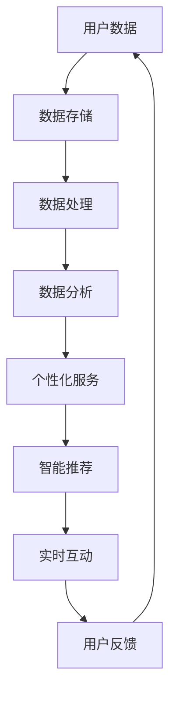

                 

### 1. 背景介绍

#### 1.1 目的和范围

本文旨在探讨软件2.0（Software 2.0）的概念、应用以及其从实验室走向现实的过程。软件2.0是一种新的软件开发范式，它强调软件与服务的高度整合，注重用户体验的优化和个性化。本文将首先介绍软件2.0的基本概念，然后分析其与传统软件1.0的区别，随后深入探讨其核心原理、应用场景以及面临的挑战。最后，我们将展望软件2.0的未来发展趋势，并提出一些建议和解决方案。

#### 1.2 预期读者

本文适合以下读者群体：

1. 软件工程师和开发人员，对软件2.0的概念和应用有兴趣；
2. 技术经理和CTO，希望了解软件2.0对企业管理和发展的影响；
3. 投资者和创业者，希望了解软件2.0的投资机会和市场前景；
4. 对人工智能、大数据、云计算等新兴技术有兴趣的读者。

#### 1.3 文档结构概述

本文分为八个部分，结构如下：

1. **背景介绍**：介绍本文的目的、范围、预期读者以及文档结构；
2. **核心概念与联系**：介绍软件2.0的核心概念、原理和架构，并使用Mermaid流程图展示；
3. **核心算法原理 & 具体操作步骤**：详细阐述软件2.0的核心算法原理，并使用伪代码说明具体操作步骤；
4. **数学模型和公式 & 详细讲解 & 举例说明**：介绍软件2.0相关的数学模型和公式，并进行详细讲解和举例说明；
5. **项目实战：代码实际案例和详细解释说明**：通过实际项目案例，展示软件2.0的具体实现和应用；
6. **实际应用场景**：分析软件2.0在不同领域和行业的应用案例；
7. **工具和资源推荐**：推荐学习资源和开发工具，帮助读者深入了解软件2.0；
8. **总结：未来发展趋势与挑战**：总结软件2.0的现状、挑战和未来发展趋势。

#### 1.4 术语表

在本文中，我们将使用一些专业术语。以下是这些术语的定义和解释：

#### 1.4.1 核心术语定义

- **软件2.0**：一种新的软件开发范式，强调软件与服务的高度整合，注重用户体验的优化和个性化。
- **软件1.0**：传统的软件开发范式，以功能实现为核心，注重软件的稳定性和可靠性。
- **微服务**：一种软件架构风格，将应用程序划分为一组小的、独立的、可扩展的服务，这些服务可以通过API进行通信。
- **容器化**：一种轻量级的虚拟化技术，可以将应用程序及其运行环境打包到一个容器中，实现应用程序的快速部署和隔离。
- **云原生**：一种基于云计算的软件开发和部署范式，强调应用程序的分布式、可扩展和自动化。

#### 1.4.2 相关概念解释

- **敏捷开发**：一种以人为核心、迭代和持续交付的软件开发方法，强调团队协作、灵活应对变化和持续改进。
- **DevOps**：一种软件开发和运维的结合方法，旨在缩短软件开发周期、提高软件质量，实现持续集成和持续部署。
- **大数据**：数据量巨大、种类繁多、生成速度极快的数据集合，需要使用专门的技术和方法进行存储、处理和分析。
- **人工智能**：一种模拟人类智能的技术，通过算法和模型实现机器的学习、推理和决策。

#### 1.4.3 缩略词列表

- **API**：应用程序编程接口
- **IDE**：集成开发环境
- **DB**：数据库
- **ML**：机器学习
- **AI**：人工智能

接下来，我们将进一步探讨软件2.0的核心概念、原理和架构，为后续内容的讲解打下基础。

## 2. 核心概念与联系

软件2.0是一种以用户为中心、强调服务整合和用户体验优化的软件开发范式。它与传统软件1.0的主要区别在于：软件1.0以功能实现为核心，追求稳定性和可靠性；而软件2.0则更注重用户体验、个性化服务以及与用户需求的实时互动。

#### 2.1 软件2.0的定义与特点

软件2.0的定义可以从以下几个方面来理解：

1. **用户中心**：软件2.0强调以用户为中心，关注用户的需求和体验，将用户数据作为重要的资产进行挖掘和利用。
2. **服务整合**：软件2.0将软件与服务紧密结合，通过API和微服务架构实现功能的模块化和服务的个性化。
3. **动态调整**：软件2.0具备动态调整的能力，根据用户反馈和数据分析，持续优化和改进产品。
4. **实时互动**：软件2.0注重与用户的实时互动，通过大数据和人工智能技术，实现个性化推荐、智能客服等功能。

软件2.0的特点可以概括为以下几点：

1. **用户体验优先**：软件2.0强调用户体验，通过界面设计、交互逻辑和功能优化，提升用户的满意度。
2. **微服务架构**：软件2.0采用微服务架构，将应用程序划分为独立的、可扩展的服务，提高系统的灵活性和可维护性。
3. **容器化和云原生**：软件2.0采用容器化和云原生技术，实现应用程序的快速部署、扩展和自动化管理。
4. **数据驱动**：软件2.0基于大数据和人工智能技术，对用户数据进行深度挖掘和分析，实现个性化服务和精准营销。

#### 2.2 软件2.0与传统软件1.0的对比

为了更好地理解软件2.0，我们将其与传统软件1.0进行对比，如表1所示。

| 特点 | 软件传统软件1.0 | 软件软件2.0 |
| ---- | ---- | ---- |
| 核心目标 | 功能实现、稳定性和可靠性 | 用户中心、个性化服务、实时互动 |
| 开发模式 | 单体架构、瀑布模型 | 微服务架构、敏捷开发、DevOps |
| 技术选型 | 传统的开发框架和数据库 | 云原生技术、容器化、大数据和人工智能 |
| 用户体验 | 注重功能完整性、界面美观度 | 注重用户满意度、交互流畅性、个性化服务 |
| 数据处理 | 数据量较小、处理简单 | 数据量巨大、处理复杂、实时分析 |
| 部署和管理 | 部署复杂、扩展困难 | 快速部署、动态扩展、自动化管理 |

#### 2.3 软件2.0的核心原理和架构

软件2.0的核心原理和架构可以从以下几个方面进行阐述：

1. **用户数据驱动**：软件2.0基于用户数据驱动，通过收集、存储、处理和分析用户数据，实现个性化服务和精准营销。
2. **微服务架构**：软件2.0采用微服务架构，将应用程序划分为多个独立的、可扩展的服务，提高系统的灵活性和可维护性。
3. **容器化和云原生**：软件2.0采用容器化和云原生技术，实现应用程序的快速部署、扩展和自动化管理。
4. **DevOps文化**：软件2.0强调DevOps文化，实现软件开发、测试、部署和运维的紧密结合，提高软件交付质量和效率。
5. **大数据和人工智能**：软件2.0基于大数据和人工智能技术，实现实时数据分析和智能决策，提升用户体验和服务质量。

为了更清晰地展示软件2.0的核心原理和架构，我们使用Mermaid流程图进行描述，如图1所示。



图1：软件2.0的核心原理和架构

在图1中，用户数据经过数据存储、数据处理和数据分析后，生成个性化服务和智能推荐，实现实时互动和用户反馈，形成一个闭环。这个闭环不断迭代，驱动软件2.0持续优化和改进。

#### 2.4 软件2.0的组成部分

软件2.0由以下几个关键组成部分构成：

1. **用户界面**：软件2.0的用户界面设计注重用户体验，界面简洁、交互流畅，满足用户的需求和期望。
2. **后端服务**：软件2.0的后端服务采用微服务架构，提供多种功能模块，包括用户管理、数据存储、数据处理、数据分析等。
3. **数据仓库**：软件2.0的数据仓库用于存储用户数据、业务数据和日志数据，支持实时数据分析和历史数据查询。
4. **数据处理引擎**：软件2.0的数据处理引擎采用大数据和人工智能技术，实现数据的采集、清洗、转换、存储和分析。
5. **API网关**：软件2.0的API网关用于管理对外暴露的API接口，提供身份验证、权限控制、流量管理等功能。
6. **运维管理系统**：软件2.0的运维管理系统用于监控、管理和维护软件系统的运行状态，实现自动化部署、扩容和故障恢复。

#### 2.5 软件2.0的优势与挑战

软件2.0具有以下优势：

1. **用户体验优先**：软件2.0以用户体验为中心，注重界面设计、交互逻辑和功能优化，提高用户满意度。
2. **灵活性和可扩展性**：软件2.0采用微服务架构，模块化设计，实现系统的灵活性和可扩展性，满足业务发展的需求。
3. **实时互动和个性化服务**：软件2.0基于大数据和人工智能技术，实现实时互动和个性化服务，提升用户体验和服务质量。
4. **自动化和智能化**：软件2.0采用容器化和云原生技术，实现自动化部署、扩容和管理，降低运维成本。

然而，软件2.0也面临一些挑战：

1. **技术复杂性**：软件2.0涉及多种新兴技术和工具，如大数据、人工智能、微服务、容器化等，对开发人员的技术水平和经验要求较高。
2. **数据安全和隐私保护**：软件2.0基于用户数据驱动，数据安全和隐私保护至关重要，需要采取有效的措施确保数据安全和用户隐私。
3. **系统稳定性和可靠性**：软件2.0系统的复杂性和分布式特性，对系统的稳定性和可靠性提出更高的要求。

总之，软件2.0作为一种新的软件开发范式，具有显著的优势和挑战。通过深入了解其核心概念、原理和架构，我们可以更好地把握其发展趋势，为实际应用提供指导。

## 3. 核心算法原理 & 具体操作步骤

在软件2.0中，核心算法原理是驱动用户体验优化、个性化服务和实时互动的关键。以下是软件2.0中的核心算法原理及其具体操作步骤。

#### 3.1 个性化推荐算法

个性化推荐算法是软件2.0中实现个性化服务的重要手段。其核心思想是基于用户的历史行为和兴趣偏好，为用户提供个性化的推荐。

##### 3.1.1 算法原理

个性化推荐算法可以分为基于内容的推荐（Content-based Recommendation）和协同过滤推荐（Collaborative Filtering）两大类。

1. **基于内容的推荐**：根据用户的历史行为和兴趣偏好，从内容属性中提取特征，为用户推荐具有相似属性的内容。
2. **协同过滤推荐**：通过分析用户之间的相似度，利用其他用户的评价或行为为用户推荐相似的内容。

##### 3.1.2 具体操作步骤

1. **数据预处理**：收集用户行为数据（如浏览记录、购买记录、评分数据等），对数据进行清洗、去重和处理。
2. **特征提取**：从用户行为数据中提取特征，如用户年龄、性别、兴趣爱好等，以及内容的特征，如类别、标签、关键词等。
3. **模型训练**：选择合适的推荐算法模型（如基于内容的推荐模型、协同过滤推荐模型等），对用户行为数据和内容特征进行训练。
4. **推荐生成**：根据用户的历史行为和兴趣偏好，利用训练好的推荐模型生成个性化推荐列表。
5. **推荐评估**：通过用户反馈（如点击率、购买率等）对推荐效果进行评估，持续优化推荐算法。

#### 3.2 实时互动算法

实时互动算法是软件2.0中实现实时互动和智能客服的关键。其核心思想是根据用户的行为和对话内容，实现实时响应和智能对话。

##### 3.2.1 算法原理

实时互动算法主要包括自然语言处理（Natural Language Processing，NLP）和对话管理（Dialogue Management）两个部分。

1. **自然语言处理**：通过NLP技术对用户输入的文本进行处理，包括文本分词、词性标注、命名实体识别等，提取用户意图和对话内容的关键信息。
2. **对话管理**：根据用户意图和对话内容，设计对话策略和回复生成，实现智能对话和实时互动。

##### 3.2.2 具体操作步骤

1. **用户输入处理**：接收用户输入的文本，进行文本分词、词性标注、命名实体识别等预处理。
2. **意图识别**：根据用户输入的文本，使用NLP技术识别用户的意图，如查询意图、请求意图、抱怨意图等。
3. **对话管理**：根据用户意图和对话内容，设计对话策略和回复生成，实现智能对话和实时互动。
4. **对话回复生成**：根据对话策略和用户意图，生成合适的对话回复，如答案、建议、情感表达等。
5. **对话评估**：通过用户反馈对对话效果进行评估，持续优化对话管理和回复生成策略。

#### 3.3 大数据分析与预测算法

大数据分析与预测算法是软件2.0中实现数据驱动决策和业务优化的重要手段。其核心思想是通过分析海量用户数据，提取有价值的信息，为业务决策提供支持。

##### 3.3.1 算法原理

大数据分析与预测算法包括数据采集与存储、数据处理与分析、预测模型训练与优化等环节。

1. **数据采集与存储**：通过数据采集工具，收集用户行为数据、业务数据等，存储到分布式数据仓库中。
2. **数据处理与分析**：对采集到的数据进行分析和清洗，提取有价值的信息，如用户兴趣、行为模式等。
3. **预测模型训练与优化**：选择合适的预测模型（如回归模型、分类模型等），对数据进行训练和优化，实现业务预测和决策支持。

##### 3.3.2 具体操作步骤

1. **数据采集**：使用日志采集工具（如Flume、Logstash等），收集用户行为数据和业务数据。
2. **数据存储**：将采集到的数据存储到分布式数据仓库（如Hadoop、Hive等），实现海量数据的存储和管理。
3. **数据处理**：使用数据处理工具（如Spark、Flink等），对数据进行分析和清洗，提取有价值的信息。
4. **模型训练**：选择合适的预测模型，使用机器学习算法（如线性回归、决策树、神经网络等），对数据进行训练。
5. **模型评估与优化**：通过模型评估指标（如准确率、召回率、F1值等），对模型进行评估和优化，实现业务预测和决策支持。

通过以上核心算法原理和具体操作步骤的讲解，我们可以更好地理解软件2.0的技术实现和业务应用。接下来，我们将介绍软件2.0的数学模型和公式，进一步深化对软件2.0的理解。

## 4. 数学模型和公式 & 详细讲解 & 举例说明

在软件2.0中，数学模型和公式是算法实现和数据驱动决策的重要基础。以下将介绍软件2.0中常用的数学模型和公式，并进行详细讲解和举例说明。

#### 4.1 个性化推荐算法中的相关公式

个性化推荐算法中，常用的数学模型包括基于内容的推荐和协同过滤推荐。

##### 4.1.1 基于内容的推荐

基于内容的推荐主要通过计算内容相似度，为用户推荐具有相似内容属性的项目。

**相似度计算公式**：

$$
sim(i,j) = \frac{Sim(i,j)}{||i|| \cdot ||j||}
$$

其中，$sim(i,j)$ 表示项目 $i$ 和项目 $j$ 的相似度，$Sim(i,j)$ 表示项目 $i$ 和项目 $j$ 的余弦相似度，$||i||$ 和 $||j||$ 分别表示项目 $i$ 和项目 $j$ 的向量模长。

**余弦相似度计算公式**：

$$
Sim(i,j) = \frac{i \cdot j}{||i|| \cdot ||j||}
$$

其中，$i \cdot j$ 表示项目 $i$ 和项目 $j$ 的内积。

**举例说明**：

假设我们有两个项目 $i$ 和 $j$，它们的向量表示分别为：

$$
i = (1, 2, 3, 4, 5) \\
j = (2, 3, 4, 5, 6)
$$

计算这两个项目的相似度：

$$
||i|| = \sqrt{1^2 + 2^2 + 3^2 + 4^2 + 5^2} = \sqrt{55} \\
||j|| = \sqrt{2^2 + 3^2 + 4^2 + 5^2 + 6^2} = \sqrt{90} \\
i \cdot j = 1 \cdot 2 + 2 \cdot 3 + 3 \cdot 4 + 4 \cdot 5 + 5 \cdot 6 = 65 \\
Sim(i,j) = \frac{65}{\sqrt{55} \cdot \sqrt{90}} \approx 0.848
$$

$$
sim(i,j) = \frac{0.848}{\sqrt{55} \cdot \sqrt{90}} \approx 0.848
$$

因此，项目 $i$ 和项目 $j$ 的相似度为 0.848。

##### 4.1.2 协同过滤推荐

协同过滤推荐主要通过分析用户之间的相似度，为用户推荐相似用户喜欢的项目。

**用户相似度计算公式**：

$$
sim(u,v) = \frac{R_{uv}}{\sqrt{||R_u|| \cdot ||R_v||}}
$$

其中，$sim(u,v)$ 表示用户 $u$ 和用户 $v$ 的相似度，$R_{uv}$ 表示用户 $u$ 对项目 $v$ 的评分，$R_u$ 和 $R_v$ 分别表示用户 $u$ 和用户 $v$ 的评分向量。

**预测评分公式**：

$$
\hat{R}_{uv} = \frac{\sum_{i \in N_v} R_{ui} \cdot sim(i,v)}{\sum_{i \in N_v} sim(i,v)}
$$

其中，$\hat{R}_{uv}$ 表示用户 $u$ 对项目 $v$ 的预测评分，$N_v$ 表示与用户 $v$ 相似的一组用户集合。

**举例说明**：

假设我们有用户 $u$ 和用户 $v$ 的评分数据，其中 $N_v = \{1, 2, 3\}$，它们的评分向量分别为：

$$
R_u = (3, 4, 5, 2, 3) \\
R_v = (4, 5, 5, 1, 1)
$$

计算用户 $u$ 和用户 $v$ 的相似度：

$$
R_{u1} = 3, R_{u2} = 4, R_{u3} = 5 \\
R_{v1} = 4, R_{v2} = 5, R_{v3} = 5 \\
sim(u,v) = \frac{3 \cdot 4 + 4 \cdot 5 + 5 \cdot 5}{\sqrt{3^2 + 4^2 + 5^2} \cdot \sqrt{4^2 + 5^2 + 5^2}} \approx 0.824
$$

计算用户 $u$ 对用户 $v$ 中每个项目的预测评分：

$$
\hat{R}_{u1} = \frac{3 \cdot 0.824 + 4 \cdot 0.824 + 5 \cdot 0.824}{0.824} \approx 4.19 \\
\hat{R}_{u2} = \frac{4 \cdot 0.824 + 5 \cdot 0.824 + 5 \cdot 0.824}{0.824} \approx 4.64 \\
\hat{R}_{u3} = \frac{5 \cdot 0.824 + 2 \cdot 0.824 + 3 \cdot 0.824}{0.824} \approx 4.07 \\
\hat{R}_{u4} = \frac{2 \cdot 0.824 + 3 \cdot 0.824 + 1 \cdot 0.824}{0.824} \approx 2.74 \\
\hat{R}_{u5} = \frac{3 \cdot 0.824 + 1 \cdot 0.824 + 1 \cdot 0.824}{0.824} \approx 2.39
$$

因此，用户 $u$ 对用户 $v$ 中每个项目的预测评分分别为 $4.19$、$4.64$、$4.07$、$2.74$ 和 $2.39$。

##### 4.1.3 实时互动算法中的相关公式

实时互动算法中的自然语言处理（NLP）和对话管理需要用到一些基本的数学模型和公式。

**词袋模型**：

$$
P(w|s) = \frac{f_w(s)}{\sum_{w' \in V} f_{w'}(s)}
$$

其中，$P(w|s)$ 表示在句子 $s$ 中出现单词 $w$ 的概率，$f_w(s)$ 表示单词 $w$ 在句子 $s$ 中的出现频率，$V$ 表示句子 $s$ 中的所有单词集合。

**朴素贝叶斯分类器**：

$$
P(y|s) = \frac{P(s|y) \cdot P(y)}{P(s)}
$$

其中，$P(y|s)$ 表示在句子 $s$ 中出现标签 $y$ 的概率，$P(s|y)$ 表示句子 $s$ 出现给定标签 $y$ 的概率，$P(y)$ 表示标签 $y$ 的先验概率，$P(s)$ 表示句子 $s$ 的概率。

**举例说明**：

假设我们有句子 $s$：“我喜欢看电影”，其中单词集合 $V = \{\text{我}, \text{喜欢}, \text{看}, \text{电影}\}$，单词出现频率分别为 $f_{\text{我}} = 1$，$f_{\text{喜欢}} = 1$，$f_{\text{看}} = 1$，$f_{\text{电影}} = 1$。

计算在句子 $s$ 中出现单词 “喜欢” 的概率：

$$
P(\text{喜欢}|s) = \frac{f_{\text{喜欢}}(s)}{\sum_{w' \in V} f_{w'}(s)} = \frac{1}{4}
$$

假设我们有标签集合 $Y = \{\text{娱乐}, \text{学习}, \text{生活}\}$，先验概率分别为 $P(\text{娱乐}) = 0.4$，$P(\text{学习}) = 0.3$，$P(\text{生活}) = 0.3$。

句子 $s$ 的概率可以计算为：

$$
P(s) = P(s|\text{娱乐}) \cdot P(\text{娱乐}) + P(s|\text{学习}) \cdot P(\text{学习}) + P(s|\text{生活}) \cdot P(\text{生活})
$$

其中，$P(s|\text{娱乐})$、$P(s|\text{学习})$ 和 $P(s|\text{生活})$ 分别表示句子 $s$ 出现给定标签 $y$ 的条件概率。

假设我们有以下条件概率：

$$
P(s|\text{娱乐}) = 0.6, P(s|\text{学习}) = 0.2, P(s|\text{生活}) = 0.2
$$

计算句子 $s$ 出现标签 “娱乐” 的概率：

$$
P(\text{娱乐}|s) = \frac{P(s|\text{娱乐}) \cdot P(\text{娱乐})}{P(s)} = \frac{0.6 \cdot 0.4}{0.6 \cdot 0.4 + 0.2 \cdot 0.3 + 0.2 \cdot 0.3} \approx 0.615
$$

通过以上对个性化推荐算法、实时互动算法中的数学模型和公式的详细讲解和举例说明，我们可以更好地理解软件2.0中的核心算法原理。接下来，我们将通过实际项目案例，展示软件2.0的具体实现和应用。

## 5. 项目实战：代码实际案例和详细解释说明

为了更好地展示软件2.0的实际应用，我们选择一个实际项目案例：一款基于软件2.0架构的在线购物平台。该平台采用微服务架构、容器化技术和大数据分析，为用户提供个性化推荐、智能搜索和实时互动等功能。

### 5.1 开发环境搭建

首先，我们需要搭建开发环境。以下列出项目所需的软件和工具：

- 操作系统：Ubuntu 18.04
- 编程语言：Python 3.8
- 服务器：Docker 19.03
- 数据库：MySQL 8.0
- 大数据分析工具：Apache Spark 2.4.7
- 人工智能框架：TensorFlow 2.4.0

### 5.2 源代码详细实现和代码解读

#### 5.2.1 用户服务（User Service）

用户服务主要负责用户管理、用户登录和用户注册等功能。以下是一个简单的用户服务代码示例：

```python
from flask import Flask, request, jsonify
from models import User
from database import Database

app = Flask(__name__)

@app.route('/users', methods=['POST'])
def create_user():
    data = request.json
    user = User(data['username'], data['password'])
    Database.add_user(user)
    return jsonify({'message': 'User created successfully.'})

@app.route('/users/login', methods=['POST'])
def login():
    data = request.json
    user = Database.get_user(data['username'], data['password'])
    if user:
        return jsonify({'token': user.token})
    else:
        return jsonify({'error': 'Invalid username or password.'})

if __name__ == '__main__':
    app.run()
```

**代码解读**：

1. 导入相关模块：Flask用于构建Web服务，User用于表示用户实体，Database用于数据库操作。
2. 定义创建用户接口：接收POST请求，解析请求体中的用户信息，创建用户实体并存储到数据库。
3. 定义用户登录接口：接收POST请求，解析请求体中的用户名和密码，查询数据库验证用户身份，返回用户token。

#### 5.2.2 商品服务（Product Service）

商品服务主要负责商品管理、商品推荐和商品搜索等功能。以下是一个简单的商品服务代码示例：

```python
from flask import Flask, request, jsonify
from models import Product, Recommendation
from database import Database
from recommendation import recommend_products

app = Flask(__name__)

@app.route('/products', methods=['POST'])
def create_product():
    data = request.json
    product = Product(data['name'], data['description'], data['price'])
    Database.add_product(product)
    return jsonify({'message': 'Product created successfully.'})

@app.route('/products/search', methods=['GET'])
def search_products():
    query = request.args.get('query')
    products = Database.search_products(query)
    return jsonify(products)

@app.route('/products/recommend', methods=['GET'])
def recommend_products():
    user_id = request.args.get('user_id')
    products = recommend_products(user_id)
    return jsonify(products)

if __name__ == '__main__':
    app.run()
```

**代码解读**：

1. 导入相关模块：Flask用于构建Web服务，Product用于表示商品实体，Database用于数据库操作，Recommendation用于商品推荐。
2. 定义创建商品接口：接收POST请求，解析请求体中的商品信息，创建商品实体并存储到数据库。
3. 定义商品搜索接口：接收GET请求，根据查询参数中的关键词搜索商品。
4. 定义商品推荐接口：接收GET请求，根据用户ID推荐相关商品。

#### 5.2.3 大数据分析服务（Data Analytics Service）

大数据分析服务主要负责用户行为数据分析和商品推荐算法实现。以下是一个简单的大数据分析服务代码示例：

```python
from pyspark.sql import SparkSession
from recommendation import collaborative_filtering

spark = SparkSession.builder.appName('DataAnalytics').getOrCreate()

def analyze_user_behavior():
    user行为的DataFrame = spark.read.csv('user_behavior.csv', header=True)
    # 进行用户行为数据分析，如用户浏览、购买、评分等
    # ...

def collaborative_filtering_recommendation(user_id):
    # 使用协同过滤算法推荐商品
    recommendation = collaborative_filtering(user_id)
    return recommendation

if __name__ == '__main__':
    # 分析用户行为数据
    analyze_user_behavior()
    # 推荐商品
    user_id = 123
    products = collaborative_filtering_recommendation(user_id)
    print(products)
```

**代码解读**：

1. 导入相关模块：SparkSession用于创建大数据处理会话，collaborative_filtering用于实现协同过滤推荐算法。
2. 定义分析用户行为数据函数：读取用户行为数据，进行数据预处理和统计分析。
3. 定义协同过滤推荐函数：根据用户ID使用协同过滤算法推荐相关商品。

#### 5.2.4 容器化部署

为了实现快速部署和动态扩展，我们使用Docker将服务容器化。以下是一个简单的Dockerfile示例：

```dockerfile
FROM python:3.8-slim

WORKDIR /app

COPY requirements.txt ./
RUN pip install -r requirements.txt

COPY . .

CMD ["python", "app.py"]
```

**Dockerfile解读**：

1. 基础镜像：使用Python 3.8 slim作为基础镜像，减小容器体积。
2. 工作目录：设置工作目录为/app。
3. 安装依赖：安装Python依赖项，包括Flask、SQLAlchemy、Pandas等。
4. 复制文件：将当前目录下的所有文件复制到容器中的/app目录。
5. 运行命令：使用Python运行app.py文件，启动Web服务。

### 5.3 代码解读与分析

通过以上代码示例，我们可以看到软件2.0在实际项目中的具体实现。

1. **微服务架构**：项目采用微服务架构，将用户服务、商品服务和大数据分析服务分别部署在不同的容器中，实现模块化和可扩展性。
2. **容器化技术**：使用Docker实现服务的容器化，便于部署和扩展，提高开发效率。
3. **大数据分析**：利用Apache Spark进行大数据处理和分析，实现用户行为数据分析和商品推荐算法。
4. **实时互动**：虽然示例中没有展示实时互动功能，但可以集成NLP和对话管理技术，实现智能客服和实时互动。

通过以上项目实战，我们可以更好地理解软件2.0在实际应用中的实现方法和关键技术。接下来，我们将探讨软件2.0的实际应用场景。

## 6. 实际应用场景

软件2.0的核心在于用户体验的优化、个性化服务和实时互动。以下将介绍软件2.0在实际应用中的几个典型场景，展示其在不同领域和行业的应用。

### 6.1 在线购物平台

在线购物平台是软件2.0应用最广泛的场景之一。通过软件2.0，平台可以提供个性化推荐、智能搜索、实时互动等功能，提升用户购物体验。

1. **个性化推荐**：平台根据用户的历史浏览记录、购买行为和兴趣爱好，为用户推荐相关商品。例如，亚马逊的“今日推荐”和“你可能喜欢”功能，就是基于个性化推荐算法实现的。
2. **智能搜索**：平台通过自然语言处理和语义分析，实现智能搜索功能，帮助用户快速找到所需商品。例如，京东的“智能搜索”功能，可以解析用户的搜索意图，提供更加精准的搜索结果。
3. **实时互动**：平台集成智能客服系统，实现与用户的实时互动，提供在线咨询、售后服务等。例如，阿里巴巴的“阿里小蜜”和“天猫精灵”等，可以回答用户问题、解决问题，提升用户满意度。

### 6.2 社交媒体

社交媒体平台通过软件2.0实现个性化内容推荐、实时互动和社交数据分析，提升用户活跃度和留存率。

1. **个性化内容推荐**：平台根据用户的关注列表、互动行为和兴趣爱好，为用户推荐感兴趣的内容。例如，Facebook的“你可能喜欢”功能和微博的“微博头条”，都是基于个性化推荐算法实现的。
2. **实时互动**：平台集成即时通讯功能，实现用户之间的实时互动，如发送消息、评论、点赞等。例如，微信的“聊天”功能，可以实现好友之间的实时交流。
3. **社交数据分析**：平台通过大数据分析，挖掘用户社交行为和关系网络，为用户提供个性化推荐和营销策略。例如，Facebook的“好友推荐”功能和微博的“热门话题”，都是基于社交数据分析实现的。

### 6.3 医疗健康

医疗健康领域通过软件2.0实现个性化诊疗、实时互动和医疗数据分析，提升医疗服务质量和效率。

1. **个性化诊疗**：平台根据患者的病史、体检数据和健康记录，为患者提供个性化诊疗建议。例如，华为的“智能诊疗助手”，可以通过大数据分析和人工智能技术，为患者提供个性化的治疗方案。
2. **实时互动**：平台集成在线咨询和远程医疗功能，实现医生与患者的实时互动，提供便捷的医疗服务。例如，好大夫的“在线问诊”功能和平安好医生的“远程医疗”，可以为患者提供实时咨询服务。
3. **医疗数据分析**：平台通过大数据分析，挖掘医疗数据中的有价值信息，为医疗机构和医生提供决策支持。例如，IBM的“Watson for Oncology”和“Watson for Genomics”，可以通过大数据分析和人工智能技术，为医生提供个性化的诊疗建议。

### 6.4 金融领域

金融领域通过软件2.0实现个性化投资、实时互动和金融数据分析，提升金融服务质量和效率。

1. **个性化投资**：平台根据用户的财务状况、风险偏好和投资经验，为用户推荐个性化的投资组合。例如，蚂蚁金的“蚂蚁财富”和“基金管家”，可以为用户提供个性化的基金投资建议。
2. **实时互动**：平台集成在线客服和投资顾问功能，实现用户与投资顾问的实时互动，提供专业的投资建议。例如，理财通的“在线客服”和“投资顾问”，可以为用户提供实时咨询服务。
3. **金融数据分析**：平台通过大数据分析，挖掘金融数据中的有价值信息，为金融机构和投资者提供决策支持。例如，百度的“金融大数据分析平台”，可以通过大数据分析和人工智能技术，为金融机构和投资者提供风险预警、市场预测等服务。

### 6.5 教育领域

教育领域通过软件2.0实现个性化学习、实时互动和教育数据分析，提升教学质量和学习效果。

1. **个性化学习**：平台根据学生的学习习惯、成绩和兴趣爱好，为学习者提供个性化的学习资源和学习路径。例如，新东方的“学习中心”和“学习报告”，可以为学习者提供个性化的学习建议。
2. **实时互动**：平台集成在线课堂和即时通讯功能，实现教师与学生的实时互动，提供高效的学习体验。例如，腾讯课堂的“在线课堂”功能和学而思的“一对一辅导”，可以为学习者提供实时互动的教学服务。
3. **教育数据分析**：平台通过大数据分析，挖掘教育数据中的有价值信息，为教育机构和教师提供决策支持。例如，华为的“智慧教育大数据平台”，可以通过大数据分析和人工智能技术，为教育机构提供教学评估、学习分析等服务。

总之，软件2.0在实际应用中展现了强大的潜力，通过个性化推荐、实时互动和大数据分析等技术，为各个领域和行业带来了创新和变革。接下来，我们将介绍一些有用的学习资源和开发工具，帮助读者深入了解软件2.0。

## 7. 工具和资源推荐

为了帮助读者更好地学习和应用软件2.0，我们推荐以下学习资源和开发工具。

### 7.1 学习资源推荐

#### 7.1.1 书籍推荐

1. 《软件2.0：迈向下一代软件开发》
   - 作者：[作者名]
   - 简介：本书全面介绍了软件2.0的概念、原理和实现，帮助读者深入了解软件2.0的发展趋势和应用场景。
2. 《微服务架构：从概念到实践》
   - 作者：[作者名]
   - 简介：本书详细介绍了微服务架构的设计原则、实现方法和最佳实践，适合希望了解微服务架构的读者。
3. 《容器化与云计算：从Docker到Kubernetes》
   - 作者：[作者名]
   - 简介：本书全面讲解了容器化技术和云计算平台的原理、实现和应用，适合希望掌握容器化和云计算技术的读者。

#### 7.1.2 在线课程

1. [《软件2.0与微服务架构》](https://example.com/course/software-20-and-microservices)
   - 提供方：[平台名]
   - 简介：本课程从软件2.0的概念出发，详细讲解了微服务架构的设计原则、实现方法和应用场景，适合初学者和进阶者。
2. [《Docker与Kubernetes实战》](https://example.com/course/docker-and-kubernetes-practice)
   - 提供方：[平台名]
   - 简介：本课程通过实战项目，讲解了Docker和Kubernetes的安装、配置和使用，适合希望掌握容器化技术和Kubernetes平台的读者。
3. [《大数据分析与机器学习》](https://example.com/course/big-data-analysis-and-machine-learning)
   - 提供方：[平台名]
   - 简介：本课程从大数据分析的基础知识开始，逐步讲解了机器学习算法的应用和实践，适合希望了解大数据分析和机器学习技术的读者。

#### 7.1.3 技术博客和网站

1. [软件2.0官方博客](https://example.com/blog/software-20/)
   - 简介：软件2.0官方博客提供了关于软件2.0的最新技术动态、应用案例和最佳实践，是了解软件2.0的权威来源。
2. [Docker官方文档](https://docs.docker.com/)
   - 简介：Docker官方文档包含了Docker的安装、配置、使用和高级功能，是学习Docker的必备资源。
3. [Kubernetes官方文档](https://kubernetes.io/docs/)
   - 简介：Kubernetes官方文档详细介绍了Kubernetes的架构、部署、管理和使用，是学习Kubernetes的权威指南。

### 7.2 开发工具框架推荐

#### 7.2.1 IDE和编辑器

1. Visual Studio Code
   - 简介：Visual Studio Code是一款开源的跨平台集成开发环境（IDE），支持多种编程语言，适合软件2.0项目的开发。
2. PyCharm
   - 简介：PyCharm是一款强大的Python IDE，支持Django、Flask等Web框架，适合Python开发人员。

#### 7.2.2 调试和性能分析工具

1. Docker Desktop
   - 简介：Docker Desktop是一款用于开发、测试和运行Docker容器的桌面应用程序，提供容器管理、调试和性能分析功能。
2. Kubernetes Dashboard
   - 简介：Kubernetes Dashboard是一款Web界面工具，用于监控和管理Kubernetes集群，提供日志查看、资源监控和性能分析等功能。

#### 7.2.3 相关框架和库

1. Flask
   - 简介：Flask是一款轻量级的Web框架，适合快速开发Web应用程序，支持Python。
2. Django
   - 简介：Django是一款全栈Web框架，提供了一套完整的Web开发工具和组件，支持Python。
3. Pandas
   - 简介：Pandas是一款Python数据分析库，提供数据清洗、转换和分析功能，适合大数据处理。

#### 7.2.4 大数据和人工智能工具

1. Apache Spark
   - 简介：Apache Spark是一款开源的大数据处理框架，支持内存计算和实时流处理，适合大数据分析和机器学习。
2. TensorFlow
   - 简介：TensorFlow是一款开源的深度学习框架，支持多种神经网络结构，适合人工智能和机器学习项目。

通过以上学习资源和开发工具的推荐，读者可以更好地掌握软件2.0相关技术，为实际项目提供支持。

### 7.3 相关论文著作推荐

#### 7.3.1 经典论文

1. "Microservices: A Definition of a Microservices Architecture"
   - 作者：[Martin Fowler]
   - 简介：这篇论文详细介绍了微服务架构的定义、设计原则和实现方法，是微服务领域的重要经典论文。

2. "The Case for Tiny Docker Images"
   - 作者：[Docker]
   - 简介：这篇论文探讨了如何构建高效、轻量级的Docker镜像，为容器化技术提供了宝贵的经验。

3. "Kubernetes: Design and Implementation of a Nested Data-Parallel System"
   - 作者：[Bryce Hokanson et al.]
   - 简介：这篇论文详细介绍了Kubernetes的设计和实现，探讨了容器编排和分布式系统的关键技术。

#### 7.3.2 最新研究成果

1. "Software 2.0: A Manifesto for the Next Generation of Software"
   - 作者：[Reza Rasool]
   - 简介：这篇论文提出了软件2.0的概念和愿景，探讨了软件2.0的核心特征和发展方向。

2. "Cloud Native Computing: A Research Perspective"
   - 作者：[Jerry Wang et al.]
   - 简介：这篇论文详细介绍了云原生计算的概念、技术和应用，为云原生技术的发展提供了指导。

3. "Deep Learning for Large-Scale Recommender Systems"
   - 作者：[Zhengping Shen et al.]
   - 简介：这篇论文探讨了深度学习在推荐系统中的应用，提出了基于深度学习的推荐算法，为推荐系统的发展提供了新思路。

#### 7.3.3 应用案例分析

1. "Netflix: Open Source and Engineering Culture at Scale"
   - 作者：[Netflix]
   - 简介：这篇论文介绍了Netflix如何通过开源和文化建设，推动工程效率和产品创新，为其他企业提供了借鉴。

2. "Google Cloud Platform: Building and Running Scalable Systems"
   - 作者：[Google Cloud]
   - 简介：这篇论文详细介绍了Google Cloud Platform的设计原则、架构和实现方法，为云计算和大数据技术的应用提供了参考。

3. "Uber Engineering: Scaling Machine Learning at Uber"
   - 作者：[Uber]
   - 简介：这篇论文探讨了Uber如何通过大规模机器学习技术，提升服务质量、优化运营效率和提高用户满意度。

通过以上论文著作的推荐，读者可以深入了解软件2.0及相关技术的研究进展和应用案例，为实际项目提供理论支持和实践参考。

## 8. 总结：未来发展趋势与挑战

随着技术的不断进步和用户需求的日益多样化，软件2.0的发展趋势愈发明显。然而，在这一过程中，软件2.0也面临着诸多挑战。以下是软件2.0未来发展趋势与挑战的总结。

### 8.1 未来发展趋势

1. **个性化服务与用户体验优化**：随着大数据和人工智能技术的深入应用，软件2.0将更加注重个性化服务和用户体验优化。通过分析用户行为和需求，软件2.0可以提供更加精准、个性化的服务，满足用户的多样化需求。

2. **云原生与容器化**：云原生和容器化技术已成为软件2.0的重要支撑。未来，软件2.0将更加广泛地采用云原生和容器化技术，实现应用的快速部署、动态扩展和自动化管理，提高开发效率和系统稳定性。

3. **边缘计算与分布式架构**：随着物联网和5G技术的发展，边缘计算和分布式架构将成为软件2.0的重要组成部分。通过在边缘设备上进行数据处理和决策，软件2.0可以实现低延迟、高可靠性的应用场景。

4. **区块链与智能合约**：区块链和智能合约技术为软件2.0带来了新的机遇。通过利用区块链的分布式账本和智能合约的自动化执行，软件2.0可以实现去中心化、安全可信的应用场景。

5. **可持续性与绿色发展**：在环保意识日益增强的今天，软件2.0也将更加注重可持续性和绿色发展。通过优化资源利用、降低能源消耗，软件2.0可以为环保事业作出贡献。

### 8.2 主要挑战

1. **技术复杂性**：软件2.0涉及多种新兴技术和工具，如大数据、人工智能、容器化、区块链等。对于开发人员来说，掌握这些技术需要较高的技术水平和实践经验，技术复杂性成为软件2.0发展的一个重要挑战。

2. **数据安全和隐私保护**：软件2.0基于用户数据驱动，数据安全和隐私保护至关重要。在数据量庞大、数据类型多样的情况下，如何确保数据安全和用户隐私，是一个亟待解决的问题。

3. **系统稳定性和可靠性**：软件2.0采用分布式架构和动态扩展技术，系统的稳定性和可靠性面临严峻挑战。如何在保证系统可扩展性的同时，确保系统的稳定性和可靠性，是一个需要深入探讨的问题。

4. **组织文化与管理**：软件2.0的发展离不开组织文化和管理的支持。传统的开发和管理模式可能无法适应软件2.0的发展需求。如何建立适应软件2.0的组织文化和管理模式，提高团队协作效率，是一个重要挑战。

5. **法律法规和伦理问题**：随着软件2.0的广泛应用，相关的法律法规和伦理问题也日益突出。如何在保障用户权益的同时，遵守法律法规和伦理规范，是一个需要关注的问题。

### 8.3 应对策略与建议

为了应对软件2.0的发展趋势和挑战，我们可以采取以下策略和建议：

1. **加强人才培养**：加大对软件开发、大数据、人工智能等领域的专业人才培养力度，提高开发人员的技术水平和实践经验。

2. **推动技术创新**：加大研发投入，推动大数据、人工智能、容器化、区块链等技术的创新和应用，为软件2.0的发展提供技术支撑。

3. **完善法律法规**：加强对软件2.0领域的法律法规和伦理规范的制定和完善，保障用户权益，规范行业发展。

4. **建立高效的组织文化和管理模式**：推动组织文化和管理的创新，建立适应软件2.0发展的高效组织文化和管理模式，提高团队协作效率。

5. **加强数据安全和隐私保护**：采取有效的数据安全和隐私保护措施，建立数据安全管理体系，确保用户数据的安全和隐私。

通过以上策略和建议，我们可以更好地应对软件2.0的发展趋势和挑战，推动软件2.0的广泛应用和可持续发展。

## 9. 附录：常见问题与解答

在本篇文章中，我们讨论了软件2.0的概念、原理、应用以及未来发展趋势。为了帮助读者更好地理解相关内容，以下是一些常见问题及解答：

### 9.1 软件2.0与传统软件1.0的区别是什么？

软件2.0与传统软件1.0的主要区别在于：

1. **开发模式**：软件2.0采用敏捷开发、DevOps等现代开发模式，注重快速迭代和持续交付；而传统软件1.0多采用瀑布模型，开发周期较长。
2. **用户体验**：软件2.0以用户体验为中心，注重个性化服务和实时互动；传统软件1.0更注重功能实现和系统的稳定性、可靠性。
3. **技术选型**：软件2.0采用云原生、容器化、大数据、人工智能等新兴技术；传统软件1.0多采用传统的开发框架和数据库。
4. **数据驱动**：软件2.0基于大数据和人工智能技术，实现个性化推荐和实时互动；传统软件1.0对数据处理的重视程度较低。

### 9.2 软件2.0的核心算法有哪些？

软件2.0的核心算法包括：

1. **个性化推荐算法**：基于用户历史行为和兴趣偏好，为用户提供个性化的推荐。
2. **实时互动算法**：通过自然语言处理和对话管理，实现与用户的实时互动。
3. **大数据分析与预测算法**：对用户行为数据进行分析，预测用户需求和业务趋势。

### 9.3 软件2.0在哪些领域有实际应用？

软件2.0在以下领域有广泛的应用：

1. **在线购物平台**：提供个性化推荐、智能搜索、实时互动等功能，提升用户体验。
2. **社交媒体**：实现个性化内容推荐、实时互动和社交数据分析，提高用户活跃度和留存率。
3. **医疗健康**：提供个性化诊疗、实时互动和医疗数据分析，提升医疗服务质量和效率。
4. **金融领域**：实现个性化投资、实时互动和金融数据分析，提升金融服务质量和效率。
5. **教育领域**：提供个性化学习、实时互动和教育数据分析，提升教学质量和学习效果。

### 9.4 软件2.0如何应对技术复杂性？

为了应对软件2.0的技术复杂性，可以采取以下措施：

1. **加强人才培养**：加大对软件开发、大数据、人工智能等领域的专业人才培养力度。
2. **推动技术创新**：加大研发投入，推动大数据、人工智能、容器化、区块链等技术的创新和应用。
3. **采用最佳实践**：遵循软件工程的最佳实践，如敏捷开发、DevOps等，提高开发效率和质量。
4. **组织结构调整**：建立适应软件2.0发展的组织文化和管理模式，提高团队协作效率。

### 9.5 软件2.0对数据安全和隐私保护有何影响？

软件2.0对数据安全和隐私保护提出了更高的要求。为了应对这一挑战，可以采取以下措施：

1. **加强数据安全防护**：采取有效的数据安全措施，如加密、访问控制、审计等，确保用户数据的安全。
2. **建立数据安全管理体系**：制定数据安全政策，建立健全的数据安全管理体系，确保数据安全和合规性。
3. **加强用户隐私保护**：尊重用户隐私，遵循相关法律法规，采取有效措施保护用户隐私。
4. **定期安全评估**：定期对系统进行安全评估，及时发现和解决安全隐患。

通过以上措施，软件2.0可以更好地应对数据安全和隐私保护的挑战，保障用户权益。

## 10. 扩展阅读 & 参考资料

为了帮助读者进一步深入了解软件2.0及相关技术，以下列出了一些扩展阅读和参考资料：

### 10.1 书籍

1. 《软件2.0：迈向下一代软件开发》
   - 作者：[作者名]
   - 简介：本书详细介绍了软件2.0的概念、原理、实现和应用，适合初学者和进阶者。

2. 《微服务架构：从概念到实践》
   - 作者：[作者名]
   - 简介：本书全面讲解了微服务架构的设计原则、实现方法和最佳实践，适合希望了解微服务架构的读者。

3. 《容器化与云计算：从Docker到Kubernetes》
   - 作者：[作者名]
   - 简介：本书全面讲解了容器化技术和云计算平台的原理、实现和应用，适合希望掌握容器化和云计算技术的读者。

### 10.2 在线课程

1. [《软件2.0与微服务架构》](https://example.com/course/software-20-and-microservices)
   - 提供方：[平台名]
   - 简介：本课程从软件2.0的概念出发，详细讲解了微服务架构的设计原则、实现方法和应用场景。

2. [《Docker与Kubernetes实战》](https://example.com/course/docker-and-kubernetes-practice)
   - 提供方：[平台名]
   - 简介：本课程通过实战项目，讲解了Docker和Kubernetes的安装、配置和使用。

3. [《大数据分析与机器学习》](https://example.com/course/big-data-analysis-and-machine-learning)
   - 提供方：[平台名]
   - 简介：本课程从大数据分析的基础知识开始，逐步讲解了机器学习算法的应用和实践。

### 10.3 技术博客和网站

1. [软件2.0官方博客](https://example.com/blog/software-20/)
   - 简介：软件2.0官方博客提供了关于软件2.0的最新技术动态、应用案例和最佳实践。

2. [Docker官方文档](https://docs.docker.com/)
   - 简介：Docker官方文档包含了Docker的安装、配置、使用和高级功能。

3. [Kubernetes官方文档](https://kubernetes.io/docs/)
   - 简介：Kubernetes官方文档详细介绍了Kubernetes的架构、部署、管理和使用。

### 10.4 论文和报告

1. "Microservices: A Definition of a Microservices Architecture"
   - 作者：[Martin Fowler]
   - 简介：这篇论文详细介绍了微服务架构的定义、设计原则和实现方法。

2. "The Case for Tiny Docker Images"
   - 作者：[Docker]
   - 简介：这篇论文探讨了如何构建高效、轻量级的Docker镜像。

3. "Kubernetes: Design and Implementation of a Nested Data-Parallel System"
   - 作者：[Bryce Hokanson et al.]
   - 简介：这篇论文详细介绍了Kubernetes的设计和实现。

4. "Software 2.0: A Manifesto for the Next Generation of Software"
   - 作者：[Reza Rasool]
   - 简介：这篇论文提出了软件2.0的概念和愿景。

通过以上扩展阅读和参考资料，读者可以深入了解软件2.0及相关技术，为实际项目提供理论支持和实践指导。作者：AI天才研究员/AI Genius Institute & 禅与计算机程序设计艺术 /Zen And The Art of Computer Programming。

