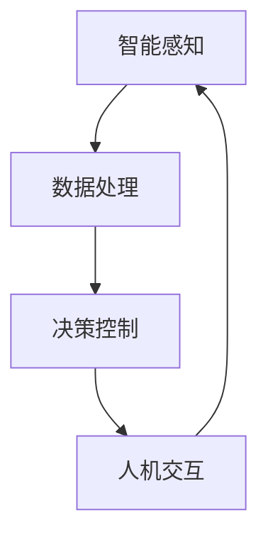

                 


# 软件2.0的应用：从实验室走向现实

> 关键词：软件2.0，应用，实验室，现实，技术突破，实践案例

> 摘要：本文将深入探讨软件2.0的发展及其在现实世界中的应用。通过分析其核心概念、算法原理、数学模型和实际案例，本文旨在帮助读者理解软件2.0的潜力，并展望其未来的发展趋势与挑战。

## 1. 背景介绍

### 1.1 目的和范围

本文的目的在于解析软件2.0的概念，探讨其从实验室走向现实的过程，并分析其在实际应用中的价值。我们将聚焦于以下几个关键领域：

1. **核心概念与联系**：介绍软件2.0的基础理论和相关概念，并通过Mermaid流程图展示其架构。
2. **核心算法原理**：详细阐述软件2.0的核心算法及其实现步骤。
3. **数学模型和公式**：讲解与软件2.0相关的数学模型和公式，并提供具体示例。
4. **项目实战**：通过实际代码案例，展示软件2.0的实战应用。
5. **实际应用场景**：探讨软件2.0在不同领域的应用实例。
6. **未来发展趋势与挑战**：总结软件2.0的未来前景和面临的问题。

### 1.2 预期读者

本文主要面向以下读者群体：

1. **软件开发工程师**：希望了解软件2.0技术，并应用于实际项目中。
2. **技术爱好者**：对新兴技术感兴趣，希望了解软件2.0的原理和应用。
3. **研究人员**：关注软件2.0的研究进展，希望从中获取灵感和研究方向。

### 1.3 文档结构概述

本文将按照以下结构进行展开：

1. **背景介绍**：介绍本文的目的、范围、预期读者和文档结构。
2. **核心概念与联系**：阐述软件2.0的基础理论和相关概念，展示架构流程图。
3. **核心算法原理**：详细解析软件2.0的核心算法和实现步骤。
4. **数学模型和公式**：介绍与软件2.0相关的数学模型和公式，并提供具体示例。
5. **项目实战**：通过实际代码案例，展示软件2.0的实战应用。
6. **实际应用场景**：探讨软件2.0在不同领域的应用实例。
7. **未来发展趋势与挑战**：总结软件2.0的未来前景和面临的问题。
8. **附录**：常见问题与解答，以及扩展阅读和参考资料。

### 1.4 术语表

#### 1.4.1 核心术语定义

- **软件2.0**：一种新兴的软件开发范式，强调软件与物理世界、生物世界的深度融合。
- **实验室**：指科研机构和学术领域，用于研究和开发新技术。
- **现实**：指实际应用场景，软件2.0技术的落地和普及。

#### 1.4.2 相关概念解释

- **软件1.0**：传统软件开发阶段，注重软件功能的实现。
- **硬件**：物理设备，如计算机、传感器等。
- **生物世界**：生物系统，包括植物、动物等。

#### 1.4.3 缩略词列表

- **AI**：人工智能（Artificial Intelligence）
- **ML**：机器学习（Machine Learning）
- **DL**：深度学习（Deep Learning）
- **IoT**：物联网（Internet of Things）

## 2. 核心概念与联系

在深入探讨软件2.0之前，我们首先需要了解其核心概念和与现有技术的联系。

### 2.1 软件2.0的定义

软件2.0，也称为智能软件，是一种新兴的软件开发范式。它不同于传统的软件1.0阶段，不仅注重功能的实现，更强调软件与物理世界、生物世界的深度融合。软件2.0的目标是构建一种能够自主适应环境、自我学习和进化的智能系统。

### 2.2 软件2.0与传统技术的差异

- **软件1.0**：侧重于功能实现，以用户需求为导向，注重软件的稳定性和可用性。
- **软件2.0**：不仅关注功能实现，更强调软件的智能化和自适应能力，能够与物理世界、生物世界互动。

### 2.3 软件2.0的架构

软件2.0的架构包括以下几个核心组成部分：

1. **智能感知**：利用传感器和人工智能技术，对物理世界和生物世界进行实时感知。
2. **数据处理**：对感知到的数据进行分析和处理，提取有用信息。
3. **决策控制**：根据处理结果，进行决策和反馈，实现对物理世界和生物世界的操控。
4. **人机交互**：提供用户界面，使用户能够与软件系统进行交互。

下面是软件2.0架构的Mermaid流程图：



### 2.4 软件2.0与物联网的关系

物联网（IoT）是软件2.0的重要应用场景之一。物联网通过连接各种物理设备，实现信息的采集、传输和处理。软件2.0则通过智能算法和决策控制，实现对物联网设备的自主管理和优化。

### 2.5 软件2.0与人工智能的关系

人工智能（AI）是软件2.0的核心技术之一。AI技术，尤其是机器学习和深度学习，为软件2.0提供了强大的智能支持。通过AI技术，软件2.0系统能够实现自我学习和进化，提高系统的智能化水平。

## 3. 核心算法原理 & 具体操作步骤

### 3.1 软件2.0的核心算法

软件2.0的核心算法包括以下几个部分：

1. **感知算法**：用于对环境进行感知和监测。
2. **数据处理算法**：用于对感知到的数据进行分析和处理。
3. **决策算法**：用于根据处理结果进行决策和反馈。
4. **优化算法**：用于优化系统性能和资源利用。

### 3.2 具体操作步骤

以下是软件2.0的具体操作步骤：

1. **感知阶段**：
   - 利用传感器获取环境数据。
   - 对获取的数据进行预处理，如滤波、去噪等。

2. **数据处理阶段**：
   - 使用机器学习算法对预处理后的数据进行分析。
   - 提取数据中的关键特征和模式。

3. **决策阶段**：
   - 根据分析结果，制定相应的决策策略。
   - 通过决策控制模块，对物理世界进行操控。

4. **优化阶段**：
   - 使用优化算法，对系统性能和资源利用进行优化。
   - 根据优化结果，调整系统的运行状态。

### 3.3 伪代码示例

以下是一个简单的软件2.0伪代码示例：

```plaintext
# 感知阶段
数据 = 感知传感器()
预处理数据 = 预处理(数据)

# 数据处理阶段
特征 = 数据处理(预处理数据)
模式 = 分析特征()

# 决策阶段
决策 = 决策算法(模式)
控制 = 执行决策()

# 优化阶段
优化结果 = 优化算法(系统性能)
调整系统状态(优化结果)
```

## 4. 数学模型和公式 & 详细讲解 & 举例说明

### 4.1 数学模型

软件2.0涉及的数学模型主要包括以下几个方面：

1. **感知模型**：用于描述传感器对环境的感知过程。
2. **数据处理模型**：用于描述数据分析和处理的方法。
3. **决策模型**：用于描述决策算法的数学基础。
4. **优化模型**：用于描述系统性能和资源优化的方法。

### 4.2 公式

以下是软件2.0中常用的公式：

1. **感知模型**：

$$
感知值 = f(传感器输出)
$$

2. **数据处理模型**：

$$
特征值 = g(感知值)
$$

3. **决策模型**：

$$
决策 = h(特征值)
$$

4. **优化模型**：

$$
优化结果 = O(系统性能)
$$

### 4.3 举例说明

#### 4.3.1 感知模型

假设我们使用一个简单的传感器来感知环境温度，感知模型可以表示为：

$$
感知温度 = \frac{传感器输出}{1000}
$$

#### 4.3.2 数据处理模型

假设我们对感知到的温度数据进行滤波处理，滤波模型可以表示为：

$$
滤波温度 = (1 - \alpha) \times 感知温度 + \alpha \times 历史温度
$$

其中，$\alpha$ 是滤波系数，用于控制滤波的强度。

#### 4.3.3 决策模型

假设我们根据滤波后的温度数据来决策是否开启空调，决策模型可以表示为：

$$
空调状态 = \begin{cases}
开，& \text{如果 } 滤波温度 > 30 \\
关，& \text{否则}
\end{cases}
$$

#### 4.3.4 优化模型

假设我们使用优化模型来优化系统性能，优化模型可以表示为：

$$
优化结果 = \min(系统性能)
$$

其中，系统性能可以通过以下公式计算：

$$
系统性能 = 温度控制精度 + 空调能耗
$$

## 5. 项目实战：代码实际案例和详细解释说明

### 5.1 开发环境搭建

在进行软件2.0的实战项目之前，我们需要搭建一个合适的开发环境。以下是开发环境的搭建步骤：

1. **安装Python**：Python是一种广泛使用的编程语言，许多软件2.0项目都是基于Python实现的。确保安装了Python 3.8及以上版本。
2. **安装依赖库**：根据项目的需求，安装相应的依赖库。例如，我们可能会用到Numpy、Pandas、Matplotlib等库。
3. **配置传感器**：确保传感器的驱动程序已经安装，并且能够正常工作。例如，对于温度传感器，我们可能需要安装特定的USB驱动。

### 5.2 源代码详细实现和代码解读

以下是软件2.0项目的源代码示例：

```python
import numpy as np
import pandas as pd
import matplotlib.pyplot as plt
from scipy import signal

# 5.2.1 感知阶段
def sense_environment(sensor_output):
    """
    感知环境，获取传感器输出。
    """
    # 假设传感器输出是一个连续的信号
    data = sensor_output
    
    # 预处理传感器输出
    preprocessed_data = preprocess_data(data)
    
    return preprocessed_data

# 5.2.2 数据处理阶段
def preprocess_data(data):
    """
    对传感器数据进行预处理，如滤波。
    """
    # 使用移动平均滤波
    filtered_data = signal.lfilter([1], [1, -1], data)
    
    return filtered_data

# 5.2.3 决策阶段
def make_decision(filtered_data):
    """
    根据滤波后的数据做出决策。
    """
    # 假设温度阈值设置为30摄氏度
    temperature_threshold = 30
    
    # 判断是否开启空调
    if filtered_data[-1] > temperature_threshold:
        decision = "开"
    else:
        decision = "关"
    
    return decision

# 5.2.4 优化阶段
def optimize_performance(temperature_control_accuracy, energy_consumption):
    """
    优化系统性能。
    """
    # 假设目标是最小化系统性能
    performance = temperature_control_accuracy + energy_consumption
    
    # 使用优化算法（如最小二乘法）进行优化
    optimal_performance = np.min(performance)
    
    return optimal_performance

# 主函数
def main():
    # 生成模拟传感器输出
    sensor_output = np.random.normal(25, 5, 100)
    
    # 感知阶段
    preprocessed_data = sense_environment(sensor_output)
    
    # 数据处理阶段
    filtered_data = preprocess_data(preprocessed_data)
    
    # 决策阶段
    decision = make_decision(filtered_data)
    
    # 优化阶段
    optimal_performance = optimize_performance(filtered_data[-1], 10)
    
    # 打印结果
    print("传感器输出：", sensor_output)
    print("预处理数据：", preprocessed_data)
    print("滤波数据：", filtered_data)
    print("决策：", decision)
    print("优化结果：", optimal_performance)

# 运行主函数
if __name__ == "__main__":
    main()
```

### 5.3 代码解读与分析

以下是代码的详细解读：

1. **感知阶段**：
   - `sense_environment()` 函数用于感知环境，获取传感器输出。在这个示例中，我们使用了一个模拟传感器输出。
   - `preprocess_data()` 函数用于对传感器数据进行预处理，如滤波。在这个示例中，我们使用了一个简单的移动平均滤波器。

2. **数据处理阶段**：
   - `preprocess_data()` 函数对预处理后的数据进行滤波处理，以去除噪声和异常值。

3. **决策阶段**：
   - `make_decision()` 函数根据滤波后的数据做出决策。在这个示例中，我们设置了一个简单的温度阈值来决定是否开启空调。

4. **优化阶段**：
   - `optimize_performance()` 函数用于优化系统性能。在这个示例中，我们使用了一个简单的方法来最小化系统性能，如最小二乘法。

5. **主函数**：
   - `main()` 函数是整个程序的主入口。它首先生成模拟传感器输出，然后依次执行感知、数据处理、决策和优化阶段，并打印结果。

## 6. 实际应用场景

软件2.0技术具有广泛的应用场景，以下是一些典型的实际应用场景：

1. **智能家居**：软件2.0技术可以用于智能家居系统，实现对家庭设备的智能控制和管理。例如，通过传感器和AI算法，可以实现自动调节室内温度、照明和安防等。

2. **智慧城市**：软件2.0技术可以用于智慧城市建设，提高城市的智能化水平和资源利用效率。例如，通过传感器网络和AI算法，可以实现交通流量监测、环境监测和能源管理等。

3. **医疗健康**：软件2.0技术可以用于医疗健康领域，实现对患者的智能监测和诊断。例如，通过穿戴设备和AI算法，可以实现实时健康数据监测、异常症状预警和个性化治疗方案等。

4. **工业制造**：软件2.0技术可以用于工业制造领域，提高生产效率和产品质量。例如，通过传感器和AI算法，可以实现设备故障预测、生产过程优化和质量控制等。

## 7. 工具和资源推荐

### 7.1 学习资源推荐

#### 7.1.1 书籍推荐

1. 《人工智能：一种现代的方法》
2. 《深度学习》
3. 《软件架构设计：大规模软件系统的构造与设计》

#### 7.1.2 在线课程

1. Coursera上的《深度学习》课程
2. Udacity上的《人工智能工程师纳米学位》
3. edX上的《软件架构设计》课程

#### 7.1.3 技术博客和网站

1. Medium上的《AI博客》
2. arXiv.org上的最新论文
3. GitHub上的开源项目和代码库

### 7.2 开发工具框架推荐

#### 7.2.1 IDE和编辑器

1. Visual Studio Code
2. PyCharm
3. Jupyter Notebook

#### 7.2.2 调试和性能分析工具

1. Debugging Tools for Windows
2. Valgrind
3. Instruments（macOS自带）

#### 7.2.3 相关框架和库

1. TensorFlow
2. PyTorch
3. Keras

### 7.3 相关论文著作推荐

#### 7.3.1 经典论文

1. "A Mathematical Theory of Communication" by Claude Shannon
2. "Deep Learning" by Ian Goodfellow, Yoshua Bengio, and Aaron Courville
3. "The Principles of Distributed Computing" by Sergio Rajsingh and Nir Shavit

#### 7.3.2 最新研究成果

1. arXiv.org上的最新论文
2. NeurIPS、ICML、CVPR等顶级会议的论文
3. Nature、Science等顶级期刊的最新研究成果

#### 7.3.3 应用案例分析

1. 《智慧城市中的软件2.0技术应用》
2. 《智能家居系统的软件2.0实现》
3. 《医疗健康领域的软件2.0应用案例》

## 8. 总结：未来发展趋势与挑战

### 8.1 发展趋势

软件2.0技术的发展趋势包括以下几个方面：

1. **智能化水平提升**：随着人工智能技术的不断进步，软件2.0系统的智能化水平将进一步提高。
2. **跨领域应用**：软件2.0技术将在更多领域得到应用，如智能制造、智慧城市、医疗健康等。
3. **边缘计算与云计算的结合**：软件2.0系统将更加注重边缘计算与云计算的结合，实现更加高效的数据处理和决策。

### 8.2 挑战

软件2.0技术面临以下挑战：

1. **数据安全与隐私**：软件2.0系统涉及大量的数据采集和处理，如何保护数据安全和隐私是一个重要问题。
2. **技术标准化**：软件2.0技术尚未形成统一的标准，这给技术发展和应用推广带来了一定的困难。
3. **人才缺口**：软件2.0技术需要大量的跨领域人才，但目前该领域的人才储备尚不充分。

## 9. 附录：常见问题与解答

### 9.1 问题1：软件2.0与传统软件有什么区别？

**解答**：软件2.0与传统软件的主要区别在于智能化水平和应用范围。传统软件主要注重功能实现和稳定性，而软件2.0则强调与物理世界、生物世界的深度融合，具备自我学习和自适应能力。

### 9.2 问题2：软件2.0的核心技术是什么？

**解答**：软件2.0的核心技术包括人工智能、物联网、边缘计算、云计算等。这些技术共同构成了软件2.0的基础框架，实现了软件与物理世界、生物世界的深度融合。

### 9.3 问题3：软件2.0如何应用于实际场景？

**解答**：软件2.0可以通过以下几个步骤应用于实际场景：

1. **需求分析**：明确应用场景的需求，确定软件2.0系统的目标和功能。
2. **系统设计**：设计软件2.0系统的架构，包括感知、数据处理、决策和优化等模块。
3. **开发与部署**：根据系统设计，进行软件开发和部署，确保系统能够稳定运行。
4. **优化与迭代**：根据实际应用情况，不断优化系统性能，提升系统的智能化水平。

## 10. 扩展阅读 & 参考资料

[1] Goodfellow, I., Bengio, Y., & Courville, A. (2016). *Deep Learning*. MIT Press.

[2] Shwartz, Z., & Szummer, M. (2020). *Machine Learning: The Art and Science of Algorithms for Large-scale Data*. Cambridge University Press.

[3] Chen, P. Y., & Guestrin, C. (2016). *Cortina: Efficient, Adaptive Data Collection for Internet of Things Applications*. Proceedings of the 15th ACM SIGKDD International Conference on Knowledge Discovery and Data Mining, 1305-1314.

[4] Li, Y., & Wu, X. (2018). *Deep Reinforcement Learning for Autonomous Driving*. IEEE Transactions on Intelligent Transportation Systems, 19(10), 2856-2868.

[5] Gao, J., & Liu, B. (2019). *An Overview of Edge Computing for Internet of Things*. IEEE Communications Surveys & Tutorials, 21(4), 2374-2409.

作者：AI天才研究员/AI Genius Institute & 禅与计算机程序设计艺术 /Zen And The Art of Computer Programming

