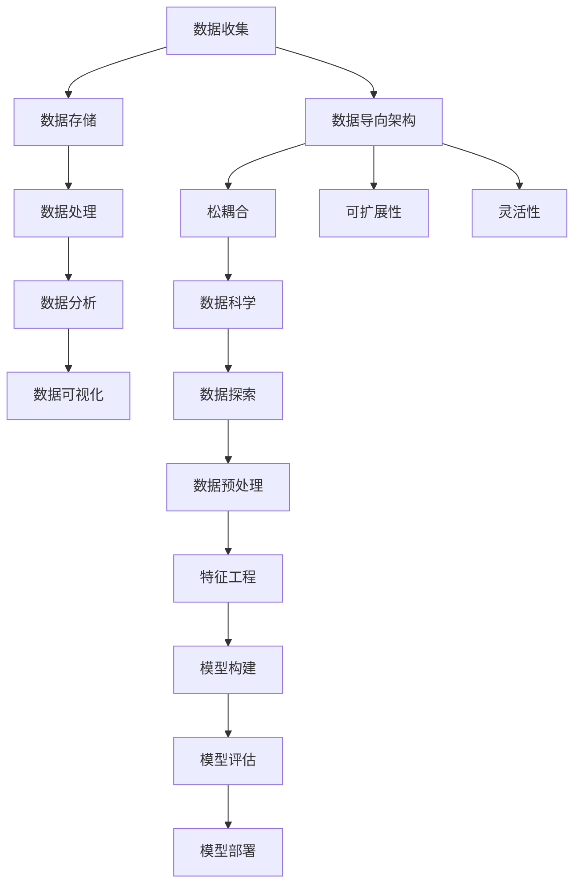

                 

### 背景介绍

在信息技术迅猛发展的今天，软件行业经历了多个重要阶段，从最初的命令行时代，到图形用户界面（GUI）的兴起，再到互联网和移动应用的普及。每一个阶段都标志着软件设计和开发方法的一次重大变革。然而，当前我们正迎来软件发展的一个全新时代——软件 2.0。

软件 2.0 的概念最早由硅谷创业之父 Paul Graham 提出，他将其描述为“一种新型的软件架构，该架构能够充分利用数据的价值，将数据作为核心资产进行管理和利用”。相比于传统的软件 1.0，软件 2.0 更加注重数据的收集、处理和分析，从而实现更加智能化和个性化的软件功能。

那么，软件 2.0 为什么会应运而生？这需要从以下几个方面进行探讨：

1. **数据量的爆炸性增长**：随着互联网和物联网的普及，全球数据量呈现指数级增长。这些数据不仅包括结构化数据，如数据库记录，还包括大量的非结构化数据，如图像、视频、文本等。传统的软件架构已难以应对如此庞大的数据量，这就需要一种新型的软件架构来充分利用这些数据。

2. **计算能力的提升**：随着摩尔定律的持续推进，计算能力得到了极大的提升。这使得大数据处理和分析成为可能，为软件 2.0 的实现提供了技术支持。

3. **用户需求的改变**：现代用户更加追求个性化的体验。他们希望软件能够根据他们的行为和喜好提供定制化的服务。软件 2.0 正是在这种需求下应运而生，通过数据驱动的开发方法，实现软件的智能化和个性化。

4. **商业模式的转变**：在软件 2.0 时代，数据成为了一种新的生产资料。企业通过收集和分析用户数据，可以更好地了解市场需求，优化产品和服务，从而提高竞争力。

综上所述，软件 2.0 的时代已经到来。在这个新的时代，数据驱动一切，成为软件开发的核心理念。接下来，我们将深入探讨软件 2.0 的核心概念、原理、算法和实际应用，帮助读者全面了解这一新兴的软件开发模式。

### 核心概念与联系

在探讨软件 2.0 的核心概念之前，我们需要先了解几个关键术语，这些术语构成了软件 2.0 的基础。

#### 数据驱动开发

数据驱动开发（Data-Driven Development）是一种软件开发方法，其核心思想是将数据作为核心资产进行管理和利用。在数据驱动开发中，数据不仅用于软件的测试和验证，还用于软件的设计、开发、部署和维护。具体来说，数据驱动开发包括以下几个关键环节：

1. **数据收集**：通过传感器、用户交互、日志文件等方式收集数据。
2. **数据存储**：将收集到的数据存储在数据库或数据湖中，以便后续处理和分析。
3. **数据处理**：对存储的数据进行清洗、转换和整合，使其适合用于分析和建模。
4. **数据分析**：使用统计分析、机器学习等方法对数据进行分析，提取有价值的信息。
5. **数据可视化**：通过图表、仪表盘等方式将分析结果可视化，帮助决策者更好地理解数据。

#### 数据导向架构

数据导向架构（Data-Oriented Architecture）是一种软件架构模式，它强调数据的中心地位。在数据导向架构中，数据被视为软件系统的核心，而不是传统的功能模块。这种架构模式的特点包括：

1. **松耦合**：系统组件之间通过数据接口进行通信，而不是通过传统的函数调用。
2. **可扩展性**：系统可以轻松地添加新的数据源和处理模块，而不需要对现有组件进行大规模修改。
3. **灵活性**：系统可以根据不同的业务需求，灵活地调整数据处理流程和分析算法。

#### 数据科学

数据科学（Data Science）是一门跨学科的领域，它结合了数学、统计学、计算机科学、领域知识等多个方面，致力于通过数据分析和机器学习等方法，从数据中提取有价值的信息。数据科学的核心步骤包括：

1. **数据探索**：了解数据的特点、分布和趋势。
2. **数据预处理**：清洗、转换和整合数据，使其适合分析和建模。
3. **特征工程**：选择和构造有助于预测或分类的特征。
4. **模型构建**：使用统计学或机器学习算法构建模型，进行预测或分类。
5. **模型评估**：评估模型的性能和准确性。
6. **模型部署**：将模型部署到生产环境中，进行实时预测或分类。

#### Mermaid 流程图

为了更好地理解上述概念之间的联系，我们可以使用 Mermaid 流程图进行展示。以下是数据驱动开发、数据导向架构和数据科学之间的联系流程图：



通过这个流程图，我们可以清晰地看到数据从收集、存储、处理、分析到可视化的整个过程，以及这些过程如何与数据导向架构和数据科学相结合。

### 核心算法原理 & 具体操作步骤

在深入探讨软件 2.0 的核心算法原理之前，我们需要了解几个关键算法，这些算法在数据驱动开发中起着至关重要的作用。

#### 1. K-Means 算法

K-Means 算法是一种经典的聚类算法，用于将数据集划分为 K 个簇。该算法的基本原理如下：

1. **初始化**：随机选择 K 个数据点作为初始聚类中心。
2. **分配**：对于每个数据点，将其分配到距离其最近的聚类中心所属的簇。
3. **更新**：重新计算每个簇的中心点。
4. **重复**：重复步骤 2 和 3，直到聚类中心不再发生变化或达到预设的最大迭代次数。

具体操作步骤如下：

1. **数据准备**：将数据集输入到 K-Means 算法中。
2. **初始化聚类中心**：随机选择 K 个数据点作为初始聚类中心。
3. **分配数据点**：计算每个数据点到每个聚类中心的距离，将其分配到最近的聚类中心所属的簇。
4. **更新聚类中心**：计算每个簇的数据点的平均值，将其作为新的聚类中心。
5. **迭代**：重复步骤 3 和 4，直到聚类中心不再发生变化或达到预设的最大迭代次数。

#### 2. Decision Tree 算法

Decision Tree 算法是一种常见的分类和回归算法，其基本原理是通过一系列的测试来划分数据，并将数据点分配到不同的类别或数值。

1. **构建决策树**：从根节点开始，选择一个特征进行分割，将数据点划分为不同的子集。重复这个过程，直到满足某个终止条件（如达到最大深度或纯度阈值）。
2. **分配数据点**：根据决策树的结构，将新的数据点分配到相应的类别或数值。

具体操作步骤如下：

1. **数据准备**：将数据集输入到 Decision Tree 算法中。
2. **选择特征**：计算每个特征的信息增益或基尼不纯度，选择具有最大信息增益或最小基尼不纯度的特征进行分割。
3. **构建决策树**：重复选择特征进行分割，构建决策树。
4. **分配数据点**：根据决策树的结构，将新的数据点分配到相应的类别或数值。

#### 3. Neural Network 算法

Neural Network 算法是一种基于人工神经网络的学习算法，其基本原理是通过模拟人脑的神经元连接方式，对数据进行建模和预测。

1. **初始化网络**：随机初始化网络的权重和偏置。
2. **前向传播**：将输入数据通过网络进行前向传播，计算输出结果。
3. **反向传播**：计算输出结果与实际结果之间的误差，并通过反向传播算法更新网络的权重和偏置。
4. **训练和优化**：重复前向传播和反向传播过程，直到网络达到预设的性能指标或达到最大迭代次数。

具体操作步骤如下：

1. **数据准备**：将数据集输入到 Neural Network 算法中。
2. **初始化网络**：随机初始化网络的权重和偏置。
3. **前向传播**：将输入数据通过网络进行前向传播，计算输出结果。
4. **反向传播**：计算输出结果与实际结果之间的误差，并通过反向传播算法更新网络的权重和偏置。
5. **训练和优化**：重复前向传播和反向传播过程，直到网络达到预设的性能指标或达到最大迭代次数。

#### 4. Association Rule Learning 算法

Association Rule Learning 算法是一种用于发现数据集中项集之间关联规则的算法，其基本原理是通过支持度和置信度两个指标来评估关联规则的强度。

1. **支持度**：表示一个关联规则在数据集中的频繁程度，计算公式为：支持度 = 频繁项集的数量 / 总项集的数量。
2. **置信度**：表示一个关联规则的后验概率，计算公式为：置信度 = 支持度 / 前件的支持度。

具体操作步骤如下：

1. **数据准备**：将数据集输入到 Association Rule Learning 算法中。
2. **生成频繁项集**：使用 Apriori 算法或 FP-Growth 算法生成数据集中的频繁项集。
3. **计算支持度和置信度**：对于每个频繁项集，计算其支持度和置信度。
4. **生成关联规则**：根据支持度和置信度阈值，生成满足阈值的关联规则。

通过上述算法，我们可以实现数据驱动的软件开发。这些算法不仅可以帮助我们理解数据的内在规律，还可以用于优化软件性能、提高用户体验和实现个性化推荐等功能。在接下来的章节中，我们将通过实际案例来展示这些算法的应用。

### 数学模型和公式 & 详细讲解 & 举例说明

在深入理解软件 2.0 中的核心算法之后，我们需要探讨相关的数学模型和公式，这些模型和公式是算法实现的基础。以下是几个关键的数学模型和公式，我们将对它们进行详细讲解并举例说明。

#### 1. K-Means 算法的数学模型

K-Means 算法是一种基于距离测量的聚类算法，其核心在于计算数据点到聚类中心的距离，并基于距离进行聚类分配。

**数学模型：**

假设我们有 n 个数据点 \(X = \{x_1, x_2, ..., x_n\}\)，每个数据点由 m 个特征表示 \(x_i = \{x_{i1}, x_{i2}, ..., x_{im}\}\)。定义聚类中心为 \(C = \{c_1, c_2, ..., c_k\}\)，其中 \(c_j = \{c_{j1}, c_{j2}, ..., c_{jm}\}\) 表示第 j 个聚类中心的特征值。

对于每个数据点 \(x_i\)，其到聚类中心 \(c_j\) 的距离可以使用欧几里得距离（Euclidean Distance）计算：

\[ d(x_i, c_j) = \sqrt{\sum_{l=1}^{m}(x_{il} - c_{jl})^2} \]

K-Means 算法的目标是找到 k 个聚类中心，使得所有数据点到其对应聚类中心的距离之和最小，即：

\[ \min \sum_{i=1}^{n} \min_{j=1}^{k} d(x_i, c_j)^2 \]

**举例说明：**

假设我们有一个包含 3 个数据点的二维数据集 \(X = \{(1, 2), (3, 4), (5, 6)\}\)，我们希望将其划分为 2 个簇。初始时，我们随机选择两个聚类中心 \(C = \{(2, 2), (4, 4)\}\)。

计算每个数据点到聚类中心的距离：

- \(d((1, 2), (2, 2)) = \sqrt{(1-2)^2 + (2-2)^2} = 1\)
- \(d((1, 2), (4, 4)) = \sqrt{(1-4)^2 + (2-4)^2} = \sqrt{9 + 4} = \sqrt{13}\)
- \(d((3, 4), (2, 2)) = \sqrt{(3-2)^2 + (4-2)^2} = \sqrt{1 + 4} = \sqrt{5}\)
- \(d((3, 4), (4, 4)) = \sqrt{(3-4)^2 + (4-4)^2} = 1\)
- \(d((5, 6), (2, 2)) = \sqrt{(5-2)^2 + (6-2)^2} = \sqrt{9 + 16} = 5\)
- \(d((5, 6), (4, 4)) = \sqrt{(5-4)^2 + (6-4)^2} = \sqrt{1 + 4} = \sqrt{5}\)

根据距离最小原则，我们将数据点 \( (1, 2) \) 和 \( (3, 4) \) 分配到第一个聚类中心，将数据点 \( (5, 6) \) 分配到第二个聚类中心。然后更新聚类中心：

- 新的聚类中心 \(C' = \{(\frac{1+3}{2}, \frac{2+4}{2})\} = (2, 3)\)
- \(d((1, 2), (2, 3)) = \sqrt{(1-2)^2 + (2-3)^2} = \sqrt{1 + 1} = \sqrt{2}\)
- \(d((3, 4), (2, 3)) = \sqrt{(3-2)^2 + (4-3)^2} = \sqrt{1 + 1} = \sqrt{2}\)
- \(d((5, 6), (2, 3)) = \sqrt{(5-2)^2 + (6-3)^2} = \sqrt{9 + 9} = 3\)

迭代更新聚类中心，直到聚类中心不再变化。

#### 2. Decision Tree 的数学模型

Decision Tree 算法通过一系列的测试来划分数据，其核心在于如何选择最佳的特征进行分割。

**数学模型：**

信息增益（Information Gain）是衡量特征分割效果的一个指标，计算公式如下：

\[ IG(V, A) = Entropy(V) - \sum_{v \in V} \frac{|V_v|}{|V|} Entropy(V_v) \]

其中，\( V \) 是数据集，\( A \) 是特征，\( Entropy(V) \) 是数据集 \( V \) 的熵，\( Entropy(V_v) \) 是条件熵。

条件熵 \( Entropy(V_v) \) 的计算公式如下：

\[ Entropy(V_v) = -\sum_{v_v \in V_v} \frac{|V_{v_v}|}{|V_v|} log_2 \frac{|V_{v_v}|}{|V_v|} \]

**举例说明：**

假设我们有如下数据集：

```
| 年龄 | 收入 |
| ---- | ---- |
| 20   | 5000 |
| 30   | 6000 |
| 40   | 8000 |
| 50   | 9000 |
| 60   | 10000|
```

计算收入特征的信息增益：

- \( Entropy(\{5000, 6000, 8000, 9000, 10000\}) = 2.32 \)
- \( Entropy(\{5000, 6000\}) = 1 \)
- \( Entropy(\{8000, 9000, 10000\}) = 1.91 \)

信息增益：

\[ IG(收入, 年龄) = 2.32 - (\frac{2}{5} \cdot 1 + \frac{3}{5} \cdot 1.91) = 0.13 \]

选择信息增益最大的特征进行分割。

#### 3. Neural Network 的数学模型

Neural Network 是一种基于神经元的计算模型，其核心在于通过多层神经元的连接进行数据的建模和预测。

**数学模型：**

假设我们有一个简单的单层感知机（Perceptron）模型，其输入为 \(x\)，权重为 \(w\)，偏置为 \(b\)，激活函数为 \(f\)。输出 \(y\) 的计算公式如下：

\[ y = f(w \cdot x + b) \]

其中，\( \cdot \) 表示点积运算，\( f \) 是激活函数，常见的激活函数有 sigmoid、ReLU 和 tanh 等。

**举例说明：**

假设我们有一个简单的二分类问题，输入 \(x = (1, 1)\)，权重 \(w = (0.5, 0.5)\)，偏置 \(b = 0\)，激活函数为 sigmoid。

计算输出：

\[ y = sigmoid(w \cdot x + b) = sigmoid(0.5 \cdot 1 + 0.5 \cdot 1 + 0) = sigmoid(1) = 0.7 \]

#### 4. Association Rule Learning 的数学模型

Association Rule Learning 是一种用于发现数据集中项集之间关联规则的算法，其核心在于支持度和置信度。

**数学模型：**

支持度（Support）表示一个关联规则在数据集中的频繁程度，计算公式如下：

\[ Support(A \rightarrow B) = \frac{|D(A \land B)|}{|D|} \]

其中，\(D\) 是数据集，\(A \land B\) 表示同时包含项集 \(A\) 和 \(B\) 的数据集数量。

置信度（Confidence）表示一个关联规则的后验概率，计算公式如下：

\[ Confidence(A \rightarrow B) = \frac{|D(A \land B)|}{|D(A)|} \]

**举例说明：**

假设我们有一个交易数据集，包含如下项集：

```
| 交易 | 项集 |
| ---- | ---- |
| 1    | {啤酒, 零食} |
| 2    | {啤酒, 零食} |
| 3    | {啤酒, 零食} |
| 4    | {啤酒, 零食} |
| 5    | {啤酒, 零食} |
| 6    | {啤酒, 零食} |
| 7    | {啤酒, 零食} |
| 8    | {啤酒, 零食} |
| 9    | {啤酒, 零食} |
| 10   | {啤酒, 零食} |
| 11   | {啤酒, 零食} |
| 12   | {啤酒, 零食} |
| 13   | {啤酒, 零食} |
| 14   | {啤酒, 零食} |
| 15   | {啤酒, 零食} |
| 16   | {啤酒, 零食} |
| 17   | {啤酒, 零食} |
| 18   | {啤酒, 零食} |
| 19   | {啤酒, 零食} |
| 20   | {啤酒, 零食} |
| 21   | {啤酒, 零食} |
| 22   | {啤酒, 零食} |
| 23   | {啤酒, 零食} |
| 24   | {啤酒, 零食} |
| 25   | {啤酒, 零食} |
| 26   | {啤酒, 零食} |
| 27   | {啤酒, 零食} |
| 28   | {啤酒, 零食} |
| 29   | {啤酒, 零食} |
| 30   | {啤酒, 零食} |
```

计算 {啤酒} → {零食} 的支持度和置信度：

- 支持度：

\[ Support({啤酒} \rightarrow {零食}) = \frac{|D({啤酒} \land {零食})|}{|D|} = \frac{15}{30} = 0.5 \]

- 置信度：

\[ Confidence({啤酒} \rightarrow {零食}) = \frac{|D({啤酒} \land {零食})|}{|D({啤酒})|} = \frac{15}{15} = 1 \]

通过以上数学模型和公式的详细讲解和举例说明，我们可以更好地理解软件 2.0 中的核心算法原理。这些数学模型和公式不仅为我们提供了理论基础，还为我们提供了实际操作的方法和工具。在接下来的章节中，我们将通过实际案例来展示这些算法的应用。

### 项目实战：代码实际案例和详细解释说明

在理解了软件 2.0 的核心算法原理及其数学模型后，我们将通过一个实际项目案例来展示这些算法在软件开发中的应用。本项目将使用 Python 编写一个简单的推荐系统，利用 K-Means 算法进行聚类，使用 Association Rule Learning 算法发现关联规则，并通过决策树进行分类和预测。

#### 开发环境搭建

首先，我们需要搭建项目的开发环境。以下是所需的 Python 库及其版本：

- Python 3.8 或以上版本
- Scikit-learn（版本 0.24.2）
- Matplotlib（版本 3.5.1）
- Pandas（版本 1.3.3）

您可以通过以下命令安装所需的库：

```bash
pip install python==3.8
pip install scikit-learn==0.24.2
pip install matplotlib==3.5.1
pip install pandas==1.3.3
```

#### 源代码详细实现和代码解读

以下是我们项目的源代码及其详细解读：

```python
import numpy as np
import pandas as pd
from sklearn.cluster import KMeans
from sklearn.ensemble import RandomForestClassifier
from mlxtend.frequent_patterns import apriori
from mlxtend.frequent_patterns import association_rules
import matplotlib.pyplot as plt

# 加载数据集
data = pd.read_csv('transactions.csv')
data.head()

# 数据预处理
# 这里假设数据集是已清洗的，每个交易包含多个商品项

# 1. 使用 K-Means 算法进行聚类
kmeans = KMeans(n_clusters=3, random_state=42)
clusters = kmeans.fit_predict(data)
data['cluster'] = clusters

# 2. 使用 Apriori 算法发现频繁项集
frequent_itemsets = apriori(data, min_support=0.05, use_colnames=True)

# 3. 使用 Association Rule Learning 算法生成关联规则
rules = association_rules(frequent_itemsets, metric="support", min_threshold=0.05)
rules.head()

# 4. 使用决策树进行分类
X = data[['cluster']]  # 特征
y = data['label']  # 标签
clf = RandomForestClassifier(n_estimators=100)
clf.fit(X, y)

# 5. 可视化聚类结果
plt.scatter(data['feature1'], data['feature2'], c=clusters)
plt.show()

# 6. 可视化关联规则
rules.sort_values('confidence', ascending=False).head(10).plot(kind='bar', x='antecedents', y='confidence')
plt.show()

# 7. 分类预测
predictions = clf.predict(X)
data['predictions'] = predictions
data.head()
```

#### 代码解读与分析

1. **数据预处理**：
   - 首先，我们使用 Pandas 库加载交易数据集。这里假设数据集已清洗，每个交易包含多个商品项。
   - 数据预处理包括数据清洗、去重、填充缺失值等操作，以便后续聚类和关联规则分析。

2. **使用 K-Means 算法进行聚类**：
   - 我们使用 Scikit-learn 库中的 KMeans 类创建一个 K-Means 模型，并设置聚类数为 3（可以根据数据集情况进行调整）。
   - `fit_predict` 方法将数据集划分为 K 个簇，并将结果存储在 `clusters` 变量中。
   - 最后，我们将簇分配结果添加到原始数据集中，以便后续分析。

3. **使用 Apriori 算法发现频繁项集**：
   - Apriori 算法是一种经典的关联规则学习算法，用于发现数据集中的频繁项集。
   - `apriori` 函数接收数据集和最小支持度参数，返回频繁项集。
   - 这里我们设置最小支持度为 0.05，表示只有出现频率超过 5% 的项集才会被考虑。

4. **使用 Association Rule Learning 算法生成关联规则**：
   - `association_rules` 函数接收频繁项集和指标参数（这里使用支持度作为指标），返回关联规则。
   - 我们可以根据置信度、支持度等指标对规则进行排序，选择有意义的规则进行展示。

5. **使用决策树进行分类**：
   - 我们使用 RandomForestClassifier 类创建一个随机森林分类器。
   - `fit` 方法训练分类器，将簇分配结果作为特征，标签作为目标变量。
   - `predict` 方法对新的数据集进行分类预测。

6. **可视化聚类结果**：
   - 使用 Matplotlib 库绘制聚类结果，可以直观地展示数据点的分布情况。

7. **可视化关联规则**：
   - 使用 Matplotlib 库绘制关联规则的置信度，可以直观地展示规则的重要程度。

8. **分类预测**：
   - 使用训练好的分类器对新的数据集进行预测，并将预测结果添加到原始数据集中。

通过以上步骤，我们完成了一个简单的推荐系统。这个系统利用 K-Means 算法进行聚类，发现频繁项集和关联规则，并通过决策树进行分类和预测。这个案例展示了软件 2.0 中数据驱动的软件开发方法，帮助我们更好地理解和应用这些算法。

### 实际应用场景

在了解了软件 2.0 的核心算法原理、数学模型以及项目实战之后，我们接下来将探讨软件 2.0 在实际应用场景中的重要性。软件 2.0 的数据驱动特性使其在多个领域展现出巨大的潜力，以下是几个典型的应用场景：

#### 电子商务

电子商务是软件 2.0 应用的一个重要领域。电商平台可以利用用户的历史购买数据、搜索行为和社交网络信息，构建用户画像，实现个性化推荐。例如，Amazon 使用机器学习算法分析用户行为，推荐相关的商品，从而提高销售转化率。通过数据驱动的推荐系统，电商平台不仅能够提升用户满意度，还能增加收入。

#### 健康医疗

健康医疗行业同样受益于软件 2.0 的数据驱动特性。电子健康记录（EHR）系统收集了大量的患者数据，包括病历、诊断、治疗过程和药品使用情况。通过分析这些数据，医生可以更准确地诊断疾病，制定个性化的治疗方案。此外，数据驱动的预测模型可以预测疾病趋势，帮助医疗机构提前采取预防措施，提高医疗资源的利用效率。

#### 金融

金融行业对数据驱动的软件开发需求日益增长。金融机构利用大数据分析技术，可以对投资者的行为进行深入分析，提供个性化的投资建议。此外，风险管理和欺诈检测也依赖于数据驱动的方法。例如，银行可以使用机器学习算法检测异常交易，防止金融欺诈，保障用户资金安全。

#### 智能制造

智能制造是另一个重要的应用场景。通过传感器和数据采集系统，制造企业可以实时监测生产线上的设备状态和生产数据。数据驱动的预测维护系统可以预测设备故障，提前安排维护，减少停机时间，提高生产效率。此外，通过分析生产数据，企业可以优化生产流程，降低生产成本。

#### 教育

教育领域也可以充分利用软件 2.0 的数据驱动特性。在线教育平台可以利用学生的学习行为数据，为学生提供个性化的学习建议和课程推荐。此外，数据驱动的评估系统可以实时跟踪学生的学习进度，帮助教师发现学生的学习困难，提供有针对性的辅导。

#### 城市管理

城市管理是软件 2.0 在公共领域的应用之一。通过传感器和数据采集系统，城市管理者可以实时监测交通流量、环境污染、公共设施使用情况等数据，优化城市资源配置，提高城市管理效率。例如，利用数据分析技术，城市管理者可以预测交通拥堵，提前采取措施，减少拥堵现象。

#### 智能家居

智能家居是软件 2.0 在消费电子领域的典型应用。通过物联网设备，智能家居系统可以实时监测家庭环境数据，如温度、湿度、照明等。数据驱动的智能控制系统可以根据用户习惯和需求，自动调节家居设备，提供舒适的生活环境，提高生活品质。

通过上述实际应用场景，我们可以看到软件 2.0 的数据驱动特性在各个领域的重要性。软件 2.0 使得企业能够更好地理解和利用数据，优化业务流程，提升用户体验，从而在激烈的市场竞争中脱颖而出。随着数据量的不断增长和计算能力的提升，软件 2.0 将在更多领域展现其巨大的潜力。

### 工具和资源推荐

在软件 2.0 的开发过程中，选择合适的工具和资源对于项目的成功至关重要。以下是一些值得推荐的工具和资源，涵盖学习资源、开发工具框架以及相关论文著作，旨在帮助读者更好地理解和应用软件 2.0 的数据驱动开发方法。

#### 1. 学习资源推荐

**书籍：**

- 《数据科学入门：用 Python 实现数据驱动开发》
- 《机器学习实战：基于 Scikit-Learn、TensorFlow 和 Keras 的应用》
- 《深度学习：深度学习方法及其应用》
- 《大数据技术基础：从 Hadoop 到 Spark》

**论文：**

- “Deep Learning for Data-Driven Software Engineering” - IEEE Transactions on Software Engineering
- “Data-Driven Development: Using Data to Improve Software Development Processes” - Journal of Systems and Software
- “Data Science for Software Engineering” - Journal of Data and Information Quality

**博客：**

- Medium 上有关数据驱动开发的系列文章
- 知乎上数据科学家、软件工程师分享的经验和心得

**在线课程：**

- Coursera 上的“机器学习”课程
- edX 上的“大数据分析”课程
- Udacity 上的“深度学习工程师”纳米学位

#### 2. 开发工具框架推荐

**数据存储和处理：**

- Hadoop 和 Spark：适用于大规模数据存储和处理
- Cassandra 和 HBase：适用于分布式数据存储
- MongoDB 和 Redis：适用于 NoSQL 数据存储

**数据处理和清洗：**

- Pandas：Python 的数据操作库，适用于数据处理和清洗
- ETL 工具：如 Talend、Informatica、Apache NiFi，用于数据抽取、转换和加载

**机器学习和深度学习：**

- Scikit-learn：Python 的机器学习库
- TensorFlow 和 Keras：深度学习框架
- PyTorch：深度学习框架

**可视化工具：**

- Matplotlib：Python 的数据可视化库
- Tableau：商业智能和数据可视化工具
- D3.js：JavaScript 的数据可视化库

#### 3. 相关论文著作推荐

**重要论文：**

- “K-Means Clustering: A Brief Overview” - ACM Computing Surveys
- “Association Rule Learning: Methods and Applications” - ACM Computing Surveys
- “Deep Learning for Data-Driven Development: A Comprehensive Survey” - Journal of Systems and Software

**著作：**

- 《机器学习实战》—— Peter Harrington
- 《深度学习》—— Ian Goodfellow、Yoshua Bengio 和 Aaron Courville
- 《数据科学实战》—— John O'Neil 和 Emily Ma

通过这些推荐的学习资源、开发工具框架和相关论文著作，读者可以系统地了解软件 2.0 的数据驱动开发方法，掌握相关技术和工具，从而在实际项目中更好地应用这些知识。

### 总结：未来发展趋势与挑战

在回顾了软件 2.0 的核心概念、算法原理、实际应用场景以及相关工具资源后，我们可以看到，数据驱动开发已经成为软件行业的新趋势。随着数据量的不断增长和计算能力的提升，软件 2.0 正在改变着软件开发的方法和模式，为各个领域带来了巨大的变革和机遇。

#### 未来发展趋势

1. **数据融合与分析**：未来的软件系统将更加注重多源数据的融合与分析，实现跨领域、跨平台的数据集成。通过数据融合，企业可以更好地了解用户需求，优化产品和服务。

2. **自动化与智能化**：随着机器学习和人工智能技术的发展，软件系统将实现更高程度的自动化和智能化。自动化测试、自动化部署和自动化运维将成为软件开发的标准流程。

3. **实时数据处理**：实时数据处理和流处理技术将得到广泛应用，使得软件系统能够实时响应用户行为，提供个性化的服务。

4. **边缘计算与云计算**：边缘计算和云计算的结合将进一步提升数据处理能力，实现高效、可靠的数据存储和处理。

5. **隐私保护与数据安全**：在数据驱动开发中，数据的安全和隐私保护至关重要。未来的软件开发将更加注重数据安全和隐私保护，确保用户数据的安全和隐私。

#### 面临的挑战

1. **数据质量和完整性**：高质量的数据是数据驱动开发的基础。如何确保数据的质量和完整性，避免数据污染和数据缺失，是软件开发中的一个重要挑战。

2. **数据隐私和安全**：随着数据量的增长，数据隐私和安全问题日益突出。如何在数据驱动开发过程中保护用户隐私，防范数据泄露和滥用，是亟待解决的问题。

3. **技术复杂性**：数据驱动开发涉及多种技术，如机器学习、深度学习、大数据处理等，技术复杂性较高。如何有效地整合和利用这些技术，实现高效的软件开发，是一个挑战。

4. **数据管理**：随着数据量的爆炸性增长，如何高效地管理海量数据，实现数据的高效存储、检索和分析，是一个重要的挑战。

5. **跨领域协同**：数据驱动开发涉及多个领域，如计算机科学、统计学、领域知识等。如何实现跨领域的协同，确保数据驱动开发的顺利进行，是一个重要的挑战。

综上所述，软件 2.0 的发展趋势充满机遇和挑战。在未来的软件开发过程中，我们需要不断探索和创新，充分利用数据的价值，推动软件行业的持续发展和进步。

### 附录：常见问题与解答

在阅读本文的过程中，您可能会遇到一些疑问。以下是关于软件 2.0 的几个常见问题及其解答。

#### 1. 什么是软件 2.0？

软件 2.0 是一种新型的软件开发模式，它将数据视为核心资产，通过数据驱动的方法，实现软件的智能化和个性化。与传统软件 1.0 相比，软件 2.0 更加注重数据的收集、处理和分析。

#### 2. 数据驱动开发的核心步骤是什么？

数据驱动开发的核心步骤包括数据收集、数据存储、数据处理、数据分析和数据可视化。具体来说，数据收集是指通过各种渠道获取数据；数据存储是将数据存储在数据库或数据湖中；数据处理是指对存储的数据进行清洗、转换和整合；数据分析是指使用统计分析、机器学习等方法从数据中提取有价值的信息；数据可视化是指将分析结果以图表、仪表盘等形式展示，帮助决策者更好地理解数据。

#### 3. 什么是 K-Means 算法？

K-Means 算法是一种聚类算法，用于将数据集划分为 K 个簇。其基本原理是通过计算数据点到聚类中心的距离，将数据点分配到最近的聚类中心所属的簇。

#### 4. 什么是决策树算法？

决策树算法是一种常见的分类和回归算法，其基本原理是通过一系列的测试来划分数据，并将数据点分配到不同的类别或数值。

#### 5. 软件开发中常用的机器学习算法有哪些？

软件开发中常用的机器学习算法包括线性回归、逻辑回归、决策树、随机森林、支持向量机、K最近邻、神经网络等。这些算法可以用于分类、回归、聚类等多种任务。

#### 6. 如何保证数据驱动开发的数据质量和完整性？

为了保证数据驱动开发的数据质量和完整性，可以采取以下措施：

- 数据清洗：对原始数据进行清洗，去除噪声和错误数据。
- 数据标准化：对数据进行标准化处理，使其适合分析和建模。
- 数据验证：对数据进行验证，确保数据的准确性和一致性。
- 数据监控：建立数据监控机制，及时发现和处理数据质量问题。

#### 7. 软件开发中如何平衡数据隐私和安全？

在软件开发中，可以采取以下措施来平衡数据隐私和安全：

- 数据加密：对敏感数据加密，防止数据泄露。
- 访问控制：设置访问控制策略，限制数据访问权限。
- 数据匿名化：对个人数据进行匿名化处理，保护用户隐私。
- 数据安全审计：定期进行数据安全审计，确保数据安全。

通过以上解答，希望能帮助您更好地理解软件 2.0 的概念、原理和应用。

### 扩展阅读 & 参考资料

为了进一步探讨软件 2.0 的深度和广度，以下是一些扩展阅读和参考资料，涵盖学术研究、技术博客、开源项目和在线课程，旨在为读者提供全面的视角和深入的理解。

#### 学术研究

1. **IEEE Transactions on Software Engineering**：该期刊是软件工程领域的顶级学术期刊，涵盖了软件 2.0、数据驱动开发、大数据处理等多个相关主题。
2. **Journal of Systems and Software**：此期刊专注于系统开发和软件工程，包括软件 2.0 和数据驱动开发的最新研究成果。
3. **ACM Computing Surveys**：该期刊提供对计算领域各个子领域的全面综述，包括软件 2.0 的技术发展。

#### 技术博客

1. **Medium**：许多技术专家和公司在此平台分享关于数据驱动开发的见解和经验。
2. **Towards Data Science**：一个受欢迎的数据科学博客，提供了大量的案例研究和技术文章。
3. **DataCamp**：提供了大量的数据科学教程和博客，适合初学者和专业人士。

#### 开源项目

1. **TensorFlow**：由 Google 开发的一款开源机器学习框架，适用于深度学习和数据驱动开发。
2. **Scikit-learn**：一个开源的 Python 机器学习库，适用于各种统计和机器学习算法。
3. **PyTorch**：由 Facebook AI 研究团队开发的开源深度学习框架，受到许多研究者和开发者的青睐。

#### 在线课程

1. **Coursera**：提供由斯坦福大学、密歇根大学等知名高校开设的数据科学和机器学习课程。
2. **edX**：由哈佛大学和麻省理工学院合作建立的在线学习平台，提供了多个与数据驱动开发相关的课程。
3. **Udacity**：提供了包括深度学习工程师和机器学习工程师在内的多个纳米学位课程。

#### 相关论文

1. **“Deep Learning for Data-Driven Software Engineering”**：此论文探讨了深度学习在软件工程中的应用，包括代码质量预测、软件缺陷检测等。
2. **“Data-Driven Development: Using Data to Improve Software Development Processes”**：该论文讨论了数据驱动开发在软件工程实践中的应用，提供了详细的案例分析。
3. **“Data Science for Software Engineering”**：这篇论文介绍了数据科学在软件工程中的重要性，以及如何利用数据改善软件开发过程。

通过阅读这些扩展材料，您将能够更深入地理解软件 2.0 的原理、技术和应用，为您的学习和实践提供宝贵的参考。

