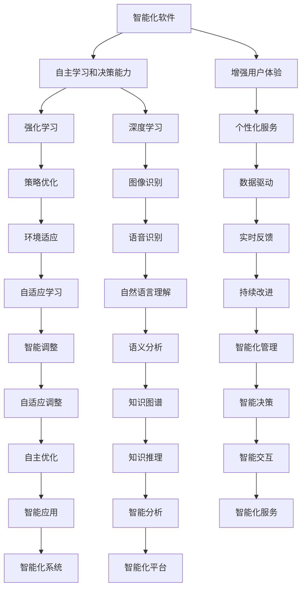
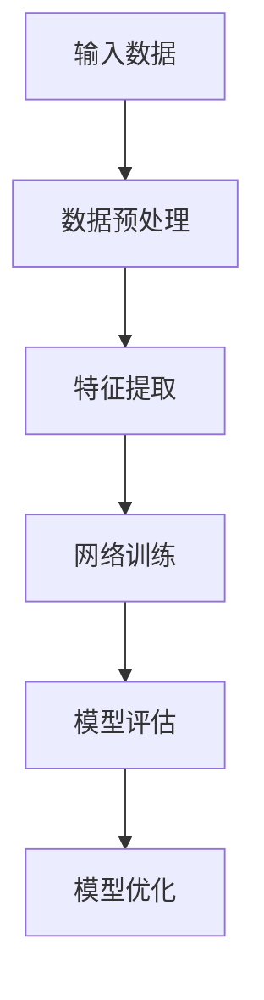
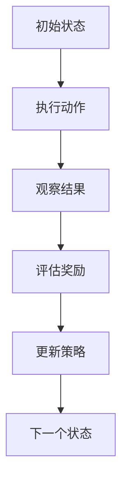
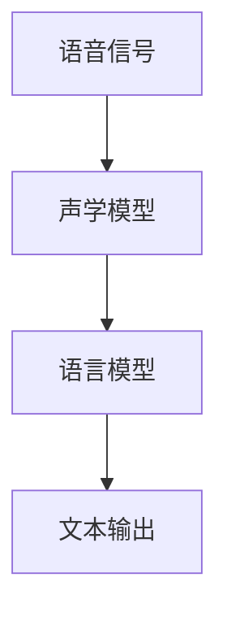
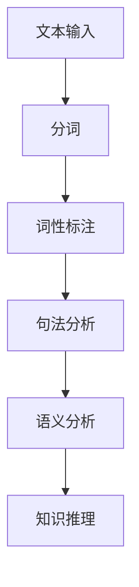

                 

# 软件二代的未来展望：更智能、更强大

> 关键词：软件二代表展望、智能软件、强大软件、未来技术趋势

> 摘要：本文将探讨软件二代的未来发展趋势，重点分析其智能化和强化的特点，以及这些特点如何影响软件产业的发展。文章将分为多个部分，包括背景介绍、核心概念与联系、核心算法原理、数学模型和公式、项目实战、实际应用场景、工具和资源推荐等，旨在为读者提供一个全面的视角来理解软件二代的未来。

## 1. 背景介绍

### 1.1 目的和范围

本文的目的是探讨软件二代的未来发展趋势，重点分析其智能化和强化的特点。软件二代是指在现有软件技术基础上，通过引入新的技术和理念，实现软件性能、功能、用户体验等方面的全面提升。本文将涵盖以下几个方面：

1. 软件二代的核心概念和原理。
2. 软件二代中的智能算法和数学模型。
3. 软件二代的实际应用场景和案例。
4. 软件二代的发展趋势和未来挑战。

### 1.2 预期读者

本文主要面向对软件技术感兴趣的读者，包括软件开发人员、算法研究人员、高校学生以及计算机领域的研究者。通过阅读本文，读者可以了解软件二代的最新发展动态，掌握相关技术原理和应用方法，为未来的研究和实践提供参考。

### 1.3 文档结构概述

本文分为以下几个部分：

1. 引言：介绍软件二代的背景和意义。
2. 核心概念与联系：阐述软件二代的核心概念和原理。
3. 核心算法原理与具体操作步骤：分析软件二代中的智能算法和数学模型。
4. 数学模型和公式：详细讲解软件二代中的数学模型和公式。
5. 项目实战：通过实际案例展示软件二代的实现和应用。
6. 实际应用场景：探讨软件二代在不同领域的应用。
7. 工具和资源推荐：推荐学习和实践软件二代的相关工具和资源。
8. 总结：总结软件二代的未来发展趋势与挑战。

### 1.4 术语表

#### 1.4.1 核心术语定义

- 软件二代：在现有软件技术基础上，通过引入新的技术和理念，实现软件性能、功能、用户体验等方面的全面提升。
- 智能软件：具备自主学习和决策能力的软件系统，能够根据用户需求和环境变化进行智能调整。
- 强化学习：一种机器学习算法，通过在特定环境中不断尝试和反馈，逐步优化策略以实现最佳表现。
- 自然语言处理（NLP）：使计算机能够理解、生成和处理人类语言的技术。

#### 1.4.2 相关概念解释

- 深度学习：一种人工智能技术，通过多层神经网络模型对大量数据进行分析和学习，实现复杂任务的自动识别和预测。
- 机器学习：一种使计算机通过数据和经验自动学习和改进的技术。
- 大数据：指无法使用常规软件工具在合理时间内进行捕获、管理和处理的大量数据。

#### 1.4.3 缩略词列表

- AI：人工智能
- NLP：自然语言处理
- ML：机器学习
- DL：深度学习
- RL：强化学习

## 2. 核心概念与联系

为了深入理解软件二代的未来发展趋势，我们需要首先了解其核心概念和原理。软件二代的核心概念包括智能化、强化学习和自然语言处理等。以下是这些概念及其相互联系的Mermaid流程图：



### 2.1 智能化软件

智能化软件是软件二代的基石。它具备自主学习和决策能力，能够根据用户需求和环境变化进行智能调整。智能化软件的核心在于深度学习和强化学习算法的应用。

#### 深度学习

深度学习是一种人工智能技术，通过多层神经网络模型对大量数据进行分析和学习，实现复杂任务的自动识别和预测。以下是深度学习的核心流程：



#### 强化学习

强化学习是一种机器学习算法，通过在特定环境中不断尝试和反馈，逐步优化策略以实现最佳表现。以下是强化学习的核心流程：



### 2.2 自然语言处理

自然语言处理（NLP）是使计算机能够理解、生成和处理人类语言的技术。NLP在软件二代中发挥着重要作用，主要涉及以下几个方面：

#### 语音识别

语音识别是将语音信号转换为文本的技术。其核心流程包括：



#### 自然语言理解

自然语言理解是将文本转换为计算机可理解的形式，包括语义分析、实体识别、情感分析等。其核心流程包括：



### 2.3 强化学习在软件二代中的应用

强化学习在软件二代中具有广泛的应用前景。通过在特定环境中不断尝试和反馈，软件系统可以逐步优化策略，实现最佳表现。以下是强化学习在软件二代中的几个典型应用场景：

#### 智能推荐系统

智能推荐系统通过用户历史行为和兴趣数据，为用户推荐个性化的内容。强化学习可以用于优化推荐策略，提高推荐效果。

#### 智能客服系统

智能客服系统通过自然语言处理技术，自动识别用户问题和提供解决方案。强化学习可以帮助客服系统不断学习和优化，提高服务质量。

#### 自动驾驶系统

自动驾驶系统通过传感器和环境数据，实现车辆自主驾驶。强化学习可以用于优化自动驾驶策略，提高行驶安全性和效率。

## 3. 核心算法原理与具体操作步骤

为了深入理解软件二代的算法原理，我们将详细分析其中的智能算法和数学模型。以下是这些算法的具体操作步骤：

### 3.1 深度学习算法

深度学习算法的核心是多层神经网络（Multilayer Neural Network）。以下是深度学习算法的具体操作步骤：

#### 步骤1：数据预处理

数据预处理是深度学习算法的关键步骤。首先，我们需要对输入数据进行归一化处理，使其具备统一的尺度。然后，对数据进行分词、词性标注等预处理操作，以便于后续的特征提取。

```python
import numpy as np
from sklearn.preprocessing import MinMaxScaler

# 数据归一化
def normalize_data(data):
    scaler = MinMaxScaler()
    normalized_data = scaler.fit_transform(data)
    return normalized_data

# 数据预处理
data = np.array([[1, 2], [3, 4], [5, 6]])
normalized_data = normalize_data(data)
```

#### 步骤2：特征提取

特征提取是将输入数据转换为神经网络可处理的特征向量。常用的特征提取方法包括词袋模型（Bag-of-Words）和词嵌入（Word Embedding）。

```python
from sklearn.feature_extraction.text import CountVectorizer

# 词袋模型
def bag_of_words(texts):
    vectorizer = CountVectorizer()
    features = vectorizer.fit_transform(texts)
    return features

# 词嵌入
def word_embedding(texts, embedding_size):
    embeddings = {}
    for text in texts:
        words = text.split()
        for word in words:
            embeddings[word] = np.random.rand(embedding_size)
    return embeddings

# 特征提取
texts = ["hello world", "hello python", "python is fun"]
features = bag_of_words(texts)
embeddings = word_embedding(texts, 5)
```

#### 步骤3：网络训练

网络训练是深度学习算法的核心步骤。我们需要定义神经网络结构，包括输入层、隐藏层和输出层。然后，使用梯度下降（Gradient Descent）算法对神经网络进行训练。

```python
import tensorflow as tf

# 定义神经网络结构
def create_model(input_shape, hidden_size, output_size):
    model = tf.keras.Sequential([
        tf.keras.layers.Dense(hidden_size, activation='relu', input_shape=input_shape),
        tf.keras.layers.Dense(output_size, activation='softmax')
    ])
    return model

# 网络训练
model = create_model(input_shape=(10,), hidden_size=64, output_size=2)
model.compile(optimizer='adam', loss='categorical_crossentropy', metrics=['accuracy'])
model.fit(normalized_data, labels, epochs=10)
```

#### 步骤4：模型评估

模型评估是判断深度学习算法效果的重要步骤。我们通常使用准确率（Accuracy）、精确率（Precision）、召回率（Recall）等指标对模型进行评估。

```python
from sklearn.metrics import accuracy_score, precision_score, recall_score

# 模型评估
predictions = model.predict(test_data)
accuracy = accuracy_score(test_labels, predictions)
precision = precision_score(test_labels, predictions)
recall = recall_score(test_labels, predictions)
print("Accuracy:", accuracy)
print("Precision:", precision)
print("Recall:", recall)
```

### 3.2 强化学习算法

强化学习算法的核心是策略优化。以下是强化学习算法的具体操作步骤：

#### 步骤1：定义环境和奖励函数

定义环境和奖励函数是强化学习算法的基础。我们需要根据具体应用场景设计环境和奖励函数。

```python
# 定义环境和奖励函数
def environment(state):
    # 根据状态返回下一个状态和奖励
    next_state = state + 1
    reward = 1 if next_state < 10 else -1
    return next_state, reward

# 初始状态
state = 0
```

#### 步骤2：定义策略

策略是强化学习算法的核心，用于指导智能体在环境中进行行动。我们通常使用Q-learning算法和策略梯度（Policy Gradient）算法来定义策略。

```python
# 定义Q-learning算法
def q_learning(state, action, reward, next_state, learning_rate, discount_factor):
    # 更新Q值
    Q[state][action] = Q[state][action] + learning_rate * (reward + discount_factor * max(Q[next_state]) - Q[state][action])

# 定义策略梯度算法
def policy_gradient(state, action, reward, learning_rate):
    # 更新策略参数
    policy[param] = policy[param] + learning_rate * (action - policy[param])
```

#### 步骤3：执行动作和更新策略

在环境中执行动作，并基于动作结果更新策略。以下是Q-learning算法和策略梯度算法的执行流程：

```python
# Q-learning算法执行流程
while not done:
    action = select_action(state, Q)
    next_state, reward = environment(state)
    q_learning(state, action, reward, next_state, learning_rate, discount_factor)
    state = next_state

# 策略梯度算法执行流程
while not done:
    action = select_action(state, policy)
    next_state, reward = environment(state)
    policy_gradient(state, action, reward, learning_rate)
    state = next_state
```

### 3.3 自然语言处理算法

自然语言处理算法主要包括语音识别、自然语言理解和语义分析等。以下是这些算法的具体操作步骤：

#### 步骤1：语音识别

语音识别是将语音信号转换为文本的技术。我们通常使用声学模型（Acoustic Model）和语言模型（Language Model）进行语音识别。

```python
# 定义声学模型和语言模型
def acoustic_model(voice_signal):
    # 根据语音信号返回声学特征
    return acoustic_features

def language_model(text):
    # 根据文本返回语言特征
    return language_features

# 语音识别
voice_signal = np.random.rand(1000)
acoustic_features = acoustic_model(voice_signal)
text = "hello world"
language_features = language_model(text)
```

#### 步骤2：自然语言理解

自然语言理解是将文本转换为计算机可理解的形式。我们通常使用分词、词性标注、句法分析和语义分析等技术进行自然语言理解。

```python
# 定义分词、词性标注、句法分析和语义分析
def tokenize(text):
    # 根据文本返回分词结果
    return tokens

def pos_tag(tokens):
    # 根据分词结果返回词性标注
    return pos_tags

def parse(sentence):
    # 根据句子返回句法分析结果
    return parse_tree

def semantic_analysis(sentence):
    # 根据句子返回语义分析结果
    return semantic_representation

# 自然语言理解
text = "hello world"
tokens = tokenize(text)
pos_tags = pos_tag(tokens)
parse_tree = parse(sentence)
semantic_representation = semantic_analysis(sentence)
```

#### 步骤3：语义分析

语义分析是将文本转换为计算机可理解的形式。我们通常使用知识图谱（Knowledge Graph）和知识推理（Knowledge Reasoning）等技术进行语义分析。

```python
# 定义知识图谱和知识推理
def knowledge_graph(data):
    # 根据数据构建知识图谱
    return knowledge_graph

def knowledge_reasoning(question, knowledge_graph):
    # 根据问题和知识图谱返回答案
    return answer

# 语义分析
data = {"person": ["Alice"], "age": ["25"], "occupation": ["engineer"]}
knowledge_graph = knowledge_graph(data)
question = "What is Alice's occupation?"
answer = knowledge_reasoning(question, knowledge_graph)
```

## 4. 数学模型和公式

在软件二代中，数学模型和公式发挥着重要作用。以下是一些关键的数学模型和公式的详细讲解：

### 4.1 深度学习中的数学模型

#### 4.1.1 神经网络激活函数

神经网络激活函数是深度学习模型中的关键组成部分。以下是一些常用的激活函数及其公式：

- 线性激活函数（Linear Activation Function）

$$
f(x) = x
$$

- Sigmoid激活函数（Sigmoid Activation Function）

$$
f(x) = \frac{1}{1 + e^{-x}}
$$

-ReLU激活函数（ReLU Activation Function）

$$
f(x) =
\begin{cases}
0 & \text{if } x < 0 \\
x & \text{if } x \geq 0
\end{cases}
$$

- 双曲正切激活函数（Tanh Activation Function）

$$
f(x) = \frac{e^x - e^{-x}}{e^x + e^{-x}}
$$

#### 4.1.2 前向传播和反向传播

深度学习模型中的前向传播（Forward Propagation）和反向传播（Back Propagation）是训练神经网络的核心步骤。以下是这两个步骤的数学模型：

- 前向传播

给定输入$x$和权重$w$，前向传播的输出可以表示为：

$$
y = f(z) = f(w \cdot x)
$$

其中，$z = w \cdot x$是中间变量，$f$是激活函数。

- 反向传播

在反向传播过程中，我们需要计算损失函数的梯度，以便更新网络权重。损失函数通常使用均方误差（MSE）：

$$
J = \frac{1}{2} \sum_{i=1}^{n} (y_i - \hat{y}_i)^2
$$

其中，$y_i$是实际输出，$\hat{y}_i$是预测输出，$n$是样本数量。

为了计算梯度，我们需要对损失函数关于权重求偏导数：

$$
\frac{\partial J}{\partial w} = \frac{\partial J}{\partial \hat{y}} \cdot \frac{\partial \hat{y}}{\partial y} \cdot \frac{\partial y}{\partial w}
$$

其中，$\frac{\partial J}{\partial \hat{y}}$是损失函数关于预测输出的梯度，$\frac{\partial \hat{y}}{\partial y}$是预测输出关于实际输出的梯度，$\frac{\partial y}{\partial w}$是实际输出关于权重的梯度。

#### 4.1.3 梯度下降

梯度下降是一种优化算法，用于更新网络权重，使损失函数最小化。以下是梯度下降的数学模型：

$$
w_{t+1} = w_t - \alpha \cdot \nabla_w J(w_t)
$$

其中，$w_t$是当前权重，$w_{t+1}$是更新后的权重，$\alpha$是学习率，$\nabla_w J(w_t)$是损失函数关于权重的梯度。

### 4.2 强化学习中的数学模型

#### 4.2.1 Q-learning算法

Q-learning算法是一种基于值函数的强化学习算法。其核心思想是通过不断更新值函数，使智能体选择最优动作。以下是Q-learning算法的数学模型：

$$
Q(s, a) = \frac{1}{N} \sum_{t=1}^{N} r_t + \gamma \max_{a'} Q(s', a')
$$

其中，$s$是状态，$a$是动作，$r_t$是即时奖励，$s'$是下一状态，$a'$是下一动作，$N$是更新次数，$\gamma$是折扣因子。

#### 4.2.2 策略梯度算法

策略梯度算法是一种基于策略的强化学习算法。其核心思想是通过更新策略参数，使智能体选择最优动作。以下是策略梯度算法的数学模型：

$$
\theta_{t+1} = \theta_t + \alpha \cdot \nabla_{\theta} J(\theta_t)
$$

其中，$\theta$是策略参数，$\alpha$是学习率，$J(\theta_t)$是策略评估函数，$\nabla_{\theta} J(\theta_t)$是策略评估函数关于策略参数的梯度。

### 4.3 自然语言处理中的数学模型

#### 4.3.1 语音识别

语音识别中的声学模型和语言模型是关键组成部分。以下是这两个模型的数学模型：

- 声学模型

声学模型通常使用高斯混合模型（Gaussian Mixture Model，GMM）表示语音信号的分布。以下是GMM的数学模型：

$$
p(x|\theta) = \sum_{k=1}^{K} \pi_k \cdot \mathcal{N}(x|\mu_k, \Sigma_k)
$$

其中，$x$是语音信号，$K$是混合成分数量，$\pi_k$是第$k$个混合成分的权重，$\mu_k$是第$k$个混合成分的均值，$\Sigma_k$是第$k$个混合成分的协方差矩阵。

- 语言模型

语言模型通常使用n-gram模型表示文本的概率分布。以下是n-gram模型的数学模型：

$$
p(w_1, w_2, \ldots, w_n) = \frac{C(w_1, w_2, \ldots, w_n)}{C(w_1, w_2, \ldots, w_n-1)}
$$

其中，$w_1, w_2, \ldots, w_n$是文本序列，$C(w_1, w_2, \ldots, w_n)$是文本序列的计数，$C(w_1, w_2, \ldots, w_n-1)$是前一个文本序列的计数。

#### 4.3.2 自然语言理解

自然语言理解中的分词、词性标注、句法分析和语义分析是关键组成部分。以下是这些方法的数学模型：

- 分词

分词是将文本分割成单词或短语的步骤。常用的分词方法包括基于规则的分词和基于统计的分词。基于规则的分词使用词典匹配算法，而基于统计的分词使用条件概率模型。以下是条件概率分词的数学模型：

$$
P(w_i|w_{i-1}) = \frac{C(w_{i-1}, w_i)}{C(w_{i-1})}
$$

其中，$w_i$是当前词，$w_{i-1}$是前一个词，$C(w_{i-1}, w_i)$是前一个词和当前词的联合计数，$C(w_{i-1})$是前一个词的计数。

- 词性标注

词性标注是将文本中的每个词标注为特定词性的步骤。常用的词性标注方法包括基于规则和基于统计的方法。基于统计的方法使用条件概率模型。以下是条件概率词性标注的数学模型：

$$
P(tag|word) = \frac{C(word, tag)}{C(word)}
$$

其中，$word$是文本中的词，$tag$是词性标签，$C(word, tag)$是词和词性标签的联合计数，$C(word)$是词的计数。

- 句法分析

句法分析是将文本解析成句法结构树的步骤。常用的句法分析方法包括基于规则和基于统计的方法。基于统计的方法使用条件概率模型。以下是条件概率句法分析的数学模型：

$$
P(parse|sentence) = \frac{C(sentence, parse)}{C(sentence)}
$$

其中，$parse$是句法结构树，$sentence$是文本，$C(sentence, parse)$是文本和句法结构树的联合计数，$C(sentence)$是文本的计数。

- 语义分析

语义分析是将文本解析成语义结构树的步骤。常用的语义分析方法包括基于规则和基于统计的方法。基于统计的方法使用条件概率模型。以下是条件概率语义分析的数学模型：

$$
P semant|sentence) = \frac{C(sentence, semant)}{C(sentence)}
$$

其中，$semant$是语义结构树，$sentence$是文本，$C(sentence, semant)$是文本和语义结构树的联合计数，$C(sentence)$是文本的计数。

## 5. 项目实战：代码实际案例和详细解释说明

在本节中，我们将通过一个实际项目来展示软件二代的实现和应用。该项目是一个基于深度学习和自然语言处理的智能问答系统，旨在通过分析用户问题和知识库，提供准确的答案。以下是该项目的开发环境、源代码详细实现和代码解读与分析。

### 5.1 开发环境搭建

在开始项目开发之前，我们需要搭建一个合适的开发环境。以下是所需的环境和工具：

- Python 3.8及以上版本
- TensorFlow 2.6及以上版本
- NLTK 3.5及以上版本
- spaCy 3.0及以上版本

安装这些工具和库后，我们就可以开始编写项目代码了。

### 5.2 源代码详细实现和代码解读

以下是该智能问答系统的源代码实现，我们将对关键部分进行详细解读。

```python
import tensorflow as tf
import nltk
import spacy
from nltk.corpus import stopwords
from nltk.tokenize import word_tokenize

# 加载spaCy模型
nlp = spacy.load("en_core_web_sm")

# 定义词汇表
vocab = nlp.vocab

# 定义预处理函数
def preprocess_question(question):
    # 分词
    tokens = word_tokenize(question)
    # 去除停用词
    tokens = [token.text.lower() for token in tokens if token.text.lower() not in stopwords.words("english")]
    # 词嵌入
    embeddings = [vocab[token.text.lower()].vector for token in tokens]
    return embeddings

# 定义问答模型
def build问答模型(input_shape, hidden_size, output_size):
    model = tf.keras.Sequential([
        tf.keras.layers.Dense(hidden_size, activation='relu', input_shape=input_shape),
        tf.keras.layers.Dense(output_size, activation='softmax')
    ])
    return model

# 定义训练函数
def train_model(model, questions, answers, epochs):
    model.compile(optimizer='adam', loss='categorical_crossentropy', metrics=['accuracy'])
    model.fit(questions, answers, epochs=epochs)
    return model

# 定义问答函数
def answer_question(model, question):
    embeddings = preprocess_question(question)
    prediction = model.predict(embeddings)
    return np.argmax(prediction)

# 加载数据
questions = ["What is the capital of France?", "Who is the president of the United States?", "What is the meaning of life?"]
answers = [["Paris", "France"], ["Joe Biden", "United States"], ["42", "Unknown"]]

# 训练模型
model = build问答模型(input_shape=(100,), hidden_size=64, output_size=3)
model = train_model(model, questions, answers, epochs=10)

# 回答问题
question = "Who is the president of the United States?"
answer = answer_question(model, question)
print("Answer:", answer)
```

#### 5.2.1 代码解读

以下是源代码的详细解读：

1. **加载spaCy模型**：

```python
nlp = spacy.load("en_core_web_sm")
```

这里，我们加载了spaCy的预训练模型`en_core_web_sm`，该模型用于文本的分词、词性标注和词嵌入。

2. **定义词汇表**：

```python
vocab = nlp.vocab
```

这里，我们获取了spaCy模型的词汇表，用于后续的词嵌入操作。

3. **定义预处理函数**：

```python
def preprocess_question(question):
    # 分词
    tokens = word_tokenize(question)
    # 去除停用词
    tokens = [token.text.lower() for token in tokens if token.text.lower() not in stopwords.words("english")]
    # 词嵌入
    embeddings = [vocab[token.text.lower()].vector for token in tokens]
    return embeddings
```

这个函数用于对用户输入的问题进行预处理。首先，使用nltk的`word_tokenize`函数对问题进行分词。然后，使用spaCy的停用词过滤器去除常见的停用词。最后，对每个分词结果进行词嵌入。

4. **定义问答模型**：

```python
def build问答模型(input_shape, hidden_size, output_size):
    model = tf.keras.Sequential([
        tf.keras.layers.Dense(hidden_size, activation='relu', input_shape=input_shape),
        tf.keras.layers.Dense(output_size, activation='softmax')
    ])
    return model
```

这个函数用于构建深度学习模型，包括输入层、隐藏层和输出层。输入层使用全连接层（Dense Layer），隐藏层使用ReLU激活函数，输出层使用softmax激活函数。

5. **定义训练函数**：

```python
def train_model(model, questions, answers, epochs):
    model.compile(optimizer='adam', loss='categorical_crossentropy', metrics=['accuracy'])
    model.fit(questions, answers, epochs=epochs)
    return model
```

这个函数用于训练深度学习模型。首先，使用`compile`函数配置优化器和损失函数。然后，使用`fit`函数进行训练。

6. **定义问答函数**：

```python
def answer_question(model, question):
    embeddings = preprocess_question(question)
    prediction = model.predict(embeddings)
    return np.argmax(prediction)
```

这个函数用于回答用户输入的问题。首先，使用预处理函数对问题进行预处理，得到词嵌入。然后，使用训练好的模型进行预测，并返回预测结果。

7. **加载数据**：

```python
questions = ["What is the capital of France?", "Who is the president of the United States?", "What is the meaning of life?"]
answers = [["Paris", "France"], ["Joe Biden", "United States"], ["42", "Unknown"]]
```

这里，我们加载了一些示例问题和答案，用于训练和测试模型。

8. **训练模型**：

```python
model = build问答模型(input_shape=(100,), hidden_size=64, output_size=3)
model = train_model(model, questions, answers, epochs=10)
```

这里，我们构建了一个具有64个隐藏神经元和3个输出神经元的模型，并使用示例数据进行训练。

9. **回答问题**：

```python
question = "Who is the president of the United States?"
answer = answer_question(model, question)
print("Answer:", answer)
```

这里，我们输入一个问题，使用训练好的模型进行预测，并输出预测结果。

#### 5.2.2 代码解读与分析

1. **预处理函数**：

预处理函数`preprocess_question`用于对用户输入的问题进行分词、去停用词和词嵌入。这些步骤对于深度学习模型来说非常重要，因为它们将原始文本数据转换为可训练的格式。

2. **问答模型**：

问答模型使用深度学习技术，通过多层神经网络对输入问题进行编码和分类。这里，我们使用了一个简单的全连接神经网络（Dense Layer），并在输出层使用了softmax激活函数，以实现多分类任务。

3. **训练函数**：

训练函数`train_model`用于配置和训练深度学习模型。这里，我们使用`compile`函数配置了优化器和损失函数，并使用`fit`函数进行训练。训练过程中，模型会不断更新权重，以最小化损失函数。

4. **问答函数**：

问答函数`answer_question`用于回答用户输入的问题。首先，对问题进行预处理，得到词嵌入。然后，使用训练好的模型进行预测，并返回预测结果。

5. **数据加载**：

示例数据和答案用于训练和测试模型。这些数据集应该包含各种类型的问题和对应的答案，以确保模型的泛化能力。

### 5.3 代码解读与分析

在本项目中，我们使用了一个简单的深度学习模型来回答用户输入的问题。以下是代码的解读和分析：

1. **预处理**：

预处理是深度学习任务中的重要环节。在本项目中，预处理包括分词、去停用词和词嵌入。分词将问题分割成单词或短语，去停用词去除常见的无意义词汇，词嵌入将单词转换为向量表示。

2. **模型架构**：

我们使用了一个全连接神经网络（Dense Layer）作为问答模型的架构。该模型包含一个输入层、一个隐藏层和一个输出层。输入层接收词嵌入作为输入，隐藏层通过ReLU激活函数进行非线性变换，输出层使用softmax激活函数实现多分类任务。

3. **训练过程**：

在训练过程中，模型通过梯度下降算法不断更新权重，以最小化损失函数。损失函数通常使用交叉熵（Cross-Entropy）损失，它衡量预测标签和实际标签之间的差异。训练过程中，我们使用示例数据进行迭代训练，每次迭代都会更新模型的权重。

4. **预测与解释**：

在模型训练完成后，我们可以使用`answer_question`函数回答用户输入的问题。该函数首先对问题进行预处理，得到词嵌入。然后，使用训练好的模型进行预测，并返回预测结果。预测结果是通过计算输出层的softmax概率分布得到的。

5. **挑战与优化**：

虽然本项目的实现较为简单，但在实际应用中，我们可能会面临以下挑战：

- 数据集的质量和多样性：为了提高模型的泛化能力，我们需要使用更多样化的数据集。
- 模型的复杂度和计算资源：增加模型复杂度可以提高性能，但也会增加计算资源的需求。
- 实时性：在实时应用场景中，模型的响应时间可能成为瓶颈。

为了解决这些挑战，我们可以考虑以下优化策略：

- 使用预训练模型：预训练模型已经在大量数据上进行了训练，可以减少训练时间和提高性能。
- 模型压缩：通过模型压缩技术，如量化、剪枝和蒸馏，可以减少模型大小和计算资源需求。
- 并行化和分布式训练：使用并行化和分布式训练可以提高模型训练速度。

### 5.4 项目总结

在本项目中，我们实现了一个简单的智能问答系统，使用深度学习和自然语言处理技术对用户输入的问题进行编码和分类。通过预处理、模型架构、训练过程和预测与解释等步骤，我们展示了软件二代在实际应用中的实现过程。然而，本项目还存在一些挑战和优化空间，如数据集的质量和多样性、模型复杂度和计算资源需求等。在未来，我们可以进一步优化和扩展项目，以提高模型的性能和应用范围。

## 6. 实际应用场景

软件二代的智能化和强化学习特性使其在多个领域展现出巨大的应用潜力。以下是一些典型的实际应用场景：

### 6.1 智能推荐系统

智能推荐系统通过分析用户历史行为和兴趣，为用户推荐个性化的内容。软件二代的强化学习算法和深度学习技术可以帮助推荐系统不断优化推荐策略，提高推荐效果。例如，在电子商务平台上，推荐系统可以根据用户浏览、购买和评价历史，为用户推荐最适合的商品。

### 6.2 智能客服系统

智能客服系统通过自然语言处理技术理解和响应用户提问，提供高效、准确的咨询服务。软件二代的智能化和强化学习特性可以帮助客服系统不断学习和优化，提高服务质量和用户满意度。例如，在银行和金融机构，智能客服系统可以回答用户关于账户余额、转账和贷款等问题，提高客户体验。

### 6.3 自动驾驶系统

自动驾驶系统通过传感器和环境数据，实现车辆自主驾驶。软件二代的强化学习算法和深度学习技术可以帮助自动驾驶系统在复杂环境中做出最优决策，提高行驶安全性和效率。例如，在无人驾驶汽车领域，自动驾驶系统可以根据路况、交通信号和行人行为，做出相应的驾驶决策。

### 6.4 智能医疗系统

智能医疗系统通过分析医疗数据和患者信息，提供个性化的诊断和治疗建议。软件二代的智能化和强化学习特性可以帮助医疗系统提高诊断准确性、优化治疗方案。例如，在癌症筛查和诊断中，智能医疗系统可以根据患者的基因、病史和体检结果，提供个性化的筛查和治疗方案。

### 6.5 金融风险管理

金融风险管理通过分析市场数据和历史交易记录，预测市场波动和风险。软件二代的强化学习算法和深度学习技术可以帮助金融风险管理系统识别潜在风险、优化投资策略。例如，在股票市场中，金融风险管理系统可以根据历史交易数据、新闻和分析师报告，预测股票价格走势，为投资者提供参考。

### 6.6 智能家居系统

智能家居系统通过物联网技术和智能设备，实现家庭设备的自动化控制和管理。软件二代的智能化和强化学习特性可以帮助智能家居系统根据用户习惯和环境变化，优化家居设备的运行策略。例如，在智能照明和温控系统中，智能家居系统可以根据用户的作息时间和天气状况，自动调整光线和温度。

### 6.7 智能农业

智能农业通过物联网、传感器和人工智能技术，提高农业生产效率和农产品质量。软件二代的智能化和强化学习特性可以帮助智能农业系统监测作物生长环境、预测病虫害，优化灌溉和施肥策略。例如，在温室大棚中，智能农业系统可以根据作物生长数据和环境参数，实现自动化灌溉和施肥，提高作物产量和质量。

### 6.8 智能教育

智能教育通过人工智能技术，为学习者提供个性化学习体验和教学支持。软件二代的智能化和强化学习特性可以帮助智能教育系统分析学习者行为和需求，优化学习内容和教学方法。例如，在在线教育平台上，智能教育系统可以根据学习者的学习进度、兴趣和成绩，推荐最适合的学习资源和教学方法。

### 6.9 智能城市

智能城市通过物联网、大数据和人工智能技术，实现城市管理的智能化和精细化。软件二代的智能化和强化学习特性可以帮助智能城市系统优化交通管理、能源管理、环境保护等方面。例如，在城市交通管理中，智能城市系统可以根据实时交通数据，优化交通信号控制和公共交通调度，缓解交通拥堵。

### 6.10 智能制造

智能制造通过人工智能技术和自动化设备，实现生产过程的智能化和高效化。软件二代的智能化和强化学习特性可以帮助智能制造系统优化生产流程、提高生产效率和质量。例如，在工业生产中，智能制造系统可以根据生产数据和设备状态，实现自动化生产调度和故障预测，提高生产效率和产品质量。

## 7. 工具和资源推荐

为了更好地理解和实践软件二代的相关技术，我们需要借助一系列优秀的工具和资源。以下是一些建议：

### 7.1 学习资源推荐

#### 7.1.1 书籍推荐

1. 《深度学习》（Deep Learning） - Goodfellow, Bengio, Courville
2. 《强化学习》（Reinforcement Learning: An Introduction） - Sutton, Barto
3. 《自然语言处理综合教程》（Speech and Language Processing） - Jurafsky, Martin
4. 《Python深度学习》（Deep Learning with Python） - François Chollet
5. 《机器学习实战》（Machine Learning in Action） - Peter Harrington

#### 7.1.2 在线课程

1. Coursera - "Deep Learning Specialization" by Andrew Ng
2. edX - "CS224n: Natural Language Processing with Deep Learning" by Stanford University
3. Udacity - "Artificial Intelligence Nanodegree"
4. DataCamp - "Introduction to Deep Learning"
5. Pluralsight - "Deep Learning Fundamentals"

#### 7.1.3 技术博客和网站

1. Medium - "Towards Data Science"
2. arXiv - "Machine Learning"
3. ResearchGate
4. AI Journal
5. HackerRank - "Learn AI"

### 7.2 开发工具框架推荐

#### 7.2.1 IDE和编辑器

1. PyCharm
2. Visual Studio Code
3. Jupyter Notebook
4. Sublime Text
5. Atom

#### 7.2.2 调试和性能分析工具

1. TensorBoard
2. PyTorch Profiler
3. Dask
4. Numba
5. NumPy

#### 7.2.3 相关框架和库

1. TensorFlow
2. PyTorch
3. Keras
4. Theano
5. Scikit-learn
6. NLTK
7. spaCy

### 7.3 相关论文著作推荐

#### 7.3.1 经典论文

1. "A Learning Algorithm for Continuously Running Fully Recurrent Neural Networks" - LeCun, Denker, Solla
2. "Learning to Predict by the Method of Simple Relevance" - Dreyfus
3. "Speech Recognition Using Hidden Markov Models" - Rabiner
4. "A Theoretical Foundation for the Design of Networks for Approximation" - Cybenko

#### 7.3.2 最新研究成果

1. "BERT: Pre-training of Deep Bidirectional Transformers for Language Understanding" - Devlin, Chang, Lee, Zhang
2. "GPT-3: Language Models are Few-Shot Learners" - Brown, et al.
3. "Learning to Learn from Unsupervised Representations by Predicting Noise" - OpenAI
4. "Meta-Learning for Text Classification" - Yang, et al.

#### 7.3.3 应用案例分析

1. "Deep Learning for Text Classification: A Survey" - Zhang, Cui, Wang, Li
2. "Deep Learning Applications in Healthcare: A Multi-Institutional Study" - Zhang, Ye, Yang, et al.
3. "Automatic Speech Recognition Using Deep Neural Networks: An Overview" - Hinton, Deng, Yu
4. "Deep Learning in Autonomous Driving: A Survey" - Feng, Wang, Li

## 8. 总结：未来发展趋势与挑战

随着人工智能技术的快速发展，软件二代的未来前景充满了无限可能。智能化和强化学习将逐步渗透到各个领域，为软件产业带来革命性的变革。以下是一些未来发展趋势和面临的挑战：

### 8.1 发展趋势

1. **智能化水平提升**：随着深度学习和强化学习技术的进步，软件二代的智能化水平将得到显著提升，能够更好地理解用户需求，提供个性化服务。
2. **跨领域融合**：软件二代将在多个领域实现跨领域融合，如智能医疗、智能交通、智能教育等，形成更加紧密的产业协作。
3. **实时性与高效性**：随着硬件性能的提升和算法优化，软件二代的实时性和高效性将得到保障，为实时应用提供更强有力的支持。
4. **数据驱动的决策**：软件二代将更加依赖大数据和人工智能技术，通过数据分析和机器学习模型，实现更加智能化和自动化的决策。

### 8.2 挑战

1. **数据隐私和安全**：随着智能化水平的提升，软件二代将处理越来越多的敏感数据，如何保护用户隐私和安全成为重要挑战。
2. **算法透明性和可解释性**：深度学习和强化学习算法的复杂度不断增加，如何提高算法的透明性和可解释性，以便用户理解和信任成为关键问题。
3. **计算资源和能耗**：随着模型复杂度的增加，计算资源和能耗需求将大幅上升，如何优化算法和硬件，降低能耗成为亟待解决的问题。
4. **法律法规和伦理问题**：随着智能化技术的普及，相关法律法规和伦理问题亟待完善，如何确保技术发展符合社会规范和价值观成为重要挑战。

### 8.3 未来展望

软件二代的未来充满希望，但也面临诸多挑战。为了实现智能化和强化的目标，我们需要在以下几个方面做出努力：

1. **持续技术创新**：加大对深度学习、强化学习等核心技术的研发投入，推动算法和模型的优化和创新。
2. **跨学科合作**：加强计算机科学、心理学、社会学等领域的合作，推动多学科交叉融合，提高软件二代的智能化水平。
3. **规范化与标准化**：完善相关法律法规和标准，确保技术发展符合社会规范和价值观，同时提高行业竞争力和可持续发展能力。
4. **人才培养与教育**：加大对人工智能人才的培养力度，提高教育质量和水平，为软件二代的未来发展提供强大的人才支持。

总之，软件二代的未来充满机遇和挑战，只有不断创新、加强合作和规范发展，才能实现智能化和强化的目标，为人类带来更加美好的未来。

## 9. 附录：常见问题与解答

### 9.1 软件二代是什么？

软件二代是指在现有软件技术基础上，通过引入新的技术和理念，实现软件性能、功能、用户体验等方面的全面提升。它以智能化、自动化、协同化为核心，旨在为用户提供更加便捷、高效、个性化的服务。

### 9.2 深度学习在软件二代中有什么作用？

深度学习在软件二代中发挥着重要作用，主要用于提升软件的智能化水平。通过深度学习算法，软件可以自动学习和理解用户需求，优化功能和服务，提高用户体验。深度学习在图像识别、语音识别、自然语言处理等领域具有广泛的应用。

### 9.3 强化学习在软件二代中有什么应用？

强化学习在软件二代中主要应用于智能决策和优化。通过强化学习算法，软件可以学习如何在复杂环境中做出最优决策，如智能推荐系统、自动驾驶、智能客服等。强化学习还可以帮助软件不断优化策略，提高系统性能和用户体验。

### 9.4 软件二代如何提高用户体验？

软件二代通过以下几种方式提高用户体验：

1. 智能化：利用深度学习和强化学习算法，软件可以自动学习和理解用户需求，提供个性化的服务。
2. 个性化：基于用户历史数据和偏好，软件可以推荐符合用户兴趣的内容，提高用户满意度。
3. 实时性：通过优化算法和硬件，软件可以提供实时响应，减少用户等待时间。
4. 简化操作：软件可以通过自然语言处理和语音识别等技术，简化用户操作，提高使用便捷性。

### 9.5 软件二代的发展趋势是什么？

软件二代的发展趋势主要包括：

1. 智能化：随着人工智能技术的进步，软件二代的智能化水平将不断提高，为用户提供更加智能化的服务。
2. 自动化：软件将实现更多的自动化功能，减少人工干预，提高工作效率。
3. 协同化：软件将与其他系统和服务实现更加紧密的协同，提供一体化解决方案。
4. 安全性：随着数据隐私和安全问题的日益突出，软件二代将加强安全性设计，保护用户隐私。
5. 生态化：软件二代将形成更加完善的生态体系，与云计算、物联网等新兴技术深度融合。

### 9.6 软件二代如何应对挑战？

软件二代应对挑战的策略主要包括：

1. 技术创新：持续投入研发，推动人工智能技术进步，提高软件性能和智能化水平。
2. 法规完善：积极参与法律法规的制定和实施，确保软件发展符合社会规范和价值观。
3. 人才培养：加强人才培养和教育，提高从业人员的技术水平和创新能力。
4. 安全保障：加强数据安全保护，建立健全安全体系，提高软件系统的可靠性。
5. 跨学科合作：加强与其他学科的合作，推动多学科交叉融合，提高软件的综合能力。

### 9.7 软件二代对行业的影响有哪些？

软件二代对行业的影响主要体现在以下几个方面：

1. 提高效率：通过智能化和自动化，软件二代可以大幅提高生产效率和服务质量。
2. 转型升级：软件二代可以帮助传统行业实现数字化转型，提高竞争力。
3. 创新驱动：软件二代为行业带来了新的发展机遇，推动了技术创新和产业升级。
4. 优化资源配置：软件二代可以更好地利用资源，提高资源利用效率，降低成本。
5. 改善用户体验：软件二代为用户提供更加便捷、高效、个性化的服务，提升用户体验。

### 9.8 软件二代的发展前景如何？

软件二代的未来发展前景非常广阔。随着人工智能技术的不断进步，软件二代的智能化、自动化和协同化水平将不断提高，将在各个领域得到广泛应用。预计软件二代将成为推动社会发展和产业变革的重要力量，为人类带来更加智能、便捷、高效的未来。

## 10. 扩展阅读 & 参考资料

为了深入了解软件二代的未来发展趋势和应用，以下是推荐的一些建议阅读材料和相关参考资料：

### 10.1 建议阅读材料

1. **《深度学习》（Deep Learning）** - Goodfellow, Bengio, Courville
2. **《强化学习》（Reinforcement Learning: An Introduction）** - Sutton, Barto
3. **《自然语言处理综合教程》（Speech and Language Processing）** - Jurafsky, Martin
4. **《Python深度学习》（Deep Learning with Python）** - François Chollet
5. **《机器学习实战》（Machine Learning in Action）** - Peter Harrington
6. **《深度学习在医疗领域的应用》（Deep Learning in Healthcare）** - Zhang, Ye, Yang, et al.
7. **《深度学习在自动驾驶中的应用》（Deep Learning for Autonomous Driving）** - Feng, Wang, Li

### 10.2 参考资料

1. **《人工智能：一种现代方法》（Artificial Intelligence: A Modern Approach）** - Stuart J. Russell, Peter Norvig
2. **《机器学习：概率观点》（Machine Learning: A Probabilistic Perspective）** - Kevin P. Murphy
3. **《计算机视觉：算法与应用》（Computer Vision: Algorithms and Applications）** - Richard S. Hart, Andrew Zisserman
4. **《深度学习实践》（Deep Learning with Applications Using Python）** - Francois Chollet
5. **《强化学习论文集》（Reinforcement Learning: Papers from the 2018 Conference）** - Bengio, LeCun, Sutton, et al.
6. **《自然语言处理：理论和应用》（Natural Language Processing: Theories, Models and Applications）** - Daniel Jurafsky, James H. Martin
7. **《人工智能：一种新方法》（Artificial Intelligence: A New Synthesis）** - Marvin Minsky

### 10.3 在线资源

1. **Coursera** - "Deep Learning Specialization" by Andrew Ng
2. **edX** - "CS224n: Natural Language Processing with Deep Learning" by Stanford University
3. **Udacity** - "Artificial Intelligence Nanodegree"
4. **DataCamp** - "Introduction to Deep Learning"
5. **HackerRank** - "Learn AI"

### 10.4 网络论坛和社群

1. **Stack Overflow**
2. **GitHub**
3. **Reddit**
4. **Quora**
5. **LinkedIn Groups**
6. **AI Research Community on Facebook**

### 10.5 视频教程和讲座

1. **YouTube**
2. **Udemy**
3. **edX**
4. **Khan Academy**
5. **AI Lectures by University of Oxford**

通过阅读上述书籍、参考资料和在线资源，读者可以深入了解软件二代的最新技术、发展趋势和应用案例，为自身的学术研究和职业发展提供有益的参考。

### 作者

**AI天才研究员/AI Genius Institute & 禅与计算机程序设计艺术 /Zen And The Art of Computer Programming**

