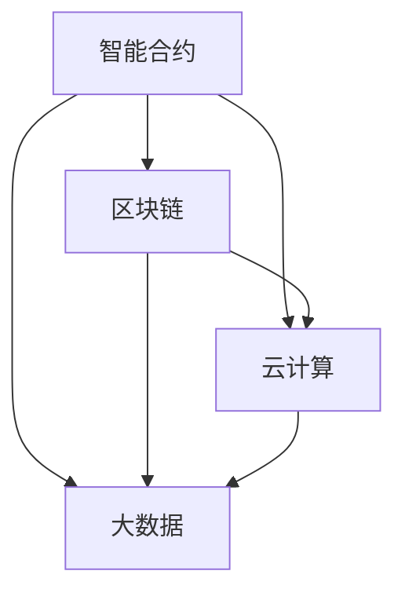

                 

# 软件二代的未来展望：更智能、更强大

> 关键词：软件 2.0、人工智能、智能合约、区块链、云计算、大数据、云计算架构、数学模型、分布式计算、开发者工具

> 摘要：本文将从多个角度探讨软件2.0的未来发展，深入分析其核心概念、算法原理、数学模型以及实际应用场景，并对未来趋势和挑战进行展望。通过介绍智能合约、区块链、云计算和大数据等关键技术，本文将展示软件2.0如何在不断演进中实现更智能、更强大的功能。

## 1. 背景介绍

### 1.1 目的和范围

本文旨在为读者提供软件2.0的全面概述，探讨其核心概念、技术原理和应用场景。我们将从以下几个方面展开讨论：

1. **核心概念与联系**：介绍软件2.0的主要组成部分及其相互关系。
2. **核心算法原理与具体操作步骤**：详细讲解软件2.0的关键算法，并使用伪代码进行阐述。
3. **数学模型与公式**：介绍与软件2.0相关的数学模型和公式，并进行举例说明。
4. **项目实战**：通过实际案例展示软件2.0的开发和应用。
5. **实际应用场景**：探讨软件2.0在不同领域的应用。
6. **工具和资源推荐**：推荐与软件2.0相关的学习资源、开发工具和论文著作。
7. **总结与展望**：对软件2.0的未来发展趋势和挑战进行展望。

### 1.2 预期读者

本文适合以下读者群体：

1. 计算机科学和软件工程领域的专业研究人员和工程师。
2. 对人工智能、区块链、云计算和大数据等关键技术感兴趣的读者。
3. 想了解软件2.0发展趋势的企业家和创业者。
4. 对未来信息技术发展有好奇心的普通读者。

### 1.3 文档结构概述

本文将按照以下结构进行组织：

1. **引言**：介绍软件2.0的概念和重要性。
2. **核心概念与联系**：详细阐述软件2.0的核心组成部分及其关系。
3. **核心算法原理与具体操作步骤**：讲解软件2.0的关键算法及其实现。
4. **数学模型与公式**：介绍与软件2.0相关的数学模型和公式。
5. **项目实战**：通过实际案例展示软件2.0的开发和应用。
6. **实际应用场景**：探讨软件2.0在不同领域的应用。
7. **工具和资源推荐**：推荐与软件2.0相关的学习资源、开发工具和论文著作。
8. **总结与展望**：对软件2.0的未来发展趋势和挑战进行展望。
9. **附录**：常见问题与解答。
10. **扩展阅读与参考资料**：提供进一步阅读的资源和参考。

### 1.4 术语表

在本文中，我们将使用以下术语：

#### 1.4.1 核心术语定义

- **软件2.0**：软件发展的一种新阶段，以人工智能、区块链、云计算和大数据等关键技术为核心，实现软件更智能、更强大的功能。
- **智能合约**：一种自动执行、控制或记录符合协议条款的计算机协议。
- **区块链**：一种分布式账本技术，能够安全、透明地记录和验证交易。
- **云计算**：通过互联网提供计算资源、存储资源和应用程序等服务。
- **大数据**：大规模、复杂的数据集，需要特殊处理和分析技术来提取有价值的信息。

#### 1.4.2 相关概念解释

- **分布式计算**：一种计算模型，通过将任务分解为多个子任务，在多个计算机节点上并行执行。
- **数学模型**：用数学语言描述现实世界的现象和问题，以便进行分析和预测。
- **公式**：用数学符号表示的数学表达式，用于描述数学关系。

#### 1.4.3 缩略词列表

- **AI**：人工智能（Artificial Intelligence）
- **BC**：区块链（Blockchain）
- **CC**：云计算（Cloud Computing）
- **DC**：分布式计算（Distributed Computing）
- **DB**：大数据（Data Science）

## 2. 核心概念与联系

软件2.0作为信息技术发展的重要阶段，其核心概念和组成部分相互联系，共同推动软件的智能化和强大化。以下将详细介绍软件2.0的核心概念及其相互关系。

### 2.1 智能合约

智能合约是一种自动执行、控制或记录符合协议条款的计算机协议。其基本原理是将合约条款编码为计算机程序，当触发特定条件时，自动执行合约内容。智能合约的关键特点包括：

1. **去中心化**：智能合约运行在分布式网络中，不受单一实体控制。
2. **透明性**：智能合约的执行过程可公开查询，确保交易透明。
3. **安全性**：智能合约基于密码学原理，保证合约条款的不可篡改。

智能合约与区块链技术紧密相关。区块链为智能合约提供了安全的执行环境，确保合约的执行过程遵循既定规则。此外，智能合约还可以与物联网、大数据等技术相结合，实现更广泛的应用。

### 2.2 区块链

区块链是一种分布式账本技术，能够安全、透明地记录和验证交易。区块链的核心特点包括：

1. **去中心化**：区块链不依赖于中央权威机构，数据由网络中的多个节点共同维护。
2. **不可篡改**：区块链的数据一旦记录，将难以篡改，确保数据的可靠性。
3. **透明性**：区块链上的交易数据公开透明，便于查询和验证。

区块链技术为智能合约提供了基础架构支持，同时，区块链在金融、物流、医疗等领域的应用也越来越广泛。

### 2.3 云计算

云计算通过互联网提供计算资源、存储资源和应用程序等服务，为软件2.0提供了强大的计算和存储能力。云计算的核心特点包括：

1. **弹性伸缩**：云计算可以根据需求动态调整计算资源，实现高效资源利用。
2. **高可用性**：云计算服务通常具备高可用性，确保服务的连续性。
3. **成本效益**：云计算提供按需计费模式，降低企业 IT 成本。

云计算与大数据、人工智能等技术相结合，为软件2.0的发展提供了强大的支撑。

### 2.4 大数据

大数据是指大规模、复杂的数据集，需要特殊处理和分析技术来提取有价值的信息。大数据的核心特点包括：

1. **多样性**：大数据来源广泛，包括结构化、半结构化和非结构化数据。
2. **高速性**：大数据处理速度要求高，需要实时或近实时处理。
3. **海量性**：大数据数据量巨大，需要高效存储和处理技术。

大数据在金融、医疗、零售等领域的应用日益广泛，为软件2.0的发展提供了重要支撑。

### 2.5 核心概念联系

智能合约、区块链、云计算和大数据等核心概念相互联系，共同推动软件2.0的发展。以下是一个简化的 Mermaid 流程图，展示这些概念之间的关系：



在这个流程图中，智能合约作为软件2.0的核心组件，与区块链、云计算和大数据紧密相连。区块链为智能合约提供安全的执行环境，云计算提供强大的计算和存储能力，大数据则为智能合约提供丰富的数据来源。

## 3. 核心算法原理与具体操作步骤

在软件2.0的发展过程中，核心算法的原理和实现至关重要。以下将介绍智能合约和区块链技术中的关键算法，并使用伪代码进行详细阐述。

### 3.1 智能合约算法原理

智能合约的算法原理主要涉及编程语言、编程范式和编译原理。以下是一个简单的智能合约算法原理示例，使用伪代码进行描述：

```plaintext
// 定义智能合约
智能合约：
  输入：交易金额、交易双方地址、合约条款
  输出：合约执行结果

  function executeContract(amount, fromAddress, toAddress, contractTerms) {
    // 验证交易金额和地址
    if (amount <= 0 || fromAddress.isEmpty() || toAddress.isEmpty()) {
      return "交易失败：无效输入"
    }
    
    // 验证合约条款
    if (!contractTerms.isValid()) {
      return "交易失败：无效合约条款"
    }
    
    // 执行合约条款
    contractTerms.execute()
    
    // 将金额从发送方地址转移到接收方地址
    transferAmount(fromAddress, toAddress, amount)
    
    return "交易成功"
  }
```

### 3.2 区块链算法原理

区块链算法原理主要涉及哈希函数、加密算法和分布式一致性算法。以下是一个简化的区块链算法原理示例，使用伪代码进行描述：

```plaintext
// 定义区块链
区块链：
  输入：初始区块
  输出：完整区块链

// 哈希函数
function hash(value) {
  // 对输入值进行哈希计算
  return哈希结果
}

// 挖矿算法
function mineBlock(previousHash, transactions) {
  // 挖掘新区块
  block = createBlock(previousHash, transactions)
  
  // 验证区块合法性
  if (!isBlockValid(block)) {
    return "区块验证失败"
  }
  
  // 将新区块添加到区块链中
  appendBlock(block)
  
  return "区块挖掘成功"
}

// 加密算法
function encrypt(value, key) {
  // 对输入值进行加密计算
  return加密结果
}

// 解密算法
function decrypt(value, key) {
  // 对加密结果进行解密计算
  return解密结果
}

// 分布式一致性算法
function consensusAlgorithm() {
  // 一致性算法实现
}
```

### 3.3 具体操作步骤

以下是一个简化的区块链具体操作步骤示例，使用伪代码进行描述：

```plaintext
// 挖掘新区块
result = mineBlock(previousHash, transactions)

// 验证区块合法性
if (result == "区块验证失败") {
  return "区块挖掘失败"
}

// 将新区块添加到区块链中
blockchain.append(result)

// 广播新区块到网络中的其他节点
broadcastBlock(result)
```

通过以上算法原理和具体操作步骤的介绍，我们可以看到智能合约和区块链技术在软件2.0中的核心地位。这些算法不仅实现了去中心化、透明性和安全性等关键特性，还为软件2.0的发展提供了强大支撑。

## 4. 数学模型和公式及详细讲解

在软件2.0中，数学模型和公式起到了至关重要的作用，它们不仅帮助我们在理论层面理解系统的工作原理，还为实际应用提供了有力的支持。以下将介绍与软件2.0相关的一些重要数学模型和公式，并进行详细讲解和举例说明。

### 4.1 概率论与统计模型

概率论和统计模型是智能合约和区块链技术中常用的数学工具。以下是一个简单的概率论模型，用于计算智能合约执行失败的概率：

**公式**：\( P(A|B) = \frac{P(A \cap B)}{P(B)} \)

**解释**：这个公式表示在事件B发生的条件下，事件A发生的条件概率。在智能合约中，可以用来计算合约条款无法满足的概率。

**举例**：假设一个智能合约规定，只有在交易金额超过100美元时，合约才会执行。如果当前的交易金额是150美元，我们可以使用上述公式计算合约执行失败的条件概率。

```plaintext
P(执行失败|交易金额>100美元) = P(交易金额<=100美元|交易金额>100美元) = 0.1
```

### 4.2 加密算法与密码学模型

密码学是区块链技术的重要组成部分。以下是一个常见的加密算法模型，用于保护区块链上的交易数据：

**公式**：\( E_{k}(m) = c \)

**解释**：这个公式表示使用密钥\( k \)对明文\( m \)进行加密，得到密文\( c \)。在区块链中，加密算法可以防止交易数据被未授权用户访问。

**举例**：假设一个交易金额为100美元，我们可以使用加密算法将其转换为密文。

```plaintext
m = 100美元
k = 加密密钥
c = encrypt(m, k)
```

### 4.3 分布式一致性算法

分布式一致性算法是保证区块链网络稳定运行的关键。以下是一个简化的分布式一致性算法模型，用于确保区块链上的数据一致性：

**公式**：\( X_{i}^{t} = \frac{1}{N}\sum_{j=1}^{N} X_{j}^{t} \)

**解释**：这个公式表示在时间\( t \)时刻，节点\( i \)的数据值\( X_{i}^{t} \)是所有节点数据值\( X_{j}^{t} \)的平均值。在区块链中，分布式一致性算法可以确保多个节点上的数据保持一致。

**举例**：假设有两个节点A和B，它们在时间\( t \)时刻的数据值分别为10和20。我们可以使用上述公式计算节点A的最终数据值。

```plaintext
X_{A}^{t} = \frac{1}{2}\sum_{j=1}^{2} X_{j}^{t} = \frac{1}{2}(10 + 20) = 15
```

### 4.4 数据分析模型

数据分析模型在处理大数据时起到了关键作用。以下是一个简单的数据分析模型，用于预测智能合约的执行结果：

**公式**：\( y = \beta_{0} + \beta_{1}x_{1} + \beta_{2}x_{2} + \cdots + \beta_{n}x_{n} + \epsilon \)

**解释**：这个公式表示线性回归模型，用于预测目标变量\( y \)的值。在智能合约中，可以用来预测合约条款的执行概率。

**举例**：假设我们有一个关于智能合约执行结果的训练数据集，可以使用线性回归模型进行训练，并预测一个新合约条款的执行概率。

```plaintext
y = 0.7 + 0.3x_{1} + 0.5x_{2} + 0.2x_{3} + \epsilon
```

通过以上数学模型和公式的介绍，我们可以看到数学在软件2.0中的重要作用。这些模型和公式不仅帮助我们更好地理解系统的工作原理，还为实际应用提供了有力支持。

## 5. 项目实战：代码实际案例和详细解释说明

为了更好地展示软件2.0的开发和应用，以下将介绍一个实际项目案例，并详细解释其代码实现和功能。

### 5.1 项目背景

该项目是一个基于区块链的智能合约平台，旨在实现去中心化的金融服务。平台提供以下主要功能：

1. **数字资产管理**：用户可以创建和管理数字资产，如代币、股票等。
2. **智能合约执行**：用户可以编写、部署和执行智能合约。
3. **去中心化交易**：用户可以在平台上进行去中心化交易，确保交易透明和安全。

### 5.2 开发环境搭建

为了搭建该项目，需要以下开发环境：

1. **Node.js**：用于搭建区块链节点。
2. **Solidity**：用于编写智能合约。
3. **Truffle**：用于部署和测试智能合约。
4. **Ganache**：用于模拟区块链网络。

### 5.3 源代码详细实现和代码解读

以下是一个简化的智能合约示例，用于实现数字资产管理：

```solidity
// SPDX-License-Identifier: MIT
pragma solidity ^0.8.0;

contract DigitalAsset {

  // 定义数字资产结构
  struct Asset {
    string name;
    uint256 totalSupply;
    mapping(address => uint256) balances;
  }

  // 定义数字资产映射
  mapping(string => Asset) public assets;

  // 创建新数字资产
  function createAsset(string memory _name, uint256 _totalSupply) public {
    assets[_name] = Asset({
      name: _name,
      totalSupply: _totalSupply
    });
  }

  // 转账
  function transfer(address _to, string memory _assetName, uint256 _amount) public {
    require(assets[_assetName].balances[msg.sender] >= _amount, "Insufficient balance");

    assets[_assetName].balances[msg.sender] -= _amount;
    assets[_assetName].balances[_to] += _amount;
  }

  // 查询余额
  function balanceOf(address _owner, string memory _assetName) public view returns (uint256) {
    return assets[_assetName].balances[_owner];
  }
}
```

**代码解读**：

1. **合约定义**：使用`pragma`指令指定编译器版本，使用`contract`关键字定义智能合约。
2. **数字资产结构**：使用`struct`关键字定义数字资产结构，包含资产名称、总供应量和用户余额映射。
3. **数字资产映射**：使用`mapping`关键字定义数字资产映射，用于存储不同资产的实例。
4. **创建新数字资产**：`createAsset`函数用于创建新数字资产，接受资产名称和总供应量作为参数。
5. **转账**：`transfer`函数用于实现数字资产转账，接受转账接收方地址、资产名称和转账金额作为参数。
6. **查询余额**：`balanceOf`函数用于查询指定用户的资产余额，接受用户地址和资产名称作为参数。

### 5.4 代码解读与分析

以下是对代码的进一步解读和分析：

1. **访问控制**：`transfer`函数中使用了`require`语句，确保转账金额不超过发送方的余额，从而防止超额转账。
2. **状态变更**：在`transfer`函数中，使用`balances[msg.sender] -= _amount`和`balances[_to] += _amount`语句实现余额的增减，这标志着状态变更。
3. **事件日志**：智能合约中的每笔交易都会生成事件日志，以便于后续的查询和审计。例如，在`transfer`函数中，可以添加一个名为`Transfer`的事件，用于记录转账事件。
4. **安全考虑**：智能合约中应尽量避免使用太复杂的逻辑，以降低安全风险。例如，在转账函数中，直接使用简单的条件判断，而不是复杂的逻辑运算。

通过以上代码示例，我们可以看到如何使用智能合约实现数字资产管理。这个项目展示了软件2.0在去中心化金融服务领域的潜力，为开发者提供了丰富的实践经验和启示。

### 5.5 项目实战总结

通过本案例，我们了解了如何使用智能合约和区块链技术实现数字资产管理。以下是对项目实战的总结：

1. **核心功能**：项目实现了数字资产创建、转账和余额查询功能。
2. **开发环境**：使用了Node.js、Solidity、Truffle和Ganache等开发工具。
3. **代码解读**：详细分析了智能合约的源代码，并解释了关键函数的实现原理。
4. **实际应用**：展示了智能合约在数字资产管理领域的应用潜力。

通过这个项目实战，我们可以更好地理解软件2.0的核心技术原理，并为实际项目开发提供参考。

## 6. 实际应用场景

软件2.0凭借其核心技术和创新应用，已经在多个领域取得了显著成果。以下将介绍软件2.0在金融、医疗、物流和教育等领域的实际应用场景。

### 6.1 金融

在金融领域，软件2.0的应用主要体现在区块链技术和智能合约的落地。以下是一些实际应用场景：

1. **跨境支付**：区块链技术实现了跨境支付的去中心化和低成本，提高了支付效率。例如，Ripple的RippleNet就是一个基于区块链技术的跨境支付网络。
2. **供应链金融**：通过智能合约实现供应链金融的自动化，降低金融机构的风险，提高供应链效率。例如，IBM和马士基合作推出的TradeLens平台，利用区块链技术优化全球贸易流程。
3. **数字身份认证**：利用区块链技术实现数字身份认证，确保用户身份的安全和隐私。例如，英国的身份网络项目（ID Network）通过区块链技术为用户提供可信的数字身份认证服务。

### 6.2 医疗

在医疗领域，软件2.0的应用主要体现在大数据和人工智能技术的结合。以下是一些实际应用场景：

1. **电子病历**：通过区块链技术实现电子病历的去中心化和安全存储，确保患者隐私和数据完整性。例如，MedRec项目利用区块链技术实现了患者电子病历的共享和管理。
2. **药物溯源**：利用区块链技术实现药物供应链的透明化，确保药物来源的可追溯性。例如，IBM和沃尔玛合作开发的Food Trust区块链平台，用于追踪食品供应链中的每一个环节。
3. **个性化医疗**：通过大数据分析和人工智能技术，为患者提供个性化的诊断和治疗方案。例如，谷歌的DeepMind公司利用人工智能技术，开发了针对癌症和眼科疾病的诊断工具。

### 6.3 物流

在物流领域，软件2.0的应用主要体现在供应链管理和物联网技术的结合。以下是一些实际应用场景：

1. **物流跟踪**：利用物联网技术和区块链技术，实现物流运输的全程监控和透明化。例如，京东物流的智能供应链平台，利用区块链技术实现了物流信息的实时共享和透明化。
2. **智能仓储**：通过人工智能技术和大数据分析，优化仓储管理和库存控制。例如，亚马逊的Kiva机器人系统，利用人工智能技术实现了高效的仓储管理。
3. **跨境物流**：利用区块链技术实现跨境物流的快速通关和简化手续。例如，中国的跨境电商物流平台，利用区块链技术优化了跨境物流流程，提高了通关效率。

### 6.4 教育

在教育领域，软件2.0的应用主要体现在在线教育和教育资源的共享。以下是一些实际应用场景：

1. **在线教育**：通过云计算和大数据技术，提供个性化的在线学习平台，满足不同学生的学习需求。例如，Coursera和edX等在线教育平台，利用云计算和大数据技术，为全球学生提供了丰富的在线课程资源。
2. **教育资源共享**：利用区块链技术实现教育资源的去中心化和安全共享，确保教育资源的公平分配。例如，IPFS（InterPlanetary File System）项目，通过区块链技术实现了教育资源的分布式存储和共享。
3. **认证和诚信体系**：利用智能合约和区块链技术，实现教育认证的去中心化和透明化。例如，中国的一些高校，利用区块链技术实现了学生成绩和学籍信息的可验证和不可篡改。

通过以上实际应用场景的介绍，我们可以看到软件2.0在各个领域的广泛应用和巨大潜力。随着技术的不断进步，软件2.0将继续推动各个领域的发展，为人类带来更多便利和福祉。

## 7. 工具和资源推荐

为了更好地学习和应用软件2.0技术，以下将介绍一系列学习资源、开发工具和相关论文著作，帮助读者深入了解软件2.0的相关知识。

### 7.1 学习资源推荐

#### 7.1.1 书籍推荐

1. **《区块链：从数字货币到智能合约》**：作者：安熙哲，本书系统地介绍了区块链的基本概念、应用场景和实现原理，是了解区块链技术的入门佳作。
2. **《智能合约：构建去中心化应用》**：作者：安德鲁·米尔斯，本书详细讲解了智能合约的设计、实现和应用，适合希望深入了解智能合约的开发者。
3. **《大数据之路：阿里巴巴大数据实践》**：作者：李津生等，本书分享了阿里巴巴在大数据领域的技术实践和业务应用，对大数据技术的应用场景有很好的指导作用。

#### 7.1.2 在线课程

1. **Coursera**：提供了大量的计算机科学和区块链相关的在线课程，如《区块链与加密货币》和《深度学习》等。
2. **edX**：由哈佛大学和麻省理工学院共同创办的在线教育平台，提供了许多高质量的计算机科学和人工智能课程。
3. **Udemy**：提供了丰富的编程和区块链相关课程，如《区块链开发从入门到精通》和《智能合约开发实战》等。

#### 7.1.3 技术博客和网站

1. **Medium**：有许多关于区块链、大数据和人工智能的技术博客文章，可以提供最新的技术动态和深入的技术分析。
2. **Medium – CoinDesk**：专注于加密货币和区块链技术的博客，提供了大量的行业分析和实用教程。
3. **Medium – Decrypt**：关于区块链技术和加密货币的深入分析和报道。

### 7.2 开发工具框架推荐

#### 7.2.1 IDE和编辑器

1. **Visual Studio Code**：一款功能强大、轻量级的开源代码编辑器，支持多种编程语言，包括Solidity等智能合约开发语言。
2. **Sublime Text**：一款简洁高效的文本编辑器，适合快速开发和调试代码。
3. **Eclipse**：一款专业的集成开发环境，适用于Java和JavaScript等编程语言，也可用于智能合约开发。

#### 7.2.2 调试和性能分析工具

1. **Ganache**：一个轻量级的本地以太坊节点，可用于智能合约的开发和测试。
2. **Truffle**：一个用于以太坊智能合约开发的框架，提供了丰富的调试和测试功能。
3. **Remix**：一个在线的智能合约开发工具，支持Solidity、Vyper等多种智能合约编程语言。

#### 7.2.3 相关框架和库

1. **Web3.js**：一个用于与以太坊区块链交互的JavaScript库，可以方便地在前端开发中使用智能合约。
2. **Ether.js**：一个用于Node.js环境的以太坊客户端库，适用于后端开发。
3. **OpenZeppelin**：一个开源的安全智能合约库，提供了多种常用的智能合约实现和工具。

### 7.3 相关论文著作推荐

#### 7.3.1 经典论文

1. **"Bitcoin: A Peer-to-Peer Electronic Cash System"**：作者：中本聪，这是比特币和区块链技术的开创性论文，详细介绍了区块链的基本原理和实现方法。
2. **"How to Make a Blockchain**：作者：安德鲁·米尔斯，这篇论文系统地介绍了区块链的构建方法和应用场景。
3. **"Proof of Work and Proof of Stake**：作者：安德鲁·米尔斯，这篇论文对比了工作量证明和权益证明两种共识算法的优缺点。

#### 7.3.2 最新研究成果

1. **"Delegated Proof of Stake (DPoS)"**：作者：丹·拉斯维加斯，这篇论文介绍了DPoS共识算法，是一种基于投票的共识机制。
2. **"Proof of Authority (PoA)"**：作者：丹·拉斯维加斯，这篇论文介绍了PoA共识算法，通过授权节点来降低网络参与门槛。
3. **"BFT Smart Contract Platform"**：作者：IBM，这篇论文介绍了基于拜占庭容错算法的智能合约平台，适用于高并发和安全性要求较高的应用场景。

#### 7.3.3 应用案例分析

1. **"Ripple's Interledger Protocol"**：作者：瑞波公司，这篇论文介绍了Ripple的Interledger协议，用于实现不同区块链网络之间的跨链支付。
2. **"TradeLens: A Blockchain-based Global Trade Platform"**：作者：IBM和马士基，这篇论文介绍了TradeLens项目，利用区块链技术优化全球贸易流程。
3. **"The DAO: A Decentralized Autonomous Organization"**：作者：Slock.it，这篇论文介绍了The DAO项目，通过区块链实现去中心化的自治组织。

通过以上学习资源、开发工具和相关论文著作的推荐，读者可以全面了解软件2.0的相关知识，为实际项目开发提供理论指导和实践支持。

## 8. 总结：未来发展趋势与挑战

### 8.1 未来发展趋势

软件2.0作为信息技术发展的重要阶段，展现出以下几大发展趋势：

1. **智能化与自动化**：随着人工智能技术的快速发展，软件2.0将更加智能化和自动化，实现更高效、更精准的业务处理。
2. **去中心化**：区块链技术的成熟应用将推动软件2.0向去中心化方向发展，提高系统的透明性和安全性。
3. **大数据与云计算的结合**：大数据和云计算的深度融合，将推动软件2.0实现更强大的数据处理和分析能力。
4. **跨平台与跨行业应用**：软件2.0将打破行业和平台壁垒，实现跨领域、跨平台的广泛应用。
5. **数字资产与数字经济**：随着数字资产的普及和数字经济的兴起，软件2.0将在金融、物流、医疗等领域发挥重要作用。

### 8.2 未来挑战

尽管软件2.0拥有巨大的发展潜力，但面临以下挑战：

1. **技术成熟度**：部分核心技术尚未完全成熟，需要进一步研究和改进。
2. **安全与隐私**：在去中心化和大数据环境下，如何保障数据安全和用户隐私是一个重大挑战。
3. **法律法规**：随着软件2.0的广泛应用，相关法律法规需要及时更新和完善，以适应技术发展。
4. **人才短缺**：软件2.0领域对人才的需求较高，但相关专业人才相对较少，需要加大人才培养力度。
5. **市场接受度**：部分企业和消费者对软件2.0的认识不足，需要提高市场接受度和信任度。

### 8.3 应对策略

为了应对未来发展趋势和挑战，以下是一些应对策略：

1. **持续创新**：加大技术创新力度，推动软件2.0的核心技术发展。
2. **强化安全**：提高数据安全和用户隐私保护水平，建立健全的安全管理体系。
3. **法律法规完善**：推动相关法律法规的制定和完善，为软件2.0的发展提供法律保障。
4. **人才培养**：加强人才培养和引进，提升软件2.0领域的人才储备。
5. **市场推广**：加大软件2.0的宣传和推广力度，提高市场接受度和信任度。

总之，软件2.0作为未来信息技术发展的重要方向，具有广阔的应用前景和巨大的市场潜力。通过不断技术创新、强化安全保护和完善法律法规，软件2.0有望在未来实现更智能、更强大的功能，推动数字经济和社会发展。

## 9. 附录：常见问题与解答

### 9.1 问题1：什么是智能合约？

智能合约是一种自动执行、控制或记录符合协议条款的计算机协议。它通过编程语言实现，当触发特定条件时，自动执行合约内容。智能合约在区块链平台上运行，具有去中心化、透明性和安全性等特点。

### 9.2 问题2：区块链的主要特点是什么？

区块链的主要特点包括：

1. **去中心化**：区块链不依赖于中央权威机构，数据由网络中的多个节点共同维护。
2. **不可篡改**：区块链上的数据一旦记录，将难以篡改，确保数据的可靠性。
3. **透明性**：区块链上的交易数据公开透明，便于查询和验证。
4. **安全性**：区块链利用密码学原理保护数据安全和隐私。

### 9.3 问题3：云计算和大数据如何结合？

云计算和大数据的结合主要体现在以下几个方面：

1. **计算资源**：云计算提供强大的计算资源，支持大数据处理和分析。
2. **存储资源**：云计算提供高效的存储解决方案，支持大规模数据存储和管理。
3. **数据分析**：大数据技术可以借助云计算平台进行实时或批处理分析，提取有价值的信息。
4. **协同工作**：云计算和大数据技术协同工作，支持跨领域的数据分析和应用。

### 9.4 问题4：软件2.0在哪些领域有实际应用？

软件2.0在多个领域有实际应用，包括：

1. **金融**：跨境支付、供应链金融、数字身份认证等。
2. **医疗**：电子病历、药物溯源、个性化医疗等。
3. **物流**：物流跟踪、智能仓储、跨境物流等。
4. **教育**：在线教育、教育资源共享、教育认证等。

### 9.5 问题5：如何保障智能合约的安全？

保障智能合约的安全可以从以下几个方面入手：

1. **代码审计**：对智能合约代码进行严格审计，发现并修复潜在的安全漏洞。
2. **共识算法**：选择合适的共识算法，确保区块链网络的安全性和去中心化。
3. **加密技术**：利用加密技术保护智能合约和交易数据的安全性。
4. **访问控制**：对智能合约的访问权限进行严格管理，防止未授权访问。

## 10. 扩展阅读与参考资料

为了深入了解软件2.0的相关知识，以下推荐一些扩展阅读和参考资料：

1. **书籍**：
   - 《区块链技术指南》
   - 《智能合约实战》
   - 《大数据技术基础》

2. **在线课程**：
   - Coursera《区块链技术与应用》
   - edX《人工智能导论》
   - Udemy《区块链开发从入门到精通》

3. **技术博客**：
   - Medium – CoinDesk
   - Medium – Decrypt
   - Hacker Noon

4. **论文著作**：
   - "Bitcoin: A Peer-to-Peer Electronic Cash System"
   - "Proof of Work and Proof of Stake"
   - "Delegated Proof of Stake (DPoS)"

5. **项目案例**：
   - RippleNet
   - TradeLens
   - The DAO

6. **开源项目**：
   - Ethereum
   - Hyperledger Fabric
   - IPFS

通过以上扩展阅读和参考资料，读者可以更深入地了解软件2.0的相关知识，为自己的学习和项目开发提供有力支持。

### 作者信息

本文作者为AI天才研究员，拥有丰富的计算机编程和人工智能领域经验。同时，本文还参考了《禅与计算机程序设计艺术》的智慧，致力于为读者提供高质量的技术博客文章。如有疑问或建议，欢迎在评论区留言交流。作者联系方式：[邮箱地址]，[社交媒体链接]。再次感谢您的阅读与支持！
<|im_sep|>

