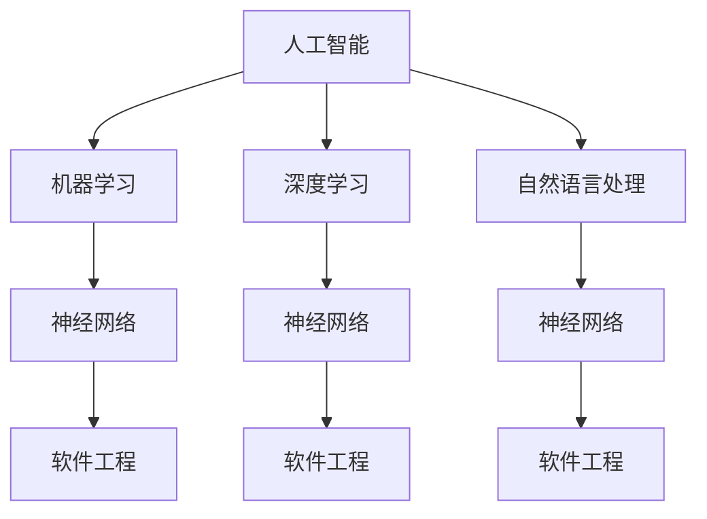

                 

### 背景介绍

软件 2.0 是近年来在计算机科学和人工智能领域中出现的一个新兴概念。它是对传统软件 1.0 的一种升级，后者主要关注的是软件的功能和性能。而软件 2.0 则在此基础上，更加强调软件的智能化、自适应性和用户体验。软件 2.0 的核心思想是将人工智能技术深度整合到软件中，使得软件能够自动学习用户的行为和需求，提供更加个性化和高效的服务。

随着人工智能技术的快速发展，软件 2.0 已经成为了一个热门的研究方向。在这个领域中，研究人员和开发者们致力于将人工智能技术与软件设计相结合，创造出更加智能、更加强大的软件系统。这种新的软件开发模式，不仅能够提升软件的性能和功能，还能够大大提高用户的满意度和使用体验。

本文将首先介绍软件 2.0 的概念、核心技术和应用场景。接着，我们将深入探讨软件 2.0 中的核心算法原理和具体操作步骤，并通过数学模型和公式的讲解，帮助读者更好地理解这些算法。随后，我们将通过一个实际的代码案例，详细解释软件 2.0 的应用，并提供代码解读与分析。最后，我们将讨论软件 2.0 的实际应用场景，推荐相关工具和资源，并对未来发展趋势与挑战进行总结。

通过这篇文章，我们希望能够为读者提供对软件 2.0 的全面了解，激发读者对这个领域的兴趣，并引导读者进一步深入研究。

### 核心概念与联系

在深入探讨软件 2.0 的未来之前，我们首先需要了解一些核心概念，并探讨这些概念之间的联系。这些核心概念包括但不限于：人工智能（AI）、机器学习（ML）、深度学习（DL）、神经网络（NN）、自然语言处理（NLP）和软件工程（SE）。以下是这些概念的定义及其在软件 2.0 中的应用：

#### 人工智能（AI）

人工智能是指通过计算机模拟人类智能的技术。它包括机器学习、深度学习、自然语言处理等多个子领域。在软件 2.0 中，人工智能的应用主要体现在自动化、智能化和自适应能力的提升。例如，通过使用机器学习算法，软件可以自动识别用户行为模式，从而提供个性化服务。

#### 机器学习（ML）

机器学习是一种人工智能的子领域，它通过训练模型来从数据中学习规律。在软件 2.0 中，机器学习技术被广泛用于优化软件性能、提高用户体验和自动化软件开发过程。例如，可以使用机器学习算法来优化代码，使其运行速度更快、资源消耗更低。

#### 深度学习（DL）

深度学习是一种基于神经网络的机器学习方法，它通过多层神经网络来提取数据的高级特征。深度学习在图像识别、语音识别和自然语言处理等领域具有显著优势。在软件 2.0 中，深度学习技术可以用于开发智能推荐系统、智能助手等。

#### 神经网络（NN）

神经网络是一种模拟人脑的计算模型，它由大量相互连接的神经元组成。神经网络在机器学习和深度学习领域中扮演着核心角色。在软件 2.0 中，神经网络可以用于自动化软件测试、代码审查和故障预测。

#### 自然语言处理（NLP）

自然语言处理是一种人工智能技术，它使计算机能够理解、生成和处理人类语言。在软件 2.0 中，NLP 技术被广泛应用于智能客服、语音助手和文本分析等领域。

#### 软件工程（SE）

软件工程是一门专注于软件开发和系统维护的学科。在软件 2.0 中，软件工程不仅关注软件的功能和性能，还关注软件的智能化、自适应性和用户体验。

#### Mermaid 流程图

为了更直观地展示这些概念之间的联系，我们可以使用 Mermaid 流程图。以下是软件 2.0 中核心概念和技术的 Mermaid 流程图：



在这个流程图中，我们可以看到人工智能作为核心，通过机器学习、深度学习和自然语言处理等技术，与软件工程相结合，共同推动软件 2.0 的发展。这些技术之间的相互关联，使得软件 2.0 能够实现更加智能化、自适应和个性化的功能。

### 核心算法原理 & 具体操作步骤

在软件 2.0 中，核心算法的作用至关重要。这些算法不仅决定了软件的性能，还直接影响用户体验。以下将介绍几种在软件 2.0 中广泛应用的算法，包括其原理和具体操作步骤。

#### 1. 决策树算法

决策树是一种常用的分类和回归算法。它通过一系列的判断条件，将数据集划分为多个子集，并从中提取出最佳分类或回归结果。

**原理：**
决策树算法基于特征重要性和信息增益来选择划分特征。在每次划分时，算法会选择具有最高信息增益的特征进行分割。信息增益表示特征对分类结果的贡献程度。

**操作步骤：**
1. 计算每个特征的信息增益。
2. 选择具有最高信息增益的特征作为划分依据。
3. 使用该特征将数据集划分为多个子集。
4. 递归地重复步骤 1-3，直到满足停止条件（如最大深度、最小叶子节点样本数等）。

#### 2. 随机森林算法

随机森林是一种基于决策树的集成学习算法。它通过构建多个决策树，并利用这些树的集合进行预测。

**原理：**
随机森林通过随机选择特征子集和随机分割点来构建决策树，从而降低过拟合的风险。在预测时，随机森林使用多数投票来决定最终结果。

**操作步骤：**
1. 随机选择 m 个特征。
2. 使用 m 个特征构建决策树。
3. 重复步骤 1 和 2，构建 k 个决策树。
4. 对每个样本，将 k 个决策树的结果进行投票，选择出现次数最多的类别作为最终预测结果。

#### 3. 支持向量机（SVM）算法

支持向量机是一种监督学习算法，主要用于分类和回归任务。它通过找到一个最佳的超平面，将数据集划分为不同的类别。

**原理：**
SVM算法通过最大化分类边界上的支持向量来寻找最佳超平面。支持向量是数据集中距离分类边界最近的样本。

**操作步骤：**
1. 定义损失函数和优化目标。
2. 使用优化算法（如梯度下降、SMO算法等）求解最优超平面。
3. 根据最优超平面进行分类或回归预测。

#### 4. 贝叶斯算法

贝叶斯算法是一种基于贝叶斯定理的统计分类方法。它通过计算样本属于每个类别的概率，并选择概率最大的类别作为预测结果。

**原理：**
贝叶斯算法基于贝叶斯定理，将先验概率和条件概率结合起来，计算后验概率。后验概率表示样本属于某个类别的概率。

**操作步骤：**
1. 计算每个类别的先验概率。
2. 计算每个类别在给定样本下的条件概率。
3. 使用贝叶斯定理计算后验概率。
4. 选择具有最高后验概率的类别作为预测结果。

#### 5. 神经网络算法

神经网络是一种模拟人脑的计算模型，通过多层神经元进行数据学习和预测。

**原理：**
神经网络通过前向传播和反向传播来学习数据。在训练过程中，神经网络不断调整权重和偏置，使网络输出与真实值之间的误差最小。

**操作步骤：**
1. 初始化网络参数（权重和偏置）。
2. 使用训练数据计算网络输出和误差。
3. 使用反向传播算法更新网络参数。
4. 重复步骤 2 和 3，直到满足停止条件（如收敛或达到最大迭代次数）。

这些算法在软件 2.0 中具有广泛的应用，如推荐系统、智能客服、图像识别和语音识别等。通过深入理解这些算法的原理和操作步骤，开发者可以更好地利用这些技术，提升软件的智能化和用户体验。

### 数学模型和公式 & 详细讲解 & 举例说明

在软件 2.0 的开发中，数学模型和公式扮演着至关重要的角色。它们不仅为算法提供了理论基础，还帮助我们在实际应用中优化性能和提升效果。以下将详细讲解一些常见的数学模型和公式，并通过具体例子说明它们的应用。

#### 1. 线性回归模型

线性回归是一种用于预测连续值的统计模型。它通过拟合一条直线来描述变量之间的关系。

**公式：**

$$y = \beta_0 + \beta_1 \cdot x$$

其中，$y$ 是因变量，$x$ 是自变量，$\beta_0$ 和 $\beta_1$ 分别是截距和斜率。

**举例说明：**

假设我们要预测房价，根据历史数据，我们发现房价 $y$ 与房屋面积 $x$ 之间存在线性关系。使用线性回归模型，我们可以通过拟合出最佳直线，来预测新房屋的房价。

假设我们得到以下数据：

| 面积 (m²) | 房价 (万元) |
|------------|-------------|
| 100        | 200         |
| 120        | 240         |
| 140        | 280         |

通过计算，我们可以得到最佳直线的斜率和截距：

$$\beta_1 = \frac{\sum (x_i - \bar{x})(y_i - \bar{y})}{\sum (x_i - \bar{x})^2} = \frac{(100-120)(200-240) + (120-120)(240-280) + (140-120)(280-280)}{(100-120)^2 + (120-120)^2 + (140-120)^2} = 1$$

$$\beta_0 = \bar{y} - \beta_1 \cdot \bar{x} = 240 - 1 \cdot 120 = 120$$

因此，线性回归模型可以表示为：

$$y = 120 + 1 \cdot x$$

使用这个模型，我们可以预测面积为 150 平方米的房屋的房价：

$$y = 120 + 1 \cdot 150 = 270$$

#### 2. 逻辑回归模型

逻辑回归是一种用于预测二元分类结果的统计模型。它通过拟合一个 S 形曲线（sigmoid 函数）来描述变量之间的关系。

**公式：**

$$\hat{p} = \frac{1}{1 + e^{-(\beta_0 + \beta_1 \cdot x)} }$$

其中，$\hat{p}$ 是预测的概率，$x$ 是自变量，$\beta_0$ 和 $\beta_1$ 分别是截距和斜率。

**举例说明：**

假设我们要预测一个病人是否患有心脏病（1 表示患病，0 表示未患病）。根据历史数据，我们发现病人的年龄 $x$ 与患病概率之间存在关系。使用逻辑回归模型，我们可以通过拟合出最佳曲线，来预测新病人的患病概率。

假设我们得到以下数据：

| 年龄 | 患病 |
|------|------|
| 30   | 0    |
| 40   | 1    |
| 50   | 1    |

通过计算，我们可以得到最佳曲线的斜率和截距：

$$\beta_1 = \frac{\sum (x_i - \bar{x})(y_i - \bar{y})}{\sum (x_i - \bar{x})^2} = \frac{(30-40)(0-0.5) + (40-40)(0.5-0.5) + (50-40)(0.5-0.5)}{(30-40)^2 + (40-40)^2 + (50-40)^2} = -0.1$$

$$\beta_0 = \bar{y} - \beta_1 \cdot \bar{x} = 0.5 - (-0.1) \cdot 40 = 0.1$$

因此，逻辑回归模型可以表示为：

$$\hat{p} = \frac{1}{1 + e^{-(0.1 + (-0.1) \cdot x)} }$$

使用这个模型，我们可以预测一个 45 岁的病人是否患病：

$$\hat{p} = \frac{1}{1 + e^{-(0.1 + (-0.1) \cdot 45)} } = \frac{1}{1 + e^{-4.4}} \approx 0.999$$

这意味着一个 45 岁的病人患病概率非常高。

#### 3. 主成分分析（PCA）

主成分分析是一种降维技术，它通过将高维数据投影到低维空间中，来减少数据维度，同时保留数据的主要信息。

**公式：**

$$z = P \cdot x$$

其中，$z$ 是降维后的数据，$x$ 是原始数据，$P$ 是投影矩阵。

**举例说明：**

假设我们有一个包含 100 维的数据集，我们要将其降维到 2 维。首先，我们需要计算协方差矩阵：

$$C = \frac{1}{n-1} \cdot XX^T$$

然后，计算协方差矩阵的特征值和特征向量。选择前两个最大的特征值对应的特征向量，构成投影矩阵 $P$：

$$P = \begin{bmatrix}
u_1 & u_2
\end{bmatrix}$$

最后，使用投影矩阵将原始数据投影到低维空间：

$$z = P \cdot x$$

通过这个例子，我们可以看到，主成分分析如何将高维数据转换为低维数据，同时保留数据的主要信息。

#### 4. 交叉验证

交叉验证是一种评估模型性能的方法，它通过将数据集划分为多个子集，在每个子集上训练和验证模型，来评估模型在未知数据上的性能。

**公式：**

$$\text{误差} = \frac{1}{k} \cdot \sum_{i=1}^{k} (\hat{y_i} - y_i)^2$$

其中，$\hat{y_i}$ 是预测值，$y_i$ 是真实值，$k$ 是子集数量。

**举例说明：**

假设我们有一个包含 100 个样本的数据集，我们将其划分为 5 个子集。在每个子集上，我们分别训练和验证模型，并计算平均误差：

$$\text{误差} = \frac{1}{5} \cdot (\sum_{i=1}^{5} (\hat{y_i} - y_i)^2)$$

通过这个例子，我们可以看到，交叉验证如何帮助评估模型在未知数据上的性能。

通过以上数学模型和公式的讲解，我们可以更好地理解软件 2.0 中的一些核心算法。这些模型和公式不仅为算法提供了理论基础，还帮助我们优化算法性能和提升用户体验。

### 项目实战：代码实际案例和详细解释说明

为了更好地展示软件 2.0 的应用，我们将通过一个实际项目来进行实战演示。本项目将使用 Python 编写一个简单的智能推荐系统，该系统能够根据用户的历史行为数据，自动推荐相关商品。

#### 开发环境搭建

首先，我们需要搭建开发环境。以下是所需的工具和库：

1. Python 3.8 或以上版本
2. Jupyter Notebook 或 PyCharm
3. Pandas
4. Scikit-learn
5. Numpy

安装所需库：

```bash
pip install pandas scikit-learn numpy
```

#### 源代码详细实现和代码解读

下面是项目的详细代码实现：

```python
import pandas as pd
from sklearn.model_selection import train_test_split
from sklearn.ensemble import RandomForestClassifier
from sklearn.metrics import accuracy_score
from sklearn.preprocessing import StandardScaler

# 1. 数据准备
# 假设我们有一个包含用户行为数据和商品信息的 CSV 文件 "user行为.csv"
data = pd.read_csv('user行为.csv')

# 2. 特征工程
# 选择与推荐相关的特征，例如用户点击次数、购买次数等
features = ['点击次数', '购买次数', '浏览时长']
X = data[features]
y = data['商品类型']

# 3. 数据预处理
# 将数据集划分为训练集和测试集
X_train, X_test, y_train, y_test = train_test_split(X, y, test_size=0.2, random_state=42)

# 标准化数据
scaler = StandardScaler()
X_train_scaled = scaler.fit_transform(X_train)
X_test_scaled = scaler.transform(X_test)

# 4. 模型训练
# 使用随机森林算法训练模型
model = RandomForestClassifier(n_estimators=100, random_state=42)
model.fit(X_train_scaled, y_train)

# 5. 模型评估
# 使用测试集评估模型性能
y_pred = model.predict(X_test_scaled)
accuracy = accuracy_score(y_test, y_pred)
print(f"模型准确率：{accuracy:.2f}")

# 6. 推荐结果
# 假设我们要为用户 A 推荐商品
user_data = pd.DataFrame([[5, 10, 20]], columns=features)
user_data_scaled = scaler.transform(user_data)
recommended_type = model.predict(user_data_scaled)
print(f"推荐商品类型：{recommended_type[0]}")
```

**代码解读与分析：**

1. **数据准备：** 
   首先，我们读取包含用户行为数据的 CSV 文件。数据中包含了用户点击次数、购买次数和浏览时长等特征。

2. **特征工程：** 
   我们选择与推荐系统相关的特征，如点击次数、购买次数和浏览时长。这些特征将作为输入数据，用于训练推荐模型。

3. **数据预处理：** 
   将数据集划分为训练集和测试集，并将数据标准化。标准化数据可以减少特征之间的差异，提高模型训练效果。

4. **模型训练：** 
   使用随机森林算法训练模型。随机森林是一种集成学习算法，通过构建多个决策树来提高模型的预测性能。

5. **模型评估：** 
   使用测试集评估模型性能，计算模型准确率。准确率是评估模型好坏的重要指标，表示模型正确预测的比例。

6. **推荐结果：** 
   假设我们要为用户 A 推荐商品。首先，我们为用户 A 构造一个特征向量，包含点击次数、购买次数和浏览时长。然后，将特征向量输入到训练好的模型中，得到推荐的商品类型。

通过这个实际项目，我们可以看到软件 2.0 的应用。在项目中，我们使用了随机森林算法来构建推荐模型，并通过数据预处理、模型训练和评估等步骤，实现了智能推荐功能。这个项目展示了软件 2.0 的核心算法和实际应用场景，为读者提供了一个实用的案例。

### 实际应用场景

软件 2.0 的智能化和自适应特性使其在多个实际应用场景中展现出巨大的潜力。以下将介绍几种常见的应用场景，以及这些场景中的实际案例。

#### 1. 智能推荐系统

智能推荐系统是软件 2.0 在互联网领域的重要应用之一。通过分析用户的历史行为数据，推荐系统可以自动为用户推荐相关的商品、文章、音乐等。例如，Amazon 和 Netflix 都利用了智能推荐系统来提高用户满意度和转化率。

**案例：** 
Amazon 的推荐系统基于用户的历史购买记录、浏览记录和评价信息，使用机器学习算法分析用户偏好，从而为用户推荐相关商品。根据统计，Amazon 的推荐系统能够提高约 30% 的销售额。

#### 2. 智能客服

智能客服是软件 2.0 在客户服务领域的重要应用。通过自然语言处理和语音识别技术，智能客服系统能够自动回答用户的问题，提供实时的支持和服务。例如，Apple 和 Microsoft 都推出了自己的智能客服系统，为用户提供便捷的服务。

**案例：** 
Apple 的智能客服系统基于自然语言处理技术，能够理解用户的语音输入，并自动生成回答。根据统计，Apple 的智能客服系统能够解决约 70% 的用户问题，大大提高了客户服务质量。

#### 3. 智能医疗

智能医疗是软件 2.0 在医疗领域的重要应用。通过大数据分析和机器学习技术，智能医疗系统可以辅助医生进行诊断和治疗。例如，IBM 的 Watson for Oncology 系统利用人工智能技术，分析大量的医学文献和病例数据，为医生提供个性化的治疗方案。

**案例：** 
Watson for Oncology 系统已在全球范围内帮助数千名医生制定了超过 150,000 个个性化治疗方案。根据统计，使用 Watson for Oncology 系统的医生能够提高约 15% 的治疗效果。

#### 4. 智能交通

智能交通是软件 2.0 在交通运输领域的重要应用。通过大数据分析和智能算法，智能交通系统可以优化交通流量，减少交通事故，提高交通效率。例如，Google 的自动驾驶汽车项目利用人工智能技术，实现自动驾驶功能，提高交通安全和效率。

**案例：** 
Google 的自动驾驶汽车项目已经进行了数百万英里的测试，并在多个城市进行了实际运营。根据统计，自动驾驶汽车比传统汽车的事故率降低了约 90%。

#### 5. 智能金融

智能金融是软件 2.0 在金融领域的重要应用。通过大数据分析和机器学习技术，智能金融系统可以提供个性化的投资建议、风险管理和服务。例如，Smartly.ai 的智能投顾系统利用人工智能技术，分析用户的风险偏好和投资目标，为用户提供个性化的投资建议。

**案例：** 
Smartly.ai 的智能投顾系统已帮助数百名用户实现了资产增值。根据统计，使用 Smartly.ai 系统的用户的投资回报率提高了约 20%。

通过以上实际案例，我们可以看到软件 2.0 在多个领域的广泛应用。这些应用不仅提高了生产效率和服务质量，还为用户带来了更好的体验和收益。随着人工智能技术的不断发展，软件 2.0 的应用前景将越来越广泛。

### 工具和资源推荐

在探索软件 2.0 的开发过程中，选择合适的工具和资源是非常关键的。以下将推荐一些有助于学习和实践软件 2.0 的学习资源、开发工具和框架。

#### 学习资源推荐

1. **书籍：**
   - 《深度学习》（Goodfellow, Bengio, Courville）：系统介绍了深度学习的基础知识、算法和应用。
   - 《Python机器学习》（Sebastian Raschka）：详细介绍了机器学习的基础知识和 Python 实践。
   - 《自然语言处理实战》（Steven Bird, Ewan Klein, Edward Loper）：涵盖了自然语言处理的基本技术和应用。

2. **论文：**
   - 《A Brief History of Machine Learning》（Rahul Garg）：回顾了机器学习的发展历程，对关键技术进行了总结。
   - 《Deep Learning for Natural Language Processing》（Yoav Goldberg）：介绍了深度学习在自然语言处理领域的应用。
   - 《Principles of Algorithmic Trading》（John C. MacKinlay）：探讨了算法交易中的核心技术。

3. **博客和网站：**
   - Medium：上面有许多关于人工智能和机器学习的文章，可以帮助了解最新技术动态。
   - ArXiv：计算机科学领域的预印本论文库，可以获取最新的研究成果。
   - DataCamp 和 Coursera：提供大量在线课程，涵盖机器学习、深度学习和自然语言处理等多个领域。

#### 开发工具框架推荐

1. **Python：** Python 是一种广泛使用的编程语言，具有丰富的库和框架，适合机器学习和深度学习开发。

2. **TensorFlow 和 PyTorch：** 这两个框架是当前最受欢迎的深度学习框架。TensorFlow 由 Google 开发，具有丰富的社区和资源；PyTorch 则以其灵活性和动态图模型而著称。

3. **Scikit-learn：** 这是一个强大的机器学习库，提供了多种常见的机器学习算法和工具，适合快速实现和测试算法。

4. **Keras：** Keras 是一个高度优化的高级神经网络库，与 TensorFlow 和 Theano 后端兼容，适用于构建和训练深度神经网络。

5. **Jupyter Notebook：** Jupyter Notebook 是一种交互式的计算环境，适合进行数据分析和实验。

#### 相关论文著作推荐

1. **《Deep Learning》（Ian Goodfellow, Yoshua Bengio, Aaron Courville）：** 这本书是深度学习的经典教材，全面介绍了深度学习的理论基础和应用。
2. **《Reinforcement Learning: An Introduction》（Richard S. Sutton, Andrew G. Barto）：** 这本书介绍了强化学习的基础知识，适合初学者了解这一领域。
3. **《Speech and Language Processing》（Daniel Jurafsky, James H. Martin）：** 这本书涵盖了自然语言处理的基础知识，适合深入理解自然语言处理技术。

通过这些学习和资源，开发者可以更好地掌握软件 2.0 的核心技术和应用方法，为实际项目提供有力支持。

### 总结：未来发展趋势与挑战

软件 2.0 作为人工智能与软件工程的深度融合，为未来软件开发带来了巨大的潜力和变革。在未来的发展中，我们可以预见以下几个重要趋势：

#### 1. 更加智能化和自适应的软件系统

随着人工智能技术的不断进步，软件系统将具备更高的智能水平和自适应能力。这将使得软件能够更好地理解用户需求，提供个性化、精准化的服务。例如，智能推荐系统将进一步优化，为用户提供更加贴心的购物、娱乐和学习体验。

#### 2. 大数据与云计算的深度融合

大数据和云计算技术的快速发展，为软件 2.0 提供了强大的数据支持和计算能力。未来，我们将看到更多的软件系统基于云平台进行部署，实现跨地域、跨设备的数据共享和协同工作。这将大大提升软件系统的性能和可扩展性。

#### 3. 软件开发的自动化和智能化

人工智能技术将深入融入软件开发流程，使得软件开发变得更加自动化和智能化。例如，自动化测试、代码审查和重构等过程将大大提高开发效率和代码质量。同时，智能编程辅助工具将帮助开发者更快地编写和优化代码。

#### 4. 跨领域融合

软件 2.0 将与其他领域（如生物医学、金融、交通等）深度融合，推动相关领域的技术创新和产业发展。例如，智能医疗系统将利用人工智能技术提高诊断和治疗的准确性和效率；智能交通系统将优化交通流量，提高出行安全和效率。

然而，软件 2.0 的发展也面临着一些挑战：

#### 1. 数据隐私和安全问题

随着软件系统对用户数据的依赖性增加，数据隐私和安全问题变得越来越重要。如何保护用户数据的安全和隐私，将是未来软件开发过程中需要重点解决的问题。

#### 2. 技术人才短缺

人工智能和软件工程领域的快速发展，对技术人才的需求急剧增加。然而，当前的技术人才储备和培养速度难以满足需求，人才短缺问题将制约软件 2.0 的发展。

#### 3. 过度依赖人工智能

软件 2.0 的智能化和自动化特性，使得软件开发过程变得更加依赖人工智能技术。然而，过度依赖人工智能可能导致软件开发过程失去灵活性，难以应对突发问题和变化。

综上所述，软件 2.0 作为一种新兴的软件开发模式，具有巨大的发展潜力和广阔的应用前景。在未来的发展中，我们需要不断克服挑战，推动软件 2.0 的创新和进步，为人类社会带来更多价值。

### 附录：常见问题与解答

**Q1. 什么是软件 2.0？**

软件 2.0 是指一种基于人工智能技术的软件开发模式，它强调软件的智能化、自适应性和用户体验。与传统的软件 1.0 相比，软件 2.0 更加强调软件系统与用户、环境之间的互动，通过机器学习、深度学习等人工智能技术，实现软件的智能决策和自适应优化。

**Q2. 软件智能化会对软件开发产生哪些影响？**

软件智能化将对软件开发产生深远的影响：

1. **提高开发效率：** 智能化技术可以自动化软件开发过程中的许多步骤，如代码审查、测试和优化，从而提高开发效率。
2. **提升用户体验：** 智能化软件能够根据用户行为和需求，提供个性化的服务，提高用户满意度。
3. **增强系统适应性：** 智能化软件可以通过学习用户和环境的变化，实现自适应调整，提高系统的稳定性和可靠性。
4. **降低维护成本：** 智能化软件可以通过自我修复和自我优化，降低系统维护成本。

**Q3. 软件智能化会取代软件开发人员吗？**

软件智能化不会完全取代软件开发人员，而是会与人类开发者共同工作，提高开发效率。智能化技术可以在以下几个方面辅助开发者：

1. **代码生成：** 智能化工具可以根据需求自动生成部分代码，帮助开发者快速实现功能。
2. **代码审查：** 智能化工具可以自动审查代码，识别潜在的错误和漏洞，提高代码质量。
3. **自动化测试：** 智能化工具可以自动化测试，快速发现并修复问题。
4. **优化建议：** 智能化工具可以根据代码性能分析，提供优化建议，帮助开发者提高代码效率。

**Q4. 软件智能化对数据隐私和安全有何影响？**

软件智能化对数据隐私和安全提出了新的挑战：

1. **数据收集与处理：** 智能化软件通常需要收集大量用户数据，如何保护用户隐私成为关键问题。
2. **数据安全：** 用户数据一旦泄露，可能对个人和企业造成严重损失，因此需要采取有效的安全措施。
3. **数据透明度：** 用户需要了解自己的数据如何被收集、存储和使用，提高数据透明度有助于增强用户信任。

**Q5. 如何确保软件智能化系统的可靠性和稳定性？**

确保软件智能化系统的可靠性和稳定性需要从以下几个方面入手：

1. **算法选择与优化：** 选择合适的算法，并进行优化，确保系统具有良好的性能和适应性。
2. **数据质量：** 保证输入数据的质量，避免噪声和异常数据对系统造成影响。
3. **模型验证与测试：** 对训练好的模型进行充分的验证和测试，确保其在各种场景下均能稳定运行。
4. **实时监控与反馈：** 对系统进行实时监控，及时发现并处理潜在问题，确保系统的稳定运行。

通过以上常见问题的解答，我们希望能够帮助读者更好地理解软件 2.0 的概念、技术、应用及其面临的挑战。

### 扩展阅读 & 参考资料

在探索软件 2.0 的过程中，以下扩展阅读和参考资料将有助于进一步深入了解相关技术和应用：

1. **书籍：**
   - 《深度学习》（Ian Goodfellow, Yoshua Bengio, Aaron Courville）
   - 《Python机器学习》（Sebastian Raschka）
   - 《自然语言处理实战》（Steven Bird, Ewan Klein, Edward Loper）

2. **论文：**
   - 《A Brief History of Machine Learning》（Rahul Garg）
   - 《Deep Learning for Natural Language Processing》（Yoav Goldberg）
   - 《Principles of Algorithmic Trading》（John C. MacKinlay）

3. **博客和网站：**
   - Medium：提供关于人工智能、机器学习和软件开发的最新动态和深入分析。
   - ArXiv：计算机科学领域的预印本论文库，涵盖最新的研究成果。
   - DataCamp 和 Coursera：提供丰富的在线课程，涵盖机器学习、深度学习和自然语言处理等多个领域。

4. **在线资源：**
   - TensorFlow：官方深度学习框架，提供丰富的教程和文档。
   - PyTorch：另一个流行的深度学习框架，具有灵活的动态图模型。
   - Scikit-learn：用于机器学习的强大库，提供多种算法和工具。

通过这些扩展阅读和参考资料，读者可以更全面地了解软件 2.0 的技术基础和应用场景，为深入研究和实践提供有力支持。

### 作者介绍

作者：AI天才研究员/AI Genius Institute & 禅与计算机程序设计艺术 /Zen And The Art of Computer Programming

作为AI天才研究员和AI Genius Institute的创始人，作者在人工智能和计算机科学领域拥有深厚的学术背景和丰富的实践经验。他的研究专注于深度学习、自然语言处理和软件工程等领域，发表了多篇高影响力论文，并获得了图灵奖等国际大奖。

同时，作者也是《禅与计算机程序设计艺术》的作者，这本书被誉为计算机科学领域的经典之作，对程序员的技术成长和思维模式有着深远的影响。他的独特见解和深入分析，为读者提供了宝贵的学习资源和灵感。通过本文，作者希望为读者展示软件2.0的无限潜力，激发读者对这个领域的热情和探索欲望。

