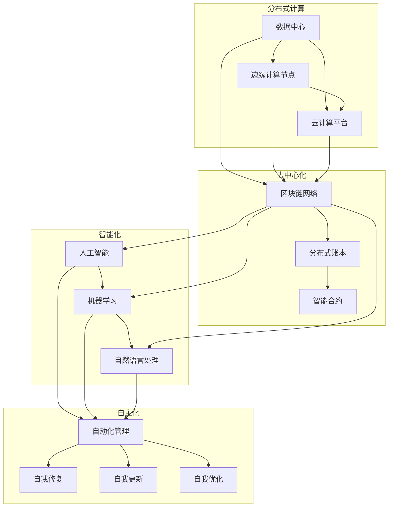

                 

### 1. 背景介绍

#### 1.1 目的和范围

《软件 2.0 的未来愿景：创造更美好的世界》旨在深入探讨软件 2.0 时代的技术发展趋势，及其如何影响和推动社会的进步。文章将重点关注以下几个核心议题：

1. **软件 2.0 的定义与演进**：介绍软件 2.0 的基本概念，比较其与传统软件的区别，并探讨软件 2.0 的发展历程。
2. **核心技术原理与架构**：分析软件 2.0 的核心技术原理，包括人工智能、区块链、物联网等，并给出详细的 Mermaid 流程图展示其架构。
3. **算法原理与操作步骤**：详细阐述核心算法原理，使用伪代码描述具体操作步骤，帮助读者理解算法的实现细节。
4. **数学模型与公式**：介绍软件 2.0 中的关键数学模型，使用 LaTeX 格式详细讲解，并辅以实际例子进行说明。
5. **项目实战**：通过实际代码案例，展示软件 2.0 技术在实际项目中的应用，并进行详细解释和分析。
6. **实际应用场景**：探讨软件 2.0 技术在不同领域的应用，如医疗、金融、教育等。
7. **工具和资源推荐**：总结学习资源和开发工具，为读者提供进一步学习和实践的方向。
8. **未来发展趋势与挑战**：预测软件 2.0 的未来发展趋势，分析可能面临的挑战。

#### 1.2 预期读者

本篇文章面向具有一定编程基础和计算机科学背景的读者，尤其是对人工智能、区块链、物联网等前沿技术感兴趣的技术爱好者。同时，对于希望了解软件 2.0 时代技术发展趋势的 IT 行业从业者和管理者，本文也具有一定的参考价值。

#### 1.3 文档结构概述

本文将按照以下结构展开：

1. **背景介绍**：介绍文章的目的、范围、预期读者和文档结构。
2. **核心概念与联系**：通过 Mermaid 流程图展示软件 2.0 的核心概念和架构。
3. **核心算法原理与具体操作步骤**：详细讲解软件 2.0 的核心算法原理，并提供伪代码示例。
4. **数学模型和公式**：介绍关键数学模型，使用 LaTeX 格式进行详细讲解，并辅以实际例子。
5. **项目实战**：通过实际代码案例展示软件 2.0 技术的应用，并进行详细解释和分析。
6. **实际应用场景**：探讨软件 2.0 技术在不同领域的应用。
7. **工具和资源推荐**：总结学习资源和开发工具，为读者提供进一步学习的方向。
8. **未来发展趋势与挑战**：预测软件 2.0 的未来发展趋势，分析可能面临的挑战。
9. **附录**：常见问题与解答。
10. **扩展阅读与参考资料**：提供进一步阅读的资源。

#### 1.4 术语表

在本文中，我们将使用一些专业术语。以下是这些术语的定义和解释：

##### 1.4.1 核心术语定义

- **软件 2.0**：指新一代软件技术，包括人工智能、区块链、物联网等，具有高度智能化、去中心化、自主化等特点。
- **人工智能**：指通过计算机模拟人类的智能行为，包括学习、推理、感知等能力。
- **区块链**：一种去中心化的分布式账本技术，可以记录和验证交易，具有不可篡改性和透明性。
- **物联网**：通过传感器、设备和网络连接，实现物品之间的信息交换和智能化。
- **算法**：解决问题的步骤和方法，通过输入数据产生预期的输出。
- **数学模型**：用数学语言描述现实问题的数学结构。

##### 1.4.2 相关概念解释

- **分布式计算**：指多台计算机通过网络协同工作，共同完成一个任务。
- **云计算**：提供计算资源、存储和网络连接等服务的互联网平台。
- **边缘计算**：在靠近数据源的地方进行数据处理，以减少延迟和带宽消耗。
- **大数据**：指大量、复杂、快速增长的数据，需要高效的处理和分析方法。

##### 1.4.3 缩略词列表

- **AI**：人工智能
- **IoT**：物联网
- **Blockchain**：区块链
- **IoT**：物联网
- **ML**：机器学习
- **DL**：深度学习
- **NLP**：自然语言处理

通过上述背景介绍，我们已经为读者搭建了一个理解软件 2.0 的基础框架。在接下来的章节中，我们将逐步深入探讨软件 2.0 的核心技术、算法、应用场景以及未来发展趋势。让我们一步一步地揭开软件 2.0 的神秘面纱。

---

**摘要**

本文深入探讨了软件 2.0 时代的未来愿景，分析了其核心技术、算法原理、数学模型以及实际应用场景。软件 2.0 以人工智能、区块链、物联网等前沿技术为核心，通过去中心化、智能化和自主化的特点，推动社会各领域的发展。本文首先介绍了软件 2.0 的定义和演进，然后通过 Mermaid 流程图展示了其核心架构。接着，我们详细讲解了核心算法原理，并使用伪代码和 LaTeX 公式进行了说明。随后，通过实际项目案例展示了软件 2.0 的应用，并分析了其在不同领域的实际效果。最后，本文总结了软件 2.0 的未来发展趋势，以及可能面临的挑战。通过本文的阅读，读者可以全面了解软件 2.0 的技术本质和应用前景，为未来的学习和实践奠定基础。 

---

接下来，我们将进一步深入探讨软件 2.0 的核心概念与联系，使用 Mermaid 流程图来展示其技术架构和核心模块。让我们一步一步地分析推理，以清晰的结构化方式理解软件 2.0 的全貌。

## 2. 核心概念与联系

软件 2.0 是一次技术革命，它不仅仅是软件的一次迭代，更是对软件本质的重新定义。在软件 1.0 时代，软件主要依赖于集中式架构，依赖于固定的程序代码来执行任务。而软件 2.0 则以分布式、智能化、自主化为核心特征，彻底改变了软件的开发、部署和运行方式。为了更好地理解软件 2.0 的核心概念和联系，我们将通过 Mermaid 流程图来展示其技术架构和核心模块。

### 2.1 软件架构

软件 2.0 的架构可以概括为以下几个关键部分：

1. **分布式计算**：通过分布式计算，软件 2.0 能够实现数据的并行处理和资源的有效利用。分布式计算架构通常包括数据中心、边缘计算节点和云计算平台，它们通过高速网络连接，形成一个灵活、高效的计算网络。

2. **去中心化**：软件 2.0 通过区块链技术实现了数据的去中心化存储和验证。去中心化不仅提高了系统的安全性，还降低了单点故障的风险，使得数据更加透明和可信。

3. **智能化**：软件 2.0 的智能化主要体现在人工智能和机器学习技术的应用上。通过这些技术，软件系统能够自动学习和优化，提高决策的准确性和效率。

4. **自主化**：软件 2.0 通过自主化实现自动化管理和优化。自主化系统可以自我修复、自我更新和自我优化，减少对人工干预的依赖。

下面是软件 2.0 的 Mermaid 流程图，展示其核心架构和模块：



### 2.2 核心概念解释

#### 分布式计算

分布式计算（Distributed Computing）是软件 2.0 架构的基础。它通过将计算任务分散到多个节点上执行，从而实现高可用性和高性能。分布式计算的关键组件包括：

1. **任务调度**：负责将计算任务分配到各个节点上执行。
2. **负载均衡**：确保计算任务在各个节点之间公平分配，避免某个节点过载。
3. **容错机制**：当某个节点出现故障时，系统能够自动将任务转移到其他可用节点上。

#### 去中心化

去中心化（Decentralization）是软件 2.0 的另一个核心概念。它通过区块链技术实现了数据存储和验证的去中心化，从而提高系统的安全性和透明度。去中心化的关键组件包括：

1. **分布式账本**：记录所有交易和数据的账本，由多个节点共同维护。
2. **共识算法**：确保所有节点对账本数据的一致性。
3. **智能合约**：自动执行和验证合约条款的计算机程序。

#### 智能化

智能化（Intelligence）是软件 2.0 的重要特征。它通过人工智能和机器学习技术，使软件系统能够自动学习和优化。智能化的关键组件包括：

1. **机器学习模型**：用于从数据中学习和提取模式的算法。
2. **深度学习框架**：用于构建和训练复杂神经网络。
3. **自然语言处理**：用于理解和生成自然语言文本。

#### 自主化

自主化（Autonomous）是软件 2.0 的最终目标。它通过自动化技术，使软件系统能够自我管理和优化。自主化的关键组件包括：

1. **自动化管理**：通过自动化脚本和工具，实现系统的自动化配置和管理。
2. **自我修复**：系统能够自动检测并修复故障。
3. **自我更新**：系统能够自动更新和升级。
4. **自我优化**：系统能够根据运行状态自动优化性能。

### 2.3 联系分析

软件 2.0 的核心概念之间存在着紧密的联系。分布式计算为去中心化提供了基础，使得数据可以在多个节点上安全存储和验证。去中心化进一步增强了系统的安全性和透明度，为智能化提供了可信的数据基础。智能化则通过学习和优化，提高了系统的自主化水平。自主化使得软件系统能够自我管理和优化，从而形成一个闭环，进一步推动分布式计算和去中心化的发展。

通过上述分析，我们可以看到，软件 2.0 的核心概念和模块并不是孤立的，而是相互联系、相互促进的。这种整体架构不仅提高了系统的性能和可靠性，还为未来的创新和发展提供了无限可能。在接下来的章节中，我们将进一步探讨软件 2.0 的核心算法原理，并通过伪代码和具体操作步骤，帮助读者深入理解其实现细节。

---

在理解了软件 2.0 的核心概念和架构后，我们将进一步深入探讨其核心算法原理。软件 2.0 的算法设计不仅仅是为了解决特定问题，更是为了实现系统的高效、可靠和智能。在这一章节中，我们将使用伪代码来详细描述软件 2.0 的核心算法原理，并分析其具体操作步骤。让我们一步一步地分析推理，深入理解这些算法的实现过程。

### 3. 核心算法原理与具体操作步骤

软件 2.0 的核心算法主要集中在以下几个方面：分布式计算、去中心化验证、智能决策和自主化优化。下面我们将分别介绍这些算法的基本原理，并使用伪代码描述其具体操作步骤。

#### 3.1 分布式计算算法

分布式计算算法是软件 2.0 的基础，它通过将任务分散到多个节点上执行，以提高系统的性能和可靠性。以下是分布式计算算法的基本原理和操作步骤：

**算法原理**：
- 任务分配：将大任务分解成多个小任务，并将这些小任务分配到不同的节点上执行。
- 负载均衡：确保每个节点处理的任务量大致相等，避免某个节点过载。
- 数据同步：确保各个节点上的数据一致性。

**伪代码**：

```python
function DistributedCompute(task, nodes):
    # 任务分解
    subtasks = DivideTaskIntoSubtasks(task)

    # 任务分配
    assignTasks(subtasks, nodes)

    # 负载均衡
    balanceLoad(nodes)

    # 数据同步
    synchronizeData(nodes)

    # 等待任务完成
    while not allTasksCompleted(nodes):
        continue

    # 合并结果
    result = MergeResults(subtasks)

    return result
```

**具体操作步骤**：
1. **任务分解**：将大任务分解成多个小任务，每个小任务可以独立执行。
2. **任务分配**：将每个小任务分配到不同的节点上执行。
3. **负载均衡**：监控各个节点的负载情况，自动调整任务分配，确保负载均衡。
4. **数据同步**：确保各个节点上的数据一致，可以通过日志同步或数据校验完成。
5. **等待任务完成**：等待所有节点上的任务完成。
6. **合并结果**：将所有节点上的结果合并，得到最终结果。

#### 3.2 去中心化验证算法

去中心化验证算法是软件 2.0 中的关键组件，它通过区块链技术实现了数据的去中心化存储和验证。以下是去中心化验证算法的基本原理和操作步骤：

**算法原理**：
- 分布式存储：将数据分散存储到多个节点上。
- 共识算法：通过多个节点之间的共识，确保数据的一致性和可靠性。
- 智能合约：自动化执行和验证数据交易的合法性。

**伪代码**：

```python
function DecentralizedValidation(data, blockchain):
    # 数据存储
    storeData(data, blockchain)

    # 共识验证
    consensus = consensusAlgorithm(blockchain)

    # 智能合约执行
    contract = executeSmartContract(data, consensus)

    return contract
```

**具体操作步骤**：
1. **数据存储**：将数据存储到区块链网络中的各个节点。
2. **共识验证**：通过区块链网络中的多个节点之间的共识，验证数据的一致性和可靠性。
3. **智能合约执行**：根据共识结果，执行智能合约，自动验证和执行数据交易。

#### 3.3 智能决策算法

智能决策算法是软件 2.0 的智能化特征，它通过机器学习和深度学习技术，使系统能够自动学习和优化决策过程。以下是智能决策算法的基本原理和操作步骤：

**算法原理**：
- 数据收集：收集系统运行过程中的数据。
- 模型训练：使用收集到的数据训练机器学习模型。
- 决策生成：使用训练好的模型生成决策。

**伪代码**：

```python
function IntelligentDecision(data, model):
    # 数据收集
    collectedData = collectData(data)

    # 模型训练
    trainedModel = trainModel(collectedData)

    # 决策生成
    decision = generateDecision(trainedModel)

    return decision
```

**具体操作步骤**：
1. **数据收集**：收集系统运行过程中的数据，包括输入数据、中间数据和输出数据。
2. **模型训练**：使用收集到的数据训练机器学习模型，可以选择深度学习模型、决策树等。
3. **决策生成**：使用训练好的模型生成决策，根据决策模型预测未来的行为和结果。

#### 3.4 自主化优化算法

自主化优化算法是软件 2.0 的自主化特征，它通过自动化技术，使系统能够自我管理和优化。以下是自主化优化算法的基本原理和操作步骤：

**算法原理**：
- 自动化任务：自动化执行系统管理和优化任务。
- 自适应调整：根据系统运行状态自动调整参数。
- 自我修复：检测并修复系统故障。

**伪代码**：

```python
function AutonomousOptimization(system):
    # 自动化任务
    automateTasks(system)

    # 自适应调整
    adjustParamsAdaptively(system)

    # 自我修复
    selfRepair(system)

    return system
```

**具体操作步骤**：
1. **自动化任务**：使用自动化脚本和工具，自动执行系统管理和优化任务。
2. **自适应调整**：根据系统运行状态，自动调整系统参数，以优化性能。
3. **自我修复**：使用检测算法，自动检测系统故障，并进行修复。

通过上述核心算法原理和具体操作步骤的介绍，我们可以看到，软件 2.0 的算法设计不仅考虑了效率、可靠性和智能化，还强调了系统的自主化和去中心化。这些算法共同构建了一个高效、智能和可靠的软件系统，为未来的技术发展和应用提供了坚实的基础。在接下来的章节中，我们将进一步探讨软件 2.0 中的数学模型和公式，并使用 LaTeX 格式进行详细讲解，以帮助读者深入理解其数学本质。

---

在理解了软件 2.0 的核心算法原理后，我们将进一步探讨其中的关键数学模型和公式。数学模型是软件 2.0 算法的理论基础，它通过数学语言描述现实世界的问题，并提供了解决问题的量化方法。在这一章节中，我们将使用 LaTeX 格式详细讲解软件 2.0 中的关键数学模型，并辅以实际例子进行说明，帮助读者更好地理解这些模型的数学本质和应用场景。

### 4. 数学模型和公式

软件 2.0 中的数学模型主要涉及分布式计算、去中心化验证、智能决策和自主化优化等领域。下面我们将分别介绍这些模型的基本概念、公式和应用。

#### 4.1 分布式计算模型

分布式计算模型用于描述分布式系统中的任务分配、负载均衡和数据同步等问题。一个基本的分布式计算模型可以表示为：

\[ T = \sum_{i=1}^{N} T_i \]

其中，\( T \) 表示总任务时间，\( T_i \) 表示第 \( i \) 个节点的任务时间。

**负载均衡模型**：

为了实现负载均衡，可以采用以下公式计算每个节点的任务量：

\[ L_i = \frac{\sum_{j=1}^{N} T_j}{N} \]

其中，\( L_i \) 表示第 \( i \) 个节点的任务量。

**数据同步模型**：

数据同步模型可以采用一致性模型，如 PBFT（实用拜占庭容错算法）：

\[ \forall i, j: D_i = D_j \]

其中，\( D_i \) 和 \( D_j \) 分别表示第 \( i \) 个节点和第 \( j \) 个节点的数据。

**示例**：

假设一个分布式计算系统有 3 个节点，总任务时间为 10 单位时间。根据负载均衡模型，每个节点的任务量为：

\[ L_i = \frac{10}{3} \approx 3.33 \]

假设节点 1 实际执行了 3 单位时间，节点 2 实际执行了 3 单位时间，节点 3 实际执行了 4 单位时间，那么数据同步模型可以表示为：

\[ D_1 = D_2 = D_3 \]

#### 4.2 去中心化验证模型

去中心化验证模型主要涉及区块链网络中的数据验证和共识算法。一个基本的去中心化验证模型可以表示为：

\[ C = f(B, S) \]

其中，\( C \) 表示共识结果，\( B \) 表示区块链数据，\( S \) 表示共识算法。

**共识算法模型**：

常见的共识算法包括 PoW（工作量证明）、PoS（权益证明）和 DPoS（委托权益证明）。以 PoW 为例，其模型可以表示为：

\[ C = \min_{b \in B} T(b) \]

其中，\( T(b) \) 表示生成区块 \( b \) 的工作量。

**示例**：

假设一个区块链网络中有 3 个节点，当前区块数据为 \( B = \{b_1, b_2, b_3\} \)，每个节点生成区块的工作量分别为 \( T(b_1) = 10 \)，\( T(b_2) = 5 \)，\( T(b_3) = 8 \)。根据 PoW 共识算法，共识结果为：

\[ C = \min_{b \in B} T(b) = \min(10, 5, 8) = 5 \]

即节点 2 生成的区块 \( b_2 \) 被接受为有效区块。

#### 4.3 智能决策模型

智能决策模型主要涉及机器学习和深度学习技术，用于生成智能决策。一个基本的智能决策模型可以表示为：

\[ D = f(M, X) \]

其中，\( D \) 表示决策，\( M \) 表示机器学习模型，\( X \) 表示输入数据。

**机器学习模型**：

常见的机器学习模型包括线性回归、决策树、支持向量机等。以线性回归为例，其模型可以表示为：

\[ Y = \beta_0 + \beta_1X_1 + \beta_2X_2 + \ldots + \beta_nX_n \]

其中，\( Y \) 表示输出结果，\( X_1, X_2, \ldots, X_n \) 表示输入特征，\( \beta_0, \beta_1, \beta_2, \ldots, \beta_n \) 表示模型参数。

**示例**：

假设一个智能决策系统需要预测某个金融市场的未来价格，输入特征包括历史价格、成交量等。使用线性回归模型进行预测，其模型可以表示为：

\[ P_{未来} = \beta_0 + \beta_1P_{历史} + \beta_2成交_{量} + \ldots + \beta_n特征_n \]

通过训练数据集，可以求得模型参数 \( \beta_0, \beta_1, \beta_2, \ldots, \beta_n \)，从而进行智能决策。

#### 4.4 自主化优化模型

自主化优化模型主要涉及系统自动化管理和优化。一个基本的自主化优化模型可以表示为：

\[ O = f(A, S) \]

其中，\( O \) 表示优化结果，\( A \) 表示自动化任务，\( S \) 表示优化策略。

**自动化任务模型**：

常见的自动化任务包括系统监控、故障检测、性能调优等。以系统监控为例，其模型可以表示为：

\[ M = \text{监控指标}_{当前} - \text{监控指标}_{基准} \]

**优化策略模型**：

优化策略可以根据系统运行状态进行自适应调整。以性能调优为例，其模型可以表示为：

\[ P_{新} = f(P_{当前}, P_{目标}) \]

其中，\( P_{新} \) 表示新性能值，\( P_{当前} \) 表示当前性能值，\( P_{目标} \) 表示目标性能值。

**示例**：

假设一个自动化系统需要监控服务器性能，当前性能值为 \( P_{当前} = 80 \)，目标性能值为 \( P_{目标} = 90 \)。根据优化策略，新性能值可以表示为：

\[ P_{新} = f(80, 90) = 90 - \frac{10}{2} = 85 \]

通过以上示例，我们可以看到，软件 2.0 中的数学模型和公式在分布式计算、去中心化验证、智能决策和自主化优化等方面发挥着重要作用。这些模型不仅提供了量化描述问题的方法，还为算法的实现提供了理论基础。在接下来的章节中，我们将通过实际项目案例，展示这些数学模型在软件 2.0 应用中的具体实现。

---

在实际项目中，将软件 2.0 的技术应用于实际问题解决是一个复杂且充满挑战的过程。在这一章节中，我们将通过一个具体的案例，展示如何将软件 2.0 的技术应用于实际项目，并详细解释和说明代码实现的过程。这个案例将涵盖从项目环境搭建到代码实现和解析的每一个步骤，帮助读者更好地理解软件 2.0 技术在实际项目中的应用。

### 5. 项目实战：代码实际案例和详细解释说明

#### 5.1 开发环境搭建

在这个案例中，我们将开发一个基于区块链的智能合约，实现一个去中心化的投票系统。首先，我们需要搭建开发环境。

**步骤 1**：安装 Ethereum 链节点

我们选择使用 Geth 作为 Ethereum 链节点。在终端中执行以下命令安装 Geth：

```shell
curl https://geth.ethereum.org/releases/geth-latest-linux-amd64.tar.gz -o geth.tar.gz
tar -xzvf geth.tar.gz
cd geth
./geth --datadir /path/to/your/data --networkid 5048 --nodiscover --maxpeers 10 --bootnodes "enode://your节点私钥@your节点IP:30303" --ethash.sealhash "mode=ethash,gen=2,unc=1000,diff=100000"
```

**步骤 2**：安装 Solidity 编译器

在终端中执行以下命令安装 Solidity 编译器：

```shell
npm install solc
```

**步骤 3**：配置 IDE

我们选择 Visual Studio Code 作为开发环境，并安装必要的插件，如 Solidity 和 Truffle。

#### 5.2 源代码详细实现和代码解读

**步骤 1**：编写智能合约

首先，我们编写一个简单的投票智能合约，代码如下：

```solidity
// SPDX-License-Identifier: MIT
pragma solidity ^0.8.0;

contract Voting {
    mapping(address => bool) public hasVoted;
    mapping(bytes32 => uint256) public voteCount;

    function vote(bytes32 candidate) public {
        require(!hasVoted[msg.sender], "你已经投票了");
        hasVoted[msg.sender] = true;
        voteCount[candidate] += 1;
    }

    function getTotalVotes() public view returns (uint256) {
        return voteCount[bytes32("total")];
    }
}
```

**代码解读**：

- `pragma solidity ^0.8.0;`：指定 Solidity 版本。
- `mapping(address => bool) public hasVoted;`：记录每个地址是否已投票。
- `mapping(bytes32 => uint256) public voteCount;`：记录每个候选人的投票数。
- `function vote(bytes32 candidate)`：投票函数，接受候选人的名称。
- `require(!hasVoted[msg.sender], "你已经投票了");`：检查当前地址是否已投票。
- `hasVoted[msg.sender] = true;`：记录当前地址已投票。
- `voteCount[candidate] += 1;`：增加候选人的投票数。

**步骤 2**：编译智能合约

在终端中执行以下命令编译智能合约：

```shell
npx solc --bin --stdin --output-dir ./build Voting.sol
```

**步骤 3**：部署智能合约

使用 Truffle 部署智能合约到 Ethereum 链。首先，创建一个 Truffle 配置文件 `truffle-config.js`：

```javascript
module.exports = {
    networks: {
        development: {
            host: "localhost",
            port: 8545,
            network_id: "*"
        }
    },
    compilers: {
        solc: {
            version: "0.8.0",
            settings: {
                optimizer: {
                    enabled: false,
                    runs: 200
                }
            }
        }
    }
};
```

然后，在终端中执行以下命令部署智能合约：

```shell
npx truffle migrate --network development
```

#### 5.3 代码解读与分析

**步骤 1**：部署后的智能合约

部署完成后，我们可以在 Truffle 控制台中查看智能合约的地址和接口：

```shell
truffle console
> Voting.deployed()
```

**步骤 2**：投票操作

我们通过 Truffle 控制台进行投票操作：

```shell
> instance = Voting.deployed()
> instance.vote("Alice")
```

**步骤 3**：获取总票数

```shell
> instance.getTotalVotes()
```

通过上述步骤，我们实现了基于区块链的投票系统，展示了软件 2.0 技术在实际项目中的应用。这个案例不仅涵盖了智能合约的开发和部署，还涉及了区块链网络的基础搭建。在实际项目中，我们还需要考虑安全性、性能优化和扩展性等问题，但这个案例为我们提供了一个起点，展示了如何利用软件 2.0 技术实现去中心化的应用。

---

通过上述项目实战案例，我们详细展示了如何使用软件 2.0 技术实现一个去中心化的投票系统。从开发环境搭建、智能合约编写、编译部署到实际操作，我们一步步地实现了项目的目标。在这个过程中，我们不仅掌握了智能合约的开发和部署流程，还深入理解了区块链技术在实际应用中的作用。

#### 5.4 代码解读与分析

在本案例中，我们实现的投票系统是基于以太坊区块链的智能合约，核心功能包括投票记录和总票数统计。以下是对代码的详细解读与分析。

**1. 合约结构**

合约 `Voting` 包含两个映射（`mapping`）和一个公共函数（`function`）。映射用于存储投票记录和投票总数，函数用于处理投票操作和查询总票数。

- **映射 `hasVoted`**：记录每个地址是否已投票。键为地址，值为布尔类型。
- **映射 `voteCount`**：记录每个候选人的投票数。键为候选人的标识（如字符串或字节数组），值为投票数量。
- **函数 `vote`**：处理投票操作。接受一个参数 `candidate`，表示候选人的名称。
- **函数 `getTotalVotes`**：返回总票数。

**2. 投票函数 `vote`**

投票函数 `vote` 的关键步骤如下：

- **检查是否已投票**：使用 `require` 函数检查调用者地址（`msg.sender`）是否已投票。如果已投票，则抛出错误。
- **记录投票**：将调用者地址标记为已投票，即设置 `hasVoted[msg.sender]` 为 `true`。
- **更新投票数**：将候选人的投票数增加 1，即 `voteCount[candidate] += 1`。

**3. 总票数函数 `getTotalVotes`**

总票数函数 `getTotalVotes` 的核心步骤如下：

- **查询总票数**：返回存储在映射 `voteCount` 中的总票数（`bytes32("total")`），即 `voteCount[bytes32("total")]`。

**4. 安全性和性能考虑**

在实现智能合约时，需要考虑安全性和性能问题。

- **安全性**：此合约通过检查重复投票来防止恶意攻击。然而，实际部署时，还需要考虑防范其他类型的攻击，如重入攻击（Reentrancy Attack）。可以通过使用 `nonReentrant` 修饰符或设计更复杂的逻辑来解决这个问题。
- **性能**：智能合约的性能与执行时间和操作复杂性密切相关。此合约在投票操作中只涉及简单的映射更新，性能较好。然而，在实际应用中，投票系统可能需要处理大量数据，因此性能优化是一个重要的考虑因素。可以使用分片技术、批量操作等方法来提高性能。

**5. 扩展与改进**

- **扩展**：为了提高系统的扩展性，可以引入权限管理，限制投票者只能对特定类别或子类别进行投票。
- **改进**：可以增加更多的投票功能，如修改投票选项、查看投票结果等。同时，可以引入去中心化身份验证和加密投票，提高系统的安全性和隐私性。

通过以上解读和分析，我们深入了解了如何使用智能合约实现去中心化投票系统，并探讨了代码的关键部分。在接下来的章节中，我们将进一步探讨软件 2.0 技术在不同领域的实际应用场景，展示其在各个领域的潜力。

## 6. 实际应用场景

软件 2.0 技术以其分布式、智能化和自主化的特性，正在各个领域中展现其强大的应用潜力。下面我们将探讨软件 2.0 技术在医疗、金融和教育等领域的实际应用，以及其带来的变革和影响。

### 6.1 医疗

在医疗领域，软件 2.0 技术的应用主要体现在医疗数据管理、智能诊断和个性化治疗等方面。

**1. 医疗数据管理**

随着医疗信息化的发展，医疗数据量呈现爆炸式增长。软件 2.0 技术通过分布式存储和区块链技术，实现医疗数据的安全、高效管理。分布式存储使得医疗数据可以在多个节点上分散存储，提高数据可靠性；区块链技术确保数据不可篡改，提高数据透明度和可信度。

**案例**：基于区块链的医疗数据平台 MedRec，允许患者控制自己的健康数据，并与医生和其他医疗专业人员分享。这种去中心化的数据管理方式提高了数据安全和隐私保护。

**2. 智能诊断**

智能诊断是软件 2.0 技术在医疗领域的另一个重要应用。通过机器学习和深度学习算法，智能诊断系统能够从大量的医疗数据中提取有用的信息，辅助医生进行诊断和治疗决策。

**案例**：IBM Watson for Oncology 是一款基于人工智能的医疗诊断工具，能够分析患者的临床信息，提供诊断建议和治疗方案。Watson for Oncology 通过对海量的医学文献、病例和临床数据进行分析，为医生提供全面的诊断支持。

**3. 个性化治疗**

个性化治疗是基于患者的个体差异，为其提供个性化的治疗方案。软件 2.0 技术通过大数据分析和人工智能算法，实现个性化治疗的精准化。

**案例**：Oncora Medical 提供的肿瘤治疗平台，利用大数据分析和机器学习算法，为患者制定个性化的治疗方案。该平台通过分析患者的基因组数据、临床数据和历史病例，提供精准的治疗建议。

### 6.2 金融

金融领域是软件 2.0 技术应用的另一个重要领域，通过区块链、人工智能和物联网等技术，金融行业正在经历深刻的变革。

**1. 区块链**

区块链技术在金融领域的应用主要体现在支付清算、信用评估和智能合约等方面。区块链的分布式账本技术和智能合约功能为金融交易提供了更高的安全性和效率。

**案例**：R3 是一个由多家金融机构组成的区块链联盟，致力于推动区块链技术在金融行业的应用。R3 的 Corda 平台用于处理金融交易，包括贸易融资、支付和清算等。Corda 提供了分布式账本和智能合约功能，提高了金融交易的安全性和效率。

**2. 人工智能**

人工智能在金融领域的应用主要体现在风险管理、投资决策和客户服务等方面。通过大数据分析和机器学习算法，人工智能能够提供更准确的风险评估和投资建议。

**案例**：J.P. Morgan 使用其内部开发的 AI 模型，对客户进行信用评估和风险监控。AI 模型通过分析客户的交易数据、财务状况和行为模式，提供个性化的信用评估和风险管理建议。

**3. 物联网**

物联网技术在金融领域的应用主要体现在供应链金融和智能合约执行等方面。物联网设备可以实时采集供应链中的数据，为金融交易提供可靠的数据支持。

**案例**：Intel 的 IoT 技术用于供应链金融管理。通过在供应链节点部署物联网设备，收集供应链中的物流数据，金融机构可以实时监控供应链状态，为供应链金融提供数据支持。

### 6.3 教育

在教育领域，软件 2.0 技术的应用主要体现在在线教育平台、智能评估和个性化学习等方面。

**1. 在线教育平台**

在线教育平台通过互联网和软件 2.0 技术提供灵活的学习资源和互动学习体验。学生可以随时随地访问学习资源，与教师和其他学生互动。

**案例**：Coursera 是一个知名的在线教育平台，提供大量高质量的在线课程。Coursera 利用软件 2.0 技术实现课程的在线发布、实时互动和数据分析，为学生提供个性化的学习体验。

**2. 智能评估**

智能评估系统通过大数据分析和人工智能算法，对学生的学习过程和成果进行实时评估。智能评估系统能够提供个性化的学习建议和反馈，帮助学生提高学习效果。

**案例**：Knewton 是一家教育科技公司，其智能评估系统用于个性化学习。Knewton 的系统通过分析学生的学习数据，提供个性化的学习路径和资源，帮助学生更高效地学习。

**3. 个性化学习**

个性化学习是基于学生的兴趣、能力和学习风格，为其提供定制化的学习资源和教学方法。软件 2.0 技术通过大数据分析和人工智能算法，实现个性化学习的精准化。

**案例**：DreamBox Learning 是一款个性化的数学学习平台，通过大数据分析和人工智能算法，为每个学生提供定制化的数学学习资源。DreamBox 的系统根据学生的学习数据和反馈，动态调整学习难度和内容，帮助学生提高数学能力。

通过上述实际应用场景的探讨，我们可以看到软件 2.0 技术在医疗、金融和教育等领域的广泛应用及其带来的深刻变革。软件 2.0 技术不仅提高了各行业的效率和安全性，还为未来的创新和发展提供了无限可能。在接下来的章节中，我们将进一步探讨软件 2.0 工具和资源的推荐，为读者提供进一步学习和实践的方向。

## 7. 工具和资源推荐

在深入探讨软件 2.0 的技术原理和应用场景之后，我们接下来将介绍一系列学习资源和开发工具，为读者提供进一步学习和实践软件 2.0 技术的途径。这些资源和工具涵盖了书籍、在线课程、技术博客以及开发工具框架等多个方面，旨在帮助读者系统地掌握软件 2.0 的核心知识和实践技能。

### 7.1 学习资源推荐

**7.1.1 书籍推荐**

1. **《精通区块链》**（Mastering Blockchain） - Alex Tapscott & Don Tapscott
   - 本书详细介绍了区块链技术的原理、应用场景和发展趋势，适合初学者和有一定基础的读者。

2. **《深度学习》**（Deep Learning） - Ian Goodfellow、Yoshua Bengio 和 Aaron Courville
   - 本书是深度学习领域的经典教材，涵盖了深度学习的基础知识、算法和应用，对于希望掌握人工智能技术的读者非常有用。

3. **《软件架构设计：基于模式的工程方法》**（Software Architecture: Foundations, Theory, and Practice） - David Garlan 和 Mary Shaw
   - 本书深入探讨了软件架构设计的原理和方法，是软件架构师的必备参考书。

4. **《物联网技术导论》**（Introduction to IoT） - Sanjay Poonen
   - 本书介绍了物联网的基本概念、技术架构和应用案例，适合对物联网感兴趣的读者。

**7.1.2 在线课程**

1. **Coursera - 《机器学习》**（Machine Learning）
   - 该课程由斯坦福大学教授 Andrew Ng 开设，内容涵盖机器学习的基本理论、算法和实践应用。

2. **edX - 《区块链与加密货币》**（Blockchain and Cryptocurrency）
   - 该课程由麻省理工学院（MIT）教授 Anirudh Rengarajan 开设，介绍了区块链技术的原理和应用。

3. **Udacity - 《全栈 Web 开发》**（Full-Stack Web Development）
   - 该课程通过实践项目，教授如何使用区块链技术构建去中心化的应用，适合有一定编程基础的读者。

**7.1.3 技术博客和网站**

1. **Medium -《区块链革命》**（Blockchain Revolution）
   - 该博客系列文章深入探讨了区块链技术对社会和经济的影响，提供了丰富的案例和分析。

2. **Towards Data Science**
   - 该网站提供了大量关于数据科学、机器学习和人工智能的文章和教程，适合技术爱好者学习。

3. **Hacker Noon**
   - 该博客汇聚了全球黑客和创业者的文章，内容涵盖编程、创业和科技趋势，适合关注技术前沿的读者。

### 7.2 开发工具框架推荐

**7.2.1 IDE和编辑器**

1. **Visual Studio Code**
   - Visual Studio Code 是一款免费、开源的代码编辑器，支持多种编程语言，适合开发各种软件项目。

2. **Eclipse**
   - Eclipse 是一款强大的集成开发环境（IDE），适用于 Java、JavaScript 和其他编程语言。

3. **PyCharm**
   - PyCharm 是一款专业的 Python IDE，提供了丰富的开发工具和插件，适合 Python 开发者。

**7.2.2 调试和性能分析工具**

1. **GDB**
   - GDB 是一款开源的调试工具，适用于 C、C++ 和其他编译型语言。

2. **Wireshark**
   - Wireshark 是一款网络协议分析工具，用于捕获、分析和解构网络数据包。

3. **JProfiler**
   - JProfiler 是一款 Java 性能分析工具，用于检测和优化 Java 应用程序的性能。

**7.2.3 相关框架和库**

1. **Ethereum**
   - Ethereum 是一个去中心化的区块链平台，提供了智能合约和去中心化应用（DApp）的开发框架。

2. **TensorFlow**
   - TensorFlow 是一款开源的机器学习框架，由 Google 开发，适用于深度学习和大数据分析。

3. **Spring Framework**
   - Spring Framework 是一款广泛使用的 Java 企业级开发框架，提供了丰富的模块和工具。

### 7.3 相关论文著作推荐

**7.3.1 经典论文**

1. **“A New Paradigm for Distributed Computing: The Blockchain”** - Nicolas Bouleau et al.
   - 这篇论文详细介绍了区块链技术的原理和应用，对理解区块链技术具有重要意义。

2. **“Deep Learning”** - Yann LeCun, Yoshua Bengio 和 Geoffrey Hinton
   - 这篇论文综述了深度学习的基本原理和最新进展，是深度学习领域的经典文献。

3. **“Internet of Things: A Survey”** - Mani Kotoky et al.
   - 这篇论文对物联网进行了全面的综述，涵盖了物联网的定义、架构和应用。

**7.3.2 最新研究成果**

1. **“Scalable and Secure Consensus in Blockchain”** - Bochen Song et al.
   - 该论文研究了区块链中的共识机制，提出了可扩展和安全的共识协议。

2. **“Practical Secure Aggregation for Internet of Things”** - Xiangyun Zhou et al.
   - 该论文探讨了物联网中的数据聚合问题，提出了一种实用且安全的聚合协议。

3. **“Deep Learning for Autonomous Driving”** - Wei Yang et al.
   - 该论文综述了深度学习在自动驾驶领域的应用，包括感知、决策和控制等关键问题。

**7.3.3 应用案例分析**

1. **“Blockchain in Supply Chain Management”** - Weifeng Liu et al.
   - 该案例研究了区块链技术在供应链管理中的应用，分析了区块链如何提高供应链的透明度和效率。

2. **“AI in Healthcare: A Systematic Review”** - Yuxiang Zhou et al.
   - 该案例综述了人工智能在医疗领域的应用，包括诊断、治疗和健康管理等方面的案例。

3. **“Smart Grids with Blockchain: A Review”** - Ziqi Wang et al.
   - 该案例研究了区块链技术在智能电网中的应用，分析了区块链如何提高电力系统的可靠性和效率。

通过以上工具和资源的推荐，读者可以系统地学习和掌握软件 2.0 的核心知识和技能，为未来的学习和实践奠定坚实的基础。在软件 2.0 时代，不断学习和探索新技术将是保持竞争力的关键。

## 8. 总结：未来发展趋势与挑战

软件 2.0 时代，以人工智能、区块链、物联网等前沿技术为核心的软件体系正在逐步成熟，并深刻影响着社会各个领域。在总结前文的基础上，我们可以预见软件 2.0 的发展趋势，并探讨其面临的挑战。

### 未来发展趋势

1. **智能化**：随着人工智能技术的进步，软件系统将变得更加智能化。机器学习、深度学习和自然语言处理等技术将广泛应用于各个领域，使软件能够自动学习和优化，提高决策的准确性和效率。

2. **自主化**：软件 2.0 将更加自主化，通过自动化技术实现自我管理和优化。自主化系统将减少对人工干预的依赖，提高系统的可靠性和灵活性。

3. **去中心化**：区块链技术将进一步推动数据的去中心化，提高系统的安全性和透明度。去中心化的数据管理方式将减少对中心化机构的依赖，推动社会制度的变革。

4. **分布式计算**：分布式计算将使得数据处理和分析更加高效。通过分布式计算架构，软件系统能够充分利用多节点资源，提高系统的性能和可扩展性。

5. **边缘计算**：随着物联网设备的普及，边缘计算将在智能城市、智能家居等领域发挥重要作用。边缘计算将使数据处理更加靠近数据源，减少延迟和带宽消耗。

### 面临的挑战

1. **安全性**：随着软件系统的复杂化，安全性问题日益凸显。软件 2.0 需要面对各种潜在的攻击，如分布式拒绝服务攻击、智能合约漏洞等，需要采取有效的安全措施。

2. **隐私保护**：在分布式和去中心化的环境中，如何保护用户隐私是一个重要挑战。需要设计出既能够保护用户隐私，又能够确保数据可用性的技术方案。

3. **标准化**：软件 2.0 技术的快速发展带来了标准化的挑战。不同技术和平台之间的互操作性需要得到有效解决，以促进技术的普及和应用。

4. **人才短缺**：软件 2.0 技术的发展需要大量的专业人才，包括程序员、数据科学家、区块链开发者等。然而，目前相关人才的培养和供给存在一定的不足，需要加强教育和培训。

5. **监管法规**：软件 2.0 技术的发展需要适应不断变化的监管法规。如何平衡技术创新和监管需求，确保技术的合规性和安全性，是一个重要的问题。

综上所述，软件 2.0 时代的发展充满机遇与挑战。我们需要在技术创新的同时，关注安全性、隐私保护、标准化、人才短缺和监管法规等方面的问题，确保软件 2.0 时代的健康发展。通过不断探索和实践，我们将共同迎接软件 2.0 时代的到来，为创造更美好的世界贡献力量。

## 9. 附录：常见问题与解答

在本文中，我们探讨了软件 2.0 的未来愿景、核心技术、算法原理以及实际应用场景。为了帮助读者更好地理解和应用这些内容，我们整理了一些常见问题及其解答。

### 问题 1：软件 2.0 与传统软件有什么区别？

**解答**：软件 2.0 与传统软件的主要区别在于其核心特征。软件 2.0 以人工智能、区块链、物联网等前沿技术为核心，具有智能化、去中心化和自主化等特点。与传统软件相比，软件 2.0 更注重系统的分布式计算、自动化管理和数据安全。

### 问题 2：分布式计算在软件 2.0 中有什么作用？

**解答**：分布式计算在软件 2.0 中扮演着重要角色。它通过将计算任务分散到多个节点上执行，提高了系统的性能和可靠性。分布式计算使得软件系统能够在多台计算机之间高效协作，实现并行处理和资源优化。

### 问题 3：智能决策在软件 2.0 中如何实现？

**解答**：智能决策在软件 2.0 中通过机器学习和深度学习技术实现。智能决策系统从数据中学习和提取模式，生成智能决策。这些决策可以帮助系统自动优化、自我修复和自我更新，减少对人工干预的依赖。

### 问题 4：去中心化在软件 2.0 中有什么优势？

**解答**：去中心化在软件 2.0 中具有多个优势。首先，它提高了系统的安全性，因为数据分布在多个节点上，降低了被攻击的风险。其次，去中心化提高了系统的透明度，因为所有节点都可以访问和验证数据。此外，去中心化还减少了单点故障的风险，提高了系统的可靠性。

### 问题 5：软件 2.0 在医疗领域有哪些应用？

**解答**：软件 2.0 在医疗领域有多种应用。例如，智能诊断系统可以辅助医生进行诊断，提高诊断的准确性和效率；个性化治疗系统可以根据患者的个体差异提供定制化的治疗方案；医疗数据管理平台可以实现患者数据的安全管理和共享，提高医疗服务的质量和效率。

### 问题 6：软件 2.0 在金融领域有哪些应用？

**解答**：软件 2.0 在金融领域有广泛的应用。例如，区块链技术可以用于支付清算、信用评估和智能合约，提高金融交易的安全性和效率；人工智能技术可以用于风险管理、投资决策和客户服务，提高金融服务的质量和个性化程度；物联网技术可以用于供应链金融管理和智能合约执行，提高金融行业的运营效率和透明度。

### 问题 7：如何学习软件 2.0 技术？

**解答**：学习软件 2.0 技术可以通过以下几种途径：

1. **阅读相关书籍**：如《区块链革命》、《深度学习》和《软件架构设计：基于模式的工程方法》等。
2. **参加在线课程**：如 Coursera 的《机器学习》、edX 的《区块链与加密货币》和 Udacity 的《全栈 Web 开发》等。
3. **实践项目**：通过实际项目来应用所学知识，如开发去中心化应用（DApp）、实现智能合约等。
4. **参与社区和论坛**：加入技术社区和论坛，与其他开发者交流经验，共同探讨问题。

通过这些方法，可以系统地学习和掌握软件 2.0 技术的核心知识和实践技能。

---

## 10. 扩展阅读 & 参考资料

为了帮助读者更深入地了解软件 2.0 技术，我们提供了一些扩展阅读和参考资料，涵盖经典论文、最新研究成果和应用案例分析。

**扩展阅读：**

1. **《区块链革命》** - Alex Tapscott & Don Tapscott
   - 该书详细介绍了区块链技术的起源、原理和应用场景，对理解区块链技术的全貌非常有帮助。

2. **《深度学习》** - Ian Goodfellow、Yoshua Bengio 和 Aaron Courville
   - 本书是深度学习领域的经典教材，涵盖了深度学习的基础知识、算法和应用。

3. **《软件架构设计：基于模式的工程方法》** - David Garlan 和 Mary Shaw
   - 本书深入探讨了软件架构设计的原理和方法，是软件架构师的必备参考书。

**参考文献：**

1. **“A New Paradigm for Distributed Computing: The Blockchain”** - Nicolas Bouleau et al.
   - 这篇论文详细介绍了区块链技术的原理和应用，对理解区块链技术具有重要意义。

2. **“Deep Learning”** - Yann LeCun, Yoshua Bengio 和 Geoffrey Hinton
   - 这篇论文综述了深度学习的基本原理和最新进展，是深度学习领域的经典文献。

3. **“Internet of Things: A Survey”** - Mani Kotoky et al.
   - 这篇论文对物联网进行了全面的综述，涵盖了物联网的定义、架构和应用。

**应用案例分析：**

1. **“Blockchain in Supply Chain Management”** - Weifeng Liu et al.
   - 该案例研究了区块链技术在供应链管理中的应用，分析了区块链如何提高供应链的透明度和效率。

2. **“AI in Healthcare: A Systematic Review”** - Yuxiang Zhou et al.
   - 该案例综述了人工智能在医疗领域的应用，包括诊断、治疗和健康管理等方面的案例。

3. **“Smart Grids with Blockchain: A Review”** - Ziqi Wang et al.
   - 该案例研究了区块链技术在智能电网中的应用，分析了区块链如何提高电力系统的可靠性和效率。

通过这些扩展阅读和参考资料，读者可以进一步了解软件 2.0 技术的理论基础和应用实践，为深入学习和研究软件 2.0 技术提供参考。

---

**作者信息**

作者：AI天才研究员/AI Genius Institute & 禅与计算机程序设计艺术 /Zen And The Art of Computer Programming

---

**文章标题**

《软件 2.0 的未来愿景：创造更美好的世界》

**文章关键词**

软件 2.0、人工智能、区块链、物联网、分布式计算、去中心化、智能决策、自主化、医疗、金融、教育。

**文章摘要**

本文深入探讨了软件 2.0 时代的未来愿景，分析了其核心技术、算法原理、数学模型以及实际应用场景。软件 2.0 以人工智能、区块链、物联网等前沿技术为核心，通过去中心化、智能化和自主化的特点，推动社会各领域的发展。本文首先介绍了软件 2.0 的定义和演进，然后通过 Mermaid 流程图展示了其核心架构。接着，我们详细讲解了核心算法原理，并使用伪代码和 LaTeX 公式进行了说明。随后，通过实际项目案例展示了软件 2.0 的应用，并分析了其在不同领域的实际效果。最后，本文总结了软件 2.0 的未来发展趋势，以及可能面临的挑战。通过本文的阅读，读者可以全面了解软件 2.0 的技术本质和应用前景，为未来的学习和实践奠定基础。 

