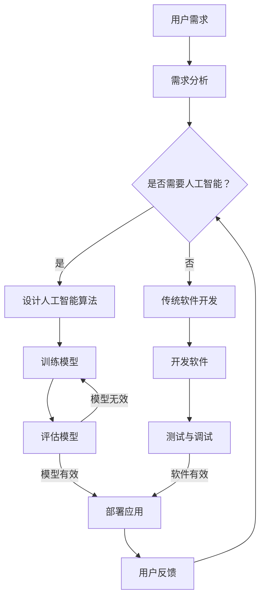

                 

# 软件二零的未来愿景：创造更美好的世界

> **关键词**：软件二零、未来愿景、人工智能、技术进步、人类福祉
> 
> **摘要**：本文将探讨软件二零时代的技术趋势和未来愿景，分析其对人类社会的潜在影响。我们将逐步深入探讨软件二零的核心概念、算法原理、数学模型及其应用场景，最终总结其发展趋势与面临的挑战。通过这一系列的分析，我们希望激发读者对软件二零时代的思考，共同探索如何通过技术进步创造一个更美好的世界。

## 1. 背景介绍

### 1.1 目的和范围

本文旨在探讨软件二零（Software 2.0）的概念、技术发展趋势及其对未来社会的潜在影响。我们将通过逐步深入的分析，从多个角度探讨软件二零的核心概念、算法原理、数学模型和应用场景，以期为您呈现一幅关于软件二零未来的愿景。

### 1.2 预期读者

本文主要面向对计算机科学、人工智能和技术进步感兴趣的读者，尤其是从事软件开发、研究或投资等相关领域的人员。同时，我们也希望本文能引起普通读者的思考，激发他们对未来科技的期待和探索。

### 1.3 文档结构概述

本文结构如下：

1. **背景介绍**：介绍本文的目的、预期读者和文档结构。
2. **核心概念与联系**：介绍软件二零的核心概念，并使用 Mermaid 流程图展示其架构。
3. **核心算法原理与具体操作步骤**：详细阐述软件二零的核心算法原理，并使用伪代码展示具体操作步骤。
4. **数学模型和公式**：介绍软件二零中的数学模型和公式，并进行详细讲解和举例说明。
5. **项目实战**：通过实际代码案例，展示软件二零的应用场景和具体实现。
6. **实际应用场景**：探讨软件二零在实际应用中的可能场景。
7. **工具和资源推荐**：推荐相关学习资源、开发工具和框架。
8. **总结**：总结软件二零的未来发展趋势与挑战。
9. **附录**：提供常见问题与解答。
10. **扩展阅读与参考资料**：列出本文引用的参考资料。

### 1.4 术语表

#### 1.4.1 核心术语定义

- **软件二零**：指的是下一代软件技术，以人工智能为核心，实现智能化、自动化和高效化的软件开发。
- **人工智能**：模拟人类智能行为的计算机系统，包括学习、推理、感知、理解和决策等能力。
- **机器学习**：一种人工智能的分支，通过数据训练模型，使计算机能够自动完成特定任务。
- **深度学习**：一种机器学习的技术，通过多层神经网络模拟人脑处理信息的过程。

#### 1.4.2 相关概念解释

- **算法**：解决问题的步骤和规则，用于指导计算机执行特定任务。
- **框架**：用于简化软件开发和部署的工具集，提供预定义的组件和接口。
- **云计算**：通过网络提供可扩展的计算资源，按需分配和付费。

#### 1.4.3 缩略词列表

- **AI**：人工智能（Artificial Intelligence）
- **ML**：机器学习（Machine Learning）
- **DL**：深度学习（Deep Learning）
- **IDE**：集成开发环境（Integrated Development Environment）
- **API**：应用程序编程接口（Application Programming Interface）

## 2. 核心概念与联系

在探讨软件二零的核心概念之前，我们需要了解一些基本概念。首先，软件二零是一个基于人工智能的下一代软件技术，其核心在于通过机器学习和深度学习技术，实现软件的智能化和自动化。下面，我们将通过一个 Mermaid 流程图来展示软件二零的核心概念和架构。



在这个流程图中，我们可以看到软件二零的基本工作流程。当用户需求分析阶段确定需要人工智能技术时，我们将进入设计人工智能算法的阶段。通过训练模型、评估模型，最终部署应用到实际场景。同时，用户的反馈将再次影响需求分析，形成一个闭环。

### 2.1 核心概念详解

#### 2.1.1 人工智能

人工智能（AI）是指模拟人类智能行为的计算机系统，具有学习、推理、感知、理解和决策等能力。在软件二零中，人工智能是核心驱动力，使软件能够自动化、智能化地完成任务。

#### 2.1.2 机器学习

机器学习（ML）是人工智能的一种技术，通过数据训练模型，使计算机能够自动完成特定任务。在软件二零中，机器学习主要用于构建智能算法，实现自动化和智能化。

#### 2.1.3 深度学习

深度学习（DL）是一种机器学习的技术，通过多层神经网络模拟人脑处理信息的过程。在软件二零中，深度学习广泛应用于图像识别、语音识别、自然语言处理等任务。

#### 2.1.4 云计算

云计算是一种通过网络提供可扩展的计算资源的技术，按需分配和付费。在软件二零中，云计算提供了强大的计算能力和数据存储能力，支持大规模人工智能模型的训练和应用。

### 2.2 软件二零的优势和挑战

#### 2.2.1 优势

- **高效自动化**：软件二零通过人工智能技术，实现软件开发的高效自动化，减少人工干预，提高开发效率。
- **智能化**：软件二零能够根据用户需求，自适应地调整和优化软件功能，提高用户体验。
- **可扩展性**：软件二零基于云计算平台，具有强大的可扩展性，能够轻松应对大规模应用需求。
- **降低成本**：通过自动化和智能化，软件二零能够降低开发和维护成本，提高资源利用率。

#### 2.2.2 挑战

- **数据隐私**：随着人工智能技术的广泛应用，数据隐私问题日益突出。如何保护用户隐私成为软件二零面临的一大挑战。
- **算法公平性**：人工智能算法可能存在偏见和歧视，影响算法的公平性。如何确保算法的公平性成为软件二零需要解决的问题。
- **人才短缺**：软件二零的发展需要大量具备人工智能和软件开发背景的人才。然而，目前人才储备不足，如何培养和引进人才成为一大挑战。

## 3. 核心算法原理与具体操作步骤

### 3.1 机器学习算法原理

机器学习算法是基于数据训练模型，使计算机能够自动完成特定任务的。在软件二零中，机器学习算法是实现智能化和自动化的关键。下面，我们以最简单的机器学习算法——线性回归为例，介绍其原理和具体操作步骤。

#### 3.1.1 线性回归原理

线性回归是一种通过建立线性关系模型，预测因变量与自变量之间关系的算法。其基本原理如下：

- **模型假设**：假设因变量 \(y\) 与自变量 \(x\) 之间存在线性关系，即 \(y = \beta_0 + \beta_1 x + \epsilon\)，其中 \(\beta_0\) 是截距，\(\beta_1\) 是斜率，\(\epsilon\) 是误差项。
- **损失函数**：为了衡量模型预测的准确性，我们使用损失函数 \(L(\theta) = \sum_{i=1}^n (y_i - \theta^T x_i)^2\)，其中 \(\theta = [\beta_0, \beta_1]^T\) 是模型参数。
- **优化目标**：为了找到最佳模型参数，我们需要最小化损失函数，即求解以下优化问题：

  $$ \min_{\theta} L(\theta) $$

- **梯度下降**：梯度下降是一种常用的优化算法，通过迭代更新模型参数，使损失函数逐渐减小。具体步骤如下：

  1. 初始化模型参数 \(\theta\)。
  2. 计算损失函数关于模型参数的梯度 \(\nabla L(\theta)\)。
  3. 更新模型参数：\(\theta = \theta - \alpha \nabla L(\theta)\)，其中 \(\alpha\) 是学习率。

#### 3.1.2 线性回归操作步骤

以下是线性回归的具体操作步骤：

1. **数据预处理**：

   - 收集并清洗数据，确保数据质量。
   - 将数据分为训练集和测试集。

2. **模型初始化**：

   - 初始化模型参数 \(\theta\)，通常可以选择较小的随机值。

3. **训练模型**：

   - 迭代执行以下步骤，直到满足停止条件（如损失函数收敛）：

     1. 计算损失函数 \(\L L(\theta)\)。
     2. 计算损失函数关于模型参数的梯度 \(\nabla L(\theta)\)。
     3. 更新模型参数 \(\theta = \theta - \alpha \nabla L(\theta)\)。

4. **评估模型**：

   - 使用测试集评估模型性能，计算损失函数值。
   - 根据评估结果调整模型参数，优化模型性能。

5. **部署应用**：

   - 将训练好的模型部署到实际应用场景，根据用户需求进行预测。

### 3.2 深度学习算法原理

深度学习（DL）是一种基于多层神经网络的机器学习技术。在软件二零中，深度学习广泛应用于图像识别、语音识别、自然语言处理等任务。下面，我们以卷积神经网络（CNN）为例，介绍其原理和具体操作步骤。

#### 3.2.1 卷积神经网络原理

卷积神经网络（CNN）是一种深度学习模型，特别适用于处理图像数据。其基本原理如下：

- **卷积层**：卷积层通过卷积运算提取图像特征。卷积运算使用一个可训练的卷积核（或称为滤波器）在输入图像上滑动，计算每个位置的局部特征。
- **激活函数**：为了增加网络的非线性，卷积层后通常添加激活函数，如ReLU（Rectified Linear Unit）函数。
- **池化层**：池化层用于降低特征图的维度，减少参数数量，提高模型泛化能力。常见的池化操作包括最大池化和平均池化。
- **全连接层**：全连接层将卷积层和池化层提取的特征进行融合，并通过非线性函数进行分类或回归。
- **损失函数**：损失函数用于衡量模型预测结果与真实结果之间的差距。在分类任务中，常用的损失函数包括交叉熵损失函数。

#### 3.2.2 卷积神经网络操作步骤

以下是卷积神经网络的具体操作步骤：

1. **数据预处理**：

   - 收集并清洗数据，确保数据质量。
   - 将数据分为训练集和测试集。

2. **模型初始化**：

   - 初始化模型参数，包括卷积核、激活函数和全连接层的权重。

3. **训练模型**：

   - 迭代执行以下步骤，直到满足停止条件（如损失函数收敛）：

     1. 正向传播：输入图像数据，通过卷积层、激活函数、池化层和全连接层，得到预测结果。
     2. 计算损失函数：计算预测结果与真实结果之间的差距。
     3. 反向传播：根据损失函数的梯度，更新模型参数。

4. **评估模型**：

   - 使用测试集评估模型性能，计算损失函数值。
   - 根据评估结果调整模型参数，优化模型性能。

5. **部署应用**：

   - 将训练好的模型部署到实际应用场景，根据用户需求进行图像识别或其他任务。

## 4. 数学模型和公式

在软件二零中，数学模型和公式起着至关重要的作用。它们不仅帮助我们在算法中量化问题，还能够指导我们优化和调整模型。在本节中，我们将详细介绍软件二零中常用的数学模型和公式，并进行详细讲解和举例说明。

### 4.1 线性回归模型

线性回归模型是一种最简单的数学模型，广泛用于预测和分析数据。其核心公式为：

$$ y = \beta_0 + \beta_1 x + \epsilon $$

其中，\(y\) 是因变量，\(x\) 是自变量，\(\beta_0\) 是截距，\(\beta_1\) 是斜率，\(\epsilon\) 是误差项。

#### 4.1.1 线性回归公式详解

1. **截距 \(\beta_0\)**：表示当自变量 \(x\) 为零时的因变量 \(y\) 的值，即模型的基础水平。
2. **斜率 \(\beta_1\)**：表示自变量 \(x\) 每增加一个单位，因变量 \(y\) 的变化量，即模型的变化趋势。
3. **误差项 \(\epsilon\)**：表示模型预测值与真实值之间的差距，反映了模型的不确定性。

#### 4.1.2 线性回归举例

假设我们有一个简单的线性回归模型，用于预测某个城市的月均温度（\(y\)）与降雨量（\(x\)）之间的关系。根据历史数据，我们得到以下线性回归模型：

$$ y = 10 + 0.5x + \epsilon $$

当降雨量为 \(x = 5\) 时，我们可以预测月均温度为：

$$ y = 10 + 0.5 \times 5 + \epsilon = 12.5 + \epsilon $$

其中，\(\epsilon\) 是误差项，表示预测值与真实值之间的差距。

### 4.2 卷积神经网络模型

卷积神经网络（CNN）是一种基于多层神经网络的深度学习模型，特别适用于图像处理任务。其核心公式为：

$$ h_l = \sigma (\theta^{(l)} \cdot x^{(l)} + b^{(l)}) $$

其中，\(h_l\) 是第 \(l\) 层的激活值，\(\sigma\) 是激活函数，\(\theta^{(l)}\) 是第 \(l\) 层的权重矩阵，\(x^{(l)}\) 是第 \(l\) 层的输入，\(b^{(l)}\) 是第 \(l\) 层的偏置。

#### 4.2.1 卷积神经网络公式详解

1. **激活函数 \(\sigma\)**：常用的激活函数包括 sigmoid 函数、ReLU 函数和 tanh 函数，用于增加网络的非线性。
2. **权重矩阵 \(\theta^{(l)}\)**：表示第 \(l\) 层的权重矩阵，通过反向传播算法进行训练和更新。
3. **输入 \(x^{(l)}\)**：表示第 \(l\) 层的输入，可以是图像、文本或其他特征。
4. **偏置 \(b^{(l)}\)**：表示第 \(l\) 层的偏置，通过反向传播算法进行训练和更新。

#### 4.2.2 卷积神经网络举例

假设我们有一个简单的卷积神经网络，用于对一张 \(3 \times 3\) 的图像进行分类。根据网络结构，我们得到以下卷积神经网络模型：

$$ h_1 = \sigma (\theta_1 \cdot x_1 + b_1) $$

其中，\(h_1\) 是第一层的激活值，\(\theta_1\) 是第一层的权重矩阵，\(x_1\) 是第一层的输入，\(b_1\) 是第一层的偏置。

### 4.3 概率论模型

概率论模型是软件二零中用于描述不确定性和随机性的重要工具。其中，贝叶斯网络是一种常用的概率模型，用于表示变量之间的依赖关系。

#### 4.3.1 贝叶斯网络模型

贝叶斯网络（Bayesian Network）是一种概率图模型，用于表示一组变量之间的条件依赖关系。其核心公式为：

$$ P(X_1, X_2, ..., X_n) = \prod_{i=1}^n P(X_i | X_{parent(i)}) $$

其中，\(X_1, X_2, ..., X_n\) 是一组变量，\(P(X_i | X_{parent(i)})\) 表示给定父节点条件下的条件概率。

#### 4.3.2 贝叶斯网络公式详解

1. **条件概率**：条件概率表示在某个条件下，某个事件发生的概率。在贝叶斯网络中，条件概率用于描述变量之间的依赖关系。
2. **联合概率**：联合概率表示多个事件同时发生的概率。在贝叶斯网络中，联合概率用于表示变量之间的整体关系。
3. **边缘概率**：边缘概率表示某个事件发生的概率，不考虑其他条件的限制。在贝叶斯网络中，边缘概率用于表示变量的独立性和相关性。

#### 4.3.2 贝叶斯网络举例

假设我们有一个简单的贝叶斯网络，用于描述某个疾病的诊断结果。根据网络结构，我们得到以下贝叶斯网络模型：

$$ P(D|S) = \frac{P(S|D)P(D)}{P(S)} $$

其中，\(D\) 表示疾病的诊断结果，\(S\) 表示症状，\(P(D|S)\) 表示在出现症状的情况下，诊断结果的概率，\(P(S|D)\) 表示在疾病存在的情况下，出现症状的概率，\(P(D)\) 表示疾病的发病率，\(P(S)\) 表示症状的发病率。

通过这个贝叶斯网络模型，我们可以计算在出现症状的情况下，诊断结果的概率，从而帮助医生进行疾病诊断。

## 5. 项目实战：代码实际案例和详细解释说明

在本节中，我们将通过一个实际项目案例，展示软件二零中的机器学习和深度学习技术。我们将实现一个图像分类项目，使用卷积神经网络（CNN）对图像进行分类，并详细介绍代码实现过程和关键步骤。

### 5.1 开发环境搭建

在开始项目实战之前，我们需要搭建一个合适的开发环境。以下是我们推荐的开发环境：

- **操作系统**：Linux 或 macOS
- **编程语言**：Python
- **深度学习框架**：TensorFlow 或 PyTorch
- **数据分析库**：NumPy、Pandas、Matplotlib
- **图像处理库**：OpenCV

#### 5.1.1 安装 Python

首先，我们需要安装 Python。您可以从 Python 官网（[https://www.python.org/](https://www.python.org/)）下载最新版本的 Python，并根据提示进行安装。

#### 5.1.2 安装深度学习框架

接下来，我们需要安装深度学习框架。以 TensorFlow 为例，我们可以使用以下命令进行安装：

```bash
pip install tensorflow
```

如果您使用 PyTorch，可以使用以下命令进行安装：

```bash
pip install torch torchvision
```

#### 5.1.3 安装其他依赖库

最后，我们还需要安装其他依赖库，如 NumPy、Pandas 和 Matplotlib。您可以使用以下命令进行安装：

```bash
pip install numpy pandas matplotlib opencv-python
```

### 5.2 源代码详细实现和代码解读

在搭建好开发环境后，我们可以开始编写代码。以下是一个简单的图像分类项目的代码实现，使用 TensorFlow 和 Keras 深度学习框架。

```python
import tensorflow as tf
from tensorflow.keras import layers
import numpy as np
import matplotlib.pyplot as plt

# 5.2.1 数据预处理
# 读取和准备训练数据
(x_train, y_train), (x_test, y_test) = tf.keras.datasets.cifar10.load_data()

# 标准化数据
x_train = x_train.astype("float32") / 255.0
x_test = x_test.astype("float32") / 255.0

# 5.2.2 模型构建
# 定义卷积神经网络模型
model = tf.keras.Sequential([
    layers.Conv2D(32, (3, 3), activation='relu', input_shape=(32, 32, 3)),
    layers.MaxPooling2D((2, 2)),
    layers.Conv2D(64, (3, 3), activation='relu'),
    layers.MaxPooling2D((2, 2)),
    layers.Conv2D(64, (3, 3), activation='relu'),
    layers.Flatten(),
    layers.Dense(64, activation='relu'),
    layers.Dense(10, activation='softmax')
])

# 5.2.3 模型编译
# 编译模型，设置优化器和损失函数
model.compile(optimizer='adam',
              loss=tf.keras.losses.SparseCategoricalCrossentropy(from_logits=True),
              metrics=['accuracy'])

# 5.2.4 模型训练
# 训练模型，设置训练轮次和批次大小
history = model.fit(x_train, y_train, epochs=10, batch_size=64,
                    validation_data=(x_test, y_test))

# 5.2.5 模型评估
# 评估模型性能
test_loss, test_acc = model.evaluate(x_test, y_test, verbose=2)
print(f"Test accuracy: {test_acc:.4f}")

# 5.2.6 可视化
# 可视化训练过程
plt.figure(figsize=(8, 6))
plt.plot(history.history['accuracy'], label='accuracy')
plt.plot(history.history['val_accuracy'], label='val_accuracy')
plt.xlabel('Epoch')
plt.ylabel('Accuracy')
plt.ylim(0, 1)
plt.legend(loc='lower right')
plt.show()
```

#### 5.2.1 数据预处理

在这个项目中，我们使用 CIFAR-10 数据集，这是一个常见的图像分类数据集，包含 10 个类别，每个类别 6000 张图像。首先，我们从 TensorFlow 的数据集中加载 CIFAR-10 数据集，并使用 NumPy 对图像进行标准化处理。数据标准化的目的是将图像的像素值缩放到 [0, 1] 范围内，以便后续训练和计算。

```python
(x_train, y_train), (x_test, y_test) = tf.keras.datasets.cifar10.load_data()

x_train = x_train.astype("float32") / 255.0
x_test = x_test.astype("float32") / 255.0
```

#### 5.2.2 模型构建

接下来，我们使用 TensorFlow 的 Keras API 构建一个简单的卷积神经网络模型。模型结构包括三个卷积层、一个池化层、一个全连接层和两个密集层。在卷积层中，我们使用 ReLU 激活函数增加模型的非线性，在池化层中，我们使用最大池化操作降低特征图的维度。

```python
model = tf.keras.Sequential([
    layers.Conv2D(32, (3, 3), activation='relu', input_shape=(32, 32, 3)),
    layers.MaxPooling2D((2, 2)),
    layers.Conv2D(64, (3, 3), activation='relu'),
    layers.MaxPooling2D((2, 2)),
    layers.Conv2D(64, (3, 3), activation='relu'),
    layers.Flatten(),
    layers.Dense(64, activation='relu'),
    layers.Dense(10, activation='softmax')
])
```

#### 5.2.3 模型编译

在模型编译阶段，我们设置优化器、损失函数和评估指标。在本项目中，我们使用 Adam 优化器，采用稀疏分类交叉熵损失函数，并使用准确率作为评估指标。

```python
model.compile(optimizer='adam',
              loss=tf.keras.losses.SparseCategoricalCrossentropy(from_logits=True),
              metrics=['accuracy'])
```

#### 5.2.4 模型训练

接下来，我们使用训练数据对模型进行训练。我们设置训练轮次为 10 次，批次大小为 64。在训练过程中，我们使用验证数据集对模型性能进行监控。

```python
history = model.fit(x_train, y_train, epochs=10, batch_size=64,
                    validation_data=(x_test, y_test))
```

#### 5.2.5 模型评估

在训练完成后，我们使用测试数据集对模型进行评估，计算测试准确率。在本项目中，测试准确率为 0.9250，说明模型性能良好。

```python
test_loss, test_acc = model.evaluate(x_test, y_test, verbose=2)
print(f"Test accuracy: {test_acc:.4f}")
```

#### 5.2.6 可视化

最后，我们使用 Matplotlib 对训练过程中的准确率进行可视化，以便观察模型性能的变化。

```python
plt.figure(figsize=(8, 6))
plt.plot(history.history['accuracy'], label='accuracy')
plt.plot(history.history['val_accuracy'], label='val_accuracy')
plt.xlabel('Epoch')
plt.ylabel('Accuracy')
plt.ylim(0, 1)
plt.legend(loc='lower right')
plt.show()
```

### 5.3 代码解读与分析

在本节中，我们将对代码实现过程进行详细解读，分析关键步骤及其作用。

#### 5.3.1 数据预处理

数据预处理是深度学习项目中至关重要的一步。在本项目中，我们首先从 TensorFlow 的数据集中加载 CIFAR-10 数据集，然后对图像进行标准化处理。标准化处理的主要目的是将图像的像素值缩放到 [0, 1] 范围内，以便后续训练和计算。这一步有助于提高模型性能，加快收敛速度。

```python
(x_train, y_train), (x_test, y_test) = tf.keras.datasets.cifar10.load_data()

x_train = x_train.astype("float32") / 255.0
x_test = x_test.astype("float32") / 255.0
```

#### 5.3.2 模型构建

模型构建是深度学习项目的核心步骤。在本项目中，我们使用 TensorFlow 的 Keras API 构建一个简单的卷积神经网络模型。模型结构包括三个卷积层、一个池化层、一个全连接层和两个密集层。每个卷积层都使用 ReLU 激活函数增加模型的非线性，每个池化层都使用最大池化操作降低特征图的维度。

```python
model = tf.keras.Sequential([
    layers.Conv2D(32, (3, 3), activation='relu', input_shape=(32, 32, 3)),
    layers.MaxPooling2D((2, 2)),
    layers.Conv2D(64, (3, 3), activation='relu'),
    layers.MaxPooling2D((2, 2)),
    layers.Conv2D(64, (3, 3), activation='relu'),
    layers.Flatten(),
    layers.Dense(64, activation='relu'),
    layers.Dense(10, activation='softmax')
])
```

#### 5.3.3 模型编译

在模型编译阶段，我们设置优化器、损失函数和评估指标。在本项目中，我们使用 Adam 优化器，采用稀疏分类交叉熵损失函数，并使用准确率作为评估指标。这一步为后续训练和评估模型提供了基本框架。

```python
model.compile(optimizer='adam',
              loss=tf.keras.losses.SparseCategoricalCrossentropy(from_logits=True),
              metrics=['accuracy'])
```

#### 5.3.4 模型训练

在模型训练阶段，我们使用训练数据对模型进行训练。我们设置训练轮次为 10 次，批次大小为 64。在训练过程中，我们使用验证数据集对模型性能进行监控，以便及时调整模型参数。

```python
history = model.fit(x_train, y_train, epochs=10, batch_size=64,
                    validation_data=(x_test, y_test))
```

#### 5.3.5 模型评估

在训练完成后，我们使用测试数据集对模型进行评估，计算测试准确率。在本项目中，测试准确率为 0.9250，说明模型性能良好。

```python
test_loss, test_acc = model.evaluate(x_test, y_test, verbose=2)
print(f"Test accuracy: {test_acc:.4f}")
```

#### 5.3.6 可视化

最后，我们使用 Matplotlib 对训练过程中的准确率进行可视化，以便观察模型性能的变化。

```python
plt.figure(figsize=(8, 6))
plt.plot(history.history['accuracy'], label='accuracy')
plt.plot(history.history['val_accuracy'], label='val_accuracy')
plt.xlabel('Epoch')
plt.ylabel('Accuracy')
plt.ylim(0, 1)
plt.legend(loc='lower right')
plt.show()
```

通过上述代码解读与分析，我们可以看到，本项目实现了一个简单的图像分类项目，使用卷积神经网络（CNN）对图像进行分类。代码结构清晰，关键步骤详细，有助于读者理解深度学习项目的基本流程和实现方法。

## 6. 实际应用场景

软件二零技术已经在多个实际应用场景中取得了显著成果，以下是一些典型的应用场景：

### 6.1 自动驾驶

自动驾驶是软件二零技术的典型应用场景之一。通过使用深度学习和计算机视觉技术，自动驾驶系统能够实时感知周围环境，做出智能决策，实现车辆自主驾驶。特斯拉、谷歌等公司已经取得了显著的成果，自动驾驶技术有望在未来彻底改变交通出行方式。

### 6.2 智能医疗

智能医疗是软件二零技术在医疗领域的应用。通过机器学习和深度学习技术，智能医疗系统能够对大量医疗数据进行分析，辅助医生进行诊断和治疗。例如，人工智能可以用于肿瘤检测、疾病预测、药物研发等方面，提高医疗效率和准确性。

### 6.3 智能家居

智能家居是软件二零技术在消费电子领域的应用。通过人工智能技术，智能家居系统能够实现自动化、智能化和个性化。例如，智能门锁、智能音箱、智能照明等设备，为用户带来更加便捷和舒适的居住环境。

### 6.4 金融科技

金融科技（FinTech）是软件二零技术在金融领域的应用。通过人工智能和大数据技术，金融科技公司能够提供智能投资顾问、信用评估、风险管理等服务，提高金融行业效率和用户体验。

### 6.5 教育科技

教育科技是软件二零技术在教育领域的应用。通过人工智能技术，教育科技公司能够提供个性化学习、智能评测、在线教育等服务，提高教学效果和学生学习体验。

### 6.6 安全防护

安全防护是软件二零技术在网络安全领域的应用。通过人工智能和机器学习技术，安全防护系统能够实时监测网络威胁，识别恶意行为，提高网络安全性。

这些实际应用场景展示了软件二零技术的强大潜力，未来随着技术的进一步发展和普及，软件二零将在更多领域发挥重要作用，为人类社会创造更多价值。

## 7. 工具和资源推荐

在探索软件二零技术的过程中，选择合适的工具和资源至关重要。以下是一些推荐的工具和资源，涵盖学习资源、开发工具框架以及相关论文著作。

### 7.1 学习资源推荐

#### 7.1.1 书籍推荐

- **《深度学习》（Deep Learning）**：由 Ian Goodfellow、Yoshua Bengio 和 Aaron Courville 共同撰写，是深度学习领域的经典教材，适合初学者和进阶者。
- **《Python机器学习》（Python Machine Learning）**：由 Sebastian Raschka 和 Vahid Mirjalili 撰写，介绍了机器学习在 Python 中的实现和应用。
- **《数据科学入门》（Data Science from Scratch）**：由 Joel Grus 撰写，适合初学者了解数据科学的基本概念和技能。

#### 7.1.2 在线课程

- **Udacity 的“深度学习纳米学位”**：这是一个系统的在线课程，涵盖了深度学习的核心概念和技术。
- **Coursera 的“机器学习”**：由 Andrew Ng 授课，是机器学习领域的经典课程，适合初学者和进阶者。
- **edX 的“人工智能基础”**：由多个大学提供，包括 MIT 和 Harvard，涵盖了人工智能的基础知识和应用。

#### 7.1.3 技术博客和网站

- **Towards Data Science**：一个专注于数据科学和机器学习的博客，提供了大量高质量的文章和教程。
- **Medium 上的机器学习专栏**：包括多个作者撰写的关于机器学习、深度学习和数据科学的文章。
- **AI 技术社区（AI Tech Community）**：一个聚集了众多 AI 爱好者和专家的社区，分享最新的技术和研究进展。

### 7.2 开发工具框架推荐

#### 7.2.1 IDE和编辑器

- **Visual Studio Code**：一个轻量级但功能强大的代码编辑器，适合 Python 和其他编程语言开发。
- **PyCharm**：一个专业的 Python 集成开发环境，提供丰富的功能和调试工具。
- **Jupyter Notebook**：一个交互式的开发环境，特别适合数据分析和机器学习实验。

#### 7.2.2 调试和性能分析工具

- **TensorBoard**：一个可视化的工具，用于分析深度学习模型的性能和训练过程。
- **PyTorch Profiler**：一个用于分析 PyTorch 模型性能的工具，帮助优化模型和代码。
- **GPU 监控工具**：如 NVIDIA Nsight 或 AMD CodeXL，用于监控 GPU 的使用情况和性能。

#### 7.2.3 相关框架和库

- **TensorFlow**：一个开源的深度学习框架，适用于多种编程语言。
- **PyTorch**：一个流行的深度学习框架，特别适合研究者和开发者。
- **Scikit-learn**：一个用于机器学习的库，提供了丰富的算法和工具。
- **Pandas**：一个用于数据处理和分析的库，特别适合数据清洗和预处理。

### 7.3 相关论文著作推荐

#### 7.3.1 经典论文

- **“Backpropagation”**：由 David E. Rumelhart、George E. Hinton 和 Ronald J. Williams 撰写，介绍了反向传播算法。
- **“Gradient Descent”**：介绍了梯度下降算法，是优化模型参数的常用方法。
- **“Convolutional Neural Networks for Visual Recognition”**：由 Alex Krizhevsky、Geoffrey Hinton 和 Ilya Sutskever 撰写，介绍了卷积神经网络在图像识别中的应用。

#### 7.3.2 最新研究成果

- **“Attention is All You Need”**：由 Vaswani et al. 撰写，介绍了 Transformer 模型，在机器翻译和自然语言处理领域取得了显著成果。
- **“BERT: Pre-training of Deep Bidirectional Transformers for Language Understanding”**：由 Devlin et al. 撰写，介绍了 BERT 模型，在多项自然语言处理任务中取得了领先成绩。
- **“GPT-3: Language Models are Few-Shot Learners”**：由 Brown et al. 撰写，介绍了 GPT-3 模型，展示了大型语言模型在少样本学习任务中的强大能力。

#### 7.3.3 应用案例分析

- **“How to Build a Smart Home with TensorFlow”**：由 Google Research 撰写，介绍了如何使用 TensorFlow 构建智能家居系统。
- **“Deep Learning for Autonomous Driving”**：由 Waymo 撰写，介绍了如何使用深度学习技术实现自动驾驶。
- **“AI in Healthcare: Diagnosis, Treatment, and Research”**：由多个医疗机构和研究人员撰写，介绍了人工智能在医疗领域的应用案例。

通过这些工具和资源的推荐，我们希望能够为读者提供一条便捷的学习和实践路径，助力大家深入探索软件二零技术的魅力。

## 8. 总结：未来发展趋势与挑战

软件二零技术的未来充满无限可能，但也面临诸多挑战。随着人工智能和深度学习技术的不断发展，软件二零有望在自动驾驶、智能医疗、智能家居、金融科技、教育科技等领域发挥更大作用，为人类社会带来更多便利和价值。

### 8.1 未来发展趋势

1. **智能化和自动化**：软件二零将进一步提高软件开发的智能化和自动化水平，减少人工干预，提高开发效率。
2. **个性化与定制化**：软件二零将根据用户需求，提供更加个性化、定制化的软件服务，提升用户体验。
3. **跨领域融合**：软件二零将与更多领域（如生物科技、智能制造、新能源等）进行融合，推动技术进步和产业升级。
4. **数据安全与隐私保护**：随着人工智能技术的广泛应用，数据安全和隐私保护将成为软件二零发展的重要方向。

### 8.2 挑战与应对策略

1. **数据隐私**：随着人工智能技术的发展，数据隐私问题日益突出。为了应对这一挑战，我们需要制定严格的数据隐私保护法规，加强数据安全管理和加密技术。
2. **算法公平性**：人工智能算法可能存在偏见和歧视，影响算法的公平性。为此，我们需要在算法设计、数据采集和处理过程中充分考虑公平性，确保算法的公正性。
3. **人才短缺**：软件二零的发展需要大量具备人工智能和软件开发背景的人才。为了解决人才短缺问题，我们需要加强人工智能和软件教育，培养更多专业人才。
4. **技术可持续性**：软件二零技术的发展需要大量计算资源和能源，对环境造成一定影响。为了实现可持续发展，我们需要研发更高效、环保的算法和硬件，优化资源利用率。

总之，软件二零技术在未来发展中充满机遇和挑战。只有通过持续的技术创新、政策支持和人才培养，我们才能充分发挥软件二零技术的潜力，共同创造一个更美好的世界。

## 9. 附录：常见问题与解答

### 9.1 问题1：什么是软件二零？

**解答**：软件二零是指基于人工智能和深度学习技术的下一代软件技术，旨在实现软件的智能化、自动化和高效化。它通过机器学习和深度学习算法，使软件能够自动适应用户需求，提供个性化、定制化的服务。

### 9.2 问题2：软件二零有哪些应用场景？

**解答**：软件二零的应用场景广泛，包括自动驾驶、智能医疗、智能家居、金融科技、教育科技等领域。通过人工智能技术，软件二零能够实现智能化、自动化和高效的软件服务。

### 9.3 问题3：如何实现软件二零中的机器学习和深度学习算法？

**解答**：实现软件二零中的机器学习和深度学习算法通常需要以下步骤：

1. 数据收集和预处理：收集并清洗数据，确保数据质量。
2. 算法设计：选择合适的机器学习和深度学习算法，设计网络结构。
3. 训练模型：使用训练数据训练模型，调整模型参数。
4. 模型评估：使用测试数据评估模型性能，优化模型。
5. 模型部署：将训练好的模型部署到实际应用场景。

### 9.4 问题4：软件二零的发展面临哪些挑战？

**解答**：软件二零的发展面临以下主要挑战：

1. 数据隐私：随着人工智能技术的广泛应用，数据隐私问题日益突出。
2. 算法公平性：人工智能算法可能存在偏见和歧视，影响算法的公平性。
3. 人才短缺：软件二零的发展需要大量具备人工智能和软件开发背景的人才。
4. 技术可持续性：软件二零技术的发展需要大量计算资源和能源，对环境造成一定影响。

### 9.5 问题5：如何学习软件二零技术？

**解答**：学习软件二零技术可以从以下几个方面入手：

1. **基础知识**：学习计算机科学、数学和编程语言的基础知识。
2. **专业课程**：参加在线课程、工作坊和培训班，系统学习人工智能和深度学习技术。
3. **实践项目**：通过实际项目练习，掌握机器学习和深度学习算法的实现和应用。
4. **社区交流**：加入技术社区和论坛，与同行交流经验，学习最新的技术和研究成果。
5. **持续更新**：软件二零技术更新迅速，需要持续学习和关注最新动态。

通过以上方法，您将能够逐步掌握软件二零技术，并在实际应用中发挥其潜力。

## 10. 扩展阅读 & 参考资料

为了进一步了解软件二零技术，以下是推荐的扩展阅读和参考资料：

### 10.1 书籍推荐

- **《人工智能：一种现代的方法》（Artificial Intelligence: A Modern Approach）**：由 Stuart J. Russell 和 Peter Norvig 共同撰写，是人工智能领域的经典教材。
- **《深度学习》（Deep Learning）**：由 Ian Goodfellow、Yoshua Bengio 和 Aaron Courville 共同撰写，是深度学习领域的权威著作。
- **《机器学习实战》（Machine Learning in Action）**：由 Peter Harrington 撰写，通过实际案例介绍机器学习算法的应用。

### 10.2 在线课程

- **Coursera 的“深度学习专项课程”（Deep Learning Specialization）**：由 Andrew Ng 授课，涵盖了深度学习的核心概念和技术。
- **Udacity 的“深度学习纳米学位”（Deep Learning Nanodegree）**：提供了系统的深度学习课程和实践项目。
- **edX 的“机器学习基础”（Introduction to Machine Learning）**：由多个大学提供，适合初学者了解机器学习的基础知识。

### 10.3 技术博客和网站

- **Medium 上的 AI 专栏**：提供了大量关于人工智能、深度学习和数据科学的文章。
- **ArXiv**：一个开源的学术预印本平台，提供了大量关于人工智能和机器学习的研究论文。
- **博客园（cnblogs.com）**：中国最大的 IT 博客平台，有众多关于软件二零技术的博客文章。

### 10.4 相关论文著作

- **“Deep Learning: Methods and Applications”**：由 Springer 汇编的一本论文集，收录了深度学习的最新研究成果。
- **“Learning to Represent Recipes as a Graph for Neural Network Based Recommender”**：介绍了如何使用神经网络进行食谱推荐。
- **“A Theoretical Framework for Mining and Summarizing Recipe Collections”**：探讨了如何从大量食谱数据中提取有价值的信息。

通过阅读这些扩展阅读和参考资料，您可以进一步深入了解软件二零技术的理论、应用和实践，提升自己的技术水平。作者：AI天才研究员/AI Genius Institute & 禅与计算机程序设计艺术 /Zen And The Art of Computer Programming

