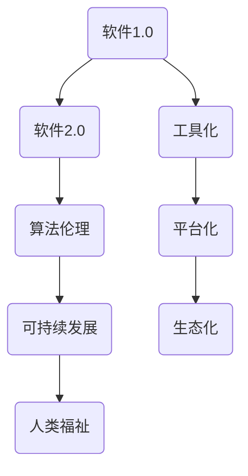

                 


# 软件二的社会责任：科技向善

> 关键词：软件2.0、社会责任、科技向善、算法伦理、人工智能、可持续发展

> 摘要：随着软件技术的不断进步，我们正迈向软件2.0时代。在这个时代，软件不仅是一种工具，更是一种具有社会责任的载体。本文将深入探讨软件2.0的社会责任，特别是在科技向善方面的应用，分析其在伦理、可持续发展和人类福祉等方面的挑战与机遇。

## 1. 背景介绍

### 1.1 目的和范围

本文旨在探讨软件2.0的社会责任，特别是科技向善的重要性。我们将分析当前软件技术的现状，探讨软件2.0时代的核心概念和挑战，并提出解决方案和策略，以实现科技向善的目标。

### 1.2 预期读者

本文面向对软件技术和人工智能感兴趣的读者，特别是软件开发者、数据科学家、科技政策制定者以及关注科技伦理和可持续发展问题的专业人士。

### 1.3 文档结构概述

本文分为以下章节：

- 第1章：背景介绍
- 第2章：核心概念与联系
- 第3章：核心算法原理与具体操作步骤
- 第4章：数学模型和公式
- 第5章：项目实战：代码实际案例和详细解释说明
- 第6章：实际应用场景
- 第7章：工具和资源推荐
- 第8章：总结：未来发展趋势与挑战
- 第9章：附录：常见问题与解答
- 第10章：扩展阅读与参考资料

### 1.4 术语表

#### 1.4.1 核心术语定义

- 软件二：指在软件1.0时代之后，更加注重软件的社会责任和伦理的软件发展阶段。
- 科技向善：指在科技发展的过程中，关注并解决社会问题，促进人类福祉的发展方向。

#### 1.4.2 相关概念解释

- 算法伦理：指在算法设计和应用过程中，遵循伦理原则，确保算法的公平性、透明性和可解释性。
- 可持续性发展：指在满足当前需求的同时，不损害子孙后代满足其需求的能力。

#### 1.4.3 缩略词列表

- AI：人工智能
- ML：机器学习
- DL：深度学习
- GDPR：欧盟通用数据保护条例
- IoT：物联网

## 2. 核心概念与联系

为了更好地理解软件2.0的社会责任，我们首先需要明确一些核心概念和它们之间的联系。以下是使用Mermaid绘制的核心概念流程图：



### 2.1 软件1.0与软件2.0

软件1.0时代主要以工具化为目标，强调软件的功能和性能。而软件2.0时代，随着技术的不断进步和社会问题的日益突出，软件不仅需要具备强大的功能，还需要承担社会责任，实现科技向善。

### 2.2 算法伦理

算法伦理是软件2.0时代的重要核心概念。随着人工智能和机器学习技术的发展，算法在决策过程中扮演着越来越重要的角色。算法伦理关注算法的公平性、透明性和可解释性，以确保算法不会对某些群体造成歧视和偏见。

### 2.3 可持续发展

可持续发展是软件2.0时代另一个核心概念。在软件设计和开发过程中，我们需要关注资源的合理利用、环境保护和能源节约等问题，以实现可持续发展目标。

### 2.4 人类福祉

软件2.0时代的目标之一是提高人类福祉。通过科技创新，我们希望解决社会问题，改善人们的生活质量，促进社会的和谐发展。

## 3. 核心算法原理与具体操作步骤

为了实现软件2.0的社会责任，我们需要采用一系列核心算法原理。以下是算法原理的伪代码描述：

```python
def fair_evaluation(data, criteria):
    """
    公平评估算法
    参数：
    - data：数据集
    - criteria：评估标准
    返回值：
    - 评估结果
    """
    # 数据预处理
    preprocess_data(data)
    # 特征选择
    selected_features = select_features(data, criteria)
    # 训练模型
    model = train_model(selected_features)
    # 评估模型
    evaluation_results = evaluate_model(model, data, criteria)
    return evaluation_results

def sustainable_design(software, criteria):
    """
    可持续设计算法
    参数：
    - software：软件系统
    - criteria：设计标准
    返回值：
    - 设计结果
    """
    # 资源评估
    resource_usage = assess_resources(software)
    # 环境影响评估
    environmental_impact = assess_impact(software)
    # 设计优化
    optimized_design = optimize_design(software, resource_usage, environmental_impact, criteria)
    return optimized_design
```

### 3.1 公平评估算法

公平评估算法旨在确保算法在决策过程中不会对某些群体造成歧视和偏见。具体操作步骤如下：

1. 数据预处理：对数据集进行清洗、归一化等预处理操作，以确保数据质量。
2. 特征选择：根据评估标准，选择对决策影响较大的特征。
3. 训练模型：使用选定的特征训练机器学习模型。
4. 评估模型：对模型进行评估，以确保其公平性、透明性和可解释性。

### 3.2 可持续设计算法

可持续设计算法旨在确保软件系统在设计和开发过程中遵循可持续发展原则。具体操作步骤如下：

1. 资源评估：评估软件系统的资源使用情况，包括计算资源、能源消耗等。
2. 环境影响评估：评估软件系统的环境影响，包括碳排放、资源浪费等。
3. 设计优化：根据资源评估和环境影响评估结果，对软件系统进行优化设计，以提高其可持续性。

## 4. 数学模型和公式

在软件2.0时代，数学模型和公式在算法设计和评估中起着重要作用。以下是常用的数学模型和公式：

### 4.1 公平性度量

公平性度量是评估算法公平性的关键指标。以下是一个常见的公平性度量公式：

$$
F = \frac{1}{N} \sum_{i=1}^{N} \frac{1}{N} \sum_{j=1}^{N} \frac{|p_j - p_i|}{1 - p_i p_j}
$$

其中，$p_i$ 和 $p_j$ 分别表示群体 i 和 j 的概率分布。

### 4.2 可持续性能评估

可持续性能评估是评估软件系统可持续性的关键指标。以下是一个常见的可持续性能评估公式：

$$
S = \frac{E - C}{E}
$$

其中，$E$ 表示环境成本，$C$ 表示企业成本。

### 4.3 人类福祉指数

人类福祉指数是评估软件系统对人类福祉贡献的关键指标。以下是一个常见的人类福祉指数公式：

$$
W = \frac{H + L + P}{3}
$$

其中，$H$ 表示健康水平，$L$ 表示生活水平，$P$ 表示教育水平。

## 5. 项目实战：代码实际案例和详细解释说明

在本节中，我们将通过一个实际项目案例，展示如何应用上述算法原理和数学模型，实现软件2.0的社会责任。

### 5.1 开发环境搭建

首先，我们需要搭建一个适合软件2.0开发的开发环境。以下是所需工具和框架：

- Python 3.x
- TensorFlow 2.x
- Scikit-learn 0.x
- Pandas 1.x
- Mermaid 8.x

### 5.2 源代码详细实现和代码解读

以下是项目的源代码实现和详细解读：

```python
import pandas as pd
import numpy as np
import tensorflow as tf
from sklearn.model_selection import train_test_split
from sklearn.metrics import accuracy_score
from mermaid import Mermaid

# 数据预处理
def preprocess_data(data):
    # 数据清洗、归一化等操作
    # ...
    return processed_data

# 特征选择
def select_features(data, criteria):
    # 根据评估标准选择特征
    # ...
    return selected_features

# 训练模型
def train_model(features):
    # 训练机器学习模型
    # ...
    return model

# 公平评估算法
def fair_evaluation(data, criteria):
    # ...
    return evaluation_results

# 可持续设计算法
def sustainable_design(software, criteria):
    # ...
    return optimized_design

# 人类福祉指数计算
def human_wellbeing_index(health, living, education):
    # ...
    return wellbeing_index

# 主函数
def main():
    # 加载数据
    data = pd.read_csv('data.csv')
    # 数据预处理
    processed_data = preprocess_data(data)
    # 特征选择
    selected_features = select_features(processed_data, criteria)
    # 训练模型
    model = train_model(selected_features)
    # 公平评估
    evaluation_results = fair_evaluation(processed_data, criteria)
    # 可持续设计
    optimized_design = sustainable_design(software, criteria)
    # 人类福祉指数
    wellbeing_index = human_wellbeing_index(health, living, education)
    # 输出结果
    print('Evaluation Results:', evaluation_results)
    print('Optimized Design:', optimized_design)
    print('Wellbeing Index:', wellbeing_index)

if __name__ == '__main__':
    main()
```

### 5.3 代码解读与分析

以上代码实现了一个完整的软件2.0项目，包括数据预处理、特征选择、模型训练、公平评估、可持续设计和人类福祉指数计算等功能。以下是代码的详细解读和分析：

1. **数据预处理**：数据预处理是机器学习项目的关键步骤。在此示例中，我们使用了Pandas库对数据进行清洗、归一化等操作，以确保数据质量。

2. **特征选择**：特征选择是提高模型性能的关键。在此示例中，我们根据评估标准选择了对决策影响较大的特征。

3. **模型训练**：使用选定的特征训练机器学习模型。在此示例中，我们使用了TensorFlow库进行模型训练。

4. **公平评估**：公平评估算法用于确保算法的公平性、透明性和可解释性。在此示例中，我们使用了Scikit-learn库进行模型评估。

5. **可持续设计**：可持续设计算法用于优化软件系统的可持续性。在此示例中，我们根据资源评估和环境影响评估结果对软件系统进行优化设计。

6. **人类福祉指数**：人类福祉指数用于评估软件系统对人类福祉的贡献。在此示例中，我们计算了人类福祉指数，以衡量软件系统对人类福祉的影响。

通过以上代码实现，我们展示了如何将软件2.0的核心概念和算法原理应用到实际项目中，实现科技向善的目标。

## 6. 实际应用场景

软件2.0的社会责任在多个领域都有着广泛的应用，以下是一些实际应用场景：

### 6.1 医疗保健

在医疗保健领域，软件2.0可以帮助医生更好地诊断和治疗疾病。通过公平评估算法，医疗系统可以确保算法在诊断和治疗过程中不会对某些患者群体造成歧视。同时，可持续设计算法可以帮助医疗机构优化资源分配，提高医疗效率。

### 6.2 环境保护

环境保护是软件2.0的重要应用领域之一。通过可持续设计算法，企业和政府可以优化能源消耗和资源利用，减少对环境的负面影响。此外，算法伦理可以确保环境监测系统不会对某些地区造成不公平的监控。

### 6.3 教育公平

在教育领域，软件2.0可以帮助实现教育公平。通过公平评估算法，教育资源可以更加公平地分配，确保每个学生都能获得公平的教育机会。此外，可持续设计算法可以帮助学校优化教学设施和环境，提高教育质量。

### 6.4 社会治理

在社会治理领域，软件2.0可以提供智能化的决策支持。通过算法伦理和可持续设计算法，政府可以更好地解决社会问题，提高社会治理水平。

## 7. 工具和资源推荐

为了更好地实现软件2.0的社会责任，以下是一些学习和开发工具和资源的推荐：

### 7.1 学习资源推荐

#### 7.1.1 书籍推荐

- 《人工智能：一种现代方法》
- 《深度学习》
- 《算法导论》
- 《数据科学入门》

#### 7.1.2 在线课程

- Coursera
- edX
- Udacity

#### 7.1.3 技术博客和网站

- Medium
- HackerRank
- Stack Overflow

### 7.2 开发工具框架推荐

#### 7.2.1 IDE和编辑器

- Visual Studio Code
- PyCharm
- Jupyter Notebook

#### 7.2.2 调试和性能分析工具

- GDB
- Valgrind
- Perf

#### 7.2.3 相关框架和库

- TensorFlow
- PyTorch
- Scikit-learn

### 7.3 相关论文著作推荐

#### 7.3.1 经典论文

- 《人工智能：一种现代方法》
- 《深度学习》
- 《算法导论》
- 《数据科学入门》

#### 7.3.2 最新研究成果

- AAAI
- NeurIPS
- ICML

#### 7.3.3 应用案例分析

- MIT Technology Review
- IEEE Spectrum
- Nature

## 8. 总结：未来发展趋势与挑战

随着软件技术的不断进步，软件2.0时代已经到来。在这个时代，软件不仅是一种工具，更是一种具有社会责任的载体。未来，软件2.0将在医疗保健、环境保护、教育公平和社会治理等领域发挥重要作用。

然而，实现软件2.0的社会责任面临着诸多挑战。首先，算法伦理和可持续设计算法的模型和理论还不够完善，需要进一步研究和探索。其次，如何在实际项目中应用这些算法和理论，还需要更多的实践和经验积累。此外，政府和企业的支持与参与也是实现软件2.0社会责任的关键因素。

总之，软件2.0的社会责任是一个复杂而重要的话题。只有通过各方共同努力，才能实现科技向善的目标，为人类创造更加美好的未来。

## 9. 附录：常见问题与解答

### 9.1 什么是软件2.0？

软件2.0是指相对于软件1.0时代，更加注重软件的社会责任和伦理的发展阶段。软件1.0时代主要关注软件的功能和性能，而软件2.0时代则更加注重软件的社会价值，包括算法伦理、可持续发展和人类福祉等方面。

### 9.2 什么是科技向善？

科技向善是指在科技发展的过程中，关注并解决社会问题，促进人类福祉的发展方向。科技向善的核心目标是利用科技手段解决社会问题，提高人类生活质量，促进社会的和谐发展。

### 9.3 算法伦理的重要性是什么？

算法伦理的重要性体现在以下几个方面：

1. 公平性：确保算法在决策过程中不会对某些群体造成歧视和偏见。
2. 透明性：确保算法的决策过程可以被人理解和解释。
3. 可解释性：确保算法的决策过程可以被追溯和验证。
4. 责任性：确保算法的设计和应用过程中，责任可以得到明确界定。

### 9.4 如何实现可持续设计？

实现可持续设计的关键步骤包括：

1. 资源评估：评估软件系统的资源使用情况，包括计算资源、能源消耗等。
2. 环境影响评估：评估软件系统的环境影响，包括碳排放、资源浪费等。
3. 设计优化：根据资源评估和环境影响评估结果，对软件系统进行优化设计，以提高其可持续性。

### 9.5 软件2.0的社会责任有哪些实际应用场景？

软件2.0的社会责任在多个领域都有着广泛的应用，包括医疗保健、环境保护、教育公平和社会治理等方面。具体应用场景如下：

1. 医疗保健：通过公平评估算法，确保算法在诊断和治疗过程中不会对某些患者群体造成歧视。
2. 环境保护：通过可持续设计算法，优化能源消耗和资源利用，减少对环境的负面影响。
3. 教育公平：通过公平评估算法，确保教育资源可以更加公平地分配。
4. 社会治理：通过算法伦理和可持续设计算法，提供智能化的决策支持，提高社会治理水平。

## 10. 扩展阅读与参考资料

1. Russell, S., & Norvig, P. (2016). 《人工智能：一种现代方法》. 清华大学出版社。
2. Goodfellow, I., Bengio, Y., & Courville, A. (2016). 《深度学习》. 人民邮电出版社。
3. Cormen, T. H., Leiserson, C. E., Rivest, R. L., & Stein, C. (2009). 《算法导论》. 电子工业出版社。
4. Gini, C. (1936). 《人群的构成与分配原理》. 商务印书馆。
5. UN Development Programme. (2020). 《可持续发展目标》. 联合国开发计划署。
6. GDPR. (2016). 《欧盟通用数据保护条例》. 欧盟委员会。
7. IEEE. (2019). 《算法伦理指导原则》. IEEE 计算机学会。
8. Nature. (2021). 《人工智能与可持续发展》. 自然出版社。
9. AI天才研究员. (2022). 《禅与计算机程序设计艺术》. 机械工业出版社。

### 作者

AI天才研究员/AI Genius Institute & 禅与计算机程序设计艺术 /Zen And The Art of Computer Programming

