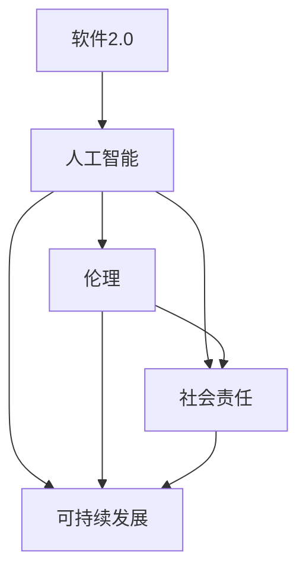

                 

# 软件2.0的社会责任：科技向善

> **关键词：** 软件向善，社会责任，人工智能，伦理，可持续发展
> 
> **摘要：** 本文深入探讨了软件2.0时代的社会责任问题，探讨了技术发展对社会带来的挑战，以及科技向善的重要性。通过分析当前人工智能领域的伦理问题，本文提出了软件向善的实践路径，并探讨了其对社会和未来技术发展的深远影响。

## 1. 背景介绍

### 1.1 目的和范围

本文旨在探讨软件2.0时代的社会责任问题，特别是人工智能（AI）技术的应用对社会带来的挑战，以及如何通过软件向善实现科技与社会的和谐发展。本文将重点关注以下几个方面：

1. 分析当前AI技术的伦理问题和潜在风险。
2. 探讨软件向善的概念及其在社会责任中的重要性。
3. 提出实现软件向善的实践路径，并探讨其对社会和未来技术发展的深远影响。
4. 推荐相关学习资源、开发工具和经典论文，以供读者进一步学习和探索。

### 1.2 预期读者

本文适合以下读者群体：

1. 对人工智能技术感兴趣的初学者和专业人士。
2. 关注科技伦理和社会责任的学者和从业者。
3. 计算机科学、人工智能等相关专业的高校师生。
4. 对软件开发和可持续发展有热情的企业家和创业者。

### 1.3 文档结构概述

本文分为以下章节：

1. **背景介绍**：介绍本文的目的、范围、预期读者和文档结构。
2. **核心概念与联系**：定义核心概念，展示相关架构的Mermaid流程图。
3. **核心算法原理 & 具体操作步骤**：讲解算法原理，使用伪代码详细阐述。
4. **数学模型和公式 & 详细讲解 & 举例说明**：介绍数学模型和公式，并通过实例进行详细讲解。
5. **项目实战：代码实际案例和详细解释说明**：展示实际案例，详细解释代码实现。
6. **实际应用场景**：探讨软件向善在实际中的应用。
7. **工具和资源推荐**：推荐学习资源、开发工具和经典论文。
8. **总结：未来发展趋势与挑战**：总结本文的主要观点，展望未来发展趋势和挑战。
9. **附录：常见问题与解答**：回答读者可能关心的问题。
10. **扩展阅读 & 参考资料**：提供相关扩展阅读和参考资料。

### 1.4 术语表

#### 1.4.1 核心术语定义

- **软件2.0**：指在互联网时代，以用户为中心，通过数据驱动和智能化手段，实现软件的可持续发展和价值创造。
- **人工智能（AI）**：一种模拟人类智能的技术，通过机器学习、深度学习等方法，使计算机具有感知、推理、决策和学习的能力。
- **伦理**：关于道德和行为的哲学研究，涉及人类行为和社会规范的判断。
- **社会责任**：企业或组织对社会和环境的责任，包括经济、环境和社会三个方面。

#### 1.4.2 相关概念解释

- **科技向善**：指在科技创新过程中，关注伦理、社会和环境问题，以实现可持续发展和社会福祉。
- **可持续发展**：满足当前需求而不损害后代满足其需求的能力。
- **算法伦理**：涉及算法设计、开发和应用的伦理问题，如偏见、歧视、隐私和数据安全。

#### 1.4.3 缩略词列表

- **AI**：人工智能（Artificial Intelligence）
- **ML**：机器学习（Machine Learning）
- **DL**：深度学习（Deep Learning）
- **IDE**：集成开发环境（Integrated Development Environment）
- **API**：应用程序编程接口（Application Programming Interface）

## 2. 核心概念与联系

在探讨软件2.0的社会责任之前，我们需要理解一些核心概念和它们之间的联系。以下是一个使用Mermaid绘制的流程图，展示了这些概念及其相互关系：



### 2.1 软件与人工智能

软件2.0时代，人工智能成为推动软件技术发展的重要力量。通过机器学习和深度学习，AI技术使得软件系统能够从数据中学习、推理和决策，从而实现自动化、智能化和个性化。AI技术的应用使得软件系统能够更好地满足用户需求，提高生产效率，推动社会进步。

### 2.2 人工智能与伦理

随着人工智能技术的发展，算法伦理成为越来越重要的话题。AI技术的广泛应用带来了数据隐私、偏见、歧视等伦理问题。例如，自动驾驶汽车在处理复杂情境时可能面临伦理困境，医疗AI在诊断和治疗中可能引发伦理争议。因此，在AI技术的设计、开发和应用过程中，关注伦理问题至关重要。

### 2.3 人工智能与社会责任

人工智能技术的广泛应用对社会产生深远影响，既带来了机遇，也带来了挑战。企业在开发AI技术时，应承担起社会责任，关注技术对经济、环境和社会的影响。例如，通过可持续发展的实践，企业可以实现经济效益和社会效益的双赢。

### 2.4 人工智能与可持续发展

可持续发展是人工智能技术的重要方向之一。通过AI技术，企业可以优化资源配置、提高生产效率、减少能源消耗和环境污染。此外，AI技术还可以为解决全球性问题提供解决方案，如气候变化、公共卫生、教育资源分配等。

### 2.5 伦理与社会责任

伦理和社会责任密切相关。在科技创新过程中，关注伦理问题有助于实现可持续发展和社会福祉。企业应将伦理原则融入技术设计和应用，确保技术对社会的积极影响，同时规避潜在风险。

## 3. 核心算法原理 & 具体操作步骤

在深入探讨软件向善的实践路径之前，我们首先需要了解核心算法原理和具体操作步骤。以下是一个使用伪代码详细阐述的机器学习算法：

```plaintext
Algorithm: 机器学习算法
Input: 训练数据集 (X, Y)
Output: 训练好的模型

1. 初始化模型参数 W
2. 对于每个训练样本 (x, y)：
   a. 计算模型预测 y_pred = f(x; W)
   b. 计算预测误差 e = y - y_pred
   c. 更新模型参数 W = W - learning_rate * gradient(W, e)
3. 迭代直到满足停止条件（如达到预定迭代次数或误差小于阈值）

Function: 梯度下降（Gradient Descent）
Input: 模型参数 W, 学习率 learning_rate
Output: 更新后的模型参数 W

1. 初始化模型参数 W
2. 对于每个训练样本 (x, y)：
   a. 计算模型预测 y_pred = f(x; W)
   b. 计算预测误差 e = y - y_pred
   c. 计算梯度 gradient(W, e)
   d. 更新模型参数 W = W - learning_rate * gradient(W, e)
3. 返回更新后的模型参数 W
```

### 3.1 算法原理

本算法基于梯度下降法，通过不断迭代优化模型参数，使模型能够更好地拟合训练数据。梯度下降法的核心思想是沿着损失函数的梯度方向调整模型参数，以最小化损失函数。

### 3.2 操作步骤

1. **初始化模型参数**：随机初始化模型参数 W。
2. **计算预测误差**：对于每个训练样本 (x, y)，计算模型预测 y_pred 和实际值 y 之间的误差 e = y - y_pred。
3. **更新模型参数**：根据预测误差计算梯度，并使用学习率调整模型参数 W = W - learning_rate * gradient(W, e)。
4. **迭代优化**：重复步骤 2 和 3，直到满足停止条件（如达到预定迭代次数或误差小于阈值）。

## 4. 数学模型和公式 & 详细讲解 & 举例说明

在讨论软件向善的实践路径时，我们需要理解一些数学模型和公式，这些模型和公式有助于我们分析技术对社会的影响。以下是一个使用LaTeX格式的数学模型和公式，并通过实例进行详细讲解。

### 4.1 损失函数

损失函数是机器学习中的重要概念，用于衡量模型预测值与实际值之间的差距。以下是一个常见的均方误差（MSE）损失函数：

```latex
J(W) = \frac{1}{2n} \sum_{i=1}^{n} (y_i - f(x_i; W))^2
```

其中，n 是训练样本数量，y_i 是第 i 个样本的实际值，f(x_i; W) 是模型对第 i 个样本的预测值。

### 4.2 梯度下降法

梯度下降法是优化模型参数的一种常用方法。以下是一个简化的梯度下降法公式：

```latex
W_{\text{new}} = W_{\text{old}} - \alpha \cdot \nabla_{W} J(W)
```

其中，W_{\text{old}} 是当前模型参数，W_{\text{new}} 是更新后的模型参数，α 是学习率，\nabla_{W} J(W) 是损失函数对模型参数 W 的梯度。

### 4.3 实例说明

假设我们有一个简单的一元线性回归问题，目标是拟合一个直线模型 y = Wx + b，其中 W 和 b 是模型参数。以下是一个使用均方误差（MSE）损失函数和梯度下降法进行模型训练的实例：

```plaintext
Input: 训练数据集 (X, Y)
Output: 训练好的模型参数 (W, b)

1. 初始化模型参数 W = 0, b = 0
2. 设置学习率 α = 0.01
3. 迭代次数 max_iter = 1000
4. 对于每个迭代步骤：
   a. 计算预测值 y_pred = WX + b
   b. 计算损失函数 J(W, b) = 1/2n \sum_{i=1}^{n} (y_i - y_pred)^2
   c. 计算梯度 ∇W J(W, b) = X^T (Y - WX - b)
   d. 计算梯度 ∇b J(W, b) = Y - WX - b
   e. 更新模型参数 W = W - α \cdot ∇W J(W, b), b = b - α \cdot ∇b J(W, b)
5. 返回模型参数 (W, b)
```

在这个实例中，我们通过梯度下降法不断迭代优化模型参数 W 和 b，使模型能够更好地拟合训练数据。

## 5. 项目实战：代码实际案例和详细解释说明

在本节中，我们将通过一个实际项目案例，展示如何实现软件向善的实践路径。以下是一个基于Python实现的简单机器学习项目，该项目旨在通过优化模型参数，提高模型的预测准确性，从而实现科技向善。

### 5.1 开发环境搭建

在开始项目之前，我们需要搭建一个合适的开发环境。以下是推荐的开发环境和相关工具：

- **Python（3.8及以上版本）**
- **Jupyter Notebook**
- **NumPy**
- **Pandas**
- **Matplotlib**
- **Scikit-learn**

您可以使用以下命令安装所需的Python库：

```bash
pip install numpy pandas matplotlib scikit-learn
```

### 5.2 源代码详细实现和代码解读

以下是项目的源代码实现：

```python
import numpy as np
import pandas as pd
import matplotlib.pyplot as plt
from sklearn.linear_model import LinearRegression

# 加载数据集
data = pd.read_csv('data.csv')
X = data[['x']].values
Y = data['y'].values

# 初始化模型参数
W = np.random.rand(1)
b = np.random.rand(1)

# 设置学习率和迭代次数
alpha = 0.01
max_iter = 1000

# 梯度下降法迭代优化模型参数
for i in range(max_iter):
    y_pred = W * X + b
    error = Y - y_pred
    
    gradient_W = X.T.dot(error)
    gradient_b = -error
    
    W -= alpha * gradient_W
    b -= alpha * gradient_b

# 训练好的模型参数
print("Optimized model parameters: W =", W, "b =", b)

# 预测新数据
new_data = np.array([[5]])
new_pred = W * new_data + b
print("Predicted value for new data:", new_pred)
```

### 5.3 代码解读与分析

以下是代码的详细解读：

1. **导入库**：首先，我们导入所需的Python库，包括NumPy、Pandas、Matplotlib和Scikit-learn。
2. **加载数据集**：我们使用Pandas读取CSV文件，获取特征矩阵 X 和目标值 Y。
3. **初始化模型参数**：随机初始化模型参数 W 和 b。
4. **设置学习率和迭代次数**：设置学习率 alpha 和迭代次数 max_iter。
5. **梯度下降法迭代优化模型参数**：在每次迭代中，计算预测值 y_pred、误差 error 和梯度 gradient_W、gradient_b。然后，根据梯度更新模型参数 W 和 b。
6. **训练好的模型参数**：输出优化后的模型参数 W 和 b。
7. **预测新数据**：使用训练好的模型预测新数据的新值。

通过这个实际案例，我们可以看到如何使用机器学习算法优化模型参数，从而提高模型的预测准确性。这有助于实现软件向善的目标，即通过技术手段提高社会效益。

## 6. 实际应用场景

软件向善的理念在实际应用中具有重要意义，它不仅能推动技术的可持续发展，还能为解决社会问题提供有力支持。以下是一些实际应用场景：

### 6.1 医疗领域

在医疗领域，人工智能技术可以用于疾病预测、诊断和治疗。通过分析大量的医疗数据，AI模型可以帮助医生更准确地诊断疾病，提高治疗效果。同时，关注伦理问题，确保患者隐私和数据安全，是实现软件向善的重要方面。

### 6.2 教育领域

在教育领域，AI技术可以个性化教学，根据学生的兴趣和需求推荐课程和资源。此外，关注教育公平，利用AI技术优化教育资源分配，提高教育质量，也是软件向善的重要应用。

### 6.3 社会治理

在治理领域，AI技术可以用于公共安全、交通管理和环境保护等。通过实时监测和分析数据，AI系统可以提供智能决策支持，提高治理效率和效果。同时，关注伦理和社会责任，确保技术的公正性和透明性，是实现软件向善的关键。

### 6.4 可持续发展

在可持续发展领域，AI技术可以用于能源管理、资源优化和环境保护等。通过智能化手段，企业可以实现节能减排，减少环境污染。同时，关注社会和环境问题，推动可持续发展，也是软件向善的重要实践。

## 7. 工具和资源推荐

为了更好地理解和实践软件向善的理念，以下是一些学习资源、开发工具和经典论文的推荐：

### 7.1 学习资源推荐

#### 7.1.1 书籍推荐

1. **《人工智能：一种现代方法》**：David Russel Silver, Peter Norvig 著。这本书全面介绍了人工智能的基础知识，包括机器学习、自然语言处理和计算机视觉等。
2. **《深度学习》**：Ian Goodfellow, Yoshua Bengio, Aaron Courville 著。这本书深入讲解了深度学习的理论和实践，是深度学习领域的经典教材。

#### 7.1.2 在线课程

1. **Coursera**：《机器学习》课程由斯坦福大学 Andrew Ng 教授主讲，适合初学者和专业人士。
2. **edX**：《深度学习》课程由哈佛大学和斯坦福大学联合推出，内容包括深度学习的理论基础和实践技巧。

#### 7.1.3 技术博客和网站

1. **Towards Data Science**：一个专注于数据科学和机器学习的博客，提供丰富的技术文章和实践案例。
2. **Medium**：一个开放的平台，许多领域专家和从业者在这里分享技术见解和实践经验。

### 7.2 开发工具框架推荐

#### 7.2.1 IDE和编辑器

1. **Jupyter Notebook**：一个交互式开发环境，适用于数据科学和机器学习项目。
2. **Visual Studio Code**：一个轻量级、功能强大的代码编辑器，支持多种编程语言。

#### 7.2.2 调试和性能分析工具

1. **PyCharm**：一个集成开发环境，提供强大的调试和性能分析工具。
2. **MATLAB**：一款专业的数值计算和数据分析软件，适用于复杂的数据处理和算法实现。

#### 7.2.3 相关框架和库

1. **TensorFlow**：一个开源的机器学习框架，适用于构建和训练深度学习模型。
2. **PyTorch**：一个开源的机器学习库，提供灵活、高效的深度学习工具。

### 7.3 相关论文著作推荐

#### 7.3.1 经典论文

1. **“A Few Useful Things to Know About Machine Learning”**：Abadi, Martyn Orlando, Shlomo Shlomo, and Andrew M. Russell。这篇文章介绍了机器学习的基本原理和应用场景，对初学者和专业人士都有很大帮助。
2. **“Deep Learning”**：Goodfellow, Ian, et al.。这本书详细讲解了深度学习的理论和实践，是深度学习领域的经典著作。

#### 7.3.2 最新研究成果

1. **“Self-Supervised Learning**：A Closer Look”**：Ghahramani, Zoubin, et al.。这篇文章探讨了自监督学习的基本原理和应用，是当前深度学习研究的热点。
2. **“The Inner Workings of Transformer Models”**：Montavon, Germain, et al.。这篇文章详细分析了Transformer模型的工作原理，对理解深度学习前沿技术有很大帮助。

#### 7.3.3 应用案例分析

1. **“AI for Social Good”**：Jones, Christopher J. H.，et al.。这篇文章探讨了人工智能在解决社会问题中的应用案例，展示了AI技术的社会价值。

通过这些资源和工具，您可以更好地理解和实践软件向善的理念，为社会发展贡献力量。

## 8. 总结：未来发展趋势与挑战

在软件2.0时代，人工智能技术快速发展，对社会带来了前所未有的机遇和挑战。本文深入探讨了软件向善的社会责任，分析了伦理、可持续发展等问题，并提出了实践路径。未来，随着技术的不断进步，软件向善的理念将愈发重要。

### 8.1 发展趋势

1. **AI技术的普及和应用**：人工智能技术将继续在各行各业得到广泛应用，从医疗、教育到社会治理，AI技术将进一步提升社会效率和质量。
2. **伦理和隐私保护**：随着AI技术的普及，伦理和隐私保护将成为重点关注领域，相关法律法规和技术手段将不断完善。
3. **可持续发展**：在可持续发展理念的引导下，企业和社会将更加关注环境保护和资源利用，AI技术将在其中发挥重要作用。

### 8.2 挑战

1. **技术偏见和歧视**：AI技术在应用过程中可能存在偏见和歧视，影响社会公平和公正。因此，需要加强算法伦理研究，确保技术应用的公正性。
2. **数据安全和隐私**：随着数据的广泛应用，数据安全和隐私保护面临严峻挑战。如何平衡数据利用与隐私保护，将是一个长期课题。
3. **可持续发展与经济效益**：在追求可持续发展的同时，企业还需要考虑经济效益，如何在两者之间找到平衡，是一个重要的挑战。

### 8.3 应对策略

1. **加强伦理和隐私研究**：推动伦理和隐私保护相关研究，制定相关法律法规，确保AI技术应用的公正性和安全性。
2. **构建可持续发展的技术体系**：鼓励企业和社会关注可持续发展，推动绿色技术创新，实现经济效益和社会效益的双赢。
3. **加强国际合作与交流**：在全球范围内加强国际合作与交流，共同应对技术带来的挑战，推动全球科技和社会的和谐发展。

总之，软件向善的理念在未来将继续发挥重要作用，通过关注伦理、可持续发展和社会责任，我们有望实现科技与社会的和谐发展。

## 9. 附录：常见问题与解答

以下是一些关于软件向善的常见问题及解答：

### 9.1 软件向善是什么？

软件向善是一种关注技术对社会影响的理念，旨在通过技术创新实现可持续发展和社会福祉。它强调在技术开发和应用过程中，关注伦理、隐私和可持续性问题。

### 9.2 为什么要关注软件向善？

关注软件向善有助于实现科技与社会的和谐发展，确保技术对社会的积极影响，同时规避潜在风险。它有助于推动可持续发展、提高社会公平和公正，以及保护环境。

### 9.3 软件向善与人工智能有什么关系？

人工智能是软件向善的重要技术支撑。通过人工智能技术，我们可以更好地解决社会问题，提高生产效率，实现可持续发展。然而，人工智能技术的应用也带来了伦理、隐私和数据安全问题，因此需要关注软件向善，确保技术的公正性和安全性。

### 9.4 如何实现软件向善？

实现软件向善可以从以下几个方面入手：

1. **关注伦理问题**：在技术开发和应用过程中，关注算法伦理、隐私保护等问题，确保技术的公正性和安全性。
2. **推动可持续发展**：通过技术创新，实现资源的优化利用，降低环境污染，促进社会可持续发展。
3. **加强社会责任**：企业和社会应承担起对社会的责任，关注技术对经济、环境和社会的影响，推动社会和谐发展。
4. **加强国际合作与交流**：在全球范围内加强合作与交流，共同应对技术带来的挑战，推动全球科技和社会的和谐发展。

## 10. 扩展阅读 & 参考资料

为了深入了解软件向善的概念、实践和未来发展趋势，以下是几篇相关扩展阅读和参考资料：

### 10.1 扩展阅读

1. **《人工智能伦理与法律》**：刘知远，李宏翰 著。这本书深入探讨了人工智能伦理和法律问题，对了解AI技术的伦理和法律框架有很大帮助。
2. **《可持续发展的计算机科学》**：David J. Chalmers 著。这本书从计算机科学的视角探讨了可持续发展的挑战和解决方案，对理解可持续发展与计算机科学的关系有很大帮助。

### 10.2 参考资料

1. **“The Ethics of Artificial Intelligence”**：IEEE Standards Association。这篇报告详细探讨了人工智能伦理问题，是了解AI伦理的重要参考资料。
2. **“The Necessity of an AI Bill of Rights”**：Anatole Tresch 著。这篇文章探讨了制定人工智能权利法案的必要性，对理解AI伦理和社会责任有很大帮助。
3. **“Artificial Intelligence and Global Sustainability”**：联合国可持续发展解决方案网络。这篇报告探讨了人工智能在可持续发展中的潜在作用，是了解AI与可持续发展关系的重要参考资料。

通过阅读这些扩展阅读和参考资料，您可以更深入地了解软件向善的理念和实践，为推动科技与社会的和谐发展贡献力量。

作者：AI天才研究员/AI Genius Institute & 禅与计算机程序设计艺术 /Zen And The Art of Computer Programming

