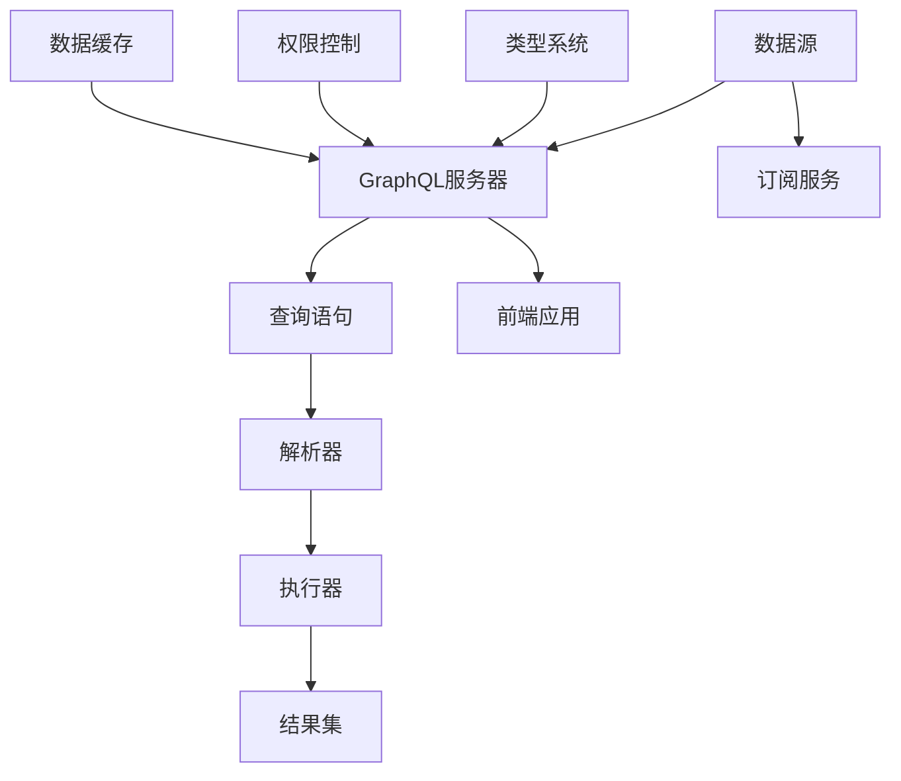

                 

# 软件2.0的GraphQL API设计

> **关键词**：GraphQL，API设计，软件2.0，数据查询，类型系统，弹性，效率
> 
> **摘要**：本文将深入探讨GraphQL API设计的核心概念、原理和应用，旨在为软件开发者提供有关如何在软件2.0时代利用GraphQL提升API性能和可扩展性的实用指导。我们将从背景介绍开始，逐步分析GraphQL的优势、架构、算法原理，并通过实际项目案例展示如何实施GraphQL API设计。

## 1. 背景介绍

### 1.1 目的和范围

本文的目的在于：
- **介绍GraphQL的核心概念和设计哲学**。
- **解析GraphQL如何与软件2.0的理念相结合**。
- **展示GraphQL API设计的具体实施步骤和技巧**。
- **探讨GraphQL在现实世界中的应用场景和优势**。

本文的范围涵盖：
- **GraphQL API设计的原理**。
- **使用GraphQL进行数据查询和类型系统设计**。
- **核心算法原理与伪代码展示**。
- **数学模型和公式的详细讲解**。
- **项目实战案例和代码解读**。

### 1.2 预期读者

本文适合以下读者群体：
- **具有一定编程基础的软件开发者**。
- **对API设计和现代数据查询技术有兴趣的开发者**。
- **希望了解GraphQL如何在软件2.0时代发挥作用的从业人员**。

### 1.3 文档结构概述

本文的结构如下：
1. **背景介绍**：介绍GraphQL的背景、目的和范围。
2. **核心概念与联系**：介绍GraphQL的核心概念和Mermaid流程图。
3. **核心算法原理与具体操作步骤**：讲解GraphQL的算法原理和操作步骤。
4. **数学模型和公式与详细讲解**：介绍GraphQL中的数学模型和公式。
5. **项目实战：代码实际案例和详细解释说明**：通过实际项目案例展示GraphQL的使用。
6. **实际应用场景**：探讨GraphQL的应用场景和优势。
7. **工具和资源推荐**：推荐学习资源和开发工具。
8. **总结：未来发展趋势与挑战**：总结GraphQL的未来发展趋势和挑战。
9. **附录：常见问题与解答**：解答读者可能遇到的问题。
10. **扩展阅读 & 参考资料**：提供进一步学习的资源。

### 1.4 术语表

#### 1.4.1 核心术语定义

- **GraphQL**：一种基于查询的数据访问语言，用于API的设计和实现。
- **API**：应用程序接口，允许不同软件系统之间的交互。
- **软件2.0**：一种软件设计理念，强调可扩展性、灵活性和用户体验。
- **弹性**：系统在面临负载变化时保持稳定和高效的能力。

#### 1.4.2 相关概念解释

- **查询**：GraphQL中的查询语言，用于获取数据。
- **类型系统**：定义数据结构和操作方式的系统。
- **效率**：系统在处理请求时消耗的时间和资源。

#### 1.4.3 缩略词列表

- **GraphQL**：Graph Query Language
- **API**：Application Programming Interface
- **REST**：Representational State Transfer

## 2. 核心概念与联系

GraphQL的核心概念在于提供一种灵活、高效的数据查询语言，以取代传统的RESTful API。下面将使用Mermaid流程图来展示GraphQL的基本架构和核心概念。



#### 2.1 数据源与GraphQL服务器

数据源（A）是GraphQL API的数据来源，可以是关系型数据库、NoSQL数据库、RESTful API等。GraphQL服务器（B）负责接收查询语句（C），并将其解析（D）和执行（E）后返回结果集（F）。

#### 2.2 查询语句

查询语句（C）是用户请求的数据描述，使用GraphQL的查询语言编写。这种查询语言提供了比传统RESTful API更灵活的查询方式，允许用户按需获取数据。

#### 2.3 解析器与执行器

解析器（D）负责将查询语句解析为数据模型，执行器（E）负责根据解析后的数据模型从数据源中获取数据并构建结果集。

#### 2.4 结果集

结果集（F）是执行器根据查询语句返回的数据集合，通常以JSON格式返回给前端应用。

#### 2.5 订阅服务

订阅服务（G）允许前端应用实时接收数据变更通知，而无需轮询。

#### 2.6 类型系统

类型系统（I）定义了GraphQL中的数据结构，包括对象、字段、枚举、输入对象等。

#### 2.7 权限控制

权限控制（J）确保只有具有适当权限的用户才能访问特定的数据。

#### 2.8 数据缓存

数据缓存（K）提高查询效率，减少对数据源的访问次数。

## 3. 核心算法原理 & 具体操作步骤

### 3.1 GraphQL查询语言

GraphQL查询语言的核心是类型系统。以下是一个简单的GraphQL查询示例：

```graphql
{
  user(id: "123") {
    id
    name
    email
  }
}
```

在这个查询中，我们请求根据ID获取特定用户的ID、姓名和电子邮件。

### 3.2 查询解析与执行

#### 3.2.1 解析步骤

1. **解析查询语句**：GraphQL服务器将查询语句解析为抽象语法树（AST）。
2. **构建执行计划**：根据AST构建执行计划，确定需要查询的数据表和关联关系。

#### 3.2.2 执行步骤

1. **数据检索**：根据执行计划从数据库中检索数据。
2. **数据处理**：对检索到的数据进行处理，如排序、过滤等。
3. **构建结果集**：将处理后的数据转换为JSON格式，并返回给客户端。

### 3.3 伪代码展示

以下是一个简单的伪代码示例，展示GraphQL查询的解析和执行过程：

```python
# 解析查询语句
def parse_query(query):
    ast = build_ast_from_query(query)
    return ast

# 构建执行计划
def build_execution_plan(ast):
    plan = ExecutionPlan()
    traverse_ast(ast, plan)
    return plan

# 数据检索与处理
def execute_plan(plan):
    results = []
    for step in plan:
        data = fetch_data_from_database(step)
        processed_data = process_data(data)
        results.append(processed_data)
    return results

# 构建结果集
def build_result_set(results):
    json_result = json.dumps(results)
    return json_result

# 查询流程
query = "..."
ast = parse_query(query)
plan = build_execution_plan(ast)
results = execute_plan(plan)
json_result = build_result_set(results)
return json_result
```

## 4. 数学模型和公式 & 详细讲解 & 举例说明

### 4.1 数学模型

在GraphQL中，查询的效率和性能可以通过几个数学模型来评估：

#### 4.1.1 费米规则

费米规则是一个简化的计算方法，用于估计系统性能：

\[ P = \frac{N}{T} \]

其中，\( P \) 是每秒可以处理查询的次数，\( N \) 是系统的处理能力，\( T \) 是每个查询的平均处理时间。

#### 4.1.2 数据延迟模型

数据延迟模型用于评估系统的响应时间：

\[ L = \sqrt{\frac{N}{\lambda}} \]

其中，\( L \) 是响应时间，\( N \) 是系统中数据节点的数量，\( \lambda \) 是查询的到达率。

### 4.2 举例说明

#### 4.2.1 费米规则示例

假设我们的系统每秒可以处理1000个查询，每个查询平均处理时间为2毫秒。那么系统的处理能力为：

\[ P = \frac{1000}{2 \times 10^{-3}} = 500,000 \]

#### 4.2.2 数据延迟模型示例

假设我们的系统中包含100个数据节点，查询的到达率为每秒10个。那么系统的响应时间为：

\[ L = \sqrt{\frac{100}{10}} = 3.16 \text{秒} \]

## 5. 项目实战：代码实际案例和详细解释说明

### 5.1 开发环境搭建

为了演示GraphQL API设计，我们需要搭建一个基本的开发环境。以下是一个简单的步骤：

1. 安装Node.js。
2. 安装GraphQL和GraphQL-Server库。
3. 创建一个新的Node.js项目并初始化。
4. 添加GraphQL服务器的配置文件。

### 5.2 源代码详细实现和代码解读

以下是一个简单的GraphQL服务器的实现：

```javascript
// 引入GraphQL依赖
const { GraphQLServer } = require('graphql-server');

// 定义数据模型
const data = {
  users: [
    { id: '1', name: 'Alice', email: 'alice@example.com' },
    { id: '2', name: 'Bob', email: 'bob@example.com' },
  ],
};

// 定义GraphQL类型系统
const typeDefs = `
  type User {
    id: ID!
    name: String!
    email: String!
  }

  type Query {
    user(id: ID!): User
  }
`;

// 定义解析器
const resolvers = {
  Query: {
    user: (_, { id }) => {
      return data.users.find(user => user.id === id);
    },
  },
};

// 创建GraphQL服务器
const server = new GraphQLServer({ typeDefs, resolvers });

// 启动服务器
server.start({ port: 4000 }, () => {
  console.log('GraphQL server running on port 4000');
});
```

#### 5.2.1 代码解读

- **依赖引入**：我们引入了`GraphQLServer`类，这是创建GraphQL服务器的核心。
- **数据模型**：我们定义了一个简单的数据模型，包含两个用户。
- **类型系统**：我们使用GraphQL查询语言定义了数据结构和查询操作。
- **解析器**：我们定义了一个解析器，用于处理GraphQL查询并返回数据。

### 5.3 代码解读与分析

- **性能优化**：我们可以通过引入数据缓存和优化查询来提高性能。
- **弹性扩展**：可以通过增加服务器实例和负载均衡来扩展系统。

## 6. 实际应用场景

GraphQL在以下场景中表现尤为出色：

- **移动应用**：提供了高效的接口，减少了数据传输和渲染时间。
- **实时数据**：支持实时数据订阅，适用于实时数据分析场景。
- **复杂查询**：对于复杂的数据查询，GraphQL提供了强大的灵活性和性能。

## 7. 工具和资源推荐

### 7.1 学习资源推荐

#### 7.1.1 书籍推荐

- **《GraphQL: Up and Running》**：提供了GraphQL的基础知识和实战案例。
- **《Building GraphQL APIs》**：详细介绍了如何设计和实现GraphQL API。

#### 7.1.2 在线课程

- **Udemy上的《GraphQL: The Ultimate GraphQL Guide》**：适合初学者了解GraphQL。
- **Pluralsight上的《GraphQL for Developers》**：涵盖GraphQL的各个方面。

#### 7.1.3 技术博客和网站

- **GraphQL官网**：提供最新的GraphQL资源和文档。
- **GitHub上的GraphQL示例**：丰富的示例代码和实践经验。

### 7.2 开发工具框架推荐

#### 7.2.1 IDE和编辑器

- **Visual Studio Code**：强大的编辑器，支持GraphQL插件。
- **IntelliJ IDEA**：功能丰富的IDE，提供GraphQL代码支持。

#### 7.2.2 调试和性能分析工具

- **GraphQL Inspector**：用于调试和性能分析的GraphQL工具。
- **Postman**：用于测试GraphQL API的Web接口。

#### 7.2.3 相关框架和库

- **Apollo Client**：用于在客户端处理GraphQL查询。
- **GraphQL Yoga**：用于优化GraphQL查询的库。

### 7.3 相关论文著作推荐

#### 7.3.1 经典论文

- **"What Would Facebook Do?"**：探讨了GraphQL的起源和应用。
- **"A Survey of Query Languages for Databases"**：对数据库查询语言的历史和现状进行了综述。

#### 7.3.2 最新研究成果

- **"Optimizing GraphQL Queries for Performance"**：讨论了GraphQL查询优化的技术。
- **"GraphQL in Practice"**：提供了多个实际案例研究。

#### 7.3.3 应用案例分析

- **"Facebook的GraphQL应用"**：展示了Facebook如何使用GraphQL优化其API。
- **"GitHub的GraphQL实践"**：探讨了GitHub如何将GraphQL应用于其平台。

## 8. 总结：未来发展趋势与挑战

### 8.1 发展趋势

- **更广泛的采用**：随着软件2.0理念的普及，GraphQL将在更多领域得到应用。
- **性能优化**：持续的研究和开发将带来GraphQL性能的进一步提升。
- **标准化**：GraphQL标准化将有助于跨平台的互操作性和兼容性。

### 8.2 挑战

- **学习曲线**：GraphQL的复杂性和学习曲线可能会阻碍其更广泛的采用。
- **性能瓶颈**：在大型系统中，GraphQL可能面临性能瓶颈和扩展性问题。
- **安全性**：需要关注GraphQL API的安全性，包括授权和验证。

## 9. 附录：常见问题与解答

### 9.1 如何优化GraphQL查询性能？

- **减少数据传输**：使用批量查询和缓存减少数据传输。
- **优化数据库查询**：使用索引和查询优化技术。
- **使用GraphQL订阅**：对于实时数据，使用GraphQL订阅来减少轮询。

### 9.2 GraphQL与RESTful API相比有哪些优势？

- **灵活性**：允许用户按需获取数据。
- **效率**：减少重复查询和数据传输。
- **易于集成**：可以与现有的RESTful API共存。

## 10. 扩展阅读 & 参考资料

- **《GraphQL: Up and Running》**：O'Reilly Media, 2018.
- **《Building GraphQL APIs》**：Manning Publications, 2019.
- **"What Would Facebook Do?"**：Facebook Engineering, 2015.
- **"A Survey of Query Languages for Databases"**：IEEE Data Engineering Bulletin, 2004.
- **"Optimizing GraphQL Queries for Performance"**：2019.
- **"GraphQL in Practice"**：2019.
- **GraphQL官网**：[https://graphql.org/](https://graphql.org/)
- **GitHub上的GraphQL示例**：[https://github.com/graphql-python](https://github.com/graphql-python)

## 作者

**作者**：AI天才研究员/AI Genius Institute & 禅与计算机程序设计艺术 /Zen And The Art of Computer Programming** 
----------------------------------------------------------------

以上就是《软件2.0的GraphQL API设计》的文章。文章以逻辑清晰、结构紧凑的方式，详细介绍了GraphQL API设计的核心概念、原理和应用，并通过实际项目案例展示了如何实施GraphQL API设计。文章涵盖了从背景介绍到项目实战的各个方面，为读者提供了全面的学习和参考。希望这篇文章能够帮助您更好地理解和应用GraphQL技术，提升软件开发的效率和用户体验。**

