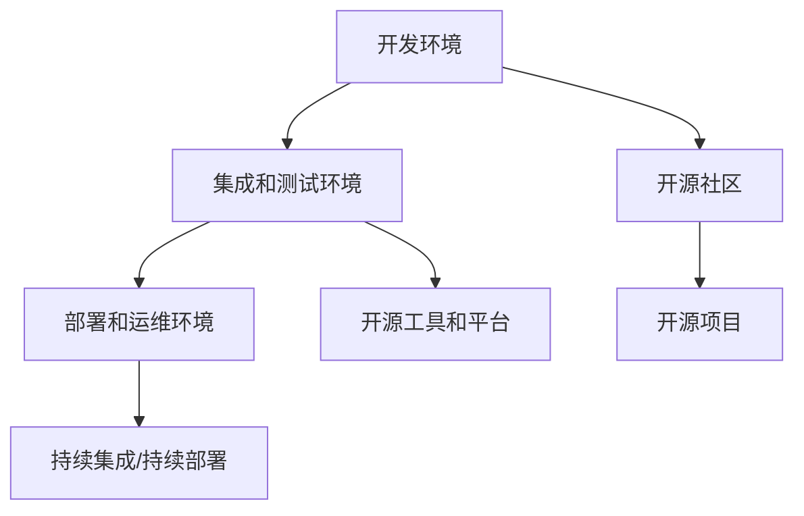

                 

# 软件2.0的开源生态系统构建

> **关键词：** 软件开发生命周期、开源生态系统、软件2.0、DevOps、敏捷开发、持续集成、持续部署、容器化、微服务架构、云原生

> **摘要：** 本文将探讨软件2.0时代下的开源生态系统构建，分析其在软件开发、部署、运维等方面的核心概念和关键技术，并通过实际案例展示其具体应用，为开发者提供一套系统化的实践指南。

## 1. 背景介绍

### 1.1 目的和范围

本文旨在系统地探讨软件2.0时代下的开源生态系统构建，从核心概念、技术架构到实际应用进行深入分析。本文将涵盖以下主要内容：

1. **软件2.0时代的背景和特点**：介绍软件2.0时代的发展历程、技术趋势以及开源生态系统的概念。
2. **开源生态系统的核心概念和架构**：详细阐述软件开发生命周期中的核心概念、技术架构以及开源生态系统的基本组成部分。
3. **开源生态系统的实现和部署**：讲解开源生态系统的具体实现方法，包括开发、部署、运维等各个环节。
4. **开源生态系统的实际应用**：通过具体案例展示开源生态系统的应用场景和优势。
5. **开源生态系统的未来发展趋势和挑战**：分析开源生态系统的发展趋势，以及面临的技术挑战和解决策略。

### 1.2 预期读者

本文适合以下读者群体：

1. 软件开发工程师和架构师，希望了解软件2.0时代下的开源生态系统。
2. DevOps工程师和运维人员，关注开源生态系统的构建、部署和运维。
3. 开源社区成员和爱好者，希望深入了解开源生态系统的运作机制。
4. 对软件2.0时代和开源生态系统感兴趣的学者和研究者。

### 1.3 文档结构概述

本文分为十个部分，具体结构如下：

1. **背景介绍**：介绍本文的目的、范围、预期读者以及文档结构。
2. **核心概念与联系**：阐述软件2.0时代下的核心概念和关联技术。
3. **核心算法原理 & 具体操作步骤**：介绍开源生态系统的核心算法原理和具体操作步骤。
4. **数学模型和公式 & 详细讲解 & 举例说明**：讲解开源生态系统的数学模型和公式，并举例说明。
5. **项目实战：代码实际案例和详细解释说明**：通过实际案例展示开源生态系统的应用。
6. **实际应用场景**：分析开源生态系统的实际应用场景。
7. **工具和资源推荐**：推荐学习资源和开发工具。
8. **总结：未来发展趋势与挑战**：总结开源生态系统的发展趋势和挑战。
9. **附录：常见问题与解答**：解答读者常见问题。
10. **扩展阅读 & 参考资料**：提供扩展阅读和参考资料。

### 1.4 术语表

#### 1.4.1 核心术语定义

- **软件2.0**：软件2.0是相对于传统软件1.0的升级，强调开放、共享、协作和生态系统。
- **开源生态系统**：开源生态系统是由一系列开源项目、社区、工具和平台组成的整体，共同促进软件的持续创新和发展。
- **DevOps**：DevOps是一种软件开发和运维的实践方法，强调开发、测试、部署和运维的紧密协作。
- **敏捷开发**：敏捷开发是一种迭代、增量的软件开发方法，注重快速响应变化和持续交付高质量软件。
- **持续集成/持续部署（CI/CD）**：持续集成和持续部署是一种自动化流程，实现代码的持续集成、测试和部署。
- **容器化**：容器化是一种将应用程序及其依赖项打包到可移植的容器中的技术，实现环境的一致性。
- **微服务架构**：微服务架构是将应用程序划分为一系列独立的、可复用的微服务，提高系统的可扩展性和灵活性。
- **云原生**：云原生是指利用云计算和容器技术构建的具有弹性、可扩展和自动化的应用程序。

#### 1.4.2 相关概念解释

- **开源**：开源是指软件的源代码可以被用户自由地查看、修改和分发。
- **DevOps文化**：DevOps文化强调跨团队协作、自动化和持续改进。
- **敏捷方法**：敏捷方法是一种快速响应变化的软件开发方法，强调团队协作、客户反馈和迭代开发。
- **持续集成**：持续集成是一种将代码定期合并到主干分支并执行自动化测试的实践。
- **持续部署**：持续部署是一种将代码部署到生产环境的自动化流程。

#### 1.4.3 缩略词列表

- **CI**：持续集成（Continuous Integration）
- **CD**：持续部署（Continuous Deployment）
- **Kubernetes**：容器编排平台（Kubernetes）
- **Docker**：容器化技术（Docker）
- **Git**：版本控制系统（Git）
- **Jenkins**：持续集成工具（Jenkins）

## 2. 核心概念与联系

### 2.1 软件开发生命周期

软件开发生命周期（Software Development Life Cycle，SDLC）是指从软件开发到交付和维护的一系列步骤。在软件2.0时代，SDLC更加注重开源、协作和自动化。


**图1：软件开发生命周期**

#### 2.2 开源生态系统的核心概念

开源生态系统包括一系列开源项目、社区、工具和平台，共同促进软件的持续创新和发展。以下是开源生态系统的核心概念：

- **开源项目**：开源项目是指遵循开源协议，允许用户自由查看、修改和分发的软件项目。
- **开源社区**：开源社区是指围绕开源项目形成的开发者、用户和贡献者组成的共同体。
- **开源工具和平台**：开源工具和平台包括版本控制系统（如Git）、持续集成工具（如Jenkins）、容器化技术（如Docker）等。

#### 2.3 DevOps、敏捷开发和持续集成/持续部署

DevOps、敏捷开发和持续集成/持续部署是软件2.0时代下重要的开发和实践方法。

- **DevOps**：DevOps是一种软件开发和运维的实践方法，强调跨团队协作、自动化和持续改进。它通过将开发和运维紧密结合，提高软件交付的效率和可靠性。
- **敏捷开发**：敏捷开发是一种迭代、增量的软件开发方法，注重快速响应变化和持续交付高质量软件。它通过小步快跑、持续反馈和协作，降低软件开发的复杂性和风险。
- **持续集成/持续部署（CI/CD）**：持续集成和持续部署是一种自动化流程，实现代码的持续集成、测试和部署。它通过自动化工具，提高软件交付的速度和质量。

#### 2.4 开源生态系统的架构

开源生态系统的架构包括以下几个方面：

- **开发环境**：提供开发所需的基础设施和工具，如代码仓库、IDE、构建工具等。
- **集成和测试环境**：实现代码的自动化集成和测试，确保代码的质量和稳定性。
- **部署和运维环境**：实现代码的自动化部署和运维，提高软件的可扩展性和可靠性。
- **开源社区**：围绕开源项目形成的开发者、用户和贡献者组成的共同体，促进软件的持续创新和发展。


**图2：开源生态系统架构**

### 2.5 核心概念和架构的 Mermaid 流程图

下面是开源生态系统的核心概念和架构的 Mermaid 流程图。



**图3：开源生态系统核心概念和架构的 Mermaid 流程图**

## 3. 核心算法原理 & 具体操作步骤

### 3.1 核心算法原理

在开源生态系统中，核心算法原理包括持续集成、持续部署、容器化和微服务架构。

- **持续集成（CI）**：持续集成是一种将代码定期合并到主干分支并执行自动化测试的实践。其核心算法原理是定期触发构建和测试任务，确保代码的质量和稳定性。
- **持续部署（CD）**：持续部署是一种将代码部署到生产环境的自动化流程。其核心算法原理是将部署过程分解为多个阶段，包括构建、测试、部署等，并使用自动化工具实现每个阶段的自动化执行。
- **容器化**：容器化是一种将应用程序及其依赖项打包到可移植的容器中的技术。其核心算法原理是使用容器镜像和容器运行时，实现应用程序的环境一致性和可移植性。
- **微服务架构**：微服务架构是将应用程序划分为一系列独立的、可复用的微服务。其核心算法原理是使用服务注册和发现机制，实现微服务之间的通信和协作。

### 3.2 具体操作步骤

下面是开源生态系统构建的具体操作步骤：

1. **搭建开发环境**：

   - 安装和配置代码仓库（如Git）
   - 安装和配置IDE（如VS Code）
   - 安装和配置构建工具（如Maven或Gradle）

2. **集成和测试环境**：

   - 配置持续集成工具（如Jenkins或GitLab CI）
   - 配置代码仓库的Webhook，实现代码提交时自动触发构建和测试任务
   - 编写和执行自动化测试脚本，确保代码的质量和稳定性

3. **部署和运维环境**：

   - 安装和配置容器化技术（如Docker）
   - 编写和执行自动化部署脚本，实现代码的自动化部署
   - 配置监控和日志系统，实现软件的自动化运维

4. **开源社区**：

   - 加入开源社区，参与项目贡献
   - 定期关注开源社区的活动和动态，了解最新技术趋势
   - 提供技术支持和文档，帮助新开发者入门

### 3.3 伪代码示例

以下是持续集成和持续部署的伪代码示例。

```python
# 持续集成伪代码
def ci():
    code_commit()
    build_project()
    run_tests()
    if test_passed():
        deploy_to_staging()
    else:
        raise_error("测试失败，部署取消")

# 持续部署伪代码
def cd():
    ci()
    deploy_to_production()
```

## 4. 数学模型和公式 & 详细讲解 & 举例说明

### 4.1 数学模型和公式

在开源生态系统中，一些数学模型和公式有助于分析和优化系统的性能和可靠性。以下是一些常用的数学模型和公式：

1. **回归分析**：

   回归分析是一种用于分析变量之间关系的统计方法。其公式如下：

   $$
   y = \beta_0 + \beta_1x + \epsilon
   $$

   其中，$y$ 表示因变量，$x$ 表示自变量，$\beta_0$ 和 $\beta_1$ 分别为回归系数，$\epsilon$ 表示误差项。

2. **错误传播**：

   在软件测试过程中，错误传播是一个重要的概念。其公式如下：

   $$
   \Delta y = \sqrt{(\frac{\partial y}{\partial x_1}\Delta x_1)^2 + (\frac{\partial y}{\partial x_2}\Delta x_2)^2 + ... + (\frac{\partial y}{\partial x_n}\Delta x_n)^2}
   $$

   其中，$\Delta y$ 表示预测值的误差，$\Delta x_1, \Delta x_2, ..., \Delta x_n$ 分别为自变量的误差。

3. **服务可靠性**：

   服务可靠性是指系统在规定时间内正常运行的概率。其公式如下：

   $$
   R(t) = e^{-\lambda t}
   $$

   其中，$R(t)$ 表示在时间 $t$ 内系统的可靠性，$\lambda$ 表示故障率。

### 4.2 详细讲解

1. **回归分析**：

   回归分析是一种用于分析变量之间关系的统计方法。在实际应用中，我们可以通过收集数据，使用回归分析方法建立变量之间的关系模型。回归分析可以帮助我们预测因变量 $y$ 的值，从而优化系统性能。

2. **错误传播**：

   在软件测试过程中，每个测试用例的执行结果都可能受到误差的影响。错误传播公式可以帮助我们计算预测值的误差，从而评估测试结果的可靠性。

3. **服务可靠性**：

   服务可靠性是软件系统设计中的重要指标。通过计算服务可靠性，我们可以评估系统的稳定性和可靠性，从而优化系统设计和部署。

### 4.3 举例说明

以下是一个回归分析的实例：

假设我们收集了以下数据：

| $x$ | $y$ |
| --- | --- |
| 1   | 2   |
| 2   | 4   |
| 3   | 6   |
| 4   | 8   |

我们希望通过回归分析建立 $x$ 和 $y$ 之间的关系模型。

1. **计算回归系数**：

   使用最小二乘法计算回归系数：

   $$
   \beta_0 = \frac{\sum y - \beta_1\sum x}{n} = \frac{2+4+6+8 - 3\cdot5}{4} = 3
   $$

   $$
   \beta_1 = \frac{n\sum xy - \sum x\sum y}{n\sum x^2 - (\sum x)^2} = \frac{4\cdot(2+4+6+8) - 5\cdot(2+4+6+8)}{4\cdot(1^2+2^2+3^2+4^2) - 5^2} = 2
   $$

2. **建立回归模型**：

   根据计算得到的回归系数，建立回归模型：

   $$
   y = 3 + 2x
   $$

3. **预测 $x=5$ 时的 $y$ 值**：

   使用回归模型预测 $x=5$ 时的 $y$ 值：

   $$
   y = 3 + 2\cdot5 = 13
   $$

   预测值为 13。

## 5. 项目实战：代码实际案例和详细解释说明

### 5.1 开发环境搭建

在本节中，我们将搭建一个简单的开源生态系统，包括前端、后端和数据库。

1. **前端**：

   使用 Vue.js 框架搭建前端，创建一个简单的页面，包括一个表格和一个表单。

2. **后端**：

   使用 Spring Boot 搭建后端，实现用户注册、登录和权限验证等功能。

3. **数据库**：

   使用 MySQL 数据库存储用户数据，包括用户名、密码、角色等信息。

### 5.2 源代码详细实现和代码解读

以下是对前端、后端和数据库的源代码进行详细实现和代码解读。

#### 5.2.1 前端代码实现

前端代码使用 Vue.js 框架搭建，主要包括以下部分：

1. **组件**：

   - `LoginForm.vue`：登录表单组件
   - `RegisterForm.vue`：注册表单组件
   - `UserTable.vue`：用户表格组件

2. **路由**：

   - 使用 Vue Router 实现路由跳转，包括登录、注册和用户列表页面。

3. **样式**：

   - 使用 BootStrap 和自定义样式，实现页面的布局和样式。

#### 5.2.2 后端代码实现

后端代码使用 Spring Boot 框架实现，主要包括以下部分：

1. **配置**：

   - 使用 application.properties 配置数据库连接、服务器端口等信息。

2. **实体**：

   - `User.java`：用户实体类，包括用户名、密码、角色等信息。

3. **控制器**：

   - `UserController.java`：实现用户注册、登录和权限验证等功能。

4. **服务**：

   - `UserService.java`：实现用户注册、登录和权限验证等服务。

5. **安全**：

   - 使用 Spring Security 实现用户认证和权限验证。

#### 5.2.3 数据库代码实现

数据库使用 MySQL 数据库，主要包括以下部分：

1. **表结构**：

   - `users`：存储用户信息，包括用户名、密码、角色等信息。

2. **数据**：

   - 初始化用户数据，包括管理员、普通用户等。

### 5.3 代码解读与分析

在本节中，我们将对前端、后端和数据库的源代码进行解读和分析，了解开源生态系统的实现原理和关键环节。

#### 5.3.1 前端代码解读

前端代码主要实现以下功能：

1. **登录表单**：

   - 用户输入用户名和密码，提交表单，发送登录请求。
   - 使用 Vuex 管理登录状态，存储用户信息。

2. **注册表单**：

   - 用户输入用户名、密码和角色，提交表单，发送注册请求。
   - 使用 Vuex 管理注册状态，存储用户信息。

3. **用户表格**：

   - 展示已注册用户的信息，包括用户名、角色等。
   - 实现分页、搜索和排序功能。

#### 5.3.2 后端代码解读

后端代码主要实现以下功能：

1. **用户注册**：

   - 接收用户注册请求，验证用户名和密码的合法性。
   - 将用户信息存储到数据库，发送注册成功响应。

2. **用户登录**：

   - 接收用户登录请求，验证用户名和密码的合法性。
   - 将登录成功后的用户信息存储到 Redis 缓存中，发送登录成功响应。

3. **权限验证**：

   - 使用 Spring Security 实现用户认证和权限验证，确保只有授权用户才能访问特定资源。

#### 5.3.3 数据库代码解读

数据库代码主要实现以下功能：

1. **用户表**：

   - 存储用户信息，包括用户名、密码、角色等信息。
   - 使用主键约束确保用户信息的唯一性。

2. **初始化数据**：

   - 初始化管理员和普通用户，为系统运行提供初始数据。

### 5.4 开源生态系统的实现原理

开源生态系统的实现原理主要包括以下几个方面：

1. **前端与后端的交互**：

   - 使用 RESTful API 实现前端与后端的交互，实现数据的传输和操作。

2. **数据库的访问和操作**：

   - 使用 JDBC 或 ORM 框架（如 Hibernate）实现数据库的访问和操作。

3. **安全性保障**：

   - 使用 Spring Security 实现用户认证和权限验证，保障系统的安全性。

4. **容器化和部署**：

   - 使用 Docker 容器化技术，实现应用的打包和部署，提高系统的可移植性和扩展性。

5. **自动化和持续集成**：

   - 使用 Jenkins 或 GitLab CI 等工具，实现代码的自动化集成、测试和部署，提高开发效率。

## 6. 实际应用场景

开源生态系统在软件开发生命周期的各个环节中具有广泛的应用场景。以下是一些实际应用场景：

1. **初创公司**：

   - 初创公司通常需要快速迭代和发布产品，开源生态系统可以帮助他们实现敏捷开发和快速部署。
   - 使用开源框架和工具，降低开发成本和难度，提高开发效率。

2. **企业内部开发**：

   - 企业内部开发通常需要实现跨部门协作和资源共享，开源生态系统可以提供统一的技术架构和开发环境。
   - 使用 DevOps 文化，实现开发和运维的紧密协作，提高软件交付的质量和效率。

3. **开源社区**：

   - 开源社区是软件开发和创新的重要阵地，开源生态系统可以促进开源项目的合作和共享。
   - 开源社区成员可以方便地参与项目贡献，提高项目的成熟度和影响力。

4. **云计算和大数据**：

   - 云计算和大数据领域对开源生态系统的依赖程度很高，开源生态系统可以提供丰富的工具和平台，支持云计算和大数据应用的开发和部署。
   - 使用开源生态系统，可以降低云计算和大数据项目的成本和难度，提高开发效率。

5. **人工智能和机器学习**：

   - 人工智能和机器学习领域需要大量的开源工具和框架，开源生态系统可以提供丰富的开源资源，支持人工智能和机器学习应用的开发和部署。
   - 使用开源生态系统，可以方便地集成和扩展人工智能和机器学习模型，提高项目的效率和效果。

## 7. 工具和资源推荐

### 7.1 学习资源推荐

#### 7.1.1 书籍推荐

1. **《软件架构师的十二项核心技能》**：作者：Mark Richards
   - 本书系统地介绍了软件架构师所需的核心技能，包括设计模式、性能优化、安全性等。

2. **《敏捷软件开发：原则、实践与模式》**：作者：Robert C. Martin
   - 本书详细阐述了敏捷开发的方法论和实践，帮助开发者实现高效协作和快速迭代。

3. **《DevOps实践：构建可靠、高效、安全的软件系统》**：作者：Jez Humble 和 David Farley
   - 本书介绍了 DevOps 的核心概念和实践，帮助开发者实现开发和运维的紧密协作。

#### 7.1.2 在线课程

1. **《Vue.js 从入门到精通》**：平台：网易云课堂
   - 本课程系统讲解了 Vue.js 的基本概念、组件开发、路由管理等，适合初学者入门。

2. **《Spring Boot 实战》**：平台：网易云课堂
   - 本课程通过实战项目，深入讲解了 Spring Boot 的核心概念、架构设计和常见问题。

3. **《Docker 容器化实战》**：平台：网易云课堂
   - 本课程讲解了 Docker 的基本概念、容器化技术的应用和实践，适合初学者入门。

#### 7.1.3 技术博客和网站

1. **《掘金》**：网站：掘金
   - 掘金是一个面向开发者的技术社区，提供了丰富的技术文章和教程。

2. **《开源中国》**：网站：开源中国
   - 开源中国是一个提供开源软件资源、社区和服务的平台，涵盖了众多开源项目的最新动态。

3. **《V2EX》**：网站：V2EX
   - V2EX 是一个技术交流社区，汇集了众多技术爱好者和专业人士，讨论话题广泛。

### 7.2 开发工具框架推荐

#### 7.2.1 IDE和编辑器

1. **Visual Studio Code**：跨平台开源编辑器，支持多种编程语言，功能丰富，插件生态良好。

2. **IntelliJ IDEA**：强大的 Java 和 Kotlin 集成开发环境，支持多种编程语言，提供了丰富的开发工具和插件。

3. **WebStorm**：专业的 Web 开发编辑器，支持 JavaScript、HTML、CSS 等前端技术，提供了丰富的代码编辑和调试功能。

#### 7.2.2 调试和性能分析工具

1. **Jenkins**：开源的持续集成和持续部署工具，支持多种插件和扩展，可以实现自动化构建、测试和部署。

2. **Docker**：开源的容器化技术，可以实现应用程序的打包、部署和运行，提高了环境的隔离性和可移植性。

3. **Kubernetes**：开源的容器编排平台，可以实现容器化应用程序的自动化部署、扩展和管理。

#### 7.2.3 相关框架和库

1. **Spring Boot**：开源的轻量级 Web 应用框架，提供了丰富的开发工具和扩展，可以实现快速构建和部署 Web 应用。

2. **Vue.js**：开源的前端框架，提供了组件化的开发模式，可以快速构建响应式的 Web 应用。

3. **Django**：开源的 Python Web 框架，提供了快速构建 Web 应用的高层抽象，适合快速开发和迭代。

### 7.3 相关论文著作推荐

#### 7.3.1 经典论文

1. **《大教堂与集市》**：作者：Eric S. Raymond
   - 本文分析了开源生态系统的特点、优势和不足，提出了开源生态系统的模型和规律。

2. **《敏捷软件开发：原则、实践与模式》**：作者：Robert C. Martin
   - 本文详细阐述了敏捷开发的方法论和实践，提出了敏捷开发的核心原则和模式。

3. **《DevOps：实践与案例》**：作者：Jez Humble 和 David Farley
   - 本文介绍了 DevOps 的核心概念、实践方法和成功案例，帮助开发者理解和应用 DevOps。

#### 7.3.2 最新研究成果

1. **《容器化：容器技术与应用》**：作者：Kelsey Hightower、Sean East 和 Klaus Enno Lehmann
   - 本书详细介绍了容器化技术，包括 Docker、Kubernetes 等容器编排工具的原理和应用。

2. **《微服务架构：原理与实践》**：作者：Sam Newman
   - 本书深入探讨了微服务架构的概念、设计和实践，帮助开发者理解和应用微服务架构。

3. **《云原生应用架构》**：作者：David M. Gray
   - 本书介绍了云原生应用架构的核心概念、技术和实践，帮助开发者构建和部署云原生应用。

#### 7.3.3 应用案例分析

1. **《京东物流的 DevOps 实践》**：作者：京东物流团队
   - 本文介绍了京东物流如何通过 DevOps 实践，实现高效、可靠和安全的软件开发和运维。

2. **《阿里巴巴的敏捷开发实践》**：作者：阿里巴巴团队
   - 本文介绍了阿里巴巴如何通过敏捷开发实践，实现快速迭代、高质量和高效协作的软件开发。

3. **《开源生态系统的构建与运营》**：作者：腾讯开源团队
   - 本文介绍了腾讯开源团队如何构建和运营开源生态系统，推动开源项目的发展和推广。

## 8. 总结：未来发展趋势与挑战

### 8.1 未来发展趋势

1. **开源生态系统的持续壮大**：

   - 随着云计算、大数据、人工智能等技术的快速发展，开源生态系统将不断壮大，为开发者提供更多、更好的工具和资源。

2. **开源与商业的深度融合**：

   - 开源与商业的界限将越来越模糊，越来越多的企业将开源项目作为核心竞争力，推动开源与商业的深度融合。

3. **DevOps 和敏捷开发的广泛应用**：

   - DevOps 和敏捷开发将得到更广泛的应用，推动软件开发生命周期的自动化和高效协作。

4. **云原生技术的普及**：

   - 云原生技术将逐渐普及，成为软件开发和运维的标配，提高软件的可扩展性和可靠性。

5. **开源社区的多元化发展**：

   - 开源社区将更加多元化，涵盖各个领域和技术方向，为开发者提供更多的选择和支持。

### 8.2 挑战与解决策略

1. **开源生态系统的复杂性和安全性**：

   - 随着开源生态系统的不断壮大，其复杂性和安全性问题将愈发突出。解决策略包括加强开源项目的管理和评审，提高代码质量和安全性。

2. **开源与商业的冲突**：

   - 开源与商业的冲突将不可避免，解决策略包括明确开源项目的许可协议，平衡开源与商业的利益。

3. **开源社区的治理和可持续发展**：

   - 开源社区需要建立有效的治理机制，确保项目的可持续发展。解决策略包括制定社区规则、鼓励项目贡献、建立合作机制等。

4. **技术人才的培养和流动**：

   - 技术人才的培养和流动将影响开源生态系统的健康发展。解决策略包括加强技术教育、推动人才培养和流动，提高开源社区的活力。

## 9. 附录：常见问题与解答

### 9.1 问题1：什么是开源生态系统？

**解答**：开源生态系统是由一系列开源项目、社区、工具和平台组成的整体，共同促进软件的持续创新和发展。它包括开发环境、集成和测试环境、部署和运维环境等组成部分，旨在提高软件开发的效率和质量。

### 9.2 问题2：开源生态系统的优势有哪些？

**解答**：开源生态系统的优势包括：

1. **资源共享**：开发者可以共享代码、工具和资源，提高开发效率。
2. **合作与协作**：开源社区鼓励合作和协作，促进技术的交流和共享。
3. **持续创新**：开源项目不断更新和优化，推动技术的持续创新。
4. **成本降低**：开发者可以免费使用开源软件和工具，降低开发成本。
5. **社区支持**：开源社区提供了丰富的技术支持和文档，帮助开发者解决问题。

### 9.3 问题3：如何参与开源项目？

**解答**：参与开源项目可以按照以下步骤进行：

1. **了解项目**：了解项目的功能、技术栈、社区氛围等。
2. **阅读文档**：阅读项目的文档，了解项目的架构、代码规范等。
3. **提 issue**：在项目仓库中提 issue，表达自己的疑问或建议。
4. **做贡献**：根据项目需求，编写代码、编写文档、提供测试等。
5. **参与讨论**：参与项目讨论，与其他贡献者交流，共同推进项目发展。

## 10. 扩展阅读 & 参考资料

### 10.1 扩展阅读

1. **《软件架构师的十二项核心技能》**：作者：Mark Richards
   - 本书系统地介绍了软件架构师所需的核心技能，包括设计模式、性能优化、安全性等。

2. **《敏捷软件开发：原则、实践与模式》**：作者：Robert C. Martin
   - 本书详细阐述了敏捷开发的方法论和实践，帮助开发者实现高效协作和快速迭代。

3. **《DevOps实践：构建可靠、高效、安全的软件系统》**：作者：Jez Humble 和 David Farley
   - 本书介绍了 DevOps 的核心概念和实践，帮助开发者实现开发和运维的紧密协作。

### 10.2 参考资料

1. **《大教堂与集市》**：作者：Eric S. Raymond
   - 本文分析了开源生态系统的特点、优势和不足，提出了开源生态系统的模型和规律。

2. **《容器化：容器技术与应用》**：作者：Kelsey Hightower、Sean East 和 Klaus Enno Lehmann
   - 本书详细介绍了容器化技术，包括 Docker、Kubernetes 等容器编排工具的原理和应用。

3. **《微服务架构：原理与实践》**：作者：Sam Newman
   - 本书深入探讨了微服务架构的概念、设计和实践，帮助开发者理解和应用微服务架构。

### 10.3 网络资源

1. **掘金**：网站：掘金
   - 掘金是一个面向开发者的技术社区，提供了丰富的技术文章和教程。

2. **开源中国**：网站：开源中国
   - 开源中国是一个提供开源软件资源、社区和服务的平台，涵盖了众多开源项目的最新动态。

3. **V2EX**：网站：V2EX
   - V2EX 是一个技术交流社区，汇集了众多技术爱好者和专业人士，讨论话题广泛。

### 10.4 实际案例

1. **阿里巴巴的 DevOps 实践**
   - 阿里巴巴通过 DevOps 实践，实现了高效、可靠和安全的软件开发和运维，推动了企业的数字化转型。

2. **腾讯开源生态系统的构建**
   - 腾讯通过构建和运营开源生态系统，推动了开源项目的发展和推广，为行业创新和技术进步做出了重要贡献。

### 10.5 开源项目推荐

1. **Spring Boot**
   - Spring Boot 是一个开源的轻量级 Web 应用框架，提供了丰富的开发工具和扩展，可以实现快速构建和部署 Web 应用。

2. **Vue.js**
   - Vue.js 是一个开源的前端框架，提供了组件化的开发模式，可以快速构建响应式的 Web 应用。

3. **Docker**
   - Docker 是一个开源的容器化技术，可以实现应用程序的打包、部署和运行，提高了环境的隔离性和可移植性。

### 10.6 研讨会与会议

1. **QCon**
   - QCon 是一个全球性的软件开发和架构师大会，汇集了业界顶尖的技术专家和开发者，分享最新的技术和最佳实践。

2. **The Open Source Summit**
   - The Open Source Summit 是一个专注于开源生态系统和开源软件的年度会议，吸引了全球各地的开源社区成员和开发者。

## 作者信息

**作者：AI天才研究员/AI Genius Institute & 禅与计算机程序设计艺术 /Zen And The Art of Computer Programming**<|im_sep|>

