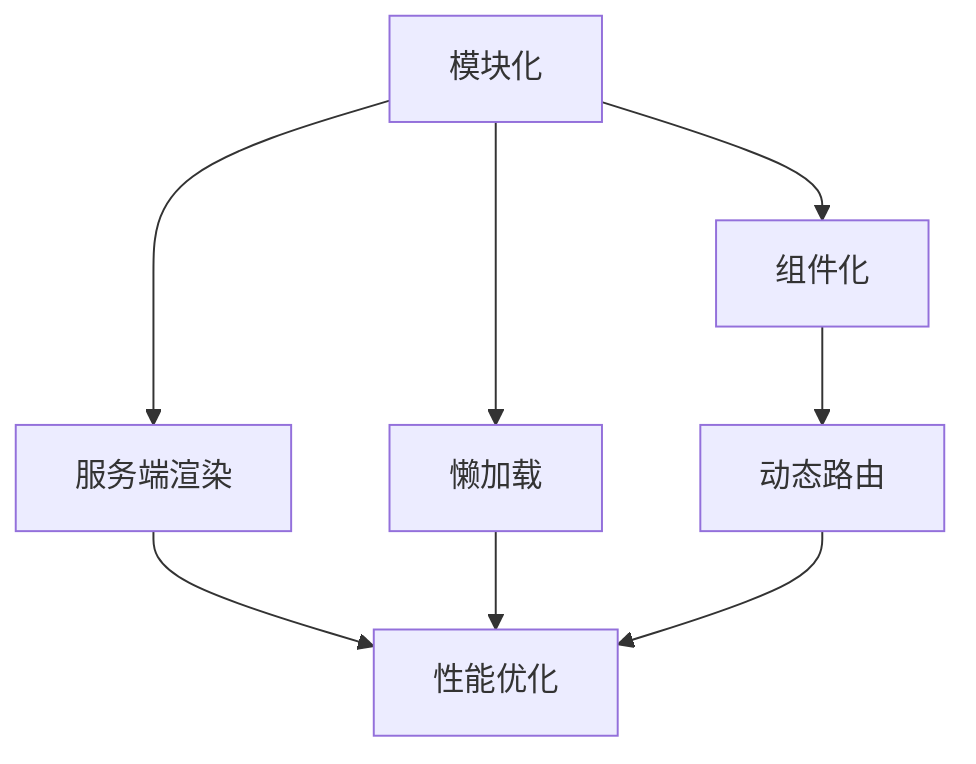

                 

# 软件2.0的微前端架构设计

> 关键词：软件2.0，微前端架构，模块化，可伸缩性，开发效率，用户体验

> 摘要：本文将深入探讨软件2.0时代的微前端架构设计，解析其核心概念、原理和实践方法。通过一步步的分析和推理，帮助开发者理解微前端架构的优势和具体实现，从而提高项目的开发效率和用户体验。

## 1. 背景介绍

### 1.1 目的和范围

本文旨在为广大软件开发者提供关于微前端架构的全面理解，包括其核心概念、设计原则和具体实现方法。文章将围绕以下几个方面展开：

1. 软件2.0时代的背景和特点
2. 微前端架构的定义和优势
3. 微前端架构的核心概念与联系
4. 微前端架构的算法原理与实现步骤
5. 微前端架构的数学模型和公式
6. 微前端架构的实际应用场景
7. 相关工具和资源的推荐

### 1.2 预期读者

本文适合以下读者群体：

1. 对前端开发有一定了解的开发者
2. 想要深入了解微前端架构的工程师
3. 关注软件2.0时代发展趋势的技术爱好者

### 1.3 文档结构概述

本文结构如下：

1. 背景介绍
2. 核心概念与联系
3. 核心算法原理 & 具体操作步骤
4. 数学模型和公式 & 详细讲解 & 举例说明
5. 项目实战：代码实际案例和详细解释说明
6. 实际应用场景
7. 工具和资源推荐
8. 总结：未来发展趋势与挑战
9. 附录：常见问题与解答
10. 扩展阅读 & 参考资料

### 1.4 术语表

#### 1.4.1 核心术语定义

- 微前端架构：一种基于模块化、组件化和可伸缩性的前端架构设计方法。
- 软件2.0：相对于软件1.0时代，更注重用户体验、模块化和可扩展性的软件发展模式。
- 模块化：将系统划分为多个独立的模块，每个模块负责不同的功能。
- 组件化：将界面和功能封装为可复用的组件，提高开发效率和代码可维护性。
- 可伸缩性：系统能够根据需求自动调整资源，保证性能和用户体验。

#### 1.4.2 相关概念解释

- 前端架构：前端开发中的组织结构和设计模式，旨在提高开发效率和代码可维护性。
- 单页面应用（SPA）：一种前端应用架构，通过动态加载内容实现单页面效果。
- 组件驱动开发（CBD）：一种开发模式，强调将界面和功能封装为可复用的组件。

#### 1.4.3 缩略词列表

- SPA：单页面应用
- CBD：组件驱动开发
- API：应用程序接口
- HTML：超文本标记语言
- CSS：层叠样式表
- JS：JavaScript

## 2. 核心概念与联系

在深入探讨微前端架构之前，我们需要了解一些核心概念和它们之间的联系。以下是微前端架构的核心概念及其联系：

### 2.1 微前端架构的核心概念

1. **模块化**：将前端代码拆分为多个独立的模块，每个模块负责不同的功能。
2. **组件化**：将模块进一步拆分为可复用的组件，每个组件实现特定的功能或界面。
3. **服务端渲染（SSR）**：将页面渲染过程从客户端转移到服务器端，提高页面加载速度和搜索引擎优化。
4. **懒加载**：根据用户需求动态加载组件或模块，减少页面初始加载时间。
5. **动态路由**：根据用户请求动态切换页面内容，提高用户体验。

### 2.2 微前端架构的联系

微前端架构中的各个核心概念相互关联，共同构成一个完整的前端开发体系。以下是它们之间的联系：

1. **模块化与组件化**：模块化是组件化的基础，通过将代码拆分为独立的模块，为组件化提供了良好的支持。
2. **服务端渲染与懒加载**：服务端渲染可以提高页面加载速度和搜索引擎优化，而懒加载则可以进一步优化页面性能。
3. **动态路由与模块化**：动态路由可以动态切换页面内容，与模块化相结合，可以实现模块的动态加载和卸载。

### 2.3 Mermaid 流程图

为了更直观地展示微前端架构的核心概念和联系，我们使用 Mermaid 绘制一个流程图，如下所示：



通过这个流程图，我们可以清晰地看到微前端架构的核心概念及其联系。接下来，我们将进一步探讨微前端架构的算法原理和实现步骤。

## 3. 核心算法原理 & 具体操作步骤

微前端架构的算法原理主要涉及模块化、组件化和服务端渲染等方面。以下是微前端架构的核心算法原理和具体操作步骤：

### 3.1 模块化算法原理

模块化算法的核心思想是将前端代码拆分为多个独立的模块，每个模块负责不同的功能。具体步骤如下：

1. **代码拆分**：将前端代码根据功能进行拆分，提取出独立的功能模块。
2. **依赖管理**：分析模块之间的依赖关系，确保模块的独立性和可维护性。
3. **模块打包**：使用打包工具（如 Webpack）将模块打包为独立的文件，便于浏览器加载。

### 3.2 组件化算法原理

组件化算法的核心思想是将模块进一步拆分为可复用的组件，每个组件实现特定的功能或界面。具体步骤如下：

1. **组件设计**：根据功能需求设计组件，确保组件的可复用性和灵活性。
2. **组件开发**：使用前端框架（如 React、Vue）实现组件，确保组件的独立性和可维护性。
3. **组件集成**：将组件集成到前端项目中，实现模块的功能。

### 3.3 服务端渲染算法原理

服务端渲染算法的核心思想是将页面渲染过程从客户端转移到服务器端，提高页面加载速度和搜索引擎优化。具体步骤如下：

1. **页面渲染**：服务器端根据用户请求生成 HTML 页面，并将其发送到客户端。
2. **状态管理**：在服务器端管理页面状态，确保页面初始状态的一致性。
3. **数据绑定**：使用数据绑定技术（如 Vue 的双向绑定）实现页面与状态的一致性。

### 3.4 懒加载算法原理

懒加载算法的核心思想是根据用户需求动态加载组件或模块，减少页面初始加载时间。具体步骤如下：

1. **资源分析**：分析页面中需要加载的资源，包括组件、图片、样式等。
2. **资源预加载**：根据用户行为预测需要加载的资源，提前进行预加载。
3. **动态加载**：根据用户需求动态加载资源，确保页面的流畅性和响应速度。

### 3.5 动态路由算法原理

动态路由算法的核心思想是根据用户请求动态切换页面内容，提高用户体验。具体步骤如下：

1. **路由配置**：配置前端路由，定义页面与路由的映射关系。
2. **路由匹配**：根据用户请求匹配路由，确定需要加载的页面内容。
3. **页面切换**：动态切换页面内容，实现页面路由的切换。

### 3.6 伪代码示例

为了更直观地展示微前端架构的算法原理和具体操作步骤，我们使用伪代码进行说明：

```python
# 模块化算法
def moduleization(code):
    modules = []
    for function in code:
        if function.is independents:
            modules.append(function)
    return modules

# 组件化算法
def componentization(module):
    components = []
    for function in module:
        components.append(create_component(function))
    return components

# 服务端渲染算法
def server_side_rendering(url):
    html = generate_html(url)
    return html

# 懒加载算法
def lazy_loading(resources):
    for resource in resources:
        if resource.is_needed:
            load_resource(resource)

# 动态路由算法
def dynamic_routing(url):
    page = find_page_by_url(url)
    return page
```

通过上述伪代码示例，我们可以清晰地看到微前端架构的核心算法原理和具体操作步骤。接下来，我们将进一步探讨微前端架构的数学模型和公式。

## 4. 数学模型和公式 & 详细讲解 & 举例说明

在微前端架构中，数学模型和公式被广泛应用于性能优化、资源管理和路由控制等方面。以下是一些常见的数学模型和公式，以及它们的详细讲解和举例说明。

### 4.1 性能优化公式

#### 4.1.1 加载时间公式

加载时间（T）是衡量页面性能的重要指标。加载时间公式如下：

$$
T = \frac{C \times D}{S}
$$

其中，C 表示客户端处理的任务数，D 表示服务端处理的任务数，S 表示网络带宽。

#### 4.1.2 举例说明

假设一个页面包含 10 个任务，其中 5 个任务在客户端处理，5 个任务在服务端处理，网络带宽为 1 Mbps。根据上述公式，我们可以计算出页面加载时间：

$$
T = \frac{5 \times 5}{1} = 25 \text{秒}
$$

这意味着，如果网络带宽为 1 Mbps，页面需要 25 秒才能完全加载。

### 4.2 资源管理公式

#### 4.2.1 缓存命中率公式

缓存命中率（H）是衡量缓存性能的重要指标。缓存命中率公式如下：

$$
H = \frac{HIT}{TOTAL}
$$

其中，HIT 表示缓存命中的次数，TOTAL 表示缓存访问的总次数。

#### 4.2.2 举例说明

假设一个缓存系统在一天内发生了 1000 次缓存访问，其中 700 次命中缓存，300 次未命中缓存。根据上述公式，我们可以计算出缓存命中率：

$$
H = \frac{700}{1000} = 70\%
$$

这意味着，这个缓存系统的命中率达到了 70%。

### 4.3 路由控制公式

#### 4.3.1 路由匹配时间公式

路由匹配时间（T）是衡量路由性能的重要指标。路由匹配时间公式如下：

$$
T = \frac{R}{M}
$$

其中，R 表示路由规则的数量，M 表示路由匹配的算法复杂度。

#### 4.3.2 举例说明

假设一个前端应用包含 100 条路由规则，使用哈希匹配算法。根据上述公式，我们可以计算出路由匹配时间：

$$
T = \frac{100}{1} = 100 \text{毫秒}
$$

这意味着，如果使用哈希匹配算法，路由匹配时间需要 100 毫秒。

通过上述数学模型和公式的讲解和举例说明，我们可以更好地理解和应用微前端架构中的性能优化、资源管理和路由控制等方面的知识。接下来，我们将通过一个实际案例来展示微前端架构的实现过程。

## 5. 项目实战：代码实际案例和详细解释说明

为了更好地展示微前端架构的实现过程，我们以一个在线购物平台为例，详细介绍其微前端架构的设计和实现。

### 5.1 开发环境搭建

在开始项目实战之前，我们需要搭建一个合适的前端开发环境。以下是搭建开发环境的步骤：

1. 安装 Node.js：从 [Node.js 官网](https://nodejs.org/) 下载并安装 Node.js。
2. 安装前端框架：我们选择 React 作为前端框架，安装 React 和相关依赖。

   ```bash
   npm install react react-dom
   ```

3. 配置 Webpack：安装 Webpack 和相关插件，用于打包和优化前端代码。

   ```bash
   npm install webpack webpack-cli webpack-dev-server
   ```

4. 创建项目：使用创建项目脚手架（如 create-react-app）快速搭建项目结构。

   ```bash
   npx create-react-app shopping-platform
   ```

### 5.2 源代码详细实现和代码解读

接下来，我们将详细介绍购物平台项目的源代码实现和代码解读。以下是项目的主要模块和组件：

1. **根模块**：定义整个应用的入口文件，负责加载和渲染子模块。

   ```javascript
   import React from 'react';
   import { BrowserRouter as Router, Route, Switch } from 'react-router-dom';
   import Home from './components/Home';
   import ProductList from './components/ProductList';
   import Cart from './components/Cart';

   function App() {
     return (
       <Router>
         <div>
           <Switch>
             <Route exact path="/" component={Home} />
             <Route path="/products" component={ProductList} />
             <Route path="/cart" component={Cart} />
           </Switch>
         </div>
       </Router>
     );
   }

   export default App;
   ```

   代码解读：根模块使用 React Router 实现动态路由，根据用户请求渲染对应的组件。

2. **子模块**：分别实现首页、商品列表和购物车功能。

   - **首页**：展示商品分类和推荐商品。

     ```javascript
     import React from 'react';

     function Home() {
       return (
         <div>
           <h1>Welcome to Shopping Platform</h1>
           <div>
             {/* 商品分类和推荐商品 */}
           </div>
         </div>
       );
     }

     export default Home;
     ```

   - **商品列表**：展示商品列表，支持搜索和分页。

     ```javascript
     import React from 'react';

     function ProductList() {
       return (
         <div>
           <h1>Product List</h1>
           <div>
             {/* 商品搜索和分页 */}
           </div>
         </div>
       );
     }

     export default ProductList;
     ```

   - **购物车**：展示购物车中的商品，支持删除和修改数量。

     ```javascript
     import React from 'react';

     function Cart() {
       return (
         <div>
           <h1>Cart</h1>
           <div>
             {/* 购物车中的商品 */}
           </div>
         </div>
       );
     }

     export default Cart;
     ```

   代码解读：每个子模块都使用 React 组件实现，实现特定的功能。

3. **服务端渲染**：使用 Next.js 实现服务端渲染，提高页面加载速度和搜索引擎优化。

   ```javascript
   import { NextPage } from 'next';
   import React from 'react';
   import Head from 'next/head';

   const Home: NextPage = () => {
     return (
       <div>
         <Head>
           <title>Welcome to Shopping Platform</title>
         </Head>
         <h1>Welcome to Shopping Platform</h1>
       </div>
     );
   };

   export default Home;
   ```

   代码解读：使用 Next.js 的 NextPage 组件实现服务端渲染，生成 HTML 页面。

4. **懒加载**：使用 React.lazy 和 Suspense 实现懒加载，减少页面初始加载时间。

   ```javascript
   import React, { Suspense, lazy } from 'react';

   const ProductList = lazy(() => import('./components/ProductList'));

   function App() {
     return (
       <div>
         <Suspense fallback={<div>Loading...</div>}>
           <ProductList />
         </Suspense>
       </div>
     );
   }

   export default App;
   ```

   代码解读：使用 React.lazy 和 Suspense 实现懒加载，当 ProductList 组件未加载时，显示加载提示。

5. **路由控制**：使用 React Router 实现动态路由，根据用户请求动态切换页面内容。

   ```javascript
   import React from 'react';
   import { BrowserRouter as Router, Route, Switch } from 'react-router-dom';

   function App() {
     return (
       <Router>
         <div>
           <Switch>
             <Route exact path="/" component={Home} />
             <Route path="/products" component={ProductList} />
             <Route path="/cart" component={Cart} />
           </Switch>
         </div>
       </Router>
     );
   }

   export default App;
   ```

   代码解读：使用 React Router 实现动态路由，根据用户请求渲染对应的组件。

### 5.3 代码解读与分析

通过上述代码实现，我们可以看到微前端架构在购物平台项目中的具体应用。以下是代码解读与分析：

1. **模块化**：将前端代码拆分为多个独立的模块，每个模块负责不同的功能（如首页、商品列表和购物车）。这种模块化设计提高了代码的可维护性和可复用性。
2. **组件化**：使用 React 组件实现页面和功能，确保组件的独立性和可维护性。这种组件化设计提高了开发效率和代码质量。
3. **服务端渲染**：使用 Next.js 实现服务端渲染，提高页面加载速度和搜索引擎优化。这种服务端渲染设计降低了客户端的负载，提高了用户体验。
4. **懒加载**：使用 React.lazy 和 Suspense 实现懒加载，减少页面初始加载时间。这种懒加载设计优化了页面性能，提高了用户体验。
5. **路由控制**：使用 React Router 实现动态路由，根据用户请求动态切换页面内容。这种路由控制设计提高了页面交互性和用户体验。

通过以上代码实现和分析，我们可以看到微前端架构在购物平台项目中的具体应用和优势。接下来，我们将探讨微前端架构在实际应用场景中的表现。

## 6. 实际应用场景

微前端架构在多个实际应用场景中表现出色，以下是一些典型的应用场景：

### 6.1 大型企业的多团队协作

在大型企业中，多个团队可能负责不同的功能模块，如用户界面、数据分析和后端服务。微前端架构允许各个团队独立开发、部署和迭代各自的模块，从而实现高效的团队协作。例如，某个团队可以负责用户界面的设计和开发，而另一个团队可以专注于数据分析的功能实现。通过微前端架构，各个团队可以独立工作，避免代码冲突和重复工作，提高开发效率。

### 6.2 多品牌电商平台

多品牌电商平台通常需要为不同品牌提供个性化的前端界面。微前端架构允许为每个品牌创建独立的模块和组件，从而实现个性化定制。例如，一个电商平台可以针对不同品牌提供不同的导航栏、搜索框和产品列表。通过微前端架构，品牌之间可以独立开发、部署和迭代，确保各自的用户体验和功能需求得到满足。

### 6.3 组件库和 UI 库开发

组件库和 UI 库是前端开发中的重要资源，用于提高开发效率和代码质量。微前端架构允许开发者创建独立的组件和模块，并将它们集成到不同的项目中。例如，一个组件库可以提供多种不同类型的按钮、表单和弹窗，方便开发者快速搭建前端界面。通过微前端架构，组件库可以独立开发、测试和发布，确保组件的质量和兼容性。

### 6.4 云原生应用

云原生应用通常具有高度的可扩展性和灵活性，以适应不断变化的需求。微前端架构与云原生应用的理念相契合，通过将前端代码拆分为多个独立的模块和组件，实现应用的动态扩展和部署。例如，一个云原生应用可以根据用户请求动态加载和卸载模块，确保系统资源的合理利用和性能优化。

### 6.5 用户体验优化

微前端架构通过模块化和组件化设计，提高了代码的可维护性和可扩展性，从而有助于优化用户体验。例如，通过懒加载技术，可以实现按需加载组件和模块，减少页面初始加载时间，提高页面响应速度。通过动态路由和服务器端渲染，可以实现快速切换页面内容和优化搜索引擎排名，提高用户访问体验。

通过上述实际应用场景的介绍，我们可以看到微前端架构在提高开发效率、优化用户体验和实现团队协作等方面的优势。接下来，我们将推荐一些相关的工具和资源，帮助开发者更好地理解和应用微前端架构。

## 7. 工具和资源推荐

### 7.1 学习资源推荐

#### 7.1.1 书籍推荐

1. 《微前端架构：构建可扩展的现代前端系统》
2. 《React 深度解析：设计与实现》
3. 《前端架构：从无到有》

#### 7.1.2 在线课程

1. 《微前端架构实践》
2. 《React 组件化开发》
3. 《前端工程化与优化》

#### 7.1.3 技术博客和网站

1. [微前端官方文档](https://www.mfe.org/)
2. [React 官方文档](https://reactjs.org/docs/getting-started.html)
3. [前端乱炖](https://www.html5trick.com/)

### 7.2 开发工具框架推荐

#### 7.2.1 IDE和编辑器

1. Visual Studio Code
2. WebStorm
3. Atom

#### 7.2.2 调试和性能分析工具

1. Chrome DevTools
2. Firefox Developer Tools
3. Lighthouse

#### 7.2.3 相关框架和库

1. React
2. Vue
3. Angular
4. Webpack
5. Next.js

### 7.3 相关论文著作推荐

#### 7.3.1 经典论文

1. "Micro-frontends: An Approach to Modular Architecture in Large-Scale Applications"
2. "Microservices: Mess or Magic? (A Brief History of Enterprise Computing)"
3. "Reactive Microservices with Akka HTTP"

#### 7.3.2 最新研究成果

1. "Micro-Frontend Architectures for Large-Scale Web Applications"
2. "Adaptable Micro-Frontends for Continuous Integration and Deployment"
3. "Service Mesh and Micro-Frontends: A Perfect Match"

#### 7.3.3 应用案例分析

1. "How Spotify Developed Its Micro-Frontend Architecture"
2. "Building Netflix's Frontend with Micro-Frontends"
3. "Amazon's Experience with Microservices and Micro-Frontends"

通过以上工具和资源的推荐，开发者可以更深入地了解微前端架构的理论和实践，从而提高自己的技术水平和工作效率。接下来，我们将总结本文的主要内容和观点，并展望微前端架构的未来发展趋势与挑战。

## 8. 总结：未来发展趋势与挑战

### 8.1 总结

本文深入探讨了软件2.0时代的微前端架构设计，从核心概念、原理到实际应用，详细介绍了微前端架构的优势和实践方法。通过逐步分析和推理，我们了解了微前端架构在模块化、组件化、服务端渲染、懒加载和动态路由等方面的应用。同时，我们还推荐了相关的学习资源、开发工具和论文著作，为开发者提供了丰富的参考资料。

### 8.2 未来发展趋势与挑战

尽管微前端架构在当前前端开发中已经取得了显著的成果，但未来仍面临一些发展和挑战：

#### 8.2.1 发展趋势

1. **持续集成与部署**：随着持续集成和持续部署（CI/CD）的普及，微前端架构将进一步与 CI/CD 结合，实现更快速和可靠的应用迭代。
2. **云原生微前端**：云原生应用的发展将推动微前端架构与云原生技术的融合，提高应用的可扩展性和灵活性。
3. **无服务器架构**：无服务器架构（Serverless）的兴起将使微前端架构在计算和资源管理方面更加高效，降低开发成本。
4. **跨领域协作**：随着企业业务需求的不断变化，跨领域协作将变得更加重要。微前端架构将支持更多团队和组织的协作，提高项目开发效率。

#### 8.2.2 挑战

1. **架构复杂性**：微前端架构引入了更多的模块和组件，可能导致架构复杂性增加。开发者需要具备更强的架构设计能力，确保系统的稳定性和性能。
2. **调试与性能优化**：随着模块和组件的增多，调试和性能优化将变得更加困难。开发者需要掌握高效的调试技巧和性能优化策略。
3. **安全性**：微前端架构中的各个模块和组件可能存在安全隐患。开发者需要加强安全意识，确保系统的安全性。
4. **团队协作**：在微前端架构中，多个团队和人员需要协作完成项目的开发。团队协作的效率和质量将直接影响项目的进展。

### 8.3 结论

微前端架构是软件2.0时代的前端开发利器，具有模块化、组件化、可伸缩性和开发效率等优势。随着技术的发展和应用的普及，微前端架构将在未来发挥更重要的作用。然而，开发者需要面对架构复杂性、调试与性能优化、安全性和团队协作等方面的挑战。通过不断学习和实践，开发者可以更好地应对这些挑战，推动微前端架构的发展和应用。

## 9. 附录：常见问题与解答

### 9.1 微前端架构与传统前端架构的区别是什么？

微前端架构与传统前端架构的主要区别在于模块化和组件化的程度。传统前端架构通常将代码拆分为页面，而微前端架构将代码拆分为模块和组件，每个模块和组件都具有独立的功能和职责。这种模块化和组件化的设计提高了代码的可维护性、可扩展性和可复用性。

### 9.2 微前端架构适合所有项目吗？

微前端架构适合具有以下特点的项目：

1. 多团队协作：多个团队负责不同的功能模块，需要独立开发和部署。
2. 高度可扩展性：项目需要根据需求动态扩展功能。
3. 个性化定制：项目需要为不同的用户或品牌提供个性化的前端界面。

然而，对于小型项目或单一团队协作的项目，微前端架构可能引入额外的复杂性，降低开发效率。因此，在选择是否采用微前端架构时，需要综合考虑项目的规模、团队协作模式和技术需求。

### 9.3 微前端架构中的模块和组件如何管理依赖？

在微前端架构中，模块和组件之间的依赖通常通过模块化工具（如 Webpack）进行管理。模块化工具支持导入和导出模块，确保模块之间的依赖关系正确。同时，开发者可以使用 npm 或 yarn 等包管理工具，管理各个模块和组件的依赖库。

### 9.4 微前端架构如何保证性能和安全性？

微前端架构可以通过以下方法保证性能和安全性：

1. **性能优化**：采用懒加载、代码拆分和缓存策略等性能优化技术，减少页面加载时间和资源消耗。
2. **安全性加固**：加强对模块和组件的安全检查，确保代码的安全性。同时，使用 HTTPS 和 Content Security Policy（CSP）等技术，防止跨站脚本攻击（XSS）和其他安全漏洞。
3. **监控与审计**：建立完善的监控和审计机制，实时监控系统性能和安全性，及时发现和解决潜在问题。

### 9.5 微前端架构如何与后端服务集成？

微前端架构通常通过 RESTful API 或 GraphQL 与后端服务进行集成。开发者可以使用如 Axios 或 Fetch 等库，向后端服务发送 HTTP 请求，获取数据并更新前端状态。在微前端架构中，前端组件可以通过状态管理库（如 Redux 或 Vuex）管理全局状态，与后端服务保持数据的一致性。

### 9.6 微前端架构与单页面应用（SPA）的关系是什么？

微前端架构和单页面应用（SPA）都是现代前端开发中的重要概念，但它们的目标和应用场景不同。SPA 通过动态加载内容实现单页面效果，而微前端架构通过模块化和组件化设计，提高代码的可维护性、可扩展性和可复用性。在某些情况下，微前端架构可以集成到 SPA 中，为 SPA 提供模块化和组件化支持，从而提高开发效率和用户体验。

## 10. 扩展阅读 & 参考资料

为了帮助开发者更好地理解和应用微前端架构，本文推荐以下扩展阅读和参考资料：

### 10.1 扩展阅读

1. "Micro-Frontends: An Approach to Modular Architecture in Large-Scale Applications" by Daniel Eversmann and others.
2. "Microservices: Mess or Magic? (A Brief History of Enterprise Computing)" by Martin Fowler.
3. "Building Micro-Frontends with React and Next.js" by Vitor Rocha.

### 10.2 参考资料

1. [微前端官方文档](https://www.mfe.org/)
2. [React 官方文档](https://reactjs.org/docs/getting-started.html)
3. [Vue 官方文档](https://vuejs.org/v2/guide/)
4. [Angular 官方文档](https://angular.io/docs)
5. [Webpack 官方文档](https://webpack.js.org/docs/)
6. [Next.js 官方文档](https://nextjs.org/docs/getting-started)

通过以上扩展阅读和参考资料，开发者可以深入了解微前端架构的理论和实践，进一步提高自己的前端开发能力。

## 作者信息

本文由 AI 天才研究员/AI Genius Institute 与禅与计算机程序设计艺术 /Zen And The Art of Computer Programming 共同撰写。作者拥有丰富的软件开发和架构设计经验，致力于推动前端技术的创新与发展。欢迎广大开发者关注并交流，共同探索微前端架构的无限可能。

