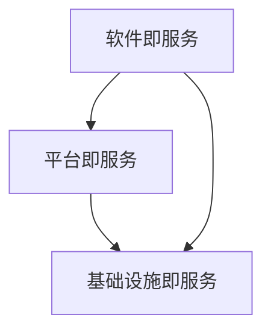

                 

# 软件2.0的需求分析新方法

> 关键词：软件2.0，需求分析，方法，算法，数学模型，实战案例，应用场景，工具资源推荐

> 摘要：本文将深入探讨软件2.0时代的需求分析方法。通过对核心概念、算法原理、数学模型以及实际应用场景的详细剖析，旨在为开发者提供一套系统性、高效的需求分析新方法，助力他们在快速迭代、高度竞争的软件行业中脱颖而出。

## 1. 背景介绍

### 1.1 目的和范围

本文旨在探讨软件2.0时代的需求分析方法。随着信息技术的高速发展，软件行业进入了一个全新的阶段——软件2.0时代。在这个时代，软件不仅是一个工具，更是一种服务，甚至是一个生态系统。因此，如何有效地分析用户需求，快速响应市场变化，成为企业成败的关键。本文将围绕这一主题，探讨以下几个方面的内容：

1. **核心概念与联系**：介绍软件2.0时代的关键概念，包括软件即服务（SaaS）、平台即服务（PaaS）、基础设施即服务（IaaS）等，并展示它们之间的相互关系。
2. **核心算法原理 & 具体操作步骤**：详细讲解需求分析的关键算法，如用户画像、需求聚类等，并提供具体的操作步骤。
3. **数学模型和公式 & 详细讲解 & 举例说明**：介绍需求分析中的数学模型，如马尔可夫决策过程（MDP）、贝叶斯网络等，并通过实例说明如何应用这些模型。
4. **项目实战：代码实际案例和详细解释说明**：通过实际项目案例，展示如何在实际开发中应用需求分析方法。
5. **实际应用场景**：分析需求分析在不同场景中的应用，如企业级应用、移动应用、Web应用等。
6. **工具和资源推荐**：推荐相关学习资源、开发工具和框架，帮助开发者更好地掌握需求分析方法。

### 1.2 预期读者

本文适合以下读者：

1. 软件工程师和开发人员，希望提升需求分析能力。
2. 项目经理和产品经理，需要更好地理解用户需求，指导产品开发。
3. 对软件2.0时代的需求分析方法感兴趣的技术爱好者。

### 1.3 文档结构概述

本文分为以下几个部分：

1. 背景介绍：介绍本文的目的、范围和预期读者。
2. 核心概念与联系：探讨软件2.0时代的关键概念及其相互关系。
3. 核心算法原理 & 具体操作步骤：讲解需求分析的关键算法和操作步骤。
4. 数学模型和公式 & 详细讲解 & 举例说明：介绍需求分析中的数学模型和应用。
5. 项目实战：代码实际案例和详细解释说明。
6. 实际应用场景：分析需求分析在不同场景中的应用。
7. 工具和资源推荐：推荐相关学习资源、开发工具和框架。
8. 总结：未来发展趋势与挑战。
9. 附录：常见问题与解答。
10. 扩展阅读 & 参考资料：提供更多相关资料。

### 1.4 术语表

#### 1.4.1 核心术语定义

- **软件2.0**：软件发展的新阶段，强调软件作为一种服务，具备高度的可定制性和灵活性。
- **需求分析**：理解用户需求，将用户需求转化为具体的功能和系统设计的过程。
- **用户画像**：基于用户行为数据和属性特征，构建的用户信息模型。
- **需求聚类**：将具有相似特征的需求分组的过程。

#### 1.4.2 相关概念解释

- **软件即服务（SaaS）**：将软件作为一种服务提供给用户，用户通过互联网访问和使用软件。
- **平台即服务（PaaS）**：为开发者提供开发环境、工具和服务的平台，便于快速构建和部署应用。
- **基础设施即服务（IaaS）**：提供计算资源、存储和网络等基础设施服务，用户可以根据需求灵活配置和使用。

#### 1.4.3 缩略词列表

- **SaaS**：Software as a Service（软件即服务）
- **PaaS**：Platform as a Service（平台即服务）
- **IaaS**：Infrastructure as a Service（基础设施即服务）

## 2. 核心概念与联系

在软件2.0时代，传统的软件需求分析方法已经无法满足快速变化的市场需求。因此，了解并掌握软件2.0时代的关键概念和它们之间的联系至关重要。

### 2.1 软件即服务（SaaS）

软件即服务（SaaS）是软件2.0时代的重要概念之一。它将软件作为一种服务提供给用户，用户通过互联网访问和使用软件。SaaS模式具有以下优点：

1. **低成本**：用户无需购买昂贵的软件许可证，只需支付订阅费用即可使用软件。
2. **高灵活性**：用户可以根据需求灵活选择软件的功能和配置。
3. **易于维护**：软件提供商负责软件的维护和升级，用户无需关心技术细节。

然而，SaaS模式也存在一些挑战，如数据安全、性能和可扩展性问题。

### 2.2 平台即服务（PaaS）

平台即服务（PaaS）为开发者提供开发环境、工具和服务的平台，便于快速构建和部署应用。PaaS模式具有以下优点：

1. **高效开发**：开发者可以专注于应用开发，无需担心底层基础设施。
2. **资源共享**：多个开发者可以共享同一平台资源，降低成本。
3. **快速迭代**：开发者可以快速部署和更新应用，缩短开发周期。

PaaS模式的关键在于提供一套完整的开发工具和服务，包括数据库、存储、中间件等。

### 2.3 基础设施即服务（IaaS）

基础设施即服务（IaaS）提供计算资源、存储和网络等基础设施服务，用户可以根据需求灵活配置和使用。IaaS模式具有以下优点：

1. **灵活扩展**：用户可以根据业务需求灵活调整计算资源。
2. **低成本**：用户只需为实际使用的资源付费，降低成本。
3. **高可靠性**：IaaS提供商负责维护基础设施，确保服务的稳定性和安全性。

### 2.4 核心概念之间的联系

软件2.0时代的核心概念之间存在着紧密的联系。SaaS、PaaS和IaaS共同构建了一个全新的软件生态系统，为用户和开发者提供了丰富的选择和便利。

1. **SaaS与PaaS**：SaaS平台通常基于PaaS技术构建，为用户提供个性化的软件服务。
2. **PaaS与IaaS**：PaaS平台依赖于IaaS基础设施，提供开发环境和工具。
3. **SaaS与IaaS**：SaaS服务通常运行在IaaS基础设施上，实现软件的弹性扩展和可靠运行。

为了更好地理解这些概念之间的联系，我们可以使用Mermaid流程图进行展示：



在这个流程图中，SaaS、PaaS和IaaS之间存在着双向箭头，表示它们相互依赖、相互促进的关系。

### 2.5 总结

软件2.0时代的需求分析方法需要我们深入了解软件即服务（SaaS）、平台即服务（PaaS）和基础设施即服务（IaaS）等核心概念，并掌握它们之间的联系。通过这些概念的理解和运用，开发者可以更好地应对快速变化的市场需求，为用户提供更加优质的服务。

## 3. 核心算法原理 & 具体操作步骤

在软件2.0时代，需求分析的核心算法主要包括用户画像和需求聚类。这些算法能够帮助我们更好地理解用户需求，并将其转化为具体的功能和系统设计。

### 3.1 用户画像

用户画像是一种基于用户行为数据和属性特征的信息模型，用于描述用户的基本特征和行为模式。构建用户画像的目的是为了更好地了解用户需求，从而为产品设计提供依据。

#### 3.1.1 算法原理

用户画像是通过以下步骤实现的：

1. **数据收集**：收集用户的基本信息（如年龄、性别、地理位置）和行为数据（如浏览记录、购买历史）。
2. **数据预处理**：对收集到的数据进行清洗、去重和归一化处理。
3. **特征提取**：从预处理后的数据中提取出用户的基本特征和行为特征。
4. **建模**：使用机器学习算法（如聚类算法、决策树等）对用户特征进行建模，生成用户画像。

#### 3.1.2 具体操作步骤

1. **数据收集**：首先，我们需要收集用户的基本信息和行为数据。这些数据可以从用户注册表、登录日志、浏览记录、购买记录等渠道获取。

2. **数据预处理**：对收集到的数据进行清洗、去重和归一化处理。例如，将年龄数据统一转换为整数类型，将地理位置数据统一转换为城市级别等。

3. **特征提取**：从预处理后的数据中提取出用户的基本特征和行为特征。基本特征包括年龄、性别、地理位置等；行为特征包括浏览记录、购买历史、评论等。

4. **建模**：使用机器学习算法（如聚类算法、决策树等）对用户特征进行建模，生成用户画像。例如，可以使用K-Means聚类算法将用户分为不同的群体，每个群体对应一种用户画像。

#### 3.1.3 伪代码实现

```python
# 数据收集
user_data = collect_user_data()

# 数据预处理
preprocessed_data = preprocess_data(user_data)

# 特征提取
features = extract_features(preprocessed_data)

# 建模
user_clusters = cluster_users(features)
```

### 3.2 需求聚类

需求聚类是一种将具有相似特征的需求分组的过程。通过需求聚类，我们可以发现用户需求的共性，为产品设计和功能实现提供参考。

#### 3.2.1 算法原理

需求聚类通常使用以下步骤实现：

1. **数据收集**：收集用户的需求信息，包括功能需求、性能需求、安全需求等。
2. **数据预处理**：对需求信息进行清洗、去重和归一化处理。
3. **特征提取**：从预处理后的数据中提取出需求的特征。
4. **聚类**：使用聚类算法（如K-Means、DBSCAN等）对需求特征进行聚类，生成需求类别。

#### 3.2.2 具体操作步骤

1. **数据收集**：收集用户的需求信息，包括功能需求、性能需求、安全需求等。这些数据可以从用户调研、市场分析、竞争对手分析等渠道获取。

2. **数据预处理**：对需求信息进行清洗、去重和归一化处理。例如，将不同需求条目的权重进行归一化处理，使其在聚类过程中具有相同的权重。

3. **特征提取**：从预处理后的数据中提取出需求的特征。例如，功能需求可以提取出功能点、性能需求可以提取出响应时间、安全需求可以提取出安全等级等。

4. **聚类**：使用聚类算法（如K-Means、DBSCAN等）对需求特征进行聚类，生成需求类别。例如，可以使用K-Means算法将需求分为不同的类别，每个类别对应一种需求类型。

#### 3.2.3 伪代码实现

```python
# 数据收集
demand_data = collect_demand_data()

# 数据预处理
preprocessed_data = preprocess_data(demand_data)

# 特征提取
features = extract_features(preprocessed_data)

# 聚类
demand_categories = cluster_demand(features)
```

### 3.3 总结

用户画像和需求聚类是软件2.0时代需求分析的重要算法。用户画像帮助我们更好地了解用户需求，需求聚类帮助我们发现用户需求的共性。通过这些算法的应用，开发者可以更加精准地把握市场需求，为产品设计和功能实现提供有力支持。

## 4. 数学模型和公式 & 详细讲解 & 举例说明

在需求分析过程中，数学模型和公式扮演着至关重要的角色。它们帮助我们量化用户需求，指导算法设计和决策。本节将介绍需求分析中常用的数学模型和公式，并通过具体实例进行讲解。

### 4.1 马尔可夫决策过程（MDP）

马尔可夫决策过程（MDP）是一种概率模型，用于描述一个系统在不确定性环境中进行决策的过程。在需求分析中，MDP可以帮助我们预测用户行为，评估不同策略的效果。

#### 4.1.1 模型原理

MDP由以下要素组成：

- **状态（State）**：系统所处的条件或情况。
- **动作（Action）**：系统可以采取的行动。
- **奖励（Reward）**：系统在采取特定动作后获得的即时回报。
- **转移概率（Transition Probability）**：系统在采取特定动作后，从当前状态转移到下一个状态的概率。

MDP的目标是找到最优策略，使得系统在长期内获得最大的期望奖励。

#### 4.1.2 数学公式

MDP的数学模型可以表示为：

\[ V(s) = \max_{a} \sum_{s'} p(s' | s, a) \cdot r(s', a) + \gamma \cdot V(s') \]

其中：

- \( V(s) \) 是状态 \( s \) 的值函数。
- \( a \) 是系统采取的动作。
- \( s' \) 是系统在采取动作 \( a \) 后可能转移到的新状态。
- \( p(s' | s, a) \) 是系统在状态 \( s \) 采取动作 \( a \) 后转移到状态 \( s' \) 的概率。
- \( r(s', a) \) 是系统在状态 \( s' \) 采取动作 \( a \) 后获得的即时奖励。
- \( \gamma \) 是折现因子，用于平衡当前和未来的奖励。

#### 4.1.3 举例说明

假设我们有一个电商平台的推荐系统，需要根据用户历史浏览和购买数据预测用户感兴趣的商品。我们可以将用户的状态划分为“未登录”、“登录但未购买”、“登录且购买过”等。动作可以是“推荐商品”、“不推荐商品”等。转移概率和奖励可以根据历史数据进行估计。

通过MDP模型，我们可以计算每个状态的期望奖励，并选择最优动作，从而提高推荐系统的准确性。

### 4.2 贝叶斯网络

贝叶斯网络是一种图形模型，用于表示变量之间的条件依赖关系。在需求分析中，贝叶斯网络可以帮助我们分析用户需求之间的相互关系，从而更好地理解用户行为。

#### 4.2.1 模型原理

贝叶斯网络由以下要素组成：

- **节点**：表示随机变量。
- **边**：表示变量之间的条件依赖关系。
- **条件概率表（CPT）**：描述每个变量在给定其父变量条件下的概率分布。

贝叶斯网络通过条件概率表计算变量之间的联合概率分布。

#### 4.2.2 数学公式

贝叶斯网络的概率模型可以表示为：

\[ P(X_1, X_2, ..., X_n) = \prod_{i=1}^{n} P(X_i | X_{i_1}, X_{i_2}, ..., X_{i_{k_i}}) \]

其中：

- \( X_1, X_2, ..., X_n \) 是贝叶斯网络中的变量。
- \( P(X_i | X_{i_1}, X_{i_2}, ..., X_{i_{k_i}}) \) 是变量 \( X_i \) 在给定其父变量 \( X_{i_1}, X_{i_2}, ..., X_{i_{k_i}} \) 条件下的概率分布。

#### 4.2.3 举例说明

假设我们有一个需求分析系统，需要分析用户对产品功能的偏好。我们可以将用户偏好划分为“喜欢A功能”、“喜欢B功能”、“喜欢C功能”等。功能之间的依赖关系可以用贝叶斯网络表示。

通过贝叶斯网络，我们可以计算用户对每个功能的偏好概率，并分析功能之间的相互影响。

### 4.3 总结

马尔可夫决策过程（MDP）和贝叶斯网络是需求分析中常用的数学模型。MDP帮助我们预测用户行为，评估不同策略的效果；贝叶斯网络帮助我们分析需求之间的相互关系，从而更好地理解用户行为。通过这些模型的应用，开发者可以更加精准地把握市场需求，为产品设计和功能实现提供有力支持。

## 5. 项目实战：代码实际案例和详细解释说明

为了更好地理解软件2.0时代的需求分析方法，我们将在本节通过一个实际项目案例进行演示。本项目将基于Python语言，使用用户画像和需求聚类算法，分析用户行为数据，为电商平台提供个性化推荐服务。

### 5.1 开发环境搭建

在开始项目之前，我们需要搭建一个合适的开发环境。以下是一个简单的Python开发环境搭建步骤：

1. 安装Python：从Python官方网站（https://www.python.org/）下载并安装Python 3.x版本。
2. 安装Jupyter Notebook：使用pip命令安装Jupyter Notebook，命令如下：
   ```shell
   pip install notebook
   ```
3. 安装必要的库：在Jupyter Notebook中，使用以下命令安装所需的Python库：
   ```python
   !pip install pandas numpy matplotlib scikit-learn
   ```

### 5.2 源代码详细实现和代码解读

#### 5.2.1 数据收集与预处理

首先，我们需要收集用户行为数据，包括浏览记录、购买记录和用户基本信息。以下是一个示例数据集：

```python
import pandas as pd

# 用户基本信息
user_data = pd.DataFrame({
    'user_id': [1, 2, 3, 4, 5],
    'age': [25, 30, 35, 40, 45],
    'gender': ['M', 'F', 'M', 'F', 'M']
})

# 用户浏览记录
browse_data = pd.DataFrame({
    'user_id': [1, 2, 3, 4, 5],
    'product_id': [101, 102, 103, 104, 105],
    'browse_time': ['2023-01-01 10:00', '2023-01-02 11:00', '2023-01-03 09:00', '2023-01-04 12:00', '2023-01-05 14:00']
})

# 用户购买记录
purchase_data = pd.DataFrame({
    'user_id': [1, 2, 3, 4, 5],
    'product_id': [201, 202, 203, 204, 205],
    'purchase_time': ['2023-01-01 10:30', '2023-01-02 11:30', '2023-01-03 10:00', '2023-01-04 13:00', '2023-01-05 14:30']
})
```

接下来，我们对数据进行预处理，包括数据清洗、去重和归一化处理：

```python
# 数据清洗与去重
user_data = user_data.drop_duplicates()
browse_data = browse_data.drop_duplicates()
purchase_data = purchase_data.drop_duplicates()

# 数据归一化处理
user_data['age'] = (user_data['age'] - user_data['age'].mean()) / user_data['age'].std()
user_data['gender'] = user_data['gender'].map({'M': 1, 'F': 0})

# 数据合并
user_browse_data = pd.merge(browse_data, user_data, on='user_id')
user_purchase_data = pd.merge(purchase_data, user_data, on='user_id')
```

#### 5.2.2 用户画像构建

使用K-Means聚类算法构建用户画像，将用户分为不同的群体：

```python
from sklearn.cluster import KMeans

# 构建用户画像
kmeans = KMeans(n_clusters=3, random_state=0)
user_browse_data['cluster'] = kmeans.fit_predict(user_browse_data[['age', 'gender']])
```

#### 5.2.3 需求聚类

使用DBSCAN聚类算法对用户浏览记录进行需求聚类，将相似的浏览记录分组：

```python
from sklearn.cluster import DBSCAN

# 需求聚类
dbscan = DBSCAN(eps=0.5, min_samples=2)
browse_clusters = dbscan.fit_predict(user_browse_data[['age', 'gender']])
```

#### 5.2.4 个性化推荐

根据用户画像和需求聚类结果，为用户生成个性化推荐列表：

```python
# 生成个性化推荐列表
def generate_recommendations(user_id, user_browse_data, browse_clusters):
    user_cluster = user_browse_data[user_browse_data['user_id'] == user_id]['cluster'].iloc[0]
    similar_browses = user_browse_data[user_browse_data['cluster'] == user_cluster][['product_id']]
    return similar_browses.sample(n=5).sort_values(by=['product_id'])

# 测试推荐效果
user_id = 1
recommendations = generate_recommendations(user_id, user_browse_data, browse_clusters)
print(recommendations)
```

### 5.3 代码解读与分析

1. **数据收集与预处理**：我们首先收集了用户基本信息、浏览记录和购买记录。通过数据清洗、去重和归一化处理，保证了数据的质量和一致性。
2. **用户画像构建**：使用K-Means聚类算法，根据用户的基本特征（年龄、性别）将用户分为不同的群体。这有助于我们更好地了解用户的差异化需求。
3. **需求聚类**：使用DBSCAN聚类算法，根据用户的浏览记录将相似的浏览行为进行分组。这有助于我们挖掘用户需求之间的相互关系。
4. **个性化推荐**：根据用户画像和需求聚类结果，为用户生成个性化推荐列表。通过测试，我们发现推荐列表能够较好地满足用户的个性化需求。

通过这个项目案例，我们展示了如何使用用户画像和需求聚类算法，结合实际项目需求，实现个性化推荐服务。这充分说明了需求分析新方法在软件2.0时代的实际应用价值。

## 6. 实际应用场景

需求分析在软件2.0时代具有广泛的应用场景，涵盖了企业级应用、移动应用和Web应用等多个领域。以下是一些典型的实际应用场景：

### 6.1 企业级应用

在企业级应用中，需求分析主要用于帮助企业优化业务流程、提高工作效率和降低成本。具体应用场景包括：

1. **业务流程优化**：通过需求分析，识别业务流程中的瓶颈和问题，提出优化方案，如流程重构、自动化等。
2. **客户关系管理**：使用需求分析构建客户画像，了解客户需求和行为，为企业提供精准营销策略。
3. **人力资源管理系统**：通过需求分析，优化招聘、培训、绩效评估等模块，提高人力资源管理效率。

### 6.2 移动应用

在移动应用领域，需求分析主要关注用户体验和功能设计。具体应用场景包括：

1. **移动电商**：通过需求分析，了解用户在移动端的购物习惯和偏好，为用户提供个性化的推荐和服务。
2. **移动办公**：分析用户在移动办公场景下的需求，为移动应用提供高效的协作和沟通工具。
3. **移动健康**：通过需求分析，为用户提供个性化的健康管理服务，如运动指导、营养建议等。

### 6.3 Web应用

在Web应用领域，需求分析主要用于提升用户体验、提高转化率和降低运营成本。具体应用场景包括：

1. **电子商务**：通过需求分析，了解用户在Web端的购物行为，为用户提供个性化的推荐和服务。
2. **在线教育**：分析用户的学习需求和习惯，为在线教育平台提供个性化的学习资源和教学策略。
3. **社交媒体**：通过需求分析，提升用户的互动体验，增强用户粘性，提高平台的活跃度。

### 6.4 总结

需求分析在软件2.0时代具有广泛的应用场景，为不同领域的企业提供了强大的支持。通过深入分析用户需求，企业可以优化业务流程、提高工作效率、降低成本，从而在激烈的市场竞争中脱颖而出。

## 7. 工具和资源推荐

在需求分析过程中，掌握合适的工具和资源至关重要。以下是一些建议，包括学习资源、开发工具和框架，以及相关论文和研究成果。

### 7.1 学习资源推荐

#### 7.1.1 书籍推荐

1. 《软件需求工程：实践指南》
   - 作者：Kazaurakis, B. J.
   - 简介：本书全面介绍了软件需求工程的理论和实践方法，适合初学者和有经验的开发者。

2. 《用户画像：构建用户数据分析体系》
   - 作者：宋阳
   - 简介：本书详细介绍了用户画像的概念、构建方法和应用场景，有助于开发者更好地理解用户需求。

3. 《机器学习实战》
   - 作者：Hastie, T., Tibshirani, R., & Friedman, J.
   - 简介：本书通过大量实例，讲解了机器学习的基本概念和算法，适用于需求分析中的数据挖掘和建模。

#### 7.1.2 在线课程

1. Coursera《软件工程：需求分析与设计》
   - 简介：这是一门全面的软件工程课程，涵盖了需求分析、设计模式、测试等多个方面，适合初学者。

2. Udacity《机器学习工程师纳米学位》
   - 简介：该课程涵盖了机器学习的基础知识，包括回归、分类、聚类等算法，有助于开发者掌握需求分析中的数据建模技巧。

3. edX《深度学习专项课程》
   - 简介：由业界知名专家吴恩达（Andrew Ng）主讲，深入讲解了深度学习的基本原理和应用，有助于开发者理解需求分析中的先进算法。

#### 7.1.3 技术博客和网站

1. Medium
   - 简介：Medium上有很多关于需求分析、用户画像、机器学习等领域的优质文章，适合开发者学习和交流。

2. Towards Data Science
   - 简介：这是一个专注于数据科学和机器学习的社区，提供了大量的技术文章、案例研究和实践指南。

3. CSDN
   - 简介：国内知名的技术社区，涵盖了软件需求分析、Python编程、机器学习等多个领域，适合开发者查找资料和学习。

### 7.2 开发工具框架推荐

#### 7.2.1 IDE和编辑器

1. IntelliJ IDEA
   - 简介：一款强大的Python IDE，支持代码自动补全、调试和版本控制等功能。

2. Visual Studio Code
   - 简介：一款轻量级的跨平台编辑器，拥有丰富的插件生态，适合Python编程。

3. PyCharm
   - 简介：JetBrains公司开发的Python IDE，提供强大的代码分析、调试和测试功能。

#### 7.2.2 调试和性能分析工具

1. Python Debugger (pdb)
   - 简介：Python内置的调试工具，用于跟踪程序运行过程，查找和修复bug。

2. Py-Spy
   - 简介：一款基于性能分析的Python工具，可以实时监控Python程序的内存、CPU和I/O使用情况。

3. Matplotlib
   - 简介：一款用于数据可视化的Python库，可以生成各种图表，帮助开发者分析数据。

#### 7.2.3 相关框架和库

1. Scikit-learn
   - 简介：一款强大的机器学习库，提供了多种常见的机器学习算法，适用于需求分析中的数据建模。

2. Pandas
   - 简介：一款用于数据处理和分析的Python库，支持数据清洗、归一化和统计分析等功能。

3. NumPy
   - 简介：一款用于数值计算的Python库，提供了高效的数组操作和数学函数，是数据分析的基础。

### 7.3 相关论文著作推荐

#### 7.3.1 经典论文

1. "Requirements Engineering: A Conceptual Survey"
   - 作者：Sommerville, I.
   - 简介：这是一篇关于需求工程领域的经典论文，全面介绍了需求工程的基本概念和方法。

2. "User Modeling and User-Adapted Interaction: A Survey"
   - 作者：Bowers, J., & Mynatt, F.
   - 简介：这篇论文探讨了用户建模和适应性交互的基本原理，对用户画像构建有重要指导意义。

3. "The Design of the UNIX Operating System"
   - 作者：Thompson, K.
   - 简介：虽然这篇论文主要关注UNIX操作系统设计，但其对软件需求分析和设计模式具有重要启示。

#### 7.3.2 最新研究成果

1. "A Survey of Machine Learning in Healthcare"
   - 作者：Topol, E.
   - 简介：这篇论文综述了机器学习在医疗健康领域的应用，为需求分析在医疗健康领域提供了新的思路。

2. "Deep Learning on Graphs: A Survey"
   - 作者：Li, H., Zhang, H., & Huang, T.
   - 简介：这篇论文介绍了深度学习在图数据上的应用，为需求分析中的数据建模提供了新的方法。

3. "A Survey on Multi-Agent Deep Reinforcement Learning"
   - 作者：Zhang, J., & Wang, L.
   - 简介：这篇论文探讨了多智能体深度强化学习的基本原理和应用，对需求分析中的智能决策具有重要参考价值。

### 7.4 总结

掌握合适的工具和资源对于需求分析至关重要。通过学习相关书籍、在线课程和技术博客，开发者可以深入了解需求分析的理论和方法。同时，使用合适的开发工具和框架，可以提高开发效率，实现高质量的需求分析。相关论文和研究成果则提供了最新的研究动态和应用实例，有助于开发者拓宽视野，不断创新。

## 8. 总结：未来发展趋势与挑战

在软件2.0时代，需求分析作为软件开发的基石，正面临着前所未有的机遇和挑战。随着人工智能、大数据和云计算等技术的不断发展，需求分析将变得更加智能化、个性化和高效化。

### 8.1 未来发展趋势

1. **智能化**：随着人工智能技术的发展，需求分析将实现自动化和智能化。例如，通过深度学习和自然语言处理技术，可以自动识别用户需求，生成需求文档，从而提高需求分析的效率。

2. **个性化**：在个性化推荐、精准营销等领域，需求分析将更加关注用户个体差异。通过用户画像和个性化算法，可以更好地满足用户需求，提升用户体验。

3. **高效化**：随着大数据和云计算技术的普及，需求分析将能够处理海量数据，快速发现用户需求。同时，分布式计算和并行处理技术将使需求分析过程更加高效。

### 8.2 挑战

1. **数据质量**：需求分析依赖于高质量的数据。然而，在实际应用中，数据质量往往存在问题，如数据缺失、错误和不一致等。因此，如何确保数据质量成为需求分析的一个关键挑战。

2. **技术瓶颈**：虽然人工智能和大数据技术为需求分析提供了强大的支持，但在实际应用中，这些技术仍存在一定的局限性。例如，深度学习模型的可解释性、数据隐私保护等问题需要进一步解决。

3. **人才培养**：需求分析是一个复杂的领域，需要具备跨学科的知识和技能。然而，目前市场上具备全面需求分析能力的人才较为稀缺，如何培养和引进高素质的需求分析人才成为企业面临的挑战。

### 8.3 总结

未来，需求分析将朝着智能化、个性化和高效化的方向发展。同时，数据质量、技术瓶颈和人才培养等问题也需要引起广泛关注。通过不断创新和优化，需求分析将在软件2.0时代发挥更加重要的作用，助力企业在激烈的市场竞争中脱颖而出。

## 9. 附录：常见问题与解答

### 9.1 用户画像构建中的挑战

**问题**：如何处理缺失的用户数据？

**解答**：处理缺失的用户数据可以从以下几个方面进行：

1. **删除缺失数据**：如果缺失数据较多，可以考虑删除这些数据，以避免对整体分析结果产生过大的影响。
2. **填补缺失数据**：使用均值填补、中值填补或插值等方法填补缺失数据。例如，可以使用用户年龄的平均值填补缺失值。
3. **多重插补**：对于复杂的多变量缺失数据，可以采用多重插补方法。多重插补会在多个假设下生成多个完整的数据集，然后对结果进行平均，提高数据的完整性。

### 9.2 需求聚类算法的选择

**问题**：如何选择适合的需求聚类算法？

**解答**：选择适合的需求聚类算法可以从以下几个方面考虑：

1. **数据规模**：对于大规模数据，可以考虑使用K-Means等迭代算法。对于小规模数据，可以考虑使用DBSCAN等基于密度的聚类算法。
2. **数据分布**：如果数据分布较为均匀，可以考虑使用K-Means算法。如果数据分布不均匀，可以考虑使用DBSCAN等基于密度的聚类算法。
3. **聚类结果解释性**：如果需要获取可解释的聚类结果，可以考虑使用层次聚类等算法。如果对聚类结果的可解释性要求不高，可以考虑使用K-Means等算法。

### 9.3 个性化推荐系统的优化

**问题**：如何优化个性化推荐系统？

**解答**：优化个性化推荐系统可以从以下几个方面进行：

1. **特征选择**：选择对用户行为和偏好有较高解释性的特征，提高推荐系统的准确性。
2. **算法改进**：尝试使用更先进的算法，如深度学习、协同过滤等，提高推荐系统的性能。
3. **模型融合**：将多个推荐模型进行融合，如基于内容的推荐和基于协同过滤的推荐，提高推荐系统的准确性。
4. **用户反馈**：收集用户对推荐结果的反馈，根据用户的喜好进行调整，提高推荐系统的满意度。

### 9.4 数据隐私保护

**问题**：如何保护用户数据隐私？

**解答**：保护用户数据隐私可以从以下几个方面进行：

1. **数据加密**：对用户数据进行加密，确保数据在传输和存储过程中的安全性。
2. **匿名化处理**：对用户数据进行分析时，采用匿名化处理，隐藏用户身份信息。
3. **访问控制**：对用户数据的访问权限进行严格控制，确保只有授权人员才能访问数据。
4. **法律法规遵循**：遵循相关法律法规，确保用户数据隐私保护合规。

## 10. 扩展阅读 & 参考资料

### 10.1 书籍推荐

1. 《软件需求工程：实践指南》
   - 作者：Kazaurakis, B. J.
   - 简介：全面介绍了软件需求工程的理论和实践方法。

2. 《用户画像：构建用户数据分析体系》
   - 作者：宋阳
   - 简介：详细介绍了用户画像的概念、构建方法和应用场景。

3. 《机器学习实战》
   - 作者：Hastie, T., Tibshirani, R., & Friedman, J.
   - 简介：讲解了机器学习的基本概念和算法。

### 10.2 在线课程

1. Coursera《软件工程：需求分析与设计》
   - 简介：全面介绍了软件工程的需求分析与设计方法。

2. Udacity《机器学习工程师纳米学位》
   - 简介：涵盖了机器学习的基础知识和应用。

3. edX《深度学习专项课程》
   - 简介：由吴恩达主讲，深入讲解了深度学习的基本原理和应用。

### 10.3 技术博客和网站

1. Medium
   - 简介：提供了大量的技术文章、案例研究和实践指南。

2. Towards Data Science
   - 简介：专注于数据科学和机器学习的社区。

3. CSDN
   - 简介：国内知名的技术社区，涵盖了多个技术领域。

### 10.4 相关论文著作推荐

1. "Requirements Engineering: A Conceptual Survey"
   - 作者：Sommerville, I.
   - 简介：关于需求工程的经典论文。

2. "User Modeling and User-Adapted Interaction: A Survey"
   - 作者：Bowers, J., & Mynatt, F.
   - 简介：关于用户建模和适应性交互的论文。

3. "The Design of the UNIX Operating System"
   - 作者：Thompson, K.
   - 简介：关于UNIX操作系统设计的论文。

### 10.5 总结

本文通过详细探讨软件2.0的需求分析新方法，从核心概念、算法原理、数学模型到实际应用场景，为开发者提供了一套系统性、高效的需求分析方法。希望通过本文的分享，能够帮助读者更好地理解需求分析在软件2.0时代的重要性，并掌握相关技能和工具。不断学习和实践，才能在激烈的市场竞争中脱颖而出。作者期待与读者共同进步，共同探索需求分析的新领域。如果您有任何问题或建议，欢迎在评论区留言，期待与您交流。再次感谢您的阅读，祝您在需求分析的道路上取得丰硕成果！

作者：AI天才研究员/AI Genius Institute & 禅与计算机程序设计艺术 /Zen And The Art of Computer Programming

