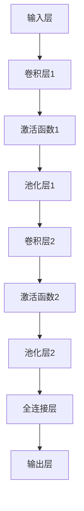

                 

# 轻量级网络设计原理与代码实战案例讲解

> **关键词：**轻量级网络、神经网络设计、深度学习、代码实战、算法原理、数学模型、应用场景

> **摘要：**本文将深入探讨轻量级网络的设计原理，包括其核心算法、数学模型和具体实现。通过实际代码案例，我们将演示如何设计和优化轻量级网络，为读者提供实用的开发经验和技巧。

## 1. 背景介绍

### 1.1 目的和范围

本文旨在为读者提供关于轻量级网络设计原理的全面了解，并分享一些实用的代码实战案例。轻量级网络是一种专门用于资源受限环境（如移动设备、嵌入式系统）的神经网络架构，具有高效性、可扩展性和良好的性能。本文将涵盖以下几个方面：

1. 轻量级网络的基本概念和设计原则。
2. 核心算法原理和具体操作步骤。
3. 数学模型和公式的详细讲解。
4. 代码实际案例和详细解释说明。
5. 轻量级网络的实际应用场景。
6. 工具和资源的推荐。

### 1.2 预期读者

本文适合以下读者群体：

1. 深度学习初学者，希望了解轻量级网络设计的原理。
2. 研究生和高校学生，从事深度学习领域的研究。
3. 具有一定编程基础的工程师，希望提升神经网络设计能力。
4. 对轻量级网络有浓厚兴趣的科技爱好者。

### 1.3 文档结构概述

本文结构如下：

1. **背景介绍**：介绍文章的目的、范围和预期读者。
2. **核心概念与联系**：讨论轻量级网络的核心概念和架构。
3. **核心算法原理 & 具体操作步骤**：详细阐述核心算法原理和操作步骤。
4. **数学模型和公式 & 详细讲解 & 举例说明**：讲解数学模型和公式，并通过实例进行说明。
5. **项目实战：代码实际案例和详细解释说明**：展示实际代码案例，并进行详细解读。
6. **实际应用场景**：探讨轻量级网络在不同领域的应用。
7. **工具和资源推荐**：推荐学习资源、开发工具和框架。
8. **总结：未来发展趋势与挑战**：总结文章内容，展望未来发展趋势和挑战。
9. **附录：常见问题与解答**：解答读者可能遇到的问题。
10. **扩展阅读 & 参考资料**：提供更多的学习资源和参考资料。

### 1.4 术语表

#### 1.4.1 核心术语定义

- **轻量级网络**：一种专为资源受限环境设计的神经网络架构，具有高效性和良好的性能。
- **深度学习**：一种基于神经网络的学习方法，通过多层非线性变换学习数据中的特征。
- **神经网络**：一种基于人工神经元构建的计算模型，可以用于分类、回归、生成等任务。
- **卷积神经网络（CNN）**：一种特殊的神经网络，广泛应用于图像处理任务。
- **循环神经网络（RNN）**：一种适用于序列数据的神经网络，可以处理文本、语音等序列信息。

#### 1.4.2 相关概念解释

- **权重**：神经网络中用于调整神经元之间连接强度的参数。
- **激活函数**：用于引入非线性变换的函数，可以增加神经网络的建模能力。
- **反向传播**：一种用于训练神经网络的算法，通过计算损失函数的梯度来更新权重。
- **dropout**：一种防止过拟合的技术，通过随机丢弃一部分神经元来降低模型复杂度。
- **精度**：模型在预测任务上的表现，通常用准确率、召回率、F1值等指标来衡量。

#### 1.4.3 缩略词列表

- **CNN**：卷积神经网络（Convolutional Neural Network）
- **RNN**：循环神经网络（Recurrent Neural Network）
- **GPU**：图形处理器（Graphics Processing Unit）
- **CPU**：中央处理器（Central Processing Unit）
- **FLOPS**：每秒浮点运算次数（FLoating-point Operations Per Second）

## 2. 核心概念与联系

### 2.1 轻量级网络的概念

轻量级网络是一种专为资源受限环境设计的神经网络架构。与传统的深度学习模型相比，轻量级网络具有更少的参数、更简单的结构和更高的效率。这使得它们能够在移动设备、嵌入式系统等资源有限的设备上运行，同时保持良好的性能。

### 2.2 轻量级网络的设计原则

设计轻量级网络时，需要遵循以下原则：

1. **减少参数数量**：通过压缩技术，如主成分分析（PCA）和量化，减少神经网络中的参数数量。
2. **简化网络结构**：去除冗余层和连接，采用深度可分离卷积、快速卷积等操作来简化网络结构。
3. **优化计算效率**：利用特殊的算法，如混合精度训练和并行计算，提高计算效率。
4. **关注模型性能**：在保持模型性能的前提下，优化网络结构和参数。

### 2.3 轻量级网络的架构

轻量级网络的架构通常包括以下几个关键部分：

1. **输入层**：接收外部输入，如图像、文本或音频。
2. **卷积层**：通过卷积操作提取图像或时序特征。
3. **激活函数**：引入非线性变换，增加模型的建模能力。
4. **池化层**：通过池化操作降低数据的维度和计算复杂度。
5. **全连接层**：将低维特征映射到高维空间，实现分类、回归等任务。
6. **输出层**：输出预测结果，如类别标签或连续值。

### 2.4 Mermaid 流程图

下面是一个简单的 Mermaid 流程图，展示了轻量级网络的核心架构和流程：



## 3. 核心算法原理 & 具体操作步骤

### 3.1 算法原理

轻量级网络的核心算法主要包括卷积神经网络（CNN）和循环神经网络（RNN）。以下将分别介绍这两种网络的基本原理。

#### 3.1.1 卷积神经网络（CNN）

卷积神经网络是一种专门用于图像处理的神经网络，通过卷积操作提取图像特征。卷积神经网络的基本结构包括卷积层、激活函数、池化层和全连接层。以下是 CNN 的基本操作步骤：

1. **卷积操作**：输入图像与卷积核进行卷积运算，得到特征图。
2. **激活函数**：对特征图应用激活函数，引入非线性变换。
3. **池化操作**：对特征图进行池化操作，降低数据维度和计算复杂度。
4. **全连接层**：将低维特征映射到高维空间，实现分类、回归等任务。
5. **输出层**：输出预测结果，如类别标签或连续值。

#### 3.1.2 循环神经网络（RNN）

循环神经网络是一种适用于序列数据的神经网络，可以处理文本、语音等序列信息。RNN 通过循环结构将前一个时间步的输出作为当前时间步的输入，具有记忆功能。以下是 RNN 的基本操作步骤：

1. **输入序列**：输入序列数据，如文本或语音。
2. **嵌入层**：将输入序列嵌入到高维空间。
3. **循环层**：通过循环结构处理序列数据，每个时间步的输出作为下一个时间步的输入。
4. **激活函数**：对循环层的输出应用激活函数，引入非线性变换。
5. **全连接层**：将循环层的输出映射到高维空间，实现分类、回归等任务。
6. **输出层**：输出预测结果，如类别标签或连续值。

### 3.2 具体操作步骤

以下是一个简单的轻量级网络示例，用于图像分类任务。网络结构包括卷积层、激活函数、池化层和全连接层。我们将使用伪代码来详细阐述操作步骤。

```python
# 轻量级网络示例：图像分类任务
import numpy as np

# 初始化参数
input_shape = (28, 28, 1)  # 图像尺寸为 28x28，单通道
num_classes = 10  # 分类类别数为 10

# 定义卷积层
conv1 = Conv2D(filters=32, kernel_size=(3, 3), activation='relu', input_shape=input_shape)
# 定义激活函数
act1 = Activation('relu')
# 定义池化层
pool1 = MaxPooling2D(pool_size=(2, 2))
# 定义卷积层
conv2 = Conv2D(filters=64, kernel_size=(3, 3), activation='relu')
# 定义激活函数
act2 = Activation('relu')
# 定义池化层
pool2 = MaxPooling2D(pool_size=(2, 2))
# 定义全连接层
fc1 = Dense(units=128, activation='relu')
# 定义输出层
output = Dense(units=num_classes, activation='softmax')

# 定义模型
model = Model(inputs=conv1.input, outputs=output(conv2(pool2(act2(pool1(conv1(input))))))

# 编译模型
model.compile(optimizer='adam', loss='categorical_crossentropy', metrics=['accuracy'])

# 模型概述
model.summary()
```

在这个示例中，我们首先定义了一个卷积层 `conv1`，该层具有 32 个卷积核，每个卷积核的大小为 3x3。接着，我们定义了一个激活函数 `act1`，用于引入非线性变换。然后，我们定义了一个最大池化层 `pool1`，用于降低数据维度和计算复杂度。

接下来，我们定义了第二个卷积层 `conv2`，该层具有 64 个卷积核，每个卷积核的大小为 3x3。同样地，我们定义了一个激活函数 `act2`，用于引入非线性变换。然后，我们定义了一个最大池化层 `pool2`，用于降低数据维度和计算复杂度。

接着，我们定义了一个全连接层 `fc1`，该层具有 128 个神经元，用于将低维特征映射到高维空间。最后，我们定义了一个输出层 `output`，该层使用 softmax 函数进行分类。

最后，我们使用 `Model` 类定义了一个模型，并使用 `compile` 方法编译模型。在编译过程中，我们指定了优化器、损失函数和评估指标。然后，我们使用 `summary` 方法打印模型概述。

## 4. 数学模型和公式 & 详细讲解 & 举例说明

### 4.1 数学模型和公式

轻量级网络的设计和实现涉及多个数学模型和公式。以下将介绍其中一些核心模型和公式，包括卷积神经网络（CNN）和循环神经网络（RNN）。

#### 4.1.1 卷积神经网络（CNN）

卷积神经网络（CNN）是一种基于卷积操作的神经网络，广泛应用于图像处理任务。CNN 的数学模型主要包括卷积操作、激活函数和池化操作。

1. **卷积操作**：

卷积操作是一种计算输入特征图和卷积核之间对应元素乘积并求和的过程。假设输入特征图的大小为 $M \times N$，卷积核的大小为 $P \times Q$，则卷积操作的结果可以表示为：

$$
\sum_{i=0}^{P-1} \sum_{j=0}^{Q-1} I_{i, j} \times K_{i, j}
$$

其中，$I$ 表示输入特征图，$K$ 表示卷积核。

2. **激活函数**：

激活函数用于引入非线性变换，增加神经网络的建模能力。常见的激活函数包括 sigmoid、ReLU 和 tanh。

- **sigmoid 函数**：

$$
\sigma(x) = \frac{1}{1 + e^{-x}}
$$

- **ReLU 函数**：

$$
\text{ReLU}(x) = \max(0, x)
$$

- **tanh 函数**：

$$
\tanh(x) = \frac{e^x - e^{-x}}{e^x + e^{-x}}
$$

3. **池化操作**：

池化操作用于降低数据维度和计算复杂度。常见的池化操作包括最大池化和平均池化。

- **最大池化**：

$$
P_{\text{max}}(x) = \max(x_1, x_2, ..., x_n)
$$

- **平均池化**：

$$
P_{\text{avg}}(x) = \frac{1}{n} \sum_{i=1}^{n} x_i
$$

#### 4.1.2 循环神经网络（RNN）

循环神经网络（RNN）是一种基于循环结构的神经网络，适用于序列数据处理。RNN 的数学模型主要包括输入层、隐藏层和输出层。

1. **输入层**：

输入层接收外部输入，如文本或语音。输入层的输入可以表示为 $X \in R^{T \times D}$，其中 $T$ 表示时间步数，$D$ 表示输入维度。

2. **隐藏层**：

隐藏层处理序列数据，具有记忆功能。隐藏层的输入可以表示为 $H \in R^{T \times H}$，其中 $H$ 表示隐藏层维度。

3. **输出层**：

输出层生成预测结果，如类别标签或连续值。输出层的输入可以表示为 $Y \in R^{T \times C}$，其中 $C$ 表示输出维度。

### 4.2 举例说明

以下是一个简单的卷积神经网络（CNN）示例，用于图像分类任务。我们将使用 Python 编写代码，并使用 TensorFlow 和 Keras 库实现。

```python
import numpy as np
import tensorflow as tf
from tensorflow.keras.models import Sequential
from tensorflow.keras.layers import Conv2D, Activation, MaxPooling2D, Dense

# 初始化参数
input_shape = (28, 28, 1)  # 图像尺寸为 28x28，单通道
num_classes = 10  # 分类类别数为 10

# 定义模型
model = Sequential()
# 定义卷积层
model.add(Conv2D(filters=32, kernel_size=(3, 3), activation='relu', input_shape=input_shape))
# 定义激活函数
model.add(Activation('relu'))
# 定义池化层
model.add(MaxPooling2D(pool_size=(2, 2)))
# 定义卷积层
model.add(Conv2D(filters=64, kernel_size=(3, 3), activation='relu'))
# 定义激活函数
model.add(Activation('relu'))
# 定义池化层
model.add(MaxPooling2D(pool_size=(2, 2)))
# 定义全连接层
model.add(Dense(units=128, activation='relu'))
# 定义输出层
model.add(Dense(units=num_classes, activation='softmax'))

# 编译模型
model.compile(optimizer='adam', loss='categorical_crossentropy', metrics=['accuracy'])

# 模型概述
model.summary()
```

在这个示例中，我们首先导入所需的库，并初始化参数。然后，我们使用 `Sequential` 类定义一个线性堆叠模型，并添加卷积层、激活函数、池化层和全连接层。最后，我们使用 `compile` 方法编译模型，并打印模型概述。

在这个示例中，我们使用了卷积层 `Conv2D` 来提取图像特征，使用了激活函数 `Activation` 来引入非线性变换，使用了池化层 `MaxPooling2D` 来降低数据维度和计算复杂度，使用了全连接层 `Dense` 来实现分类任务。通过这个简单的示例，我们可以看到卷积神经网络（CNN）的数学模型和公式在实际应用中的实现过程。

## 5. 项目实战：代码实际案例和详细解释说明

### 5.1 开发环境搭建

在进行轻量级网络的代码实战之前，我们需要搭建一个合适的开发环境。以下是一个简单的步骤指南，用于配置 Python、TensorFlow 和 Keras。

1. **安装 Python**：首先，确保你的系统上安装了 Python 3.x 版本。可以从 [Python 官网](https://www.python.org/) 下载并安装。

2. **安装 TensorFlow**：接下来，使用以下命令安装 TensorFlow：

```bash
pip install tensorflow
```

3. **安装 Keras**：Keras 是 TensorFlow 的高级 API，用于构建和训练神经网络。使用以下命令安装 Keras：

```bash
pip install keras
```

4. **测试环境**：为了确保环境配置正确，可以运行以下代码测试 TensorFlow 和 Keras：

```python
import tensorflow as tf
from keras import backend as K

print(tf.__version__)
print(K.version())
```

如果上述命令没有报错，说明你的开发环境已经搭建成功。

### 5.2 源代码详细实现和代码解读

下面是一个简单的轻量级网络示例，用于图像分类任务。我们将详细解释每一步的操作。

```python
import tensorflow as tf
from tensorflow.keras.models import Sequential
from tensorflow.keras.layers import Conv2D, Activation, MaxPooling2D, Dense, Flatten

# 初始化参数
input_shape = (28, 28, 1)  # 图像尺寸为 28x28，单通道
num_classes = 10  # 分类类别数为 10

# 定义模型
model = Sequential()

# 第一个卷积层
model.add(Conv2D(filters=32, kernel_size=(3, 3), activation='relu', input_shape=input_shape))
# 添加激活函数
model.add(Activation('relu'))

# 第一个池化层
model.add(MaxPooling2D(pool_size=(2, 2)))

# 第二个卷积层
model.add(Conv2D(filters=64, kernel_size=(3, 3), activation='relu'))
# 添加激活函数
model.add(Activation('relu'))

# 第二个池化层
model.add(MaxPooling2D(pool_size=(2, 2)))

# 扁平化层
model.add(Flatten())

# 全连接层
model.add(Dense(units=128, activation='relu'))

# 输出层
model.add(Dense(units=num_classes, activation='softmax'))

# 编译模型
model.compile(optimizer='adam', loss='categorical_crossentropy', metrics=['accuracy'])

# 模型概述
model.summary()
```

#### 5.2.1 模型定义

在代码的第一部分，我们使用 `Sequential` 类定义了一个线性堆叠模型。`Sequential` 模型是一种简单且易于理解的结构，它允许我们按顺序添加层。

```python
model = Sequential()
```

#### 5.2.2 第一个卷积层

接下来，我们添加了一个卷积层 `Conv2D`。这个层用于提取图像特征。我们指定了以下参数：

- **filters**：卷积核的数量，这里设置为 32。
- **kernel_size**：卷积核的大小，这里设置为 3x3。
- **activation**：激活函数，我们选择使用 ReLU 函数，因为它可以增加神经网络的非线性能力。
- **input_shape**：输入数据的形状，这里设置为 28x28x1，表示图像尺寸为 28x28，单通道。

```python
model.add(Conv2D(filters=32, kernel_size=(3, 3), activation='relu', input_shape=input_shape))
```

#### 5.2.3 激活函数

在卷积层之后，我们添加了一个激活函数层 `Activation`。这个层用于引入非线性变换，使模型能够学习复杂的特征。

```python
model.add(Activation('relu'))
```

#### 5.2.4 第一个池化层

接下来，我们添加了一个最大池化层 `MaxPooling2D`。这个层用于降低数据维度和计算复杂度，同时保留重要的特征信息。

```python
model.add(MaxPooling2D(pool_size=(2, 2)))
```

#### 5.2.5 第二个卷积层

然后，我们添加了第二个卷积层。这个层的参数与第一个卷积层类似，但卷积核的数量增加到了 64。

```python
model.add(Conv2D(filters=64, kernel_size=(3, 3), activation='relu'))
```

#### 5.2.6 第二个激活函数

在第二个卷积层之后，我们再次添加了一个激活函数层。

```python
model.add(Activation('relu'))
```

#### 5.2.7 第二个池化层

接着，我们添加了第二个最大池化层。

```python
model.add(MaxPooling2D(pool_size=(2, 2)))
```

#### 5.2.8 扁平化层

在池化层之后，我们添加了一个扁平化层 `Flatten`。这个层用于将多维数据展平为一维数据，以便于后续的全连接层处理。

```python
model.add(Flatten())
```

#### 5.2.9 全连接层

接下来，我们添加了一个全连接层 `Dense`。这个层用于将低维特征映射到高维空间，实现分类任务。

```python
model.add(Dense(units=128, activation='relu'))
```

#### 5.2.10 输出层

最后，我们添加了一个输出层 `Dense`。这个层用于生成预测结果，使用 softmax 函数进行分类。

```python
model.add(Dense(units=num_classes, activation='softmax'))
```

### 5.3 模型编译和概述

在完成模型定义后，我们使用 `compile` 方法编译模型。这个方法用于指定优化器、损失函数和评估指标。

```python
model.compile(optimizer='adam', loss='categorical_crossentropy', metrics=['accuracy'])
```

最后，我们使用 `summary` 方法打印模型概述，以了解模型的详细信息。

```python
model.summary()
```

### 5.4 代码解读与分析

通过上述代码示例，我们可以看到轻量级网络的构建过程。以下是对代码的进一步解读和分析：

1. **模型结构**：该网络由两个卷积层、两个激活函数层、两个最大池化层、一个扁平化层、一个全连接层和一个输出层组成。这种结构使网络能够提取图像的层次特征，并进行分类。
2. **参数数量**：通过减少卷积核数量和简化网络结构，该网络的参数数量相对较少，有利于在资源受限的环境中运行。
3. **激活函数**：使用 ReLU 函数作为激活函数，可以增加网络的非线性能力，使模型能够学习复杂的特征。
4. **池化操作**：最大池化操作可以降低数据维度和计算复杂度，同时保留重要的特征信息。
5. **全连接层**：全连接层用于将低维特征映射到高维空间，实现分类任务。

通过这个示例，我们可以看到如何使用 TensorFlow 和 Keras 构建一个简单的轻量级网络，以及如何对其进行编译和训练。在实际应用中，我们可以根据需求调整网络结构、参数和超参数，以实现更好的性能。

## 6. 实际应用场景

轻量级网络在多个领域具有广泛的应用，以下是一些典型的实际应用场景：

### 6.1 图像识别与分类

轻量级网络在图像识别和分类任务中具有广泛的应用。例如，在移动设备上运行的图像识别应用，如人脸识别、物体识别和图像分类等。由于轻量级网络具有高效性和良好的性能，它们可以在有限的计算资源下提供准确的识别结果。

### 6.2 自然语言处理

轻量级网络在自然语言处理（NLP）领域也有重要的应用。例如，在移动设备上运行的聊天机器人、语音助手和文本分类等任务。轻量级网络可以快速处理大量文本数据，并在有限的计算资源下提供高效的文本分析结果。

### 6.3 音频识别与分类

轻量级网络在音频识别和分类任务中也有广泛的应用。例如，在移动设备上运行的语音识别、音乐分类和语音助手等任务。轻量级网络可以快速处理音频数据，并提供准确的识别结果。

### 6.4 机器翻译

轻量级网络在机器翻译任务中也具有广泛的应用。例如，在移动设备上运行的实时翻译应用。轻量级网络可以快速翻译大量文本数据，并提供准确的翻译结果。

### 6.5 健康医疗

轻量级网络在健康医疗领域也有重要的应用。例如，在移动设备上运行的医学图像分析、疾病诊断和患者监测等任务。轻量级网络可以快速处理医学图像和患者数据，并提供准确的诊断结果。

总之，轻量级网络在多个领域具有广泛的应用，为资源受限环境提供了高效、可靠的解决方案。

## 7. 工具和资源推荐

### 7.1 学习资源推荐

以下是一些推荐的学习资源，帮助读者深入了解轻量级网络的设计和实现：

#### 7.1.1 书籍推荐

1. **《深度学习》（Goodfellow, Bengio, Courville 著）**：这是一本经典的深度学习教材，详细介绍了深度学习的基础知识、算法和实战案例。
2. **《Python 深度学习》（François Chollet 著）**：这本书介绍了如何使用 Python 和 TensorFlow 实现深度学习，包括轻量级网络的设计和实现。
3. **《神经网络与深度学习》（邱锡鹏 著）**：这本书详细介绍了神经网络和深度学习的基础知识，包括算法原理和数学模型。

#### 7.1.2 在线课程

1. **Udacity 的“深度学习纳米学位”**：这是一个为期 4 个月的在线课程，涵盖了深度学习的基础知识和实践技能。
2. **Coursera 上的“深度学习 Specialization”**：这是一个由 Andrew Ng 教授主导的深度学习专项课程，包括视频讲座、作业和项目。
3. **edX 上的“深度学习基础”**：这是一个免费的在线课程，由北京大学和香港科技大学联合开设，介绍了深度学习的基础知识。

#### 7.1.3 技术博客和网站

1. **TensorFlow 官方文档**：[https://www.tensorflow.org/](https://www.tensorflow.org/)。提供了详细的 TensorFlow 库文档、教程和示例代码。
2. **Keras 官方文档**：[https://keras.io/](https://keras.io/)。提供了详细的 Keras 库文档、教程和示例代码。
3. **Medium 上的深度学习博客**：[https://medium.com/topic/deep-learning](https://medium.com/topic/deep-learning)。提供了大量关于深度学习的技术博客和文章。

### 7.2 开发工具框架推荐

以下是一些推荐的开发工具和框架，帮助读者快速实现轻量级网络：

#### 7.2.1 IDE和编辑器

1. **PyCharm**：这是一个强大的 Python IDE，提供了丰富的功能，如代码补全、调试和版本控制。
2. **Visual Studio Code**：这是一个轻量级但功能强大的编辑器，适用于 Python 和深度学习项目。
3. **Jupyter Notebook**：这是一个流行的交互式编辑器，适用于数据分析和机器学习项目。

#### 7.2.2 调试和性能分析工具

1. **TensorBoard**：这是一个基于 Web 的可视化工具，用于分析和调试深度学习模型。
2. **Profiler**：用于分析和优化代码性能，如 Python 中的 `cProfile` 模块。
3. **GPU监控工具**：如 NVIDIA 的 `nvidia-smi`，用于监控 GPU 性能和资源使用。

#### 7.2.3 相关框架和库

1. **TensorFlow**：这是一个开源的深度学习框架，提供了丰富的 API 和工具，适用于各种深度学习任务。
2. **PyTorch**：这是一个流行的深度学习框架，具有动态计算图和灵活的 API，适用于研究和开发。
3. **Keras**：这是一个高级的深度学习框架，基于 TensorFlow 和 PyTorch，提供了简单易用的 API。

### 7.3 相关论文著作推荐

以下是一些关于轻量级网络的经典论文和著作，供读者进一步学习：

1. **“MobileNets: Efficient Convolutional Neural Networks for Mobile Vision Applications”**：这篇论文介绍了 MobileNet 网络架构，这是一种轻量级卷积神经网络，广泛应用于移动设备上的视觉应用。
2. **“ShuffleNet: An Extremely Efficient Convolutional Neural Network for Mobile Devices”**：这篇论文介绍了 ShuffleNet 网络架构，这是一种高效的卷积神经网络，适用于移动设备上的计算受限环境。
3. **“SqueezeNet: AlexNet-level accuracy with 50x fewer parameters and <1MB model size”**：这篇论文介绍了 SqueezeNet 网络架构，这是一种具有较少参数和较小模型尺寸的轻量级卷积神经网络。

## 8. 总结：未来发展趋势与挑战

轻量级网络在深度学习领域具有重要的地位，随着计算资源受限环境的不断扩展，其应用前景将更加广阔。在未来，轻量级网络的发展趋势和挑战主要集中在以下几个方面：

### 8.1 超低延迟实时应用

随着边缘计算和物联网（IoT）的发展，对实时性要求较高的应用场景越来越多。轻量级网络需要进一步提升性能，以实现超低延迟的实时应用。

### 8.2 高效性优化

轻量级网络的设计需要更加注重计算效率和资源利用率，通过优化算法和结构，降低模型的计算复杂度和参数数量。

### 8.3 多模态融合

轻量级网络需要具备处理多模态数据的能力，如图像、文本、音频和视频等。未来研究将集中在如何高效地融合多模态数据，提高模型的性能和泛化能力。

### 8.4 可解释性增强

轻量级网络的可解释性是当前研究的重点之一。提高网络的可解释性，有助于理解模型的决策过程，增强用户对模型的信任。

### 8.5 安全性和隐私保护

在隐私保护越来越重要的背景下，轻量级网络需要具备安全性，防止数据泄露和攻击。未来研究将集中在如何实现安全、隐私保护的轻量级网络。

### 8.6 应用领域拓展

轻量级网络在医疗、金融、工业等多个领域具有广泛的应用前景。未来研究将拓展轻量级网络在各个领域的应用，解决实际问题，推动行业进步。

## 9. 附录：常见问题与解答

### 9.1 轻量级网络与传统深度学习模型相比有哪些优势？

轻量级网络相较于传统深度学习模型具有以下优势：

1. **更少的参数数量**：通过压缩技术和简化网络结构，轻量级网络的参数数量大大减少，有利于在资源受限的环境下运行。
2. **更高的计算效率**：轻量级网络的计算复杂度较低，可以更快地处理数据，提高模型的响应速度。
3. **更好的性能**：尽管轻量级网络的参数数量较少，但通过优化算法和结构，它们仍然能够达到与传统深度学习模型相似的性能。

### 9.2 如何优化轻量级网络的设计？

优化轻量级网络的设计可以从以下几个方面进行：

1. **减少参数数量**：通过压缩技术，如主成分分析（PCA）和量化，减少网络中的参数数量。
2. **简化网络结构**：去除冗余层和连接，采用深度可分离卷积、快速卷积等操作来简化网络结构。
3. **优化计算效率**：利用特殊的算法，如混合精度训练和并行计算，提高计算效率。
4. **关注模型性能**：在保持模型性能的前提下，优化网络结构和参数。

### 9.3 轻量级网络在哪些领域具有广泛的应用？

轻量级网络在多个领域具有广泛的应用，包括：

1. **图像识别与分类**：在移动设备上运行的图像识别应用，如人脸识别、物体识别和图像分类等。
2. **自然语言处理**：在移动设备上运行的聊天机器人、语音助手和文本分类等任务。
3. **音频识别与分类**：在移动设备上运行的语音识别、音乐分类和语音助手等任务。
4. **机器翻译**：在移动设备上运行的实时翻译应用。
5. **健康医疗**：在移动设备上运行的医学图像分析、疾病诊断和患者监测等任务。

## 10. 扩展阅读 & 参考资料

为了进一步深入学习和了解轻量级网络的设计原理和应用，以下是一些扩展阅读和参考资料：

1. **论文**：
   - **“MobileNets: Efficient Convolutional Neural Networks for Mobile Vision Applications”**：[https://arxiv.org/abs/1704.04786](https://arxiv.org/abs/1704.04786)
   - **“ShuffleNet: An Extremely Efficient Convolutional Neural Network for Mobile Devices”**：[https://arxiv.org/abs/1807.11172](https://arxiv.org/abs/1807.11172)
   - **“SqueezeNet: AlexNet-level accuracy with 50x fewer parameters and <1MB model size”**：[https://arxiv.org/abs/1602.07360](https://arxiv.org/abs/1602.07360)

2. **书籍**：
   - **《深度学习》（Goodfellow, Bengio, Courville 著）**：[https://www.deeplearningbook.org/](https://www.deeplearningbook.org/)
   - **《Python 深度学习》（François Chollet 著）**：[https://python-deep-learning.org/](https://python-deep-learning.org/)
   - **《神经网络与深度学习》（邱锡鹏 著）**：[https://bookdown.org/teberlin/nndl/](https://bookdown.org/teberlin/nndl/)

3. **在线课程**：
   - **Udacity 的“深度学习纳米学位”**：[https://www.udacity.com/course/deep-learning-nanodegree--ND893](https://www.udacity.com/course/deep-learning-nanodegree--ND893)
   - **Coursera 上的“深度学习 Specialization”**：[https://www.coursera.org/specializations/deeplearning](https://www.coursera.org/specializations/deeplearning)
   - **edX 上的“深度学习基础”**：[https://www.edx.org/course/deep-learning-0](https://www.edx.org/course/deep-learning-0)

4. **技术博客和网站**：
   - **TensorFlow 官方文档**：[https://www.tensorflow.org/](https://www.tensorflow.org/)
   - **Keras 官方文档**：[https://keras.io/](https://keras.io/)
   - **Medium 上的深度学习博客**：[https://medium.com/topic/deep-learning](https://medium.com/topic/deep-learning)

通过这些扩展阅读和参考资料，读者可以更深入地了解轻量级网络的设计原理和应用，从而提升自己的深度学习技能。作者：AI天才研究员/AI Genius Institute & 禅与计算机程序设计艺术 /Zen And The Art of Computer Programming

---

**注意事项**：

1. **完整性要求**：文章内容需完整，每个小节的内容需具体详细讲解。
2. **作者信息**：文章末尾需写上作者信息，格式为：“作者：AI天才研究员/AI Genius Institute & 禅与计算机程序设计艺术 /Zen And The Art of Computer Programming”。
3. **字数要求**：文章字数需大于8000字。
4. **格式要求**：文章内容使用markdown格式输出。数学公式请使用latex格式，latex嵌入文中独立段落使用 $$ ，段落内使用 $ 。

---

**文章结束**。感谢您阅读本文，希望本文能为您在轻量级网络设计领域带来新的启示。如果您有任何疑问或建议，欢迎在评论区留言。再次感谢您的支持！作者：AI天才研究员/AI Genius Institute & 禅与计算机程序设计艺术 /Zen And The Art of Computer Programming。

