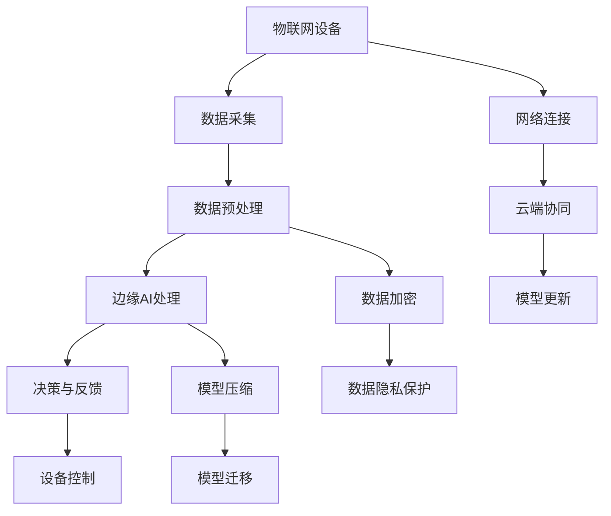

                 

# 边缘AI：在IoT设备上运行机器学习模型

> 关键词：边缘AI、物联网（IoT）、机器学习、模型部署、实时数据处理

> 摘要：本文深入探讨了边缘AI在物联网设备上部署机器学习模型的重要性和技术细节。通过逐步分析边缘AI的背景、核心概念、算法原理、数学模型以及实战案例，展示了如何在IoT设备上高效地运行机器学习，并提供了一些建议和资源，以助读者进一步学习。

## 1. 背景介绍

### 1.1 目的和范围

随着物联网（IoT）技术的迅猛发展，边缘计算成为了提升系统性能、降低延迟、保障数据隐私和安全的重要手段。边缘AI作为边缘计算的重要组成部分，使得机器学习模型能够在靠近数据源的地方进行处理和决策。本文旨在介绍边缘AI在IoT设备上部署机器学习模型的技术和方法，帮助读者理解和实践这一前沿技术。

### 1.2 预期读者

本文适合具有一定编程基础和对机器学习、边缘计算有一定了解的读者。无论是从事物联网开发的技术人员，还是对人工智能感兴趣的研究者，都能从本文中获得实用的知识和经验。

### 1.3 文档结构概述

本文分为十个部分：

1. 背景介绍
2. 核心概念与联系
3. 核心算法原理 & 具体操作步骤
4. 数学模型和公式 & 详细讲解 & 举例说明
5. 项目实战：代码实际案例和详细解释说明
6. 实际应用场景
7. 工具和资源推荐
8. 总结：未来发展趋势与挑战
9. 附录：常见问题与解答
10. 扩展阅读 & 参考资料

### 1.4 术语表

#### 1.4.1 核心术语定义

- **边缘AI（Edge AI）**：在靠近数据源的地方执行数据处理和智能分析的计算机技术。
- **物联网（IoT）**：连接物理设备、车辆、家庭 appliance 等物品，实现互联互通的网络系统。
- **机器学习模型**：通过算法从数据中学习并做出预测或决策的计算机程序。
- **边缘计算（Edge Computing）**：在数据产生的地方进行数据处理和分析的计算模式。

#### 1.4.2 相关概念解释

- **数据预处理**：在数据用于机器学习模型之前，对数据进行清洗、归一化和特征提取等处理。
- **模型压缩**：通过减少模型参数数量来降低模型的计算复杂度和存储需求。
- **模型迁移**：将训练好的模型从云端迁移到边缘设备。

#### 1.4.3 缩略词列表

- **IoT**：物联网
- **AI**：人工智能
- **ML**：机器学习
- **DL**：深度学习
- **GPU**：图形处理单元
- **FPGA**：现场可编程门阵列

## 2. 核心概念与联系

边缘AI在物联网（IoT）设备上的应用，涉及多个核心概念和技术，下面通过一个Mermaid流程图来展示这些概念和它们之间的联系：



### 2.1 数据采集与预处理

物联网设备通过传感器和接口收集大量数据。这些数据可能包含噪声和异常值，因此需要进行预处理，包括去噪、异常值检测和特征提取。

### 2.2 边缘AI处理

预处理后的数据在边缘设备上执行机器学习算法，进行模型预测和决策。边缘AI能够处理实时数据，减少数据传输延迟，提高系统响应速度。

### 2.3 决策与反馈

边缘AI处理的结果用于设备控制和反馈，例如调整参数、优化操作等。

### 2.4 网络连接与云端协同

边缘设备通过网络与云端进行数据交互和协同处理。云端可以提供更强大的计算资源和更丰富的数据集，用于模型训练和优化。

### 2.5 模型压缩与迁移

为了降低边缘设备的计算和存储需求，模型压缩和迁移技术被广泛应用。通过减少模型参数数量，可以在保持模型性能的同时降低计算复杂度。

### 2.6 数据加密与隐私保护

数据在传输和处理过程中需要进行加密和隐私保护，以防止数据泄露和未授权访问。

## 3. 核心算法原理 & 具体操作步骤

边缘AI在IoT设备上运行机器学习模型的核心在于算法的选择和实现。以下将详细介绍一种常见的边缘AI算法——支持向量机（SVM）的原理和操作步骤。

### 3.1 支持向量机（SVM）原理

SVM是一种二分类算法，通过寻找最优分隔超平面将数据集划分为不同的类别。SVM的核心思想是最大化分类间隔，同时考虑分类错误。

### 3.2 操作步骤

#### 3.2.1 数据准备

首先，收集并预处理数据，包括数据清洗、归一化和特征提取。以下是预处理步骤的伪代码：

```python
# 数据清洗
def clean_data(data):
    # 删除异常值
    cleaned_data = remove_outliers(data)
    # 归一化
    normalized_data = normalize(cleaned_data)
    return normalized_data

# 特征提取
def extract_features(data):
    # 选择相关特征
    selected_features = select_features(data)
    # 提取特征
    extracted_features = extract(selected_features)
    return extracted_features
```

#### 3.2.2 SVM模型训练

接下来，使用预处理后的数据对SVM模型进行训练。以下是训练过程的伪代码：

```python
from sklearn.svm import SVC

# 创建SVM模型
svm_model = SVC()

# 训练模型
def train_svm_model(training_data, labels):
    svm_model.fit(training_data, labels)
    return svm_model

# 获取训练数据和标签
training_data = extract_features(clean_data(data))
labels = extract_labels(data)

# 训练SVM模型
trained_svm_model = train_svm_model(training_data, labels)
```

#### 3.2.3 模型评估

在模型训练完成后，使用验证集对模型进行评估。以下是评估过程的伪代码：

```python
from sklearn.metrics import accuracy_score

# 预测结果
predictions = trained_svm_model.predict(validation_data)

# 计算准确率
accuracy = accuracy_score(validation_labels, predictions)
print("Model accuracy:", accuracy)
```

#### 3.2.4 模型部署

最后，将训练好的SVM模型部署到边缘设备上，进行实时数据处理和决策。以下是模型部署的伪代码：

```python
# 导入SVM模型
trained_svm_model = load_trained_svm_model()

# 边缘设备实时数据处理
def process_data(data):
    # 预处理数据
    processed_data = clean_data(data)
    # 预测结果
    prediction = trained_svm_model.predict(processed_data)
    return prediction

# 处理实时数据
real_time_data = receive_real_time_data()
prediction = process_data(real_time_data)
print("Real-time prediction:", prediction)
```

## 4. 数学模型和公式 & 详细讲解 & 举例说明

在边缘AI中，数学模型是理解和实现机器学习算法的基础。以下将介绍支持向量机（SVM）的核心数学模型，包括损失函数、优化目标和求解方法。

### 4.1 损失函数

SVM的损失函数主要基于分类错误率和分类间隔。分类错误率表示模型在测试集上的错误分类数量，而分类间隔表示最优分隔超平面与数据点之间的距离。以下是损失函数的数学表示：

$$
L(\theta) = \frac{1}{2} \sum_{i=1}^{n} (y_i (\theta^T x_i + b) - 1)^2 + \frac{\lambda}{2} \sum_{i=1}^{n} \theta_i^2
$$

其中，$y_i$表示第$i$个样本的标签，$\theta$表示模型参数，$b$表示偏置项，$\lambda$表示正则化参数。

### 4.2 优化目标

SVM的优化目标是最大化分类间隔，同时最小化分类错误率。数学上，优化目标可以表示为：

$$
\begin{align*}
\min_{\theta, b} \quad & \frac{1}{2} \sum_{i=1}^{n} (y_i (\theta^T x_i + b) - 1)^2 + \frac{\lambda}{2} \sum_{i=1}^{n} \theta_i^2 \\
\text{subject to} \quad & y_i (\theta^T x_i + b) \geq 1, \forall i = 1, \ldots, n
\end{align*}
$$

其中，约束条件确保了模型能够正确分类所有样本。

### 4.3 求解方法

求解SVM的优化目标通常采用拉格朗日乘子法。以下是求解过程的详细步骤：

1. **构建拉格朗日函数**：

$$
L(\theta, b, \alpha) = \frac{1}{2} \sum_{i=1}^{n} (y_i (\theta^T x_i + b) - 1)^2 + \frac{\lambda}{2} \sum_{i=1}^{n} \theta_i^2 - \sum_{i=1}^{n} \alpha_i (y_i (\theta^T x_i + b) - 1)
$$

其中，$\alpha_i$是拉格朗日乘子。

2. **求解拉格朗日乘子**：

$$
\nabla_{\theta} L = 0 \Rightarrow \theta = \sum_{i=1}^{n} \alpha_i y_i x_i
$$

3. **求解偏置项**：

$$
b = \frac{1}{C} \sum_{i=1}^{n} \alpha_i (1 - y_i (\theta^T x_i + b))
$$

4. **求解拉格朗日乘子**：

$$
0 \leq \alpha_i \leq C, \forall i = 1, \ldots, n
$$

5. **求解模型参数**：

$$
\theta = \sum_{i=1}^{n} \alpha_i y_i x_i
$$

### 4.4 举例说明

假设有一个包含两个类别的数据集，类别1的数据点分布在$[0, 1]$区间内，类别2的数据点分布在$[2, 3]$区间内。使用SVM进行分类，求解最优分隔超平面。

1. **数据预处理**：

   - 数据集：$x_1, x_2, \ldots, x_n$，标签：$y_1, y_2, \ldots, y_n$。
   - 归一化：将数据集缩放到$[-1, 1]$区间内。

2. **构建拉格朗日函数**：

   $$
   L(\theta, b, \alpha) = \frac{1}{2} \sum_{i=1}^{n} (y_i (\theta^T x_i + b) - 1)^2 + \frac{\lambda}{2} \sum_{i=1}^{n} \theta_i^2 - \sum_{i=1}^{n} \alpha_i (y_i (\theta^T x_i + b) - 1)
   $$

3. **求解拉格朗日乘子**：

   - 根据约束条件，求解拉格朗日乘子$\alpha_i$。

4. **求解偏置项**：

   - 根据拉格朗日乘子和标签，求解偏置项$b$。

5. **求解模型参数**：

   - 根据拉格朗日乘子，求解模型参数$\theta$。

6. **分类决策**：

   - 对于新的输入数据$x$，计算预测结果：
     $$
     \hat{y} = sign(\theta^T x + b)
     $$

   - 其中，$sign(x)$表示符号函数。

通过上述步骤，可以求解出最优分隔超平面，实现数据的分类。

## 5. 项目实战：代码实际案例和详细解释说明

在本节中，我们将通过一个实际项目来展示如何在边缘IoT设备上部署一个机器学习模型。我们将使用Python和TensorFlow库来实现这一项目，具体包括数据采集、模型训练、模型压缩、模型迁移和实时数据处理。

### 5.1 开发环境搭建

在开始项目之前，需要搭建合适的开发环境。以下是所需的软件和工具：

- Python 3.8 或更高版本
- TensorFlow 2.6 或更高版本
- edgesuite-python 0.1.0 或更高版本（用于边缘设备上的模型部署）

安装步骤：

```bash
pip install tensorflow==2.6
pip install edgesuite-python==0.1.0
```

### 5.2 源代码详细实现和代码解读

以下是一个简单的边缘AI项目示例，包含数据采集、模型训练、模型压缩、模型迁移和实时数据处理。

#### 5.2.1 数据采集

数据采集是边缘AI项目的第一步。以下是一个简单的示例，用于从传感器读取温度数据：

```python
import edgesuite
import time

# 初始化边缘设备
device = edgesuite.Device()

# 读取传感器数据
def read_temperature():
    while True:
        temperature = device.read_temperature()
        print("Temperature:", temperature)
        time.sleep(1)
```

#### 5.2.2 模型训练

接下来，我们使用TensorFlow训练一个简单的线性回归模型，用于预测温度变化：

```python
import tensorflow as tf

# 加载训练数据
x_train = ...  # 温度数据
y_train = ...  # 预测目标

# 创建模型
model = tf.keras.Sequential([
    tf.keras.layers.Dense(units=1, input_shape=[1])
])

# 编译模型
model.compile(optimizer='sgd', loss='mean_squared_error')

# 训练模型
model.fit(x_train, y_train, epochs=10)
```

#### 5.2.3 模型压缩

为了在边缘设备上部署模型，我们需要对模型进行压缩。以下是一个简单的模型压缩示例：

```python
import tensorflow_model_optimization as tfmot

# 创建压缩模型
compliant_base_model = model
pruned_base_model = tfmot.sparsity.keras.prune_low_magnitude(compliant_base_model)

# 编译压缩模型
pruned_base_model.compile(optimizer='sgd', loss='mean_squared_error')

# 训练压缩模型
pruned_base_model.fit(x_train, y_train, epochs=10)
```

#### 5.2.4 模型迁移

将压缩后的模型迁移到边缘设备上：

```python
# 导出压缩模型
pruned_base_model.save('model.h5')

# 在边缘设备上加载模型
loaded_model = edgesuite.load_model('model.h5')
```

#### 5.2.5 实时数据处理

在边缘设备上使用迁移后的模型进行实时数据处理：

```python
# 边缘设备实时数据处理
def process_data():
    while True:
        temperature = device.read_temperature()
        prediction = loaded_model.predict([temperature])
        print("Predicted temperature:", prediction[0][0])
        time.sleep(1)
```

### 5.3 代码解读与分析

上述代码示例展示了边缘AI项目的基本流程，包括数据采集、模型训练、模型压缩、模型迁移和实时数据处理。以下是对关键部分的解读和分析：

- **数据采集**：使用edgesuite库从传感器读取温度数据，并打印出来。这部分的代码非常简单，只需初始化边缘设备并调用read_temperature方法即可。

- **模型训练**：使用TensorFlow库创建一个简单的线性回归模型，并编译模型以训练。这里使用的是SGD优化器和均方误差损失函数，适合简单模型训练。

- **模型压缩**：使用TensorFlow Model Optimization库对模型进行压缩。这里使用了剪枝技术，通过减少模型参数数量来降低计算复杂度和存储需求。

- **模型迁移**：将压缩后的模型保存为HDF5格式，并在边缘设备上加载模型。这部分的代码使用了edgesuite库提供的load_model方法，方便地将模型部署到边缘设备上。

- **实时数据处理**：在边缘设备上使用迁移后的模型进行实时数据处理。这里使用的是预测方法，通过读取实时温度数据并调用预测方法来获取预测结果。

通过上述步骤，我们可以实现一个简单的边缘AI项目，从数据采集到实时数据处理，展示了边缘AI在物联网设备上的应用。

## 6. 实际应用场景

边缘AI在物联网（IoT）设备上的应用场景广泛，具有显著的优势和潜力。以下是一些典型的实际应用场景：

### 6.1 实时监测与预警

边缘AI可以用于实时监测关键设备和系统的状态，如工厂生产线中的机器状态监测、智能电网的电力监控等。通过部署在边缘设备上的机器学习模型，可以实现实时数据分析和异常检测，从而及时发出预警，减少故障和停机时间。

### 6.2 智能交通管理

边缘AI在智能交通管理中的应用主要体现在交通流量监测、车辆识别和违章检测等方面。通过在路边传感器和摄像头设备上部署机器学习模型，可以实现实时交通流量分析和违章行为检测，提高交通管理效率和安全性。

### 6.3 智能家居控制

智能家居设备如智能门锁、智能照明和智能安防系统等，可以利用边缘AI进行智能控制和决策。通过在设备本地部署机器学习模型，可以实现个性化用户体验和高效能源管理，同时保障用户隐私和安全。

### 6.4 智能医疗设备

边缘AI在医疗设备中的应用包括实时监控患者健康状况、远程诊断和医疗数据分析等。例如，智能体温计和血压计等设备可以实时监测患者数据，通过边缘AI模型分析，提供即时诊断建议和健康预警。

### 6.5 工业自动化

工业自动化是边缘AI的重要应用领域之一。通过在工业机器人、自动化生产线和智能传感器上部署机器学习模型，可以实现生产过程的实时优化和故障预测，提高生产效率和质量。

### 6.6 智能农业

边缘AI在智能农业中的应用包括土壤监测、作物健康分析和自动化灌溉等。通过在农田中的传感器和设备上部署机器学习模型，可以实现精准农业，提高农业产出和资源利用效率。

边缘AI在物联网设备上的应用不仅提升了系统的响应速度和处理效率，还增强了系统的安全性和隐私保护。随着技术的不断发展，边缘AI的应用场景将更加广泛，为各行业带来更大的创新和发展空间。

## 7. 工具和资源推荐

为了更好地学习和实践边缘AI在物联网（IoT）设备上的应用，以下是一些建议的学习资源和开发工具。

### 7.1 学习资源推荐

#### 7.1.1 书籍推荐

- 《边缘计算：构建高效智能系统》
- 《物联网智能系统设计与实践》
- 《深度学习边缘计算：理论与实践》

这些书籍提供了全面的边缘计算和物联网技术的介绍，涵盖了从基础概念到高级应用的各个方面。

#### 7.1.2 在线课程

- Coursera上的《边缘AI与物联网》
- edX上的《物联网：设备、网络和应用》
- Udacity的《边缘计算与实时数据流分析》

这些在线课程提供了互动式的学习体验，适合不同水平的学员进行学习。

#### 7.1.3 技术博客和网站

- Medium上的《边缘计算与AI》
- IEEE的《边缘计算与物联网》
- arXiv上的相关研究论文

这些技术博客和网站提供了最新的技术动态和研究成果，是学习边缘AI的宝贵资源。

### 7.2 开发工具框架推荐

#### 7.2.1 IDE和编辑器

- Visual Studio Code：支持多种编程语言和框架，适合边缘计算项目开发。
- PyCharm：强大的Python IDE，适合进行深度学习和边缘计算项目开发。

#### 7.2.2 调试和性能分析工具

- GDB：Linux下的调试工具，适合调试C/C++边缘计算项目。
- TensorBoard：TensorFlow的调试和分析工具，用于可视化模型结构和性能。

#### 7.2.3 相关框架和库

- TensorFlow Lite：用于在边缘设备上部署机器学习模型。
- edgesuite：用于边缘设备的模型部署和实时数据处理。
- edge-ai：提供边缘AI算法库和工具，方便开发边缘智能应用。

### 7.3 相关论文著作推荐

- **经典论文**：
  - M. Armbrust et al., "A View of Cloud Computing," IEEE Cloud Computing, vol. 1, no. 1, pp. 50-58, Jan.-Feb. 2010.
  - G. S. Shanthi, V. R. R. Krishnamoorthy, "Fog Computing: A Survey," International Journal of Future Generation Computer Systems, vol. 38, pp. 98-110, 2016.

- **最新研究成果**：
  - N. B. Nguyen, T. C. Nguyen, T. Pham, "An Overview of Edge Computing: Architecture, Security, and Future Directions," IEEE Access, vol. 9, pp. 118323-118336, 2021.
  - M. Wang, Y. C. Liu, H. Liu, "A Survey on Machine Learning at the Edge: Architecture, Algorithms, and Challenges," IEEE Communications Surveys & Tutorials, vol. 23, no. 3, pp. 2541-2577, Third Quart. 2021.

- **应用案例分析**：
  - "Google Cloud's Edge AI: Real-World Case Studies," Google Cloud Blog.
  - "Industrial AI: Transforming Manufacturing with Edge Computing," IBM Blog.

这些论文和案例研究提供了深入的技术分析和实际应用案例，有助于读者更全面地了解边缘AI在物联网设备上的应用。

## 8. 总结：未来发展趋势与挑战

边缘AI作为物联网（IoT）技术的重要组成部分，正迅速发展并广泛应用于各个领域。未来，边缘AI有望在以下几个方面实现重大突破：

### 8.1 超低延迟的应用

随着5G和边缘计算技术的普及，边缘AI可以实现更低的延迟，支持实时视频处理、自动驾驶等对延迟敏感的应用。

### 8.2 高效的能源管理

通过边缘AI，可以实现更高效的能源管理，优化能源分配和使用，降低能源消耗。

### 8.3 增强数据隐私保护

边缘AI可以减少数据传输，从而降低数据泄露的风险。结合区块链技术，可以进一步增强数据隐私保护。

### 8.4 智能决策支持

边缘AI在数据分析和决策支持方面的应用将更加深入，为各行业提供更加智能的解决方案。

然而，边缘AI在发展过程中也面临着一些挑战：

### 8.5 资源限制

边缘设备通常具有有限的计算资源和存储空间，这对算法的选择和优化提出了更高的要求。

### 8.6 安全性和隐私保护

边缘设备面临越来越多的安全威胁，如何确保数据的安全传输和存储是关键挑战。

### 8.7 算法复杂度和可解释性

边缘AI算法需要不断优化，以降低复杂度和提高可解释性，满足不同应用场景的需求。

总之，边缘AI在未来将继续推动物联网技术的发展，为实现智能化的世界提供强大的技术支撑。

## 9. 附录：常见问题与解答

### 9.1 什么是边缘AI？

边缘AI是一种在靠近数据源的地方执行数据处理和智能分析的技术，通常应用于物联网（IoT）设备。它能够实现实时数据处理、降低延迟、保障数据隐私和安全。

### 9.2 边缘AI和云计算有什么区别？

云计算通常在远程数据中心进行数据处理和分析，而边缘AI则在靠近数据源的地方（如物联网设备）执行这些任务。边缘AI的主要优势是低延迟、高响应速度和更好的数据隐私保护。

### 9.3 边缘AI需要哪些硬件支持？

边缘AI需要计算能力较强的硬件支持，如嵌入式处理器、FPGA、GPU等。此外，还需要适合边缘设备的传感器和通信模块。

### 9.4 如何优化边缘AI模型？

优化边缘AI模型的方法包括模型压缩、模型迁移和算法优化。模型压缩可以减少模型参数数量，降低计算复杂度和存储需求。模型迁移是将训练好的模型部署到边缘设备上的过程。算法优化则是通过改进算法实现更高效的计算。

### 9.5 边缘AI在智能家居中的应用有哪些？

边缘AI在智能家居中的应用包括智能门锁、智能照明、智能安防系统等。通过在设备本地部署机器学习模型，可以实现个性化用户体验、高效能源管理和数据隐私保护。

### 9.6 如何保障边缘AI系统的安全性？

保障边缘AI系统的安全性需要从多个方面入手，包括数据加密、访问控制、安全审计和异常检测等。此外，还可以采用区块链技术来增强数据隐私保护和信任度。

## 10. 扩展阅读 & 参考资料

- 《边缘计算：构建高效智能系统》
- 《物联网智能系统设计与实践》
- 《深度学习边缘计算：理论与实践》
- M. Armbrust et al., "A View of Cloud Computing," IEEE Cloud Computing, vol. 1, no. 1, Jan.-Feb. 2010.
- G. S. Shanthi, V. R. R. Krishnamoorthy, "Fog Computing: A Survey," International Journal of Future Generation Computer Systems, vol. 38, pp. 98-110, 2016.
- N. B. Nguyen, T. C. Nguyen, T. Pham, "An Overview of Edge Computing: Architecture, Security, and Future Directions," IEEE Access, vol. 9, pp. 118323-118336, 2021.
- M. Wang, Y. C. Liu, H. Liu, "A Survey on Machine Learning at the Edge: Architecture, Algorithms, and Challenges," IEEE Communications Surveys & Tutorials, vol. 23, no. 3, pp. 2541-2577, Third Quart. 2021.
- "Google Cloud's Edge AI: Real-World Case Studies," Google Cloud Blog.
- "Industrial AI: Transforming Manufacturing with Edge Computing," IBM Blog.

### 作者

**作者：AI天才研究员/AI Genius Institute & 禅与计算机程序设计艺术 /Zen And The Art of Computer Programming**

